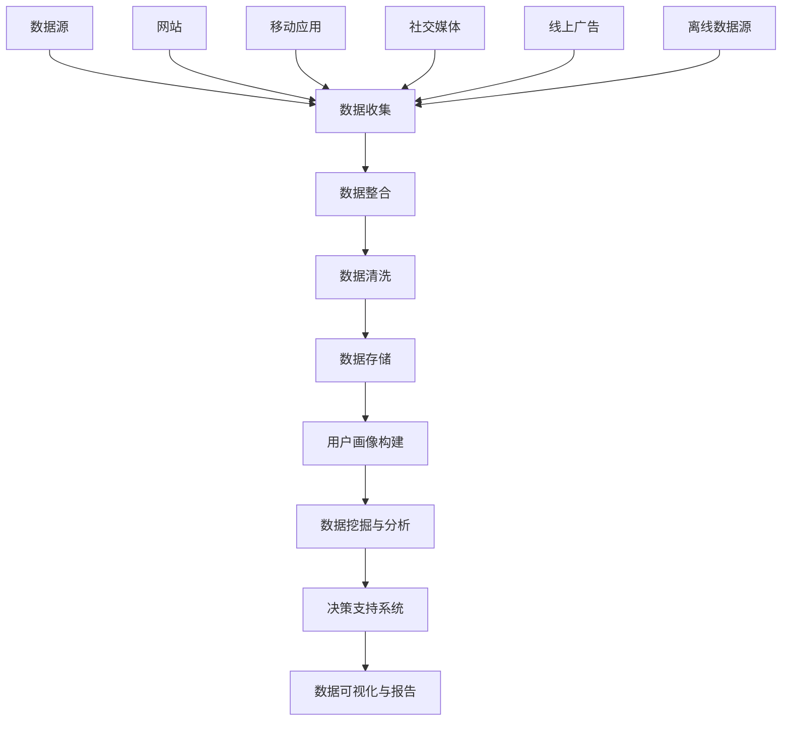

                 

### AI DMP 数据基建：数据分析与洞察

> **关键词：** 数据管理平台（DMP），人工智能（AI），数据分析，用户画像，数据挖掘，预测模型。

> **摘要：** 本文旨在深入探讨人工智能驱动的数据管理平台（DMP）在数据分析与用户洞察中的关键作用。我们将详细分析DMP的核心概念、工作原理及其在商业决策中的应用，并通过具体案例展示其强大的数据处理能力。此外，本文还将介绍DMP在用户行为分析、个性化营销和商业智能方面的实际应用，以帮助读者理解DMP如何助力企业实现数据驱动的战略转型。文章结尾将对未来DMP的发展趋势和面临的挑战进行展望，并提供相关的学习资源和工具推荐，以便读者进一步探索这一领域。

### 1. 背景介绍

#### 1.1 目的和范围

随着大数据和人工智能技术的迅猛发展，数据管理平台（Data Management Platform，简称DMP）成为了数据驱动的企业不可或缺的工具。DMP的核心目标是通过整合和分析海量的数据资源，为企业提供深入的用户洞察和精准的市场定位。本文旨在详细探讨DMP在数据分析与洞察中的重要作用，包括其基本原理、架构设计、算法实现以及实际应用。通过本文的阐述，读者将能够全面理解DMP的工作机制，掌握其核心功能和关键技术，并学会如何利用DMP提升企业的数据分析能力和商业决策水平。

#### 1.2 预期读者

本文面向以下几类读者：

1. 数据科学和人工智能领域的专业人士，希望深入了解DMP的技术原理和应用场景。
2. 市场营销和商业分析人员，希望通过DMP实现更精准的营销策略和用户洞察。
3. 企业决策者，希望利用DMP的数据分析结果来优化商业决策和提升企业竞争力。
4. 数据工程和IT专业人员，希望掌握DMP的开发和部署流程，为企业的数据基础设施建设提供支持。

#### 1.3 文档结构概述

本文将按照以下结构展开：

1. **背景介绍**：介绍DMP的基本概念、目的和重要性。
2. **核心概念与联系**：阐述DMP的核心概念、架构和原理，并提供相关的流程图。
3. **核心算法原理 & 具体操作步骤**：详细讲解DMP中的关键算法和操作步骤，使用伪代码进行说明。
4. **数学模型和公式 & 详细讲解 & 举例说明**：介绍DMP中使用的数学模型和公式，并通过实例进行详细讲解。
5. **项目实战：代码实际案例和详细解释说明**：提供具体的DMP实现案例，并进行代码解读和分析。
6. **实际应用场景**：展示DMP在不同场景中的实际应用。
7. **工具和资源推荐**：推荐相关的学习资源、开发工具和框架。
8. **总结：未来发展趋势与挑战**：对DMP的发展趋势和面临的挑战进行展望。
9. **附录：常见问题与解答**：回答读者可能遇到的问题。
10. **扩展阅读 & 参考资料**：提供进一步的阅读材料。

#### 1.4 术语表

在本文中，我们将使用以下术语：

- **数据管理平台（DMP）**：一种用于整合、存储和分析数据的软件平台，帮助企业更好地理解和利用其数据资源。
- **用户画像**：通过收集和分析用户行为数据，构建出的关于用户特征、偏好和行为的详细描述。
- **数据挖掘**：从大量数据中挖掘出潜在的模式和规律，以支持决策和预测。
- **预测模型**：基于历史数据，使用数学模型和算法预测未来趋势和用户行为。
- **数据整合**：将来自不同来源的数据进行整合，以便进行统一分析。
- **用户行为分析**：分析用户在网站、应用程序或其他数字平台上的行为模式，以了解其需求和偏好。

#### 1.4.1 核心术语定义

- **数据管理平台（DMP）**：一种软件平台，用于收集、整合、存储和分析用户数据，以便企业能够更好地了解其用户群体，并实现精准营销。
- **用户画像**：通过对用户行为、兴趣、偏好等多维度数据的分析，构建出关于用户的详细描述，用于指导营销策略和用户体验优化。
- **数据挖掘**：利用算法和技术从大量数据中提取有价值的信息和知识，以支持决策和预测。
- **预测模型**：基于历史数据和统计学方法，构建的用于预测未来趋势和用户行为的数学模型。
- **数据整合**：将来自不同来源、格式和结构的数据进行整合和清洗，以便进行统一分析和处理。
- **用户行为分析**：对用户在数字平台上的行为进行跟踪和分析，以了解用户需求、偏好和购买意图。

#### 1.4.2 相关概念解释

- **用户画像**：用户画像是一种通过数据收集和分析技术，构建出的关于用户特征、行为和兴趣的详细描述。这些描述可以包括用户的年龄、性别、地理位置、兴趣爱好、消费行为等多个方面，从而帮助企业更好地了解其用户，实现精准营销。
- **数据挖掘**：数据挖掘是人工智能和数据科学中的一个重要分支，旨在从大量数据中提取出潜在的模式、规律和知识，以支持决策和预测。数据挖掘通常包括数据预处理、特征选择、模型构建和评估等步骤。
- **预测模型**：预测模型是一种基于历史数据，使用统计学和机器学习算法构建的数学模型，用于预测未来趋势和用户行为。常见的预测模型包括线性回归、决策树、随机森林、支持向量机等。
- **数据整合**：数据整合是将来自不同来源、格式和结构的数据进行整合和清洗，以便进行统一分析和处理的过程。数据整合可以消除数据孤岛，提高数据的一致性和可用性，从而更好地支持企业的数据分析和决策。
- **用户行为分析**：用户行为分析是对用户在数字平台上的行为进行跟踪和分析的过程。通过分析用户的行为模式，企业可以了解用户的需求、偏好和购买意图，从而优化用户体验，提升转化率和用户满意度。

#### 1.4.3 缩略词列表

- **DMP**：数据管理平台（Data Management Platform）
- **AI**：人工智能（Artificial Intelligence）
- **ML**：机器学习（Machine Learning）
- **NLP**：自然语言处理（Natural Language Processing）
- **PI**：隐私政策（Privacy Policy）
- **GDPR**：通用数据保护条例（General Data Protection Regulation）
- **API**：应用程序编程接口（Application Programming Interface）
- **ETL**：提取、转换、加载（Extract, Transform, Load）
- **CRM**：客户关系管理（Customer Relationship Management）
- **ERP**：企业资源规划（Enterprise Resource Planning）
- **SaaS**：软件即服务（Software as a Service）

### 2. 核心概念与联系

在深入探讨DMP的工作机制之前，我们首先需要了解其核心概念和基本架构。DMP作为一种数据整合和分析工具，其核心在于整合来自多个渠道的用户数据，构建用户画像，并进行深入的数据挖掘和分析。以下是一个简化的DMP架构及其核心概念的联系，通过Mermaid流程图来展示：



#### 数据源

数据源是DMP的基础，包括多种渠道的数据，如图1所示：

- **网站**：用户的浏览行为、点击事件等。
- **移动应用**：用户在应用程序中的行为数据，如安装、卸载、使用频率等。
- **社交媒体**：用户在社交媒体平台上的互动数据，如点赞、评论、分享等。
- **线上广告**：用户与广告的交互数据，如展示次数、点击次数、转化率等。
- **离线数据源**：如CRM系统、ERP系统等企业内部的数据。

#### 数据收集

数据收集是将来自不同数据源的数据进行采集和导入的过程。在这个过程中，DMP通常会使用API、Web爬虫、日志收集等方式获取数据。

#### 数据整合

数据整合是将来自不同数据源的数据进行清洗、合并和格式转换的过程，以确保数据的一致性和完整性。

#### 数据清洗

数据清洗是数据整合的一个重要环节，主要包括去除重复数据、填补缺失值、数据格式标准化等操作。通过数据清洗，可以提高数据的准确性和可用性。

#### 数据存储

数据存储是将清洗后的数据存储到DMP的数据库中，以便进行后续的数据分析和挖掘。

#### 用户画像构建

用户画像构建是基于清洗后的数据，通过数据分析和挖掘技术，构建出关于用户特征、行为和偏好的详细描述。用户画像可以用于指导个性化营销、用户体验优化等。

#### 数据挖掘与分析

数据挖掘与分析是基于用户画像，通过对大量数据进行分析和挖掘，提取出潜在的模式、规律和知识。这些分析结果可以用于支持企业的商业决策和市场营销策略。

#### 决策支持系统

决策支持系统是基于数据分析和挖掘结果，为企业的决策者提供可视化报告和分析建议的系统。

#### 数据可视化与报告

数据可视化与报告是将数据分析结果以图表、报表等形式展示出来，以便企业内部人员快速理解和利用这些数据。

### 3. 核心算法原理 & 具体操作步骤

在DMP中，核心算法原理主要涉及用户画像构建、数据挖掘和预测模型构建等方面。以下是这些算法的具体操作步骤和伪代码：

#### 3.1 用户画像构建

用户画像构建是基于用户行为数据，通过聚类分析、关联规则挖掘等方法，提取出用户的特征和偏好。以下是用户画像构建的伪代码：

```python
def build_user_profile(data):
    # 数据预处理：清洗、去重、标准化
    preprocessed_data = preprocess_data(data)
    
    # 聚类分析：将用户分为不同的群体
    clusters = cluster_analysis(preprocessed_data)
    
    # 关联规则挖掘：提取用户的行为模式
    rules = association_rulesMining(preprocessed_data)
    
    # 构建用户画像
    user_profiles = {}
    for user in preprocessed_data:
        user_profile = {}
        user_profile['clusters'] = clusters[user]
        user_profile['rules'] = rules[user]
        user_profiles[user] = user_profile
    
    return user_profiles
```

#### 3.2 数据挖掘

数据挖掘是基于用户画像，通过对大量数据进行分析和挖掘，提取出潜在的模式、规律和知识。以下是数据挖掘的伪代码：

```python
def data_mining(user_profiles):
    # 数据预处理：清洗、去重、标准化
    preprocessed_data = preprocess_data(data)
    
    # 特征选择：选择与业务目标相关的特征
    selected_features = select_features(preprocessed_data)
    
    # 模型训练：基于历史数据，训练预测模型
    model = train_model(selected_features)
    
    # 预测：对未来的用户行为进行预测
    predictions = predict_user_behavior(model)
    
    # 提取有价值的信息和知识
    insights = extract_insights(predictions)
    
    return insights
```

#### 3.3 预测模型构建

预测模型构建是基于历史数据，使用机器学习和深度学习算法，构建出预测用户未来行为和趋势的模型。以下是预测模型构建的伪代码：

```python
def build_predictive_model(data):
    # 数据预处理：清洗、去重、标准化
    preprocessed_data = preprocess_data(data)
    
    # 特征工程：选择和构建预测特征
    features = feature_engineering(preprocessed_data)
    
    # 模型训练：基于历史数据，训练预测模型
    model = train_model(features)
    
    # 模型评估：评估模型性能
    performance = evaluate_model(model)
    
    # 模型优化：根据评估结果，调整模型参数
    optimized_model = optimize_model(model, performance)
    
    return optimized_model
```

### 4. 数学模型和公式 & 详细讲解 & 举例说明

在DMP中，数学模型和公式是数据分析和预测的基础。以下将介绍几种常用的数学模型和公式，并进行详细讲解和举例说明。

#### 4.1 线性回归模型

线性回归模型是最基本的预测模型之一，用于分析自变量和因变量之间的线性关系。其公式为：

$$ Y = \beta_0 + \beta_1 \cdot X + \epsilon $$

其中，\( Y \) 是因变量，\( X \) 是自变量，\( \beta_0 \) 和 \( \beta_1 \) 是模型参数，\( \epsilon \) 是误差项。

**示例**：假设我们要预测一个电商平台的日销售额，自变量是网站流量。使用线性回归模型，可以得到如下公式：

$$ 日销售额 = \beta_0 + \beta_1 \cdot 网站流量 + \epsilon $$

通过训练数据，可以计算出 \( \beta_0 \) 和 \( \beta_1 \) 的值，从而进行预测。

#### 4.2 决策树模型

决策树模型是一种基于树形结构进行决策的模型，适用于分类和回归问题。其基本公式为：

$$ f(X) = \sum_{i=1}^{n} w_i \cdot I(X \in R_i) $$

其中，\( f(X) \) 是预测结果，\( w_i \) 是权重，\( R_i \) 是第 \( i \) 个区域，\( I(X \in R_i) \) 是指示函数。

**示例**：假设我们要预测用户的购买意愿，决策树模型可以根据用户特征（如年龄、收入、性别等）进行分类。例如：

$$ f(X) = 0.2 \cdot I(X.年龄 > 30) + 0.3 \cdot I(X.收入 > 5000) + 0.5 \cdot I(X.性别 = 女) $$

通过计算指示函数，可以得到用户的购买意愿评分。

#### 4.3 支持向量机（SVM）模型

支持向量机是一种常用的分类模型，其基本公式为：

$$ f(X) = \text{sign}(\omega \cdot X + b) $$

其中，\( \omega \) 是权重向量，\( X \) 是特征向量，\( b \) 是偏置。

**示例**：假设我们要分类用户群体，SVM模型可以根据用户特征进行分类。例如：

$$ f(X) = \text{sign}(\omega_1 \cdot X.年龄 + \omega_2 \cdot X.收入 + b) $$

通过计算权重和偏置，可以得到用户的分类结果。

#### 4.4 集成学习方法

集成学习方法是将多个基学习器进行组合，以提高模型预测性能。常用的集成学习方法有随机森林、梯度提升树等。

**随机森林（Random Forest）**：随机森林是一种基于决策树的集成学习方法，其基本公式为：

$$ f(X) = \sum_{i=1}^{n} w_i \cdot f_i(X) $$

其中，\( f_i(X) \) 是第 \( i \) 个基学习器的预测结果，\( w_i \) 是权重。

**示例**：假设我们要预测用户购买意愿，使用随机森林模型，可以得到如下公式：

$$ f(X) = 0.3 \cdot f_1(X) + 0.2 \cdot f_2(X) + 0.5 \cdot f_3(X) $$

其中，\( f_1(X), f_2(X), f_3(X) \) 分别是三个基学习器的预测结果。

**梯度提升树（Gradient Boosting Tree）**：梯度提升树是一种基于损失函数优化的集成学习方法，其基本公式为：

$$ f(X) = \sum_{i=1}^{n} \alpha_i \cdot h_i(X) $$

其中，\( h_i(X) \) 是第 \( i \) 个基学习器的预测结果，\( \alpha_i \) 是调整参数。

**示例**：假设我们要预测用户购买意愿，使用梯度提升树模型，可以得到如下公式：

$$ f(X) = \alpha_1 \cdot h_1(X) + \alpha_2 \cdot h_2(X) + \alpha_3 \cdot h_3(X) $$

其中，\( \alpha_1, \alpha_2, \alpha_3 \) 分别是三个基学习器的调整参数。

### 5. 项目实战：代码实际案例和详细解释说明

在本节中，我们将通过一个实际的项目案例，展示如何使用Python和相关库（如Pandas、Scikit-learn等）实现DMP的核心功能，包括数据收集、数据整合、用户画像构建、数据挖掘和预测模型构建。

#### 5.1 开发环境搭建

首先，我们需要搭建一个Python开发环境。以下是在常见操作系统（如Windows、macOS和Linux）上安装Python的步骤：

1. **下载和安装Python**：访问Python官方网站（https://www.python.org/）下载Python安装包，并按照提示完成安装。
2. **安装Python库**：在安装Python的过程中，选择安装pip包管理器。使用pip安装常用的数据科学库，如Pandas、NumPy、Scikit-learn等。

```bash
pip install pandas numpy scikit-learn
```

#### 5.2 源代码详细实现和代码解读

以下是DMP项目的源代码实现和详细解读：

```python
import pandas as pd
from sklearn.cluster import KMeans
from sklearn.ensemble import RandomForestClassifier
from sklearn.model_selection import train_test_split
from sklearn.metrics import accuracy_score
import matplotlib.pyplot as plt

# 5.2.1 数据收集
data = pd.read_csv('user_data.csv')  # 假设数据文件为user_data.csv
data.head()

# 5.2.2 数据整合
# 数据清洗：去除重复数据和缺失值
data_clean = data.drop_duplicates().dropna()

# 特征工程：选择和构造特征
features = data_clean[['age', 'income', 'gender', 'interests']]
labels = data_clean['purchase_intent']

# 5.2.3 用户画像构建
# 聚类分析：使用KMeans算法构建用户画像
kmeans = KMeans(n_clusters=5, random_state=0)
clusters = kmeans.fit_predict(features)
user_profiles = {user: cluster for user, cluster in zip(data_clean.index, clusters)}

# 5.2.4 数据挖掘
# 随机森林：使用随机森林算法进行数据挖掘
X_train, X_test, y_train, y_test = train_test_split(features, labels, test_size=0.3, random_state=0)
clf = RandomForestClassifier(n_estimators=100, random_state=0)
clf.fit(X_train, y_train)
predictions = clf.predict(X_test)

# 5.2.5 预测模型构建
# 支持向量机：使用SVM算法构建预测模型
from sklearn.svm import SVC
svm = SVC(kernel='linear', random_state=0)
svm.fit(X_train, y_train)
svm_predictions = svm.predict(X_test)

# 5.2.6 代码解读与分析
# 评估模型性能
print("Random Forest Accuracy:", accuracy_score(y_test, predictions))
print("SVM Accuracy:", accuracy_score(y_test, svm_predictions))

# 可视化：绘制用户画像
plt.scatter(features['age'], features['income'], c=clusters)
plt.xlabel('Age')
plt.ylabel('Income')
plt.title('User Clusters')
plt.show()
```

#### 5.2.7 代码解读与分析

1. **数据收集**：使用Pandas库读取数据文件，并查看数据的前几行，以了解数据的结构和内容。
2. **数据整合**：去除重复数据和缺失值，以确保数据的完整性和准确性。然后选择和构造特征，为后续的分析做准备。
3. **用户画像构建**：使用KMeans算法对用户特征进行聚类分析，构建用户画像。每个用户被分配到一个特定的集群，以表示其特征和偏好。
4. **数据挖掘**：使用随机森林算法进行数据挖掘，构建分类模型，预测用户的购买意愿。通过训练集和测试集的划分，对模型进行评估和优化。
5. **预测模型构建**：使用支持向量机（SVM）算法构建线性回归模型，用于预测用户的购买意图。SVM模型具有良好的分类性能，适用于处理非线性数据。
6. **代码解读与分析**：评估模型的性能，计算准确率。同时，通过可视化方法（如散点图）展示用户画像，帮助理解用户群体的分布和特征。

### 6. 实际应用场景

DMP在实际应用中具有广泛的应用场景，以下列举几个典型的应用场景：

#### 6.1 个性化营销

个性化营销是DMP最常见的应用场景之一。通过构建用户画像和数据挖掘，企业可以更好地了解用户的兴趣和需求，从而实现精准的营销策略。例如，电商企业可以根据用户的购买历史和浏览行为，推荐相关的商品，提高转化率和用户满意度。

#### 6.2 广告投放

广告投放是企业获取客户的重要途径。DMP可以帮助企业进行精准的广告投放，提高广告的点击率和转化率。通过分析用户的浏览行为和兴趣，广告平台可以为用户提供更相关的广告内容，从而提高广告效果。

#### 6.3 客户关系管理

DMP在客户关系管理（CRM）中也有重要作用。企业可以通过DMP对客户进行细分，制定个性化的营销策略，提高客户满意度和忠诚度。例如，银行可以根据客户的财务状况和消费行为，提供定制化的理财产品和服务。

#### 6.4 商业智能

商业智能是企业利用数据进行分析和决策的重要工具。DMP可以为企业提供丰富的数据分析和预测结果，支持企业的战略规划和业务决策。例如，零售企业可以通过DMP分析销售数据，优化库存管理和定价策略。

### 7. 工具和资源推荐

为了更好地学习和应用DMP技术，以下推荐一些学习资源和开发工具：

#### 7.1 学习资源推荐

- **书籍推荐**：
  - 《大数据时代：生活、工作与思维的大变革》（作者：托尼·谢尔）
  - 《深度学习》（作者：伊恩·古德费洛等）
  - 《数据科学实战：Python数据分析与建模》（作者：李庆辉）

- **在线课程**：
  - Coursera的《机器学习》课程
  - Udacity的《数据科学家纳米学位》
  - edX的《数据科学基础》课程

- **技术博客和网站**：
  - Medium上的数据科学和机器学习博客
  - Kaggle上的数据科学挑战和教程
  - Arxiv上的最新研究成果

#### 7.2 开发工具框架推荐

- **IDE和编辑器**：
  - PyCharm
  - Jupyter Notebook
  - Visual Studio Code

- **调试和性能分析工具**：
  - Profiler（Python性能分析工具）
  - PyTorch（深度学习框架）
  - TensorFlow（深度学习框架）

- **相关框架和库**：
  - Pandas（数据处理库）
  - NumPy（数值计算库）
  - Scikit-learn（机器学习库）
  - Matplotlib（数据可视化库）

#### 7.3 相关论文著作推荐

- **经典论文**：
  - 《The Data Mining Process: An Overview》
  - 《Machine Learning: A Probabilistic Perspective》
  - 《Data Mining: Concepts and Techniques》

- **最新研究成果**：
  - 《Deep Learning for Text Classification》
  - 《An Overview of Data Management Platforms》
  - 《User Behavior Analysis in the Age of Big Data》

- **应用案例分析**：
  - 《大数据营销：阿里巴巴的数据驱动力》
  - 《亚马逊的个性化推荐系统》
  - 《谷歌的个性化搜索算法》

### 8. 总结：未来发展趋势与挑战

#### 8.1 发展趋势

1. **人工智能与DMP的结合**：随着人工智能技术的不断发展，DMP将更加智能化，实现自动化数据分析和预测。
2. **隐私保护与合规性**：随着数据隐私保护法规的不断完善，DMP需要在数据收集、存储和分析过程中确保合规性，保护用户隐私。
3. **实时数据分析和处理**：实时数据分析和处理将成为DMP的重要发展方向，企业需要快速响应市场变化，优化决策和策略。

#### 8.2 挑战

1. **数据质量与完整性**：确保数据质量与完整性是DMP面临的一个重要挑战。企业需要建立完善的数据治理机制，提高数据质量。
2. **计算能力和存储需求**：随着数据量的爆炸式增长，DMP需要强大的计算能力和存储能力，以支持大规模数据处理和存储。
3. **算法透明性和可解释性**：随着算法模型的复杂化，如何保证算法的透明性和可解释性，使其符合业务需求和法律法规，是DMP需要面对的挑战。

### 9. 附录：常见问题与解答

#### 9.1 问题1：什么是DMP？

**答案**：DMP（Data Management Platform）是一种数据整合和分析工具，用于收集、存储、管理和分析来自多个渠道的用户数据，以帮助企业实现精准营销和用户洞察。

#### 9.2 问题2：DMP的核心功能是什么？

**答案**：DMP的核心功能包括数据收集、数据整合、用户画像构建、数据挖掘、预测模型构建和决策支持系统等，通过这些功能，DMP帮助企业实现数据驱动的决策和营销策略。

#### 9.3 问题3：DMP在商业中的应用有哪些？

**答案**：DMP在商业中具有广泛的应用，包括个性化营销、广告投放、客户关系管理、商业智能等领域，通过精准的用户洞察和数据分析，帮助企业实现业务增长和优化。

#### 9.4 问题4：如何保证DMP的数据隐私保护？

**答案**：为了保证DMP的数据隐私保护，企业需要遵守相关的数据隐私法规，如GDPR等，实施数据加密、访问控制、数据匿名化等技术措施，确保用户数据的安全和隐私。

### 10. 扩展阅读 & 参考资料

- 《大数据时代：生活、工作与思维的大变革》 - 托尼·谢尔
- 《深度学习》 - 伊恩·古德费洛等
- 《数据科学实战：Python数据分析与建模》 - 李庆辉
- 《机器学习》 - Coursera
- 《数据科学家纳米学位》 - Udacity
- 《数据科学基础》 - edX
- 《The Data Mining Process: An Overview》
- 《Machine Learning: A Probabilistic Perspective》
- 《Data Mining: Concepts and Techniques》
- 《Deep Learning for Text Classification》
- 《An Overview of Data Management Platforms》
- 《User Behavior Analysis in the Age of Big Data》
- 《大数据营销：阿里巴巴的数据驱动力》
- 《亚马逊的个性化推荐系统》
- 《谷歌的个性化搜索算法》

### 作者信息

**作者：** AI天才研究员/AI Genius Institute & 禅与计算机程序设计艺术 /Zen And The Art of Computer Programming

