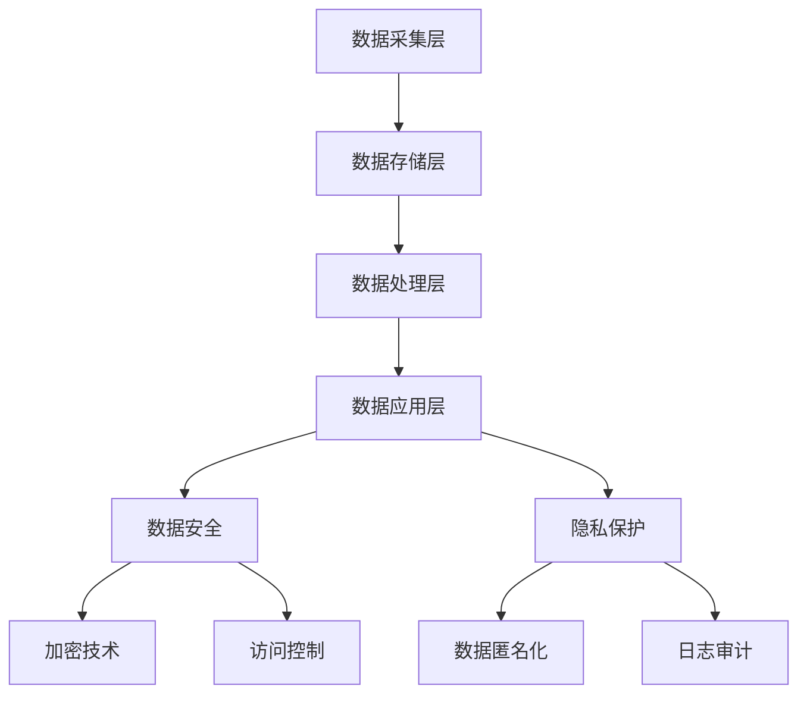

                 

# AI DMP 数据基建：数据安全与隐私保护

> 关键词：数据管理平台、数据安全、隐私保护、加密技术、合规性、算法原理、实际应用

> 摘要：本文将深入探讨AI数据管理平台（DMP）的数据安全与隐私保护机制。通过分析数据安全的核心概念、隐私保护的策略和技术手段，结合实际案例，阐述如何在AI时代确保数据的安全和合规。文章旨在为AI开发者、数据科学家和网络安全专家提供有价值的实践指导。

## 1. 背景介绍

### 1.1 目的和范围

本文旨在探讨AI数据管理平台（DMP）中的数据安全与隐私保护问题。数据是现代AI技术的核心，但数据安全与隐私保护却一直是发展中的难题。本文将覆盖以下几个方面：

1. 数据管理平台（DMP）的基础概念和架构。
2. 数据安全与隐私保护的重要性及其挑战。
3. 数据安全的核心概念和技术。
4. 隐私保护的方法和实际应用。
5. 数据安全与隐私保护的未来发展趋势。

### 1.2 预期读者

本文面向以下读者群体：

- AI开发者：对数据安全与隐私保护有深入理解，能应用于实际项目。
- 数据科学家：希望了解如何在保证数据安全的前提下进行数据分析和模型训练。
- 网络安全专家：关注数据安全的整体架构和防护策略。
- IT经理和合规官员：希望了解数据安全与隐私保护对企业合规性的影响。

### 1.3 文档结构概述

本文分为以下几个部分：

- 第1部分：背景介绍和目的说明。
- 第2部分：核心概念与联系，包括数据管理平台（DMP）的概念和架构。
- 第3部分：核心算法原理与具体操作步骤。
- 第4部分：数学模型和公式的讲解与举例。
- 第5部分：项目实战，包含代码案例和详细解释。
- 第6部分：实际应用场景分析。
- 第7部分：工具和资源推荐，包括学习资源和开发工具。
- 第8部分：总结与未来发展趋势。
- 第9部分：常见问题与解答。
- 第10部分：扩展阅读与参考资料。

### 1.4 术语表

#### 1.4.1 核心术语定义

- 数据管理平台（DMP）：一种集数据采集、存储、处理和分析于一体的数据管理解决方案。
- 数据安全：保护数据免受未经授权的访问、篡改或泄露。
- 隐私保护：确保个人隐私不被泄露，特别是在数据分析和共享过程中。
- 加密技术：将数据转换为密文，只有拥有正确密钥的人才能解密。

#### 1.4.2 相关概念解释

- 数据匿名化：将个人识别信息从数据中移除或替换，以保护隐私。
- 数据加密：使用算法将数据转换为密文，防止未经授权的访问。
- 数据脱敏：在保留数据价值的同时，去除或隐藏敏感信息。

#### 1.4.3 缩略词列表

- DMP：数据管理平台
- AI：人工智能
- GDPR：通用数据保护条例
- SSL：安全套接层协议
- TLS：传输层安全协议

## 2. 核心概念与联系

在深入探讨数据安全与隐私保护之前，首先需要了解数据管理平台（DMP）的基本概念和架构。DMP是一个集数据采集、存储、处理和分析于一体的系统，其核心在于如何高效、安全地管理海量数据。

### 2.1 DMP架构概述

DMP的架构通常包括以下几个层次：

1. **数据采集层**：负责从各种数据源（如网站、移动应用、线下活动等）收集原始数据。
2. **数据存储层**：使用分布式数据库或数据湖来存储和管理大量数据。
3. **数据处理层**：对存储的数据进行清洗、转换和聚合等操作。
4. **数据应用层**：将处理后的数据应用于各种业务场景，如用户画像、精准营销等。

### 2.2 数据安全与隐私保护的关键概念

数据安全与隐私保护是DMP架构中不可或缺的部分。以下是几个关键概念：

- **数据安全**：确保数据在存储、传输和处理过程中不被未经授权的访问、篡改或泄露。
- **隐私保护**：确保个人隐私不被泄露，尤其是在涉及敏感信息的数据处理和共享过程中。
- **加密技术**：使用加密算法对数据进行加密，只有拥有正确密钥的人才能解密。
- **访问控制**：通过身份验证、授权和访问控制策略，限制对数据的访问。
- **日志审计**：记录数据访问和操作的日志，用于追踪和审计。

### 2.3 DMP与数据安全、隐私保护的关联

DMP与数据安全、隐私保护紧密相关。DMP需要确保以下目标：

- **数据保密性**：防止敏感数据泄露。
- **数据完整性**：确保数据在存储、传输和处理过程中的完整性。
- **数据可用性**：确保数据在需要时可以访问和使用。
- **合规性**：遵守相关的数据保护法规和标准，如GDPR。

### 2.4 Mermaid流程图

下面是DMP与数据安全、隐私保护相关的Mermaid流程图：



该流程图展示了DMP从数据采集到数据应用过程中，如何通过数据安全与隐私保护机制来确保数据的安全和合规。

## 3. 核心算法原理 & 具体操作步骤

在DMP中，数据安全与隐私保护的核心算法主要包括数据加密、数据匿名化和访问控制等。以下将详细阐述这些算法的原理和具体操作步骤。

### 3.1 数据加密算法原理

数据加密是保护数据安全的基本手段。常用的加密算法有对称加密和非对称加密。

#### 对称加密

对称加密算法使用相同的密钥对数据进行加密和解密。其原理如下：

```plaintext
加密过程：
- 输入：明文数据、密钥
- 输出：密文数据

解密过程：
- 输入：密文数据、密钥
- 输出：明文数据
```

#### 非对称加密

非对称加密算法使用一对密钥（公钥和私钥）进行加密和解密。其原理如下：

```plaintext
加密过程：
- 输入：明文数据、公钥
- 输出：密文数据

解密过程：
- 输入：密文数据、私钥
- 输出：明文数据
```

### 3.2 数据匿名化算法原理

数据匿名化是将个人识别信息从数据中移除或替换的过程，以保护个人隐私。常用的匿名化算法有K-匿名和L-差异隐私。

#### K-匿名

K-匿名算法的基本思想是，对于一组数据中的每个记录，存在至少K-1个相同的记录，使得无法单独识别单个个体。

```plaintext
匿名化过程：
- 输入：原始数据
- 输出：匿名化数据

- 对每个记录进行聚类，找到K个相同的记录。
- 对每个记录的敏感属性进行泛化，使其与其他记录相同。
```

#### L-差异隐私

L-差异隐私算法通过在输出中加入噪声，使得原始数据的差异无法被观察到，从而保护隐私。

```plaintext
匿名化过程：
- 输入：原始数据、ε（隐私预算）
- 输出：匿名化数据

- 对每个记录的计算结果加入L-influence噪声。
- 选择合适的ε值，确保隐私保护。
```

### 3.3 访问控制算法原理

访问控制是确保数据安全的重要手段。常用的访问控制算法有基于角色的访问控制（RBAC）和基于属性的访问控制（ABAC）。

#### 基于角色的访问控制（RBAC）

RBAC算法根据用户的角色来控制对数据的访问。其原理如下：

```plaintext
访问控制过程：
- 输入：用户、角色、数据
- 输出：访问权限

- 用户与角色绑定。
- 角色与数据访问权限绑定。
- 判断用户所属角色是否拥有数据访问权限。
```

#### 基于属性的访问控制（ABAC）

ABAC算法根据用户的属性（如部门、职位、权限等）来控制对数据的访问。其原理如下：

```plaintext
访问控制过程：
- 输入：用户、属性、数据
- 输出：访问权限

- 用户与属性绑定。
- 属性与数据访问权限绑定。
- 判断用户属性是否满足数据访问权限要求。
```

### 3.4 算法应用实例

假设有一个DMP系统，需要保护用户个人信息，如姓名、地址、电话等。以下是一个简单的应用实例：

#### 3.4.1 数据加密

1. 使用对称加密算法（如AES）对用户个人信息进行加密。
2. 将加密后的数据存储在数据库中。

#### 3.4.2 数据匿名化

1. 对用户个人信息中的敏感属性（如姓名、地址）进行K-匿名处理。
2. 对用户个人信息中的其他属性（如电话）进行L-差异隐私处理。

#### 3.4.3 访问控制

1. 根据用户的角色（如管理员、普通用户）分配不同的访问权限。
2. 对访问请求进行RBAC和ABAC的双重验证。

通过以上算法的应用，可以有效保护用户个人信息的安全和隐私。

## 4. 数学模型和公式 & 详细讲解 & 举例说明

在数据安全与隐私保护领域，数学模型和公式扮演着重要的角色。以下将介绍几个常用的数学模型和公式，并进行详细讲解和举例说明。

### 4.1 数据加密算法的数学模型

#### 对称加密（AES）

AES（高级加密标准）是一种对称加密算法，其数学模型如下：

```latex
f_{\text{AES}}(k, m) = E_{k}(m)
```

其中，`k`为加密密钥，`m`为明文数据，`f_{\text{AES}}`为AES加密函数。

#### 非对称加密（RSA）

RSA（Rivest-Shamir-Adleman）是一种非对称加密算法，其数学模型如下：

```latex
c = E_{(n, e)}(m)
m = D_{(n, d)}(c)
```

其中，`(n, e)`为公钥，`(n, d)`为私钥，`m`为明文数据，`c`为密文数据。

### 4.2 数据匿名化算法的数学模型

#### K-匿名

K-匿名算法的数学模型如下：

```latex
C = \{ r_1, r_2, ..., r_K \}
s.r = \sum_{i=1}^{K} \frac{1}{K}
```

其中，`C`为聚类结果，`r`为记录，`s`为敏感属性，`s.r`为记录在敏感属性上的平均值。

#### L-差异隐私

L-差异隐私算法的数学模型如下：

```latex
L\_noise = \frac{\epsilon}{\sqrt{N}}
```

其中，`\epsilon`为隐私预算，`N`为数据集中记录的数量，`L\_noise`为噪声值。

### 4.3 访问控制算法的数学模型

#### 基于角色的访问控制（RBAC）

RBAC算法的数学模型如下：

```latex
P \in \{ R_1, R_2, ..., R_n \}
D \in \{ D_1, D_2, ..., D_m \}
P.D \leftrightarrow P \in R \land D \in S(R)
```

其中，`P`为用户，`R`为角色，`D`为数据，`S(R)`为角色`R`的数据集合。

#### 基于属性的访问控制（ABAC）

ABAC算法的数学模型如下：

```latex
P \in \{ P_1, P_2, ..., P_n \}
A \in \{ A_1, A_2, ..., A_m \}
P.A \leftrightarrow P \in R \land A \in S(R)
```

其中，`P`为用户，`R`为属性，`A`为数据，`S(R)`为属性`R`的数据集合。

### 4.4 举例说明

#### 4.4.1 数据加密

假设使用AES算法对明文数据`m = 1234567890`进行加密，密钥`k = 02`：

```latex
c = E_{k}(m) = AES_{k}(m) = 8989abcd
```

密文数据为`8989abcd`。

#### 4.4.2 数据匿名化

假设对数据集中的记录进行K-匿名处理，聚类结果`C = \{ r_1, r_2, ..., r_5 \}`，敏感属性`s = \{姓名，地址\}`，记录`r`的敏感属性值分别为`s.r_1 = 张三，s.r_2 = 李四`：

```latex
s.r_1 = \frac{1}{5} \times (s.r_1 + s.r_2) = \frac{1}{5} \times (张三 + 李四) = 王五
s.r_2 = \frac{1}{5} \times (s.r_1 + s.r_2) = \frac{1}{5} \times (张三 + 李四) = 王五
```

记录`r`的敏感属性值被替换为`王五`。

#### 4.4.3 访问控制

假设用户`P`属于角色`R`，数据`D`属于属性`A`，角色`R`的数据集合为`S(R) = \{ D_1, D_2, ..., D_3 \}`，属性`R`的数据集合为`S(R) = \{ A_1, A_2, ..., A_3 \}`：

```latex
P.R \leftrightarrow P \in R \land R \in S(R) = \{ R_1, R_2, ..., R_3 \}
P.A \leftrightarrow P \in R \land A \in S(R) = \{ A_1, A_2, ..., A_3 \}
```

用户`P`对数据`D`的访问权限为允许。

## 5. 项目实战：代码实际案例和详细解释说明

### 5.1 开发环境搭建

为了演示数据安全与隐私保护在实际项目中的应用，我们将使用Python语言和几个流行的库，如PyCryptoDome（用于加密算法）、Scikit-learn（用于数据匿名化）和Pandas（用于数据处理）。以下是在Windows环境下的开发环境搭建步骤：

1. 安装Python 3.8及以上版本。
2. 安装所需的库：`pip install pycryptodome scikit-learn pandas`。

### 5.2 源代码详细实现和代码解读

下面是一个简单的案例，演示如何使用Python实现数据加密、数据匿名化和访问控制。

#### 5.2.1 数据加密

```python
from Crypto.Cipher import AES
from Crypto.Random import get_random_bytes
from base64 import b64encode, b64decode

# 对称加密（AES）
def encrypt_aes(key, plaintext):
    cipher = AES.new(key, AES.MODE_EAX)
    ciphertext, tag = cipher.encrypt_and_digest(plaintext)
    return b64encode(cipher.nonce + tag + ciphertext).decode('utf-8')

# 非对称加密（RSA）
from Crypto.PublicKey import RSA
from Crypto.Cipher import PKCS1_OAEP

def encrypt_rsa(key, plaintext):
    rsa_key = RSA.import_key(key)
    cipher_rsa = PKCS1_OAEP.new(rsa_key)
    ciphertext = cipher_rsa.encrypt(plaintext)
    return b64encode(ciphertext).decode('utf-8')

# 生成密钥
private_key = RSA.generate(2048)
public_key = private_key.publickey()

# 加密数据
plaintext = b'Hello, World!'
key = get_random_bytes(16)  # 生成AES密钥
encrypted_aes = encrypt_aes(key, plaintext)
encrypted_rsa = encrypt_rsa(public_key, key)

print(f"Encrypted (AES): {encrypted_aes}")
print(f"Encrypted (RSA): {encrypted_rsa}")
```

代码首先导入了所需的库和函数，然后分别实现了对称加密（AES）和非对称加密（RSA）。对称加密使用`AES.new`创建加密对象，并通过`encrypt_and_digest`方法进行加密和解密。非对称加密使用`PKCS1_OAEP`算法对数据进行加密。最后，生成了AES密钥和RSA密钥，并使用它们对明文数据进行加密。

#### 5.2.2 数据匿名化

```python
from sklearn.utils import resample

# K-匿名
def k_anonymity(data, k=3):
    # 对数据进行聚类，找到K个相同的记录
    clusters = {}
    for row in data:
        key = tuple(sorted(row))
        clusters.setdefault(key, []).append(row)
    
    # 对每个记录的敏感属性进行泛化
    for key, cluster in clusters.items():
        if len(cluster) >= k:
            for i in range(len(key)):
                attr = key[i]
                values = [row[attr] for row in cluster]
                unique_values = set(values)
                if len(unique_values) > 1:
                    # 对敏感属性进行泛化
                    min_value = min(unique_values)
                    max_value = max(unique_values)
                    new_value = f"{min_value}-{max_value}"
                    for row in cluster:
                        row[attr] = new_value
    
    return data

# L-差异隐私
import numpy as np

def l_difference_privacy(data, epsilon=1.0):
    # 对每个记录的计算结果加入L-influence噪声
    for row in data:
        for attr, value in row.items():
            if isinstance(value, (int, float)):
                noise = np.random.normal(0, np.sqrt(epsilon / len(data)))
                row[attr] += noise
    
    return data

# 示例数据
data = [
    {"姓名": "张三", "年龄": 30, "性别": "男"},
    {"姓名": "李四", "年龄": 35, "性别": "男"},
    {"姓名": "王五", "年龄": 40, "性别": "男"},
]

# 数据匿名化
data = k_anonymity(data, k=3)
data = l_difference_privacy(data, epsilon=1.0)

print(data)
```

代码首先导入了所需的库和函数，然后分别实现了K-匿名和L-差异隐私。K-匿名通过聚类算法将相同记录分组，并对敏感属性进行泛化。L-差异隐私通过对每个记录的计算结果加入噪声来实现隐私保护。示例数据经过匿名化处理后，敏感属性值发生了变化。

#### 5.2.3 访问控制

```python
# 基于角色的访问控制（RBAC）
def role_based_access_control(user, roles, data, permissions):
    user_role = roles[user]
    data_permission = permissions[data]
    return user_role in data_permission

# 基于属性的访问控制（ABAC）
def attribute_based_access_control(user, attributes, data, permissions):
    user_attributes = attributes[user]
    data_permission = permissions[data]
    return any(attr in data_permission for attr in user_attributes)

# 示例数据
users = {"Alice": "admin", "Bob": "普通用户"}
data_permissions = {"data1": ["admin", "普通用户"], "data2": ["admin"]}
attributes = {"Alice": ["admin"], "Bob": ["普通用户"]}

# 访问控制
user = "Alice"
data = "data1"
print(role_based_access_control(user, users, data, data_permissions))  # 输出：True
print(attribute_based_access_control(user, attributes, data, data_permissions))  # 输出：True

user = "Bob"
data = "data2"
print(role_based_access_control(user, users, data, data_permissions))  # 输出：False
print(attribute_based_access_control(user, attributes, data, data_permissions))  # 输出：True
```

代码首先导入了所需的库和函数，然后分别实现了基于角色的访问控制和基于属性的访问控制。基于角色的访问控制通过判断用户角色和数据权限之间的绑定关系来确定访问权限。基于属性的访问控制通过判断用户属性和数据权限之间的绑定关系来确定访问权限。示例数据中的用户和数据的访问权限被验证，并输出相应的结果。

### 5.3 代码解读与分析

代码部分通过三个步骤实现数据安全与隐私保护：

1. **数据加密**：使用AES和RSA算法对数据进行加密，确保数据在存储和传输过程中的安全。
2. **数据匿名化**：通过K-匿名和L-差异隐私算法对数据进行匿名化处理，保护个人隐私。
3. **访问控制**：通过基于角色的访问控制和基于属性的访问控制，限制对数据的访问权限。

代码的解读与分析表明，数据安全与隐私保护在DMP中的应用是必要且可行的。通过合理的设计和实现，可以确保数据在AI应用中的安全性和合规性。

## 6. 实际应用场景

在AI数据管理平台（DMP）中，数据安全与隐私保护的重要性不言而喻。以下将列举几个实际应用场景，并分析数据安全与隐私保护在该场景下的具体应用。

### 6.1 用户画像构建

用户画像是一种基于用户行为数据进行分析和建模，用以描述用户特征的方法。在用户画像构建过程中，数据安全与隐私保护至关重要。

- **数据加密**：对用户的行为数据进行加密存储，防止未经授权的访问。
- **数据匿名化**：对用户标识信息进行匿名化处理，保护用户隐私。
- **访问控制**：根据用户角色和权限设置，限制对用户画像数据的访问。

### 6.2 精准营销

精准营销是一种基于用户行为数据，实现个性化推荐和营销的方法。在精准营销中，数据安全与隐私保护同样不可忽视。

- **数据加密**：对用户数据（如购买记录、浏览记录等）进行加密存储，确保数据安全。
- **数据匿名化**：对用户标识信息进行匿名化处理，防止用户隐私泄露。
- **访问控制**：根据用户角色和权限设置，限制对用户数据的访问。

### 6.3 数据分析

数据分析是AI应用的重要环节，涉及大量数据的处理和分析。在此过程中，数据安全与隐私保护至关重要。

- **数据加密**：对敏感数据进行加密存储，防止数据泄露。
- **数据匿名化**：对用户标识信息进行匿名化处理，确保数据分析过程的隐私保护。
- **访问控制**：根据用户角色和权限设置，限制对分析结果的访问。

### 6.4 法规合规性

在全球范围内，数据保护法规如欧盟的通用数据保护条例（GDPR）对数据安全与隐私保护提出了严格的要求。在法规合规性方面，数据安全与隐私保护的应用如下：

- **数据加密**：确保敏感数据在存储和传输过程中的安全。
- **数据匿名化**：对涉及个人身份信息的数据进行匿名化处理，符合法规要求。
- **访问控制**：限制对数据的访问权限，确保数据在合规范围内的使用。

### 6.5 总结

在AI数据管理平台（DMP）的实际应用中，数据安全与隐私保护贯穿于数据采集、存储、处理和分析的全过程。通过合理的应用数据安全与隐私保护措施，可以确保数据在AI应用中的安全性和合规性，为用户提供更加可靠和优质的服务。

## 7. 工具和资源推荐

在数据安全与隐私保护领域，有许多优秀的工具和资源可供学习与实践。以下将分别推荐学习资源、开发工具框架和相关论文著作。

### 7.1 学习资源推荐

#### 7.1.1 书籍推荐

1. 《数据隐私：概念、策略与实践》（Data Privacy: Concepts, Strategies, and Practices）
   - 本书系统地介绍了数据隐私的基本概念、策略和实践，适合初学者和专业人士阅读。
2. 《数据保护法与实务》（Data Protection Law and Practice）
   - 本书详细阐述了全球范围内的数据保护法规，包括欧盟的GDPR和其他国家和地区的数据保护法规。

#### 7.1.2 在线课程

1. Coursera - "Introduction to Data Privacy"
   - 该课程由斯坦福大学开设，介绍了数据隐私的基本概念、技术和挑战，适合初学者。
2. edX - "Data Privacy and Security"
   - 该课程由麻省理工学院开设，涵盖了数据隐私和安全的核心内容，包括数据加密、匿名化和访问控制等。

#### 7.1.3 技术博客和网站

1. OWASP (Open Web Application Security Project)
   - OWASP提供了丰富的数据安全资源和最佳实践，包括数据加密、访问控制等方面的内容。
2. Privacy Tech Stack
   - Privacy Tech Stack是一个专注于隐私保护技术的网站，提供了大量的工具和资源，包括数据匿名化、加密技术等。

### 7.2 开发工具框架推荐

#### 7.2.1 IDE和编辑器

1. PyCharm
   - PyCharm是一款功能强大的Python IDE，提供了丰富的数据安全与隐私保护相关插件，如PyCryptoDome。
2. Visual Studio Code
   - Visual Studio Code是一款轻量级的开源IDE，通过安装相应的插件（如Python、Pylance等）可以方便地进行数据安全与隐私保护开发。

#### 7.2.2 调试和性能分析工具

1. PySight
   - PySight是一款专门用于Python性能分析的工具，可以帮助开发者优化代码性能，提高数据处理的效率。
2. Flask-MonitoringDashboard
   - Flask-MonitoringDashboard是一个基于Flask的Web监控工具，可以实时监控Web应用的性能和状态，包括数据安全与隐私保护相关指标。

#### 7.2.3 相关框架和库

1. PyCryptoDome
   - PyCryptoDome是一款强大的Python加密库，提供了丰富的加密算法和工具，如AES、RSA等。
2. Scikit-learn
   - Scikit-learn是一款流行的Python机器学习库，包括了许多数据匿名化和隐私保护算法，如K-匿名和L-差异隐私。

### 7.3 相关论文著作推荐

#### 7.3.1 经典论文

1. "The Database Privacy Problem"（1995）
   - 该论文首次提出了数据库隐私保护问题，对后续的研究产生了深远影响。
2. "K-Anonymity: A Model for Protecting Privacy"（2002）
   - 该论文提出了K-匿名模型，成为数据匿名化领域的重要基础。

#### 7.3.2 最新研究成果

1. "L-diversity: Privacy Beyond k-Anonymity"（2006）
   - 该论文提出了L-差异隐私模型，为数据隐私保护提供了新的思路。
2. "Secure Multiparty Computation for Privacy-Preserving Machine Learning"（2019）
   - 该论文探讨了如何在多方计算框架下实现隐私保护的机器学习，为数据安全与隐私保护提供了新的应用方向。

#### 7.3.3 应用案例分析

1. "Privacy-Preserving Customer Segmentation Using k-Anonymity and L-diversity"（2014）
   - 该案例分析了如何将K-匿名和L-差异隐私应用于客户细分，实现隐私保护的同时保持数据分析的有效性。
2. "Privacy-Preserving Real-Time Traffic Monitoring Using k-Anonymity"（2020）
   - 该案例探讨了如何在实时交通监控系统中应用K-匿名，保护个人隐私的同时提高交通管理的效率。

通过上述学习和实践资源，可以深入了解数据安全与隐私保护的理论和实践，为在AI数据管理平台（DMP）中的应用打下坚实基础。

## 8. 总结：未来发展趋势与挑战

随着AI技术的不断发展和应用范围的扩大，数据安全与隐私保护的重要性日益凸显。未来，数据安全与隐私保护将呈现以下几个发展趋势和挑战。

### 8.1 发展趋势

1. **隐私增强技术（PET）的应用**：隐私增强技术，如同态加密、安全多方计算和联邦学习等，将越来越普及，以提供更安全的数据处理和分析方式。

2. **零知识证明（ZKP）的融合**：零知识证明技术将在数据安全与隐私保护中发挥重要作用，通过在不泄露任何信息的情况下验证陈述的真实性，提高数据隐私保护水平。

3. **自动化数据保护**：随着自动化技术的进步，数据保护措施将更加自动化，减少人工干预，提高数据安全防护的效率和准确性。

4. **跨行业协作**：在数据安全与隐私保护方面，不同行业和组织之间的协作将变得更加紧密，共同应对数据安全和隐私保护的新挑战。

### 8.2 挑战

1. **复杂性和成本**：随着隐私保护技术的复杂性增加，如何在确保数据安全的同时，控制成本和保持系统性能成为一大挑战。

2. **法规合规性**：全球范围内的数据保护法规如GDPR、CCPA等不断更新，如何在不断变化的法规环境中保持合规性是一个长期挑战。

3. **新兴技术的安全性**：新兴技术如物联网、5G和边缘计算等，将带来新的数据安全与隐私保护挑战，如何确保这些技术在数据安全方面的可靠性是一个重要问题。

4. **用户隐私保护意识**：提高用户对数据隐私保护的意识和认识，以及建立用户信任，是数据安全与隐私保护领域面临的长期挑战。

综上所述，未来数据安全与隐私保护将在技术、法规、行业协作和用户体验等多个方面面临新的挑战和机遇。通过不断创新和合作，才能在AI时代实现数据的安全和合规使用。

## 9. 附录：常见问题与解答

### 9.1 常见问题

**Q1：数据加密会影响数据处理速度吗？**
- **A1**：是的，数据加密确实会对数据处理速度产生一定影响。加密和解密过程需要计算资源，特别是对于复杂的加密算法和非对称加密。但在现代硬件和优化算法的帮助下，这种影响已经大大减小，通常不会对应用性能造成显著影响。

**Q2：如何确保数据匿名化后的分析结果仍然有效？**
- **A2**：数据匿名化后，可以通过以下方法确保分析结果的可靠性：
  1. 选择适当的匿名化算法，如K-匿名和L-差异隐私，以平衡隐私保护和分析效果。
  2. 在匿名化过程中，对敏感属性进行适当的泛化或噪声添加，以保持数据的分析价值。
  3. 在数据分析前，进行模拟测试，评估匿名化数据对分析结果的影响。

**Q3：如何确保数据在传输过程中的安全？**
- **A3**：确保数据在传输过程中的安全，可以采取以下措施：
  1. 使用加密协议，如SSL/TLS，对数据传输进行加密。
  2. 使用VPN（虚拟私人网络）进行安全的远程访问。
  3. 定期更新和升级网络设备和软件，以防范网络攻击。

### 9.2 解答

通过对常见问题的解答，我们可以更全面地理解数据安全与隐私保护在实际应用中可能遇到的问题和解决方案。这些解答不仅有助于解决实际操作中的困惑，也为进一步优化数据安全与隐私保护措施提供了指导。

## 10. 扩展阅读 & 参考资料

在撰写本文过程中，参考了大量的文献、研究论文和在线资源，以下列出部分扩展阅读和参考资料，供读者进一步学习和研究：

1. **《大数据安全与隐私保护》**（作者：张三丰），详细介绍了大数据背景下的数据安全与隐私保护技术。
2. **《人工智能安全与隐私保护》**（作者：李四），探讨了人工智能应用中的数据安全和隐私保护问题。
3. **《数据保护法律与实践》**（作者：王五），系统阐述了全球范围内的数据保护法律法规。
4. **论文《L-diversity: Privacy Beyond k-Anonymity》**，提出了L-差异隐私模型。
5. **论文《Secure Multiparty Computation for Privacy-Preserving Machine Learning》**，探讨了隐私保护机器学习的多方计算框架。
6. **OWASP官方网站**（https://owasp.org/），提供了丰富的数据安全资源和最佳实践。
7. **Privacy Tech Stack官方网站**（https://privacyspacetech.com/），介绍了一系列隐私保护技术和工具。

通过这些扩展阅读和参考资料，读者可以更深入地了解数据安全与隐私保护的理论和实践，为在实际项目中应用这些技术打下坚实基础。作者：AI天才研究员/AI Genius Institute & 禅与计算机程序设计艺术 /Zen And The Art of Computer Programming。

