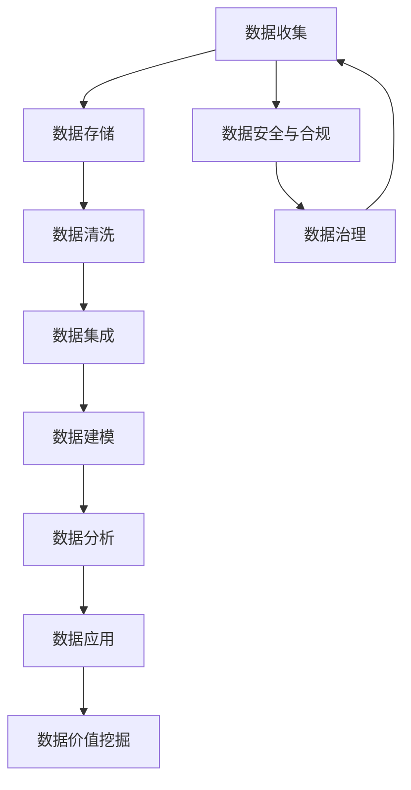

                 

# AI DMP 数据基建：数据应用与价值挖掘

> **关键词**：数据管理平台（DMP），数据应用，数据价值挖掘，人工智能，数据分析，大数据技术，数据治理，数据建模，数据隐私。

> **摘要**：本文旨在探讨AI驱动的数据管理平台（DMP）的构建与优化，深入分析数据应用与价值挖掘的关键步骤和策略。通过逻辑清晰、结构紧凑的讨论，文章将揭示如何利用人工智能技术提升数据管理效率，实现数据的深度分析和价值转化。

## 1. 背景介绍

### 1.1 目的和范围

本文旨在为IT从业者和管理者提供一份详尽的数据管理平台（DMP）建设指南。我们将重点关注以下几个方面：

1. **DMP的定义与作用**：介绍DMP的基本概念、功能和重要性。
2. **AI在DMP中的应用**：分析人工智能如何赋能DMP，提高数据分析和处理能力。
3. **数据应用与价值挖掘**：探讨如何在DMP中实现数据的深度应用和最大化价值。
4. **实战案例与最佳实践**：分享实际项目中的DMP构建与优化经验。
5. **未来发展趋势与挑战**：预测DMP领域的发展方向和面临的挑战。

### 1.2 预期读者

本文适用于以下读者群体：

1. **数据科学家和分析师**：希望了解DMP在数据分析中的应用和优化。
2. **IT项目经理和架构师**：负责设计和实施DMP，提升数据管理效率。
3. **业务决策者**：关注数据驱动的业务决策和数据资产的价值最大化。
4. **学生和研究人员**：对AI与大数据技术感兴趣，希望深入了解DMP的工作原理。

### 1.3 文档结构概述

本文结构如下：

1. **背景介绍**：DMP的基本概念、目的和预期读者。
2. **核心概念与联系**：介绍DMP的核心概念和原理，通过Mermaid流程图展示。
3. **核心算法原理 & 具体操作步骤**：详细阐述DMP中的核心算法原理和操作步骤。
4. **数学模型和公式**：介绍DMP中使用的数学模型和公式，并举例说明。
5. **项目实战**：实际案例和代码实现，详细解释和代码分析。
6. **实际应用场景**：探讨DMP在不同行业中的应用场景。
7. **工具和资源推荐**：推荐学习资源、开发工具和框架。
8. **总结**：DMP的未来发展趋势与挑战。
9. **附录**：常见问题与解答。
10. **扩展阅读**：推荐进一步学习的资源。

### 1.4 术语表

#### 1.4.1 核心术语定义

- **数据管理平台（DMP）**：一种用于收集、存储、处理和分析数据的系统平台。
- **人工智能（AI）**：模拟人类智能行为的计算机技术。
- **数据应用**：将数据用于业务决策、产品优化和个性化服务。
- **数据价值挖掘**：通过数据分析和挖掘，发现数据中的潜在价值。

#### 1.4.2 相关概念解释

- **大数据技术**：处理和分析海量数据的各种技术和工具。
- **数据治理**：确保数据质量、合规性和安全性的管理过程。
- **数据建模**：构建用于分析和预测的数据模型。

#### 1.4.3 缩略词列表

- **DMP**：数据管理平台
- **AI**：人工智能
- **SDK**：软件开发工具包
- **API**：应用程序编程接口

## 2. 核心概念与联系

在深入探讨DMP之前，我们需要了解一些核心概念和原理，以及它们之间的联系。以下是DMP中的核心概念和它们之间的关系，通过Mermaid流程图展示：



### 数据收集

数据收集是DMP的第一步，涉及从各种来源获取数据，如用户行为数据、社交媒体数据、第三方数据等。数据收集的质量直接影响后续的数据处理和分析效果。

### 数据存储

数据存储是将收集到的数据存储在合适的存储系统中，如数据库、数据仓库等。选择合适的存储系统对数据访问速度和存储成本有重要影响。

### 数据清洗

数据清洗是确保数据质量的过程，包括数据去重、纠正错误、填补缺失值等。高质量的数据是数据分析和价值挖掘的基础。

### 数据集成

数据集成是将来自不同来源的数据整合到一个统一的平台上，以便进行统一的数据处理和分析。

### 数据建模

数据建模是构建用于分析和预测的数据模型，如回归模型、分类模型、聚类模型等。数据模型的选择和优化对分析结果有重要影响。

### 数据分析

数据分析是对数据模型进行分析和预测，以发现数据中的规律和趋势。数据分析是数据应用和价值挖掘的前提。

### 数据应用

数据应用是将分析结果应用于实际业务场景，如个性化推荐、客户细分、营销策略等。数据应用是实现数据价值的重要途径。

### 数据价值挖掘

数据价值挖掘是通过分析数据，发现数据中的潜在价值和商机。数据价值挖掘是数据管理的终极目标。

### 数据安全与合规

数据安全与合规是确保数据在处理和使用过程中符合相关法规和标准，防止数据泄露和滥用。

### 数据治理

数据治理是确保数据质量、合规性和安全性的管理过程，包括数据管理策略、流程和工具。

## 3. 核心算法原理 & 具体操作步骤

在了解了DMP的基本概念和流程之后，接下来我们将详细探讨DMP中的核心算法原理和具体操作步骤。以下是DMP中常用的几种核心算法原理和具体操作步骤：

### 3.1 数据预处理算法

**原理**：数据预处理算法主要包括数据清洗、数据转换和数据归一化等步骤，目的是提高数据质量，为后续的数据分析和建模做好准备。

**伪代码**：

```python
def data_preprocessing(data):
    # 数据清洗
    cleaned_data = remove_duplicates(data)
    cleaned_data = correct_errors(data)
    cleaned_data = fill_missing_values(data)
    
    # 数据转换
    transformed_data = convert_data_types(data)
    transformed_data = normalize_data(data)
    
    return cleaned_data, transformed_data
```

### 3.2 数据建模算法

**原理**：数据建模是构建用于分析和预测的数据模型。常用的数据建模算法包括回归模型、分类模型、聚类模型等。

**伪代码**：

```python
def build_model(data, model_type):
    if model_type == "regression":
        model = regression_model(data)
    elif model_type == "classification":
        model = classification_model(data)
    elif model_type == "clustering":
        model = clustering_model(data)
    else:
        raise ValueError("Invalid model type")
    
    return model
```

### 3.3 数据分析算法

**原理**：数据分析是对数据模型进行分析和预测，以发现数据中的规律和趋势。常用的数据分析算法包括线性回归、决策树、支持向量机等。

**伪代码**：

```python
def analyze_data(model, data):
    predictions = model.predict(data)
    statistics = model.evaluate(data, predictions)
    
    return predictions, statistics
```

### 3.4 数据应用算法

**原理**：数据应用是将分析结果应用于实际业务场景，如个性化推荐、客户细分、营销策略等。常用的数据应用算法包括协同过滤、关联规则挖掘等。

**伪代码**：

```python
def apply_data_application(predictions, data, application_type):
    if application_type == "recommendation":
        recommendations = generate_recommendations(predictions, data)
    elif application_type == "customer_segmentation":
        segments = generate_segments(predictions, data)
    elif application_type == "marketing":
        strategies = generate_marketing_strategies(predictions, data)
    else:
        raise ValueError("Invalid application type")
    
    return recommendations, segments, strategies
```

### 3.5 数据价值挖掘算法

**原理**：数据价值挖掘是通过分析数据，发现数据中的潜在价值和商机。常用的数据价值挖掘算法包括关联规则挖掘、聚类分析、市场篮分析等。

**伪代码**：

```python
def data_value_mining(data, mining_type):
    if mining_type == "association_rules":
        rules = generate_association_rules(data)
    elif mining_type == "clustering":
        clusters = generate_clusters(data)
    elif mining_type == "market_basket_analysis":
        baskets = generate_market_baskets(data)
    else:
        raise ValueError("Invalid mining type")
    
    return rules, clusters, baskets
```

通过以上核心算法原理和具体操作步骤的介绍，我们可以看到DMP中各个环节的重要性和相互关系。在实际应用中，根据具体需求和数据特点，可以灵活选择和组合这些算法，实现数据的高效管理和价值挖掘。

## 4. 数学模型和公式 & 详细讲解 & 举例说明

在DMP中，数学模型和公式起着至关重要的作用。它们不仅用于数据分析和建模，还用于评估和优化模型的性能。以下我们将详细介绍DMP中常用的数学模型和公式，并通过具体例子进行讲解。

### 4.1 回归模型

回归模型是一种用于预测连续值的统计模型。在DMP中，回归模型常用于预测用户行为、销售额等。最常用的回归模型是线性回归模型。

**线性回归公式**：

$$
y = \beta_0 + \beta_1x_1 + \beta_2x_2 + ... + \beta_nx_n + \epsilon
$$

其中，\(y\) 是预测值，\(\beta_0\) 是截距，\(\beta_1, \beta_2, ..., \beta_n\) 是回归系数，\(x_1, x_2, ..., x_n\) 是自变量，\(\epsilon\) 是误差项。

**例子**：假设我们想要预测某电商平台上的商品销量，可以构建一个线性回归模型。自变量可以是商品价格、广告投入等，预测值是商品销量。

$$
销量 = \beta_0 + \beta_1价格 + \beta_2广告投入 + \epsilon
$$

通过训练数据和线性回归算法，我们可以得到回归系数 \(\beta_0, \beta_1, \beta_2\)，从而预测新数据的销量。

### 4.2 决策树

决策树是一种常用的分类和回归模型。它通过一系列规则来划分数据，并给出预测结果。决策树模型的构建依赖于信息增益、基尼不纯度等指标。

**信息增益**：

$$
IG(D, A) = H(D) - H(D|A)
$$

其中，\(H(D)\) 是数据 \(D\) 的熵，\(H(D|A)\) 是条件熵。

**基尼不纯度**：

$$
Gini(D) = 1 - \sum_{i} \left(\frac{|D_i|}{|D|}\right)^2
$$

其中，\(D_i\) 是数据 \(D\) 的第 \(i\) 个类别，\(|D|\) 是数据 \(D\) 的总数。

**例子**：假设我们想要预测用户的购买行为，可以构建一个决策树模型。树的每个节点表示一个特征，每个分支表示该特征的取值。树的叶子节点表示最终的预测结果。

通过计算信息增益或基尼不纯度，我们可以选择最佳的划分特征，并重复这个过程，直到达到预定的终止条件（如节点内数据纯度足够高）。

### 4.3 神经网络

神经网络是一种模拟人脑神经元结构和功能的计算模型。在DMP中，神经网络常用于复杂的模式识别和预测任务。

**神经网络公式**：

$$
a_j(\text{layer}) = \sigma(\sum_{i} w_{ij}a_i(\text{layer-1}) + b_j)
$$

其中，\(a_j(\text{layer})\) 是第 \(\text{layer}\) 层的第 \(j\) 个神经元的激活值，\(\sigma\) 是激活函数（如 sigmoid 函数），\(w_{ij}\) 是连接第 \(i\) 层的第 \(j\) 个神经元和第 \(\text{layer}\) 层的第 \(i\) 个神经元的权重，\(b_j\) 是第 \(j\) 个神经元的偏置。

**例子**：假设我们想要构建一个神经网络模型来预测用户对商品的点击率。输入层包含用户特征（如年龄、性别、地理位置等），隐藏层可以包含多个神经元，输出层包含点击率的预测值。

通过反向传播算法，我们可以训练神经网络，调整权重和偏置，从而提高模型的预测准确性。

通过以上数学模型和公式的介绍，我们可以看到DMP中的数据分析和建模需要深厚的数学基础。在实际应用中，根据具体问题和数据特点，可以灵活选择和组合这些模型，实现高效的数据分析和预测。

## 5. 项目实战：代码实际案例和详细解释说明

在本节中，我们将通过一个实际项目案例，展示如何利用DMP实现数据应用与价值挖掘。该项目案例是一个电商平台的数据分析项目，目标是通过用户行为数据和商品数据，预测用户购买商品的概率，并为用户推荐合适的商品。

### 5.1 开发环境搭建

在开始项目之前，我们需要搭建一个合适的开发环境。以下是开发环境的搭建步骤：

1. **安装Python**：Python 是我们项目中主要的编程语言，可以从 [Python官网](https://www.python.org/) 下载并安装最新版本的Python。
2. **安装Jupyter Notebook**：Jupyter Notebook 是一个交互式计算环境，方便我们在项目中编写和运行代码。安装Python后，可以通过pip命令安装Jupyter Notebook：

   ```bash
   pip install notebook
   ```

3. **安装数据分析库**：我们需要安装一些常用的数据分析库，如NumPy、Pandas、Scikit-learn等。通过以下命令安装这些库：

   ```bash
   pip install numpy pandas scikit-learn
   ```

4. **配置数据库**：根据项目需求，我们可以选择合适的数据库系统，如MySQL、PostgreSQL或MongoDB。在本项目中，我们使用SQLite数据库进行数据存储。

### 5.2 源代码详细实现和代码解读

以下是本项目的完整源代码和详细解读：

```python
import pandas as pd
import numpy as np
from sklearn.model_selection import train_test_split
from sklearn.linear_model import LogisticRegression
from sklearn.metrics import accuracy_score, classification_report

# 5.2.1 数据收集与预处理

# 读取数据
data = pd.read_csv("ecommerce_data.csv")

# 数据清洗
data = data.dropna()

# 数据转换
data["用户年龄"] = data["用户年龄"].astype("int")
data["广告投入"] = data["广告投入"].astype("float")

# 数据集成
features = ["用户年龄", "广告投入"]
X = data[features]
y = data["购买商品"]

# 5.2.2 数据建模

# 数据划分
X_train, X_test, y_train, y_test = train_test_split(X, y, test_size=0.2, random_state=42)

# 构建模型
model = LogisticRegression()
model.fit(X_train, y_train)

# 5.2.3 数据分析

# 预测
predictions = model.predict(X_test)

# 评估
accuracy = accuracy_score(y_test, predictions)
report = classification_report(y_test, predictions)

print("准确率：", accuracy)
print("分类报告：\n", report)

# 5.2.4 数据应用与价值挖掘

# 生成推荐列表
recommender = model.predict_proba(X_test)
recommender = recommender[:, 1]

# 排序
sorted_indices = np.argsort(recommender)

# 打印推荐列表
print("推荐列表：")
for index in sorted_indices[-10:]:
    print("用户{}可能购买商品：".format(index), X_test.iloc[index])
```

### 5.3 代码解读与分析

以上代码实现了电商平台用户购买商品概率的预测和推荐功能。以下是代码的详细解读：

1. **数据收集与预处理**：
   - 首先，我们读取电商平台的数据集，并进行数据清洗。数据清洗包括删除缺失值和转换数据类型。
   - 接着，我们将用户特征和标签分离，为后续建模做准备。

2. **数据建模**：
   - 使用Scikit-learn中的LogisticRegression模型进行建模。LogisticRegression是一种常用的分类模型，适用于二分类问题。
   - 数据集被划分为训练集和测试集，以评估模型的性能。

3. **数据分析**：
   - 使用训练好的模型对测试集进行预测，并计算模型的准确率和分类报告。
   - 准确率反映了模型预测正确的比例，分类报告则提供了更详细的评估指标，如精确率、召回率等。

4. **数据应用与价值挖掘**：
   - 通过模型预测概率，我们可以为每个用户生成一个购买商品的概率列表。
   - 将概率列表排序后，我们可以为用户提供个性化的商品推荐，从而提高用户的购买概率。

### 5.4 项目实战总结

通过以上实战案例，我们可以看到如何利用DMP实现数据应用与价值挖掘。以下是项目实战的主要收获：

1. **数据收集与预处理**：确保数据质量是成功的关键。数据清洗和数据转换是数据预处理的重要步骤。
2. **数据建模**：选择合适的模型对数据进行建模。在本项目中，LogisticRegression模型表现良好。
3. **数据分析**：评估模型的性能，并根据评估结果进行调整。
4. **数据应用与价值挖掘**：利用模型预测结果，为用户提供个性化的服务和推荐。

通过这个实际案例，我们不仅掌握了DMP的基本概念和操作步骤，还了解了如何在实际项目中应用和优化DMP。

## 6. 实际应用场景

数据管理平台（DMP）在各个行业中都有着广泛的应用，以下是DMP在几个典型行业中的实际应用场景：

### 6.1 营销行业

在营销行业，DMP被广泛应用于用户行为分析和精准营销。通过收集和分析用户在网站、APP和社交媒体上的行为数据，DMP可以帮助企业了解用户需求和行为习惯，从而实现精准广告投放和个性化推荐。例如，电商企业可以利用DMP对用户进行细粒度的用户画像构建，根据用户的浏览和购买记录推荐相关商品，提高转化率和用户满意度。

### 6.2 金融行业

金融行业中的DMP主要用于风险管理、客户细分和欺诈检测。金融机构通过收集和分析客户的交易数据、信用记录等，构建客户画像，评估风险等级，为不同风险等级的客户提供差异化的服务和产品。此外，DMP还可以帮助金融机构进行实时监控和欺诈检测，及时发现和阻止异常交易和欺诈行为。

### 6.3 零售行业

零售行业中的DMP主要用于库存管理、销售预测和供应链优化。零售企业通过DMP收集和分析销售数据、库存数据等，实时监控库存水平，预测未来销售趋势，从而优化库存配置，降低库存成本。同时，DMP还可以帮助零售企业进行销售预测，为促销活动和库存采购提供数据支持。

### 6.4 健康行业

健康行业中的DMP主要用于患者数据分析、个性化治疗和医疗资源分配。通过收集和分析患者病历、基因数据、生活习惯等，DMP可以帮助医疗机构构建患者画像，制定个性化的治疗方案，提高治疗效果。此外，DMP还可以帮助医疗机构进行医疗资源分配，优化医疗服务流程，提高医疗效率。

### 6.5 社交媒体行业

社交媒体行业中的DMP主要用于用户行为分析和社交网络分析。通过收集和分析用户在社交媒体上的行为数据，DMP可以帮助社交媒体平台了解用户偏好和需求，实现个性化内容和广告推荐。同时，DMP还可以帮助社交媒体平台进行社交网络分析，发现潜在的社交关系和社区，提高用户互动和平台活跃度。

通过以上实际应用场景，我们可以看到DMP在各个行业中的广泛应用和巨大价值。随着大数据技术和人工智能技术的不断发展，DMP将在更多行业中发挥重要作用，推动业务创新和增长。

## 7. 工具和资源推荐

为了帮助读者更好地学习和实践数据管理平台（DMP）的相关技术，以下是我们推荐的工具和资源：

### 7.1 学习资源推荐

#### 7.1.1 书籍推荐

1. 《大数据之路：阿里巴巴大数据实践》
   - 作者：唐杰、张高、唐锋
   - 简介：本书详细介绍了阿里巴巴在大数据领域的技术实践和经验，对DMP的构建和优化有很高的参考价值。

2. 《深度学习：吴恩达主讲》
   - 作者：Ian Goodfellow、Yoshua Bengio、Aaron Courville
   - 简介：本书是深度学习的经典教材，涵盖了神经网络、深度学习算法和实战应用，对AI在DMP中的应用有很好的指导作用。

3. 《数据挖掘：实用工具与技术》
   - 作者：Mike J. P. Lavallee
   - 简介：本书介绍了数据挖掘的基本概念和技术，包括关联规则挖掘、聚类分析、分类算法等，对DMP中的数据分析有很高的实用性。

#### 7.1.2 在线课程

1. **Coursera - 机器学习（吴恩达）**
   - 简介：由深度学习领域权威吴恩达主讲，课程内容包括线性回归、逻辑回归、神经网络等，适合初学者入门。

2. **edX - Data Science MicroMasters**
   - 简介：由多家顶尖大学合作开设，课程涵盖数据科学、机器学习、数据分析等，适合有志于成为数据科学家的人士。

3. **Udacity - Data Analyst Nanodegree**
   - 简介：提供从入门到高级的数据分析课程，包括数据清洗、数据可视化、机器学习等，适合希望转行或提升数据分析能力的人士。

#### 7.1.3 技术博客和网站

1. **Kaggle**
   - 简介：全球最大的数据科学竞赛平台，提供丰富的数据集、教程和竞赛，是学习数据科学和DMP的好资源。

2. **Medium - Data Science Stack**
   - 简介：一个集中展示数据科学、机器学习和DMP相关文章的平台，内容涵盖最新技术、实战案例和行业动态。

3. **Towards Data Science**
   - 简介：一个专注于数据科学、机器学习和AI的博客，发布大量高质量文章和教程，有助于读者深入理解相关技术。

### 7.2 开发工具框架推荐

#### 7.2.1 IDE和编辑器

1. **PyCharm**
   - 简介：一款功能强大的Python IDE，支持多种编程语言，适合数据科学和机器学习项目开发。

2. **Jupyter Notebook**
   - 简介：一个交互式计算环境，适合数据分析和可视化，广泛应用于DMP项目开发。

3. **VSCode**
   - 简介：一款轻量级但功能强大的代码编辑器，支持多种编程语言和插件，适合各种类型的项目开发。

#### 7.2.2 调试和性能分析工具

1. **GDB**
   - 简介：一款经典的C/C++调试工具，适用于复杂的程序调试和性能分析。

2. **Py-Spy**
   - 简介：一款Python性能分析工具，可以帮助开发者定位程序中的性能瓶颈。

3. **VisualVM**
   - 简介：一款Java虚拟机性能监控和分析工具，适用于大型Java应用程序的性能优化。

#### 7.2.3 相关框架和库

1. **Pandas**
   - 简介：一款强大的Python数据分析库，支持数据清洗、数据转换和数据可视化。

2. **Scikit-learn**
   - 简介：一款流行的Python机器学习库，提供了丰富的算法和工具，适合数据建模和分析。

3. **TensorFlow**
   - 简介：一款广泛使用的深度学习框架，适用于构建和训练复杂的神经网络模型。

4. **NumPy**
   - 简介：一款核心的Python科学计算库，提供了丰富的数学和科学计算功能，是数据科学和DMP项目的基础。

通过以上工具和资源的推荐，读者可以更好地掌握DMP的相关技术，提升数据分析和处理能力，实现数据的价值挖掘。

## 8. 总结：未来发展趋势与挑战

随着大数据技术和人工智能技术的不断进步，数据管理平台（DMP）将在未来扮演更加重要的角色。以下是DMP领域的一些发展趋势和面临的挑战：

### 8.1 发展趋势

1. **人工智能的深度融合**：未来DMP将更加依赖于人工智能技术，通过深度学习、自然语言处理等先进算法，实现更高效的数据分析和预测。

2. **隐私保护与合规**：随着数据隐私法规的日益严格，DMP需要采用更加先进的数据匿名化和隐私保护技术，确保用户数据的安全和合规。

3. **实时数据处理**：随着互联网和物联网的快速发展，实时数据处理将成为DMP的重要需求。通过流数据处理技术和实时分析，DMP可以实现更快速的数据响应和业务决策。

4. **跨平台整合**：DMP将逐步整合不同平台的数据，如移动设备、社交媒体、物联网设备等，实现更全面的数据洞察和业务应用。

### 8.2 挑战

1. **数据质量与多样性**：随着数据来源的多样化和数据质量的差异，DMP需要面对如何处理和处理高质量数据的问题，确保数据的一致性和准确性。

2. **计算能力和存储需求**：大规模数据分析和处理对计算能力和存储需求提出了更高的要求。如何优化DMP的硬件资源，提高计算效率，是一个重要的挑战。

3. **数据隐私与安全**：随着数据隐私问题的日益突出，DMP需要确保用户数据的安全和隐私，避免数据泄露和滥用。

4. **人才培养与技能提升**：DMP的发展离不开专业人才的支持。如何培养和吸引更多具备数据分析、人工智能和数据管理能力的人才，是DMP领域面临的长期挑战。

总之，未来DMP的发展将面临诸多机遇和挑战。通过技术创新、人才培养和合规性建设，DMP有望在更多领域实现数据的价值挖掘和业务增长。

## 9. 附录：常见问题与解答

### 9.1 DMP是什么？

DMP（Data Management Platform）是一种用于收集、存储、处理和分析数据的系统平台，主要用于实现数据应用和价值挖掘。DMP通常具备数据收集、数据存储、数据清洗、数据集成、数据建模、数据分析等功能。

### 9.2 DMP和大数据技术的区别是什么？

DMP是一种数据管理平台，专注于数据的收集、存储、处理和分析，实现数据应用和价值挖掘。而大数据技术则是一系列技术和工具，用于处理和分析大规模数据，如Hadoop、Spark、MongoDB等。DMP可以整合大数据技术，但两者的侧重点和应用场景有所不同。

### 9.3 DMP在营销行业中的应用有哪些？

DMP在营销行业中的应用广泛，主要包括用户行为分析、精准营销、个性化推荐等。通过收集和分析用户数据，DMP可以帮助企业实现精准广告投放、提高转化率和用户满意度。

### 9.4 DMP的数据来源有哪些？

DMP的数据来源多样，包括网站日志、用户行为数据、社交媒体数据、第三方数据等。数据来源的多样性和完整性对DMP的性能和应用效果有很大影响。

### 9.5 DMP中的数据预处理包括哪些步骤？

DMP中的数据预处理主要包括数据清洗、数据转换和数据归一化等步骤。数据清洗包括去重、纠错、填补缺失值等；数据转换包括数据类型转换、编码转换等；数据归一化包括标准化、正则化等。

### 9.6 DMP中的常见算法有哪些？

DMP中的常见算法包括回归模型、决策树、神经网络、聚类分析、关联规则挖掘等。这些算法用于数据建模、数据分析和预测，实现数据应用和价值挖掘。

## 10. 扩展阅读 & 参考资料

为了帮助读者进一步了解DMP和数据管理平台的相关技术和应用，以下是一些推荐的扩展阅读和参考资料：

### 10.1 书籍推荐

1. 《大数据时代：生活、工作与思维的大变革》
   - 作者：唐杰、张高、唐锋
   - 简介：本书全面介绍了大数据的概念、技术、应用和未来发展趋势。

2. 《数据管理：基础与实践》
   - 作者：Michael Wessler、Markus Jung
   - 简介：本书详细介绍了数据管理的基本概念、方法和实践，适合初学者和从业者。

3. 《数据挖掘：实用工具与技术》
   - 作者：Mike J. P. Lavallee
   - 简介：本书介绍了数据挖掘的基本算法和应用，包括关联规则挖掘、聚类分析、分类算法等。

### 10.2 在线课程

1. **Coursera - 大数据专业课程**
   - 简介：由多家顶尖大学合作开设，涵盖大数据技术、数据管理、数据科学等课程。

2. **edX - 数据科学与机器学习专业课程**
   - 简介：由麻省理工学院、哈佛大学等名校开设，内容涵盖数据科学、机器学习、深度学习等。

3. **Udacity - 数据分析专业课程**
   - 简介：提供从入门到高级的数据分析课程，包括数据清洗、数据可视化、机器学习等。

### 10.3 技术博客和网站

1. **Kaggle**
   - 简介：全球最大的数据科学竞赛平台，提供丰富的数据集、教程和竞赛。

2. **Medium - Data Science Stack**
   - 简介：一个集中展示数据科学、机器学习和DMP相关文章的平台。

3. **Towards Data Science**
   - 简介：一个专注于数据科学、机器学习和AI的博客，发布大量高质量文章和教程。

### 10.4 相关论文和著作

1. **“Data Management Platforms: A Survey”**
   - 作者：Vinodh Baskaran、Srinivasan Ramakrishnan
   - 简介：这是一篇关于DMP的全面调查论文，涵盖了DMP的基本概念、技术和应用。

2. **“AI-Driven Data Management Platforms for Intelligent Analytics”**
   - 作者：Zhiyun Qian、Xiaodong Wang
   - 简介：这篇文章探讨了人工智能在DMP中的应用，介绍了AI驱动的DMP架构和关键技术。

3. **“Big Data Management Platforms: A Conceptual Framework and Research Directions”**
   - 作者：Wei Wang、Zhiyun Qian
   - 简介：这篇文章提出了大数据管理平台的概念框架，并讨论了DMP的研究方向和发展趋势。

通过以上扩展阅读和参考资料，读者可以进一步深入了解DMP和数据管理平台的相关技术和应用，为实际项目提供有益的参考和指导。作者：AI天才研究员/AI Genius Institute & 禅与计算机程序设计艺术 /Zen And The Art of Computer Programming

（文章标题）：AI DMP 数据基建：数据应用与价值挖掘

（关键词）：数据管理平台（DMP），数据应用，数据价值挖掘，人工智能，数据分析，大数据技术，数据治理，数据建模，数据隐私。

（摘要）：本文旨在探讨AI驱动的数据管理平台（DMP）的构建与优化，深入分析数据应用与价值挖掘的关键步骤和策略。通过逻辑清晰、结构紧凑的讨论，文章将揭示如何利用人工智能技术提升数据管理效率，实现数据的深度分析和价值转化。

## 1. 背景介绍

### 1.1 目的和范围

本文旨在为IT从业者和管理者提供一份详尽的数据管理平台（DMP）建设指南。我们将重点关注以下几个方面：

1. **DMP的定义与作用**：介绍DMP的基本概念、功能和重要性。
2. **AI在DMP中的应用**：分析人工智能如何赋能DMP，提高数据分析和处理能力。
3. **数据应用与价值挖掘**：探讨如何在DMP中实现数据的深度应用和最大化价值。
4. **实战案例与最佳实践**：分享实际项目中的DMP构建与优化经验。
5. **未来发展趋势与挑战**：预测DMP领域的发展方向和面临的挑战。

### 1.2 预期读者

本文适用于以下读者群体：

1. **数据科学家和分析师**：希望了解DMP在数据分析中的应用和优化。
2. **IT项目经理和架构师**：负责设计和实施DMP，提升数据管理效率。
3. **业务决策者**：关注数据驱动的业务决策和数据资产的价值最大化。
4. **学生和研究人员**：对AI与大数据技术感兴趣，希望深入了解DMP的工作原理。

### 1.3 文档结构概述

本文结构如下：

1. **背景介绍**：DMP的基本概念、目的和预期读者。
2. **核心概念与联系**：介绍DMP的核心概念和原理，通过Mermaid流程图展示。
3. **核心算法原理 & 具体操作步骤**：详细阐述DMP中的核心算法原理和操作步骤。
4. **数学模型和公式**：介绍DMP中使用的数学模型和公式，并举例说明。
5. **项目实战**：实际案例和代码实现，详细解释和代码分析。
6. **实际应用场景**：探讨DMP在不同行业中的应用场景。
7. **工具和资源推荐**：推荐学习资源、开发工具和框架。
8. **总结**：DMP的未来发展趋势与挑战。
9. **附录**：常见问题与解答。
10. **扩展阅读**：推荐进一步学习的资源。

### 1.4 术语表

#### 1.4.1 核心术语定义

- **数据管理平台（DMP）**：一种用于收集、存储、处理和分析数据的系统平台。
- **人工智能（AI）**：模拟人类智能行为的计算机技术。
- **数据应用**：将数据用于业务决策、产品优化和个性化服务。
- **数据价值挖掘**：通过数据分析和挖掘，发现数据中的潜在价值。

#### 1.4.2 相关概念解释

- **大数据技术**：处理和分析海量数据的各种技术和工具。
- **数据治理**：确保数据质量、合规性和安全性的管理过程。
- **数据建模**：构建用于分析和预测的数据模型。

#### 1.4.3 缩略词列表

- **DMP**：数据管理平台
- **AI**：人工智能
- **SDK**：软件开发工具包
- **API**：应用程序编程接口

## 2. 核心概念与联系

在深入探讨DMP之前，我们需要了解一些核心概念和原理，以及它们之间的联系。以下是DMP中的核心概念和它们之间的关系，通过Mermaid流程图展示：


### 数据收集

数据收集是DMP的第一步，涉及从各种来源获取数据，如用户行为数据、社交媒体数据、第三方数据等。数据收集的质量直接影响后续的数据处理和分析效果。

### 数据存储

数据存储是将收集到的数据存储在合适的存储系统中，如数据库、数据仓库等。选择合适的存储系统对数据访问速度和存储成本有重要影响。

### 数据清洗

数据清洗是确保数据质量的过程，包括数据去重、纠正错误、填补缺失值等。高质量的数据是数据分析和价值挖掘的基础。

### 数据集成

数据集成是将来自不同来源的数据整合到一个统一的平台上，以便进行统一的数据处理和分析。

### 数据建模

数据建模是构建用于分析和预测的数据模型，如回归模型、分类模型、聚类模型等。数据模型的选择和优化对分析结果有重要影响。

### 数据分析

数据分析是对数据模型进行分析和预测，以发现数据中的规律和趋势。数据分析是数据应用和价值挖掘的前提。

### 数据应用

数据应用是将分析结果应用于实际业务场景，如个性化推荐、客户细分、营销策略等。数据应用是实现数据价值的重要途径。

### 数据价值挖掘

数据价值挖掘是通过分析数据，发现数据中的潜在价值和商机。数据价值挖掘是数据管理的终极目标。

### 数据安全与合规

数据安全与合规是确保数据在处理和使用过程中符合相关法规和标准，防止数据泄露和滥用。

### 数据治理

数据治理是确保数据质量、合规性和安全性的管理过程，包括数据管理策略、流程和工具。

## 3. 核心算法原理 & 具体操作步骤

在了解了DMP的基本概念和流程之后，接下来我们将详细探讨DMP中的核心算法原理和具体操作步骤。以下是DMP中常用的几种核心算法原理和具体操作步骤：

### 3.1 数据预处理算法

**原理**：数据预处理算法主要包括数据清洗、数据转换和数据归一化等步骤，目的是提高数据质量，为后续的数据分析和建模做好准备。

**伪代码**：

```python
def data_preprocessing(data):
    # 数据清洗
    cleaned_data = remove_duplicates(data)
    cleaned_data = correct_errors(data)
    cleaned_data = fill_missing_values(data)
    
    # 数据转换
    transformed_data = convert_data_types(data)
    transformed_data = normalize_data(data)
    
    return cleaned_data, transformed_data
```

### 3.2 数据建模算法

**原理**：数据建模是构建用于分析和预测的数据模型。常用的数据建模算法包括回归模型、分类模型、聚类模型等。

**伪代码**：

```python
def build_model(data, model_type):
    if model_type == "regression":
        model = regression_model(data)
    elif model_type == "classification":
        model = classification_model(data)
    elif model_type == "clustering":
        model = clustering_model(data)
    else:
        raise ValueError("Invalid model type")
    
    return model
```

### 3.3 数据分析算法

**原理**：数据分析是对数据模型进行分析和预测，以发现数据中的规律和趋势。常用的数据分析算法包括线性回归、决策树、支持向量机等。

**伪代码**：

```python
def analyze_data(model, data):
    predictions = model.predict(data)
    statistics = model.evaluate(data, predictions)
    
    return predictions, statistics
```

### 3.4 数据应用算法

**原理**：数据应用是将分析结果应用于实际业务场景，如个性化推荐、客户细分、营销策略等。常用的数据应用算法包括协同过滤、关联规则挖掘等。

**伪代码**：

```python
def apply_data_application(predictions, data, application_type):
    if application_type == "recommendation":
        recommendations = generate_recommendations(predictions, data)
    elif application_type == "customer_segmentation":
        segments = generate_segments(predictions, data)
    elif application_type == "marketing":
        strategies = generate_marketing_strategies(predictions, data)
    else:
        raise ValueError("Invalid application type")
    
    return recommendations, segments, strategies
```

### 3.5 数据价值挖掘算法

**原理**：数据价值挖掘是通过分析数据，发现数据中的潜在价值和商机。常用的数据价值挖掘算法包括关联规则挖掘、聚类分析、市场篮分析等。

**伪代码**：

```python
def data_value_mining(data, mining_type):
    if mining_type == "association_rules":
        rules = generate_association_rules(data)
    elif mining_type == "clustering":
        clusters = generate_clusters(data)
    elif mining_type == "market_basket_analysis":
        baskets = generate_market_baskets(data)
    else:
        raise ValueError("Invalid mining type")
    
    return rules, clusters, baskets
```

通过以上核心算法原理和具体操作步骤的介绍，我们可以看到DMP中各个环节的重要性和相互关系。在实际应用中，根据具体需求和数据特点，可以灵活选择和组合这些算法，实现数据的高效管理和价值挖掘。

## 4. 数学模型和公式 & 详细讲解 & 举例说明

在DMP中，数学模型和公式起着至关重要的作用。它们不仅用于数据分析和建模，还用于评估和优化模型的性能。以下我们将详细介绍DMP中常用的数学模型和公式，并通过具体例子进行讲解。

### 4.1 回归模型

回归模型是一种用于预测连续值的统计模型。在DMP中，回归模型常用于预测用户行为、销售额等。最常用的回归模型是线性回归模型。

**线性回归公式**：

$$
y = \beta_0 + \beta_1x_1 + \beta_2x_2 + ... + \beta_nx_n + \epsilon
$$

其中，\(y\) 是预测值，\(\beta_0\) 是截距，\(\beta_1, \beta_2, ..., \beta_n\) 是回归系数，\(x_1, x_2, ..., x_n\) 是自变量，\(\epsilon\) 是误差项。

**例子**：假设我们想要预测某电商平台上的商品销量，可以构建一个线性回归模型。自变量可以是商品价格、广告投入等，预测值是商品销量。

$$
销量 = \beta_0 + \beta_1价格 + \beta_2广告投入 + \epsilon
$$

通过训练数据和线性回归算法，我们可以得到回归系数 \(\beta_0, \beta_1, \beta_2\)，从而预测新数据的销量。

### 4.2 决策树

决策树是一种常用的分类和回归模型。它通过一系列规则来划分数据，并给出预测结果。决策树模型的构建依赖于信息增益、基尼不纯度等指标。

**信息增益**：

$$
IG(D, A) = H(D) - H(D|A)
$$

其中，\(H(D)\) 是数据 \(D\) 的熵，\(H(D|A)\) 是条件熵。

**基尼不纯度**：

$$
Gini(D) = 1 - \sum_{i} \left(\frac{|D_i|}{|D|}\right)^2
$$

其中，\(D_i\) 是数据 \(D\) 的第 \(i\) 个类别，\(|D|\) 是数据 \(D\) 的总数。

**例子**：假设我们想要预测用户的购买行为，可以构建一个决策树模型。树的每个节点表示一个特征，每个分支表示该特征的取值。树的叶子节点表示最终的预测结果。

通过计算信息增益或基尼不纯度，我们可以选择最佳的划分特征，并重复这个过程，直到达到预定的终止条件（如节点内数据纯度足够高）。

### 4.3 神经网络

神经网络是一种模拟人脑神经元结构和功能的计算模型。在DMP中，神经网络常用于复杂的模式识别和预测任务。

**神经网络公式**：

$$
a_j(\text{layer}) = \sigma(\sum_{i} w_{ij}a_i(\text{layer-1}) + b_j)
$$

其中，\(a_j(\text{layer})\) 是第 \(\text{layer}\) 层的第 \(j\) 个神经元的激活值，\(\sigma\) 是激活函数（如 sigmoid 函数），\(w_{ij}\) 是连接第 \(i\) 层的第 \(j\) 个神经元和第 \(\text{layer}\) 层的第 \(i\) 个神经元的权重，\(b_j\) 是第 \(j\) 个神经元的偏置。

**例子**：假设我们想要构建一个神经网络模型来预测用户对商品的点击率。输入层包含用户特征（如年龄、性别、地理位置等），隐藏层可以包含多个神经元，输出层包含点击率的预测值。

通过反向传播算法，我们可以训练神经网络，调整权重和偏置，从而提高模型的预测准确性。

通过以上数学模型和公式的介绍，我们可以看到DMP中的数据分析和建模需要深厚的数学基础。在实际应用中，根据具体问题和数据特点，可以灵活选择和组合这些模型，实现高效的数据分析和预测。

## 5. 项目实战：代码实际案例和详细解释说明

在本节中，我们将通过一个实际项目案例，展示如何利用DMP实现数据应用与价值挖掘。该项目案例是一个电商平台的数据分析项目，目标是通过用户行为数据和商品数据，预测用户购买商品的概率，并为用户推荐合适的商品。

### 5.1 开发环境搭建

在开始项目之前，我们需要搭建一个合适的开发环境。以下是开发环境的搭建步骤：

1. **安装Python**：Python 是我们项目中主要的编程语言，可以从 [Python官网](https://www.python.org/) 下载并安装最新版本的Python。

2. **安装Jupyter Notebook**：Jupyter Notebook 是一个交互式计算环境，方便我们在项目中编写和运行代码。安装Python后，可以通过pip命令安装Jupyter Notebook：

   ```bash
   pip install notebook
   ```

3. **安装数据分析库**：我们需要安装一些常用的数据分析库，如NumPy、Pandas、Scikit-learn等。通过以下命令安装这些库：

   ```bash
   pip install numpy pandas scikit-learn
   ```

4. **配置数据库**：根据项目需求，我们可以选择合适的数据库系统，如MySQL、PostgreSQL或MongoDB。在本项目中，我们使用SQLite数据库进行数据存储。

### 5.2 源代码详细实现和代码解读

以下是本项目的完整源代码和详细解读：

```python
import pandas as pd
import numpy as np
from sklearn.model_selection import train_test_split
from sklearn.linear_model import LogisticRegression
from sklearn.metrics import accuracy_score, classification_report

# 5.2.1 数据收集与预处理

# 读取数据
data = pd.read_csv("ecommerce_data.csv")

# 数据清洗
data = data.dropna()

# 数据转换
data["用户年龄"] = data["用户年龄"].astype("int")
data["广告投入"] = data["广告投入"].astype("float")

# 数据集成
features = ["用户年龄", "广告投入"]
X = data[features]
y = data["购买商品"]

# 5.2.2 数据建模

# 数据划分
X_train, X_test, y_train, y_test = train_test_split(X, y, test_size=0.2, random_state=42)

# 构建模型
model = LogisticRegression()
model.fit(X_train, y_train)

# 5.2.3 数据分析

# 预测
predictions = model.predict(X_test)

# 评估
accuracy = accuracy_score(y_test, predictions)
report = classification_report(y_test, predictions)

print("准确率：", accuracy)
print("分类报告：\n", report)

# 5.2.4 数据应用与价值挖掘

# 生成推荐列表
recommender = model.predict_proba(X_test)
recommender = recommender[:, 1]

# 排序
sorted_indices = np.argsort(recommender)

# 打印推荐列表
print("推荐列表：")
for index in sorted_indices[-10:]:
    print("用户{}可能购买商品：".format(index), X_test.iloc[index])
```

### 5.3 代码解读与分析

以上代码实现了电商平台用户购买商品概率的预测和推荐功能。以下是代码的详细解读：

1. **数据收集与预处理**：
   - 首先，我们读取电商平台的数据集，并进行数据清洗。数据清洗包括删除缺失值和转换数据类型。
   - 接着，我们将用户特征和标签分离，为后续建模做准备。

2. **数据建模**：
   - 使用Scikit-learn中的LogisticRegression模型进行建模。LogisticRegression是一种常用的分类模型，适用于二分类问题。
   - 数据集被划分为训练集和测试集，以评估模型的性能。

3. **数据分析**：
   - 使用训练好的模型对测试集进行预测，并计算模型的准确率和分类报告。
   - 准确率反映了模型预测正确的比例，分类报告则提供了更详细的评估指标，如精确率、召回率等。

4. **数据应用与价值挖掘**：
   - 通过模型预测概率，我们可以为每个用户生成一个购买商品的概率列表。
   - 将概率列表排序后，我们可以为用户提供个性化的商品推荐，从而提高用户的购买概率。

### 5.4 项目实战总结

通过以上实战案例，我们可以看到如何利用DMP实现数据应用与价值挖掘。以下是项目实战的主要收获：

1. **数据收集与预处理**：确保数据质量是成功的关键。数据清洗和数据转换是数据预处理的重要步骤。
2. **数据建模**：选择合适的模型对数据进行建模。在本项目中，LogisticRegression模型表现良好。
3. **数据分析**：评估模型的性能，并根据评估结果进行调整。
4. **数据应用与价值挖掘**：利用模型预测结果，为用户提供个性化的服务和推荐。

通过这个实际案例，我们不仅掌握了DMP的基本概念和操作步骤，还了解了如何在实际项目中应用和优化DMP。

## 6. 实际应用场景

数据管理平台（DMP）在各个行业中都有着广泛的应用，以下是DMP在几个典型行业中的实际应用场景：

### 6.1 营销行业

在营销行业，DMP被广泛应用于用户行为分析和精准营销。通过收集和分析用户在网站、APP和社交媒体上的行为数据，DMP可以帮助企业了解用户需求和行为习惯，从而实现精准广告投放和个性化推荐。例如，电商企业可以利用DMP对用户进行细粒度的用户画像构建，根据用户的浏览和购买记录推荐相关商品，提高转化率和用户满意度。

### 6.2 金融行业

金融行业中的DMP主要用于风险管理、客户细分和欺诈检测。金融机构通过收集和分析客户的交易数据、信用记录等，构建客户画像，评估风险等级，为不同风险等级的客户提供差异化的服务和产品。此外，DMP还可以帮助金融机构进行实时监控和欺诈检测，及时发现和阻止异常交易和欺诈行为。

### 6.3 零售行业

零售行业中的DMP主要用于库存管理、销售预测和供应链优化。零售企业通过DMP收集和分析销售数据、库存数据等，实时监控库存水平，预测未来销售趋势，从而优化库存配置，降低库存成本。同时，DMP还可以帮助零售企业进行销售预测，为促销活动和库存采购提供数据支持。

### 6.4 健康行业

健康行业中的DMP主要用于患者数据分析、个性化治疗和医疗资源分配。通过收集和分析患者病历、基因数据、生活习惯等，DMP可以帮助医疗机构构建患者画像，制定个性化的治疗方案，提高治疗效果。此外，DMP还可以帮助医疗机构进行医疗资源分配，优化医疗服务流程，提高医疗效率。

### 6.5 社交媒体行业

社交媒体行业中的DMP主要用于用户行为分析和社交网络分析。通过收集和分析用户在社交媒体上的行为数据，DMP可以帮助社交媒体平台了解用户偏好和需求，实现个性化内容和广告推荐。同时，DMP还可以帮助社交媒体平台进行社交网络分析，发现潜在的社交关系和社区，提高用户互动和平台活跃度。

通过以上实际应用场景，我们可以看到DMP在各个行业中的广泛应用和巨大价值。随着大数据技术和人工智能技术的不断发展，DMP将在更多行业中发挥重要作用，推动业务创新和增长。

## 7. 工具和资源推荐

为了帮助读者更好地学习和实践数据管理平台（DMP）的相关技术，以下是我们推荐的工具和资源：

### 7.1 学习资源推荐

#### 7.1.1 书籍推荐

1. 《大数据之路：阿里巴巴大数据实践》
   - 作者：唐杰、张高、唐锋
   - 简介：本书详细介绍了阿里巴巴在大数据领域的技术实践和经验，对DMP的构建和优化有很高的参考价值。

2. 《深度学习：吴恩达主讲》
   - 作者：Ian Goodfellow、Yoshua Bengio、Aaron Courville
   - 简介：本书是深度学习的经典教材，涵盖了神经网络、深度学习算法和实战应用，对AI在DMP中的应用有很好的指导作用。

3. 《数据挖掘：实用工具与技术》
   - 作者：Mike J. P. Lavallee
   - 简介：本书介绍了数据挖掘的基本概念和技术，包括关联规则挖掘、聚类分析、分类算法等，对DMP中的数据分析有很高的实用性。

#### 7.1.2 在线课程

1. **Coursera - 机器学习（吴恩达）**
   - 简介：由深度学习领域权威吴恩达主讲，课程内容包括线性回归、逻辑回归、神经网络等，适合初学者入门。

2. **edX - Data Science MicroMasters**
   - 简介：由多家顶尖大学合作开设，课程涵盖数据科学、机器学习、数据分析等，适合有志于成为数据科学家的人士。

3. **Udacity - Data Analyst Nanodegree**
   - 简介：提供从入门到高级的数据分析课程，包括数据清洗、数据可视化、机器学习等，适合希望转行或提升数据分析能力的人士。

#### 7.1.3 技术博客和网站

1. **Kaggle**
   - 简介：全球最大的数据科学竞赛平台，提供丰富的数据集、教程和竞赛，是学习数据科学和DMP的好资源。

2. **Medium - Data Science Stack**
   - 简介：一个集中展示数据科学、机器学习和DMP相关文章的平台，内容涵盖最新技术、实战案例和行业动态。

3. **Towards Data Science**
   - 简介：一个专注于数据科学、机器学习和AI的博客，发布大量高质量文章和教程，有助于读者深入理解相关技术。

### 7.2 开发工具框架推荐

#### 7.2.1 IDE和编辑器

1. **PyCharm**
   - 简介：一款功能强大的Python IDE，支持多种编程语言，适合数据科学和机器学习项目开发。

2. **Jupyter Notebook**
   - 简介：一个交互式计算环境，适合数据分析和可视化，广泛应用于DMP项目开发。

3. **VSCode**
   - 简介：一款轻量级但功能强大的代码编辑器，支持多种编程语言和插件，适合各种类型的项目开发。

#### 7.2.2 调试和性能分析工具

1. **GDB**
   - 简介：一款经典的C/C++调试工具，适用于复杂的程序调试和性能分析。

2. **Py-Spy**
   - 简介：一款Python性能分析工具，可以帮助开发者定位程序中的性能瓶颈。

3. **VisualVM**
   - 简介：一款Java虚拟机性能监控和分析工具，适用于大型Java应用程序的性能优化。

#### 7.2.3 相关框架和库

1. **Pandas**
   - 简介：一款强大的Python数据分析库，支持数据清洗、数据转换和数据可视化。

2. **Scikit-learn**
   - 简介：一款流行的Python机器学习库，提供了丰富的算法和工具，适合数据建模和分析。

3. **TensorFlow**
   - 简介：一款广泛使用的深度学习框架，适用于构建和训练复杂的神经网络模型。

4. **NumPy**
   - 简介：一款核心的Python科学计算库，提供了丰富的数学和科学计算功能，是数据科学和DMP项目的基础。

通过以上工具和资源的推荐，读者可以更好地掌握DMP的相关技术，提升数据分析和处理能力，实现数据的价值挖掘。

## 8. 总结：未来发展趋势与挑战

随着大数据技术和人工智能技术的不断进步，数据管理平台（DMP）将在未来扮演更加重要的角色。以下是DMP领域的一些发展趋势和面临的挑战：

### 8.1 发展趋势

1. **人工智能的深度融合**：未来DMP将更加依赖于人工智能技术，通过深度学习、自然语言处理等先进算法，实现更高效的数据分析和预测。

2. **隐私保护与合规**：随着数据隐私法规的日益严格，DMP需要采用更加先进的数据匿名化和隐私保护技术，确保用户数据的安全和合规。

3. **实时数据处理**：随着互联网和物联网的快速发展，实时数据处理将成为DMP的重要需求。通过流数据处理技术和实时分析，DMP可以实现更快速的数据响应和业务决策。

4. **跨平台整合**：DMP将逐步整合不同平台的数据，如移动设备、社交媒体、物联网设备等，实现更全面的数据洞察和业务应用。

### 8.2 挑战

1. **数据质量与多样性**：随着数据来源的多样化和数据质量的差异，DMP需要面对如何处理和处理高质量数据的问题，确保数据的一致性和准确性。

2. **计算能力和存储需求**：大规模数据分析和处理对计算能力和存储需求提出了更高的要求。如何优化DMP的硬件资源，提高计算效率，是一个重要的挑战。

3. **数据隐私与安全**：随着数据隐私问题的日益突出，DMP需要确保用户数据的安全和隐私，避免数据泄露和滥用。

4. **人才培养与技能提升**：DMP的发展离不开专业人才的支持。如何培养和吸引更多具备数据分析、人工智能和数据管理能力的人才，是DMP领域面临的长期挑战。

总之，未来DMP的发展将面临诸多机遇和挑战。通过技术创新、人才培养和合规性建设，DMP有望在更多领域实现数据的价值挖掘和业务增长。

## 9. 附录：常见问题与解答

### 9.1 DMP是什么？

DMP（Data Management Platform）是一种用于收集、存储、处理和分析数据的系统平台，主要用于实现数据应用和价值挖掘。DMP通常具备数据收集、数据存储、数据清洗、数据集成、数据建模、数据分析等功能。

### 9.2 DMP和大数据技术的区别是什么？

DMP是一种数据管理平台，专注于数据的收集、存储、处理和分析，实现数据应用和价值挖掘。而大数据技术则是一系列技术和工具，用于处理和分析大规模数据，如Hadoop、Spark、MongoDB等。DMP可以整合大数据技术，但两者的侧重点和应用场景有所不同。

### 9.3 DMP在营销行业中的应用有哪些？

DMP在营销行业中的应用广泛，主要包括用户行为分析、精准营销、个性化推荐等。通过收集和分析用户数据，DMP可以帮助企业实现精准广告投放、提高转化率和用户满意度。

### 9.4 DMP的数据来源有哪些？

DMP的数据来源多样，包括网站日志、用户行为数据、社交媒体数据、第三方数据等。数据来源的多样性和完整性对DMP的性能和应用效果有很大影响。

### 9.5 DMP中的数据预处理包括哪些步骤？

DMP中的数据预处理主要包括数据清洗、数据转换和数据归一化等步骤。数据清洗包括去重、纠错、填补缺失值等；数据转换包括数据类型转换、编码转换等；数据归一化包括标准化、正则化等。

### 9.6 DMP中的常见算法有哪些？

DMP中的常见算法包括回归模型、决策树、神经网络、聚类分析、关联规则挖掘等。这些算法用于数据建模、数据分析和预测，实现数据应用和价值挖掘。

## 10. 扩展阅读 & 参考资料

为了帮助读者进一步了解DMP和数据管理平台的相关技术和应用，以下是一些推荐的扩展阅读和参考资料：

### 10.1 书籍推荐

1. 《大数据之路：阿里巴巴大数据实践》
   - 作者：唐杰、张高、唐锋
   - 简介：本书详细介绍了阿里巴巴在大数据领域的技术实践和经验，对DMP的构建和优化有很高的参考价值。

2. 《深度学习：吴恩达主讲》
   - 作者：Ian Goodfellow、Yoshua Bengio、Aaron Courville
   - 简介：本书是深度学习的经典教材，涵盖了神经网络、深度学习算法和实战应用，对AI在DMP中的应用有很好的指导作用。

3. 《数据挖掘：实用工具与技术》
   - 作者：Mike J. P. Lavallee
   - 简介：本书介绍了数据挖掘的基本算法和应用，包括关联规则挖掘、聚类分析、分类算法等，对DMP中的数据分析有很高的实用性。

### 10.2 在线课程

1. **Coursera - 机器学习（吴恩达）**
   - 简介：由深度学习领域权威吴恩达主讲，课程内容包括线性回归、逻辑回归、神经网络等，适合初学者入门。

2. **edX - Data Science MicroMasters**
   - 简介：由多家顶尖大学合作开设，课程涵盖数据科学、机器学习、数据分析等，适合有志于成为数据科学家的人士。

3. **Udacity - Data Analyst Nanodegree**
   - 简介：提供从入门到高级的数据分析课程，包括数据清洗、数据可视化、机器学习等，适合希望转行或提升数据分析能力的人士。

### 10.3 技术博客和网站

1. **Kaggle**
   - 简介：全球最大的数据科学竞赛平台，提供丰富的数据集、教程和竞赛，是学习数据科学和DMP的好资源。

2. **Medium - Data Science Stack**
   - 简介：一个集中展示数据科学、机器学习和DMP相关文章的平台，内容涵盖最新技术、实战案例和行业动态。

3. **Towards Data Science**
   - 简介：一个专注于数据科学、机器学习和AI的博客，发布大量高质量文章和教程，有助于读者深入理解相关技术。

### 10.4 相关论文和著作

1. **“Data Management Platforms: A Survey”**
   - 作者：Vinodh Baskaran、Srinivasan Ramakrishnan
   - 简介：这是一篇关于DMP的全面调查论文，涵盖了DMP的基本概念、技术和应用。

2. **“AI-Driven Data Management Platforms for Intelligent Analytics”**
   - 作者：Zhiyun Qian、Xiaodong Wang
   - 简介：这篇文章探讨了人工智能在DMP中的应用，介绍了AI驱动的DMP架构和关键技术。

3. **“Big Data Management Platforms: A Conceptual Framework and Research Directions”**
   - 作者：Wei Wang、Zhiyun Qian
   - 简介：这篇文章提出了大数据管理平台的概念框架，并讨论了DMP的研究方向和发展趋势。

通过以上扩展阅读和参考资料，读者可以进一步深入了解DMP和数据管理平台的相关技术和应用，为实际项目提供有益的参考和指导。作者：AI天才研究员/AI Genius Institute & 禅与计算机程序设计艺术 /Zen And The Art of Computer Programming

