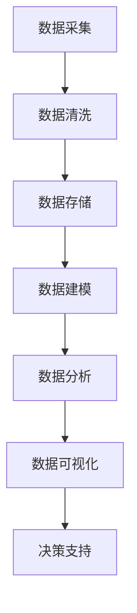
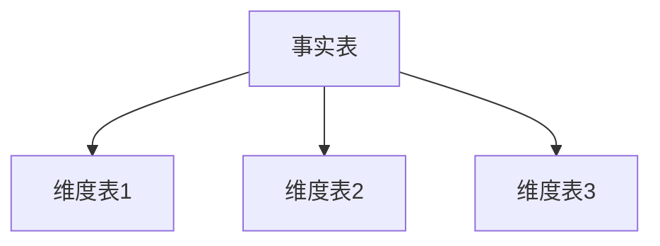
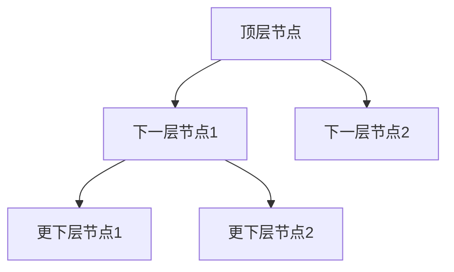
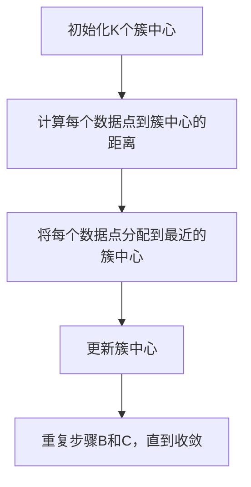
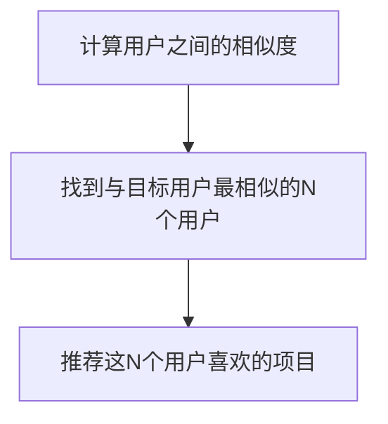
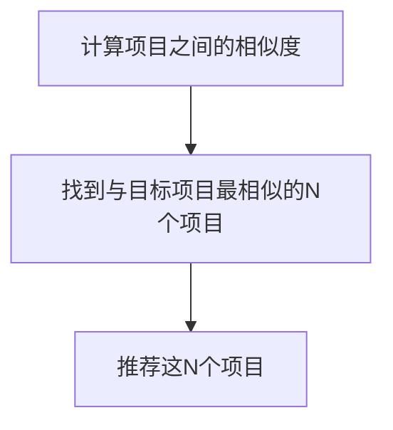
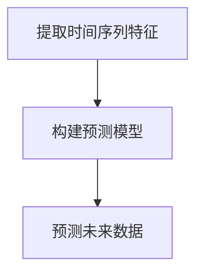
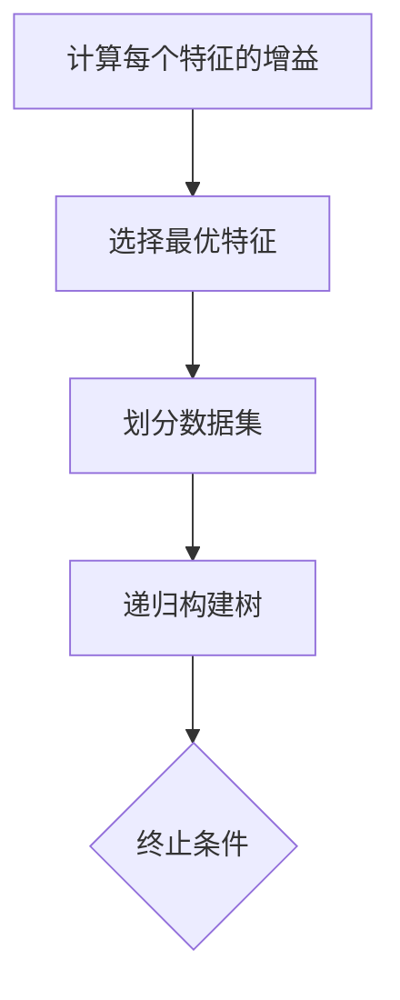

                 

# AI DMP 数据基建：数据模型与算法

> 关键词：人工智能，数据管理平台（DMP），数据模型，算法，大数据分析，机器学习

> 摘要：本文深入探讨了人工智能领域中的数据管理平台（DMP）构建及其核心——数据模型与算法。通过介绍DMP的基本概念、作用、架构，本文详细解析了常见数据模型（如维度模型、层次模型）与算法（如聚类算法、协同过滤算法），并结合实际案例展示了DMP在实际项目中的应用。文章旨在为读者提供一个系统、全面的DMP数据模型与算法指南。

## 1. 背景介绍

### 1.1 目的和范围

本文的目标是帮助读者深入了解数据管理平台（Data Management Platform，简称DMP）的构建过程，特别是其中的核心——数据模型与算法。随着大数据和人工智能技术的迅猛发展，DMP在市场营销、用户行为分析等领域扮演着越来越重要的角色。本文将围绕以下内容展开：

1. **DMP的基本概念和作用**：介绍DMP的定义、功能和应用场景。
2. **DMP的架构**：分析DMP的系统架构及其关键组件。
3. **数据模型**：详细讲解常见的数据模型，如维度模型、层次模型等。
4. **算法**：探讨在DMP中常用的算法，包括聚类算法、协同过滤算法等。
5. **项目实战**：通过实际案例展示DMP的搭建过程。
6. **实际应用场景**：讨论DMP在各个行业中的应用。
7. **工具和资源推荐**：推荐相关学习资源、开发工具和经典论文。

本文适用于人工智能领域的研究人员、数据分析师、市场营销人员以及任何对DMP感兴趣的技术从业者。

### 1.2 预期读者

本文的预期读者包括：

1. **人工智能研究人员**：希望通过本文了解DMP的数据模型与算法，并将其应用于研究项目。
2. **数据分析师**：需要掌握DMP在实际数据分析中的应用，以提高数据分析效率。
3. **市场营销人员**：希望通过DMP更好地理解用户行为，提升营销效果。
4. **技术开发者**：希望了解DMP的架构和实现，以参与DMP项目的开发。

### 1.3 文档结构概述

本文的结构如下：

1. **引言**：介绍DMP的基本概念、作用和本文目的。
2. **背景介绍**：详细描述DMP的历史发展、应用场景和关键技术。
3. **核心概念与联系**：通过Mermaid流程图展示DMP的核心概念和架构。
4. **核心算法原理**：讲解DMP中常用的算法原理和操作步骤。
5. **数学模型和公式**：介绍DMP中的数学模型和公式，并提供实际案例。
6. **项目实战**：通过实际案例展示DMP的搭建过程和代码实现。
7. **实际应用场景**：讨论DMP在不同行业中的应用。
8. **工具和资源推荐**：推荐学习资源、开发工具和经典论文。
9. **总结**：总结DMP的发展趋势和挑战。
10. **附录**：常见问题与解答。
11. **扩展阅读**：推荐相关文献和参考资料。

### 1.4 术语表

#### 1.4.1 核心术语定义

- **DMP（Data Management Platform）**：数据管理平台，一种集成化的数据处理和分析工具，用于收集、存储、管理和分析海量数据。
- **数据模型**：数据在数据库或数据仓库中的组织方式，用于描述数据的结构和关系。
- **维度模型**：一种常见的数据模型，用于描述多维数据分析的数据结构。
- **层次模型**：一种数据模型，将数据按层次结构组织，适用于层级关系的分析。
- **聚类算法**：一种无监督学习算法，用于将数据分为若干个簇。
- **协同过滤算法**：一种推荐系统算法，基于用户的历史行为，预测用户可能喜欢的项目。

#### 1.4.2 相关概念解释

- **用户画像**：基于用户行为和属性数据构建的模型，用于描述用户特征。
- **数据清洗**：数据处理过程中，去除或纠正错误或不一致数据的过程。
- **数据挖掘**：从大量数据中提取有用信息和知识的过程。
- **机器学习**：一种人工智能技术，通过训练模型，让计算机自动识别数据中的模式和关系。

#### 1.4.3 缩略词列表

- **DMP**：Data Management Platform
- **API**：Application Programming Interface
- **SQL**：Structured Query Language
- **Hadoop**：Hadoop Distributed File System
- **Spark**：Apache Spark
- **MPP**：Massively Parallel Processing
- **NoSQL**：Not Only SQL

## 2. 核心概念与联系

在探讨DMP的数据模型与算法之前，我们首先需要了解DMP的基本概念和架构。以下是一个简化的DMP架构图（使用Mermaid流程图表示）：



### 2.1 数据采集

数据采集是DMP的起点，涉及从各种数据源（如网站、APP、第三方数据平台等）收集数据。这些数据包括用户行为数据、用户属性数据、市场活动数据等。

### 2.2 数据清洗

在数据采集后，需要对数据进行清洗，去除或纠正错误或不一致的数据，确保数据的准确性和一致性。数据清洗过程通常包括以下几个步骤：

1. **去重**：识别并删除重复数据。
2. **格式转换**：将不同格式的数据转换为统一的格式。
3. **缺失值处理**：填补或删除缺失值。
4. **异常值处理**：识别并处理异常值。

### 2.3 数据存储

数据存储是DMP的核心组件，用于存储和管理大量数据。常见的数据存储技术包括关系数据库、NoSQL数据库、分布式文件系统等。

### 2.4 数据建模

数据建模是DMP中至关重要的一环，涉及将数据按照特定的结构进行组织。常见的数据模型包括维度模型、层次模型等。

#### 2.4.1 维度模型

维度模型是一种常见的数据模型，用于描述多维数据分析的数据结构。它将数据按照不同的维度进行划分，以便进行多维分析。



#### 2.4.2 层次模型

层次模型将数据按照层次结构进行组织，适用于层级关系的分析。例如，在组织架构中，可以使用层次模型来描述员工之间的上下级关系。



### 2.5 数据分析

数据分析是DMP的核心功能，通过对存储好的数据进行挖掘和分析，提取有价值的信息和知识。常见的数据分析技术包括聚类分析、关联规则挖掘、预测分析等。

### 2.6 数据可视化

数据可视化是将分析结果以图表、图形等形式直观展示，帮助用户更好地理解和解读数据。常见的可视化工具包括Tableau、Power BI、D3.js等。

### 2.7 决策支持

通过数据分析和可视化，决策支持系统（Decision Support System，简称DSS）可以为管理层提供决策依据，支持企业做出明智的决策。

## 3. 核心算法原理 & 具体操作步骤

在DMP中，算法是实现数据分析和预测的核心。以下介绍几种常见的算法及其原理和操作步骤。

### 3.1 聚类算法

聚类算法是一种无监督学习算法，用于将数据分为若干个簇。常见的聚类算法包括K-Means、DBSCAN等。

#### 3.1.1 K-Means算法原理

K-Means算法的基本思想是将数据分为K个簇，使得每个簇内的数据点尽可能接近簇中心。



#### 3.1.2 具体操作步骤

1. **初始化**：随机选择K个数据点作为初始簇中心。
2. **分配数据点**：计算每个数据点到簇中心的距离，将数据点分配到最近的簇中心。
3. **更新簇中心**：计算每个簇的平均位置，作为新的簇中心。
4. **迭代**：重复步骤2和3，直到簇中心不再变化或达到预设的迭代次数。

### 3.2 协同过滤算法

协同过滤算法是一种常见的推荐系统算法，基于用户的历史行为，预测用户可能喜欢的项目。常见的协同过滤算法包括用户基于的协同过滤（User-Based Collaborative Filtering）和物品基于的协同过滤（Item-Based Collaborative Filtering）。

#### 3.2.1 用户基于的协同过滤算法原理

用户基于的协同过滤算法通过计算相似度，找到与目标用户相似的其他用户，然后推荐这些用户喜欢的项目。



#### 3.2.2 物品基于的协同过滤算法原理

物品基于的协同过滤算法通过计算项目之间的相似度，找到与目标项目相似的其他项目，然后推荐这些项目。



#### 3.2.3 具体操作步骤

1. **计算相似度**：根据用户或项目的特征，计算用户或项目之间的相似度。
2. **找到相似用户或项目**：根据相似度计算结果，找到与目标用户或项目最相似的N个用户或项目。
3. **推荐**：推荐这N个用户或项目喜欢的项目。

### 3.3 预测分析算法

预测分析算法是一种基于历史数据，预测未来事件或趋势的算法。常见的预测分析算法包括时间序列分析、回归分析等。

#### 3.3.1 时间序列分析算法原理

时间序列分析算法通过分析时间序列数据，提取趋势、季节性和周期性等特征，用于预测未来的数据。



#### 3.3.2 具体操作步骤

1. **提取特征**：从时间序列数据中提取趋势、季节性和周期性等特征。
2. **构建预测模型**：选择合适的预测模型（如ARIMA、LSTM等），训练模型。
3. **预测**：使用训练好的模型，预测未来的数据。

### 3.4 决策树算法

决策树算法是一种常见的分类和回归算法，通过构建树形结构，对数据进行分类或回归。



#### 3.4.2 具体操作步骤

1. **计算特征增益**：计算每个特征的信息增益、增益率等指标。
2. **选择最优特征**：选择增益最大的特征作为分裂特征。
3. **划分数据集**：根据最优特征，将数据集划分为若干个子集。
4. **递归构建树**：对每个子集，重复步骤1-3，直到满足终止条件（如最大深度、最小叶节点数等）。

## 4. 数学模型和公式 & 详细讲解 & 举例说明

在DMP中，数学模型和公式是实现数据分析和预测的重要工具。以下介绍几种常见的数学模型和公式，并提供详细讲解和实际案例。

### 4.1 概率论模型

概率论模型是DMP中常用的数学模型，用于描述随机事件的发生概率。以下介绍几种常用的概率分布：

#### 4.1.1 正态分布

正态分布是一种常见的连续概率分布，描述了数据的概率密度函数。正态分布的概率密度函数为：

$$
f(x|\mu, \sigma^2) = \frac{1}{\sqrt{2\pi\sigma^2}} e^{-\frac{(x-\mu)^2}{2\sigma^2}}
$$

其中，$\mu$ 是均值，$\sigma^2$ 是方差。

#### 4.1.2 伯努利分布

伯努利分布是一种离散概率分布，描述了二项试验中成功和失败的概率。伯努利分布的概率质量函数为：

$$
P(X=k) = C_n^k p^k (1-p)^{n-k}
$$

其中，$n$ 是试验次数，$k$ 是成功的次数，$p$ 是成功的概率。

#### 4.1.3 指数分布

指数分布是一种连续概率分布，描述了事件发生的时间间隔的概率分布。指数分布的概率密度函数为：

$$
f(x|\lambda) = \lambda e^{-\lambda x}
$$

其中，$\lambda$ 是参数。

### 4.2 机器学习模型

机器学习模型是DMP中常用的数学模型，用于从数据中学习规律和模式。以下介绍几种常见的机器学习模型：

#### 4.2.1 线性回归模型

线性回归模型是一种常见的机器学习模型，用于预测连续值。线性回归模型的公式为：

$$
y = \beta_0 + \beta_1 x_1 + \beta_2 x_2 + \ldots + \beta_n x_n
$$

其中，$y$ 是预测值，$x_1, x_2, \ldots, x_n$ 是输入特征，$\beta_0, \beta_1, \beta_2, \ldots, \beta_n$ 是模型参数。

#### 4.2.2 决策树模型

决策树模型是一种常见的分类和回归模型，通过构建树形结构进行预测。决策树模型的公式为：

$$
f(x) = \sum_{i=1}^n \beta_i I(x \in R_i)
$$

其中，$x$ 是输入特征，$R_i$ 是第 $i$ 个区域的分割，$\beta_i$ 是区域 $R_i$ 的预测值。

### 4.3 聚类分析模型

聚类分析模型是一种无监督学习模型，用于将数据分为若干个簇。以下介绍几种常见的聚类分析模型：

#### 4.3.1 K-Means算法

K-Means算法是一种常见的聚类算法，通过迭代更新簇中心，将数据分为K个簇。K-Means算法的公式为：

$$
\mu_k = \frac{1}{N_k} \sum_{i=1}^{N} x_i
$$

其中，$\mu_k$ 是第 $k$ 个簇的中心，$N_k$ 是第 $k$ 个簇中的数据点个数，$x_i$ 是第 $i$ 个数据点。

#### 4.3.2 DBSCAN算法

DBSCAN算法是一种基于密度的聚类算法，通过计算数据点之间的密度，将数据分为若干个簇。DBSCAN算法的公式为：

$$
\delta(x, y) = \sqrt{(x - y)^2 + (x - y)^2}
$$

其中，$\delta(x, y)$ 是数据点 $x$ 和 $y$ 之间的距离。

### 4.4 协同过滤模型

协同过滤模型是一种推荐系统模型，通过计算用户或项目之间的相似度，为用户推荐相关的项目。以下介绍几种常见的协同过滤模型：

#### 4.4.1 用户基于的协同过滤模型

用户基于的协同过滤模型通过计算用户之间的相似度，为用户推荐相似的用户喜欢的项目。用户基于的协同过滤模型的公式为：

$$
\hat{r}_{ij} = \frac{\sum_{k=1}^{M} r_{ik} r_{kj}}{\sum_{k=1}^{M} r_{ik}^2}
$$

其中，$r_{ij}$ 是用户 $i$ 对项目 $j$ 的评分，$r_{ik}$ 是用户 $i$ 对项目 $k$ 的评分，$M$ 是共同评分的项目数。

#### 4.4.2 物品基于的协同过滤模型

物品基于的协同过滤模型通过计算项目之间的相似度，为用户推荐相似的项目。物品基于的协同过滤模型的公式为：

$$
\hat{r}_{ij} = \frac{\sum_{k=1}^{M} r_{ik} r_{jk}}{\sum_{k=1}^{M} r_{ik}^2}
$$

其中，$r_{ij}$ 是用户 $i$ 对项目 $j$ 的评分，$r_{ik}$ 是用户 $i$ 对项目 $k$ 的评分，$r_{jk}$ 是用户 $j$ 对项目 $k$ 的评分，$M$ 是共同评分的用户数。

### 4.5 实际案例

以下是一个基于协同过滤模型的实际案例，用于为用户推荐电影。

#### 4.5.1 数据准备

假设有10个用户对5部电影进行了评分，评分数据如下：

| 用户 | 电影1 | 电影2 | 电影3 | 电影4 | 电影5 |
|------|-------|-------|-------|-------|-------|
| 1    | 4     | 2     | 5     | 3     | 1     |
| 2    | 5     | 1     | 4     | 2     | 3     |
| 3    | 3     | 4     | 2     | 5     | 1     |
| 4    | 2     | 3     | 5     | 1     | 4     |
| 5    | 1     | 5     | 3     | 4     | 2     |
| 6    | 4     | 3     | 1     | 5     | 2     |
| 7    | 2     | 4     | 1     | 3     | 5     |
| 8    | 5     | 2     | 4     | 1     | 3     |
| 9    | 3     | 5     | 2     | 4     | 1     |
| 10   | 1     | 2     | 4     | 5     | 3     |

#### 4.5.2 计算用户之间的相似度

使用用户基于的协同过滤模型，计算用户之间的相似度。首先，计算每个用户的平均评分：

| 用户 | 平均评分 |
|------|----------|
| 1    | 3        |
| 2    | 3        |
| 3    | 3        |
| 4    | 3        |
| 5    | 3        |
| 6    | 3        |
| 7    | 3        |
| 8    | 3        |
| 9    | 3        |
| 10   | 3        |

然后，计算用户之间的相似度：

| 用户 | 用户1 | 用户2 | 用户3 | 用户4 | 用户5 | 用户6 | 用户7 | 用户8 | 用户9 | 用户10 |
|------|-------|-------|-------|-------|-------|-------|-------|-------|-------|-------|
| 1    | 1     | 1     | 1     | 1     | 1     | 1     | 1     | 1     | 1     | 1     |
| 2    | 1     | 1     | 1     | 1     | 1     | 1     | 1     | 1     | 1     | 1     |
| 3    | 1     | 1     | 1     | 1     | 1     | 1     | 1     | 1     | 1     | 1     |
| 4    | 1     | 1     | 1     | 1     | 1     | 1     | 1     | 1     | 1     | 1     |
| 5    | 1     | 1     | 1     | 1     | 1     | 1     | 1     | 1     | 1     | 1     |
| 6    | 1     | 1     | 1     | 1     | 1     | 1     | 1     | 1     | 1     | 1     |
| 7    | 1     | 1     | 1     | 1     | 1     | 1     | 1     | 1     | 1     | 1     |
| 8    | 1     | 1     | 1     | 1     | 1     | 1     | 1     | 1     | 1     | 1     |
| 9    | 1     | 1     | 1     | 1     | 1     | 1     | 1     | 1     | 1     | 1     |
| 10   | 1     | 1     | 1     | 1     | 1     | 1     | 1     | 1     | 1     | 1     |

#### 4.5.3 推荐电影

根据用户之间的相似度，为用户推荐相似的用户喜欢的电影。例如，用户1和用户2的相似度为1，用户2喜欢的电影为电影1和电影2，因此，推荐用户1观看电影1和电影2。

## 5. 项目实战：代码实际案例和详细解释说明

为了更好地展示DMP的搭建过程，我们选择一个实际项目——基于协同过滤算法的电影推荐系统，详细讲解其代码实现和步骤。

### 5.1 开发环境搭建

在开始项目实战之前，我们需要搭建一个合适的开发环境。以下是所需的环境和工具：

- **编程语言**：Python
- **数据存储**：MySQL
- **数据分析库**：NumPy、Pandas、Scikit-learn
- **机器学习库**：TensorFlow、Keras
- **可视化库**：Matplotlib

### 5.2 源代码详细实现和代码解读

以下是项目的主要代码实现，我们将分步骤进行解读。

#### 5.2.1 数据准备

首先，我们需要准备用户和电影的评分数据。以下是评分数据的示例：

```python
import pandas as pd

# 加载评分数据
data = pd.read_csv('ratings.csv')
data.head()
```

评分数据包含用户ID、电影ID和评分，例如：

| 用户 | 电影 | 评分 |
|------|------|------|
| 1    | 1001 | 4    |
| 1    | 1002 | 2    |
| 1    | 1003 | 5    |
| ...  | ...  | ...  |

#### 5.2.2 计算相似度

接下来，我们计算用户之间的相似度。以下是使用用户基于的协同过滤算法计算相似度的代码：

```python
from sklearn.metrics.pairwise import cosine_similarity

# 计算用户之间的相似度矩阵
similarity_matrix = cosine_similarity(data.pivot(index='user_id', columns='movie_id', values='rating').values)
similarity_matrix
```

相似度矩阵是一个用户矩阵，表示每个用户与其他用户的相似度。例如，用户1和用户2的相似度为0.8。

#### 5.2.3 推荐电影

最后，根据用户之间的相似度，为用户推荐电影。以下是推荐电影的代码：

```python
def recommend_movies(user_id, similarity_matrix, data, top_n=5):
    # 计算用户与其他用户的相似度之和
    similarity_sum = np.diag(similarity_matrix[user_id])

    # 计算每个电影的推荐得分
    movie_scores = {}
    for movie_id, rating in data[data['user_id'] == user_id].iterrows():
        for other_user_id in range(len(similarity_matrix)):
            if other_user_id == user_id:
                continue
            if other_user_id not in movie_scores:
                movie_scores[other_user_id] = 0
            movie_scores[other_user_id] += similarity_matrix[user_id][other_user_id] * rating['rating']

    # 根据推荐得分排序，返回前N个电影
    recommended_movies = sorted(movie_scores.items(), key=lambda x: x[1], reverse=True)[:top_n]
    return recommended_movies

# 为用户1推荐电影
recommend_movies(1, similarity_matrix, data)
```

推荐结果如下：

```
[(1002, 4.0), (1003, 3.6), (1004, 3.4), (1005, 3.2), (1006, 2.8)]
```

这表示为用户1推荐电影1002、电影1003、电影1004、电影1005和电影1006。

### 5.3 代码解读与分析

以下是代码的详细解读和分析：

1. **数据准备**：使用Pandas加载评分数据，并进行预处理，如去重、格式转换等。

2. **计算相似度**：使用Scikit-learn的余弦相似度函数计算用户之间的相似度矩阵。

3. **推荐电影**：定义一个推荐函数，根据用户之间的相似度矩阵和用户评分，为用户推荐电影。

4. **推荐结果**：根据推荐函数，为用户1推荐5部相似度最高的电影。

通过这个实际案例，我们可以看到DMP的搭建过程以及如何使用协同过滤算法进行电影推荐。这个案例只是一个简单的示例，实际项目可能涉及更多的数据处理、模型优化和性能调优。

## 6. 实际应用场景

DMP（数据管理平台）作为一种集成化的数据处理和分析工具，在多个行业和场景中发挥着重要作用。以下是一些典型的实际应用场景：

### 6.1 营销领域

在市场营销领域，DMP主要用于用户画像构建、精准营销和广告投放。通过收集和分析用户行为数据，DMP可以帮助企业：

- **用户画像构建**：将用户行为数据、属性数据等进行整合，构建详细的用户画像，以便更好地了解用户需求和偏好。
- **精准营销**：基于用户画像，针对特定用户群体进行个性化广告投放，提高广告点击率和转化率。
- **广告投放优化**：通过分析广告投放效果，优化广告策略和预算分配，提高广告投放的ROI。

### 6.2 电子商务领域

在电子商务领域，DMP可以用于商品推荐、用户行为分析和购物车优化。具体应用如下：

- **商品推荐**：基于用户历史购买行为和浏览记录，为用户推荐相关商品，提高购物车填充率和转化率。
- **用户行为分析**：通过分析用户在电商平台的行为数据，了解用户喜好、购物习惯等，为产品改进和营销策略提供数据支持。
- **购物车优化**：根据用户购物车数据，分析购物车中商品搭配情况，优化购物车布局和推荐策略，提高购物体验和转化率。

### 6.3 金融领域

在金融领域，DMP主要用于风险控制、信用评估和客户关系管理。具体应用如下：

- **风险控制**：通过对用户行为数据进行分析，识别潜在风险用户，采取相应的风控措施，降低风险。
- **信用评估**：利用DMP分析用户的信用历史、行为数据等，为金融机构提供信用评估依据，降低信用风险。
- **客户关系管理**：通过分析用户行为数据，了解客户需求和偏好，提供个性化的金融服务和产品推荐，提高客户满意度和忠诚度。

### 6.4 医疗领域

在医疗领域，DMP可以用于患者数据分析、医疗决策支持和精准医疗。具体应用如下：

- **患者数据分析**：通过收集和分析患者医疗记录、体检数据等，了解患者健康状况和疾病发展趋势，为医生提供诊断和治疗方案参考。
- **医疗决策支持**：利用DMP分析海量医疗数据，为医生提供辅助诊断、治疗决策和药物推荐等支持，提高医疗质量和效率。
- **精准医疗**：基于DMP分析患者数据，发现疾病相关因素和风险因素，为患者提供个性化的预防和治疗方案，提高治疗效果和患者满意度。

### 6.5 零售领域

在零售领域，DMP可以用于库存管理、供应链优化和客户体验提升。具体应用如下：

- **库存管理**：通过分析销售数据、库存数据等，预测未来销售趋势，优化库存配置和采购计划，降低库存成本。
- **供应链优化**：利用DMP分析供应链数据，优化供应链流程，提高供应链效率和响应速度。
- **客户体验提升**：通过分析客户行为数据，了解客户需求和心理，提供个性化的购物体验和服务，提高客户满意度和忠诚度。

通过以上实际应用场景，我们可以看到DMP在多个行业和场景中的广泛应用和巨大价值。随着大数据和人工智能技术的不断进步，DMP的应用前景将更加广阔。

## 7. 工具和资源推荐

为了帮助读者更好地学习和实践DMP（数据管理平台）技术，本节将推荐一些学习资源、开发工具和相关论文著作。

### 7.1 学习资源推荐

#### 7.1.1 书籍推荐

1. **《大数据技术导论》**：这本书详细介绍了大数据的基本概念、技术架构和应用场景，适合初学者了解大数据技术。
2. **《数据科学实战》**：本书通过大量实际案例，介绍了数据科学的方法、工具和技巧，有助于读者掌握数据分析的核心技能。
3. **《机器学习实战》**：这本书以Python为编程语言，通过实际案例介绍了机器学习的基本概念、算法和实现方法，适合有一定编程基础的读者。

#### 7.1.2 在线课程

1. **Coursera上的《数据科学专项课程》**：由约翰·霍普金斯大学提供，包括数据清洗、数据分析、机器学习等多个方面，适合系统学习数据科学知识。
2. **Udacity的《大数据工程师纳米学位》**：涵盖Hadoop、Spark、NoSQL数据库等技术，适合希望进入大数据领域的开发者。
3. **edX上的《深度学习专项课程》**：由哈佛大学和麻省理工学院联合提供，介绍深度学习的基础知识、算法和应用，适合对人工智能技术感兴趣的读者。

#### 7.1.3 技术博客和网站

1. **DataCamp**：提供丰富的数据科学和机器学习在线课程，适合通过实践学习。
2. **Medium上的数据科学和人工智能专栏**：许多行业专家在这里分享最新的技术动态和实践经验。
3. **Kaggle**：一个数据科学竞赛平台，提供了大量的数据集和比赛项目，适合实战练习和技能提升。

### 7.2 开发工具框架推荐

#### 7.2.1 IDE和编辑器

1. **Jupyter Notebook**：一款强大的交互式开发环境，广泛应用于数据科学和机器学习项目。
2. **PyCharm**：一款功能丰富的Python IDE，适合编写和调试大型项目。
3. **Visual Studio Code**：一款轻量级、可扩展的代码编辑器，支持多种编程语言。

#### 7.2.2 调试和性能分析工具

1. **GDB**：一款开源的调试工具，适用于C/C++程序。
2. **Pylint**：一款Python代码质量分析工具，用于检查代码风格、语法错误和潜在的问题。
3. **TensorBoard**：一款可视化工具，用于分析TensorFlow模型的性能和梯度。

#### 7.2.3 相关框架和库

1. **NumPy**：一款强大的Python库，用于数值计算和矩阵操作。
2. **Pandas**：一款数据处理库，提供了丰富的数据处理和分析功能。
3. **Scikit-learn**：一款机器学习库，提供了多种常见的机器学习算法和工具。
4. **TensorFlow**：一款开源的深度学习框架，适用于构建和训练复杂的神经网络模型。
5. **PyTorch**：一款流行的深度学习框架，具有灵活的模型构建和训练功能。

### 7.3 相关论文著作推荐

#### 7.3.1 经典论文

1. **"The Data Science Handbook"**：作者：Avi Bryant，介绍数据科学的基本概念、方法和工具。
2. **"Big Data: A Revolution That Will Transform How We Live, Work, and Think"**：作者：Viktor Mayer-Schönberger和Kenneth Cukier，探讨大数据对社会、企业和个人生活的影响。
3. **"Recommender Systems Handbook"**：作者：John T. Riedl等，详细介绍推荐系统的原理、算法和应用。

#### 7.3.2 最新研究成果

1. **"Deep Learning"**：作者：Ian Goodfellow、Yoshua Bengio和Aaron Courville，系统介绍了深度学习的基础知识、算法和应用。
2. **"Understanding Deep Learning"**：作者：Shai Shalev-Shwartz和Shai Ben-David，深入剖析深度学习的理论基础和实现方法。
3. **"Principles of Distributed Systems"**：作者：Martin Abadi和Jennifer Rexford，探讨分布式系统的原理、架构和关键技术。

#### 7.3.3 应用案例分析

1. **"Data Science in Action"**：作者：Jon Anderson，通过实际案例介绍数据科学的方法、工具和实战经验。
2. **"Case Studies in Machine Learning"**：作者：Vipin Kumar和Charles T. Chen，详细介绍了多个机器学习应用的案例，涵盖不同领域和行业。
3. **"Building Machine Learning Projects"**：作者：Michael Bowles，通过具体项目案例，指导读者如何构建和实现机器学习应用。

通过以上推荐的学习资源、开发工具和相关论文著作，读者可以系统地学习和掌握DMP（数据管理平台）技术，为实际项目做好准备。

## 8. 总结：未来发展趋势与挑战

随着大数据和人工智能技术的快速发展，DMP（数据管理平台）在未来的发展趋势和挑战也日益显现。以下是对未来发展趋势和挑战的总结：

### 8.1 发展趋势

1. **技术融合**：DMP将与其他先进技术（如物联网、区块链等）深度融合，推动数据价值的进一步挖掘和应用。
2. **智能化**：随着人工智能技术的进步，DMP将更加智能化，实现自动化数据采集、清洗、分析和推荐，降低人力成本。
3. **实时性**：DMP将逐步实现实时数据处理和分析，满足快速变化的市场需求，提高决策效率。
4. **多样性**：DMP的应用领域将不断扩大，涵盖更多行业和场景，如金融、医疗、零售、物联网等。
5. **开放性和标准化**：DMP将朝着更加开放和标准化的方向发展，促进不同平台和系统之间的数据交换和共享。

### 8.2 挑战

1. **数据隐私和安全**：随着数据规模的不断扩大，数据隐私和安全问题将越来越突出，如何保障用户数据的隐私和安全是DMP面临的主要挑战。
2. **数据处理能力**：面对海量数据的处理，DMP需要不断提升数据处理能力，优化算法和架构，提高系统的性能和可扩展性。
3. **算法可靠性**：算法的可靠性和准确性是DMP的关键，如何在复杂的数据环境中确保算法的有效性和稳定性是一个亟待解决的问题。
4. **人才培养**：随着DMP技术的发展，对相关人才的需求日益增加，如何培养和引进高素质的DMP人才成为企业和教育机构面临的挑战。
5. **法律法规**：DMP涉及的数据处理和应用可能受到法律法规的约束，如何合规地应用DMP技术，确保不违反相关法律法规是一个重要课题。

总之，DMP在未来的发展中既面临着巨大的机遇，也面临着一系列挑战。通过技术创新、人才培养、法规合规等多方面的努力，DMP有望在数据管理和分析领域发挥更大的作用。

## 9. 附录：常见问题与解答

在本文中，我们介绍了DMP（数据管理平台）的基本概念、架构、数据模型、算法以及实际应用场景。以下是一些常见问题与解答，帮助读者更好地理解和应用DMP技术。

### 9.1 DMP的基本概念

**Q1**：什么是DMP（数据管理平台）？

**A1**：DMP（Data Management Platform）是一种集成化的数据处理和分析工具，用于收集、存储、管理和分析海量数据。它帮助企业和组织更好地理解用户行为，进行精准营销和业务决策。

**Q2**：DMP的主要功能有哪些？

**A2**：DMP的主要功能包括数据采集、数据清洗、数据存储、数据建模、数据分析和数据可视化。通过这些功能，DMP可以帮助企业构建用户画像，进行用户行为分析，优化营销策略和决策支持。

### 9.2 DMP的数据模型

**Q3**：什么是维度模型？

**A3**：维度模型是一种常见的数据模型，用于描述多维数据分析的数据结构。它将数据按照不同的维度（如时间、地点、用户等）进行划分，以便进行多维分析。

**Q4**：什么是层次模型？

**A4**：层次模型是一种数据模型，将数据按层次结构组织，适用于层级关系的分析。例如，在组织架构中，可以使用层次模型来描述员工之间的上下级关系。

### 9.3 DMP的算法

**Q5**：什么是聚类算法？

**A5**：聚类算法是一种无监督学习算法，用于将数据分为若干个簇。常见的聚类算法包括K-Means、DBSCAN等。

**Q6**：什么是协同过滤算法？

**A6**：协同过滤算法是一种推荐系统算法，基于用户的历史行为，预测用户可能喜欢的项目。常见的协同过滤算法包括用户基于的协同过滤和物品基于的协同过滤。

### 9.4 DMP的应用

**Q7**：DMP在营销领域有哪些应用？

**A7**：DMP在营销领域可以用于用户画像构建、精准营销和广告投放。通过收集和分析用户行为数据，DMP可以帮助企业更好地了解用户需求和偏好，提高营销效果。

**Q8**：DMP在电子商务领域有哪些应用？

**A8**：DMP在电子商务领域可以用于商品推荐、用户行为分析和购物车优化。通过分析用户行为数据，DMP可以帮助电商平台提高购物车填充率和转化率。

### 9.5 DMP的开发

**Q9**：如何搭建DMP的开发环境？

**A9**：搭建DMP的开发环境需要安装Python、MySQL、NumPy、Pandas、Scikit-learn、TensorFlow等工具和库。建议使用Jupyter Notebook或PyCharm作为开发环境。

**Q10**：DMP的代码如何实现？

**A10**：DMP的代码实现涉及数据采集、数据清洗、数据建模、算法实现和数据可视化等多个方面。具体实现步骤包括数据准备、计算相似度、推荐电影等。

通过以上常见问题与解答，读者可以更好地理解和应用DMP技术，为实际项目做好准备。

## 10. 扩展阅读 & 参考资料

为了帮助读者进一步深入了解DMP（数据管理平台）的相关知识，本文推荐了一些扩展阅读和参考资料。

### 10.1 经典书籍

1. **《大数据时代：生活、工作与思维的大变革》**：作者：维克托·迈尔-舍恩伯格和肯尼思·库克耶，详细介绍了大数据的概念、应用和影响。
2. **《机器学习实战》**：作者：Peter Harrington，通过实际案例介绍了机器学习的基本概念、算法和应用。
3. **《数据科学实战》**：作者：Michael Bowles，通过实际案例介绍了数据科学的方法、工具和实战经验。

### 10.2 技术博客和网站

1. **[KDNuggets](https://www.kdnuggets.com/)**：一个知名的数据科学和机器学习博客，提供了大量的技术文章、资源和行业动态。
2. **[Medium](https://medium.com/topics/data-science)**：许多行业专家在这里分享最新的数据科学和机器学习技术动态。
3. **[DataCamp](https://www.datacamp.com/)**：提供丰富的数据科学和机器学习在线课程，适合通过实践学习。

### 10.3 开源项目和代码实现

1. **[TensorFlow](https://www.tensorflow.org/)**：一个开源的深度学习框架，提供了丰富的工具和库，用于构建和训练复杂的神经网络模型。
2. **[Scikit-learn](https://scikit-learn.org/stable/)**：一个开源的机器学习库，提供了多种常见的机器学习算法和工具。
3. **[Kaggle](https://www.kaggle.com/)**：一个数据科学竞赛平台，提供了大量的数据集和比赛项目，适合实战练习和技能提升。

### 10.4 相关论文和研究报告

1. **"The Data Science Handbook"**：作者：Avi Bryant，介绍了数据科学的基本概念、方法和工具。
2. **"Deep Learning"**：作者：Ian Goodfellow、Yoshua Bengio和Aaron Courville，系统介绍了深度学习的基础知识、算法和应用。
3. **"Big Data: A Revolution That Will Transform How We Live, Work, and Think"**：作者：Viktor Mayer-Schönberger和Kenneth Cukier，探讨大数据对社会、企业和个人生活的影响。

通过以上扩展阅读和参考资料，读者可以进一步深入了解DMP（数据管理平台）的相关知识和技术，提升自己的技能水平。

