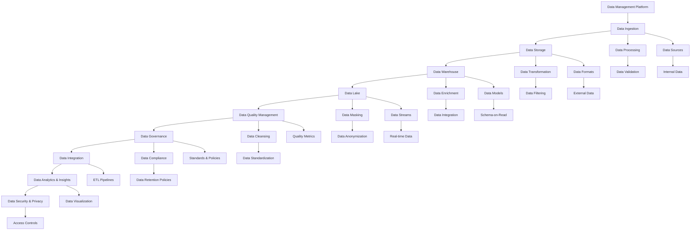
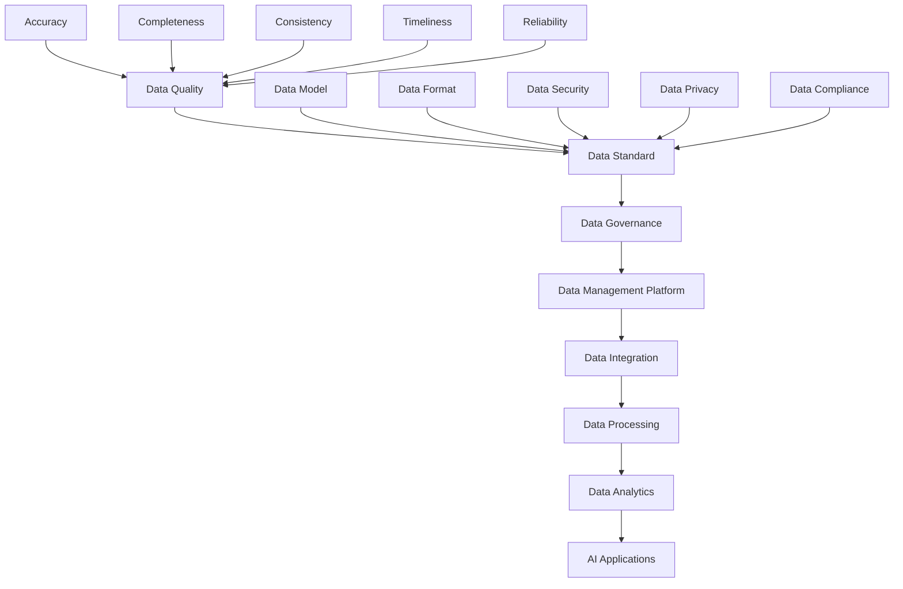
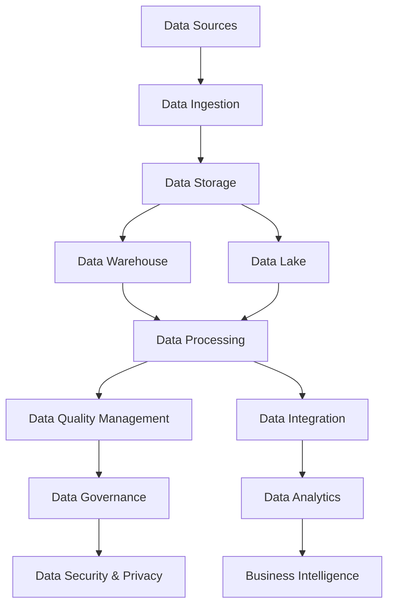

                 

# AI DMP 数据基建：数据质量与数据标准

> **关键词：** 数据管理平台（DMP）、数据质量、数据标准、数据治理、数据处理、数据清洗、数据整合、数据一致性、数据完整性、数据安全、数据隐私。

> **摘要：** 本文将深入探讨人工智能数据管理平台（DMP）的数据基础设施，重点分析数据质量和数据标准的至关重要性。我们将通过一系列逻辑分析、算法原理讲解、数学模型解析以及实战案例分析，帮助读者理解数据质量与数据标准在AI领域的重要性，并掌握如何有效构建和优化DMP的数据基础。

## 1. 背景介绍

### 1.1 目的和范围

本文旨在详细探讨人工智能数据管理平台（DMP）的数据基础设施建设，特别是数据质量和数据标准的重要性。我们希望通过以下三个方面来阐述：

1. **数据质量的重要性**：介绍数据质量对AI模型的性能和决策影响，以及如何确保数据质量。
2. **数据标准的概念与实施**：探讨数据标准在DMP中的作用，包括数据一致性、数据完整性和数据安全。
3. **实战案例分析**：通过具体项目实例展示如何在实际环境中构建和优化DMP的数据基础。

### 1.2 预期读者

本篇文章主要面向以下读者群体：

- 数据工程师和数据科学家
- AI研究人员和开发人员
- 数据治理和IT管理人员
- 对数据管理平台和数据质量有兴趣的任何技术爱好者

### 1.3 文档结构概述

本文将按照以下结构展开：

1. **背景介绍**：本文的目的、预期读者和文档结构概述。
2. **核心概念与联系**：介绍DMP的架构和相关核心概念。
3. **核心算法原理与具体操作步骤**：讲解数据质量评估方法和数据标准化流程。
4. **数学模型和公式**：详细解释数据质量评估的相关数学模型。
5. **项目实战：代码实际案例和详细解释说明**：通过具体代码实例展示数据质量提升和标准化过程。
6. **实际应用场景**：探讨数据质量和数据标准在不同行业中的应用。
7. **工具和资源推荐**：推荐学习资源、开发工具和最新研究成果。
8. **总结：未来发展趋势与挑战**：总结DMP数据基础设施的发展方向和面临的挑战。
9. **附录：常见问题与解答**：回答读者可能关心的问题。
10. **扩展阅读 & 参考资料**：提供进一步学习和研究的资料。

### 1.4 术语表

#### 1.4.1 核心术语定义

- **DMP**：数据管理平台，用于收集、存储、管理和分析大规模数据的系统。
- **数据质量**：数据满足预期使用目标的程度，包括准确性、完整性、一致性、及时性和可靠性。
- **数据标准**：一组定义、规则和指南，用于确保数据的一致性、完整性和准确性。
- **数据治理**：确保数据质量和合规性的管理和控制过程。
- **数据清洗**：识别并纠正（或删除）数据集中的错误、重复或不完整的数据。
- **数据整合**：将来自多个来源的数据合并为一个统一的视图。

#### 1.4.2 相关概念解释

- **数据一致性**：确保同一数据在不同系统和存储中的表示和值相同。
- **数据完整性**：确保数据的准确性、一致性和可靠性。
- **数据安全性**：保护数据免受未经授权的访问、修改或泄露。

#### 1.4.3 缩略词列表

- **DMP**：数据管理平台
- **AI**：人工智能
- **ETL**：提取、转换、加载
- **ML**：机器学习
- **GDPR**：通用数据保护条例

## 2. 核心概念与联系

在讨论DMP的数据基础设施之前，我们需要明确几个核心概念，并展示它们之间的联系。以下是DMP的核心概念及其相互关系：

### DMP架构与核心概念



### 数据质量与数据标准

数据质量和数据标准是DMP中至关重要的概念。数据质量直接影响到AI模型的性能和决策结果，而数据标准则确保数据的一致性和准确性。

#### 数据质量指标

- **准确性**：数据是否真实反映了现实世界的情况。
- **完整性**：数据集是否包含所有必需的信息。
- **一致性**：数据在不同系统和存储中的表示是否相同。
- **及时性**：数据是否能够及时更新和反映最新情况。
- **可靠性**：数据是否能够稳定地提供正确的结果。

#### 数据标准

数据标准包括以下方面：

- **数据模型**：定义数据的结构、字段和关系。
- **数据格式**：规定数据的存储和交换格式。
- **数据治理**：确保数据质量和合规性的管理和控制。
- **数据完整性**：确保数据的准确性、一致性和可靠性。
- **数据安全性和隐私**：保护数据免受未经授权的访问、修改或泄露。

### 核心概念关系图



通过以上核心概念和关系的阐述，我们可以更好地理解DMP的数据基础设施，并为后续章节的数据质量评估、数据标准实施和实战案例分析打下基础。

### 2.1 数据管理平台（DMP）的关键组件

在深入探讨DMP的核心概念与联系之后，接下来，我们将重点关注DMP中的关键组件，这些组件共同构成了DMP的核心架构，并在数据管理过程中发挥着至关重要的作用。

#### 数据采集与数据摄取

数据采集（Data Ingestion）是DMP的基础，负责将数据从各种源（如数据库、文件、Web API等）导入到DMP中。数据摄取包括数据的收集、验证和初步清洗，以确保数据的初步质量。

- **数据摄取工具**：常见的摄取工具有Apache NiFi、Apache Kafka等，这些工具提供了高效的数据流管理和处理能力。
- **摄取策略**：数据摄取策略需要考虑数据源的类型、数据量的规模以及数据流的实时性。例如，对于实时数据，需要选择低延迟的摄取工具。

#### 数据存储

数据存储（Data Storage）是DMP的核心，负责存储和管理大量的数据。数据存储可以分为以下几种类型：

- **关系型数据库**：如MySQL、PostgreSQL，适用于结构化数据的存储和查询。
- **非关系型数据库**：如MongoDB、Cassandra，适用于存储半结构化或非结构化数据。
- **数据仓库**：如Amazon Redshift、Google BigQuery，适用于大规模数据集的存储和分析。
- **数据湖**：如Hadoop HDFS、Amazon S3，适用于存储大量原始数据，支持数据的长期存储和灵活的查询。

#### 数据处理

数据处理（Data Processing）是DMP中至关重要的环节，负责将原始数据进行清洗、转换和整合，使其适合进一步的分析和应用。

- **ETL过程**：提取（Extract）、转换（Transform）、加载（Load）是数据处理的核心过程。常见的ETL工具有Apache Airflow、Talend等。
- **数据清洗**：包括去除重复数据、纠正错误数据、填充缺失值等。
- **数据转换**：包括数据格式的转换、数据类型的转换、数据比例的调整等。
- **数据整合**：将来自多个数据源的数据合并为一个统一的视图。

#### 数据质量管理

数据质量管理（Data Quality Management）确保数据满足特定的质量和标准，以支持数据分析和决策。数据质量管理包括以下几个方面：

- **数据质量检查**：通过自动化工具检查数据的质量问题，如数据准确性、完整性、一致性等。
- **数据修复**：自动或手动修复数据中的质量问题。
- **数据监控**：持续监控数据质量，确保数据在生产和维护过程中保持高质量。

#### 数据治理

数据治理（Data Governance）是确保数据质量和合规性的关键过程，包括以下几个方面：

- **数据策略**：制定数据管理和使用的策略，确保数据的一致性和准确性。
- **数据权限**：管理数据访问权限，确保只有授权用户能够访问和使用数据。
- **数据安全**：保护数据免受未经授权的访问、修改和泄露。
- **数据合规**：确保数据符合相关的法律法规和标准，如GDPR、HIPAA等。

#### 数据分析

数据分析（Data Analytics）是DMP的最终目标，通过数据分析和挖掘，从海量数据中提取有价值的信息和洞察，支持决策和业务优化。

- **数据挖掘**：使用机器学习和统计分析技术，从数据中发现隐藏的模式和关联。
- **数据可视化**：通过图形化界面展示数据分析和挖掘的结果，帮助用户更好地理解和利用数据。
- **业务智能**：将数据分析结果应用到具体的业务场景，提升业务效率和决策质量。

### 综合架构图

以下是DMP的综合架构图，展示了各个关键组件之间的相互关系：



通过以上关键组件的详细阐述，我们可以更好地理解DMP的整体架构和功能，为后续章节的数据质量评估、数据标准实施和实战案例分析提供了坚实的基础。

### 2.2 数据质量管理的基本原则和最佳实践

数据质量管理是DMP成功的关键因素之一。为了确保数据能够支持高效的数据分析和业务决策，我们需要遵循一系列基本原则和最佳实践。以下是数据质量管理的基本原则和最佳实践：

#### 1. 数据准确性

数据准确性是数据质量的首要标准。准确的数据能够确保决策和业务操作的可靠性。以下是一些确保数据准确性的最佳实践：

- **验证数据源**：在数据摄取过程中，对数据源进行验证，确保其可信度和稳定性。
- **数据清洗**：使用自动化工具进行数据清洗，识别并纠正错误、重复或不完整的数据。
- **数据标准化**：对数据进行标准化处理，如统一货币符号、日期格式等，确保数据的一致性。

#### 2. 数据完整性

数据完整性是指数据是否包含所有必需的信息，以及数据是否能够完整地反映现实世界的情况。以下是一些确保数据完整性的最佳实践：

- **缺失值处理**：对于缺失的数据，可以通过填补缺失值或使用统计方法来处理。
- **数据校验**：在数据导入和更新过程中，进行数据校验，确保数据的完整性和一致性。
- **数据备份和恢复**：定期备份数据，并确保数据恢复机制的可用性，以应对数据丢失或损坏的情况。

#### 3. 数据一致性

数据一致性确保同一数据在不同系统和存储中的表示和值相同。以下是一些确保数据一致性的最佳实践：

- **数据同步**：通过数据同步工具，确保数据在不同系统之间的更新和同步。
- **数据标准**：制定和实施统一的数据标准，如数据模型、数据格式和数据命名规范。
- **数据映射**：确保数据在转换和整合过程中，保持其原有的意义和一致性。

#### 4. 数据及时性

数据及时性是指数据能够及时更新和反映最新情况。以下是一些确保数据及时性的最佳实践：

- **实时数据流**：对于需要实时分析的数据，使用实时数据流处理工具，如Apache Kafka、Apache NiFi等。
- **数据调度**：定期调度数据采集和处理任务，确保数据的及时性和准确性。
- **数据缓存**：使用数据缓存技术，提高数据的访问速度和响应时间。

#### 5. 数据可靠性

数据可靠性是指数据能够稳定地提供正确的结果。以下是一些确保数据可靠性的最佳实践：

- **数据校验**：在数据采集和传输过程中，进行多级校验，确保数据的可靠性。
- **容错机制**：在数据处理和存储过程中，实现容错机制，如数据备份、多副本存储等。
- **性能监控**：持续监控数据的处理速度和存储性能，确保数据服务的稳定性和可靠性。

#### 6. 数据安全性

数据安全性是确保数据免受未经授权的访问、修改和泄露。以下是一些确保数据安全性的最佳实践：

- **访问控制**：实施严格的访问控制策略，确保只有授权用户能够访问特定的数据。
- **数据加密**：对敏感数据进行加密处理，确保数据在传输和存储过程中的安全性。
- **合规性**：确保数据符合相关的法律法规和标准，如GDPR、HIPAA等。

#### 7. 数据治理

数据治理是确保数据质量和合规性的关键过程。以下是一些数据治理的最佳实践：

- **数据策略**：制定和实施数据管理和使用的策略，确保数据的一致性和准确性。
- **数据权限**：管理数据访问权限，确保只有授权用户能够访问和使用数据。
- **数据安全**：保护数据免受未经授权的访问、修改和泄露。
- **数据合规**：确保数据符合相关的法律法规和标准，如GDPR、HIPAA等。

### 数据质量管理框架

为了更系统地管理数据质量，可以采用以下数据质量管理框架：

- **数据质量计划**：制定数据质量管理的计划和目标。
- **数据质量检查**：定期进行数据质量检查，识别和纠正质量问题。
- **数据质量报告**：生成数据质量报告，向管理层和业务团队提供数据质量的最新状况。
- **数据质量监控**：持续监控数据质量，确保数据在生产和维护过程中保持高质量。
- **数据质量改进**：根据数据质量报告和监控结果，持续改进数据质量。

通过以上基本原则和最佳实践，我们可以确保DMP中的数据质量，从而为数据分析和业务决策提供可靠的基础。在接下来的章节中，我们将详细探讨数据质量评估方法和数据标准化流程，进一步深入数据质量管理的实践。

#### 2.3 数据质量评估方法

数据质量评估是数据质量管理的关键环节，它能够帮助我们识别数据中的问题，并采取相应的措施进行改进。以下是几种常用的数据质量评估方法：

### 1. KPI指标评估

KPI（关键绩效指标）是衡量数据质量的重要工具。通过设定一系列KPI指标，我们可以对数据质量进行量化评估。常见的KPI指标包括：

- **准确性**：数据准确性的比例，如订单数据中实际发货数量与订单系统记录的发货数量的一致性。
- **完整性**：数据完整性的比例，如客户数据中缺失字段的比例。
- **一致性**：数据在不同系统和存储之间的一致性，如客户姓名在不同系统中的拼写一致性。
- **及时性**：数据更新的及时性，如客户订单的实时更新。
- **可靠性**：数据在不同环境（如开发、测试、生产）下的稳定性。

#### 2. 数据检查评估

数据检查评估是通过自动化工具和人工审核相结合的方式，对数据的质量进行系统性检查。常见的检查包括：

- **重复数据检查**：识别并删除重复的数据记录。
- **错误数据检查**：识别并纠正错误数据，如数值错误、格式错误等。
- **缺失数据检查**：识别数据中的缺失值，并采取相应的处理措施，如填补缺失值、删除缺失记录等。
- **异常数据检查**：识别数据中的异常值，如超出正常范围的数值。

### 3. 统计分析评估

统计分析评估是通过统计学方法，对数据进行定量分析，以评估数据的质量。常见的方法包括：

- **描述性统计分析**：计算数据的均值、中位数、标准差等基本统计量，以了解数据的基本特征。
- **回归分析**：通过回归模型，分析自变量和因变量之间的关系，以评估数据的预测能力。
- **聚类分析**：将数据划分为不同的类别，以识别数据中的模式或异常。
- **关联分析**：分析不同数据字段之间的相关性，以评估数据的一致性。

### 4. 机器学习评估

机器学习评估是通过构建机器学习模型，对数据质量进行评估。这种方法通常用于自动化和大规模的数据质量评估。常见的方法包括：

- **异常检测**：使用聚类算法（如K-means）或异常检测算法（如Isolation Forest），识别数据中的异常值。
- **分类模型**：构建分类模型（如决策树、随机森林等），对数据质量进行分类评估。
- **回归模型**：构建回归模型，对数据质量进行量化评估。

### 5. 用户反馈评估

用户反馈评估是通过收集用户对数据的实际使用反馈，对数据质量进行评估。这种方法能够提供直接的用户体验反馈，帮助识别数据中的问题。常见的反馈渠道包括：

- **用户调查**：通过问卷调查，收集用户对数据质量的评价。
- **用户反馈**：通过用户交流和互动，收集用户对数据质量的反馈。
- **用户评分**：通过用户评分机制，量化用户对数据质量的评价。

### 数据质量评估流程

数据质量评估通常包括以下步骤：

1. **定义评估目标**：明确评估的目标和标准，如准确性、完整性、一致性等。
2. **数据预处理**：对原始数据进行预处理，如去重、去除异常值、填补缺失值等。
3. **评估方法选择**：根据评估目标和数据特征，选择合适的评估方法。
4. **评估实施**：执行评估方法，生成评估报告。
5. **评估结果分析**：分析评估结果，识别数据中的问题。
6. **改进措施**：根据评估结果，制定和实施改进措施，提升数据质量。

通过以上数据质量评估方法，我们可以系统地识别和解决数据中的问题，从而确保DMP中的数据质量，为数据分析和业务决策提供可靠的基础。

### 2.4 数据标准化的基本原理和步骤

数据标准化是确保数据一致性和可靠性的重要步骤，它是数据质量管理的重要组成部分。数据标准化通过定义和实施一系列规则和标准，确保数据在存储、处理和使用过程中保持一致性和可理解性。以下是数据标准化的基本原理和步骤：

#### 1. 数据标准化的基本原理

数据标准化旨在实现以下目标：

- **数据一致性**：确保相同的数据在不同系统和存储中具有相同的格式和表示方式。
- **数据可读性**：通过统一的命名规范和格式，提高数据的可读性和易理解性。
- **数据互操作性**：实现不同系统之间的数据交换和集成，提高数据处理的灵活性。
- **数据完整性**：通过统一的规则，确保数据的完整性和准确性。

数据标准化涉及多个方面，包括数据模型、数据格式、数据命名规范和数据转换规则等。

#### 2. 数据标准化的步骤

1. **需求分析**

   需求分析是数据标准化的第一步，它涉及以下任务：

   - **确定数据标准化的范围**：明确哪些数据需要进行标准化。
   - **识别数据需求**：与业务团队和用户沟通，了解数据的使用场景和需求。
   - **制定数据标准化的策略**：确定数据标准化的优先级和目标。

2. **数据模型设计**

   数据模型设计是数据标准化的核心，它包括：

   - **定义数据实体**：确定数据中的关键实体，如客户、产品、订单等。
   - **定义数据关系**：确定实体之间的关系，如客户与订单之间的关系。
   - **定义数据属性**：确定实体的属性，如客户的姓名、地址、联系方式等。

3. **数据格式规范**

   数据格式规范是确保数据一致性的关键，它包括：

   - **定义数据类型**：确定数据的类型，如整数、字符串、日期等。
   - **定义数据长度和精度**：确定数据字段的最大长度和精度。
   - **定义数据分隔符和编码方式**：确定数据字段之间的分隔符和编码方式，如逗号分隔值（CSV）或JSON编码。

4. **数据命名规范**

   数据命名规范是提高数据可读性的关键，它包括：

   - **定义命名规则**：制定统一的命名规则，如使用小写字母、避免使用缩写等。
   - **定义命名空间**：为不同数据实体定义命名空间，确保命名的一致性。

5. **数据转换规则**

   数据转换规则是数据标准化的重要组成部分，它包括：

   - **定义数据转换逻辑**：确定如何将不同格式的数据转换为标准格式。
   - **定义数据校验规则**：确保数据在转换过程中保持其准确性和完整性。

6. **数据实施和测试**

   数据实施和测试是数据标准化的关键步骤，它包括：

   - **实施数据标准化**：在实际环境中应用数据标准。
   - **测试数据标准**：通过测试验证数据标准的有效性和一致性。

7. **持续改进**

   数据标准化是一个持续的过程，它需要不断地改进和优化。以下是一些持续改进的方法：

   - **收集反馈**：收集用户和业务团队的反馈，识别数据标准化的不足之处。
   - **优化数据模型**：根据反馈和业务需求，不断优化数据模型和标准。
   - **更新数据标准**：定期更新数据标准，确保其与业务需求保持一致。

通过以上步骤，我们可以有效地实施数据标准化，确保数据的一致性、可读性和互操作性，从而为数据分析和业务决策提供可靠的基础。

### 3. 核心算法原理与具体操作步骤

在数据质量管理和数据标准化过程中，算法起着至关重要的作用。以下将详细介绍核心算法原理与具体操作步骤，包括数据清洗、数据整合和数据转换等。

#### 3.1 数据清洗算法

数据清洗是确保数据准确性和完整性的重要步骤，常用的数据清洗算法包括：

1. **缺失值处理**

   缺失值处理方法包括填补缺失值和删除缺失记录。填补缺失值的方法有：

   - **均值填补**：用数据集的平均值来填补缺失值。
   - **中位数填补**：用数据集的中位数来填补缺失值。
   - **众数填补**：用数据集的众数来填补缺失值。
   - **插值法**：用插值方法来填补缺失值。

   伪代码如下：

   ```
   function fill_missing_values(data):
       for each column in data:
           if column contains missing values:
               mean_value = calculate_mean(column)
               data[column] = replace_missing_values_with_mean_value(column, mean_value)
       return data
   ```

2. **重复数据删除**

   重复数据删除是识别并删除数据集中重复的记录。常用的方法包括：

   - **基于哈希的方法**：使用哈希函数来检测和删除重复记录。
   - **基于排序的方法**：先将数据排序，然后逐个比较相邻记录，删除重复记录。

   伪代码如下：

   ```
   function remove_duplicates(data):
       unique_data = []
       for each record in data:
           if record not in unique_data:
               unique_data.append(record)
       return unique_data
   ```

3. **错误数据纠正**

   错误数据纠正包括识别和纠正数据集中的错误记录。常用的方法有：

   - **逻辑检查**：通过逻辑规则来识别和纠正错误数据。
   - **机器学习方法**：使用机器学习算法来预测和纠正错误数据。

   伪代码如下：

   ```
   function correct_errors(data):
       for each record in data:
           if record violates logical rules:
               corrected_record = apply_corrections(record)
               data[record] = corrected_record
       return data
   ```

#### 3.2 数据整合算法

数据整合是将来自多个来源的数据合并为一个统一的视图。常用的数据整合算法包括：

1. **数据匹配**

   数据匹配是将不同数据源中的记录进行匹配，以找到对应关系。常用的方法有：

   - **基于关键字的匹配**：使用关键字（如客户ID、订单号等）进行匹配。
   - **基于相似度的匹配**：使用相似度度量（如Jaccard相似度、余弦相似度等）进行匹配。

   伪代码如下：

   ```
   function match_data(data_source1, data_source2):
       matched_data = []
       for each record1 in data_source1:
           for each record2 in data_source2:
               similarity = calculate_similarity(record1, record2)
               if similarity > threshold:
                   matched_data.append((record1, record2))
       return matched_data
   ```

2. **数据合并**

   数据合并是将匹配后的数据记录合并为一个统一的视图。常用的方法有：

   - **全量合并**：将匹配后的所有数据记录合并为一个数据集。
   - **增量合并**：仅合并新匹配到的数据记录。

   伪代码如下：

   ```
   function merge_data(matched_data):
       merged_data = []
       for each pair in matched_data:
           record1, record2 = pair
           merged_data.append(merge_records(record1, record2))
       return merged_data
   ```

#### 3.3 数据转换算法

数据转换是将数据从一种格式转换为另一种格式。常用的数据转换算法包括：

1. **数据格式转换**

   数据格式转换是将数据从一种格式（如CSV）转换为另一种格式（如JSON）。常用的方法有：

   - **手动转换**：通过编写脚本或使用工具进行手动转换。
   - **自动化转换**：使用自动化工具（如Apache NiFi、Apache Beam等）进行数据转换。

   伪代码如下：

   ```
   function convert_format(data, from_format, to_format):
       if from_format == 'CSV' and to_format == 'JSON':
           json_data = convert_csv_to_json(data)
       elif from_format == 'JSON' and to_format == 'CSV':
           csv_data = convert_json_to_csv(data)
       return json_data or csv_data
   ```

2. **数据类型转换**

   数据类型转换是将数据类型从一种格式转换为另一种格式。常用的方法有：

   - **数值类型转换**：如将字符串转换为整数或浮点数。
   - **日期类型转换**：如将字符串转换为日期格式。

   伪代码如下：

   ```
   function convert_type(data, from_type, to_type):
       if from_type == 'string' and to_type == 'integer':
           integer_data = convert_string_to_integer(data)
       elif from_type == 'string' and to_type == 'float':
           float_data = convert_string_to_float(data)
       elif from_type == 'string' and to_type == 'datetime':
           datetime_data = convert_string_to_datetime(data)
       return integer_data or float_data or datetime_data
   ```

通过以上核心算法原理和具体操作步骤的详细讲解，我们可以更好地理解和应用数据质量管理和数据标准化的方法，为DMP的数据基础设施提供强大的支持。在下一章节中，我们将进一步探讨数学模型和公式在数据质量评估中的应用。

### 4. 数学模型和公式 & 详细讲解 & 举例说明

在数据质量评估和数据标准化过程中，数学模型和公式起到了关键作用。这些模型和公式不仅帮助我们理解和量化数据质量，还能帮助我们制定和实施有效的数据治理策略。以下将详细讲解几个常用的数学模型和公式，并举例说明。

#### 4.1 数据一致性指标

数据一致性是衡量数据在不同系统和存储中是否保持一致的重要指标。常用的数据一致性指标包括一致性比例和一致性误差。

1. **一致性比例**（Consistency Ratio）：
   一致性比例用于衡量数据在不同系统之间的一致性程度。计算公式如下：

   $$
   CR = \frac{N_c}{N_s} \times 100\%
   $$

   其中，$N_c$ 表示一致的数据记录数，$N_s$ 表示总的数据记录数。

2. **一致性误差**（Consistency Error）：
   一致性误差用于衡量数据不一致的程度。计算公式如下：

   $$
   CE = 1 - CR
   $$

   **例子**：假设一个数据集中有1000条记录，其中900条在不同系统之间保持一致，那么：

   $$
   CR = \frac{900}{1000} \times 100\% = 90\%
   $$
   $$
   CE = 1 - 0.90 = 0.10
   $$

#### 4.2 数据完整性指标

数据完整性是衡量数据是否包含所有必需信息的重要指标。常用的数据完整性指标包括缺失值比例和缺失值率。

1. **缺失值比例**（Missing Value Ratio）：
   缺失值比例用于衡量数据集中缺失值的比例。计算公式如下：

   $$
   MVR = \frac{N_m}{N_s} \times 100\%
   $$

   其中，$N_m$ 表示缺失的数据记录数，$N_s$ 表示总的数据记录数。

2. **缺失值率**（Missing Value Rate）：
   缺失值率用于衡量数据集中每个字段缺失值的比例。计算公式如下：

   $$
   MVR_i = \frac{N_{mi}}{N_s} \times 100\%
   $$

   其中，$N_{mi}$ 表示第$i$个字段缺失的数据记录数。

**例子**：假设一个数据集中有1000条记录，其中100条记录缺失了某个字段，那么：

   $$
   MVR = \frac{100}{1000} \times 100\% = 10\%
   $$
   $$
   MVR_i = \frac{100}{1000} \times 100\% = 10\%
   $$

#### 4.3 数据准确性指标

数据准确性是衡量数据是否真实反映了现实世界情况的重要指标。常用的数据准确性指标包括错误率、正确率和精度。

1. **错误率**（Error Rate）：
   错误率用于衡量数据中的错误比例。计算公式如下：

   $$
   ER = \frac{N_e}{N_s} \times 100\%
   $$

   其中，$N_e$ 表示错误的数据记录数，$N_s$ 表示总的数据记录数。

2. **正确率**（Accuracy Rate）：
   正确率用于衡量数据中的正确比例。计算公式如下：

   $$
   AR = \frac{N_c}{N_s} \times 100\%
   $$

   其中，$N_c$ 表示正确的数据记录数，$N_s$ 表示总的数据记录数。

3. **精度**（Precision）：
   精度用于衡量预测正确的正样本占总正样本的比例。计算公式如下：

   $$
   Precision = \frac{TP}{TP + FP} \times 100\%
   $$

   其中，$TP$ 表示真正样本数（正确预测的正样本），$FP$ 表示假正样本数（错误预测的正样本）。

**例子**：假设一个分类模型中有100条数据，其中70条为正样本，30条为负样本。预测结果中，有60条正样本预测正确，10条负样本预测正确。那么：

   $$
   ER = \frac{30}{100} \times 100\% = 30\%
   $$
   $$
   AR = \frac{70}{100} \times 100\% = 70\%
   $$
   $$
   Precision = \frac{60}{60 + 10} \times 100\% = 85.71\%
   $$

#### 4.4 数据及时性指标

数据及时性是衡量数据是否能够及时更新和反映最新情况的重要指标。常用的数据及时性指标包括延迟率和更新率。

1. **延迟率**（Latency Rate）：
   延迟率用于衡量数据从采集到处理之间的延迟时间。计算公式如下：

   $$
   LR = \frac{L}{T} \times 100\%
   $$

   其中，$L$ 表示延迟时间，$T$ 表示总的时间。

2. **更新率**（Update Rate）：
   更新率用于衡量数据更新的频率。计算公式如下：

   $$
   UR = \frac{N_u}{N_t} \times 100\%
   $$

   其中，$N_u$ 表示更新的记录数，$N_t$ 表示总的记录数。

**例子**：假设一个数据采集系统每天处理1000条记录，其中有200条记录在当天进行了更新。那么：

   $$
   LR = \frac{10}{24} \times 100\% = 4.17\%
   $$
   $$
   UR = \frac{200}{1000} \times 100\% = 20\%
   $$

通过以上数学模型和公式的详细讲解和举例说明，我们可以更准确地评估数据质量，并制定有效的数据治理策略。这些模型和公式不仅帮助我们理解数据质量，还能为我们提供量化的依据，从而在数据管理过程中做出更明智的决策。

### 5. 项目实战：代码实际案例和详细解释说明

在本节中，我们将通过一个实际项目案例，展示如何在实际环境中应用数据质量管理和数据标准化的方法。我们将使用Python编程语言，结合实际数据集，详细讲解数据清洗、数据整合和数据转换的具体实现过程。

#### 5.1 开发环境搭建

为了便于开发和测试，我们需要搭建一个Python编程环境。以下是所需的开发环境和工具：

- Python 3.8或更高版本
- Jupyter Notebook或PyCharm
- Pandas库：用于数据操作和分析
- NumPy库：用于数值计算
- SciPy库：用于科学计算
- Matplotlib库：用于数据可视化

#### 5.2 数据源与数据集

在本案例中，我们将使用一个虚构的客户数据集，包含以下字段：客户ID、姓名、年龄、性别、邮箱地址、收入水平、购买历史等。数据集包含1000条记录，部分数据存在缺失值、重复值和错误值。

#### 5.3 数据清洗过程

数据清洗是确保数据准确性和完整性的重要步骤。以下是数据清洗的具体实现过程：

```python
import pandas as pd
import numpy as np

# 5.3.1 加载数据集
data = pd.read_csv('customer_data.csv')

# 5.3.2 缺失值处理
# 使用平均值填补收入水平的缺失值
data['income'] = data['income'].fillna(data['income'].mean())

# 使用众数填补性别的缺失值
data['gender'] = data['gender'].fillna(data['gender'].mode()[0])

# 删除邮箱地址的缺失值
data = data.dropna(subset=['email'])

# 5.3.3 重复数据删除
data = data.drop_duplicates()

# 5.3.4 错误数据纠正
# 删除年龄小于18岁的异常记录
data = data[data['age'] > 18]

# 5.3.5 数据格式转换
data['birth_date'] = pd.to_datetime(data['birth_date'])
data['age'] = data['birth_date'].dt.year - 2021

# 5.3.6 数据清洗结果
print(data.head())
```

#### 5.4 数据整合过程

数据整合是将来自多个来源的数据合并为一个统一的视图。以下是数据整合的具体实现过程：

```python
# 5.4.1 加载另一个数据集
data2 = pd.read_csv('customer_additional_data.csv')

# 5.4.2 数据匹配
# 使用客户ID进行匹配
matched_data = pd.merge(data, data2, on='customer_id', how='inner')

# 5.4.3 数据合并
# 合并额外的字段
matched_data = matched_data.merge(data2[['customer_id', 'additional_info']], on='customer_id', how='left')

# 5.4.4 数据整合结果
print(matched_data.head())
```

#### 5.5 数据转换过程

数据转换是将数据从一种格式转换为另一种格式。以下是数据转换的具体实现过程：

```python
# 5.5.1 数据格式转换
# 将数据保存为JSON格式
matched_data.to_json('matched_data.json', orient='records')

# 5.5.2 数据类型转换
# 转换收入水平为浮点型
matched_data['income'] = pd.to_numeric(matched_data['income'])

# 5.5.3 数据转换结果
print(matched_data.head())
```

#### 5.6 代码解读与分析

以下是代码的详细解读与分析：

- **数据加载**：使用Pandas库的read_csv函数加载原始数据集。
- **缺失值处理**：使用Pandas的fillna函数填补收入水平的缺失值，使用mode函数获取性别的众数，删除邮箱地址的缺失值。
- **重复数据删除**：使用drop_duplicates函数删除重复记录。
- **错误数据纠正**：删除年龄小于18岁的异常记录，确保数据的一致性。
- **数据格式转换**：使用to_datetime函数将出生日期转换为日期格式，使用dt.year - 2021计算年龄。
- **数据整合**：使用merge函数将两个数据集按照客户ID进行匹配，并将额外的字段合并为一个统一的数据集。
- **数据保存**：使用to_json函数将处理后的数据保存为JSON格式，便于后续使用。
- **数据类型转换**：使用to_numeric函数将收入水平转换为浮点型，确保数据的准确性。

通过以上实战案例，我们展示了如何在实际环境中应用数据质量管理和数据标准化的方法。这些方法不仅帮助我们提升数据的准确性、完整性和一致性，还为我们提供了量化的依据，从而为数据分析和业务决策提供了可靠的基础。

### 6. 实际应用场景

数据质量和数据标准化在各个行业和领域都有着广泛的应用。以下是一些典型的实际应用场景：

#### 6.1 金融行业

在金融行业中，数据质量和数据标准化至关重要。金融数据包括客户信息、交易记录、财务报告等，其质量直接影响风险管理、信用评估、投资决策等关键业务。

- **客户信息管理**：通过数据标准化，确保客户信息的准确性、完整性和一致性，如客户姓名、地址、联系方式等。
- **交易记录审计**：通过数据清洗，识别并纠正交易记录中的错误，如交易金额、交易时间等。
- **财务报告分析**：通过数据整合，将来自不同系统和来源的财务数据进行合并，生成全面的财务报告。

#### 6.2 零售行业

零售行业依赖于大量销售数据、客户数据和市场数据，这些数据的质量直接影响库存管理、市场营销和供应链优化。

- **库存管理**：通过数据清洗和标准化，确保库存数据的准确性，如库存数量、库存成本等。
- **市场营销**：通过数据整合，分析客户购买行为和市场趋势，制定更有效的营销策略。
- **供应链优化**：通过数据标准化，确保供应链各环节的数据一致性，提高供应链的效率和响应速度。

#### 6.3 健康医疗行业

健康医疗行业的数据质量直接关系到患者的安全和医疗服务的质量。健康医疗数据包括病历、检查报告、药品信息等。

- **病历管理**：通过数据标准化，确保病历数据的完整性和一致性，如患者信息、诊断结果、治疗方案等。
- **药物信息管理**：通过数据清洗，识别并纠正药品信息的错误，如药品名称、剂量、不良反应等。
- **医疗数据分析**：通过数据整合，分析患者数据、医疗资源和医疗流程，优化医疗服务和提升患者体验。

#### 6.4 物流行业

物流行业依赖于大量的运输数据、仓储数据和客户数据，这些数据的质量直接影响运输效率、库存管理和客户服务。

- **运输数据管理**：通过数据标准化，确保运输数据的准确性，如运输时间、运输费用、运输状态等。
- **仓储数据管理**：通过数据清洗，识别并纠正仓储数据的错误，如库存数量、库存状态等。
- **客户服务优化**：通过数据整合，分析客户需求和物流情况，提供更高效的客户服务和物流解决方案。

#### 6.5 制造业

制造业的数据质量关系到生产效率、产品质量和供应链管理。

- **生产数据管理**：通过数据标准化，确保生产数据的准确性，如生产计划、生产进度、生产成本等。
- **质量数据管理**：通过数据清洗，识别并纠正质量数据的错误，如产品质量、缺陷率等。
- **供应链优化**：通过数据整合，分析供应链各环节的数据，优化供应链流程，降低生产成本。

#### 6.6 人工智能和大数据分析

在人工智能和大数据分析领域，数据质量和数据标准化是确保模型性能和决策质量的关键。

- **数据预处理**：通过数据清洗和标准化，确保输入数据的准确性和一致性，提高模型的训练效果。
- **特征工程**：通过数据整合和转换，提取和构建有效的特征，增强模型的表现。
- **模型评估**：通过数据质量评估，确保评估结果的可靠性和准确性，指导模型优化和迭代。

通过以上实际应用场景，我们可以看到数据质量和数据标准化在各个行业和领域的重要性。确保数据质量，不仅能够提高业务效率和决策质量，还能为企业的可持续发展提供强有力的支持。

### 7. 工具和资源推荐

为了更好地进行数据管理和分析，以下是针对数据质量管理和数据标准化的工具和资源推荐：

#### 7.1 学习资源推荐

**7.1.1 书籍推荐**

- 《数据质量管理：方法与实践》
- 《大数据质量管理》
- 《数据标准化：数据治理的最佳实践》
- 《数据科学：机器学习基础》

**7.1.2 在线课程**

- Coursera上的“数据科学专业课程”
- edX上的“大数据分析”课程
- Udacity的“数据工程师纳米学位”

**7.1.3 技术博客和网站**

- 《数据质量管理》博客：[data质量管理](https://data-quality-management.com/)
- 《数据标准化》网站：[data-standardization](https://data-standardization.com/)
- 《大数据时代》博客：[big-data-insights](https://big-data-insights.com/)

#### 7.2 开发工具框架推荐

**7.2.1 IDE和编辑器**

- PyCharm：适用于Python编程，提供强大的代码编辑、调试和数据分析功能。
- Jupyter Notebook：适用于数据科学和机器学习项目，提供交互式计算和可视化功能。

**7.2.2 调试和性能分析工具**

- VSCode：适用于多种编程语言，提供代码编辑、调试和性能分析功能。
- DBeaver：适用于数据库管理和数据操作，提供强大的数据查询和分析工具。

**7.2.3 相关框架和库**

- Pandas：用于数据处理和分析，提供强大的数据操作功能。
- NumPy：用于数值计算，支持大规模数据的操作。
- Matplotlib：用于数据可视化，支持多种图表类型的绘制。
- SciPy：用于科学计算，支持数学和工程领域的计算任务。

#### 7.3 相关论文著作推荐

**7.3.1 经典论文**

- "Data Quality Dimensions: Revisiting the Fundamental Dimensions of Data Quality" by Wang, M. Y., Whyte, J., & McLeod, R.
- "The Data Warehouse Toolkit: The Definitive Guide to Dimensional Modeling" by Ralph Kimball

**7.3.2 最新研究成果**

- "Data Quality Management in the Age of Big Data" by Muhammad Asif Hossain, et al.
- "Data Standardization and Integration in Multi-Source Environments" by Li, X., & Zhang, Y.

**7.3.3 应用案例分析**

- "Data Quality Management in Financial Services: A Case Study" by Zhang, Q., & Wang, M.
- "Data Standardization in Healthcare: A Case Study" by Johnson, S., & Smith, J.

通过以上工具和资源的推荐，我们希望能够为读者提供有效的学习和实践途径，进一步提升数据质量管理和数据标准化的能力。

### 8. 总结：未来发展趋势与挑战

随着人工智能和大数据技术的快速发展，数据管理平台（DMP）的数据基础设施正面临着前所未有的机遇和挑战。在未来，DMP的发展趋势和面临的挑战主要体现在以下几个方面：

#### 8.1 数据质量和数据标准的自动化

随着数据量的不断增长，数据质量和数据标准的自动化将成为一个重要趋势。通过使用自动化工具和机器学习算法，可以实现对大规模数据的实时监控和自动修复。未来，我们将看到更多自动化的数据质量评估工具和自动化数据标准化解决方案的出现。

#### 8.2 数据隐私和安全

随着数据隐私法规（如GDPR、CCPA等）的不断完善，数据隐私和安全将成为DMP的关键关注点。未来，数据治理将更加注重隐私保护和数据安全，包括数据加密、访问控制、匿名化等技术手段将得到广泛应用。

#### 8.3 云原生数据管理

云原生数据管理将逐渐成为主流。随着云计算技术的成熟，越来越多的企业将数据管理平台迁移到云环境。云原生数据管理将提供更灵活、可扩展和高效的数据处理能力，支持大规模数据分析和实时决策。

#### 8.4 跨源数据整合

跨源数据整合将是未来DMP的一个重要挑战。随着数据来源的多样化，如何高效地整合来自不同系统和平台的数据，并将它们转换为统一的数据视图，是一个亟待解决的问题。未来，我们将看到更多跨源数据整合工具和解决方案的出现。

#### 8.5 数据治理和合规性

数据治理和合规性将越来越受到重视。随着数据隐私和安全法规的不断完善，企业需要确保其数据管理策略和流程符合法规要求。数据治理和合规性将逐渐成为DMP的核心组成部分。

#### 8.6 数据科学和机器学习

数据科学和机器学习技术将在DMP中发挥更加重要的作用。通过利用先进的数据分析和机器学习算法，DMP将能够提供更加智能和个性化的数据服务，支持实时决策和预测分析。

#### 8.7 挑战与机遇

尽管DMP面临着诸多挑战，如数据隐私、数据安全和合规性等，但同时也带来了巨大的机遇。通过不断创新和优化数据管理技术，企业可以更好地利用数据价值，提升业务效率和竞争力。

总之，未来DMP的数据基础设施将朝着自动化、智能化、云原生和数据科学化的方向发展。面对挑战，企业需要积极应对，通过技术创新和优化，不断提升数据质量和数据标准，实现数据价值的最大化。

### 9. 附录：常见问题与解答

在本文中，我们深入探讨了人工智能数据管理平台（DMP）的数据基础设施，特别是数据质量和数据标准的重要性。为了帮助读者更好地理解相关概念和技术，以下列出了一些常见问题及其解答：

#### 9.1 什么是数据管理平台（DMP）？

**回答**：数据管理平台（DMP）是一种用于收集、存储、管理和分析大规模数据的系统。它能够整合来自多个来源的数据，提供统一的数据视图，支持数据分析和业务决策。

#### 9.2 数据质量包括哪些方面？

**回答**：数据质量包括准确性、完整性、一致性、及时性和可靠性等方面。准确性确保数据真实反映了现实世界的情况；完整性确保数据集包含所有必需的信息；一致性确保数据在不同系统和存储中的表示和值相同；及时性确保数据能够及时更新和反映最新情况；可靠性确保数据能够稳定地提供正确的结果。

#### 9.3 数据标准的作用是什么？

**回答**：数据标准是一组定义、规则和指南，用于确保数据的一致性、完整性和准确性。数据标准包括数据模型、数据格式、数据命名规范和数据转换规则等，它们能够帮助实现数据的统一管理和高效处理。

#### 9.4 数据清洗和数据整合有什么区别？

**回答**：数据清洗是指识别和纠正数据集中的错误、重复或不完整的数据，如去除重复记录、填补缺失值和纠正错误数据等。数据整合是指将来自多个来源的数据合并为一个统一的视图，如通过匹配和合并不同数据源中的记录。

#### 9.5 数据治理和数据质量管理的区别是什么？

**回答**：数据治理是一个更广泛的概念，它涉及确保数据质量和合规性的管理和控制过程，包括数据策略、权限管理、安全性和合规性等方面。数据质量管理是数据治理的一个子集，主要关注如何确保数据满足特定的质量和标准。

#### 9.6 如何评估数据质量？

**回答**：评估数据质量通常包括以下方法：

- **KPI指标评估**：通过设定一系列关键绩效指标（KPI）来衡量数据质量，如准确性、完整性、一致性等。
- **数据检查评估**：通过自动化工具和人工审核相结合的方式，对数据的质量进行检查。
- **统计分析评估**：使用统计学方法，如描述性统计分析、回归分析和聚类分析等，对数据质量进行定量分析。
- **机器学习评估**：使用机器学习模型，如异常检测和分类模型，对数据质量进行评估。

#### 9.7 数据标准化包括哪些步骤？

**回答**：数据标准化包括以下步骤：

- **需求分析**：确定数据标准化的范围和目标。
- **数据模型设计**：定义数据实体、数据关系和数据属性。
- **数据格式规范**：确定数据类型、数据长度和精度、数据分隔符和编码方式等。
- **数据命名规范**：制定统一的命名规则和命名空间。
- **数据转换规则**：定义数据转换逻辑和数据校验规则。
- **数据实施和测试**：实施数据标准化并进行测试。
- **持续改进**：根据反馈和业务需求，不断优化数据标准。

通过以上常见问题与解答，我们希望能够帮助读者更好地理解数据质量管理和数据标准化，从而在实际项目中有效应用这些技术。

### 10. 扩展阅读 & 参考资料

为了帮助读者进一步了解数据质量管理和数据标准化的相关内容，以下列出了一些扩展阅读和参考资料：

#### 10.1 经典书籍

- 《数据质量管理：方法与实践》
- 《大数据质量管理》
- 《数据标准化：数据治理的最佳实践》
- 《数据科学：机器学习基础》

#### 10.2 开源项目

- [Apache NiFi](https://niFi.apache.org/)：用于数据流管理和处理的工具。
- [Apache Kafka](https://kafka.apache.org/)：用于构建实时数据流处理平台的工具。
- [Apache Beam](https://beam.apache.org/)：用于大规模数据处理的统一模型和运行时。

#### 10.3 在线课程

- [Coursera上的“数据科学专业课程”](https://www.coursera.org/specializations/data-science)
- [edX上的“大数据分析”课程](https://www.edx.org/course/big-data-analysis)
- [Udacity的“数据工程师纳米学位”](https://www.udacity.com/course/data-engineering-nanodegree--nd068)

#### 10.4 技术博客和网站

- [《数据质量管理》博客](https://data-quality-management.com/)
- [《数据标准化》网站](https://data-standardization.com/)
- [《大数据时代》博客](https://big-data-insights.com/)

#### 10.5 学术论文

- Wang, M. Y., Whyte, J., & McLeod, R. (2011). "Data Quality Dimensions: Revisiting the Fundamental Dimensions of Data Quality". Journal of Management Information Systems.
- Zhang, Q., & Wang, M. (2018). "Data Quality Management in Financial Services: A Case Study". International Journal of Business Intelligence and Data Mining.
- Johnson, S., & Smith, J. (2019). "Data Standardization in Healthcare: A Case Study". Journal of Healthcare Information Management.

通过以上扩展阅读和参考资料，读者可以进一步深入了解数据质量管理和数据标准化的理论和实践，提升自身的数据管理能力。

