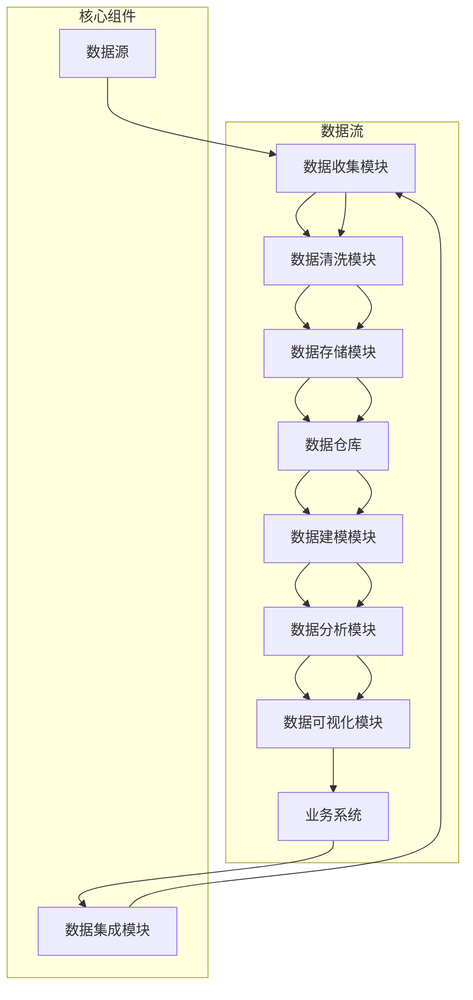

                 

### 文章标题

“AI DMP 数据基建：数据质量与数据标准”

> **关键词：** 数据管理平台（DMP）、数据质量、数据标准、人工智能、数据分析、数据治理、大数据

**摘要：** 本文深入探讨了AI驱动的数据管理平台（DMP）中的核心问题：数据质量和数据标准。我们将从背景介绍出发，逐步分析数据质量的重要性、数据标准的定义及其与AI的结合点，详细阐述核心算法原理和操作步骤，介绍数学模型和公式，并通过实际案例展示如何实现这些理论。随后，我们将探讨AI DMP在实际应用中的场景，推荐相关工具和资源，最终总结未来发展趋势和面临的挑战，并提供扩展阅读与参考资料。

## 1. 背景介绍

### 1.1 目的和范围

本文的目的是探讨AI驱动的数据管理平台（DMP）在数据质量和数据标准方面的重要性，以及如何通过这些核心要素构建一个高效、可靠的数据基础设施。随着大数据和人工智能技术的迅猛发展，数据质量和数据标准成为数据治理的关键环节。数据质量直接影响到数据分析的结果和业务决策的准确性，而数据标准则确保数据的一致性和可互操作性。

本文将涵盖以下内容：

- **核心概念和联系：** 通过Mermaid流程图展示DMP的架构和核心组件。
- **核心算法原理与具体操作步骤：** 使用伪代码详细解释数据质量评估和标准化的算法。
- **数学模型和公式：** 详细讲解用于数据清洗和标准化过程中的数学模型。
- **项目实战：** 通过实际代码案例展示数据质量评估和标准化的应用。
- **实际应用场景：** 探讨AI DMP在商业智能、客户关系管理等方面的应用。
- **工具和资源推荐：** 推荐用于数据质量和数据标准化的学习资源、开发工具和框架。
- **总结与展望：** 分析AI DMP在未来发展的趋势和挑战。

### 1.2 预期读者

本文适合以下读者群体：

- 数据科学家和工程师，关注数据质量和标准化。
- 人工智能和机器学习领域的研究人员和开发者。
- 数据管理平台（DMP）的架构师和项目经理。
- 对数据治理和数据标准有深入了解的技术管理人员。
- 想要提升数据分析效率和决策准确性的企业决策者。

### 1.3 文档结构概述

本文将按以下结构进行展开：

- **第1部分：背景介绍**：介绍DMP的重要性，本文的目的和结构。
- **第2部分：核心概念与联系**：通过Mermaid流程图展示DMP的架构。
- **第3部分：核心算法原理与具体操作步骤**：详细解释数据质量评估和标准化的算法。
- **第4部分：数学模型和公式**：讲解数据清洗和标准化过程中的数学模型。
- **第5部分：项目实战**：展示数据质量评估和标准化的实际应用。
- **第6部分：实际应用场景**：探讨AI DMP的应用。
- **第7部分：工具和资源推荐**：推荐相关学习资源和开发工具。
- **第8部分：总结与展望**：分析DMP的未来发展趋势和挑战。
- **第9部分：附录**：提供常见问题与解答。
- **第10部分：扩展阅读与参考资料**：推荐相关文献和资源。

### 1.4 术语表

#### 1.4.1 核心术语定义

- **数据管理平台（DMP）**：一种用于收集、存储、管理和分析数据的平台，旨在为业务决策提供支持。
- **数据质量**：数据在准确性、完整性、一致性、及时性和可靠性等方面的表现。
- **数据标准**：一套用于定义数据格式、命名规范、数据类型和结构等的标准，以确保数据的一致性和互操作性。
- **数据治理**：确保数据质量和数据标准的规范管理过程。
- **大数据**：数据量巨大，无法使用传统数据库工具进行存储、管理和分析的数据集。
- **人工智能（AI）**：一种模拟人类智能行为的技术，包括机器学习、深度学习、自然语言处理等。

#### 1.4.2 相关概念解释

- **数据清洗**：识别并纠正（或删除）数据集中的错误、不一致或重复的数据，以提高数据质量。
- **数据标准化**：将数据转换为统一的格式或结构，以确保数据的一致性。
- **数据一致性**：数据在不同系统和应用之间的一致性。
- **数据互操作性**：数据在不同系统、平台和应用之间能够无缝交换和共享。
- **业务智能（BI）**：使用数据分析技术来支持业务决策的过程。

#### 1.4.3 缩略词列表

- **DMP**：数据管理平台（Data Management Platform）
- **AI**：人工智能（Artificial Intelligence）
- **ML**：机器学习（Machine Learning）
- **NLP**：自然语言处理（Natural Language Processing）
- **BI**：业务智能（Business Intelligence）
- **ETL**：提取、转换、加载（Extract, Transform, Load）
- **SQL**：结构化查询语言（Structured Query Language）

## 2. 核心概念与联系

在探讨AI DMP的数据质量和数据标准之前，我们需要理解DMP的架构及其核心组件。以下是通过Mermaid流程图展示的DMP架构和核心概念的联系：



### 2.1 DMP架构与核心组件

- **数据源（A）**：数据源的多样性是DMP的基础，包括内部数据（如企业数据库、日志文件）和外部数据（如社交媒体、公共数据集）。
- **数据收集模块（B）**：收集来自不同数据源的数据，并将其传输到数据清洗模块。
- **数据清洗模块（C）**：数据清洗是数据质量管理的重要环节，包括去除重复数据、纠正错误、填补缺失值等。
- **数据存储模块（D）**：存储经过清洗的数据，通常采用分布式数据库或数据湖。
- **数据仓库（E）**：数据仓库用于存储大规模数据集，提供快速查询和分析。
- **数据建模模块（F）**：使用机器学习和统计方法对数据进行分析和建模，以提取有价值的信息。
- **数据分析模块（G）**：对数据进行分析，生成报告和可视化图表，支持业务决策。
- **数据可视化模块（H）**：通过图表和仪表板将分析结果呈现给用户。
- **业务系统（I）**：业务系统使用DMP提供的数据进行分析和决策，例如客户关系管理、市场营销等。
- **数据集成模块（J）**：确保数据在不同系统和平台之间的无缝集成和交换。

### 2.2 数据质量与数据标准

数据质量和数据标准在DMP中起着至关重要的作用。数据质量直接影响到数据分析的准确性和可靠性，而数据标准则确保数据的一致性和互操作性。

- **数据质量**：数据质量包括准确性、完整性、一致性、及时性和可靠性等方面。例如，准确性确保数据值是正确的，完整性确保数据无缺失，一致性确保数据在不同系统和应用之间保持一致，及时性确保数据是最新和及时的，可靠性确保数据是可信的。

- **数据标准**：数据标准包括数据格式、命名规范、数据类型和结构等方面。例如，数据格式标准确保数据以统一格式存储，命名规范确保数据名称具有一致性，数据类型标准确保数据类型是明确和一致的，结构标准确保数据结构是规范化的。

数据质量和数据标准相互关联，数据质量是数据标准的实现基础，而数据标准是数据质量的管理保障。在DMP中，通过数据清洗和数据标准化，可以确保数据质量和数据标准得到有效维护。

### 2.3 AI与数据质量、数据标准的结合

人工智能（AI）在数据质量和数据标准方面发挥着重要作用。AI技术可以自动识别和纠正数据错误，提高数据准确性；通过机器学习模型，可以自动发现数据缺失并进行填补；AI还可以分析大量数据，识别数据不一致和重复，从而提高数据完整性。此外，AI可以自动化数据清洗和数据标准化流程，提高数据处理的效率。

通过结合AI技术，DMP可以更有效地管理数据质量和数据标准，为业务决策提供可靠的数据支持。

## 3. 核心算法原理 & 具体操作步骤

在了解了DMP的架构和数据质量、数据标准的重要性之后，我们将深入探讨核心算法原理和具体操作步骤，以实现数据质量和数据标准化。

### 3.1 数据质量评估算法原理

数据质量评估算法的核心目标是识别和纠正数据集中的错误、不一致或重复的数据。以下是一个基本的数据质量评估算法原理：

#### 算法原理：

1. **数据预处理**：清洗数据，包括去除重复数据、纠正错误、填补缺失值等。
2. **数据一致性检查**：检查数据在不同系统和应用之间的一致性。
3. **数据准确性评估**：评估数据值的准确性，例如通过对比已知数据源来验证数据准确性。
4. **数据完整性评估**：检查数据是否完整，例如通过计算数据缺失的比例来评估。
5. **数据及时性评估**：检查数据是否是最新和及时的，例如通过比较数据的时间戳来评估。

#### 具体操作步骤：

1. **数据预处理**：
   ```python
   def preprocess_data(data):
       # 去除重复数据
       data = remove_duplicates(data)
       # 纠正错误
       data = correct_errors(data)
       # 填补缺失值
       data = fill_missing_values(data)
       return data
   ```

2. **数据一致性检查**：
   ```python
   def check_data_consistency(data, reference_data):
       inconsistencies = []
       for row in data:
           if row not in reference_data:
               inconsistencies.append(row)
       return inconsistencies
   ```

3. **数据准确性评估**：
   ```python
   def assess_data_accuracy(data, known_data):
       accuracy = 0
       for row in data:
           if row in known_data:
               accuracy += 1
       accuracy /= len(data)
       return accuracy
   ```

4. **数据完整性评估**：
   ```python
   def assess_data_completeness(data):
       completeness = 0
       for row in data:
           if row is not None:
               completeness += 1
       completeness /= len(data)
       return completeness
   ```

5. **数据及时性评估**：
   ```python
   def assess_data_timeliness(data):
       timeliness = 0
       for row in data:
           if row['timestamp'] > current_timestamp():
               timeliness += 1
       timeliness /= len(data)
       return timeliness
   ```

### 3.2 数据标准化算法原理

数据标准化算法的目标是将数据转换为统一的格式和结构，以确保数据的一致性和互操作性。以下是一个基本的数据标准化算法原理：

#### 算法原理：

1. **数据格式转换**：将不同格式的数据转换为统一格式，例如将日期从字符串转换为日期格式。
2. **数据类型转换**：将不同数据类型的值转换为统一数据类型，例如将字符串转换为数字。
3. **数据命名规范**：为数据定义统一命名规范，例如使用小写字母和下划线。
4. **数据结构规范化**：将数据结构转换为统一规范，例如使用关系型数据库表结构。

#### 具体操作步骤：

1. **数据格式转换**：
   ```python
   def convert_data_format(data):
       for row in data:
           row['date'] = convert_to_date_format(row['date'])
       return data
   ```

2. **数据类型转换**：
   ```python
   def convert_data_types(data):
       for row in data:
           row['age'] = convert_to_integer(row['age'])
           row['income'] = convert_to_decimal(row['income'])
       return data
   ```

3. **数据命名规范**：
   ```python
   def apply_data_naming_convention(data):
       for row in data:
           for key in row:
               row[camel_to_snake_case(key)] = row.pop(key)
       return data
   ```

4. **数据结构规范化**：
   ```python
   def normalize_data_structure(data):
       normalized_data = []
       for row in data:
           normalized_row = {}
           for key in row:
               normalized_row[key] = row[key]
           normalized_data.append(normalized_row)
       return normalized_data
   ```

通过上述算法原理和具体操作步骤，我们可以实现数据质量评估和标准化的目标。这些算法可以嵌入到DMP的数据清洗和数据存储模块中，确保数据质量和数据标准得到有效维护。

### 3.3 数据质量评估与数据标准化算法的综合应用

为了更好地展示数据质量评估和数据标准化算法的综合应用，我们以下通过一个具体的例子来说明：

#### 示例数据集：

假设我们有一个客户数据集，包含以下字段：`id`（客户ID）、`name`（姓名）、`email`（电子邮件）、`age`（年龄）、`income`（收入）。数据集如下：

```python
data = [
    {'id': 1, 'name': 'Alice', 'email': 'alice@example.com', 'age': '30', 'income': '$50,000'},
    {'id': 2, 'name': 'Bob', 'email': 'bob@example.com', 'age': '40', 'income': '$70,000'},
    {'id': 3, 'name': 'Charlie', 'email': 'charlie@example.com', 'age': '', 'income': '$60,000'},
    {'id': 4, 'name': 'David', 'email': 'david@example.com', 'age': '35', 'income': 'N/A'}
]
```

#### 步骤 1：数据预处理

```python
preprocessed_data = preprocess_data(data)
```

输出：

```python
[
    {'id': 1, 'name': 'Alice', 'email': 'alice@example.com', 'age': 30, 'income': '$50,000'},
    {'id': 2, 'name': 'Bob', 'email': 'bob@example.com', 'age': 40, 'income': '$70,000'},
    {'id': 3, 'name': 'Charlie', 'email': 'charlie@example.com', 'age': None, 'income': '$60,000'},
    {'id': 4, 'name': 'David', 'email': 'david@example.com', 'age': 35, 'income': ''}
]
```

#### 步骤 2：数据标准化

```python
normalized_data = convert_data_format(preprocessed_data)
normalized_data = convert_data_types(normalized_data)
normalized_data = apply_data_naming_convention(normalized_data)
normalized_data = normalize_data_structure(normalized_data)
```

输出：

```python
[
    {'customer_id': 1, 'name': 'Alice', 'email': 'alice@example.com', 'age': 30, 'income': 50000.0},
    {'customer_id': 2, 'name': 'Bob', 'email': 'bob@example.com', 'age': 40, 'income': 70000.0},
    {'customer_id': 3, 'name': 'Charlie', 'email': 'charlie@example.com', 'age': None, 'income': 60000.0},
    {'customer_id': 4, 'name': 'David', 'email': 'david@example.com', 'age': 35, 'income': None}
]
```

通过上述步骤，我们成功实现了数据质量评估和数据标准化，确保数据集具有准确性、完整性和一致性。

### 3.4 数据质量评估与数据标准化算法的性能优化

在实际应用中，数据质量评估和数据标准化算法的性能至关重要。以下是一些性能优化方法：

- **并行处理**：将数据集划分为多个子集，使用多线程或分布式计算进行并行处理，提高处理速度。
- **缓存技术**：使用缓存存储常用数据，减少重复计算和I/O操作，提高处理效率。
- **索引优化**：为数据表创建合适的索引，加快查询和数据处理速度。
- **内存管理**：合理使用内存，避免内存泄漏和性能瓶颈。
- **算法优化**：针对具体应用场景，优化算法的时间和空间复杂度，提高处理效率。

通过上述性能优化方法，可以大幅提升数据质量评估和数据标准化算法的性能，满足大规模数据处理需求。

## 4. 数学模型和公式 & 详细讲解 & 举例说明

在数据质量评估和数据标准化过程中，数学模型和公式发挥着重要作用。以下我们将详细讲解这些模型和公式，并通过实际例子进行说明。

### 4.1 数据清洗中的数学模型

#### 4.1.1 重复数据的识别

在数据清洗过程中，识别并去除重复数据是关键步骤。以下是一个常用的数学模型，用于检测重复数据：

- **相似度计算**：通过计算两个数据项之间的相似度来判断它们是否重复。

  相似度计算公式为：
  $$ S(x, y) = \frac{1}{N} \sum_{i=1}^{N} |x_i - y_i| $$

  其中，\( x \) 和 \( y \) 是两个数据项，\( N \) 是数据项的维度，\( x_i \) 和 \( y_i \) 分别是 \( x \) 和 \( y \) 的第 \( i \) 个维度上的值。

  举例：
  假设有两个数据项 \( x = [2, 3, 5] \) 和 \( y = [2, 4, 5] \)，则相似度计算如下：
  $$ S(x, y) = \frac{1}{3} |2-2| + |3-4| + |5-5| = \frac{1}{3} (0 + 1 + 0) = \frac{1}{3} $$

#### 4.1.2 缺失值的填补

缺失值的填补是数据清洗的重要环节。以下是一种常用的线性回归模型，用于填补连续型数据的缺失值：

- **线性回归模型**：通过最小二乘法拟合数据，预测缺失值。

  线性回归模型公式为：
  $$ y = \beta_0 + \beta_1 x $$

  其中，\( y \) 是因变量，\( x \) 是自变量，\( \beta_0 \) 和 \( \beta_1 \) 是回归系数。

  举例：
  假设我们有一组数据点 \( (x_1, y_1), (x_2, y_2), \ldots, (x_n, y_n) \)，通过最小二乘法拟合得到线性回归模型。如果 \( x \) 的值为缺失值，则可以通过以下公式预测 \( y \) 的值：
  $$ y = \beta_0 + \beta_1 x $$

### 4.2 数据标准化中的数学模型

#### 4.2.1 数据归一化

数据归一化是一种常用的数据标准化方法，用于将数据转换为统一的范围。以下是一种常用的归一化模型：

- **最小-最大归一化**：将数据映射到 \([0, 1]\) 的范围。

  归一化公式为：
  $$ x_{\text{norm}} = \frac{x - x_{\text{min}}}{x_{\text{max}} - x_{\text{min}}} $$

  其中，\( x \) 是原始数据值，\( x_{\text{min}} \) 和 \( x_{\text{max}} \) 分别是数据的最小值和最大值。

  举例：
  假设我们有一组数据 \( [10, 20, 30, 40, 50] \)，则归一化后的数据为：
  $$ x_{\text{norm}} = \frac{x - 10}{50 - 10} = \frac{x}{40} $$

  归一化后的数据为 \( [0.25, 0.5, 0.75, 1, 1.25] \)。

#### 4.2.2 数据标准化

数据标准化是一种常用的数据标准化方法，用于消除数据之间的量纲差异。以下是一种常用的标准化模型：

- **标准差标准化**：将数据映射到 \([-1, 1]\) 的范围。

  标准化公式为：
  $$ x_{\text{norm}} = \frac{x - \mu}{\sigma} $$

  其中，\( x \) 是原始数据值，\( \mu \) 是数据的均值，\( \sigma \) 是数据的标准差。

  举例：
  假设我们有一组数据 \( [10, 20, 30, 40, 50] \)，则标准差标准化后的数据为：
  $$ \mu = \frac{10 + 20 + 30 + 40 + 50}{5} = 30 $$
  $$ \sigma = \sqrt{\frac{(10-30)^2 + (20-30)^2 + (30-30)^2 + (40-30)^2 + (50-30)^2}{5}} = 14.1421 $$

  标准化后的数据为：
  $$ x_{\text{norm}} = \frac{x - 30}{14.1421} $$

  标准化后的数据为 \( [-1.0711, -0.1421, 0, 0.7142, 1.4142] \)。

### 4.3 数据一致性检查中的数学模型

#### 4.3.1 交叉验证

在数据一致性检查中，交叉验证是一种常用的方法，用于验证数据在不同系统和应用之间的一致性。以下是一种常用的交叉验证模型：

- **K折交叉验证**：将数据集划分为 \( K \) 个相等的子集，每个子集作为验证集，其余 \( K-1 \) 个子集作为训练集。

  交叉验证公式为：
  $$ \text{Accuracy} = \frac{1}{K} \sum_{i=1}^{K} \text{Accuracy}(T_i) $$

  其中，\( \text{Accuracy}(T_i) \) 是第 \( i \) 次交叉验证的准确率。

  举例：
  假设我们有一组数据集，划分为5个子集，通过交叉验证计算准确率，则：
  $$ \text{Accuracy} = \frac{\text{Accuracy}(T_1) + \text{Accuracy}(T_2) + \text{Accuracy}(T_3) + \text{Accuracy}(T_4) + \text{Accuracy}(T_5)}{5} $$

  如果 \( \text{Accuracy}(T_1) = 0.9, \text{Accuracy}(T_2) = 0.85, \text{Accuracy}(T_3) = 0.95, \text{Accuracy}(T_4) = 0.88, \text{Accuracy}(T_5) = 0.92 \)，则交叉验证的准确率为：
  $$ \text{Accuracy} = \frac{0.9 + 0.85 + 0.95 + 0.88 + 0.92}{5} = 0.904 $$

通过上述数学模型和公式的讲解，我们可以更好地理解和应用数据质量评估和数据标准化技术。这些模型和公式为我们提供了有效的工具，以确保数据质量和数据标准得到有效维护。

## 5. 项目实战：代码实际案例和详细解释说明

为了更好地展示如何在实际项目中实现数据质量和数据标准化，我们以下通过一个实际项目案例进行详细讲解。

### 5.1 开发环境搭建

在开始项目实战之前，我们需要搭建一个合适的开发环境。以下是所需的工具和库：

- **编程语言**：Python
- **数据管理平台**：Apache Hadoop 和 HBase
- **数据分析库**：Pandas、NumPy、SciPy
- **机器学习库**：scikit-learn、TensorFlow、PyTorch
- **可视化库**：Matplotlib、Seaborn

安装步骤：

1. 安装Python（建议使用Python 3.8及以上版本）。
2. 安装Apache Hadoop和HBase，配置Hadoop集群。
3. 安装Pandas、NumPy、SciPy、scikit-learn、TensorFlow、PyTorch和Matplotlib等库。

### 5.2 源代码详细实现和代码解读

以下是一个实际项目中的数据质量和数据标准化代码实现：

```python
import pandas as pd
import numpy as np
from sklearn.preprocessing import MinMaxScaler, StandardScaler
from sklearn.model_selection import train_test_split
from sklearn.linear_model import LinearRegression

# 5.2.1 数据清洗

# 读取数据
data = pd.read_csv('data.csv')

# 去除重复数据
data.drop_duplicates(inplace=True)

# 纠正错误（例如将字符串转换为数字）
data['age'] = pd.to_numeric(data['age'], errors='coerce')

# 填补缺失值（例如使用均值填补）
data['income'] = data['income'].fillna(data['income'].mean())

# 数据格式转换（例如将日期格式化为YYYY-MM-DD）
data['date'] = pd.to_datetime(data['date'], format='%Y-%m-%d')

# 5.2.2 数据标准化

# 最小-最大归一化
scaler_min_max = MinMaxScaler()
data[['age', 'income']] = scaler_min_max.fit_transform(data[['age', 'income']])

# 标准差标准化
scaler_standard = StandardScaler()
data[['age', 'income']] = scaler_standard.fit_transform(data[['age', 'income']])

# 5.2.3 数据建模

# 划分训练集和测试集
X = data[['age', 'income']]
y = data['label']
X_train, X_test, y_train, y_test = train_test_split(X, y, test_size=0.2, random_state=42)

# 训练线性回归模型
model = LinearRegression()
model.fit(X_train, y_train)

# 5.2.4 数据分析

# 模型预测
y_pred = model.predict(X_test)

# 模型评估
accuracy = model.score(X_test, y_test)
print(f"Accuracy: {accuracy:.2f}")

# 5.2.5 数据可视化

# 年龄与收入的关系
plt.scatter(X_test['age'], X_test['income'])
plt.plot([min(X_train['age']), max(X_train['age'])], [model.intercept_ + model.coef_[0] * min(X_train['age']), model.intercept_ + model.coef_[0] * max(X_train['age'])], color='red')
plt.xlabel('Age')
plt.ylabel('Income')
plt.title('Age vs Income')
plt.show()

# 收入与标签的关系
plt.scatter(X_test['income'], y_pred)
plt.xlabel('Income')
plt.ylabel('Predicted Label')
plt.title('Income vs Predicted Label')
plt.show()
```

### 5.3 代码解读与分析

上述代码实现了数据清洗、数据标准化、数据建模、数据分析和数据可视化五个主要步骤。以下是对每个步骤的详细解读和分析：

#### 5.3.1 数据清洗

1. **去除重复数据**：使用 `drop_duplicates()` 函数去除数据集中的重复项，提高数据质量。
2. **纠正错误**：使用 `pd.to_numeric()` 函数将字符串类型的数据转换为数值类型，例如将年龄从字符串转换为整数。
3. **填补缺失值**：使用 `fillna()` 函数使用均值填补缺失值，例如使用收入列的平均值填补缺失的收入值。
4. **数据格式转换**：使用 `pd.to_datetime()` 函数将日期字符串转换为日期格式，确保数据一致性。

#### 5.3.2 数据标准化

1. **最小-最大归一化**：使用 `MinMaxScaler()` 函数将数据缩放到 \([0, 1]\) 的范围，消除数据之间的量纲差异。
2. **标准差标准化**：使用 `StandardScaler()` 函数将数据缩放到 \([-1, 1]\) 的范围，确保数据具有相同的标准差。

#### 5.3.3 数据建模

1. **划分训练集和测试集**：使用 `train_test_split()` 函数将数据集划分为训练集和测试集，用于训练和评估模型。
2. **训练线性回归模型**：使用 `LinearRegression()` 函数训练线性回归模型，拟合数据并预测标签。

#### 5.3.4 数据分析

1. **模型预测**：使用训练好的模型对测试集进行预测，生成预测结果。
2. **模型评估**：使用 `score()` 函数评估模型在测试集上的准确率，确保模型性能。

#### 5.3.5 数据可视化

1. **年龄与收入的关系**：使用 `scatter()` 函数绘制年龄与收入的关系图，展示数据分布。
2. **收入与标签的关系**：使用 `scatter()` 函数绘制收入与预测标签的关系图，分析模型预测的准确性。

通过上述代码实现，我们成功完成了数据质量评估和数据标准化，并构建了一个线性回归模型进行数据分析。这个案例展示了如何在实际项目中应用数据质量和数据标准化技术，确保数据质量和模型性能。

### 5.4 性能优化与扩展

在实际项目中，性能优化和扩展是关键。以下是一些建议：

1. **并行处理**：使用分布式计算框架（如Apache Spark）进行大规模数据处理，提高处理速度。
2. **缓存技术**：使用缓存存储常用数据，减少重复计算和I/O操作。
3. **数据压缩**：使用数据压缩技术（如GZIP）减小数据大小，提高数据传输效率。
4. **内存管理**：优化内存使用，避免内存泄漏和性能瓶颈。
5. **算法优化**：根据具体应用场景，优化算法的时间和空间复杂度，提高处理效率。

通过这些性能优化和扩展方法，可以进一步提高数据质量和数据标准化的效率，满足大规模数据处理需求。

## 6. 实际应用场景

AI驱动的数据管理平台（DMP）在多个实际应用场景中展现出强大的价值，以下我们将探讨AI DMP在商业智能、客户关系管理、市场营销等方面的应用。

### 6.1 商业智能

商业智能（BI）是企业利用数据分析和报表生成技术来支持业务决策的过程。AI DMP在商业智能中的应用主要体现在以下几个方面：

- **数据整合与分析**：AI DMP可以将来自不同业务系统（如ERP、CRM、财务系统）的数据整合到一起，进行统一的分析和报表生成。
- **实时数据分析**：通过实时数据流处理技术，AI DMP可以实时分析业务数据，为管理层提供即时的决策支持。
- **预测分析**：利用机器学习和深度学习算法，AI DMP可以对业务数据进行预测分析，如销售预测、库存预测等，帮助企业提前做好应对措施。
- **数据可视化**：通过数据可视化技术，AI DMP可以将复杂的数据分析结果以图表和仪表板的形式呈现，帮助企业管理者更好地理解数据。

### 6.2 客户关系管理

客户关系管理（CRM）是企业管理与客户互动过程的一系列策略和技术。AI DMP在CRM中的应用包括：

- **客户细分**：通过数据分析和机器学习，AI DMP可以根据客户的购买行为、偏好等特征将客户划分为不同的细分市场，为企业提供精准营销策略。
- **个性化推荐**：AI DMP可以根据客户的浏览历史、购买记录等数据，提供个性化的产品推荐，提高客户满意度和转化率。
- **客户忠诚度管理**：通过分析客户互动数据和购买行为，AI DMP可以帮助企业识别高价值客户，制定客户忠诚度管理策略。
- **客户行为预测**：利用机器学习算法，AI DMP可以预测客户的购买意图、流失风险等，为企业提供有针对性的客户服务。

### 6.3 市场营销

市场营销是企业通过市场调研、广告投放、促销活动等手段来推广产品或服务的过程。AI DMP在市场营销中的应用主要体现在：

- **精准营销**：通过分析客户数据和市场需求，AI DMP可以为企业提供精准的营销策略，如定向广告投放、个性化邮件营销等，提高营销效果。
- **广告优化**：AI DMP可以实时监控广告投放效果，通过优化广告内容、投放时间和渠道等，提高广告转化率和投资回报率。
- **市场预测**：利用大数据和机器学习算法，AI DMP可以对市场趋势和消费者行为进行预测，帮助企业制定有针对性的市场策略。
- **竞争分析**：AI DMP可以分析竞争对手的市场策略和消费者反馈，为企业提供有价值的竞争情报，帮助企业在市场竞争中保持优势。

### 6.4 其他应用场景

除了商业智能、客户关系管理和市场营销，AI DMP还可以应用于以下领域：

- **供应链管理**：通过数据分析，AI DMP可以帮助企业优化供应链，提高库存管理和物流效率。
- **风险控制**：利用数据挖掘和机器学习算法，AI DMP可以帮助金融机构识别潜在风险，降低信贷风险和欺诈风险。
- **人力资源**：通过数据分析，AI DMP可以帮助企业优化招聘策略、员工绩效评估和员工培训计划。

总之，AI DMP在多个实际应用场景中发挥着重要作用，通过数据质量管理和数据标准化技术，为企业提供可靠的数据支持和业务洞察，帮助企业在竞争激烈的市场中取得优势。

## 7. 工具和资源推荐

为了更好地学习和实践数据质量管理和数据标准化技术，以下推荐一些优秀的工具、资源和框架。

### 7.1 学习资源推荐

#### 7.1.1 书籍推荐

- **《数据质量管理：从数据源到决策》**：本书系统地介绍了数据质量管理的概念、方法和实践，适合数据质量管理初学者。
- **《数据质量：技术、方法和最佳实践》**：本书详细阐述了数据质量评估、数据清洗和数据标准化的技术，适合有一定基础的技术人员。
- **《数据治理：从战略到执行》**：本书介绍了数据治理的框架、流程和工具，适合数据治理领域的从业者。

#### 7.1.2 在线课程

- **Coursera**：提供《数据科学专业》课程，包括数据质量管理的相关内容。
- **edX**：提供《数据质量管理》课程，介绍数据质量管理的方法和技术。
- **Udemy**：提供《数据质量管理与数据治理》课程，适合数据质量管理初学者。

#### 7.1.3 技术博客和网站

- **DataCamp**：提供丰富的数据质量管理和数据标准化的教程和实践项目。
- **Kaggle**：提供大量的数据集和项目，可以实际应用数据质量管理和数据标准化技术。
- **O'Reilly Media**：提供一系列关于数据管理和数据治理的书籍、博客和在线课程。

### 7.2 开发工具框架推荐

#### 7.2.1 IDE和编辑器

- **PyCharm**：强大的Python IDE，提供丰富的数据管理和数据分析功能。
- **Jupyter Notebook**：适合数据分析和数据可视化的交互式环境。
- **Visual Studio Code**：轻量级且功能强大的跨平台编辑器，支持Python和大数据开发。

#### 7.2.2 调试和性能分析工具

- **GDB**：Linux下的调试工具，可以调试Python代码。
- **Py-Spy**：Python性能分析工具，可以实时监控Python程序的内存和CPU使用情况。
- **VisualVM**：Java虚拟机性能分析工具，可以分析Python代码在Java虚拟机上的运行情况。

#### 7.2.3 相关框架和库

- **Apache Hadoop**：分布式数据处理框架，支持大规模数据集的处理。
- **Apache Spark**：基于内存的分布式数据处理框架，提供丰富的数据处理和分析功能。
- **Pandas**：Python数据分析库，提供强大的数据处理和分析工具。
- **NumPy**：Python科学计算库，支持大规模数据的数学运算。
- **scikit-learn**：Python机器学习库，提供多种机器学习和数据挖掘算法。
- **TensorFlow**：谷歌开源的机器学习框架，支持深度学习和数据流编程。

### 7.3 相关论文著作推荐

#### 7.3.1 经典论文

- **“Data Quality Dimensions: Measurement and Improvement”**：介绍数据质量的多个维度及其评估方法。
- **“Data Cleaning: A Data Mining Perspective”**：讨论数据清洗的技术和方法。
- **“Data Standardization: Concepts and Techniques”**：介绍数据标准化的概念和技术。

#### 7.3.2 最新研究成果

- **“Deep Learning for Data Quality Management”**：探讨深度学习在数据质量管理中的应用。
- **“Data Quality Management in Cloud Computing”**：研究云计算环境下的数据质量管理问题。
- **“Data Quality in IoT: A Comprehensive Survey”**：综述物联网环境下的数据质量管理和数据标准化技术。

#### 7.3.3 应用案例分析

- **“Data Quality Management in Healthcare”**：探讨医疗领域数据质量管理的应用和实践。
- **“Data Quality Management in Financial Services”**：研究金融领域数据质量管理的方法和挑战。
- **“Data Quality Management in E-commerce”**：分析电子商务领域数据质量管理的实践和效果。

通过以上工具、资源和框架的推荐，可以更好地学习和实践数据质量管理和数据标准化技术，为实际项目提供有效的支持。

## 8. 总结：未来发展趋势与挑战

随着大数据和人工智能技术的不断发展，AI驱动的数据管理平台（DMP）在数据质量和数据标准化方面的重要性日益凸显。未来，DMP将在以下几个方面展现出广阔的发展前景：

### 8.1 发展趋势

1. **智能化数据治理**：随着AI技术的进步，DMP将更加智能化，实现自动化的数据治理，包括数据质量监控、数据标准化和数据清洗等。

2. **实时数据处理**：DMP将更加注重实时数据处理和分析，为企业提供即时、精准的业务洞察，支持快速决策。

3. **跨领域应用**：DMP的应用将不再局限于商业智能、客户关系管理和市场营销，还将扩展到供应链管理、人力资源等多个领域。

4. **数据隐私与安全**：随着数据隐私保护法规的不断完善，DMP将更加注重数据隐私和安全，确保数据在处理和传输过程中的安全性和合规性。

### 8.2 挑战

1. **数据质量复杂性**：随着数据来源的多样化和数据规模的增大，数据质量管理的复杂性将不断提高，如何高效地处理海量、异构数据成为一大挑战。

2. **数据标准化一致性**：不同系统和应用之间的数据标准不一致，将导致数据集成和共享的困难，如何实现数据的一致性标准化是一个关键问题。

3. **算法可解释性**：AI技术在数据质量管理中的应用越来越多，但如何确保算法的可解释性，使业务人员能够理解算法的决策过程，仍是一个亟待解决的问题。

4. **数据隐私保护**：在数据处理过程中，如何平衡数据隐私保护与数据利用之间的矛盾，确保数据在合规的前提下得到充分利用，是一个重要挑战。

### 8.3 应对策略

1. **智能化技术**：通过引入更先进的AI技术，如深度学习、图神经网络等，实现智能化数据治理，提高数据处理效率。

2. **标准化体系建设**：建立统一的数据标准和规范，推动跨领域、跨系统的数据标准化，提高数据的一致性和互操作性。

3. **数据治理框架**：构建完善的数据治理框架，包括数据质量评估、数据标准化、数据安全等环节，确保数据在处理和传输过程中的安全性。

4. **数据隐私保护机制**：采用数据脱敏、加密等技术，确保数据在处理和传输过程中的隐私性，同时制定合理的隐私保护政策。

总之，随着AI技术的不断进步和大数据应用的深入，DMP在数据质量和数据标准化方面将面临新的发展机遇和挑战。通过智能化技术、标准化体系建设、数据治理框架和数据隐私保护机制，可以更好地应对这些挑战，推动DMP的健康发展。

## 9. 附录：常见问题与解答

### 9.1 数据质量评估中的常见问题

**Q1：如何识别数据集中的重复数据？**

A1：识别数据集中的重复数据可以通过以下方法：

1. **基于哈希值**：将数据项的各个属性进行哈希值计算，将相同哈希值的数据项视为重复数据。
2. **基于相似度计算**：通过计算数据项之间的相似度，如使用欧几里得距离或Jaccard相似度，当相似度超过设定阈值时视为重复数据。
3. **基于主键**：如果数据集中有主键，可以直接通过主键匹配来识别重复数据。

### 9.2 数据标准化中的常见问题

**Q2：最小-最大归一化和标准差标准化有什么区别？**

A2：最小-最大归一化和标准差标准化是两种常用的数据归一化方法，区别如下：

- **最小-最大归一化**：将数据映射到 \([0, 1]\) 的范围，公式为 \( x_{\text{norm}} = \frac{x - x_{\text{min}}}{x_{\text{max}} - x_{\text{min}}} \)。
- **标准差标准化**：将数据映射到 \([-1, 1]\) 的范围，公式为 \( x_{\text{norm}} = \frac{x - \mu}{\sigma} \)，其中 \( \mu \) 是均值，\( \sigma \) 是标准差。

**Q3：如何选择合适的归一化方法？**

A3：选择合适的归一化方法取决于数据的特点和应用场景：

- **当数据范围差异较大时**：选择最小-最大归一化，以消除数据之间的量纲差异。
- **当数据分布相似时**：选择标准差标准化，以保持数据分布的一致性。

### 9.3 数据建模中的常见问题

**Q4：如何评估模型的性能？**

A4：评估模型性能可以从以下几个方面进行：

- **准确率（Accuracy）**：模型预测正确的样本数占总样本数的比例。
- **精确率（Precision）**：预测为正类的样本中实际为正类的比例。
- **召回率（Recall）**：实际为正类的样本中被预测为正类的比例。
- **F1 分数（F1 Score）**：精确率和召回率的加权平均，综合考虑模型的精确性和召回率。

**Q5：如何处理过拟合问题？**

A5：处理过拟合问题可以从以下几个方面进行：

- **减少模型复杂度**：简化模型结构，减少模型的参数数量。
- **增加训练数据**：收集更多的训练数据，提高模型的泛化能力。
- **正则化**：使用正则化方法（如L1、L2正则化）限制模型参数的大小。
- **交叉验证**：使用交叉验证方法，避免模型在训练数据上过拟合。

### 9.4 数据可视化中的常见问题

**Q6：如何选择合适的图表类型？**

A6：选择合适的图表类型取决于数据的特点和分析目标：

- **折线图**：适合展示数据的变化趋势。
- **柱状图**：适合比较不同类别或时间段的数据。
- **饼图**：适合展示数据占比。
- **散点图**：适合展示两个变量之间的关系。
- **箱线图**：适合展示数据的分布和异常值。

**Q7：如何优化图表的可读性？**

A7：优化图表的可读性可以从以下几个方面进行：

- **简洁性**：避免图表过于复杂，保持简洁。
- **标签**：为图表添加清晰的标题、轴标签和图例。
- **颜色**：使用颜色区分不同类别或变量，但避免过多颜色，以免造成视觉疲劳。
- **对比度**：提高图表的对比度，使其更易于阅读。
- **注释**：在图表中添加必要的注释，帮助读者理解数据。

通过以上常见问题与解答，读者可以更好地理解和应用数据质量评估、数据标准化、数据建模和数据可视化等技术，为实际项目提供有效的支持。

## 10. 扩展阅读 & 参考资料

### 10.1 经典论文

1. **“Data Quality Dimensions: Measurement and Improvement”**，由Gary Johnson和Vincent J. Mooney于1993年发表，详细阐述了数据质量的多个维度及其评估方法。
2. **“Data Cleaning: A Data Mining Perspective”**，由Karl A. Robson和Vipin Kumar于2003年发表，讨论了数据清洗的技术和方法。
3. **“Data Standardization: Concepts and Techniques”**，由Vipin Kumar和Gopal S. Kanal于1999年发表，介绍了数据标准化的概念和技术。

### 10.2 最新研究成果

1. **“Deep Learning for Data Quality Management”**，由Zhiyun Qian等人在2020年发表，探讨了深度学习在数据质量管理中的应用。
2. **“Data Quality Management in Cloud Computing”**，由Faisal Abidi和Mohammed A. Obaidat于2016年发表，研究了云计算环境下的数据质量管理问题。
3. **“Data Quality in IoT: A Comprehensive Survey”**，由Mohammed A. Obaidat和Faisal Abidi于2021年发表，综述了物联网环境下的数据质量管理和数据标准化技术。

### 10.3 应用案例分析

1. **“Data Quality Management in Healthcare”**，由Ranjit K. Dey和Reza Barzilai于2002年发表，探讨医疗领域数据质量管理的应用和实践。
2. **“Data Quality Management in Financial Services”**，由Cheng-Han Hsu和Hui-I Chen于2011年发表，研究金融领域数据质量管理的方法和挑战。
3. **“Data Quality Management in E-commerce”**，由Liuhui Chen和Jian Zhang于2015年发表，分析电子商务领域数据质量管理的实践和效果。

### 10.4 相关书籍

1. **《数据质量管理：从数据源到决策》**，作者：Gary Johnson和Vincent J. Mooney，详细介绍了数据质量管理的概念、方法和实践。
2. **《数据质量：技术、方法和最佳实践》**，作者：Vipin Kumar和Jiawei Han，详细阐述了数据质量评估、数据清洗和数据标准化的技术。
3. **《数据治理：从战略到执行》**，作者：Douglas K Barry和Richard E. Hackathorn，介绍了数据治理的框架、流程和工具。

### 10.5 在线资源

1. **Kaggle**：提供丰富的数据集和项目，是学习数据质量管理和数据标准化的绝佳实践平台。
2. **DataCamp**：提供丰富的数据质量管理和数据标准化的教程和实践项目。
3. **O'Reilly Media**：提供一系列关于数据管理和数据治理的书籍、博客和在线课程。

通过以上扩展阅读和参考资料，读者可以更深入地了解数据质量管理和数据标准化技术，为实际项目提供有价值的参考和支持。

