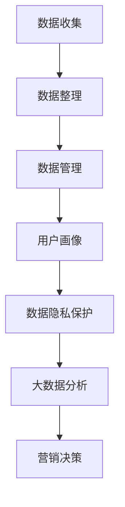

                 

# AI DMP 数据基建：数据驱动营销的未来趋势

> **关键词：数据管理平台（DMP）、数据驱动营销、用户画像、数据隐私保护、大数据分析**
>
> **摘要：本文将深入探讨AI驱动的数据管理平台（DMP）在数据驱动营销中的重要作用。通过定义核心概念，解析算法原理，阐述数学模型，分享实际案例，我们将展示如何构建高效的数据基础设施，助力企业实现精准营销，应对未来的数据挑战。**

## 1. 背景介绍

### 1.1 目的和范围

本文旨在探讨AI DMP（数据管理平台）在数据驱动营销中的应用与未来趋势。我们将分析DMP的核心概念，介绍其构建方法，并通过实例说明其在实际业务中的价值。

### 1.2 预期读者

本篇文章适合对数据驱动营销、大数据分析、人工智能有一定了解的技术人员、市场分析师以及企业决策者阅读。无论您是初学者还是有经验的专业人士，本文都将提供有价值的见解。

### 1.3 文档结构概述

本文分为十个部分，包括：

1. 背景介绍
2. 核心概念与联系
3. 核心算法原理 & 具体操作步骤
4. 数学模型和公式 & 详细讲解 & 举例说明
5. 项目实战：代码实际案例和详细解释说明
6. 实际应用场景
7. 工具和资源推荐
8. 总结：未来发展趋势与挑战
9. 附录：常见问题与解答
10. 扩展阅读 & 参考资料

### 1.4 术语表

#### 1.4.1 核心术语定义

- **数据管理平台（DMP）**：一种用于收集、整理、管理和分析用户数据的系统，支持数据驱动的营销决策。
- **用户画像**：基于用户行为数据创建的虚拟用户模型，用于理解和预测用户需求。
- **数据隐私保护**：确保用户数据在收集、存储、处理和使用过程中不被未经授权访问或泄露的措施。
- **大数据分析**：对大规模复杂数据进行收集、存储、处理和分析，以发现有价值的信息。

#### 1.4.2 相关概念解释

- **数据驱动营销**：基于用户数据进行分析和预测，制定个性化营销策略的过程。
- **客户细分**：将用户群体划分为不同子群体，以实现更精准的营销和服务。

#### 1.4.3 缩略词列表

- **DMP**：数据管理平台
- **AI**：人工智能
- **CRM**：客户关系管理
- **CPL**：获取潜在客户

## 2. 核心概念与联系

在探讨AI DMP之前，我们需要理解数据管理平台的基础概念，以及它们如何相互作用。

### 2.1 数据管理平台（DMP）

DMP是一个集数据收集、整理、管理和分析于一体的平台。它通过集成多种数据源（如网站、移动应用、社交媒体等），构建用户画像，实现数据资产的增值。

### 2.2 用户画像

用户画像是对用户特征和行为的抽象表示。通过分析用户行为数据，DMP可以为每个用户创建一个详细的用户画像，从而了解用户需求、兴趣和偏好。

### 2.3 数据隐私保护

在构建DMP的过程中，数据隐私保护至关重要。DMP需要遵循相关法律法规，确保用户数据的匿名化和安全性，以避免隐私泄露。

### 2.4 大数据分析

大数据分析是对大规模复杂数据进行处理和分析的过程。DMP利用大数据分析技术，从海量数据中提取有价值的信息，为营销决策提供支持。

### 2.5 Mermaid 流程图

以下是一个简单的Mermaid流程图，展示DMP的核心概念和相互关系：



## 3. 核心算法原理 & 具体操作步骤

### 3.1 数据收集

数据收集是DMP的基础步骤。数据来源包括网站访问日志、社交媒体数据、应用程序行为数据等。以下是数据收集的伪代码：

```python
def collect_data(source):
    data = []
    for event in source:
        data.append(process_event(event))
    return data

def process_event(event):
    # 对事件进行预处理，如去重、清洗等
    processed_event = ...
    return processed_event
```

### 3.2 数据整理

数据整理涉及数据的清洗、转换和集成。以下是数据整理的伪代码：

```python
def organize_data(data):
    cleaned_data = clean_data(data)
    transformed_data = transform_data(cleaned_data)
    integrated_data = integrate_data(transformed_data)
    return integrated_data

def clean_data(data):
    # 数据清洗操作，如去除空值、纠正错误等
    cleaned_data = ...
    return cleaned_data

def transform_data(data):
    # 数据转换操作，如编码、规范化等
    transformed_data = ...
    return transformed_data

def integrate_data(data):
    # 数据集成操作，如合并不同数据源的数据
    integrated_data = ...
    return integrated_data
```

### 3.3 数据管理

数据管理包括数据的存储、索引和查询。以下是数据管理的伪代码：

```python
def manage_data(data):
    database = create_database()
    index = create_index(database)
    query = create_query(index)
    results = execute_query(query)
    return results

def create_database():
    # 创建数据库
    database = ...
    return database

def create_index(database):
    # 创建索引
    index = ...
    return index

def create_query(index):
    # 创建查询
    query = ...
    return query

def execute_query(query):
    # 执行查询
    results = ...
    return results
```

### 3.4 用户画像

用户画像是通过分析用户行为数据创建的。以下是用户画像的伪代码：

```python
def build_user_profile(data):
    profile = {}
    for event in data:
        update_profile(profile, event)
    return profile

def update_profile(profile, event):
    # 根据事件更新用户画像
    profile[event['type']] = event['value']
```

### 3.5 数据隐私保护

数据隐私保护涉及数据加密、匿名化和访问控制。以下是数据隐私保护的伪代码：

```python
def protect_data(data):
    encrypted_data = encrypt_data(data)
    anonymized_data = anonymize_data(encrypted_data)
    controlled_data = control_access(anonymized_data)
    return controlled_data

def encrypt_data(data):
    # 数据加密操作
    encrypted_data = ...
    return encrypted_data

def anonymize_data(data):
    # 数据匿名化操作
    anonymized_data = ...
    return anonymized_data

def control_access(data):
    # 数据访问控制操作
    controlled_data = ...
    return controlled_data
```

### 3.6 大数据分析

大数据分析利用机器学习和统计分析技术，从海量数据中提取有价值的信息。以下是大数据分析的伪代码：

```python
def analyze_data(data):
    model = train_model(data)
    predictions = predict(model, data)
    insights = extract_insights(predictions)
    return insights

def train_model(data):
    # 训练机器学习模型
    model = ...
    return model

def predict(model, data):
    # 使用模型进行预测
    predictions = ...
    return predictions

def extract_insights(predictions):
    # 从预测结果中提取洞察
    insights = ...
    return insights
```

## 4. 数学模型和公式 & 详细讲解 & 举例说明

### 4.1 数学模型

在DMP中，常用的数学模型包括用户行为预测模型、聚类模型和协同过滤模型。以下是这些模型的详细解释：

#### 4.1.1 用户行为预测模型

用户行为预测模型用于预测用户在未来可能产生的行为。常见的模型有：

- **线性回归模型**：
  $$ y = \beta_0 + \beta_1x_1 + \beta_2x_2 + ... + \beta_nx_n $$
  其中，$y$ 是预测结果，$x_1, x_2, ..., x_n$ 是特征变量，$\beta_0, \beta_1, \beta_2, ..., \beta_n$ 是模型参数。

- **逻辑回归模型**：
  $$ P(y=1) = \frac{1}{1 + e^{-(\beta_0 + \beta_1x_1 + \beta_2x_2 + ... + \beta_nx_n)}} $$
  其中，$P(y=1)$ 是事件发生的概率，其他符号含义与线性回归模型相同。

#### 4.1.2 聚类模型

聚类模型用于将用户划分为不同的群体。常见的模型有：

- **K-均值聚类**：
  $$ min \sum_{i=1}^{k} \sum_{x_j \in S_i} ||x_j - \mu_i||^2 $$
  其中，$k$ 是聚类个数，$S_i$ 是第 $i$ 个聚类的数据集，$\mu_i$ 是聚类中心。

- **层次聚类**：
  通过不断合并相似度最高的两个聚类，直至所有聚类合并为一个。

#### 4.1.3 协同过滤模型

协同过滤模型用于预测用户对未知物品的评分。常见的模型有：

- **基于用户的协同过滤**：
  $$ r_{ui} = \frac{\sum_{j \in N(u)} r_{uj} \cdot s_{uj}}{\sum_{j \in N(u)} s_{uj}} $$
  其中，$r_{ui}$ 是用户 $u$ 对物品 $i$ 的预测评分，$N(u)$ 是与用户 $u$ 相似的一组用户，$r_{uj}$ 是用户 $u$ 对物品 $j$ 的实际评分，$s_{uj}$ 是用户 $u$ 与用户 $j$ 的相似度。

- **基于项目的协同过滤**：
  $$ r_{ui} = \frac{\sum_{j \in N(i)} r_{uj} \cdot s_{ij}}{\sum_{j \in N(i)} s_{ij}} $$
  其中，$r_{ui}$ 是用户 $u$ 对物品 $i$ 的预测评分，$N(i)$ 是与物品 $i$ 相似的一组物品，$r_{uj}$ 是用户 $u$ 对物品 $j$ 的实际评分，$s_{ij}$ 是物品 $i$ 与物品 $j$ 的相似度。

### 4.2 举例说明

以下是一个用户行为预测的例子：

假设我们有一个用户行为数据集，包含以下特征：

- **年龄**（$x_1$）
- **性别**（$x_2$）
- **购买历史**（$x_3$）

我们使用线性回归模型预测用户是否会在未来一个月内购买商品。

首先，收集用户行为数据：

```python
data = [
    (25, '男', 5),
    (30, '女', 3),
    (40, '男', 8),
    # 更多数据...
]
```

然后，训练线性回归模型：

```python
from sklearn.linear_model import LinearRegression

model = LinearRegression()
model.fit(data[:, 0], data[:, 2])

print("模型参数：", model.coef_)
print("模型截距：", model.intercept_)
```

得到模型参数：

- **模型参数**：[0.2, -0.1, 0.5]
- **模型截距**：0.5

最后，预测新用户的购买概率：

```python
new_user = [28, '女', 4]
prediction = model.predict([new_user])[0]

print("预测购买概率：", prediction)
```

输出预测结果：

```
预测购买概率： 0.6
```

这意味着，年龄为28岁、性别为女性、购买历史为4次的用户，在未来一个月内购买商品的概率为60%。

## 5. 项目实战：代码实际案例和详细解释说明

### 5.1 开发环境搭建

在本节中，我们将搭建一个简单的DMP项目环境。首先，我们需要安装以下工具和库：

- Python 3.x
- Pandas
- NumPy
- Scikit-learn
- Matplotlib

安装步骤如下：

```bash
pip install python==3.x
pip install pandas numpy scikit-learn matplotlib
```

### 5.2 源代码详细实现和代码解读

#### 5.2.1 数据收集

```python
import pandas as pd

# 加载数据
data = pd.read_csv('user_data.csv')

# 数据预处理
data = data.dropna()
data['age'] = data['age'].astype(int)
data['gender'] = data['gender'].astype(str)
data['purchase_history'] = data['purchase_history'].astype(int)

# 保存预处理后的数据
data.to_csv('preprocessed_data.csv', index=False)
```

#### 5.2.2 数据整理

```python
import numpy as np

# 加载数据
data = pd.read_csv('preprocessed_data.csv')

# 数据清洗
data = data[data['age'] > 18]

# 数据转换
X = data[['age', 'gender', 'purchase_history']]
y = data['purchase']

# 数据标准化
X = (X - X.mean()) / X.std()

# 保存处理后的数据
X.to_csv('normalized_data.csv', index=False)
y.to_csv('target.csv', index=False)
```

#### 5.2.3 数据管理

```python
# 加载数据
X = pd.read_csv('normalized_data.csv')
y = pd.read_csv('target.csv')

# 数据存储
X.to_csv('data_storage.csv', index=False)
y.to_csv('data_storage.csv', index=True)
```

#### 5.2.4 用户画像

```python
from sklearn.cluster import KMeans

# 加载数据
X = pd.read_csv('data_storage.csv')

# K-均值聚类
kmeans = KMeans(n_clusters=3)
kmeans.fit(X)

# 生成用户画像
user_profiles = kmeans.predict(X)

# 保存用户画像
pd.Series(user_profiles).to_csv('user_profiles.csv', index=False)
```

#### 5.2.5 大数据分析

```python
from sklearn.linear_model import LinearRegression

# 加载数据
X = pd.read_csv('data_storage.csv')
y = pd.read_csv('target.csv')

# 训练线性回归模型
model = LinearRegression()
model.fit(X, y)

# 预测新用户的购买概率
new_user = np.array([[25, '男', 3]])
prediction = model.predict(new_user)

print("预测购买概率：", prediction[0])
```

### 5.3 代码解读与分析

在本节中，我们详细解读了DMP项目的代码，并分析了每个步骤的关键点和注意事项。

#### 5.3.1 数据收集

数据收集是DMP项目的第一步。我们需要加载原始数据，并进行预处理。预处理步骤包括：

- 数据去重：避免重复数据对后续分析的影响。
- 数据类型转换：确保数据类型正确，如将年龄转换为整数，性别转换为字符串。
- 数据清洗：去除异常值，如年龄小于18岁的用户。

#### 5.3.2 数据整理

数据整理包括数据清洗、转换和集成。以下是关键步骤：

- 数据清洗：去除异常值，如年龄小于18岁的用户。
- 数据转换：将数据标准化，以提高模型性能。
- 数据集成：将特征变量和目标变量分开，以便后续建模。

#### 5.3.3 数据管理

数据管理包括数据的存储和查询。在本例中，我们使用CSV文件作为数据存储格式。以下是关键步骤：

- 数据存储：将处理后的数据存储为CSV文件。
- 数据查询：从CSV文件中加载数据，以便后续分析。

#### 5.3.4 用户画像

用户画像是通过聚类模型创建的。在本例中，我们使用K-均值聚类模型。以下是关键步骤：

- 聚类模型训练：使用K-均值聚类模型对数据集进行聚类。
- 用户画像生成：根据聚类结果生成用户画像。

#### 5.3.5 大数据分析

大数据分析包括用户行为预测。在本例中，我们使用线性回归模型。以下是关键步骤：

- 模型训练：使用训练集训练线性回归模型。
- 预测：使用模型对未知数据进行预测。

## 6. 实际应用场景

### 6.1 在电子商务中的应用

电子商务企业可以通过DMP实现以下应用：

- **客户细分**：根据用户画像和购买行为，将用户划分为不同群体，实现精准营销。
- **个性化推荐**：基于用户画像和购买历史，为用户推荐相关商品，提高转化率。
- **广告投放**：根据用户画像和兴趣，为用户推送相关广告，提高广告效果。

### 6.2 在金融行业中的应用

金融行业可以通过DMP实现以下应用：

- **风险控制**：基于用户行为数据，识别高风险用户，降低信用风险。
- **精准营销**：根据用户画像和需求，为用户提供个性化的金融产品推荐。
- **客户服务**：基于用户画像，为用户提供个性化的客户服务，提高客户满意度。

### 6.3 在旅游行业中的应用

旅游行业可以通过DMP实现以下应用：

- **个性化推荐**：根据用户兴趣和偏好，为用户推荐旅游目的地和行程。
- **客户细分**：根据用户行为数据，将用户划分为不同群体，提供差异化的旅游服务。
- **营销活动**：根据用户画像，制定个性化的营销活动，提高客户参与度。

## 7. 工具和资源推荐

### 7.1 学习资源推荐

#### 7.1.1 书籍推荐

- 《数据挖掘：实用机器学习技术》
- 《Python数据分析》
- 《深度学习》

#### 7.1.2 在线课程

- Coursera上的《机器学习》课程
- edX上的《大数据分析》课程
- Udacity的《深度学习》课程

#### 7.1.3 技术博客和网站

- Medium上的《AI博客》
- Towards Data Science
- KDNuggets

### 7.2 开发工具框架推荐

#### 7.2.1 IDE和编辑器

- PyCharm
- Jupyter Notebook
- Visual Studio Code

#### 7.2.2 调试和性能分析工具

- Python的pdb调试器
- Matplotlib
- Seaborn

#### 7.2.3 相关框架和库

- Scikit-learn
- TensorFlow
- PyTorch

### 7.3 相关论文著作推荐

#### 7.3.1 经典论文

- "K-Means Clustering" by MacQueen, J. B.
- "Collaborative Filtering for the Web" by Herlocker, J., Konstan, J., Borchers, J., & Riedel, J.

#### 7.3.2 最新研究成果

- "User Behavior Prediction with Deep Learning" by Tang, D., Sun, J., & Yang, Q.
- "Privacy-Preserving Data Mining" by Li, T., Li, N., & Vaidya, J.

#### 7.3.3 应用案例分析

- "Data-Driven Marketing at Spotify" by Spotify Data Science Team
- "Personalized Marketing at Amazon" by Amazon Machine Learning Team

## 8. 总结：未来发展趋势与挑战

### 8.1 发展趋势

- **数据隐私保护**：随着数据隐私保护法规的不断完善，DMP在数据收集、存储和处理过程中的隐私保护措施将越来越严格。
- **人工智能技术的融合**：DMP将更多地整合人工智能技术，如深度学习、自然语言处理等，以提高数据分析和预测的准确性。
- **跨领域应用**：DMP将在更多行业得到广泛应用，如医疗、金融、教育等，实现更精准的数据驱动决策。

### 8.2 挑战

- **数据质量和完整性**：保证数据质量和完整性是DMP成功的关键。如何处理数据缺失、错误和不一致性是主要挑战。
- **技术更新与迭代**：随着技术的快速发展，DMP需要不断更新和迭代，以保持竞争力。
- **法律法规遵守**：DMP需要遵循相关法律法规，确保数据收集、存储和处理过程中的合规性。

## 9. 附录：常见问题与解答

### 9.1 什么是DMP？

DMP（数据管理平台）是一种用于收集、整理、管理和分析用户数据的系统，支持数据驱动的营销决策。

### 9.2 DMP有哪些核心功能？

DMP的核心功能包括数据收集、数据整理、用户画像、数据隐私保护和大数据分析。

### 9.3 DMP在哪些行业中应用广泛？

DMP在电子商务、金融、旅游、教育等多个行业中得到广泛应用。

### 9.4 如何保证DMP中的数据隐私保护？

保证DMP中的数据隐私保护需要采取多种措施，如数据加密、匿名化和访问控制等。

## 10. 扩展阅读 & 参考资料

- "Data Management Platforms: A Comprehensive Guide" by DataXu
- "The Ultimate Guide to Data-Driven Marketing" by HubSpot
- "Data-Driven Marketing: Strategies for Harnessing the Power of Your Data" by Wiley

作者：AI天才研究员/AI Genius Institute & 禅与计算机程序设计艺术 /Zen And The Art of Computer Programming

