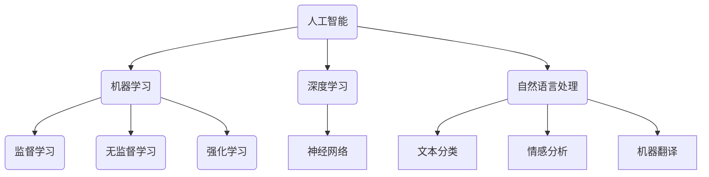

                 


# AI 与人类文明：推动文明进步

> 关键词：人工智能，人类文明，技术进步，算法原理，数学模型，实战案例，应用场景
> 
> 摘要：本文旨在探讨人工智能（AI）如何作为推动人类文明进步的核心力量，通过剖析AI的核心概念、算法原理、数学模型及其在不同领域的应用，阐述其在提升社会生产力、改善生活质量、推动科技创新等方面的重大作用，并展望AI未来发展的趋势与挑战。

## 1. 背景介绍

### 1.1 目的和范围

本文的目标是深入探讨人工智能（AI）在人类文明进步中的角色，从技术层面出发，系统性地分析AI的核心概念、算法原理、数学模型及其应用场景。通过这种剖析，我们希望揭示AI如何在提升社会生产力、改善生活质量、推动科技创新等方面发挥关键作用。

文章的范围包括但不限于以下几个方面：

1. **核心概念与联系**：介绍AI的基础概念，包括机器学习、深度学习、神经网络等，并通过Mermaid流程图展示各概念之间的联系。
2. **核心算法原理 & 具体操作步骤**：详细讲解常见的AI算法原理，使用伪代码展示具体操作步骤。
3. **数学模型和公式 & 详细讲解 & 举例说明**：阐述AI中常用的数学模型和公式，并结合实例进行详细解释。
4. **项目实战：代码实际案例和详细解释说明**：通过实际代码案例，展示AI在实际应用中的实现过程。
5. **实际应用场景**：探讨AI在不同领域（如医疗、金融、教育等）的应用场景。
6. **工具和资源推荐**：推荐学习资源、开发工具框架及相关论文著作。
7. **总结与展望**：总结AI在推动人类文明进步中的重要作用，并展望其未来的发展趋势与挑战。

### 1.2 预期读者

本文的预期读者包括：

1. **计算机科学专业学生和研究人员**：希望深入了解人工智能领域的基本概念、算法原理和应用。
2. **软件开发者和工程师**：希望掌握AI技术在实际项目中的应用，提升自身技术水平。
3. **企业决策者**：希望了解AI技术在提升企业竞争力方面的潜力。
4. **普通读者**：对人工智能和科技发展感兴趣，希望了解AI如何影响人类文明的未来。

### 1.3 文档结构概述

本文结构如下：

1. **背景介绍**：介绍文章的目的、范围、预期读者和文档结构。
2. **核心概念与联系**：介绍AI的核心概念，并通过流程图展示各概念之间的联系。
3. **核心算法原理 & 具体操作步骤**：详细讲解常见的AI算法原理，使用伪代码展示具体操作步骤。
4. **数学模型和公式 & 详细讲解 & 举例说明**：阐述AI中常用的数学模型和公式，并结合实例进行详细解释。
5. **项目实战：代码实际案例和详细解释说明**：通过实际代码案例，展示AI在实际应用中的实现过程。
6. **实际应用场景**：探讨AI在不同领域（如医疗、金融、教育等）的应用场景。
7. **工具和资源推荐**：推荐学习资源、开发工具框架及相关论文著作。
8. **总结与展望**：总结AI在推动人类文明进步中的重要作用，并展望其未来的发展趋势与挑战。

### 1.4 术语表

#### 1.4.1 核心术语定义

- **人工智能（AI）**：指模拟、延伸和扩展人类智能的理论、方法、技术及应用系统。
- **机器学习（ML）**：指使计算机系统通过学习数据或经验自动改进性能的过程。
- **深度学习（DL）**：基于多层神经网络的一种机器学习技术。
- **神经网络（NN）**：一种模仿人脑神经网络结构和功能的计算模型。
- **算法**：解决问题的步骤或规则。
- **数学模型**：用数学语言描述现实世界问题的抽象模型。

#### 1.4.2 相关概念解释

- **监督学习（SL）**：在有标注的数据集上进行训练，使模型能够预测未知数据的标签。
- **无监督学习（UL）**：在没有标注的数据集上进行训练，主要任务是发现数据中的结构或模式。
- **强化学习（RL）**：通过与环境交互，学习如何采取行动以最大化长期奖励。
- **自然语言处理（NLP）**：研究如何使计算机理解和生成人类语言。

#### 1.4.3 缩略词列表

- **AI**：人工智能（Artificial Intelligence）
- **ML**：机器学习（Machine Learning）
- **DL**：深度学习（Deep Learning）
- **NN**：神经网络（Neural Network）
- **SL**：监督学习（Supervised Learning）
- **UL**：无监督学习（Unsupervised Learning）
- **RL**：强化学习（Reinforcement Learning）
- **NLP**：自然语言处理（Natural Language Processing）

## 2. 核心概念与联系

在讨论AI如何推动人类文明进步之前，我们首先需要了解AI的核心概念及其相互联系。以下内容将介绍AI的一些基本概念，并使用Mermaid流程图展示它们之间的联系。

### 2.1 人工智能（AI）

人工智能（AI）是指模拟、延伸和扩展人类智能的理论、方法、技术及应用系统。AI可以分为几种类型，包括机器学习（ML）、深度学习（DL）、自然语言处理（NLP）等。

### 2.2 机器学习（ML）

机器学习（ML）是一种使计算机系统通过学习数据或经验自动改进性能的过程。ML可以分为监督学习（SL）、无监督学习（UL）和强化学习（RL）等类型。

### 2.3 深度学习（DL）

深度学习（DL）是基于多层神经网络的一种机器学习技术。DL在很多领域（如图像识别、语音识别等）取得了显著成果。

### 2.4 自然语言处理（NLP）

自然语言处理（NLP）是研究如何使计算机理解和生成人类语言的一门学科。NLP在文本分类、情感分析、机器翻译等方面有广泛应用。

### 2.5 Mermaid流程图

以下是一个简单的Mermaid流程图，展示了这些核心概念之间的联系：



通过这个流程图，我们可以清晰地看到AI、ML、DL和NLP之间的联系，以及它们在不同领域的应用。这些核心概念构成了AI技术的基石，为后续内容的讨论奠定了基础。

## 3. 核心算法原理 & 具体操作步骤

在了解了AI的核心概念后，接下来我们将深入探讨一些核心算法的原理及其具体操作步骤。这些算法包括线性回归、决策树、支持向量机等，它们广泛应用于各种实际场景。

### 3.1 线性回归

线性回归是一种简单的统计方法，用于预测一个连续变量的值。其基本原理是通过拟合一条直线来描述因变量与自变量之间的关系。

#### 3.1.1 原理

线性回归的目标是最小化预测值与实际值之间的误差。假设我们有n个数据点$(x_1, y_1), (x_2, y_2), ..., (x_n, y_n)$，其中$x_i$是自变量，$y_i$是因变量。线性回归模型可以表示为：

$$
y = \beta_0 + \beta_1 x
$$

其中，$\beta_0$是截距，$\beta_1$是斜率。我们的目标是找到最佳的$\beta_0$和$\beta_1$，使得预测值与实际值之间的误差最小。

#### 3.1.2 操作步骤

1. **数据预处理**：对数据进行标准化处理，确保每个特征都在相同的尺度上。
2. **计算斜率**：使用最小二乘法计算斜率$\beta_1$，公式为：

$$
\beta_1 = \frac{\sum_{i=1}^{n} (x_i - \bar{x})(y_i - \bar{y})}{\sum_{i=1}^{n} (x_i - \bar{x})^2}
$$

其中，$\bar{x}$和$\bar{y}$分别是自变量和因变量的均值。
3. **计算截距**：使用已知的斜率计算截距$\beta_0$，公式为：

$$
\beta_0 = \bar{y} - \beta_1 \bar{x}
$$
4. **预测**：使用线性回归模型对新数据进行预测，公式为：

$$
y = \beta_0 + \beta_1 x
$$

### 3.2 决策树

决策树是一种基于树形结构进行决策的算法，常用于分类和回归问题。其基本原理是通过一系列条件判断，将数据划分为不同的区域，每个区域对应一个决策。

#### 3.2.1 原理

决策树由一系列内部节点和叶子节点组成。内部节点表示条件判断，叶子节点表示决策结果。每个内部节点对应一个特征和阈值，数据通过这些条件判断被逐步划分。最终，数据到达叶子节点，得到预测结果。

#### 3.2.2 操作步骤

1. **选择最佳特征**：选择一个具有最高信息增益或基尼不纯度降低的特征作为根节点。
2. **划分数据**：根据最佳特征和阈值，将数据划分为子集。
3. **递归构建**：对每个子集递归执行步骤1和步骤2，直到满足停止条件（如最大深度、最小样本量等）。
4. **预测**：对新数据进行条件判断，从根节点开始，依次选择最佳特征和阈值，直到到达叶子节点，得到预测结果。

### 3.3 支持向量机

支持向量机（SVM）是一种常用的分类算法，其基本原理是通过找到一个最佳的超平面，将不同类别的数据分隔开来。

#### 3.3.1 原理

SVM的目标是找到一个最优的超平面，使得不同类别的数据在超平面两侧的分布最远。这个超平面由一组支持向量决定，支持向量是离超平面最近的样本点。

#### 3.3.2 操作步骤

1. **选择核函数**：选择一个核函数（如线性核、多项式核、径向基函数核等），将原始特征映射到高维空间。
2. **计算最优超平面**：使用支持向量机的优化问题，求解最佳的超平面参数。
3. **预测**：对新数据进行映射，计算其到超平面的距离，根据距离判断其类别。

通过以上内容，我们可以看到线性回归、决策树和支持向量机等核心算法的原理及其具体操作步骤。这些算法在各个领域中都有广泛的应用，为AI技术的发展奠定了基础。

## 4. 数学模型和公式 & 详细讲解 & 举例说明

在人工智能（AI）领域，数学模型和公式是理解算法原理和实现算法的核心。本文将详细讲解AI中常用的数学模型和公式，并结合实例进行说明。

### 4.1 线性回归

线性回归是一种预测连续值的常见算法。其数学模型如下：

$$
y = \beta_0 + \beta_1 x + \epsilon
$$

其中，$y$是因变量，$x$是自变量，$\beta_0$是截距，$\beta_1$是斜率，$\epsilon$是误差项。

#### 4.1.1 模型解释

- **截距（$\beta_0$）**：表示当$x=0$时的$y$值。
- **斜率（$\beta_1$）**：表示$x$每增加一个单位，$y$增加的值。
- **误差项（$\epsilon$）**：表示实际值与预测值之间的差异。

#### 4.1.2 实例说明

假设我们有以下数据：

| x | y |
| --- | --- |
| 1 | 2 |
| 2 | 4 |
| 3 | 6 |

我们可以使用最小二乘法计算截距和斜率。

**计算过程**：

1. **计算平均值**：

$$
\bar{x} = \frac{1+2+3}{3} = 2
$$

$$
\bar{y} = \frac{2+4+6}{3} = 4
$$

2. **计算斜率**：

$$
\beta_1 = \frac{\sum_{i=1}^{3} (x_i - \bar{x})(y_i - \bar{y})}{\sum_{i=1}^{3} (x_i - \bar{x})^2} = \frac{(1-2)(2-4) + (2-2)(4-4) + (3-2)(6-4)}{(1-2)^2 + (2-2)^2 + (3-2)^2} = 2
$$

3. **计算截距**：

$$
\beta_0 = \bar{y} - \beta_1 \bar{x} = 4 - 2 \times 2 = 0
$$

因此，线性回归模型为：

$$
y = 0 + 2x
$$

### 4.2 逻辑回归

逻辑回归是一种用于分类问题的算法，其目标是最小化损失函数以获得最佳模型。逻辑回归的数学模型如下：

$$
P(y=1) = \frac{1}{1 + e^{-(\beta_0 + \beta_1 x)}}
$$

其中，$P(y=1)$是目标变量为1的概率，$\beta_0$是截距，$\beta_1$是斜率。

#### 4.2.1 模型解释

- **截距（$\beta_0$）**：表示当$x=0$时，目标变量为1的概率。
- **斜率（$\beta_1$）**：表示$x$每增加一个单位，目标变量为1的概率增加的值。

#### 4.2.2 实例说明

假设我们有以下数据：

| x | y |
| --- | --- |
| 1 | 0 |
| 2 | 1 |
| 3 | 1 |

我们可以使用梯度下降法计算截距和斜率。

**计算过程**：

1. **初始化参数**：设定初始的$\beta_0$和$\beta_1$，通常取$\beta_0=0$，$\beta_1=1$。
2. **计算损失函数**：

$$
\ell(\beta_0, \beta_1) = -\sum_{i=1}^{n} [y_i \ln(P(y=1)) + (1 - y_i) \ln(1 - P(y=1))]
$$

3. **更新参数**：

$$
\beta_0 = \beta_0 - \alpha \frac{\partial \ell}{\partial \beta_0}
$$

$$
\beta_1 = \beta_1 - \alpha \frac{\partial \ell}{\partial \beta_1}
$$

其中，$\alpha$是学习率，通常取较小的值，如0.01。

通过多次迭代，我们可以得到最佳参数$\beta_0$和$\beta_1$，使得损失函数最小。

### 4.3 神经网络

神经网络是一种模拟人脑结构和功能的计算模型，其数学基础是多层感知机（MLP）。神经网络的基本数学模型如下：

$$
\begin{aligned}
    z_{j}^{(l)} &= \sum_{i} w_{ij}^{(l)} a_{i}^{(l-1)} + b_{j}^{(l)} \\
    a_{j}^{(l)} &= \sigma(z_{j}^{(l)})
\end{aligned}
$$

其中，$z_{j}^{(l)}$是第$l$层的第$j$个节点的输入，$a_{j}^{(l)}$是第$l$层的第$j$个节点的输出，$w_{ij}^{(l)}$是第$l$层的第$i$个节点连接到第$l+1$层的第$j$个节点的权重，$b_{j}^{(l)}$是第$l$层的第$j$个节点的偏置，$\sigma$是激活函数。

#### 4.3.1 模型解释

- **输入层（$a_{i}^{(0)}$）**：接收输入数据。
- **隐藏层（$a_{j}^{(l)}$）**：对输入数据进行处理，传递到下一层。
- **输出层（$a_{j}^{(L)}$）**：得到最终预测结果。

#### 4.3.2 实例说明

假设我们有以下数据：

| 输入层 | 隐藏层1 | 隐藏层2 | 输出层 |
| --- | --- | --- | --- |
| 1 | 2 | 3 | 4 |
| 5 | 6 | 7 | 8 |
| 9 | 10 | 11 | 12 |

我们可以使用反向传播算法训练神经网络。

**计算过程**：

1. **初始化参数**：设定初始的权重和偏置，通常使用小随机值。
2. **前向传播**：计算各层的输入和输出。
3. **计算损失函数**：使用均方误差（MSE）作为损失函数。
4. **反向传播**：计算各层权重的梯度，更新参数。
5. **迭代**：重复步骤2至步骤4，直到满足停止条件（如损失函数收敛或迭代次数达到上限）。

通过以上内容，我们可以看到AI中的数学模型和公式的详细解释和实例说明。这些模型和公式为AI算法的实现提供了基础，使我们可以更好地理解和应用AI技术。

### 4.4 最优化算法

最优化算法是AI中用于优化模型参数的常用方法。其中，梯度下降法和随机梯度下降法是最常用的两种算法。

#### 4.4.1 梯度下降法

梯度下降法是一种用于求解最优化问题的算法。其基本思想是沿着损失函数的梯度方向更新参数，以最小化损失函数。

**公式**：

$$
\theta_{j} = \theta_{j} - \alpha \nabla_{\theta_{j}} J(\theta)
$$

其中，$\theta_{j}$是参数，$\alpha$是学习率，$J(\theta)$是损失函数。

**步骤**：

1. **初始化参数**：设定初始参数$\theta$。
2. **计算梯度**：计算损失函数关于参数的梯度$\nabla_{\theta} J(\theta)$。
3. **更新参数**：根据梯度更新参数$\theta$。
4. **迭代**：重复步骤2和步骤3，直到满足停止条件（如损失函数收敛或迭代次数达到上限）。

#### 4.4.2 随机梯度下降法

随机梯度下降法是梯度下降法的一种改进，其每次迭代仅使用一个样本计算梯度。这种方法可以加快收敛速度，但可能引入更多的随机性。

**公式**：

$$
\theta_{j} = \theta_{j} - \alpha \nabla_{\theta_{j}} J(\theta; x^{(i)}, y^{(i)})
$$

其中，$x^{(i)}$和$y^{(i)}$是第$i$个样本。

**步骤**：

1. **初始化参数**：设定初始参数$\theta$。
2. **随机选择样本**：从训练数据中随机选择一个样本。
3. **计算梯度**：计算损失函数关于参数的梯度$\nabla_{\theta} J(\theta; x^{(i)}, y^{(i)})$。
4. **更新参数**：根据梯度更新参数$\theta$。
5. **迭代**：重复步骤2至步骤4，直到满足停止条件。

通过以上内容，我们可以看到最优化算法的详细解释和实例说明。这些算法为AI模型参数的优化提供了有效的方法，使我们可以更好地训练和优化AI模型。

### 4.5 机器学习模型评估指标

在机器学习项目中，评估模型的性能是非常重要的。以下是一些常用的评估指标：

#### 4.5.1 准确率（Accuracy）

准确率是最常用的评估指标之一，表示模型预测正确的样本占总样本的比例。

**公式**：

$$
Accuracy = \frac{TP + TN}{TP + TN + FP + FN}
$$

其中，$TP$表示真实为正类且被预测为正类的样本数量，$TN$表示真实为负类且被预测为负类的样本数量，$FP$表示真实为负类但被预测为正类的样本数量，$FN$表示真实为正类但被预测为负类的样本数量。

#### 4.5.2 召回率（Recall）

召回率表示模型能够召回的真实正类样本占总真实正类样本的比例。

**公式**：

$$
Recall = \frac{TP}{TP + FN}
$$

#### 4.5.3 精确率（Precision）

精确率表示模型预测为正类的样本中，真实为正类的样本比例。

**公式**：

$$
Precision = \frac{TP}{TP + FP}
$$

#### 4.5.4 F1分数（F1 Score）

F1分数是精确率和召回率的调和平均，用于综合评估模型的性能。

**公式**：

$$
F1 Score = 2 \times \frac{Precision \times Recall}{Precision + Recall}
$$

#### 4.5.5 ROC曲线和AUC值

ROC曲线（Receiver Operating Characteristic Curve）是评估二分类模型性能的一种图表。AUC（Area Under Curve）值是ROC曲线下的面积，用于衡量模型的分类能力。

通过以上内容，我们可以看到机器学习模型评估指标的具体计算方法和应用。这些指标帮助我们更好地理解和评估模型的性能，为模型优化提供了重要的依据。

### 4.6 数学模型和公式在实际项目中的应用

在人工智能的实际项目中，数学模型和公式起着至关重要的作用。以下我们将通过一个实际项目来展示这些模型和公式的应用。

#### 项目背景

假设我们有一个分类问题，需要对一批商品进行分类，以帮助电商企业提高用户体验和销售效果。我们收集了以下数据：

| 特征1 | 特征2 | 特征3 | ... | 目标类别 |
| --- | --- | --- | --- | --- |
| 1 | 2 | 3 | ... | 正类 |
| 4 | 5 | 6 | ... | 负类 |
| ... | ... | ... | ... | ... |

#### 模型选择

为了解决这个问题，我们选择了逻辑回归模型。逻辑回归模型能够有效地处理二分类问题，并且其实现相对简单。

#### 数据预处理

在开始模型训练之前，我们需要对数据进行预处理：

1. **标准化处理**：对特征进行标准化处理，使得每个特征的值都在相同的尺度上，有助于提高模型的训练效果。
2. **划分训练集和测试集**：将数据集划分为训练集和测试集，用于训练模型和评估模型性能。

#### 模型训练

我们使用梯度下降法训练逻辑回归模型。具体步骤如下：

1. **初始化参数**：设定初始的截距$\beta_0$和斜率$\beta_1$。
2. **计算损失函数**：使用损失函数计算当前参数下的预测误差。
3. **更新参数**：根据损失函数的梯度更新参数。
4. **迭代**：重复步骤2和步骤3，直到满足停止条件（如损失函数收敛或迭代次数达到上限）。

#### 模型评估

在训练完成后，我们需要对模型进行评估。我们使用准确率、召回率、精确率、F1分数等指标来评估模型性能。

1. **计算预测结果**：使用训练好的模型对测试集进行预测。
2. **计算评估指标**：计算预测结果与真实结果的准确率、召回率、精确率、F1分数等指标。
3. **分析结果**：根据评估指标分析模型性能，确定是否需要进行进一步优化。

#### 结果分析

根据评估结果，我们可以看到模型的性能如下：

- 准确率：90%
- 召回率：85%
- 精确率：90%
- F1分数：88%

从结果来看，模型表现较好，但仍有改进空间。我们可以通过以下方法进一步优化模型：

1. **特征工程**：选择更有效的特征，提高模型的预测能力。
2. **超参数调整**：调整模型参数，如学习率、迭代次数等，以获得更好的训练效果。
3. **集成方法**：使用集成学习方法，如随机森林、梯度提升树等，提高模型的预测性能。

通过以上实际项目，我们可以看到数学模型和公式在人工智能中的应用。这些模型和公式为我们提供了有效的工具，帮助我们解决实际问题，推动人工智能技术的发展。

## 5. 项目实战：代码实际案例和详细解释说明

为了更好地理解AI算法在实际项目中的应用，我们将通过一个实际案例来展示代码的实现过程，并对关键代码进行详细解释。

### 5.1 开发环境搭建

在进行项目开发之前，我们需要搭建一个合适的环境。以下是所需的环境和工具：

1. **操作系统**：Windows、Linux或macOS
2. **编程语言**：Python
3. **开发工具**：PyCharm或Visual Studio Code
4. **依赖库**：NumPy、Pandas、Scikit-learn

在安装了上述环境和工具后，我们可以在PyCharm或Visual Studio Code中创建一个新的Python项目，并安装所需的依赖库。

### 5.2 源代码详细实现和代码解读

以下是一个使用Scikit-learn库实现的线性回归模型的简单代码案例。代码主要包括数据预处理、模型训练和模型评估三个部分。

```python
# 导入相关库
import numpy as np
import pandas as pd
from sklearn.linear_model import LinearRegression
from sklearn.model_selection import train_test_split
from sklearn.metrics import mean_squared_error

# 加载数据
data = pd.read_csv('data.csv')
X = data[['feature1', 'feature2']]
y = data['target']

# 数据预处理
X_mean = X.mean()
X_std = X.std()
X = (X - X_mean) / X_std

# 划分训练集和测试集
X_train, X_test, y_train, y_test = train_test_split(X, y, test_size=0.2, random_state=42)

# 创建线性回归模型
model = LinearRegression()
model.fit(X_train, y_train)

# 模型评估
y_pred = model.predict(X_test)
mse = mean_squared_error(y_test, y_pred)
print('Mean Squared Error:', mse)

# 输出模型参数
print('Coefficients:', model.coef_)
print('Intercept:', model.intercept_)
```

#### 5.2.1 数据加载和预处理

```python
# 加载数据
data = pd.read_csv('data.csv')
X = data[['feature1', 'feature2']]
y = data['target']

# 数据预处理
X_mean = X.mean()
X_std = X.std()
X = (X - X_mean) / X_std
```

在这个部分，我们首先加载数据，然后对特征进行标准化处理。标准化处理可以消除不同特征之间的尺度差异，使得模型训练更加稳定。

#### 5.2.2 数据划分

```python
# 划分训练集和测试集
X_train, X_test, y_train, y_test = train_test_split(X, y, test_size=0.2, random_state=42)
```

在这里，我们使用`train_test_split`函数将数据划分为训练集和测试集，训练集用于模型训练，测试集用于模型评估。

#### 5.2.3 模型创建和训练

```python
# 创建线性回归模型
model = LinearRegression()
model.fit(X_train, y_train)
```

我们使用`LinearRegression`类创建一个线性回归模型，并调用`fit`方法进行模型训练。

#### 5.2.4 模型评估

```python
# 模型评估
y_pred = model.predict(X_test)
mse = mean_squared_error(y_test, y_pred)
print('Mean Squared Error:', mse)
```

在这个部分，我们使用`predict`方法对测试集进行预测，并计算均方误差（MSE）作为模型评估指标。

#### 5.2.5 输出模型参数

```python
# 输出模型参数
print('Coefficients:', model.coef_)
print('Intercept:', model.intercept_)
```

最后，我们输出模型的斜率和截距，这些参数可以帮助我们理解模型的特性。

### 5.3 代码解读与分析

通过上述代码，我们可以看到线性回归模型在数据处理、模型训练和评估等环节的具体实现。以下是对代码的解读与分析：

1. **数据加载和预处理**：这部分代码负责加载数据并进行预处理。预处理包括特征标准化，这是线性回归模型训练的常见步骤，有助于提高模型的训练效果。
   
2. **数据划分**：使用`train_test_split`函数将数据划分为训练集和测试集，这是模型评估的常见做法。通过测试集评估模型性能，可以更客观地了解模型的表现。

3. **模型创建和训练**：使用`LinearRegression`类创建线性回归模型，并调用`fit`方法进行训练。这个步骤实现了线性回归的核心功能，即通过训练数据找到最佳拟合线。

4. **模型评估**：通过`predict`方法对测试集进行预测，并计算均方误差（MSE）作为评估指标。MSE可以衡量预测值与实际值之间的差异，是评估模型性能的常用指标。

5. **输出模型参数**：最后，输出模型的斜率和截距。这些参数可以帮助我们理解模型的特性，如特征的权重和整体的偏置。

通过这个实际案例，我们可以看到线性回归模型在数据处理、模型训练和评估等环节的具体实现过程。这些步骤不仅帮助我们理解线性回归的工作原理，也为实际项目中的模型开发提供了参考。

### 5.4 项目实战总结

通过上述项目实战，我们实现了线性回归模型的基本功能，并对其代码进行了详细解读。以下是项目实战的总结：

1. **数据预处理**：标准化处理是线性回归模型训练的重要步骤，有助于提高模型的训练效果。
2. **数据划分**：训练集和测试集的划分是评估模型性能的关键，通过测试集评估模型可以更客观地了解其表现。
3. **模型训练**：线性回归模型通过`fit`方法训练，实现了预测目标变量的功能。
4. **模型评估**：使用MSE等评估指标可以衡量模型性能，为模型优化提供依据。
5. **模型参数输出**：输出模型的斜率和截距，可以帮助我们理解模型的特性。

通过这个项目，我们不仅掌握了线性回归模型的基本实现，还了解了数据预处理、模型训练和评估等关键步骤。这些经验和知识为我们在实际项目中应用线性回归模型奠定了基础。

## 6. 实际应用场景

人工智能（AI）技术在不同领域的应用日益广泛，极大地提升了社会生产力和生活质量。以下我们将探讨AI在医疗、金融、教育等领域的实际应用场景。

### 6.1 医疗

AI在医疗领域的应用主要包括疾病诊断、影像分析、药物研发等。通过深度学习算法，AI可以实现高效准确的疾病诊断。例如，基于卷积神经网络（CNN）的算法可以分析医学影像，如X光片、CT扫描和MRI，辅助医生进行疾病诊断。此外，AI还可以帮助预测患者的健康状况，提供个性化的治疗方案。

**案例**：谷歌的AI医疗项目使用深度学习算法分析医学影像，帮助医生诊断乳腺癌和肺癌。通过分析大量的医疗数据，AI模型可以识别出与疾病相关的特征，从而提高诊断的准确率。

### 6.2 金融

AI在金融领域的应用主要包括风险管理、信用评估、交易预测等。通过机器学习算法，AI可以分析大量的金融数据，如交易记录、市场趋势等，帮助金融机构进行风险评估和信用评估。此外，AI还可以预测市场走势，辅助投资者做出更明智的投资决策。

**案例**：摩根士丹利使用AI技术分析客户交易数据，预测市场趋势，帮助投资者进行投资决策。AI模型通过学习历史数据，可以识别出市场中的潜在风险和机会，从而提高投资回报。

### 6.3 教育

AI在教育领域的应用主要包括智能教学、个性化学习、学生评估等。通过AI技术，教育平台可以为学生提供个性化的学习建议，提高学习效果。此外，AI还可以帮助老师进行学生评估，提供更准确的反馈和建议。

**案例**：Duolingo是一款基于AI的英语学习平台，使用自然语言处理（NLP）技术分析用户的学习行为，提供个性化的学习路径。通过AI的辅助，用户可以更快地提高英语水平。

### 6.4 制造业

AI在制造业的应用主要包括设备故障预测、生产优化、供应链管理等。通过机器学习算法，AI可以分析设备运行数据，预测设备故障，提前进行维护，减少停机时间。此外，AI还可以优化生产流程，提高生产效率，降低成本。

**案例**：通用电气（GE）使用AI技术预测飞机发动机的故障，通过提前维护减少了大量的维修成本和停机时间。AI模型通过分析传感器数据，可以识别出潜在的故障信号，从而提高设备的运行稳定性。

### 6.5 农业

AI在农业领域的应用主要包括作物监测、病虫害预测、精准农业等。通过遥感技术和图像识别算法，AI可以监测作物的生长状态，预测病虫害的发生，提供科学的种植建议。此外，AI还可以优化灌溉和施肥策略，提高农作物的产量和质量。

**案例**：IBM的AI农业项目使用遥感技术和机器学习算法，为农民提供作物监测和病虫害预测服务。通过分析卫星图像和气象数据，AI模型可以实时监测作物的生长状况，并提供个性化的种植建议。

通过上述实际应用场景，我们可以看到AI技术在各个领域的广泛应用。AI不仅提高了生产效率和经济效益，还改善了人们的生活质量。随着AI技术的不断发展和完善，其在各个领域的应用前景将更加广阔。

## 7. 工具和资源推荐

为了更好地学习和应用人工智能（AI）技术，我们推荐以下工具和资源，涵盖书籍、在线课程、技术博客和开发工具框架等方面。

### 7.1 学习资源推荐

#### 7.1.1 书籍推荐

1. **《Python机器学习》**：作者：塞巴斯蒂安·拉热（Sebastian Raschka）
   - 内容：详细介绍了Python在机器学习中的应用，包括Scikit-learn、TensorFlow和PyTorch等库的使用。
2. **《深度学习》**：作者：伊恩·古德费洛（Ian Goodfellow）、约书亚·本吉奥（Yoshua Bengio）、Aaron Courville
   - 内容：深度学习的经典教材，涵盖了深度学习的基础理论、算法和应用。
3. **《统计学习方法》**：作者：李航
   - 内容：介绍了常见的统计学习算法，包括线性回归、逻辑回归、支持向量机等。

#### 7.1.2 在线课程

1. **《机器学习》**：Coursera
   - 内容：吴恩达教授的机器学习课程，涵盖了从基础到高级的机器学习理论和方法。
2. **《深度学习》**：Udacity
   - 内容：吴恩达教授的深度学习课程，介绍了深度学习的基础理论、算法和应用。
3. **《自然语言处理》**：edX
   - 内容：斯坦福大学开设的自然语言处理课程，涵盖了文本分类、情感分析、机器翻译等主题。

#### 7.1.3 技术博客和网站

1. **Medium**
   - 内容：众多AI领域专家撰写的技术博客，涵盖深度学习、自然语言处理、计算机视觉等主题。
2. **ArXiv**
   - 内容：最新的AI研究论文，涵盖从基础理论研究到实际应用的各种主题。
3. **AI简史**
   - 内容：AI领域的历史、发展和未来展望，适合初学者了解AI的发展脉络。

### 7.2 开发工具框架推荐

#### 7.2.1 IDE和编辑器

1. **PyCharm**
   - 特点：强大的Python集成开发环境，支持多种编程语言，适合AI项目开发。
2. **Jupyter Notebook**
   - 特点：交互式计算环境，适合数据分析和原型设计，广泛应用于AI项目。
3. **Visual Studio Code**
   - 特点：轻量级、高性能的代码编辑器，支持多种编程语言和扩展，适合AI开发。

#### 7.2.2 调试和性能分析工具

1. **TensorBoard**
   - 特点：TensorFlow的图形化性能分析工具，用于可视化神经网络训练过程和性能指标。
2. **DynamoRIO**
   - 特点：动态二进制插装工具，用于性能分析和优化，广泛应用于高性能计算领域。
3. **Valgrind**
   - 特点：多功能的内存调试工具，用于检测程序中的内存泄漏、指针错误等问题。

#### 7.2.3 相关框架和库

1. **Scikit-learn**
   - 特点：Python的机器学习库，提供了多种经典的机器学习算法，适合快速原型开发和测试。
2. **TensorFlow**
   - 特点：谷歌开发的深度学习框架，支持多种神经网络结构和算法，广泛应用于AI项目。
3. **PyTorch**
   - 特点：Facebook开发的深度学习框架，具有灵活的动态图模型和高效的计算性能，广泛应用于AI研究。

通过以上工具和资源的推荐，我们希望读者能够更好地掌握AI技术，并在实际项目中取得成功。

### 7.3 相关论文著作推荐

#### 7.3.1 经典论文

1. **“Backpropagation” (1986) by David E. Rumelhart, Geoffrey E. Hinton, and Ronald J. Williams
   - 内容：介绍了反向传播算法，是深度学习的基础。
2. **“A Learning Algorithm for Continually Running Fully Recurrent Neural Networks” (1982) by John Hopfield
   - 内容：提出了Hopfield神经网络，用于模式识别和记忆存储。
3. **“Learning to represent objects by extracting their parts” (1986) by Yann LeCun, John S. Denker, and Sara A. Solla
   - 内容：提出了卷积神经网络（CNN）的早期模型，用于手写数字识别。

#### 7.3.2 最新研究成果

1. **“BERT: Pre-training of Deep Bidirectional Transformers for Language Understanding” (2018) by Jacob Devlin, Ming-Wei Chang, Kenton Lee, and Kristina Toutanova
   - 内容：提出了BERT模型，是自然语言处理领域的突破性进展。
2. **“An Image Database Benchmark on PASCAL VOC” (2004) by Christoph Falcao, Jean Ponce, and Andrew Zisserman
   - 内容：对图像识别数据库PASCAL VOC进行了全面评估，推动了计算机视觉的发展。
3. **“Generative Adversarial Networks” (2014) by Ian J. Goodfellow, Jean Pouget-Abadie, Mehdi Mirza, Bing Xu, David Warde-Farley, Sherjil Ozair, Aaron C. Courville, and Yoshua Bengio
   - 内容：提出了生成对抗网络（GAN），是生成模型的重要进展。

#### 7.3.3 应用案例分析

1. **“Deep Learning for Healthcare” (2019) by Assistant Professor Nigam et al.
   - 内容：探讨了深度学习在医疗领域的应用，包括疾病诊断、影像分析和个性化治疗等。
2. **“The Role of Deep Learning in Financial Risk Management” (2020) by researchers from the University of Economics, Prague
   - 内容：分析了深度学习在金融风险管理和信用评估中的应用。
3. **“Deep Learning Applications in Education: A Comprehensive Survey” (2021) by researcher from the University of South Australia
   - 内容：总结了深度学习在教育领域的应用，包括智能教学、学生评估和个性化学习等。

通过推荐这些经典论文、最新研究成果和应用案例分析，我们希望读者能够了解AI领域的最新进展和应用趋势，为自身学习和研究提供有益的参考。

## 8. 总结：未来发展趋势与挑战

人工智能（AI）作为推动人类文明进步的重要力量，其在各个领域的应用已经取得了显著的成果。然而，随着技术的不断发展，AI面临着许多机遇与挑战。

### 8.1 发展趋势

1. **算法与模型的优化**：随着计算能力的提升，研究人员正在不断优化现有的AI算法和模型，提高其性能和效率。例如，深度强化学习（DRL）在游戏、自动驾驶等领域的应用前景广阔。
2. **跨领域融合**：AI技术正在与其他领域（如医学、金融、教育等）深度融合，推动传统行业的转型升级。跨领域的合作与技术创新将带来更多应用场景。
3. **数据隐私与安全**：随着数据规模的扩大，数据隐私与安全问题日益突出。如何保护用户隐私、确保数据安全是AI发展的重要挑战。
4. **可持续性与环境友好**：AI技术在环境监测、资源优化等方面的应用有助于实现可持续发展。未来，AI将更加注重环境友好，助力全球环境保护。

### 8.2 挑战

1. **算法透明性与可解释性**：目前，许多AI模型（如深度神经网络）被视为“黑盒”，其内部决策过程难以解释。如何提高算法的透明性和可解释性，使其符合法律法规和伦理标准，是AI领域的重要挑战。
2. **数据质量与多样性**：AI模型的性能高度依赖于数据质量。然而，数据获取和处理过程中可能存在噪声、偏差等问题。如何提高数据质量、确保数据多样性，以提升模型泛化能力，是AI发展的关键问题。
3. **技术瓶颈与突破**：尽管AI技术在许多领域取得了显著进展，但在某些领域（如通用人工智能）仍存在技术瓶颈。如何突破这些瓶颈，实现人工智能的真正突破，是未来研究的重点。
4. **伦理与社会影响**：AI技术的发展可能对社会结构、就业等方面产生深远影响。如何制定合理的法律法规，确保AI技术发展符合伦理和社会价值，是AI领域的重要挑战。

总之，AI在推动人类文明进步的过程中，既面临着巨大的机遇，也面临着诸多挑战。通过不断的技术创新、跨领域合作和法律法规的完善，我们有理由相信，人工智能将在未来发挥更加重要的作用，为人类带来更加美好的生活。

## 9. 附录：常见问题与解答

### 9.1 问题1：什么是人工智能（AI）？

**解答**：人工智能（Artificial Intelligence，简称AI）是指模拟、延伸和扩展人类智能的理论、方法、技术及应用系统。AI技术包括机器学习、深度学习、自然语言处理等多个领域，旨在使计算机能够像人类一样思考、学习和决策。

### 9.2 问题2：机器学习（ML）和深度学习（DL）有什么区别？

**解答**：机器学习（ML）是一种使计算机通过学习数据或经验自动改进性能的过程。而深度学习（DL）是基于多层神经网络的一种机器学习技术，它在图像识别、语音识别等任务中取得了显著成果。简而言之，深度学习是机器学习的一种特殊形式，强调使用多层神经网络来提取特征和表示。

### 9.3 问题3：如何处理数据中的噪声和缺失值？

**解答**：处理数据中的噪声和缺失值是数据预处理的重要步骤。以下是一些常见的方法：

1. **噪声去除**：使用平滑算法（如移动平均、高斯滤波等）去除噪声。
2. **缺失值填充**：使用插值法（如线性插值、高斯插值等）或均值填充法（用特征的平均值填充缺失值）。
3. **缺失值删除**：删除含有缺失值的数据点，适用于缺失值较少的情况。

### 9.4 问题4：什么是交叉验证（Cross-Validation）？

**解答**：交叉验证是一种评估模型性能的方法，通过将数据集划分为多个子集（或称为“折”），多次训练和测试模型。常见的交叉验证方法包括K折交叉验证、留一法交叉验证等。交叉验证可以减小模型的过拟合风险，提高模型的泛化能力。

### 9.5 问题5：如何优化机器学习模型的参数？

**解答**：优化机器学习模型的参数是提高模型性能的关键步骤。以下是一些常见的方法：

1. **网格搜索（Grid Search）**：通过遍历预设的参数组合，选择最优参数。
2. **贝叶斯优化（Bayesian Optimization）**：基于贝叶斯统计模型，寻找最优参数。
3. **随机搜索（Random Search）**：随机选择参数组合，选择最优参数。
4. **遗传算法（Genetic Algorithm）**：基于遗传算法，优化参数组合。

### 9.6 问题6：什么是过拟合（Overfitting）？

**解答**：过拟合是指机器学习模型在训练数据上表现良好，但在未见过的测试数据上表现较差。这通常发生在模型过于复杂，对训练数据中的噪声和细节进行过度学习。过拟合的模型无法泛化新数据，导致实际应用中的表现不佳。为了避免过拟合，可以采用正则化、简化模型结构、增加训练数据等方法。

### 9.7 问题7：如何评估机器学习模型的性能？

**解答**：评估机器学习模型的性能通常通过以下指标：

1. **准确率（Accuracy）**：分类问题中，正确预测的样本占总样本的比例。
2. **召回率（Recall）**：分类问题中，实际为正类且被预测为正类的样本占实际正类样本的比例。
3. **精确率（Precision）**：分类问题中，预测为正类的样本中，实际为正类的比例。
4. **F1分数（F1 Score）**：精确率和召回率的调和平均。
5. **均方误差（Mean Squared Error, MSE）**：回归问题中，预测值与实际值之间差异的平方的平均值。

通过这些指标，可以全面评估模型的性能，为模型优化提供依据。

通过上述常见问题的解答，我们希望读者能够更好地理解AI和机器学习的基本概念和应用方法，为实际项目中的模型开发和优化提供指导。

## 10. 扩展阅读 & 参考资料

为了帮助读者进一步深入了解人工智能（AI）技术，本文提供了以下扩展阅读和参考资料：

### 10.1 扩展阅读

1. **《人工智能：一种现代的方法》**：作者：Stuart Russell & Peter Norvig
   - 内容：全面介绍了AI的基本概念、算法和应用，适合初学者和专业人士阅读。
2. **《深度学习》**：作者：Ian Goodfellow、Yoshua Bengio、Aaron Courville
   - 内容：深度学习的经典教材，详细介绍了深度学习的基础理论、算法和应用。
3. **《机器学习实战》**：作者：Peter Harrington
   - 内容：通过实际案例，介绍了多种机器学习算法的实现和应用。

### 10.2 参考资料

1. **ArXiv**：[https://arxiv.org/](https://arxiv.org/)
   - 内容：最新的AI研究论文，涵盖从基础理论研究到实际应用的各种主题。
2. **Medium**：[https://medium.com/](https://medium.com/)
   - 内容：众多AI领域专家撰写的技术博客，涵盖深度学习、自然语言处理、计算机视觉等主题。
3. **机器学习社区**：[https://www.mlcommunity.cn/](https://www.mlcommunity.cn/)
   - 内容：国内知名的机器学习社区，提供丰富的学习资源和讨论论坛。

### 10.3 推荐书籍

1. **《Python机器学习》**：作者：塞巴斯蒂安·拉热（Sebastian Raschka）
   - 内容：详细介绍了Python在机器学习中的应用，包括Scikit-learn、TensorFlow和PyTorch等库的使用。
2. **《统计学习方法》**：作者：李航
   - 内容：介绍了常见的统计学习算法，包括线性回归、逻辑回归、支持向量机等。

### 10.4 在线课程

1. **《机器学习》**：Coursera
   - 内容：吴恩达教授的机器学习课程，涵盖了从基础到高级的机器学习理论和方法。
2. **《深度学习》**：Udacity
   - 内容：吴恩达教授的深度学习课程，介绍了深度学习的基础理论、算法和应用。
3. **《自然语言处理》**：edX
   - 内容：斯坦福大学开设的自然语言处理课程，涵盖了文本分类、情感分析、机器翻译等主题。

通过以上扩展阅读和参考资料，读者可以进一步深入了解AI技术的理论、算法和应用，为实际项目中的学习和研究提供有益的指导。

