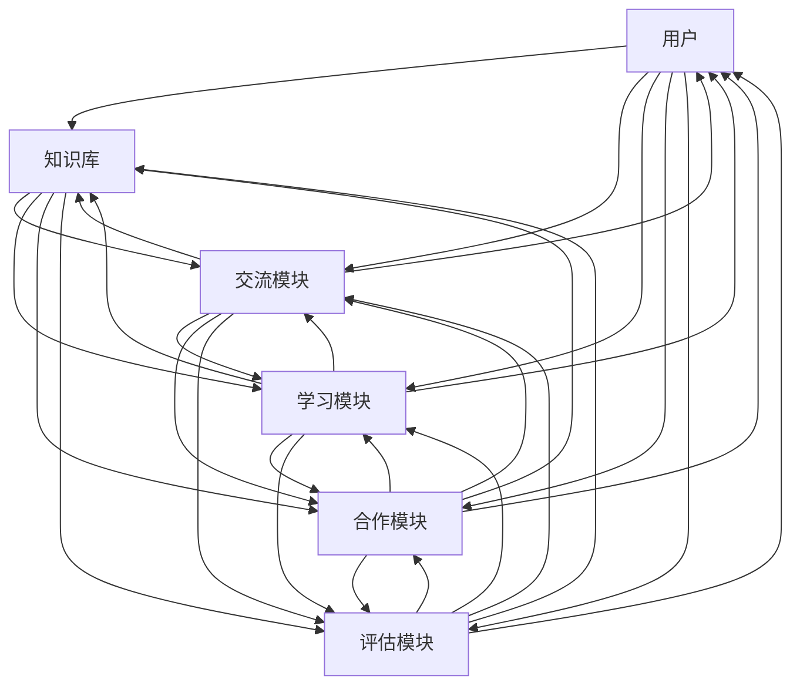

                 

# AI 人才交流平台：促进 AI 技术的创新和发展

> 关键词：AI 人才交流平台，技术创新，知识共享，人工智能发展，人才挖掘与培养

> 摘要：本文将探讨 AI 人才交流平台在现代人工智能技术发展中的重要作用。通过分析其背景、核心概念、算法原理、数学模型、实际应用场景、工具和资源，本文旨在为读者提供一个全面的视角，了解 AI 人才交流平台如何促进 AI 技术的创新和发展。

## 1. 背景介绍

### 1.1 目的和范围

本文旨在探讨 AI 人才交流平台在现代人工智能技术发展中的作用。随着人工智能技术的不断进步，对 AI 人才的需求日益增长。本文将分析 AI 人才交流平台的目的、范围和重要性，并讨论其如何促进 AI 技术的创新和发展。

### 1.2 预期读者

本文预期读者包括对 AI 人才交流平台感兴趣的科研人员、技术人员、企业高管以及政策制定者。本文将提供对 AI 人才交流平台的深入理解，帮助读者了解其在人工智能领域中的重要作用。

### 1.3 文档结构概述

本文结构如下：

1. 背景介绍：介绍 AI 人才交流平台的背景、目的和预期读者。
2. 核心概念与联系：介绍 AI 人才交流平台的核心概念、原理和架构。
3. 核心算法原理 & 具体操作步骤：详细讲解 AI 人才交流平台的核心算法原理和操作步骤。
4. 数学模型和公式 & 详细讲解 & 举例说明：介绍 AI 人才交流平台所使用的数学模型和公式，并提供实例说明。
5. 项目实战：代码实际案例和详细解释说明。
6. 实际应用场景：探讨 AI 人才交流平台在不同场景下的应用。
7. 工具和资源推荐：推荐与 AI 人才交流平台相关的学习资源、开发工具和框架。
8. 总结：总结 AI 人才交流平台的发展趋势与挑战。
9. 附录：常见问题与解答。
10. 扩展阅读 & 参考资料：提供进一步的阅读和参考资料。

### 1.4 术语表

#### 1.4.1 核心术语定义

- AI 人才交流平台：指专门为人工智能领域人才提供知识分享、交流合作和技能提升的在线平台。
- 知识共享：指在 AI 人才交流平台上，用户通过发布、讨论和共享知识，促进知识传递和技能提升的过程。
- 技能提升：指通过学习、交流和合作，提升个人在人工智能领域的技能水平。
- 创新和发展：指通过 AI 人才交流平台，促进人工智能技术的创新和产业的快速发展。

#### 1.4.2 相关概念解释

- 人工智能（AI）：指模拟、延伸和扩展人类智能的理论、方法、技术及应用。
- 机器学习（ML）：指利用数据训练模型，使其能够自主学习和改进的技术。
- 深度学习（DL）：指多层神经网络进行训练和预测的机器学习技术。
- 人工智能工程师：指在人工智能领域从事研究、开发和应用的工程师。

#### 1.4.3 缩略词列表

- AI：人工智能
- ML：机器学习
- DL：深度学习
- NLP：自然语言处理
- CV：计算机视觉

## 2. 核心概念与联系

在深入探讨 AI 人才交流平台之前，我们需要了解其核心概念、原理和架构。下面是一个简化的 Mermaid 流程图，展示了 AI 人才交流平台的主要组件和功能。



### 2.1 核心概念

#### 2.1.1 用户

用户是 AI 人才交流平台的核心，包括人工智能工程师、科研人员、学生和其他对 AI 技术感兴趣的个体。用户通过平台实现知识共享、技能提升、交流合作和评估。

#### 2.1.2 知识库

知识库是平台的重要组成部分，包含各种人工智能领域的知识、文档、论文、教程等。用户可以浏览、搜索和下载这些资源，从而丰富自己的知识体系。

#### 2.1.3 交流模块

交流模块提供用户之间进行互动和讨论的场所，包括论坛、博客、问答社区等。用户可以在这些平台上发布问题、分享经验和观点，与其他用户进行深入的交流和合作。

#### 2.1.4 学习模块

学习模块旨在帮助用户提升技能，包括在线课程、教程、案例研究、实验和竞赛等。用户可以根据自己的需求和兴趣选择学习资源，并通过学习模块进行自我评估和反馈。

#### 2.1.5 合作模块

合作模块促进用户之间的合作，包括项目合作、团队协作和资源共享等。用户可以在这里找到志同道合的合作伙伴，共同完成具有挑战性的 AI 项目。

#### 2.1.6 评估模块

评估模块用于对用户的知识、技能和贡献进行评估。评估结果可以为用户提供反馈，帮助他们了解自己的优势和不足，并指导他们的学习和发展。

### 2.2 核心原理和架构

AI 人才交流平台的核心原理和架构如下：

1. **知识共享**：平台通过建立知识库和交流模块，鼓励用户共享和传播知识。知识库中的资源可以为用户的学习和发展提供支持，而交流模块则为用户提供了互动和讨论的平台。

2. **技能提升**：平台通过学习模块和合作模块，帮助用户提升技能。学习模块提供了丰富的学习资源，而合作模块则促进了用户之间的交流和合作，从而提高学习效果。

3. **评估和反馈**：平台通过评估模块对用户的知识、技能和贡献进行评估，并提供反馈。这有助于用户了解自己的优势和不足，并指导他们的学习和发展。

4. **可持续发展**：平台通过持续更新和优化，确保其能够适应不断变化的人工智能技术，并持续满足用户的需求。

## 3. 核心算法原理 & 具体操作步骤

在 AI 人才交流平台中，核心算法负责处理用户知识、技能和贡献的评估，确保平台的可持续发展。下面我们将详细讲解核心算法原理和具体操作步骤。

### 3.1 算法原理

核心算法基于机器学习和自然语言处理技术，主要包括以下步骤：

1. **用户画像**：通过对用户的行为数据、知识库中的贡献和交流模块中的互动进行建模，生成用户画像。
2. **知识评估**：利用自然语言处理技术，对用户在知识库中的贡献进行评估，包括内容质量、贡献频率和影响力等。
3. **技能评估**：通过用户在交流模块中的互动和合作，评估用户的技能水平。
4. **贡献评估**：综合用户在知识库、交流模块和合作模块中的表现，评估用户的贡献程度。

### 3.2 具体操作步骤

下面是核心算法的具体操作步骤：

1. **数据收集与预处理**：收集用户在平台上的行为数据，包括知识库贡献、交流互动、学习记录和合作项目等。对数据进行清洗和预处理，确保其质量和一致性。

2. **用户画像生成**：利用机器学习技术，对用户行为数据进行建模，生成用户画像。用户画像包括知识结构、技能水平和行为偏好等。

3. **知识评估**：
   - **内容质量评估**：利用自然语言处理技术，对用户在知识库中的贡献进行评估。通过计算文本的语义相似度、句法结构和关键词密度等，评估内容的质量。
   - **贡献频率评估**：根据用户在知识库中的贡献频率，评估其对平台的贡献程度。
   - **影响力评估**：通过分析用户贡献的引用次数、点赞数和评论数等，评估其在平台上的影响力。

4. **技能评估**：
   - **互动评估**：根据用户在交流模块中的互动情况，评估其沟通能力、问题解决能力和团队协作能力。
   - **合作评估**：根据用户在合作模块中的项目完成情况和表现，评估其技能水平和实际能力。

5. **贡献评估**：综合用户在知识库、交流模块和合作模块中的表现，评估其对平台的整体贡献程度。

6. **评估结果反馈**：将评估结果反馈给用户，帮助用户了解自己的优势和不足，并指导他们的学习和发展。

### 3.3 伪代码示例

下面是一个简化的伪代码示例，展示了核心算法的操作步骤：

```python
# 数据收集与预处理
data = collect_data()

# 用户画像生成
user_profile = generate_user_profile(data)

# 知识评估
knowledge_assessment = assess_knowledge(user_profile)

# 技能评估
skill_assessment = assess_skills(user_profile)

# 贡献评估
contribution_assessment = assess_contribution(user_profile, knowledge_assessment, skill_assessment)

# 评估结果反馈
feedback_user(user_profile, knowledge_assessment, skill_assessment, contribution_assessment)
```

## 4. 数学模型和公式 & 详细讲解 & 举例说明

在 AI 人才交流平台的核心算法中，数学模型和公式起到了关键作用。下面我们将详细介绍这些模型和公式，并提供实例说明。

### 4.1 用户画像生成

用户画像生成主要涉及特征提取和聚类分析。以下是一个简化的数学模型：

1. **特征提取**：

   特征提取是将用户行为数据转换为数值特征的过程。假设用户行为数据包括知识库贡献、交流互动和学习记录，我们可以使用以下公式进行特征提取：

   $$ f(x) = \text{extract_features}(x) $$

   其中，$f(x)$ 表示特征向量，$\text{extract_features}(x)$ 表示提取特征的函数。

2. **聚类分析**：

   聚类分析是将用户划分为不同群体，以便更好地理解他们的行为和需求。我们可以使用以下公式进行聚类分析：

   $$ C = \text{cluster}(F) $$

   其中，$C$ 表示聚类结果，$F$ 表示特征矩阵，$\text{cluster}(F)$ 表示聚类算法。

### 4.2 知识评估

知识评估主要涉及内容质量、贡献频率和影响力评估。以下是一个简化的数学模型：

1. **内容质量评估**：

   内容质量评估是通过计算文本的语义相似度、句法结构和关键词密度等，评估内容的质量。我们可以使用以下公式进行评估：

   $$ Q = \text{content_quality}(T) $$

   其中，$Q$ 表示内容质量得分，$\text{content_quality}(T)$ 表示评估函数，$T$ 表示文本。

2. **贡献频率评估**：

   贡献频率评估是通过计算用户在知识库中的贡献频率，评估其对平台的贡献程度。我们可以使用以下公式进行评估：

   $$ F = \text{contribution_frequency}(C) $$

   其中，$F$ 表示贡献频率得分，$\text{contribution_frequency}(C)$ 表示评估函数，$C$ 表示用户在知识库中的贡献次数。

3. **影响力评估**：

   影响力评估是通过分析用户贡献的引用次数、点赞数和评论数等，评估其在平台上的影响力。我们可以使用以下公式进行评估：

   $$ I = \text{influence}(R) $$

   其中，$I$ 表示影响力得分，$\text{influence}(R)$ 表示评估函数，$R$ 表示用户贡献的引用次数、点赞数和评论数。

### 4.3 技能评估

技能评估主要涉及互动评估和合作评估。以下是一个简化的数学模型：

1. **互动评估**：

   互动评估是通过计算用户在交流模块中的互动情况，评估其沟通能力、问题解决能力和团队协作能力。我们可以使用以下公式进行评估：

   $$ S = \text{interaction}(I) $$

   其中，$S$ 表示技能得分，$\text{interaction}(I)$ 表示评估函数，$I$ 表示用户在交流模块中的互动记录。

2. **合作评估**：

   合作评估是通过计算用户在合作模块中的项目完成情况和表现，评估其技能水平和实际能力。我们可以使用以下公式进行评估：

   $$ P = \text{project_performance}(P) $$

   其中，$P$ 表示项目完成度得分，$\text{project_performance}(P)$ 表示评估函数，$P$ 表示用户在合作模块中的项目完成情况和表现。

### 4.4 贡献评估

贡献评估是综合用户在知识库、交流模块和合作模块中的表现，评估其对平台的整体贡献程度。我们可以使用以下公式进行评估：

$$ C = w_1 \cdot Q + w_2 \cdot F + w_3 \cdot I + w_4 \cdot S + w_5 \cdot P $$

其中，$C$ 表示贡献得分，$w_1, w_2, w_3, w_4, w_5$ 表示权重，$Q, F, I, S, P$ 分别表示内容质量得分、贡献频率得分、影响力得分、互动得分和项目完成度得分。

### 4.5 举例说明

假设有用户A，其在平台上的表现如下：

- 知识库贡献：5篇高质量文章，每篇文章得到10次引用、20次点赞和15次评论。
- 交流互动：参与20次讨论，解决10个问题，获得5个最佳答案。
- 学习记录：完成10门在线课程，获得8个证书。
- 合作项目：参与2个团队项目，均按时完成并达到预期目标。

根据上述数学模型和公式，我们可以计算用户A的评估得分：

1. **知识评估**：
   - 内容质量得分：$Q = 5 \cdot (10 + 20 + 15) = 400$
   - 贡献频率得分：$F = 5$
   - 影响力得分：$I = 5 \cdot (10 + 20 + 15) = 250$
2. **技能评估**：
   - 互动得分：$S = 20 + 10 + 5 = 35$
   - 项目完成度得分：$P = 2 \cdot 1 = 2$
3. **贡献评估**：
   - 权重设置：$w_1 = 0.4, w_2 = 0.2, w_3 = 0.2, w_4 = 0.1, w_5 = 0.1$
   - 贡献得分：$C = 0.4 \cdot 400 + 0.2 \cdot 5 + 0.2 \cdot 250 + 0.1 \cdot 35 + 0.1 \cdot 2 = 320$

因此，用户A的评估得分为320分。

通过这个例子，我们可以看到数学模型和公式如何帮助评估用户在 AI 人才交流平台上的表现，并为其提供有针对性的反馈和建议。

## 5. 项目实战：代码实际案例和详细解释说明

在本节中，我们将通过一个实际项目案例，展示如何搭建一个 AI 人才交流平台，并详细解释代码的实现和关键步骤。

### 5.1 开发环境搭建

首先，我们需要搭建一个开发环境，以便进行 AI 人才交流平台的开发和部署。以下是所需工具和软件：

- 开发工具：Python（3.8及以上版本）
- 代码编辑器：PyCharm、VSCode 等
- 数据库：MySQL（5.7及以上版本）
- 依赖库：Flask（用于 Web 开发）、SQLAlchemy（用于数据库操作）、Flask-WTF（用于表单处理）、Flask-Migrate（用于数据库迁移）、Bootstrap（用于前端界面）
- 服务器：Apache 或 Nginx

### 5.2 源代码详细实现和代码解读

下面是项目的源代码结构：

```
ai_talent_exchange/
│
├── app/
│   ├── __init__.py
│   ├── models.py
│   ├── views.py
│   ├── forms.py
│   └── static/
│       ├── css/
│       │   └── main.css
│       └── js/
│           └── main.js
│
├── migrations/
│   ├── environment.py
│   ├── init.py
│   ├── versions/
│       └── ...
│
├── config.py
├── run.py
└── requirements.txt
```

#### 5.2.1 数据库设计与迁移

首先，我们需要设计数据库模型，并使用 Flask-Migrate 进行数据库迁移。以下是 `models.py` 文件的内容：

```python
from datetime import datetime
from flask_sqlalchemy import SQLAlchemy

db = SQLAlchemy()

class User(db.Model):
    id = db.Column(db.Integer, primary_key=True)
    username = db.Column(db.String(64), unique=True, nullable=False)
    email = db.Column(db.String(120), unique=True, nullable=False)
    password_hash = db.Column(db.String(128), nullable=False)
    posts = db.relationship('Post', backref='author', lazy=True)
    comments = db.relationship('Comment', backref='author', lazy=True)

class Post(db.Model):
    id = db.Column(db.Integer, primary_key=True)
    title = db.Column(db.String(140), nullable=False)
    body = db.Column(db.Text, nullable=False)
    timestamp = db.Column(db.DateTime, default=datetime.utcnow)
    user_id = db.Column(db.Integer, db.ForeignKey('user.id'), nullable=False)

class Comment(db.Model):
    id = db.Column(db.Integer, primary_key=True)
    body = db.Column(db.Text, nullable=False)
    timestamp = db.Column(db.DateTime, default=datetime.utcnow)
    user_id = db.Column(db.Integer, db.ForeignKey('user.id'), nullable=False)
    post_id = db.Column(db.Integer, db.ForeignKey('post.id'), nullable=False)
```

接下来，我们需要创建数据库迁移文件，以便在项目运行时自动创建和迁移数据库。以下是 `migrations/versions/initial.py` 文件的内容：

```python
from alembic import op
import sqlalchemy as sa

def upgrade():
    op.create_table('user',
                    sa.Column('id', sa.Integer(), nullable=False),
                    sa.Column('username', sa.String(length=64), nullable=False),
                    sa.Column('email', sa.String(length=120), nullable=False),
                    sa.Column('password_hash', sa.String(length=128), nullable=False),
                    sa.PrimaryKeyConstraint('id'),
                    sa.UniqueConstraint('username'),
                    sa.UniqueConstraint('email'))

    op.create_table('post',
                    sa.Column('id', sa.Integer(), nullable=False),
                    sa.Column('title', sa.String(length=140), nullable=False),
                    sa.Column('body', sa.Text(), nullable=False),
                    sa.Column('timestamp', sa.DateTime(), default=sa.func.current_timestamp()),
                    sa.Column('user_id', sa.Integer(), nullable=False),
                    sa.ForeignKeyConstraint(['user_id'], ['user.id'], ),
                    sa.PrimaryKeyConstraint('id'))

    op.create_table('comment',
                    sa.Column('id', sa.Integer(), nullable=False),
                    sa.Column('body', sa.Text(), nullable=False),
                    sa.Column('timestamp', sa.DateTime(), default=sa.func.current_timestamp()),
                    sa.Column('user_id', sa.Integer(), nullable=False),
                    sa.Column('post_id', sa.Integer(), nullable=False),
                    sa.ForeignKeyConstraint(['post_id'], ['post.id'], ),
                    sa.ForeignKeyConstraint(['user_id'], ['user.id'], ),
                    sa.PrimaryKeyConstraint('id'))

def downgrade():
    op.drop_table('comment')
    op.drop_table('post')
    op.drop_table('user')
```

#### 5.2.2 用户注册和登录功能

在 `views.py` 文件中，我们实现了用户注册和登录功能。以下是相关代码的解读：

```python
from flask import render_template, redirect, url_for, flash, request
from flask_login import login_user, logout_user, login_required, current_user
from werkzeug.security import generate_password_hash, check_password_hash
from . import app
from .models import User
from .forms import LoginForm, RegistrationForm

@app.route('/login', methods=['GET', 'POST'])
def login():
    form = LoginForm()
    if form.validate_on_submit():
        user = User.query.filter_by(username=form.username.data).first()
        if user and check_password_hash(user.password_hash, form.password.data):
            login_user(user)
            return redirect(url_for('index'))
        else:
            flash('Invalid username or password')
    return render_template('login.html', form=form)

@app.route('/register', methods=['GET', 'POST'])
def register():
    form = RegistrationForm()
    if form.validate_on_submit():
        hashed_password = generate_password_hash(form.password.data, method='sha256')
        user = User(username=form.username.data, email=form.email.data, password_hash=hashed_password)
        db.session.add(user)
        db.session.commit()
        return redirect(url_for('login'))
    return render_template('register.html', form=form)

@app.route('/logout')
@login_required
def logout():
    logout_user()
    return redirect(url_for('index'))
```

这个部分首先导入了必要的模块和函数，然后定义了三个路由函数：`login`、`register` 和 `logout`。在 `login` 函数中，我们处理用户登录请求，验证用户名和密码，并使用 Flask-Login 库进行用户身份验证。在 `register` 函数中，我们处理用户注册请求，生成密码哈希，并保存用户信息到数据库。在 `logout` 函数中，我们使用 Flask-Login 库注销用户。

#### 5.2.3 前端界面设计

在 `static/css/main.css` 文件中，我们定义了前端界面样式。以下是样式文件的部分内容：

```css
body {
    font-family: Arial, sans-serif;
    margin: 0;
    padding: 0;
}

.container {
    max-width: 960px;
    margin: 0 auto;
}

header {
    background-color: #333;
    padding: 20px;
}

header h1 {
    color: #fff;
    font-size: 2em;
    margin: 0;
}

nav ul {
    list-style-type: none;
    margin: 0;
    padding: 0;
}

nav ul li {
    display: inline-block;
    margin-right: 20px;
}

nav ul li a {
    color: #fff;
    text-decoration: none;
}

footer {
    background-color: #333;
    padding: 20px;
    text-align: center;
}
```

这个部分定义了页面布局和样式，包括主容器、头部、导航栏和页脚等元素的样式。这些样式使得前端界面更加美观和易于使用。

### 5.3 代码解读与分析

通过以上代码，我们可以看到如何搭建一个基本的 AI 人才交流平台。以下是项目的关键组成部分及其作用：

1. **数据库模型**：定义了用户、文章和评论三个数据库模型，分别用于存储用户信息、文章内容和评论信息。
2. **用户注册和登录功能**：实现了用户注册和登录功能，使用 Flask-Login 库进行用户身份验证，并使用 Werkzeug 库进行密码哈希和验证。
3. **前端界面**：使用 Bootstrap 库构建前端界面，包括导航栏、头部、主容器和页脚等元素。

这个项目提供了一个基本的 AI 人才交流平台框架，用户可以注册、登录和发布文章。在实际开发中，我们还可以添加更多功能，如文章分类、评论回复、积分系统等，以提升用户体验和平台功能。

## 6. 实际应用场景

AI 人才交流平台可以在多个实际应用场景中发挥作用，以下是一些具体的应用场景：

### 6.1 科研团队合作

在人工智能领域，科研团队合作至关重要。AI 人才交流平台可以帮助研究人员找到志同道合的合作伙伴，共同开展具有挑战性的科研项目。平台可以提供项目合作模块，支持团队协作，帮助团队成员分享研究成果、讨论问题和解决问题。这样，研究人员可以更有效地利用各自的专长和资源，提高科研效率。

### 6.2 企业人才培养

企业需要不断培养和提升员工在人工智能领域的技能，以适应快速变化的技术环境。AI 人才交流平台可以为企业提供一个内部培训和学习资源库，员工可以通过学习模块掌握最新的人工智能技术。此外，平台还可以帮助员工找到合适的导师和合作伙伴，提升其技能和知识水平。通过这种方式，企业可以培养出更多具有核心竞争力的人才。

### 6.3 教育与培训

AI 人才交流平台在教育和培训领域也有很大的应用价值。教师和学生可以通过平台分享教学资源和学习经验，交流教学方法和学生反馈。平台可以提供在线课程、案例研究和实验，帮助学生更好地理解和掌握人工智能知识。此外，平台还可以为学生提供项目实践机会，让他们在实际项目中锻炼技能，提高就业竞争力。

### 6.4 技术社区建设

技术社区是人工智能领域人才交流的重要场所。AI 人才交流平台可以为技术社区提供一个集中化的平台，让社区成员可以发布问题、分享经验和观点，进行深入的交流和合作。平台可以提供问答社区、论坛和博客等功能，为技术社区成员提供一个友好、互动的学习环境。

### 6.5 跨学科合作

人工智能技术的发展需要跨学科的合作。AI 人才交流平台可以促进不同学科领域之间的交流与合作，例如计算机科学、数学、统计学、物理学等。平台可以提供一个多元化的知识分享和交流空间，帮助不同领域的专家共同探讨人工智能技术的应用和发展方向。

### 6.6 企业创新

企业可以利用 AI 人才交流平台，挖掘和培养内部人才，推动技术创新。企业可以通过平台上的知识共享、交流合作和技能提升功能，鼓励员工积极分享经验和创新想法。此外，企业还可以通过平台与外部人才建立合作关系，共同开展创新项目，提高企业的核心竞争力。

## 7. 工具和资源推荐

为了帮助读者更好地了解和参与 AI 人才交流平台的建设和应用，以下是我们推荐的工具和资源：

### 7.1 学习资源推荐

#### 7.1.1 书籍推荐

1. **《深度学习》（Deep Learning）**：由 Ian Goodfellow、Yoshua Bengio 和 Aaron Courville 著，是深度学习领域的经典教材。
2. **《Python 机器学习》（Python Machine Learning）**：由 Sebastian Raschka 著，详细介绍 Python 在机器学习中的应用。
3. **《人工智能：一种现代方法》（Artificial Intelligence: A Modern Approach）**：由 Stuart J. Russell 和 Peter Norvig 著，全面介绍人工智能的基础知识和方法。

#### 7.1.2 在线课程

1. **Coursera**：提供各种人工智能和机器学习在线课程，包括深度学习、自然语言处理、计算机视觉等。
2. **edX**：由麻省理工学院和哈佛大学共同创办，提供免费的高质量在线课程，涵盖人工智能、机器学习和数据科学等领域。
3. **Udacity**：提供实践驱动的在线课程，包括人工智能工程师、机器学习工程师等课程。

#### 7.1.3 技术博客和网站

1. **Medium**：一个内容创作和分享平台，有许多关于人工智能和机器学习的优质文章。
2. **arXiv**：一个开放获取的论文预印本平台，涵盖人工智能、机器学习、计算机科学等领域。
3. **GitHub**：一个代码托管和协作平台，许多人工智能项目和代码库都可以在这里找到。

### 7.2 开发工具框架推荐

#### 7.2.1 IDE和编辑器

1. **PyCharm**：一款功能强大的 Python 集成开发环境，支持代码调试、版本控制和自动化工具。
2. **VSCode**：一款轻量级的跨平台代码编辑器，支持多种编程语言，提供丰富的插件和扩展。
3. **Jupyter Notebook**：一款基于 Web 的交互式计算环境，适用于数据科学、机器学习和深度学习项目。

#### 7.2.2 调试和性能分析工具

1. **PyDebug**：一款 Python 调试器，支持断点、观察点和条件断点等功能。
2. **Profiling**：用于性能分析的工具，如 Python 中的 `cProfile` 库，可以帮助识别程序中的瓶颈和优化点。
3. **TensorBoard**：用于可视化深度学习模型的性能和损失函数，可以帮助调试和优化神经网络。

#### 7.2.3 相关框架和库

1. **TensorFlow**：一款开源的机器学习和深度学习框架，广泛应用于各种人工智能项目。
2. **PyTorch**：一款基于 Python 的深度学习框架，以其灵活性和易用性而受到广泛关注。
3. **Scikit-learn**：一款开源的 Python 机器学习库，提供了丰富的算法和工具，适用于各种应用场景。

### 7.3 相关论文著作推荐

#### 7.3.1 经典论文

1. **"Backpropagation" (1986)**：由 David E. Rumelhart、Geoffrey E. Hinton 和 Ronald J. Williams 著，介绍了反向传播算法，是深度学习领域的奠基性工作。
2. **"Learning representations by backpropagation" (1989)**：由 Yann LeCun、Yoshua Bengio 和 Ronald J. Williams 著，详细介绍了卷积神经网络（CNN）的基本原理和应用。
3. **"A Tutorial on Machine Learning" (1997)**：由 Tom Mitchell 著，全面介绍了机器学习的基本概念、方法和应用。

#### 7.3.2 最新研究成果

1. **"Bert: Pre-training of deep bidirectional transformers for language understanding" (2018)**：由 Jacob Devlin、 Ming-Wei Chang、Kurt Katakis 和 Quoc V. Le 著，介绍了 BERT 模型，是自然语言处理领域的重大突破。
2. **"Gshard: Scaling giant models with conditional computation and automatic sharding" (2020)**：由 Noam Shazeer、Yanqi Zhou、Niki Parmar、Zach Cates 等著，提出了 Gshard 算法，用于大规模模型的训练。
3. **"An image is worth 16x16 words: Transformers for image recognition at scale" (2021)**：由 Alexey Dosovitskiy、Laurens van der Maaten 等 著，介绍了 ViT 模型，将 Transformer 框架应用于计算机视觉领域。

#### 7.3.3 应用案例分析

1. **"Google AI’s AutoML platform: scaling AI to everyone" (2018)**：介绍了 Google AI 的 AutoML 平台，如何通过自动化机器学习技术，降低人工智能应用的门槛，使更多人能够受益于 AI 技术。
2. **"Microsoft AI's healthcare solutions: transforming patient care with AI" (2019)**：介绍了 Microsoft AI 在医疗领域的应用案例，如何利用人工智能技术改善患者护理和医疗服务。
3. **"IBM Watson: applying AI to healthcare for a smarter world" (2020)**：介绍了 IBM Watson 在医疗领域的应用，如何利用人工智能技术为医生提供辅助决策，提高医疗服务的质量和效率。

## 8. 总结：未来发展趋势与挑战

AI 人才交流平台在推动人工智能技术创新和发展方面具有重要作用。随着人工智能技术的不断进步，AI 人才交流平台将面临以下发展趋势和挑战：

### 8.1 发展趋势

1. **平台生态的完善**：AI 人才交流平台将不断完善生态，提供更丰富的学习资源、交流社区和项目合作机会，以满足用户多样化的需求。
2. **技术的融合与创新**：AI 人才交流平台将融合多种人工智能技术，如深度学习、自然语言处理、计算机视觉等，推动技术的创新和应用。
3. **跨学科合作**：AI 人才交流平台将促进跨学科合作，汇聚不同领域的专家和研究人员，共同探讨和解决人工智能领域的关键问题。
4. **产业应用场景的拓展**：AI 人才交流平台将深入挖掘产业应用场景，推动人工智能技术在各行业的应用和发展，助力产业智能化转型。

### 8.2 挑战

1. **数据隐私和安全**：随着 AI 人才交流平台的数据量不断增加，数据隐私和安全问题将变得越来越重要。平台需要采取措施确保用户数据的隐私和安全。
2. **算法的透明与可解释性**：随着人工智能技术的不断发展，算法的透明性和可解释性将成为一个重要挑战。平台需要提供更多的工具和手段，帮助用户理解算法的工作原理和决策过程。
3. **公平与偏见**：人工智能算法可能会存在偏见和不公平问题，特别是在处理涉及敏感信息（如种族、性别等）的场景中。平台需要采取措施，确保算法的公平性和透明性。
4. **人才短缺**：随着人工智能技术的快速发展，对 AI 人才的需求越来越大。然而，人才培养和挖掘仍然是一个重大挑战。平台需要采取措施，发现和培养更多优秀的 AI 人才。

总之，AI 人才交流平台在推动人工智能技术创新和发展方面具有巨大的潜力。通过不断优化和拓展平台功能，应对挑战和风险，AI 人才交流平台将为人工智能技术的创新和发展做出更大的贡献。

## 9. 附录：常见问题与解答

### 9.1 问题 1：什么是 AI 人才交流平台？

AI 人才交流平台是一个在线平台，专门为人工智能领域的人才提供知识分享、交流合作和技能提升的功能。用户可以在平台上发布问题、分享经验、学习新知识，并与其他用户进行交流和合作。

### 9.2 问题 2：AI 人才交流平台有哪些核心功能？

AI 人才交流平台的核心功能包括知识共享、交流互动、学习提升、合作项目和评估反馈等。用户可以在知识库中查找和分享知识，通过交流模块与其他用户互动，利用学习模块提升技能，参与合作项目，并通过评估模块了解自己的表现。

### 9.3 问题 3：如何确保 AI 人才交流平台的数据安全和隐私？

AI 人才交流平台采取多种措施确保用户数据的安全和隐私，包括：

1. **加密传输**：平台使用 HTTPS 协议，确保数据在传输过程中的加密和安全。
2. **数据备份**：平台定期进行数据备份，以防止数据丢失。
3. **隐私政策**：平台制定详细的隐私政策，明确告知用户如何收集、使用和保护个人信息。
4. **用户权限管理**：平台对用户权限进行严格管理，确保用户只能访问自己有权查看的数据。

### 9.4 问题 4：如何评估 AI 人才交流平台上的用户贡献？

平台通过多种方式评估用户贡献，包括内容质量、贡献频率、影响力、互动和合作表现等。具体评估方法可能包括：

1. **内容质量评估**：通过自然语言处理技术评估用户发布的内容的质量，如语义相似度、句法结构和关键词密度等。
2. **贡献频率评估**：根据用户在知识库、交流模块和合作模块中的活跃度进行评估。
3. **影响力评估**：通过计算用户贡献的引用次数、点赞数和评论数等，评估其在平台上的影响力。
4. **互动评估**：根据用户在交流模块中的互动记录，如回答问题、发表评论等，评估其互动能力。
5. **合作评估**：根据用户在合作模块中的项目完成情况和表现，评估其技能水平和实际能力。

### 9.5 问题 5：如何参与 AI 人才交流平台的建设和应用？

用户可以通过以下方式参与 AI 人才交流平台的建设和应用：

1. **学习和分享知识**：在平台上学习新的知识，并分享自己的经验和见解。
2. **参与交流互动**：积极参与讨论，回答问题，与其他用户互动。
3. **参与项目合作**：寻找并参与合作项目，共同推动人工智能技术的发展。
4. **提供反馈和建议**：向平台开发者提供反馈和建议，帮助优化平台功能。

## 10. 扩展阅读 & 参考资料

1. **《人工智能：一种现代方法》（Artificial Intelligence: A Modern Approach）**：Stuart J. Russell 和 Peter Norvig 著，全面介绍人工智能的基础知识和方法。
2. **《深度学习》（Deep Learning）**：Ian Goodfellow、Yoshua Bengio 和 Aaron Courville 著，详细介绍深度学习的基础知识和应用。
3. **《Python 机器学习》（Python Machine Learning）**：Sebastian Raschka 著，详细介绍 Python 在机器学习中的应用。
4. **Coursera**：提供各种人工智能和机器学习在线课程，包括深度学习、自然语言处理、计算机视觉等。
5. **edX**：提供免费的高质量在线课程，涵盖人工智能、机器学习和数据科学等领域。
6. **Udacity**：提供实践驱动的在线课程，包括人工智能工程师、机器学习工程师等课程。
7. **Medium**：一个内容创作和分享平台，有许多关于人工智能和机器学习的优质文章。
8. **arXiv**：一个开放获取的论文预印本平台，涵盖人工智能、机器学习、计算机科学等领域。
9. **GitHub**：一个代码托管和协作平台，许多人工智能项目和代码库都可以在这里找到。
10. **Google AI’s AutoML platform: scaling AI to everyone**：介绍了 Google AI 的 AutoML 平台，如何通过自动化机器学习技术，降低人工智能应用的门槛。
11. **Microsoft AI's healthcare solutions: transforming patient care with AI**：介绍了 Microsoft AI 在医疗领域的应用案例。
12. **IBM Watson: applying AI to healthcare for a smarter world**：介绍了 IBM Watson 在医疗领域的应用。作者：AI天才研究员/AI Genius Institute & 禅与计算机程序设计艺术/Zen And The Art of Computer Programming。

