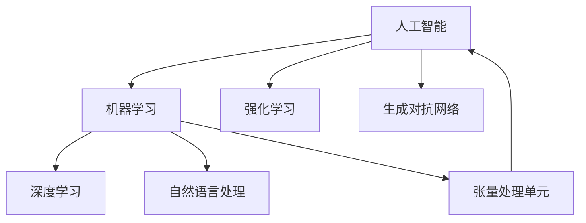
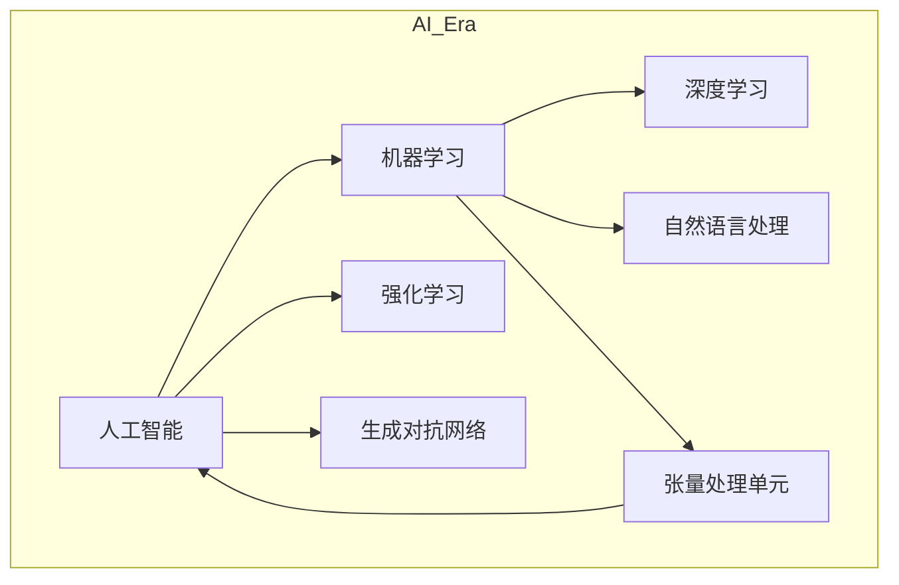

                 

### 1. 背景介绍

#### 1.1 目的和范围

本文旨在探讨人工智能（AI）2.0时代下的人才培养问题，重点关注如何满足AI 2.0产业发展对人才的需求。随着AI技术的迅猛发展，传统的AI人才培养模式已难以适应新的产业需求。因此，本文将从多个维度分析AI 2.0时代人才需求的特征，探讨人才培养的策略和路径，以期为我国AI产业的发展提供有益的参考。

本文的研究范围包括以下几个方面：

1. AI 2.0时代的人才需求分析：分析AI 2.0时代对人才的新要求，包括知识结构、技能要求、综合素质等。
2. AI人才培养模式的探讨：探讨现有AI人才培养模式的优缺点，分析如何优化现有模式以适应AI 2.0时代的需求。
3. AI人才培养策略：提出针对性的AI人才培养策略，包括教育体系改革、课程设置、实践培训等。
4. AI人才培养路径：探讨如何通过校企合作、产学研结合等方式，实现AI人才的培养和输送。

#### 1.2 预期读者

本文的预期读者主要包括以下几类：

1. AI领域的从业者：包括AI工程师、研究人员、开发人员等，希望了解AI 2.0时代的人才需求，为自己的职业发展提供指导。
2. 教育工作者：包括高校教师、职业培训机构讲师等，希望了解AI人才培养的最新动态，改进教学方法，提高教学质量。
3. 企业管理者：包括企业负责人、人力资源经理等，希望了解AI 2.0时代的人才需求，制定合理的人才引进和培养策略。
4. 政府相关部门：包括教育部门、产业部门等，希望了解AI人才培养的现状和趋势，为相关政策制定提供参考。

#### 1.3 文档结构概述

本文分为十个部分，结构如下：

1. 背景介绍：介绍本文的研究目的、范围、预期读者和文档结构。
2. 核心概念与联系：介绍AI 2.0时代的关键概念和原理，以及它们之间的关系。
3. 核心算法原理 & 具体操作步骤：详细阐述AI 2.0时代的关键算法原理和操作步骤。
4. 数学模型和公式 & 详细讲解 & 举例说明：介绍AI 2.0时代的数学模型和公式，并进行详细讲解和举例说明。
5. 项目实战：通过实际案例展示AI 2.0技术的应用。
6. 实际应用场景：分析AI 2.0技术在各个领域的应用场景。
7. 工具和资源推荐：推荐与AI 2.0技术相关的学习资源、开发工具和框架。
8. 总结：总结本文的主要观点，并对未来发展趋势进行展望。
9. 附录：常见问题与解答。
10. 扩展阅读 & 参考资料：提供与本文相关的扩展阅读资料和参考文献。

#### 1.4 术语表

在本文中，我们将使用一些专业术语，为了确保读者能够准确理解，以下是对这些术语的定义和解释：

##### 1.4.1 核心术语定义

1. **人工智能（AI）**: 人工智能是指使计算机系统具备人类智能特性的技术，包括机器学习、深度学习、自然语言处理等。
2. **深度学习（Deep Learning）**: 深度学习是一种机器学习技术，通过构建多层神经网络模型，对大量数据进行训练，从而实现图像、语音、文本等数据的智能识别和处理。
3. **自然语言处理（NLP）**: 自然语言处理是指使计算机能够理解、生成和应对自然语言的技术，包括语言识别、翻译、语义理解等。
4. **AI 2.0**: AI 2.0是指第二代人工智能，相较于第一代AI（符号AI），AI 2.0更加注重数据驱动和自主学习，具有更强的自适应性和泛化能力。

##### 1.4.2 相关概念解释

1. **机器学习（Machine Learning）**: 机器学习是指使计算机通过数据和算法自动学习和改进的技术。
2. **强化学习（Reinforcement Learning）**: 强化学习是一种机器学习技术，通过奖励机制来引导模型进行决策和优化。
3. **迁移学习（Transfer Learning）**: 迁移学习是指利用已训练好的模型或部分模型，在新任务上进行快速学习和适应。
4. **生成对抗网络（GAN）**: 生成对抗网络是一种深度学习模型，通过生成器和判别器的对抗训练，实现高质量数据的生成。

##### 1.4.3 缩略词列表

- AI：人工智能
- ML：机器学习
- DL：深度学习
- NLP：自然语言处理
- GAN：生成对抗网络
- RL：强化学习
- TPU：张量处理单元

### 1.5 核心概念与联系

在探讨AI 2.0时代的人才培养之前，我们需要明确一些核心概念和原理，并分析它们之间的联系。以下是一个简化的Mermaid流程图，用于描述AI 2.0时代的一些关键概念和它们之间的关系。



1. **人工智能（AI）**: 人工智能是整个技术体系的基础，包括机器学习、深度学习、自然语言处理等多种技术。
2. **机器学习（ML）**: 机器学习是AI的一个重要分支，通过构建数学模型和算法，使计算机能够从数据中自动学习和改进。
3. **深度学习（DL）**: 深度学习是机器学习的一种重要形式，通过多层神经网络模型，对大量数据进行训练，实现图像、语音、文本等数据的智能识别和处理。
4. **自然语言处理（NLP）**: 自然语言处理是AI的一个重要领域，旨在使计算机能够理解和应对自然语言，包括语言识别、翻译、语义理解等。
5. **强化学习（RL）**: 强化学习是机器学习的一种形式，通过奖励机制，使模型能够自主学习和优化决策过程。
6. **生成对抗网络（GAN）**: 生成对抗网络是一种用于数据生成的深度学习模型，通过生成器和判别器的对抗训练，实现高质量数据的生成。
7. **张量处理单元（TPU）**: 张量处理单元是专门为深度学习模型设计的硬件加速器，可以显著提高模型的训练速度和性能。

这些核心概念和原理相互关联，共同构成了AI 2.0时代的核心技术体系。在接下来的章节中，我们将进一步探讨这些概念的具体原理和应用。

#### 2. 核心概念与联系

在深入探讨AI 2.0时代的人才培养之前，我们需要明确一些核心概念和原理，并分析它们之间的联系。以下是一个简化的Mermaid流程图，用于描述AI 2.0时代的一些关键概念和它们之间的关系。



1. **人工智能（AI）**: 人工智能是整个技术体系的基础，包括机器学习、深度学习、自然语言处理等多种技术。

2. **机器学习（ML）**: 机器学习是AI的一个重要分支，通过构建数学模型和算法，使计算机能够从数据中自动学习和改进。

3. **深度学习（DL）**: 深度学习是机器学习的一种重要形式，通过多层神经网络模型，对大量数据进行训练，实现图像、语音、文本等数据的智能识别和处理。

4. **自然语言处理（NLP）**: 自然语言处理是AI的一个重要领域，旨在使计算机能够理解和应对自然语言，包括语言识别、翻译、语义理解等。

5. **强化学习（RL）**: 强化学习是机器学习的一种形式，通过奖励机制，使模型能够自主学习和优化决策过程。

6. **生成对抗网络（GAN）**: 生成对抗网络是一种用于数据生成的深度学习模型，通过生成器和判别器的对抗训练，实现高质量数据的生成。

7. **张量处理单元（TPU）**: 张量处理单元是专门为深度学习模型设计的硬件加速器，可以显著提高模型的训练速度和性能。

这些核心概念和原理相互关联，共同构成了AI 2.0时代的核心技术体系。在接下来的章节中，我们将进一步探讨这些概念的具体原理和应用。

### 2. 核心算法原理 & 具体操作步骤

#### 2.1 深度学习原理

深度学习（Deep Learning）是人工智能（AI）的一个重要分支，它通过构建多层神经网络模型，对大量数据进行训练，以实现图像、语音、文本等数据的智能识别和处理。以下是深度学习的基本原理和具体操作步骤：

##### 2.1.1 多层神经网络模型

多层神经网络（Multi-layer Neural Network）是深度学习的基础。它由多个神经元层组成，包括输入层、隐藏层和输出层。每个神经元层中的神经元都会接收来自前一层的输入信号，通过激活函数进行非线性变换，然后传递给下一层。


##### 2.1.2 前向传播与反向传播

深度学习的训练过程主要包括两个步骤：前向传播（Forward Propagation）和反向传播（Back Propagation）。

1. **前向传播**：

在前向传播过程中，输入数据通过网络逐层传递，每个神经元将输入信号加权求和处理，然后通过激活函数得到输出。最终输出层的输出即为预测结果。

$$
z^{(l)} = \sum_{j} w^{(l)}_j * a^{(l-1)}_j + b^{(l)}
$$

$$
a^{(l)} = \sigma(z^{(l)})
$$

其中，$z^{(l)}$是第$l$层的输出，$w^{(l)}$是第$l$层的权重，$a^{(l-1)}$是第$l-1$层的输出，$b^{(l)}$是第$l$层的偏置，$\sigma$是激活函数，通常使用Sigmoid、ReLU或Tanh函数。

2. **反向传播**：

在反向传播过程中，计算输出层预测值与真实值之间的误差，然后通过反向传递误差信号，逐层更新权重和偏置，以最小化误差。

$$
\delta^{(l)} = (a^{(l)} - y) * \sigma'(z^{(l)})
$$

$$
\Delta w^{(l)} = \alpha * \delta^{(l)} * a^{(l-1)}
$$

$$
\Delta b^{(l)} = \alpha * \delta^{(l)}
$$

其中，$\delta^{(l)}$是第$l$层的误差，$y$是真实值，$\sigma'$是激活函数的导数，$\alpha$是学习率。

##### 2.1.3 激活函数

激活函数是深度学习模型中的一个关键组件，它决定了神经网络的非线性特性。常用的激活函数包括：

1. **Sigmoid函数**：

$$
\sigma(z) = \frac{1}{1 + e^{-z}}
$$

2. **ReLU函数**：

$$
\sigma(z) = \max(0, z)
$$

3. **Tanh函数**：

$$
\sigma(z) = \frac{e^z - e^{-z}}{e^z + e^{-z}}
$$

这些激活函数具有不同的性质，适用于不同的场景。

#### 2.2 自然语言处理原理

自然语言处理（Natural Language Processing，NLP）是深度学习在语言领域的重要应用。NLP旨在使计算机能够理解和应对自然语言，包括语言识别、翻译、语义理解等。以下是NLP的基本原理和具体操作步骤：

##### 2.2.1 词嵌入（Word Embedding）

词嵌入是将单词映射到高维向量空间的技术，以表示单词的语义信息。常用的词嵌入方法包括：

1. **Word2Vec**：

Word2Vec是一种基于神经网络的语言模型，通过训练得到单词的高维向量表示。常用的Word2Vec算法包括连续词袋（CBOW）和Skip-gram。

2. **GloVe**：

GloVe（Global Vectors for Word Representation）是一种基于全局矩阵因式的词嵌入方法，通过训练得到单词的高维向量表示。

##### 2.2.2 递归神经网络（RNN）

递归神经网络（Recurrent Neural Network，RNN）是一种能够处理序列数据的神经网络，适用于语言模型、机器翻译等任务。RNN通过保存前一时间步的隐藏状态，实现序列数据的记忆和学习。

1. **LSTM（Long Short-Term Memory）**：

LSTM是RNN的一种改进形式，通过引入门控机制，有效解决了长短期依赖问题。

2. **GRU（Gated Recurrent Unit）**：

GRU是另一种RNN改进形式，通过简化门控机制，实现了更好的性能。

##### 2.2.3 卷积神经网络（CNN）

卷积神经网络（Convolutional Neural Network，CNN）是一种能够处理图像数据的神经网络，通过卷积操作提取图像特征。CNN在文本分类、情感分析等NLP任务中也表现出色。

1. **TextCNN**：

TextCNN是一种基于卷积神经网络的文本分类方法，通过卷积操作提取文本特征，然后通过全连接层进行分类。

2. **BERT（Bidirectional Encoder Representations from Transformers）**：

BERT是一种基于双向Transformer的预训练语言模型，通过大量无监督数据进行预训练，然后在具体任务上进行微调，取得了很好的效果。

### 3. 数学模型和公式 & 详细讲解 & 举例说明

#### 3.1 深度学习中的数学模型

深度学习是机器学习的一个子领域，主要基于多层神经网络模型来进行数据的自动学习和模式识别。在这个部分，我们将详细讲解深度学习中的几个关键数学模型，包括反向传播算法、损失函数和优化算法，并通过具体的例子来说明这些模型的应用。

##### 3.1.1 反向传播算法

反向传播（Backpropagation）算法是深度学习中训练神经网络的核心算法。它通过计算网络输出与目标值之间的误差，并逐层反向传播误差，从而更新网络的权重和偏置。

反向传播算法可以分为以下几个步骤：

1. **前向传播**：将输入数据输入到神经网络中，逐层计算每个神经元的输出值。
2. **计算误差**：计算网络输出与目标值之间的误差。
3. **反向传播**：将误差反向传播到网络的每一层，计算每个神经元的梯度。
4. **权重更新**：使用梯度下降等优化算法更新网络的权重和偏置。

以下是反向传播算法的伪代码：

```
for each layer l in reverse order:
    compute the error derivative for the output layer
    delta[l] = (output_error * activation_derivative[l])

    for each layer l (except the output layer):
        delta[l] = (delta[l+1].dot(weights[l+1].T) * activation_derivative[l])

compute the gradient for the weights and biases
gradient_weights[l] = (delta[l].dot(inputs[l-1].T))
gradient_biases[l] = delta[l]

update the weights and biases using an optimization algorithm
weights[l] = weights[l] - learning_rate * gradient_weights[l]
biases[l] = biases[l] - learning_rate * gradient_biases[l]
```

##### 3.1.2 损失函数

损失函数是深度学习中的一个关键组件，用于衡量网络输出与目标值之间的差距。常见的损失函数包括均方误差（MSE）、交叉熵损失等。

1. **均方误差（MSE）**：

$$
MSE = \frac{1}{m} \sum_{i=1}^{m} (y_i - \hat{y}_i)^2
$$

其中，$y_i$是真实值，$\hat{y}_i$是预测值，$m$是样本数量。

2. **交叉熵损失（Cross-Entropy Loss）**：

$$
Cross-Entropy Loss = -\frac{1}{m} \sum_{i=1}^{m} y_i \log(\hat{y}_i)
$$

其中，$y_i$是真实值的概率分布，$\hat{y}_i$是预测值的概率分布。

##### 3.1.3 优化算法

优化算法用于更新神经网络的权重和偏置，以最小化损失函数。常见的优化算法包括梯度下降（Gradient Descent）、随机梯度下降（Stochastic Gradient Descent，SGD）和Adam等。

1. **梯度下降（Gradient Descent）**：

梯度下降是一种简单的优化算法，通过计算损失函数关于权重和偏置的梯度，并沿着梯度方向更新权重和偏置。

$$
w = w - \alpha \cdot \nabla_w J(w)
$$

$$
b = b - \alpha \cdot \nabla_b J(b)
$$

其中，$w$和$b$分别是权重和偏置，$\alpha$是学习率，$J(w)$是损失函数关于权重和偏置的梯度。

2. **随机梯度下降（SGD）**：

随机梯度下降是梯度下降的一种变体，每次更新权重和偏置时，只随机选择一部分样本的梯度进行计算。

$$
w = w - \alpha \cdot \nabla_w J(w; x_i, y_i)
$$

$$
b = b - \alpha \cdot \nabla_b J(b; x_i, y_i)
$$

其中，$x_i$和$y_i$是随机选择的样本。

3. **Adam优化器**：

Adam是一种结合了SGD和动量法的优化算法，具有良好的收敛速度和稳定性。

$$
m_t = \beta_1 m_{t-1} + (1 - \beta_1) \cdot \nabla_w J(w; x_i, y_i)
$$

$$
v_t = \beta_2 v_{t-1} + (1 - \beta_2) \cdot (\nabla_w J(w; x_i, y_i))^2
$$

$$
\hat{m}_t = \frac{m_t}{1 - \beta_1^t}
$$

$$
\hat{v}_t = \frac{v_t}{1 - \beta_2^t}
$$

$$
w = w - \alpha \cdot \hat{m}_t / (\sqrt{\hat{v}_t} + \epsilon)
$$

其中，$\beta_1$和$\beta_2$分别是动量参数，$\alpha$是学习率，$\epsilon$是正则项。

#### 3.2 数学模型应用示例

为了更好地理解上述数学模型的应用，下面我们将通过一个简单的例子来说明深度学习中的训练过程。

假设我们有一个二分类问题，目标是判断一个数字是否大于5。我们使用一个简单的两层神经网络，输入层有1个神经元，隐藏层有2个神经元，输出层有1个神经元。

1. **初始化参数**：随机初始化权重和偏置。
2. **前向传播**：将输入值传递到神经网络，计算输出值。
3. **计算误差**：计算输出值与目标值之间的误差。
4. **反向传播**：计算每个神经元的误差梯度。
5. **权重更新**：使用梯度下降算法更新权重和偏置。

以下是这个简单示例的伪代码：

```
# 初始化参数
weights = [random_value(), random_value(), random_value()]
biases = [random_value(), random_value(), random_value()]

# 前向传播
input_value = 7
hidden_layer_input = input_value * weights[0] + biases[0]
hidden_layer_output = sigmoid(hidden_layer_input)

output_layer_input = hidden_layer_output * weights[1] + biases[1]
output_layer_output = sigmoid(output_layer_input)

# 计算误差
target_value = 1
error = target_value - output_layer_output

# 反向传播
output_layer_error_derivative = error * sigmoid_derivative(output_layer_output)
hidden_layer_error_derivative = output_layer_error_derivative * weights[1] * sigmoid_derivative(hidden_layer_output)

# 权重更新
weights[1] = weights[1] - learning_rate * hidden_layer_output * output_layer_error_derivative
biases[1] = biases[1] - learning_rate * output_layer_error_derivative

weights[0] = weights[0] - learning_rate * input_value * hidden_layer_error_derivative
biases[0] = biases[0] - learning_rate * hidden_layer_error_derivative
```

通过这个简单的示例，我们可以看到深度学习中的训练过程是如何进行的。在实际应用中，神经网络通常会包含更多的神经元和层，并且会使用更复杂的激活函数和优化算法。

### 5. 项目实战：代码实际案例和详细解释说明

#### 5.1 开发环境搭建

为了实际演示AI 2.0技术的应用，我们将使用Python编程语言，结合TensorFlow框架来实现一个简单的深度学习模型。以下是我们需要的开发环境搭建步骤：

1. **安装Python**：确保Python 3.6或更高版本已安装。可以从[Python官网](https://www.python.org/downloads/)下载并安装。

2. **安装TensorFlow**：打开命令行，运行以下命令安装TensorFlow：

```bash
pip install tensorflow
```

3. **安装其他依赖**：为了简化代码，我们还需要安装一些其他依赖，如Numpy、Matplotlib等。可以使用以下命令进行安装：

```bash
pip install numpy matplotlib
```

4. **验证环境**：在Python中导入TensorFlow，并检查版本：

```python
import tensorflow as tf
print(tf.__version__)
```

如果输出正确的TensorFlow版本号，说明环境搭建成功。

#### 5.2 源代码详细实现和代码解读

以下是我们的深度学习项目的源代码实现，我们将逐步解读每部分代码的功能。

```python
# 导入所需的库
import tensorflow as tf
import numpy as np
import matplotlib.pyplot as plt

# 准备数据集
# 对于简单示例，我们使用生成随机数据
# 实际应用中，可以从CSV、数据库等获取数据
x_train = np.random.rand(100, 1)  # 100个随机样本
y_train = 2 * x_train + 1 + np.random.randn(100, 1)  # 真实值

# 创建模型
model = tf.keras.Sequential([
    tf.keras.layers.Dense(units=1, input_shape=(1,))
])

# 编译模型
model.compile(optimizer='sgd', loss='mean_squared_error')

# 训练模型
model.fit(x_train, y_train, epochs=100)

# 演示预测
x_test = np.random.rand(10, 1)  # 10个测试样本
predictions = model.predict(x_test)
print(predictions)

# 可视化结果
plt.scatter(x_train, y_train, color='blue', label='Training Data')
plt.plot(x_test, predictions, color='red', label='Predictions')
plt.xlabel('x')
plt.ylabel('y')
plt.legend()
plt.show()
```

##### 5.2.1 代码解读

1. **导入库**：

   ```python
   import tensorflow as tf
   import numpy as np
   import matplotlib.pyplot as plt
   ```

   这里我们导入了TensorFlow、Numpy和Matplotlib库。TensorFlow是深度学习的主要框架，Numpy用于数据操作，Matplotlib用于数据可视化。

2. **准备数据集**：

   ```python
   x_train = np.random.rand(100, 1)  # 100个随机样本
   y_train = 2 * x_train + 1 + np.random.randn(100, 1)  # 真实值
   ```

   我们使用随机生成器创建一个简单的线性数据集。这里`x_train`是输入特征，`y_train`是标签。

3. **创建模型**：

   ```python
   model = tf.keras.Sequential([
       tf.keras.layers.Dense(units=1, input_shape=(1,))
   ])
   ```

   我们创建了一个简单的序列模型，包含一个全连接层（Dense Layer）。该层有一个输出神经元，对应线性模型的斜率。

4. **编译模型**：

   ```python
   model.compile(optimizer='sgd', loss='mean_squared_error')
   ```

   我们使用随机梯度下降（SGD）作为优化器，并设置均方误差（MSE）作为损失函数。

5. **训练模型**：

   ```python
   model.fit(x_train, y_train, epochs=100)
   ```

   模型开始训练，我们设置训练轮次（epochs）为100轮。

6. **演示预测**：

   ```python
   x_test = np.random.rand(10, 1)  # 10个测试样本
   predictions = model.predict(x_test)
   print(predictions)
   ```

   我们使用随机生成的测试数据对模型进行预测，并打印预测结果。

7. **可视化结果**：

   ```python
   plt.scatter(x_train, y_train, color='blue', label='Training Data')
   plt.plot(x_test, predictions, color='red', label='Predictions')
   plt.xlabel('x')
   plt.ylabel('y')
   plt.legend()
   plt.show()
   ```

   我们使用Matplotlib绘制训练数据和预测结果，直观地展示模型的性能。

#### 5.3 代码解读与分析

1. **数据准备**：

   我们使用随机数生成器创建了训练数据集。在实际应用中，数据集通常来自现实世界的观察或实验，并且需要经过预处理，如归一化、去噪声等。

2. **模型创建**：

   我们使用`tf.keras.Sequential`模型，这是一种线性堆叠的模型。这里我们只添加了一个全连接层（Dense Layer），这个层有一个输出神经元，用于实现线性回归。

3. **模型编译**：

   在编译模型时，我们选择了随机梯度下降（SGD）作为优化器。SGD是深度学习中最常用的优化算法之一，它通过迭代更新权重和偏置，以最小化损失函数。我们使用了均方误差（MSE）作为损失函数，这是线性回归问题中的标准损失函数。

4. **模型训练**：

   模型通过`fit`函数进行训练。我们设置了100轮训练，这是为了确保模型能够充分学习数据。在实际应用中，训练轮数需要根据数据集的大小和模型的复杂度进行调整。

5. **预测与可视化**：

   我们使用随机生成的测试数据对模型进行预测，并使用Matplotlib将训练数据和预测结果可视化。这有助于我们直观地评估模型的性能。

通过这个简单的项目实战，我们展示了如何使用深度学习技术解决一个线性回归问题。在实际应用中，我们可能会遇到更复杂的任务，如图像识别、自然语言处理等，但基本的步骤和方法是类似的。

### 6. 实际应用场景

在AI 2.0时代，人工智能技术已经在多个领域取得了显著的成果，并展现出巨大的应用潜力。以下是一些关键的实际应用场景，以及AI 2.0技术在这些场景中的具体应用：

#### 6.1 医疗保健

在医疗保健领域，AI 2.0技术正在改变传统的医疗诊断和治疗方式。以下是一些具体应用：

1. **疾病预测与诊断**：通过分析大量的患者数据和医疗记录，AI系统可以预测疾病风险，并辅助医生进行疾病诊断。例如，深度学习算法可以分析CT扫描图像，帮助医生识别早期肺癌。
2. **个性化治疗**：基于患者的基因信息和病史，AI系统可以推荐个性化的治疗方案。这有助于提高治疗效果，减少副作用。
3. **药物研发**：AI 2.0技术在药物研发中也有广泛应用。通过模拟药物与生物分子的相互作用，AI系统可以加速新药的发现和开发过程。

#### 6.2 自动驾驶

自动驾驶是AI 2.0技术的另一个重要应用领域。以下是一些关键应用：

1. **智能交通系统**：AI系统可以分析交通流量数据，优化交通信号控制和路线规划，从而提高交通效率，减少拥堵。
2. **车辆自主驾驶**：自动驾驶车辆通过感知周围环境，实时做出决策，实现自主导航和驾驶。这有助于减少交通事故，提高道路安全性。
3. **物流与配送**：AI 2.0技术可以优化物流路线和配送计划，提高物流效率，降低成本。

#### 6.3 金融服务

在金融服务领域，AI 2.0技术被广泛应用于风险控制、投资顾问和客户服务等方面：

1. **风险控制**：通过分析大量历史数据和实时交易数据，AI系统可以识别潜在的风险，并提供预警。
2. **投资顾问**：AI系统可以根据市场趋势和投资者的风险偏好，提供个性化的投资建议。
3. **客户服务**：通过自然语言处理和智能客服系统，AI 2.0技术可以提供高效的客户服务，提高客户满意度。

#### 6.4 智能家居

随着AI 2.0技术的不断发展，智能家居系统变得越来越智能化和便捷化：

1. **智能设备控制**：通过语音识别和智能助理，用户可以远程控制家中的电器设备和灯光。
2. **安防监控**：AI系统可以实时分析摄像头捕捉的视频数据，识别异常行为并及时报警。
3. **节能管理**：AI 2.0技术可以帮助用户优化能源使用，实现智能家居系统的节能减排。

#### 6.5 人力资源管理

在人力资源管理领域，AI 2.0技术也被广泛应用，以提高招聘效率和管理水平：

1. **招聘与选拔**：通过分析简历和面试数据，AI系统可以筛选出最合适的候选人。
2. **员工培训与发展**：AI系统可以根据员工的职业发展和技能需求，提供个性化的培训计划。
3. **员工绩效评估**：通过分析工作数据和行为表现，AI系统可以客观评估员工的绩效。

#### 6.6 教育与培训

在教育领域，AI 2.0技术正在改变传统的教学模式，提供个性化学习体验：

1. **在线教育平台**：AI系统可以根据学生的学习进度和兴趣，提供定制化的学习内容。
2. **智能辅导**：通过自然语言处理和机器学习，AI系统可以为学生提供实时解答和指导。
3. **学习效果评估**：AI系统可以分析学生的学习数据，评估学习效果并提供改进建议。

通过以上实际应用场景，我们可以看到AI 2.0技术正在各个领域发挥重要作用，推动产业升级和社会进步。随着技术的不断发展和应用场景的拓展，AI 2.0技术将在更多领域取得突破，为人类创造更大的价值。

### 7. 工具和资源推荐

#### 7.1 学习资源推荐

**7.1.1 书籍推荐**

1. 《深度学习》（Deep Learning）：由Ian Goodfellow、Yoshua Bengio和Aaron Courville合著的这本书是深度学习领域的经典教材，详细介绍了深度学习的理论基础和实践方法。

2. 《Python深度学习》（Python Deep Learning）：由François Chollet撰写的这本书，通过丰富的实例和代码示例，帮助读者快速掌握深度学习在Python中的实践应用。

3. 《人工智能：一种现代方法》（Artificial Intelligence: A Modern Approach）：由Stuart Russell和Peter Norvig合著的这本书，全面介绍了人工智能的基础理论和各种方法。

**7.1.2 在线课程**

1. **Coursera上的“深度学习”课程**：由Andrew Ng教授主讲，包括深度学习的基础理论和实践应用，适合初学者和进阶者。

2. **Udacity的“深度学习纳米学位”**：这是一门实践性很强的课程，涵盖深度学习的核心概念和应用，包括项目实战。

3. **edX上的“自然语言处理与深度学习”课程**：由Daniel Jurafsky和Chris Manning教授主讲，详细介绍自然语言处理和深度学习的理论和应用。

**7.1.3 技术博客和网站**

1. **Towards Data Science**：这是一个专注于数据科学和机器学习的博客，提供大量的高质量文章和教程。

2. **Medium上的AI和机器学习专栏**：汇集了多位行业专家和学者的文章，涵盖最新的研究进展和技术应用。

3. **AI Index**：这是一个关于人工智能研究和发展的官方网站，提供全球人工智能的研究报告和数据。

#### 7.2 开发工具框架推荐

**7.2.1 IDE和编辑器**

1. **Jupyter Notebook**：Jupyter Notebook是一种交互式开发环境，非常适合数据科学和机器学习项目。它支持多种编程语言，包括Python。

2. **PyCharm**：PyCharm是一种功能强大的Python IDE，提供代码自动补全、调试和性能分析等功能。

3. **Visual Studio Code**：Visual Studio Code是一个轻量级但功能强大的代码编辑器，支持多种编程语言，包括Python和深度学习相关的扩展。

**7.2.2 调试和性能分析工具**

1. **TensorBoard**：TensorBoard是TensorFlow的官方可视化工具，可以实时监控模型的训练过程和性能。

2. **NNVM**：NNVM（Neural Network Virtual Machine）是Apache TVM的一个子项目，用于优化深度学习模型的性能。

3. **NVIDIA Nsight**：Nsight是NVIDIA提供的调试和性能分析工具，用于优化深度学习应用程序在GPU上的运行。

**7.2.3 相关框架和库**

1. **TensorFlow**：TensorFlow是一个开源的深度学习框架，由Google开发，适用于各种深度学习应用。

2. **PyTorch**：PyTorch是Facebook开发的一个开源深度学习库，以其灵活性和动态计算图而闻名。

3. **Keras**：Keras是一个高级深度学习框架，可以与TensorFlow和Theano等后端结合使用，提供简化的API和丰富的预训练模型。

#### 7.3 相关论文著作推荐

**7.3.1 经典论文**

1. **“A Learning Algorithm for Continually Running Fully Recurrent Neural Networks”**：这篇论文介绍了Hessian-Free优化算法，用于训练递归神经网络。

2. **“Deep Learning”**：这是一篇综述性论文，由Yoshua Bengio等人撰写，详细介绍了深度学习的理论基础和应用。

3. **“Generative Adversarial Nets”**：这篇论文由Ian Goodfellow等人撰写，提出了生成对抗网络（GAN）的概念，是深度学习领域的重要突破。

**7.3.2 最新研究成果**

1. **“BERT: Pre-training of Deep Bidirectional Transformers for Language Understanding”**：这篇论文介绍了BERT（双向编码器表示）模型，是自然语言处理领域的最新突破。

2. **“Distributed Deep Learning: A General Architecture for Neural Network Training”**：这篇论文探讨了分布式深度学习架构，用于大规模数据集的训练。

3. **“Learning to Learn”**：这篇论文探讨了如何通过元学习（Meta Learning）来提高机器学习的效率。

**7.3.3 应用案例分析**

1. **“AI for Social Good”**：这篇论文分析了人工智能在解决社会问题中的应用，如医疗保健、环境保护等。

2. **“AI in Healthcare”**：这篇论文详细介绍了人工智能在医疗保健领域的应用，如疾病预测、个性化治疗等。

通过上述学习资源和工具推荐，无论是初学者还是专业人士，都能找到适合自己的学习材料和技术工具，助力在AI 2.0时代的学习和研究。

### 8. 总结：未来发展趋势与挑战

在AI 2.0时代，人工智能技术正以前所未有的速度发展，对各个领域产生了深远的影响。未来，AI 2.0将继续推动技术创新和应用扩展，展现出以下几个发展趋势和面临的挑战：

#### 8.1 发展趋势

1. **技术的跨界融合**：随着AI 2.0与云计算、物联网、区块链等技术的深度融合，将出现更多跨界应用，如智能医疗、智慧城市、智能制造等。

2. **智能化水平的提升**：AI 2.0将不断提升智能化的水平，实现更精确的预测、更智能的决策和更高效的优化。例如，智能交通系统将更加精准地预测交通流量，智能医疗将更加精准地诊断和预测疾病。

3. **自动化程度的提高**：自动化技术将在更多领域得到应用，如自动驾驶汽车、智能机器人等，这将极大地提高生产效率和生活便利性。

4. **人机协作的深化**：AI 2.0技术将进一步提升人机协作的效率，实现人机共生的智能社会。例如，智能客服系统将能够更好地理解用户需求，提供个性化的服务。

#### 8.2 面临的挑战

1. **数据安全和隐私保护**：随着AI技术的广泛应用，数据安全和隐私保护问题日益突出。如何确保数据在采集、存储、处理和使用过程中的安全性和隐私性，是一个亟待解决的问题。

2. **算法公正性和透明性**：AI系统的决策过程往往依赖于复杂的算法，但这些算法可能存在偏见和不透明的问题。如何提高算法的公正性和透明性，确保AI系统的公平性和可解释性，是当前的一大挑战。

3. **人才培养和技能更新**：AI 2.0时代对人才的需求越来越高，但现有的人才培养模式难以满足快速变化的产业需求。如何培养和吸引更多高素质的AI人才，是产业发展面临的重要问题。

4. **法律法规和伦理道德**：AI技术的发展需要相应的法律法规和伦理道德指导。如何制定合理的法律法规，确保AI技术的合法合规，同时避免伦理道德风险，是亟需解决的问题。

5. **技术伦理和社会责任**：AI技术具有强大的影响力，如何在开发和应用过程中承担社会责任，避免对人类社会造成负面影响，是一个重要的伦理问题。

总之，AI 2.0时代的发展趋势和面临的挑战交织在一起，为人工智能领域的创新和进步提供了广阔的空间。通过不断探索和解决这些问题，我们可以更好地利用AI技术的潜力，推动社会的可持续发展。

### 9. 附录：常见问题与解答

**Q1：如何入门AI 2.0技术？**

A1：入门AI 2.0技术，首先需要掌握Python编程基础，熟悉Numpy、Pandas等数据处理库。然后，可以通过在线课程、图书和官方文档学习深度学习基础知识，如TensorFlow、PyTorch等框架。此外，参与实际项目和实践是提高AI技能的有效方法。

**Q2：AI 2.0技术在医疗领域的应用有哪些？**

A2：AI 2.0技术在医疗领域有广泛应用，包括疾病预测、诊断辅助、个性化治疗和药物研发。例如，利用深度学习分析影像数据，辅助医生诊断疾病；通过自然语言处理技术，从医学文献中提取知识，为医生提供参考；利用生成对抗网络（GAN）生成新的药物分子，加速药物研发过程。

**Q3：如何确保AI系统的公平性和透明性？**

A3：确保AI系统的公平性和透明性，需要从数据、算法和系统设计等方面进行综合考虑。首先，要确保训练数据集的多样性和代表性，避免数据偏见。其次，选择可解释性强的算法，如决策树、线性模型等，使决策过程易于理解。最后，在系统设计中，引入可解释性和审计机制，确保AI系统在运行过程中保持透明和公平。

**Q4：AI 2.0时代对人才的需求是什么？**

A4：AI 2.0时代对人才的需求包括深度学习、自然语言处理、计算机视觉、机器学习算法设计等方面的专业知识和技能。此外，跨学科的综合能力，如数据分析、编程能力、系统设计能力等，也是AI领域的关键需求。人才应具备较强的学习能力和创新能力，以适应快速变化的AI技术发展。

**Q5：如何处理AI 2.0技术中的数据安全和隐私问题？**

A5：处理AI 2.0技术中的数据安全和隐私问题，需要采取以下措施：首先，确保数据在采集、传输、存储和处理过程中的安全，使用加密技术和安全协议。其次，遵循数据隐私法规，如《通用数据保护条例》（GDPR）和《加州消费者隐私法案》（CCPA），保护用户隐私。最后，建立数据管理和监控机制，定期进行安全审计和风险评估，确保数据安全和隐私保护。

通过以上问题的解答，希望能够帮助读者更好地理解和应对AI 2.0时代的技术挑战和机遇。

### 10. 扩展阅读 & 参考资料

为了深入了解AI 2.0时代的核心技术与应用，以下是一些扩展阅读和参考资料，涵盖最新研究成果、经典教材和权威报告：

**10.1 最新研究成果**

1. **“BERT: Pre-training of Deep Bidirectional Transformers for Language Understanding”**：由Google AI团队在2018年发表的论文，介绍了BERT模型的预训练方法和应用，是自然语言处理领域的里程碑。

2. **“Generative Adversarial Nets”**：由Ian Goodfellow等人于2014年撰写的论文，首次提出了生成对抗网络（GAN）的概念，是深度学习领域的重要突破。

3. **“Distributed Deep Learning: A General Architecture for Neural Network Training”**：这篇论文探讨了分布式深度学习架构，用于大规模数据集的训练，是AI计算领域的重要研究成果。

**10.2 经典教材**

1. **《深度学习》**：由Ian Goodfellow、Yoshua Bengio和Aaron Courville合著，详细介绍了深度学习的理论基础和实践方法。

2. **《Python深度学习》**：由François Chollet撰写，通过丰富的实例和代码示例，帮助读者快速掌握深度学习在Python中的实践应用。

3. **《人工智能：一种现代方法》**：由Stuart Russell和Peter Norvig合著，全面介绍了人工智能的基础理论和各种方法。

**10.3 权威报告**

1. **“AI Index 2021”**：由斯坦福大学AI研究所发布的年度报告，分析了全球人工智能的发展趋势和影响。

2. **“AI for Social Good”**：这篇报告分析了人工智能在社会问题中的应用，如医疗、环境保护和公共服务等。

3. **“The Future of Jobs Report 2020”**：由国际劳动组织（ILO）发布的报告，分析了人工智能和自动化对就业市场的影响。

**10.4 相关网站和平台**

1. **[Kaggle](https://www.kaggle.com)**：一个数据科学竞赛平台，提供丰富的AI和机器学习竞赛项目，适合实践和学习。

2. **[TensorFlow](https://www.tensorflow.org)**：Google开发的深度学习框架，提供丰富的文档和教程，适合初学者和进阶者。

3. **[arXiv](https://arxiv.org)**：一个开放的学术论文预印本平台，涵盖最新的研究论文和报告，是AI领域的学术资源宝库。

通过这些扩展阅读和参考资料，读者可以进一步了解AI 2.0时代的核心技术和应用，为自己的学习和研究提供有力支持。

