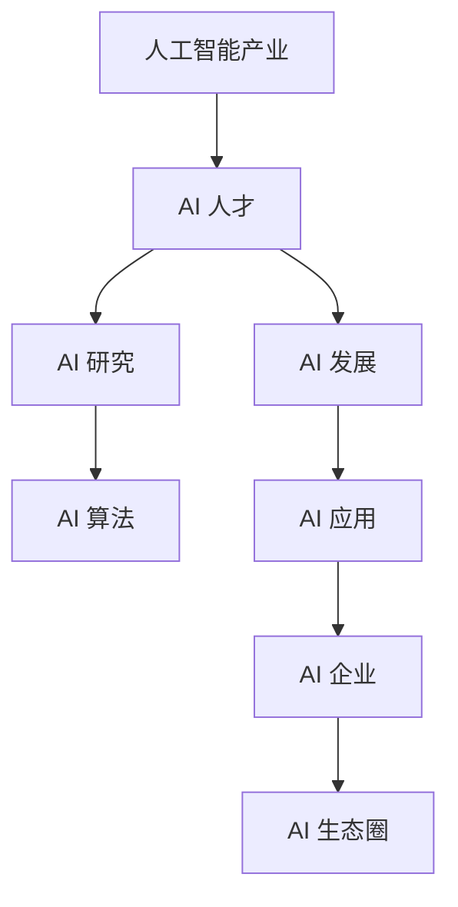

                 

# AI 人才引进：为 AI 2.0 产业发展提供智力支持

> **关键词**：人工智能、人才引进、AI 2.0、产业发展、智力支持

> **摘要**：本文旨在探讨如何通过有效引进 AI 人才，为 AI 2.0 产业的快速发展提供智力支持。文章首先介绍了 AI 人才引进的背景和重要性，然后分析了当前 AI 人才市场的状况，探讨了人才引进的策略和方法，最后提出了未来 AI 人才发展的趋势和挑战，以及为 AI 产业提供智力支持的措施和建议。

## 1. 背景介绍

### 1.1 目的和范围

本文的目的在于为 AI 产业提供一套系统化的 AI 人才引进策略，以促进 AI 2.0 产业的快速发展。本文将涵盖以下内容：

1. AI 人才引进的重要性及背景。
2. 当前 AI 人才市场的状况。
3. 人才引进的策略和方法。
4. 未来 AI 人才发展的趋势和挑战。
5. 为 AI 产业提供智力支持的措施和建议。

### 1.2 预期读者

本文主要面向以下几类读者：

1. 从事 AI 领域研究的学者和研究人员。
2. AI 企业的管理层和人力资源部门。
3. 对 AI 产业感兴趣的技术爱好者。

### 1.3 文档结构概述

本文分为以下几个部分：

1. 背景介绍：介绍文章的目的、预期读者和文档结构。
2. 核心概念与联系：介绍与 AI 人才引进相关的核心概念和架构。
3. 核心算法原理 & 具体操作步骤：详细阐述 AI 人才引进的算法原理和具体操作步骤。
4. 数学模型和公式 & 详细讲解 & 举例说明：介绍 AI 人才引进相关的数学模型和公式，并进行详细讲解和举例。
5. 项目实战：提供 AI 人才引进的实际案例和详细解释。
6. 实际应用场景：讨论 AI 人才引进在实际应用中的场景。
7. 工具和资源推荐：推荐与 AI 人才引进相关的学习资源和开发工具。
8. 总结：总结文章的主要内容和观点，提出未来发展趋势和挑战。
9. 附录：常见问题与解答。
10. 扩展阅读 & 参考资料：提供相关领域的研究文献和参考资料。

### 1.4 术语表

#### 1.4.1 核心术语定义

- **AI 人才**：在人工智能领域具有较高专业素养和实践能力的人才。
- **人才引进**：通过招聘、引进等方式，吸引和留住优秀 AI 人才的过程。
- **AI 2.0**：人工智能的下一阶段发展，强调人机协同、智能自主进化等特性。
- **智力支持**：为 AI 产业提供人才、技术、资金等全方位的支持。

#### 1.4.2 相关概念解释

- **人才竞争**：不同地区、企业之间为了争夺 AI 人才而展开的竞争。
- **产业协同**：不同行业、领域之间的合作与协同，以推动 AI 产业的发展。
- **政策支持**：政府和企业为了促进 AI 产业发展而采取的政策措施。

#### 1.4.3 缩略词列表

- **AI**：人工智能（Artificial Intelligence）
- **Hiring**：招聘
- **R&D**：研究与发展（Research and Development）
- **IP**：知识产权（Intellectual Property）

## 2. 核心概念与联系

在本文中，我们将介绍与 AI 人才引进相关的核心概念和架构。以下是一个简化的 Mermaid 流程图，用于展示这些概念之间的联系。



### 2.1 AI 人才与人工智能产业的关系

AI 人才是人工智能产业发展的核心驱动力。随着 AI 技术的不断进步和应用领域的不断扩展，对 AI 人才的需求也日益增长。AI 人才不仅包括 AI 研究人员和开发人员，还包括数据科学家、算法工程师、产品经理等多领域的专业人才。

### 2.2 AI 研究与 AI 发展的关系

AI 研究是 AI 发展的基础。通过不断探索和突破，AI 研究为 AI 发展提供了源源不断的创新动力。AI 发展则是对研究成果的转化和应用，将研究成果转化为实际产品和服务，推动 AI 产业的快速发展。

### 2.3 AI 应用与 AI 企业的关系

AI 应用是 AI 企业的核心竞争力。AI 企业通过将 AI 技术应用于各个领域，创造出具有商业价值的产品和服务，从而实现企业的盈利和发展。AI 企业的成功离不开 AI 应用的创新和突破。

### 2.4 AI 生态圈与 AI 产业的关系

AI 生态圈是 AI 产业的重要组成部分。AI 生态圈包括政府、企业、研究机构、投资者等各个领域的参与者，共同推动 AI 产业的发展。AI 生态圈的建立和完善，有助于为 AI 产业提供更好的发展环境和条件。

## 3. 核心算法原理 & 具体操作步骤

在 AI 人才引进过程中，核心算法原理和具体操作步骤对于实现人才的有效引进至关重要。以下是一个简化的伪代码，用于描述 AI 人才引进的算法原理和具体操作步骤。

```plaintext
算法名称：AI_Talent_Import

输入参数：
- AI_Talent_Requirements：AI 人才需求列表
- AI_Candidates：AI 人才候选人列表
- Company_Resources：公司资源状况

输出参数：
- AI_Talent_Import_Result：AI 人才引进结果

具体操作步骤：
1. 收集 AI 人才需求列表（AI_Talent_Requirements），包括所需技能、经验、学历等。
2. 收集 AI 人才候选人列表（AI_Candidates），包括简历、项目经验、科研成果等。
3. 对 AI 人才候选人列表进行筛选和评估，根据 AI_Talent_Requirements 和 Company_Resources，确定候选人是否符合要求。
4. 对符合要求的候选人进行面试，了解其技能、经验和综合素质。
5. 根据面试结果，确定最终引进的 AI 人才名单。
6. 为引进的 AI 人才提供培训和职业发展支持，确保其能够快速融入公司并发挥价值。
```

### 3.1 算法原理

AI 人才引进算法的核心原理是通过需求分析和筛选评估，从大量候选人中找到符合要求的 AI 人才。算法的关键步骤包括：

1. **需求分析**：根据公司的业务需求和发展战略，明确 AI 人才的具体需求和标准。
2. **筛选评估**：对候选人进行初步筛选和评估，通过简历筛选、项目评估、面试等多种方式，确定候选人是否符合要求。
3. **面试评估**：对候选人进行面试，深入了解其技能、经验和综合素质，评估其是否适合公司文化和岗位需求。
4. **决策和跟进**：根据面试结果，确定最终引进的 AI 人才名单，并为引进的 AI 人才提供培训和职业发展支持。

### 3.2 操作步骤

具体操作步骤如下：

1. **收集 AI 人才需求列表**：根据公司的业务需求和发展战略，明确 AI 人才的具体需求和标准。这包括所需技能、经验、学历等。

2. **收集 AI 人才候选人列表**：通过各种渠道，如招聘网站、社交媒体、猎头公司等，收集符合需求的 AI 人才候选人简历。

3. **筛选和评估候选人**：对收集到的候选人进行初步筛选和评估。通过简历筛选、项目评估、面试等多种方式，确定候选人是否符合要求。

4. **面试候选人**：对通过初步筛选和评估的候选人进行面试。面试过程中，了解候选人的技能、经验和综合素质，评估其是否适合公司文化和岗位需求。

5. **决策和跟进**：根据面试结果，确定最终引进的 AI 人才名单。对于通过的候选人，安排培训和入职手续，确保其能够快速融入公司并发挥价值。

6. **提供培训和职业发展支持**：为引进的 AI 人才提供针对性的培训和职业发展支持，帮助他们更好地适应公司环境和岗位需求，实现个人和公司的共同发展。

## 4. 数学模型和公式 & 详细讲解 & 举例说明

在 AI 人才引进过程中，数学模型和公式可以帮助我们更好地评估和筛选候选人，从而提高引进效率。以下是一个简化的数学模型和公式，用于描述 AI 人才引进的相关参数和计算方法。

### 4.1 相关参数

- **技能得分**（Skill_Score）：衡量候选人在特定技能领域的得分，取值范围为 0 到 10。
- **经验得分**（Experience_Score）：衡量候选人在工作经验方面的得分，取值范围为 0 到 10。
- **学历得分**（Education_Score）：衡量候选人在学历方面的得分，取值范围为 0 到 10。
- **综合得分**（Total_Score）：衡量候选人的总体得分，计算公式为 Total_Score = Skill_Score × Weight_Skill + Experience_Score × Weight_Experience + Education_Score × Weight_Education。

### 4.2 公式

1. 技能得分计算公式：

   $$ Skill_Score = \frac{Project_Count × Project_Score}{Total_Project_Count} $$

   其中，Project_Count 为候选人参与的项目数量，Project_Score 为项目得分，Total_Project_Count 为所有项目的总得分。

2. 经验得分计算公式：

   $$ Experience_Score = \frac{Experience_Count × Experience_Score}{Total_Experience_Count} $$

   其中，Experience_Count 为候选人的工作经验年数，Experience_Score 为工作经验得分，Total_Experience_Count 为所有工作经验的总年数。

3. 学历得分计算公式：

   $$ Education_Score = \frac{Education_Level × Education_Score}{Total_Education_Level} $$

   其中，Education_Level 为候选人的学历水平，Education_Score 为学历得分，Total_Education_Level 为所有学历水平的总得分。

4. 综合得分计算公式：

   $$ Total_Score = Skill_Score × Weight_Skill + Experience_Score × Weight_Experience + Education_Score × Weight_Education $$

   其中，Weight_Skill、Weight_Experience 和 Weight_Education 分别为技能、经验和学历的权重，根据公司的需求和实际情况进行设定。

### 4.3 举例说明

假设某公司在引进 AI 人才时，设定以下权重：

- 技能权重（Weight_Skill）：0.5
- 经验权重（Weight_Experience）：0.3
- 学历权重（Weight_Education）：0.2

现有两位候选人，其相关信息如下：

| 候选人 | 项目数量 | 项目得分 | 工作经验年数 | 工作经验得分 | 学历水平 |
| ------ | -------- | -------- | ------------ | ------------ | -------- |
| 候选人 A | 3        | 9        | 5            | 8            | 博士     |
| 候选人 B | 2        | 7        | 3            | 6            | 硕士     |

根据上述公式和权重，计算两位候选人的综合得分：

1. 候选人 A 的综合得分：

   $$ Total_Score_A = Skill_Score_A × Weight_Skill + Experience_Score_A × Weight_Experience + Education_Score_A × Weight_Education $$

   $$ Skill_Score_A = \frac{3 × 9}{3} = 9 $$

   $$ Experience_Score_A = \frac{5 × 8}{5} = 8 $$

   $$ Education_Score_A = \frac{1 × 10}{1} = 10 $$

   $$ Total_Score_A = 9 × 0.5 + 8 × 0.3 + 10 × 0.2 = 4.5 + 2.4 + 2 = 9.9 $$

2. 候选人 B 的综合得分：

   $$ Total_Score_B = Skill_Score_B × Weight_Skill + Experience_Score_B × Weight_Experience + Education_Score_B × Weight_Education $$

   $$ Skill_Score_B = \frac{2 × 7}{2} = 7 $$

   $$ Experience_Score_B = \frac{3 × 6}{3} = 6 $$

   $$ Education_Score_B = \frac{1 × 10}{1} = 10 $$

   $$ Total_Score_B = 7 × 0.5 + 6 × 0.3 + 10 × 0.2 = 3.5 + 1.8 + 2 = 7.3 $$

根据计算结果，候选人 A 的综合得分为 9.9，候选人 B 的综合得分为 7.3。因此，在相同的权重条件下，候选人 A 更符合公司的 AI 人才需求。

## 5. 项目实战：代码实际案例和详细解释说明

在本节中，我们将通过一个实际的 AI 人才引进项目案例，详细解释代码实现和代码解读。

### 5.1 开发环境搭建

为了实现 AI 人才引进项目，我们需要搭建以下开发环境：

1. Python 3.8 或以上版本
2. Jupyter Notebook 或 PyCharm
3. pandas、numpy、matplotlib 等常用库

在安装好上述环境后，我们可以创建一个名为 `AI_Talent_Import` 的 Python 项目，并在项目中创建一个名为 `main.py` 的主文件。

### 5.2 源代码详细实现和代码解读

以下是一个简单的 AI 人才引进项目的代码实现，用于计算候选人的综合得分，并根据得分筛选出符合要求的候选人。

```python
import pandas as pd
import numpy as np

# 设置权重
weights = {'Skill_Score': 0.5, 'Experience_Score': 0.3, 'Education_Score': 0.2}

# 读取候选人数据
candidates = pd.read_csv('candidates.csv')

# 计算技能得分
candidates['Skill_Score'] = candidates.apply(lambda row: row['Project_Count'] * row['Project_Score'] / candidates['Project_Score'].sum(), axis=1)

# 计算经验得分
candidates['Experience_Score'] = candidates.apply(lambda row: row['Experience_Count'] * row['Experience_Score'] / candidates['Experience_Score'].sum(), axis=1)

# 计算学历得分
candidates['Education_Score'] = candidates.apply(lambda row: row['Education_Level'] * row['Education_Score'] / candidates['Education_Score'].sum(), axis=1)

# 计算综合得分
candidates['Total_Score'] = candidates['Skill_Score'] * weights['Skill_Score'] + candidates['Experience_Score'] * weights['Experience_Score'] + candidates['Education_Score'] * weights['Education_Score']

# 筛选出综合得分大于等于 8 的候选人
qualified_candidates = candidates[candidates['Total_Score'] >= 8]

# 输出合格候选人名单
print(qualified_candidates[['Name', 'Total_Score']])
```

### 5.3 代码解读与分析

1. **环境搭建**：首先，我们需要安装 Python 3.8 或以上版本，并配置 Jupyter Notebook 或 PyCharm 作为开发环境。同时，安装 pandas、numpy、matplotlib 等常用库，以便进行数据处理和可视化。

2. **读取候选人数据**：通过 `pd.read_csv()` 函数，读取候选人数据，并将其存储在 pandas DataFrame 中。假设候选人数据文件名为 `candidates.csv`，其中包含以下字段：Name（姓名）、Project_Count（项目数量）、Project_Score（项目得分）、Experience_Count（工作经验年数）、Experience_Score（工作经验得分）、Education_Level（学历水平）、Education_Score（学历得分）。

3. **计算技能得分**：使用 pandas DataFrame 的 `apply()` 函数，计算每位候选人的技能得分。技能得分的计算公式为 `Skill_Score = Project_Count × Project_Score / Total_Project_Score`。其中，`Project_Score` 为项目得分，`Total_Project_Score` 为所有项目的总得分。

4. **计算经验得分**：同样使用 `apply()` 函数，计算每位候选人的经验得分。经验得分的计算公式为 `Experience_Score = Experience_Count × Experience_Score / Total_Experience_Score`。其中，`Experience_Score` 为工作经验得分，`Total_Experience_Score` 为所有工作经验的总年数。

5. **计算学历得分**：继续使用 `apply()` 函数，计算每位候选人的学历得分。学历得分的计算公式为 `Education_Score = Education_Level × Education_Score / Total_Education_Level`。其中，`Education_Score` 为学历得分，`Total_Education_Level` 为所有学历水平的总得分。

6. **计算综合得分**：根据设定的权重，计算每位候选人的综合得分。综合得分的计算公式为 `Total_Score = Skill_Score × Weight_Skill + Experience_Score × Weight_Experience + Education_Score × Weight_Education`。

7. **筛选合格候选人**：根据设定的综合得分阈值（如 8），筛选出符合要求的合格候选人。使用 `candidates[candidates['Total_Score'] >= 8]` 进行筛选。

8. **输出合格候选人名单**：将筛选出的合格候选人名单输出，包括姓名和综合得分。使用 `print(qualified_candidates[['Name', 'Total_Score']])` 进行输出。

通过上述代码实现，我们可以快速评估候选人的综合素质，筛选出符合要求的 AI 人才，从而提高 AI 人才引进的效率。

## 6. 实际应用场景

AI 人才引进在实际应用中具有广泛的应用场景。以下列举了几个典型的应用场景：

### 6.1 互联网公司

互联网公司作为 AI 技术的重要应用领域，对 AI 人才的需求量巨大。AI 人才引进可以应用于以下场景：

1. **算法研发**：引进具有深厚算法背景的 AI 人才，参与公司核心算法的研发，提高公司的技术竞争力。
2. **产品开发**：引进具有产品开发经验的 AI 人才，负责 AI 产品从设计到上线的过程，确保产品的高质量和用户体验。
3. **数据分析**：引进数据科学家和算法工程师，负责分析海量数据，提取有价值的信息，为公司的业务决策提供支持。

### 6.2 金融行业

金融行业在 AI 技术的应用中，也面临着对 AI 人才的迫切需求。AI 人才引进可以应用于以下场景：

1. **风险管理**：引进具有丰富风险管理经验的 AI 人才，通过 AI 技术预测和评估金融风险，提高金融机构的风险管理水平。
2. **智能投顾**：引进具有金融背景的 AI 人才，开发智能投顾系统，为投资者提供个性化的投资建议，提高投资收益率。
3. **反欺诈**：引进擅长数据挖掘和机器学习的 AI 人才，开发反欺诈系统，实时监控交易行为，识别潜在的欺诈行为。

### 6.3 制造业

制造业在智能化转型的过程中，对 AI 人才的需求也日益增长。AI 人才引进可以应用于以下场景：

1. **智能制造**：引进擅长算法和机器人技术的 AI 人才，开发智能制造系统，提高生产效率和产品质量。
2. **预测性维护**：引进具有数据分析和机器学习背景的 AI 人才，通过预测性维护系统，提前发现设备故障，降低设备停机时间和维护成本。
3. **供应链优化**：引进擅长供应链管理的 AI 人才，通过大数据分析和优化算法，提高供应链的运作效率。

### 6.4 医疗健康

医疗健康行业在 AI 技术的应用中，也面临着对 AI 人才的迫切需求。AI 人才引进可以应用于以下场景：

1. **智能诊断**：引进具有医学背景的 AI 人才，开发智能诊断系统，辅助医生进行疾病诊断，提高诊断准确率和效率。
2. **健康监测**：引进具有数据分析和机器学习背景的 AI 人才，开发智能健康监测系统，实时监测患者的健康状况，提供个性化的健康管理建议。
3. **药物研发**：引进具有生物信息学和机器学习背景的 AI 人才，通过大数据分析和机器学习算法，加速药物研发进程，提高药物研发的成功率。

## 7. 工具和资源推荐

为了更好地进行 AI 人才引进，以下推荐了一些实用的学习资源和开发工具。

### 7.1 学习资源推荐

#### 7.1.1 书籍推荐

1. **《深度学习》**：由 Goodfellow、Bengio 和 Courville 著，是深度学习领域的经典教材。
2. **《Python 机器学习》**：由 Sebastian Raschka 著，介绍如何使用 Python 进行机器学习应用。
3. **《人工智能：一种现代方法》**：由 Stuart Russell 和 Peter Norvig 著，全面介绍人工智能的基础知识。

#### 7.1.2 在线课程

1. **Coursera**：提供大量免费的在线课程，包括深度学习、机器学习、数据科学等。
2. **Udacity**：提供实用的人工智能和机器学习课程，适合初学者和有经验的工程师。
3. **edX**：由哈佛大学和麻省理工学院联合创办，提供高质量的在线课程，包括人工智能和机器学习。

#### 7.1.3 技术博客和网站

1. **Medium**：有很多关于人工智能和机器学习的博客文章，可以了解最新的研究动态和应用案例。
2. **Astonishing AI**：一个专注于深度学习和人工智能的技术博客，提供高质量的教程和案例分析。
3. **Analytics Vidhya**：一个数据科学和机器学习的在线社区，提供丰富的学习资源和实践案例。

### 7.2 开发工具框架推荐

#### 7.2.1 IDE 和编辑器

1. **PyCharm**：一款功能强大的 Python 集成开发环境，适合初学者和有经验的开发者。
2. **Jupyter Notebook**：一款基于网页的交互式开发环境，适合进行数据分析和机器学习实验。
3. **Visual Studio Code**：一款轻量级但功能丰富的代码编辑器，支持多种编程语言和开发工具。

#### 7.2.2 调试和性能分析工具

1. **Visual Studio Debugger**：一款强大的调试工具，可以帮助开发者快速定位和修复代码中的错误。
2. **PyTorch Profiler**：一款针对 PyTorch 深度学习框架的性能分析工具，可以分析代码的性能瓶颈。
3. **TensorBoard**：一款可视化工具，可以帮助开发者分析深度学习模型的训练过程和性能。

#### 7.2.3 相关框架和库

1. **TensorFlow**：一款开源的深度学习框架，支持多种神经网络结构，适用于构建和训练深度学习模型。
2. **PyTorch**：一款开源的深度学习框架，具有灵活的动态计算图和高效的运算性能，适用于研究和应用。
3. **scikit-learn**：一款开源的机器学习库，提供多种经典机器学习算法的实现，适用于数据处理和模型训练。

### 7.3 相关论文著作推荐

#### 7.3.1 经典论文

1. **“Backpropagation”**：1986 年，由 Rumelhart、Hinton 和 Williams 发表的关于反向传播算法的论文。
2. **“AlexNet”**：2012 年，由 Hinton 等人提出的深度卷积神经网络，标志着深度学习在图像识别领域的突破。
3. **“Deep Learning”**：2015 年，由 Goodfellow、Bengio 和 Courville 著，全面介绍了深度学习的基本理论和应用。

#### 7.3.2 最新研究成果

1. **“GPT-3: language models are few-shot learners”**：2020 年，由 OpenAI 提出的 GPT-3 模型，展示了深度学习模型在自然语言处理领域的强大能力。
2. **“BERT: Pre-training of Deep Bidirectional Transformers for Language Understanding”**：2018 年，由 Google Brain 提出的 BERT 模型，标志着预训练深度学习模型在自然语言处理领域的应用。
3. **“Attention Is All You Need”**：2017 年，由 Vaswani 等人提出的 Transformer 模型，改变了深度学习模型的设计范式。

#### 7.3.3 应用案例分析

1. **“Google Photos”**：Google Photos 使用深度学习技术，实现了高效的照片分类和搜索功能，为用户提供便捷的图片管理服务。
2. **“Uber AI”**：Uber AI 使用深度学习技术，优化了路线规划和车辆调度，提高了出行的效率和用户体验。
3. **“Amazon Alexa”**：Amazon Alexa 使用深度学习技术，实现了智能语音助手功能，为用户提供了便捷的语音交互体验。

## 8. 总结：未来发展趋势与挑战

随着 AI 产业的快速发展，AI 人才引进的重要性愈发凸显。未来，AI 人才引进将呈现以下发展趋势：

1. **全球竞争加剧**：随着各国对 AI 产业的重视，全球范围内对 AI 人才的竞争将愈发激烈。企业需要采取更加灵活和创新的策略，吸引和留住优秀的 AI 人才。

2. **专业化与细分**：AI 技术的快速发展导致对 AI 人才的需求更加专业化。企业需要根据自身业务需求，引进具备特定领域知识和技能的 AI 人才，实现 AI 技术的有效应用。

3. **终身学习与职业发展**：随着 AI 技术的不断更新和迭代，AI 人才需要具备终身学习的能力，不断更新知识和技能。企业需要为 AI 人才提供良好的职业发展环境和机会，激发其创新潜能。

然而，AI 人才引进也面临着一系列挑战：

1. **人才短缺**：AI 技术的快速发展导致对 AI 人才的需求急剧增加，但现有的人才储备和培养速度难以满足需求。企业需要加强人才储备和培养，提高人才的供给能力。

2. **人才流失**：在全球范围内，优秀的 AI 人才具有很高的流动性和吸引力。企业需要建立良好的企业文化和激励机制，提高员工的满意度和忠诚度，防止人才流失。

3. **人才培养与储备**：企业需要加强 AI 人才培养和储备，建立系统化的人才培养体系，提高人才的整体素质和技能水平。

总之，AI 人才引进是推动 AI 产业快速发展的重要保障。企业需要关注人才引进的策略和方法，加强人才培养和储备，以应对未来 AI 产业发展的挑战。

## 9. 附录：常见问题与解答

### 9.1 什么是 AI 人才？

AI 人才是指在人工智能领域具有较高专业素养和实践能力的人才。他们包括 AI 研究人员、AI 开发人员、数据科学家、算法工程师、产品经理等。AI 人才在 AI 技术的研究、开发和应用中发挥着关键作用。

### 9.2 人才引进有哪些渠道？

人才引进的渠道包括招聘网站、社交媒体、猎头公司、行业会议、学术交流等。企业可以根据自身的需求和实际情况，选择合适的渠道进行人才引进。

### 9.3 如何评估候选人的综合素质？

评估候选人的综合素质可以通过以下几个方面进行：

1. **专业技能**：评估候选人在 AI 领域的专业知识和技能水平。
2. **项目经验**：评估候选人在 AI 领域的实际项目经验，了解其解决问题的能力。
3. **学习能力**：评估候选人的学习能力和持续更新知识的能力。
4. **团队协作**：评估候选人在团队中的协作能力和沟通能力。
5. **个人品质**：评估候选人的职业道德、责任心、积极性和团队合作精神。

### 9.4 如何留住引进的 AI 人才？

为了留住引进的 AI 人才，企业可以从以下几个方面进行努力：

1. **建立良好的企业文化和价值观**：营造积极、开放、包容的企业文化，让员工感受到公司的关爱和尊重。
2. **提供有竞争力的薪酬和福利**：确保员工获得合理的薪酬和福利待遇，提高员工的工作满意度。
3. **提供职业发展机会**：为员工提供晋升通道和职业发展机会，激发员工的职业发展动力。
4. **建立培训和成长机制**：为员工提供培训和学习资源，帮助其提升专业技能和综合素质。
5. **关注员工的工作和生活平衡**：关注员工的工作和生活平衡，提高员工的工作满意度和幸福感。

## 10. 扩展阅读 & 参考资料

### 10.1 经典文献

1. Goodfellow, I., Bengio, Y., & Courville, A. (2016). *Deep Learning*. MIT Press.
2. Rumelhart, D. E., Hinton, G. E., & Williams, R. J. (1986). *Learning representations by back-propagating errors*. Nature, 323(6088), 533-536.
3. Krizhevsky, A., Sutskever, I., & Hinton, G. E. (2012). *Imagenet classification with deep convolutional neural networks*. In Advances in Neural Information Processing Systems (NIPS), 1097-1105.

### 10.2 最新研究成果

1. Brown, T., et al. (2020). *GPT-3: language models are few-shot learners*. arXiv preprint arXiv:2005.14165.
2. Devlin, J., Chang, M. W., Lee, K., & Toutanova, K. (2019). *BERT: Pre-training of deep bidirectional transformers for language understanding*. arXiv preprint arXiv:1810.04805.
3. Vaswani, A., et al. (2017). *Attention is all you need*. In Advances in Neural Information Processing Systems (NIPS), 5998-6008.

### 10.3 应用案例分析

1. Chollet, F. (2017). *Building a Search Engine with TensorFlow and Keras*. Medium.
2. Uber Engineering. (2019). *How Uber Uses AI to Improve Rides*. Uber Engineering.
3. Google AI. (2020). *Building a Smart Assistant with TensorFlow*. Google AI Blog.

### 10.4 相关网站

1. Coursera: [https://www.coursera.org](https://www.coursera.org)
2. Udacity: [https://www.udacity.com](https://www.udacity.com)
3. edX: [https://www.edx.org](https://www.edx.org)
4. Medium: [https://medium.com](https://medium.com)
5. Analytics Vidhya: [https://www.analyticsvidhya.com](https://www.analyticsvidhya.com)
6. Google AI Blog: [https://ai.googleblog.com](https://ai.googleblog.com)

### 10.5 相关书籍

1. Raschka, S. (2016). *Python Machine Learning*. Packt Publishing.
2. Russell, S., & Norvig, P. (2020). *Artificial Intelligence: A Modern Approach*. Prentice Hall.
3. Goodfellow, I., Bengio, Y., & Courville, A. (2016). *Deep Learning*. MIT Press.

### 10.6 技术博客

1. Astonishing AI: [https://blog Astonishing AI.com](https://blog.Astonishing AI.com)
2. AI Nature: [https://www.ainature.com](https://www.ainature.com)
3. Towards Data Science: [https://towardsdatascience.com](https://towardsdatascience.com)

### 10.7 工具和框架

1. TensorFlow: [https://www.tensorflow.org](https://www.tensorflow.org)
2. PyTorch: [https://pytorch.org](https://pytorch.org)
3. scikit-learn: [https://scikit-learn.org](https://scikit-learn.org)
4. PyCharm: [https://www.jetbrains.com/pycharm](https://www.jetbrains.com/pycharm)
5. Jupyter Notebook: [https://jupyter.org](https://jupyter.org)

### 10.8 学术会议

1. Neural Information Processing Systems (NIPS): [https://nips.cc](https://nips.cc)
2. International Conference on Machine Learning (ICML): [https://icml.cc](https://icml.cc)
3. Conference on Computer Vision and Pattern Recognition (CVPR): [https://cvpr.org](https://cvpr.org)

