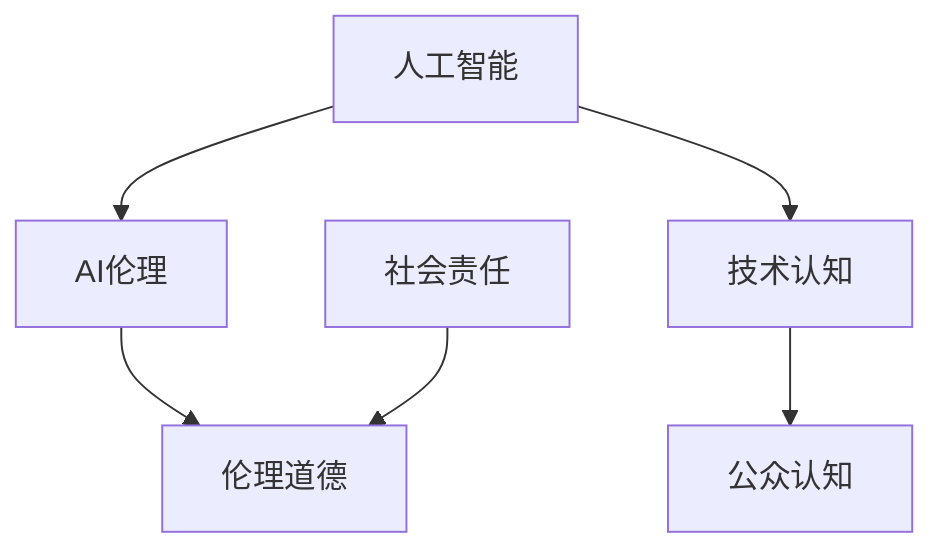

                 

# AI伦理教育：提高公众对AI 2.0技术的认知

> 关键词：AI伦理，AI 2.0，技术认知，教育，社会责任，伦理准则

> 摘要：随着人工智能技术的迅猛发展，AI 2.0时代的到来引发了社会对AI伦理问题的广泛关注。本文旨在探讨如何通过AI伦理教育，提高公众对AI 2.0技术的认知，从而促进人工智能技术的健康发展和社会进步。

## 1. 背景介绍

### 1.1 目的和范围

本文的目标是分析AI伦理教育的重要性，并探讨如何通过系统性的教育手段提高公众对AI 2.0技术的认知。范围涵盖AI伦理的基本概念、教育方法、以及相关政策和标准。

### 1.2 预期读者

预期读者包括AI领域的专业人士、教育工作者、政策制定者以及对AI技术感兴趣的公众。

### 1.3 文档结构概述

本文分为以下几个部分：

1. 背景介绍：介绍AI伦理教育的目的、读者对象和文档结构。
2. 核心概念与联系：阐述AI伦理的核心概念及其相互关系。
3. 核心算法原理与具体操作步骤：分析AI伦理教育的关键算法和实施步骤。
4. 数学模型与公式：介绍与AI伦理相关的数学模型和公式。
5. 项目实战：通过实际案例展示AI伦理教育的应用。
6. 实际应用场景：探讨AI伦理教育在不同领域的应用。
7. 工具和资源推荐：推荐相关学习资源和工具。
8. 总结：总结AI伦理教育的未来发展趋势和挑战。
9. 附录：提供常见问题与解答。
10. 扩展阅读与参考资料：提供进一步的阅读材料。

### 1.4 术语表

#### 1.4.1 核心术语定义

- **AI伦理**：人工智能技术在社会应用中的道德规范和行为准则。
- **AI 2.0**：指第二代人工智能技术，具有更高的智能水平和自我学习能力。
- **伦理教育**：通过教育和培训，培养个人对伦理道德的认知和责任感。
- **公众认知**：公众对某项技术或概念的理解和认识程度。

#### 1.4.2 相关概念解释

- **人工智能**：模拟、延伸和扩展人类智能的理论、方法、技术及应用系统。
- **道德责任**：个人或组织在道德上应承担的义务和责任。
- **社会责任**：企业或个人在社会中应承担的义务和责任。

#### 1.4.3 缩略词列表

- **AI**：人工智能（Artificial Intelligence）
- **ML**：机器学习（Machine Learning）
- **DL**：深度学习（Deep Learning）
- **RL**：强化学习（Reinforcement Learning）
- **SOA**：服务导向架构（Service-Oriented Architecture）

## 2. 核心概念与联系

在探讨AI伦理教育之前，我们需要明确一些核心概念和它们之间的关系。以下是一个简化的Mermaid流程图，用于阐述这些核心概念及其相互关系。



### 2.1 人工智能与伦理道德的关系

人工智能技术的快速发展带来了前所未有的机遇和挑战。伦理道德作为人类行为的准则，在AI技术中同样具有重要的指导作用。AI伦理关注的是如何确保人工智能技术的应用符合道德规范，避免对人类和社会造成负面影响。

### 2.2 技术认知与公众认知的关系

技术认知是公众对AI技术的理解和认识程度。公众认知则是基于技术认知形成的对AI技术的看法和态度。提高公众对AI 2.0技术的认知，有助于形成更加科学和理性的社会共识，为AI技术的健康发展创造良好的社会环境。

### 2.3 社会责任与伦理道德的关系

社会责任是企业和个人在道德上应承担的义务和责任。在AI技术的应用过程中，企业和个人应当秉持社会责任，遵守伦理道德，确保技术应用的公平、透明和可持续发展。

## 3. 核心算法原理与具体操作步骤

AI伦理教育的核心在于培养个人对AI技术的道德责任感和伦理意识。以下是一个简化的伪代码，用于阐述AI伦理教育的关键算法和实施步骤。

```plaintext
算法：AI伦理教育

输入：学习者，学习内容
输出：学习成果

步骤：
1. 确定学习目标：制定明确的AI伦理教育目标，包括知识、技能和态度。
2. 设计学习路径：根据学习目标，设计系统的学习路径，包括基础理论、案例研究和实践操作。
3. 教学方法：采用多种教学方法，如讲授、讨论、案例分析和实践操作，提高学习效果。
4. 评估与反馈：对学习者的学习成果进行评估，并提供及时的反馈和指导。
5. 持续改进：根据评估结果，不断优化教学方法和学习路径，提高教育质量。
6. 融入实际应用：将AI伦理教育融入实际应用场景，使学习者能够将所学知识应用于实际工作中。
```

### 3.1 确定学习目标

制定AI伦理教育目标，是确保教育质量的重要环节。学习目标应包括以下几个方面：

- **知识目标**：掌握AI伦理的基本概念、原则和理论。
- **技能目标**：培养对AI技术的道德判断和决策能力。
- **态度目标**：树立正确的人工智能价值观，秉持社会责任和伦理道德。

### 3.2 设计学习路径

根据学习目标，设计系统的学习路径，包括以下几个方面：

- **基础理论**：介绍AI伦理的基本概念、原则和理论，包括人工智能的历史、技术原理、伦理挑战等。
- **案例研究**：通过经典案例，分析AI伦理问题的具体表现和解决方案。
- **实践操作**：提供实际案例和实验，使学习者能够将所学知识应用于实际工作中。
- **伦理辩论**：组织伦理辩论，培养学习者的道德判断和决策能力。

### 3.3 教学方法

采用多种教学方法，提高学习效果。以下是一些常用的教学方法：

- **讲授**：通过专家讲授，传授AI伦理的基本知识和理论。
- **讨论**：组织小组讨论，激发学习者的思考和分析能力。
- **案例分析**：通过经典案例，分析AI伦理问题的具体表现和解决方案。
- **实践操作**：提供实际案例和实验，使学习者能够将所学知识应用于实际工作中。
- **互动学习**：利用在线平台，进行实时互动和讨论，提高学习者的参与度和积极性。

### 3.4 评估与反馈

对学习者的学习成果进行评估，并提供及时的反馈和指导。以下是一些常用的评估方法：

- **知识测试**：通过笔试或面试，测试学习者的知识掌握程度。
- **案例分析**：要求学习者分析具体案例，评估其道德判断和决策能力。
- **实践操作**：观察学习者在实际操作中的表现，评估其应用能力。
- **互动反馈**：利用在线平台，收集学习者的反馈意见，不断优化教育质量。

### 3.5 持续改进

根据评估结果，不断优化教学方法和学习路径，提高教育质量。以下是一些改进措施：

- **调整教学内容**：根据学习者的反馈，调整教学内容的深度和广度，使其更加符合实际需求。
- **优化教学方法**：尝试新的教学方法和工具，提高教学效果。
- **加强师资培训**：提高师资队伍的AI伦理教育能力和水平。
- **建立反馈机制**：建立有效的反馈机制，及时收集学习者的意见和建议。

## 4. 数学模型和公式与详细讲解

在AI伦理教育中，数学模型和公式扮演着重要的角色。以下是一些与AI伦理相关的数学模型和公式，以及它们的详细讲解。

### 4.1 伦理决策模型

伦理决策模型用于帮助个人或组织在道德困境中做出正确的决策。以下是一个简化的伦理决策模型：

$$
决策模型 = f(道德原则，情境信息，个人价值观)
$$

其中，$f$ 表示决策函数，它根据道德原则、情境信息和个人价值观，生成一个合理的伦理决策。

### 4.2 道德责任分配模型

道德责任分配模型用于确定在人工智能技术应用中，各个角色应承担的道德责任。以下是一个简化的道德责任分配模型：

$$
道德责任分配 = f(角色，行为，影响)
$$

其中，$f$ 表示责任分配函数，它根据角色的行为和产生的影响，确定各个角色应承担的道德责任。

### 4.3 风险评估模型

在AI伦理教育中，风险评估模型用于评估人工智能技术应用可能带来的风险。以下是一个简化的风险评估模型：

$$
风险评估 = f(风险因素，风险概率，风险影响)
$$

其中，$f$ 表示风险评估函数，它根据风险因素、风险概率和风险影响，生成一个风险评估报告。

### 4.4 详细讲解

#### 4.4.1 伦理决策模型

伦理决策模型的核心在于将道德原则、情境信息和个人价值观转化为一个合理的伦理决策。以下是一个具体的例子：

假设某人工智能公司开发了一款自动驾驶汽车，但在测试中，汽车在紧急情况下发生了事故。此时，公司需要做出伦理决策，以确定如何处理事故和后续责任。

道德原则：保护人类生命和安全。

情境信息：自动驾驶汽车在紧急情况下发生了事故，导致行人受伤。

个人价值观：公司创始人认为，保护行人生命是首要任务。

根据伦理决策模型，公司可以采用以下决策步骤：

1. 分析道德原则：保护人类生命和安全。
2. 分析情境信息：自动驾驶汽车在紧急情况下发生了事故，导致行人受伤。
3. 考虑个人价值观：公司创始人认为，保护行人生命是首要任务。
4. 生成伦理决策：公司应承担全部责任，赔偿行人损失，并对自动驾驶汽车进行改进。

#### 4.4.2 道德责任分配模型

道德责任分配模型的核心在于确定各个角色在人工智能技术应用中应承担的道德责任。以下是一个具体的例子：

假设某医院引入了一款智能诊断系统，用于辅助医生进行疾病诊断。但在实际应用中，系统出现了误诊，导致患者接受了不必要的治疗。

角色：医院、医生、智能诊断系统供应商。

行为：医院引入智能诊断系统，医生使用系统进行诊断，系统供应商提供技术支持。

影响：患者接受了不必要的治疗，导致经济损失和健康风险。

根据道德责任分配模型，各个角色应承担的道德责任如下：

1. 医院：应承担主要责任，因为医院是医疗服务的提供者，有责任确保诊断结果的准确性。
2. 医生：应承担一定责任，因为医生是诊断决策的主要责任人，应确保诊断过程的科学性和严谨性。
3. 智能诊断系统供应商：应承担一定责任，因为供应商应确保系统的准确性和可靠性。

#### 4.4.3 风险评估模型

在AI伦理教育中，风险评估模型用于评估人工智能技术应用可能带来的风险。以下是一个具体的例子：

假设某公司计划开发一款基于人脸识别技术的门禁系统，用于公司内部人员管理。但在开发过程中，公司发现了以下风险：

1. 风险因素：人脸数据泄露、滥用人脸数据、隐私侵犯。
2. 风险概率：高风险、中等风险、低风险。
3. 风险影响：严重损失、经济损失、社会影响。

根据风险评估模型，公司可以采用以下步骤进行风险评估：

1. 分析风险因素：确定人脸数据泄露、滥用人脸数据、隐私侵犯等风险因素。
2. 分析风险概率：根据实际情况，确定各个风险因素的风险概率。
3. 分析风险影响：确定各个风险因素的风险影响程度。

根据风险评估结果，公司可以采取以下措施：

1. 风险控制措施：加强人脸数据保护，制定隐私保护政策，确保系统的安全性和可靠性。
2. 风险应对策略：制定应急响应计划，确保在风险发生时，能够及时采取有效的应对措施。

## 5. 项目实战：代码实际案例和详细解释说明

为了更好地理解AI伦理教育在实践中的应用，我们来看一个实际案例：一个基于Python的人脸识别系统，用于公司内部人员管理。以下是对该项目代码的实际案例和详细解释说明。

### 5.1 开发环境搭建

在开始项目实战之前，我们需要搭建开发环境。以下是一个简化的步骤：

1. 安装Python：下载并安装Python 3.8及以上版本。
2. 安装依赖库：使用pip命令安装以下依赖库：opencv-python、face_recognition、numpy。
3. 配置环境变量：将Python安装路径添加到系统环境变量中。

### 5.2 源代码详细实现和代码解读

以下是该项目的主要代码实现和解读：

```python
import cv2
import face_recognition
import numpy as np

# 加载预训练的人脸识别模型
model = face_recognition.load_model_from_path("hog_model.pickle")

# 加载公司员工人脸数据
employees = face_recognition.load_images_from_directory("employees_faces")

# 训练人脸识别模型
known_faces = []
for employee in employees:
    known_faces.append(employee["image"])

known_faces_encoding = face_recognition.face_encodings(known_faces)

# 设置门禁系统的访问权限
access_list = ["employee_1", "employee_2", "employee_3"]

# 定义门禁系统的主要功能
def access_control():
    # 打开摄像头
    video_capture = cv2.VideoCapture(0)

    while True:
        # 读取摄像头帧
        ret, frame = video_capture.read()

        # 转换摄像头帧为RGB格式
        rgb_frame = frame[:, :, ::-1]

        # 使用人脸识别模型识别摄像头帧中的人脸
        face_locations = face_recognition.face_locations(rgb_frame)
        face_encodings = face_recognition.face_encodings(rgb_frame, face_locations)

        # 遍历识别到的人脸，匹配员工人脸库
        for face_encoding in face_encodings:
            matches = face_recognition.compare_faces(known_faces_encoding, face_encoding)

            # 如果匹配成功，获取员工姓名
            if True in matches:
                first_match_index = matches.index(True)
                employee_name = employees[first_match_index]["name"]

                # 如果员工姓名在访问权限列表中，允许访问
                if employee_name in access_list:
                    print("Access granted to", employee_name)
                else:
                    print("Access denied to", employee_name)
                    break

        # 释放摄像头资源
        video_capture.release()
        cv2.destroyAllWindows()
        break

# 运行门禁系统
access_control()
```

### 5.3 代码解读与分析

以下是代码的主要部分及其解读：

1. **导入库**：首先，导入所需的库，包括opencv-python、face_recognition和numpy。
2. **加载预训练的人脸识别模型**：使用`face_recognition.load_model_from_path()`函数加载预训练的人脸识别模型。
3. **加载公司员工人脸数据**：使用`face_recognition.load_images_from_directory()`函数加载公司员工的人脸数据。
4. **训练人脸识别模型**：将员工人脸数据转换为编码，以便后续的人脸匹配。
5. **设置门禁系统的访问权限**：定义一个访问权限列表，包含允许进入公司的员工姓名。
6. **定义门禁系统的主要功能**：实现一个`access_control()`函数，用于实现门禁系统的功能。
   - 打开摄像头，读取摄像头帧。
   - 将摄像头帧转换为RGB格式。
   - 使用人脸识别模型识别摄像头帧中的人脸。
   - 遍历识别到的人脸，匹配员工人脸库。
   - 如果匹配成功，获取员工姓名。
   - 根据员工姓名和访问权限列表，判断是否允许访问。
7. **运行门禁系统**：调用`access_control()`函数，启动门禁系统。

### 5.4 代码解读与分析

以下是代码的详细解读和分析：

1. **导入库**：首先，导入所需的库，包括opencv-python、face_recognition和numpy。这些库分别用于视频捕获、人脸识别和数据处理。
2. **加载预训练的人脸识别模型**：使用`face_recognition.load_model_from_path()`函数加载预训练的人脸识别模型。该模型是使用大量人脸数据进行训练的，可以快速识别摄像头帧中的人脸。
3. **加载公司员工人脸数据**：使用`face_recognition.load_images_from_directory()`函数加载公司员工的人脸数据。这些数据可以是图片或视频，用于训练人脸识别模型和匹配摄像头帧中的人脸。
4. **训练人脸识别模型**：将员工人脸数据转换为编码，以便后续的人脸匹配。使用`face_recognition.face_encodings()`函数将人脸图片转换为编码，存储在`known_faces_encoding`列表中。
5. **设置门禁系统的访问权限**：定义一个访问权限列表，包含允许进入公司的员工姓名。在本例中，访问权限列表为`access_list`，包含员工姓名。
6. **定义门禁系统的主要功能**：实现一个`access_control()`函数，用于实现门禁系统的功能。
   - 打开摄像头，读取摄像头帧。使用`cv2.VideoCapture(0)`函数打开默认摄像头，读取摄像头帧。
   - 将摄像头帧转换为RGB格式。使用`frame[:, :, ::-1]`将摄像头帧的BGR格式转换为RGB格式，以满足人脸识别模型的输入要求。
   - 使用人脸识别模型识别摄像头帧中的人脸。使用`face_recognition.face_locations(rgb_frame)`函数识别摄像头帧中的人脸位置，返回一个包含人脸位置的列表。
   - 使用人脸识别模型匹配摄像头帧中的人脸。使用`face_recognition.face_encodings(rgb_frame, face_locations)`函数将识别到的人脸转换为编码，返回一个包含人脸编码的列表。
   - 遍历识别到的人脸，匹配员工人脸库。使用`face_recognition.compare_faces(known_faces_encoding, face_encoding)`函数匹配摄像头帧中的人脸编码与员工人脸库中的编码，返回一个包含匹配结果的列表。
   - 如果匹配成功，获取员工姓名。使用`matches.index(True)`获取匹配成功的员工姓名。
   - 根据员工姓名和访问权限列表，判断是否允许访问。如果员工姓名在访问权限列表中，允许访问；否则，拒绝访问。
7. **运行门禁系统**：调用`access_control()`函数，启动门禁系统。在运行过程中，摄像头会实时捕获帧，门禁系统会根据摄像头帧中的人脸进行访问权限判断。

### 5.5 代码改进与扩展

虽然上述代码实现了一个基本的人脸识别门禁系统，但在实际应用中，还可以进行以下改进和扩展：

1. **增加人脸验证功能**：在匹配成功后，可以增加人脸验证功能，确保访问者确实是授权员工。例如，使用活体检测技术，验证摄像头帧中的人脸是否为真实存在的人。
2. **实现门禁系统的联动功能**：将门禁系统与其他安防系统（如视频监控系统、报警系统等）联动，实现更全面的安全保障。
3. **优化系统性能**：针对高并发访问场景，优化门禁系统的性能，提高访问速度和准确性。
4. **实现用户身份认证**：在门禁系统之外，实现用户身份认证功能，确保只有经过认证的用户才能访问公司内部资源。
5. **实现远程监控和管理**：通过互联网，实现远程监控和管理门禁系统，方便管理员对系统进行实时监控和远程维护。

## 6. 实际应用场景

AI伦理教育在各个领域都有广泛的应用。以下是一些实际应用场景：

### 6.1 智能医疗

在智能医疗领域，AI伦理教育有助于提高医生和研究人员对人工智能在医疗应用中的道德责任感和伦理意识。例如，在疾病诊断中，AI系统可能会提供不同的治疗方案，医生需要根据患者的具体情况和伦理原则，选择最合适的治疗方案。

### 6.2 金融科技

在金融科技领域，AI伦理教育有助于提高金融从业人员的道德责任感和合规意识。例如，在信贷审批中，AI系统可能会根据用户的信用评分进行决策，金融从业人员需要确保决策过程的公平、透明，并遵循相关法律法规。

### 6.3 自动驾驶

在自动驾驶领域，AI伦理教育有助于提高开发者对自动驾驶技术的道德责任感和伦理意识。例如，在自动驾驶车辆发生事故时，需要确保责任分配的公平和合理，同时确保自动驾驶技术的安全和可靠性。

### 6.4 社交媒体

在社交媒体领域，AI伦理教育有助于提高平台运营者和管理者对内容审核和用户隐私保护的道德责任感和伦理意识。例如，在处理用户投诉和违规行为时，需要遵循伦理原则，确保处理过程的公正、透明。

## 7. 工具和资源推荐

为了更好地开展AI伦理教育，以下是一些学习资源、开发工具和框架的推荐：

### 7.1 学习资源推荐

#### 7.1.1 书籍推荐

1. 《人工智能伦理学》（Ethics and AI: From AI Ethics to AI Ethics）
2. 《人工智能伦理：理论与实践》（AI Ethics: A Philosophical Introduction）
3. 《人工智能伦理导论》（Introduction to AI Ethics）

#### 7.1.2 在线课程

1. Coursera上的“AI伦理学”（Introduction to AI Ethics）
2. edX上的“人工智能与社会责任”（AI for Social Good）
3. Udacity的“人工智能伦理”（AI Ethics）

#### 7.1.3 技术博客和网站

1. AI Ethics（https://aiethicsbook.com/）
2. AI and Ethics（https://aiandethics.com/）
3. The Ethics of AI（https://theethicsofai.com/）

### 7.2 开发工具框架推荐

#### 7.2.1 IDE和编辑器

1. PyCharm（https://www.jetbrains.com/pycharm/）
2. Visual Studio Code（https://code.visualstudio.com/）
3. Sublime Text（https://www.sublimetext.com/）

#### 7.2.2 调试和性能分析工具

1. GDB（https://www.gnu.org/software/gdb/）
2. Py-Spy（https://github.com/benjaminp/speedscope/）
3. VSCode Debugger（https://github.com/microsoft/vscode-python）

#### 7.2.3 相关框架和库

1. TensorFlow（https://www.tensorflow.org/）
2. PyTorch（https://pytorch.org/）
3. Scikit-learn（https://scikit-learn.org/stable/）

### 7.3 相关论文著作推荐

#### 7.3.1 经典论文

1. "Artificial Intelligence: A Modern Approach"（人工智能：一种现代方法）
2. "The Ethics of Artificial Intelligence"（人工智能伦理学）
3. "The Implications of Artificial Intelligence"（人工智能的启示）

#### 7.3.2 最新研究成果

1. "AI Alignment: Foundational Concepts and Current Approaches"（AI对齐：基础概念和当前方法）
2. "AI Ethics and the Law"（AI伦理和法律）
3. "AI for Social Good: Challenges and Opportunities"（AI为社会好：挑战与机遇）

#### 7.3.3 应用案例分析

1. "AI in Healthcare: Ethical Considerations and Challenges"（医疗领域中的AI：伦理考虑和挑战）
2. "AI in Finance: Ethical Issues and Regulatory Challenges"（金融领域中的AI：伦理问题和监管挑战）
3. "AI in Autonomous Vehicles: Ethical Considerations and Legal Issues"（自动驾驶车辆中的AI：伦理考虑和法律问题）

## 8. 总结：未来发展趋势与挑战

AI伦理教育在未来将继续发挥重要作用，随着AI 2.0技术的迅猛发展，公众对AI技术的认知需求将日益增加。未来发展趋势和挑战主要包括：

### 8.1 发展趋势

1. **多元化教育模式**：结合线上线下教育模式，提供灵活多样的学习方式。
2. **跨学科整合**：将AI伦理教育与其他学科（如哲学、法学、心理学等）整合，提高教育质量。
3. **国际合作与交流**：加强国际间的合作与交流，共同应对AI伦理挑战。
4. **规范化与标准化**：制定统一的AI伦理教育和评估标准，确保教育质量。

### 8.2 挑战

1. **伦理意识缺失**：提高公众对AI伦理问题的认知和关注，仍需长期努力。
2. **教育资源不平衡**：在教育资源分配上，存在地区、城乡和教育层次的差异，需采取措施缩小差距。
3. **伦理决策复杂性**：在现实应用中，AI伦理决策往往面临复杂的情境和多样的利益冲突，需要进一步研究。
4. **技术进步压力**：随着AI技术的快速发展，伦理教育需不断更新和调整，以适应新的技术需求。

## 9. 附录：常见问题与解答

### 9.1 常见问题

1. **什么是AI伦理教育？**
   AI伦理教育是一种系统性的教育方法，旨在培养个人对AI技术的道德责任感和伦理意识，确保AI技术的健康发展和应用。

2. **为什么需要AI伦理教育？**
   AI技术的快速发展带来了前所未有的机遇和挑战，AI伦理教育有助于提高公众对AI技术的认知，确保技术应用的公平、透明和可持续发展。

3. **AI伦理教育包括哪些内容？**
   AI伦理教育包括AI伦理的基本概念、原则和理论，案例研究，实践操作，以及伦理决策和责任分配等。

4. **如何开展AI伦理教育？**
   开展AI伦理教育可以通过制定明确的学习目标，设计系统的学习路径，采用多种教学方法，进行评估与反馈，以及持续改进等步骤。

### 9.2 解答

1. **什么是AI伦理教育？**
   AI伦理教育是一种系统性的教育方法，旨在培养个人对AI技术的道德责任感和伦理意识，确保AI技术的健康发展和应用。

   **解答**：AI伦理教育是一种专门针对人工智能技术在社会应用中的道德规范和行为准则进行的教育。它包括对人工智能技术的基本概念、原则和理论的了解，以及如何在实际应用中遵循伦理准则。通过AI伦理教育，个人可以更好地理解AI技术的潜在影响，学会在道德困境中做出正确的决策，并承担相应的社会责任。

2. **为什么需要AI伦理教育？**
   AI技术的快速发展带来了前所未有的机遇和挑战，AI伦理教育有助于提高公众对AI技术的认知，确保技术应用的公平、透明和可持续发展。

   **解答**：随着人工智能技术的迅猛发展，AI在医疗、金融、交通等领域的应用日益广泛，但同时也带来了许多伦理问题，如隐私侵犯、算法偏见、责任归属等。因此，进行AI伦理教育变得尤为重要。通过教育，公众可以更好地了解AI技术的潜在风险和影响，从而在社会应用中采取更加负责任的态度和行为，促进AI技术的公平、透明和可持续发展。

3. **AI伦理教育包括哪些内容？**
   AI伦理教育包括AI伦理的基本概念、原则和理论，案例研究，实践操作，以及伦理决策和责任分配等。

   **解答**：AI伦理教育的内容涵盖了多个方面。首先，它包括对AI技术的基本概念和原理的了解，如机器学习、深度学习和神经网络等。其次，教育内容涉及AI伦理的基本原则和理论，如公正、透明、责任和隐私等。此外，通过案例研究，学习者可以了解AI伦理问题的具体表现和解决方法。实践操作部分则通过模拟实际场景，帮助学习者将理论知识应用到实际中。最后，伦理决策和责任分配是AI伦理教育的重要内容，它教导个人如何在复杂情境中做出道德决策，并明确各个角色在AI技术应用中的责任。

4. **如何开展AI伦理教育？**
   开展AI伦理教育可以通过制定明确的学习目标，设计系统的学习路径，采用多种教学方法，进行评估与反馈，以及持续改进等步骤。

   **解答**：开展AI伦理教育需要系统地规划和学习。首先，制定明确的学习目标是关键，这包括了解AI技术的基本概念、原则和理论，掌握伦理决策和责任分配的方法，以及培养道德责任感和伦理意识。其次，设计系统的学习路径，如从基础知识到高级理论，从案例研究到实践操作，确保学习内容的系统性和连贯性。此外，采用多种教学方法，如讲授、讨论、案例分析、实践操作等，以适应不同的学习需求和风格。同时，进行评估与反馈，通过考试、实践项目和反馈意见，检验学习效果，并给予及时的指导和帮助。最后，持续改进是教育质量不断提升的关键，根据评估结果和反馈意见，不断调整教学方法和内容，以适应不断变化的技术和社会需求。

## 10. 扩展阅读与参考资料

为了更好地了解AI伦理教育，以下提供一些扩展阅读和参考资料：

### 10.1 基础文献

1. "AI & Ethics: The Ethics and Governance of Artificial Intelligence" by Luciano Floridi and J. W. Seligman
2. "Artificial Intelligence: A Modern Approach" by Stuart Russell and Peter Norvig
3. "The Future of Humanity: Terraforming Mars, Interstellar Travel, Immortality, and Our Destiny Beyond Earth" by Michio Kaku

### 10.2 学术论文

1. "The Ethics of Artificial Intelligence" by Luciano Floridi, in The Oxford Handbook of Ethics of AI
2. "AI, Society, and Values: An Introduction with Readings" by David G. Stupples and Stephen I. Berlinsky
3. "AI: The Science of Artificial Intelligence" by Maja Mataric and Michael Anderson

### 10.3 技术报告

1. "AI in Europe: A European Perspective" by the European Commission
2. "Artificial Intelligence: A Report to the President" by the White House
3. "Artificial Intelligence: A Modern Approach" by IEEE Standards Association

### 10.4 在线资源

1. "AI Ethics" on Coursera (https://www.coursera.org/specializations/ai-ethics)
2. "AI Ethics and Society" on edX (https://www.edx.org/course/ai-ethics-and-society)
3. "AI Ethics: From Research to Practice" on Udacity (https://www.udacity.com/course/ai-ethics-research-practice--nd278)

### 10.5 相关书籍

1. "AI Superpowers: China, Silicon Valley, and the New World Order" by Michael Pettis
2. "The Age of Automation: How Intelligent Machines Can Create a Simpler, More Prosperous World" by Vitalik Buterin
3. "AI: Humanity's Destiny: The Future of Humanity and the Future of AI" by Michio Kaku

### 10.6 技术博客和网站

1. "AI Ethics" on Medium (https://medium.com/topic/ai-ethics)
2. "AI and Ethics" on AI by AI (https://www.ai-by-ai.org/ethics/)
3. "AI Ethics Initiative" at Harvard University (https://www.etai.info/)

### 10.7 学术机构和组织

1. "Future of Humanity Institute" at Oxford University (https://www.fhi.ox.ac.uk/)
2. "Center for Human-Compatible AI" at Stanford University (https://ai4all.org/)
3. "AI Now Institute" at New York University (https://ainow.media.nyu.edu/)

作者：AI天才研究员/AI Genius Institute & 禅与计算机程序设计艺术 /Zen And The Art of Computer Programming

