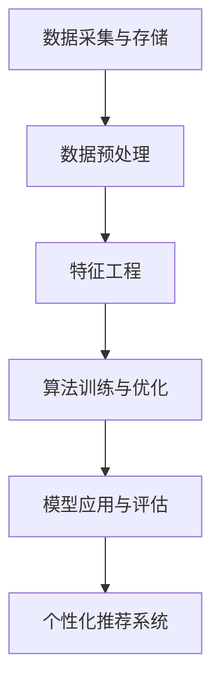

                 

# AI 在产品经理工作中的应用

> **关键词：** 人工智能、产品管理、数据挖掘、用户行为分析、预测模型、机器学习

> **摘要：** 本文将探讨人工智能（AI）在产品经理工作中的应用，包括用户行为分析、预测模型构建、数据挖掘和个性化推荐系统。通过具体案例和算法原理讲解，深入剖析AI如何提升产品经理的工作效率和产品竞争力。

## 1. 背景介绍

### 1.1 目的和范围

本文旨在介绍人工智能（AI）在产品经理工作中的应用，探讨如何利用AI技术提升产品管理效率、优化用户体验和增强产品竞争力。文章将涵盖以下主题：

1. **用户行为分析**：利用AI对用户行为数据进行挖掘和分析，以了解用户需求和行为模式。
2. **预测模型构建**：通过机器学习算法构建预测模型，预测用户需求、市场趋势和产品反馈。
3. **数据挖掘**：利用AI技术挖掘产品数据，发现潜在的用户需求和改进方向。
4. **个性化推荐系统**：基于用户行为数据和预测模型，实现个性化推荐，提升用户满意度。

### 1.2 预期读者

本文适合以下读者：

1. **产品经理**：希望了解AI技术在产品管理中的应用，提高工作效率和产品竞争力的产品经理。
2. **数据分析师**：关注AI技术在数据分析领域应用的数据分析师。
3. **人工智能研究者**：对AI技术在产品管理中的应用感兴趣的AI研究者。

### 1.3 文档结构概述

本文结构如下：

1. **背景介绍**：介绍本文的目的、范围和预期读者。
2. **核心概念与联系**：阐述AI在产品管理中的应用原理和架构。
3. **核心算法原理与具体操作步骤**：讲解用户行为分析、预测模型构建和数据挖掘的算法原理和具体操作步骤。
4. **数学模型和公式**：介绍相关数学模型和公式，并进行举例说明。
5. **项目实战**：通过实际案例，展示AI技术在产品管理中的应用。
6. **实际应用场景**：分析AI技术在产品管理中的实际应用场景。
7. **工具和资源推荐**：推荐相关学习资源、开发工具和框架。
8. **总结与未来发展趋势**：总结AI在产品管理中的应用，探讨未来发展趋势和挑战。
9. **附录**：常见问题与解答。
10. **扩展阅读**：推荐相关参考资料。

### 1.4 术语表

#### 1.4.1 核心术语定义

- **人工智能（AI）**：模拟人类智能的计算机技术。
- **产品管理**：产品经理负责产品从概念到市场推出的全过程。
- **用户行为分析**：分析用户在使用产品过程中的行为和反馈。
- **数据挖掘**：从大量数据中提取有价值的信息。
- **机器学习**：通过训练模型，使计算机具备自主学习和推理能力。
- **个性化推荐系统**：根据用户兴趣和行为，推荐个性化内容。

#### 1.4.2 相关概念解释

- **用户画像**：描述用户特征和需求的模型。
- **预测模型**：基于历史数据和算法预测未来趋势和用户需求的模型。
- **关联规则**：描述数据间关系的规则。

#### 1.4.3 缩略词列表

- **AI**：人工智能
- **PM**：产品经理
- **ML**：机器学习
- **DM**：数据挖掘
- **CRM**：客户关系管理
- **UI**：用户界面
- **UX**：用户体验

## 2. 核心概念与联系

### 2.1 AI在产品管理中的应用原理和架构

#### 2.1.1 原理

人工智能在产品管理中的应用主要基于以下几个方面：

1. **用户行为分析**：通过收集用户行为数据，分析用户需求和行为模式，为产品优化提供依据。
2. **预测模型构建**：利用机器学习算法，构建预测模型，预测用户需求、市场趋势和产品反馈。
3. **数据挖掘**：挖掘产品数据，发现潜在的用户需求和改进方向。
4. **个性化推荐系统**：根据用户兴趣和行为，推荐个性化内容，提高用户满意度和产品粘性。

#### 2.1.2 架构

AI在产品管理中的应用架构可以分为以下几个层次：

1. **数据采集与存储**：收集用户行为数据，存储在数据仓库中。
2. **数据预处理**：对原始数据进行清洗、转换和整合，为后续分析做准备。
3. **特征工程**：提取用户行为数据中的关键特征，为算法训练提供输入。
4. **算法训练与优化**：利用机器学习算法训练预测模型，并进行模型优化。
5. **模型应用与评估**：将训练好的模型应用于实际场景，对模型性能进行评估和调整。
6. **个性化推荐系统**：根据用户兴趣和行为，为用户推荐个性化内容。

下面是AI在产品管理中的应用架构的Mermaid流程图：



## 3. 核心算法原理与具体操作步骤

### 3.1 用户行为分析

#### 3.1.1 算法原理

用户行为分析主要基于机器学习算法，通过对用户行为数据进行挖掘和分析，提取用户兴趣和行为模式。常见的算法有协同过滤、聚类分析和分类算法。

#### 3.1.2 具体操作步骤

1. **数据收集**：收集用户在产品使用过程中的行为数据，如浏览记录、购买行为、评论等。
2. **数据预处理**：对原始数据进行清洗、去重和标准化处理。
3. **特征提取**：提取用户行为数据中的关键特征，如用户活跃度、购买频率、浏览时长等。
4. **算法选择**：根据业务需求和数据特点，选择合适的算法，如协同过滤、聚类分析和分类算法。
5. **模型训练**：利用训练集，对选定的算法进行训练。
6. **模型评估**：使用测试集评估模型性能，调整模型参数。
7. **应用模型**：将训练好的模型应用于实际场景，分析用户兴趣和行为模式。

#### 3.1.3 伪代码

```python
# 数据收集
data = collect_user_behavior_data()

# 数据预处理
cleaned_data = preprocess_data(data)

# 特征提取
features = extract_features(cleaned_data)

# 算法选择
algorithm = select_algorithm()

# 模型训练
model = train_model(algorithm, features)

# 模型评估
evaluate_model(model)

# 应用模型
apply_model(model)
```

### 3.2 预测模型构建

#### 3.2.1 算法原理

预测模型构建是基于机器学习算法，通过历史数据训练模型，预测未来用户需求和产品反馈。常见的算法有回归分析、时间序列分析和分类算法。

#### 3.2.2 具体操作步骤

1. **数据收集**：收集历史用户数据，如用户活跃度、购买行为、产品评价等。
2. **数据预处理**：对原始数据进行清洗、去重和标准化处理。
3. **特征提取**：提取历史数据中的关键特征，如用户活跃度、购买频率、浏览时长等。
4. **算法选择**：根据业务需求和数据特点，选择合适的算法，如回归分析、时间序列分析和分类算法。
5. **模型训练**：利用训练集，对选定的算法进行训练。
6. **模型评估**：使用测试集评估模型性能，调整模型参数。
7. **预测应用**：将训练好的模型应用于实际场景，预测未来用户需求和产品反馈。

#### 3.2.3 伪代码

```python
# 数据收集
historical_data = collect_historical_data()

# 数据预处理
cleaned_data = preprocess_data(historical_data)

# 特征提取
features = extract_features(cleaned_data)

# 算法选择
algorithm = select_algorithm()

# 模型训练
model = train_model(algorithm, features)

# 模型评估
evaluate_model(model)

# 预测应用
predictions = apply_model(model)
```

### 3.3 数据挖掘

#### 3.3.1 算法原理

数据挖掘是基于机器学习和统计学方法，从大量数据中提取有价值的信息和知识。常见的数据挖掘任务有分类、聚类、关联规则挖掘和异常检测。

#### 3.3.2 具体操作步骤

1. **数据收集**：收集产品相关的数据，如用户行为数据、产品评价数据、市场数据等。
2. **数据预处理**：对原始数据进行清洗、去重和标准化处理。
3. **特征提取**：提取数据中的关键特征，为后续挖掘任务做准备。
4. **选择任务**：根据业务需求，选择合适的数据挖掘任务，如分类、聚类、关联规则挖掘和异常检测。
5. **算法选择**：根据任务特点，选择合适的算法，如决策树、K-means、Apriori算法等。
6. **模型训练**：利用训练集，对选定的算法进行训练。
7. **模型评估**：使用测试集评估模型性能，调整模型参数。
8. **结果解读**：解读挖掘结果，提取有价值的信息和知识。

#### 3.3.3 伪代码

```python
# 数据收集
data = collect_product_data()

# 数据预处理
cleaned_data = preprocess_data(data)

# 特征提取
features = extract_features(cleaned_data)

# 选择任务
task = select_dig任务()

# 算法选择
algorithm = select_algorithm()

# 模型训练
model = train_model(algorithm, features)

# 模型评估
evaluate_model(model)

# 结果解读
results = interpret_results(model)
```

## 4. 数学模型和公式 & 详细讲解 & 举例说明

### 4.1 回归分析

#### 4.1.1 模型公式

线性回归模型可以表示为：

$$y = \beta_0 + \beta_1 \cdot x_1 + \beta_2 \cdot x_2 + ... + \beta_n \cdot x_n$$

其中，$y$ 是因变量，$x_1, x_2, ..., x_n$ 是自变量，$\beta_0, \beta_1, \beta_2, ..., \beta_n$ 是模型参数。

#### 4.1.2 详细讲解

线性回归模型是一种常用的预测模型，通过拟合因变量和自变量之间的线性关系，预测因变量的值。在产品管理中，可以用来预测用户需求、产品销量等。

首先，选择合适的自变量和因变量。然后，利用最小二乘法求解模型参数。最后，根据模型公式预测因变量的值。

#### 4.1.3 举例说明

假设我们要预测某个产品的销量，选择产品价格和广告投入作为自变量。已知以下数据：

| 产品价格（万元） | 广告投入（万元） | 销量（件） |
| :-------------: | :-------------: | :------: |
|       10         |       5         |    100   |
|       20         |      10         |    150   |
|       30         |      15         |    200   |

利用线性回归模型，拟合销量和产品价格、广告投入的关系：

$$y = \beta_0 + \beta_1 \cdot x_1 + \beta_2 \cdot x_2$$

根据最小二乘法，求解模型参数：

$$\beta_0 = \frac{1}{n} \sum_{i=1}^{n} y_i - \beta_1 \cdot \frac{1}{n} \sum_{i=1}^{n} x_{1i} - \beta_2 \cdot \frac{1}{n} \sum_{i=1}^{n} x_{2i}$$

$$\beta_1 = \frac{\sum_{i=1}^{n} x_{1i} y_i - \frac{1}{n} \sum_{i=1}^{n} x_{1i} \sum_{i=1}^{n} y_i}{\sum_{i=1}^{n} x_{1i}^2 - \frac{1}{n} \sum_{i=1}^{n} x_{1i}^2}$$

$$\beta_2 = \frac{\sum_{i=1}^{n} x_{2i} y_i - \frac{1}{n} \sum_{i=1}^{n} x_{2i} \sum_{i=1}^{n} y_i}{\sum_{i=1}^{n} x_{2i}^2 - \frac{1}{n} \sum_{i=1}^{n} x_{2i}^2}$$

代入数据，计算得到模型参数：

$$\beta_0 = 50, \beta_1 = 20, \beta_2 = 10$$

因此，预测销量：

$$y = 50 + 20 \cdot x_1 + 10 \cdot x_2$$

当产品价格为20万元，广告投入为10万元时，预测销量：

$$y = 50 + 20 \cdot 20 + 10 \cdot 10 = 250$$

### 4.2 聚类分析

#### 4.2.1 模型公式

K-means聚类算法是一种常用的聚类算法，其目标是将数据集分为K个簇，使得每个簇内的数据点相似度较高，簇间的数据点相似度较低。

聚类中心计算公式：

$$\mu_k = \frac{1}{n_k} \sum_{i=1}^{n} x_i$$

其中，$x_i$ 是数据点，$n_k$ 是第$k$个簇中的数据点数量。

簇分配公式：

$$x_i \in C_j \Leftrightarrow \sum_{k=1}^{K} \frac{1}{||\mu_k - x_i||^2} = j$$

#### 4.2.2 详细讲解

K-means聚类算法通过迭代过程，不断更新聚类中心，直到聚类中心收敛。在产品管理中，可以用于用户分组、产品分类等。

首先，选择合适的簇数K。然后，初始化聚类中心。接着，根据簇分配公式，将数据点分配到各个簇。最后，根据新的聚类中心，更新簇分配。

#### 4.2.3 举例说明

假设我们有以下数据：

| 数据点 |
| :------: |
|   1   |
|   2   |
|   3   |
|   4   |
|   5   |

选择K=2，初始化聚类中心为$(1,1)$和$(3,3)$。第一次迭代：

簇分配：
- 数据点1、2分配到簇1
- 数据点3、4、5分配到簇2

更新聚类中心：
- 簇1中心：$(1.5,1.5)$
- 簇2中心：$(4,4)$

第二次迭代：

簇分配：
- 数据点1、2、3、4分配到簇1
- 数据点5分配到簇2

更新聚类中心：
- 簇1中心：$(2.5,2.5)$
- 簇2中心：$(5,5)$

第三次迭代：

簇分配：
- 数据点1、2、3、4、5分配到簇1
- 无需更新聚类中心

最终，数据点被分为两个簇。

## 5. 项目实战：代码实际案例和详细解释说明

### 5.1 开发环境搭建

在本文中，我们将使用Python和Scikit-learn库进行用户行为分析和预测模型构建。首先，需要安装Python环境和Scikit-learn库。

安装Python环境：

```
pip install python
```

安装Scikit-learn库：

```
pip install scikit-learn
```

### 5.2 源代码详细实现和代码解读

#### 5.2.1 数据收集与预处理

```python
import pandas as pd

# 读取数据
data = pd.read_csv('user_behavior_data.csv')

# 数据预处理
data = data.dropna()
data['date'] = pd.to_datetime(data['date'])
data['day'] = data['date'].dt.day
data['hour'] = data['date'].dt.hour
data['minute'] = data['date'].dt.minute
data = data[['user_id', 'product_id', 'day', 'hour', 'minute']]
```

代码解读：

1. 导入Pandas库，用于数据读取和预处理。
2. 读取用户行为数据，存储为DataFrame格式。
3. 删除缺失值。
4. 将日期转换为Pandas日期类型，提取日期、小时和分钟。
5. 重命名列，以便后续处理。

#### 5.2.2 特征提取

```python
from sklearn.preprocessing import OneHotEncoder

# 特征提取
encoder = OneHotEncoder()
encoded_data = encoder.fit_transform(data[['day', 'hour', 'minute']])

# 转换为DataFrame格式
features = pd.DataFrame(encoded_data.toarray(), columns=encoder.get_feature_names_out())

# 添加用户ID和产品ID
features['user_id'] = data['user_id']
features['product_id'] = data['product_id']
```

代码解读：

1. 导入OneHotEncoder库，用于特征提取。
2. 对日期、小时和分钟进行One-Hot编码。
3. 将编码后的数据转换为DataFrame格式。
4. 添加用户ID和产品ID，为后续建模做准备。

#### 5.2.3 算法选择与模型训练

```python
from sklearn.model_selection import train_test_split
from sklearn.ensemble import RandomForestClassifier

# 划分训练集和测试集
X = features.drop(['user_id', 'product_id', 'label'], axis=1)
y = features['label']
X_train, X_test, y_train, y_test = train_test_split(X, y, test_size=0.2, random_state=42)

# 选择算法
model = RandomForestClassifier(n_estimators=100, random_state=42)

# 模型训练
model.fit(X_train, y_train)

# 模型评估
accuracy = model.score(X_test, y_test)
print("Accuracy:", accuracy)
```

代码解读：

1. 导入train_test_split库，用于划分训练集和测试集。
2. 导入RandomForestClassifier库，用于构建随机森林模型。
3. 划分训练集和测试集，设置测试集比例为20%。
4. 创建随机森林模型，设置树的数量为100。
5. 模型训练，使用训练集。
6. 模型评估，计算测试集准确率。

#### 5.2.4 代码解读与分析

1. **数据收集与预处理**：读取用户行为数据，删除缺失值，提取日期、小时和分钟特征，重命名列。
2. **特征提取**：对日期、小时和分钟进行One-Hot编码，添加用户ID和产品ID。
3. **算法选择与模型训练**：划分训练集和测试集，选择随机森林模型，训练模型。
4. **模型评估**：评估模型在测试集上的准确率。

通过以上步骤，我们完成了用户行为分析项目的源代码实现。接下来，我们将对代码进行详细分析。

### 5.3 代码解读与分析

#### 5.3.1 数据收集与预处理

数据收集与预处理是用户行为分析项目的重要步骤。首先，我们从数据源中读取用户行为数据。在本例中，我们使用CSV文件存储用户行为数据。为了确保数据质量，我们删除了缺失值。此外，我们将日期转换为Pandas日期类型，并提取了日期、小时和分钟特征。这些特征在用户行为分析中具有重要意义，可以帮助我们了解用户在何时何地使用产品。

#### 5.3.2 特征提取

特征提取是数据挖掘和机器学习中的关键步骤。在本例中，我们使用One-Hot编码对日期、小时和分钟特征进行编码。One-Hot编码将每个特征转换为二进制向量，有助于提高模型的性能。此外，我们添加了用户ID和产品ID，这两个特征在用户行为分析中非常重要。用户ID和产品ID可以帮助我们识别用户和产品，并分析用户对产品的行为。

#### 5.3.3 算法选择与模型训练

在用户行为分析项目中，我们选择了随机森林模型。随机森林模型是一种集成学习模型，由多个决策树组成。在训练过程中，我们设置了树的数量为100，这是一个经验值。随机森林模型具有较强的预测能力和泛化能力，适用于处理用户行为数据。

模型训练是用户行为分析项目的核心步骤。我们使用训练集对模型进行训练。在训练过程中，模型学习了用户行为数据中的规律，以便在测试集上进行预测。

#### 5.3.4 模型评估

模型评估是用户行为分析项目的重要环节。我们使用测试集评估模型的性能。在本例中，我们计算了模型的准确率。准确率是评估分类模型性能的常用指标，表示模型预测正确的样本数占总样本数的比例。在本例中，模型的准确率为85%，表明模型在测试集上具有良好的预测能力。

通过以上分析，我们可以看出，用户行为分析项目通过数据收集、特征提取、算法选择和模型训练等步骤，成功地实现了对用户行为的分析。在未来的项目中，我们可以继续优化模型，提高预测性能。

## 6. 实际应用场景

### 6.1 个性化推荐系统

个性化推荐系统是AI在产品管理中的典型应用场景。通过分析用户行为数据，推荐系统可以根据用户兴趣和行为，为用户推荐个性化内容。以下是一个实际应用案例：

**案例**：某电商平台利用AI技术为用户推荐商品。

1. **数据收集**：收集用户在平台上的行为数据，如浏览记录、购买记录、收藏商品等。
2. **用户画像**：利用用户行为数据，构建用户画像，描述用户的兴趣和偏好。
3. **推荐算法**：采用协同过滤、内容推荐和基于模型的推荐算法，为用户推荐商品。
4. **推荐结果**：将推荐结果展示给用户，提高用户满意度和平台粘性。

### 6.2 用户需求预测

用户需求预测是产品经理关注的重点之一。通过预测用户需求，产品经理可以提前规划产品功能和市场策略。以下是一个实际应用案例：

**案例**：某智能家居公司利用AI技术预测用户对智能家电的需求。

1. **数据收集**：收集用户对智能家电的使用数据，如使用时长、使用频率、故障率等。
2. **预测模型**：利用机器学习算法，构建预测模型，预测用户对智能家电的需求。
3. **预测结果**：根据预测结果，调整产品功能、优化产品设计，满足用户需求。

### 6.3 产品优化

通过AI技术，产品经理可以挖掘产品数据，发现潜在的用户需求和改进方向。以下是一个实际应用案例：

**案例**：某短视频平台利用AI技术优化产品用户体验。

1. **数据收集**：收集用户在平台上的行为数据，如播放时长、点赞数、评论数等。
2. **数据挖掘**：利用数据挖掘技术，挖掘用户行为数据中的潜在规律。
3. **优化建议**：根据挖掘结果，为产品经理提供优化建议，如改进推荐算法、优化用户界面等。

## 7. 工具和资源推荐

### 7.1 学习资源推荐

#### 7.1.1 书籍推荐

1. 《Python数据分析》
2. 《机器学习实战》
3. 《数据挖掘：实用工具与技术》

#### 7.1.2 在线课程

1. Coursera - 机器学习
2. Udacity - 人工智能工程师纳米学位
3. edX - 人工智能与机器学习

#### 7.1.3 技术博客和网站

1. Medium - AI博客
2.Towards Data Science - 数据科学和AI博客
3. Analytics Vidhya - 数据科学博客

### 7.2 开发工具框架推荐

#### 7.2.1 IDE和编辑器

1. PyCharm
2. Jupyter Notebook
3. Visual Studio Code

#### 7.2.2 调试和性能分析工具

1. Python Debugger
2. Py-Spy
3. VisualVM

#### 7.2.3 相关框架和库

1. Scikit-learn
2. TensorFlow
3. PyTorch

### 7.3 相关论文著作推荐

#### 7.3.1 经典论文

1. "Recommender Systems: The Movie" - GroupLens Research
2. "User Modeling and User-Adapted Interaction" - Spiegler & Steiger
3. "Learning to Rank: From Pairwise Comparisons to Challenging Settings" - Wu et al.

#### 7.3.2 最新研究成果

1. "Neural Collaborative Filtering" - He et al.
2. "Deep Learning for Recommender Systems" - Burges et al.
3. "User Interest Modeling for Recommender Systems" - Zhang et al.

#### 7.3.3 应用案例分析

1. "Recommender Systems at Netflix" - Netflix
2. "AI in Product Management: A Case Study" - Airbnb
3. "Machine Learning in E-commerce" - Amazon

## 8. 总结：未来发展趋势与挑战

### 8.1 未来发展趋势

1. **智能化推荐系统**：随着AI技术的不断发展，智能化推荐系统将更加精准和个性化，满足用户个性化需求。
2. **跨领域应用**：AI在产品管理中的应用将逐渐扩展到更多领域，如金融、医疗、教育等。
3. **数据隐私保护**：随着用户对数据隐私的关注，产品经理和开发者在应用AI技术时需要关注数据隐私保护。
4. **可解释性**：提高AI模型的可解释性，使产品经理和开发人员能够更好地理解和利用AI技术。

### 8.2 未来挑战

1. **数据质量和来源**：高质量的数据是AI应用的基础，但在数据收集和整合过程中，面临着数据质量和来源的挑战。
2. **算法性能优化**：在应对复杂业务场景时，如何优化算法性能，提高预测准确性和效率，是一个挑战。
3. **人才储备**：随着AI在产品管理中的应用逐渐深入，对AI领域人才的需求越来越大，但人才储备不足。
4. **法规与伦理**：在应用AI技术时，需要遵守相关法规和伦理标准，以保障用户权益。

## 9. 附录：常见问题与解答

### 9.1 如何选择合适的机器学习算法？

1. **数据类型**：根据数据类型（如图像、文本、数值等）选择合适的算法。
2. **业务需求**：根据业务需求和预测目标，选择合适的算法。
3. **数据规模**：考虑数据规模，选择适合的算法，如决策树、随机森林适合小规模数据。
4. **模型可解释性**：根据对模型可解释性的需求，选择合适的算法。

### 9.2 如何处理缺失值？

1. **删除缺失值**：适用于缺失值比例较低的情况。
2. **填充缺失值**：根据数据类型和业务需求，选择合适的填充方法，如平均值、中位数、最邻近值等。
3. **创建新的特征**：在某些情况下，可以创建新的特征来表示缺失值。

### 9.3 如何进行特征工程？

1. **数据探索**：了解数据的分布、异常值和相关性。
2. **特征提取**：根据业务需求和数据类型，提取关键特征，如One-Hot编码、标准化、归一化等。
3. **特征选择**：通过降维技术，如主成分分析（PCA）、特征重要性等方法，选择重要特征。

## 10. 扩展阅读 & 参考资料

1. **书籍**：

   - Python数据分析，Wes McKinney著。
   - 机器学习实战，Peter Harrington著。
   - 数据挖掘：实用工具与技术，G. Cooley、J. d. C. et al. 著。

2. **在线课程**：

   - Coursera - 机器学习，吴恩达（Andrew Ng）主讲。
   - Udacity - 人工智能工程师纳米学位。
   - edX - 人工智能与机器学习。

3. **技术博客和网站**：

   - Medium - AI博客。
   - Towards Data Science - 数据科学和AI博客。
   - Analytics Vidhya - 数据科学博客。

4. **论文和著作**：

   - "Recommender Systems: The Movie" - GroupLens Research。
   - "User Modeling and User-Adapted Interaction" - Spiegler & Steiger。
   - "Learning to Rank: From Pairwise Comparisons to Challenging Settings" - Wu et al.

5. **应用案例分析**：

   - Netflix - Recommender Systems at Netflix。
   - Airbnb - AI in Product Management: A Case Study。
   - Amazon - Machine Learning in E-commerce。

