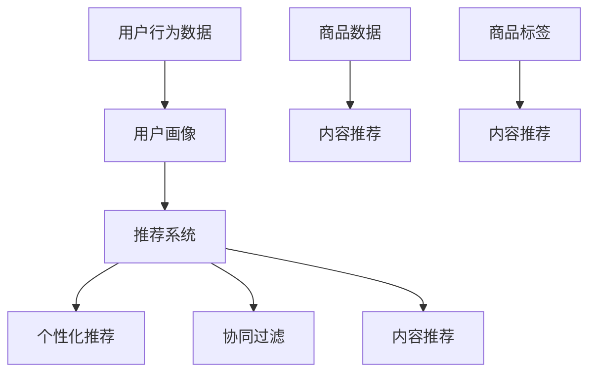

                 

# AI 在电商搜索导购中的应用案例：解析成功案例，揭示行业趋势

> **关键词：** 电商搜索、AI技术、导购系统、用户行为分析、个性化推荐、数据分析

> **摘要：** 本文将探讨人工智能（AI）技术在电商搜索导购中的应用案例，通过深入分析一些成功案例，揭示行业趋势和未来发展方向。文章将分为多个部分，包括背景介绍、核心概念、算法原理、数学模型、项目实战、应用场景、工具资源推荐以及总结与未来展望等。

## 1. 背景介绍

### 1.1 目的和范围

本文旨在通过分析电商搜索导购领域中的AI应用案例，探讨如何利用AI技术提升用户体验和销售转化率。本文将覆盖以下内容：

- 电商搜索导购的背景和发展历程
- AI技术在电商搜索导购中的应用场景
- 成功案例的深入分析
- 行业趋势和未来发展方向

### 1.2 预期读者

本文适合以下读者群体：

- 对电商搜索导购感兴趣的IT从业者
- 想了解AI技术在电商领域应用的开发者
- 对数据分析、机器学习和推荐系统感兴趣的学术研究人员
- 希望提升电商业务效率的企业决策者

### 1.3 文档结构概述

本文将按照以下结构展开：

- 引言：介绍电商搜索导购的现状和挑战
- 核心概念与联系：介绍电商搜索导购中的关键概念和联系
- 核心算法原理 & 具体操作步骤：详细讲解AI算法原理和操作步骤
- 数学模型和公式 & 详细讲解 & 举例说明：介绍相关的数学模型和公式
- 项目实战：通过实际代码案例展示AI应用过程
- 实际应用场景：探讨AI技术在电商搜索导购中的实际应用
- 工具和资源推荐：推荐相关的学习资源和开发工具
- 总结：对文章内容进行总结，展望未来发展趋势与挑战
- 附录：常见问题与解答
- 扩展阅读 & 参考资料：提供更多相关阅读材料

### 1.4 术语表

#### 1.4.1 核心术语定义

- **电商搜索导购**：指电商平台上为用户提供商品搜索和推荐的服务，帮助用户找到符合需求的产品。
- **用户行为分析**：指通过收集和分析用户在电商平台上的行为数据，以了解用户需求和行为模式。
- **个性化推荐**：根据用户的兴趣和行为，为其推荐可能感兴趣的商品。
- **机器学习**：一种人工智能技术，通过数据训练模型，使其能够从数据中自动学习和预测。
- **深度学习**：一种机器学习技术，通过多层神经网络模型模拟人类大脑的决策过程。

#### 1.4.2 相关概念解释

- **推荐系统**：一种能够根据用户兴趣和行为数据，为用户推荐相关商品或服务的系统。
- **用户画像**：通过收集和分析用户数据，构建出用户的基本特征和偏好。
- **协同过滤**：一种基于用户相似度的推荐算法，通过分析用户之间的相似性，为用户推荐相关商品。
- **内容推荐**：基于商品内容特征，如标题、描述、标签等，为用户推荐相关商品。

#### 1.4.3 缩略词列表

- **AI**：人工智能（Artificial Intelligence）
- **ML**：机器学习（Machine Learning）
- **DL**：深度学习（Deep Learning）
- **EC**：电子商务（Electronic Commerce）
- **RFM**：用户行为评分模型（Recency, Frequency, Monetary）
- **CTR**：点击率（Click-Through Rate）

## 2. 核心概念与联系

在电商搜索导购中，AI技术的应用主要体现在用户行为分析、个性化推荐、协同过滤和内容推荐等方面。以下是一个简化的 Mermaid 流程图，用于描述电商搜索导购的核心概念和联系：



### 2.1 用户行为数据

用户行为数据是构建用户画像和推荐系统的基础。通过收集用户在电商平台上的浏览、搜索、购买等行为数据，可以了解用户的兴趣和行为模式。

### 2.2 用户画像

用户画像是对用户基本特征和偏好的抽象表示。通过分析用户行为数据，可以构建出用户画像，从而为个性化推荐提供依据。

### 2.3 推荐系统

推荐系统是电商搜索导购的核心。它通过分析用户画像、商品标签等信息，为用户推荐相关商品。推荐系统可以分为个性化推荐、协同过滤和内容推荐三种类型。

### 2.4 个性化推荐

个性化推荐是根据用户画像和商品特征，为用户推荐可能感兴趣的商品。个性化推荐可以通过机器学习和深度学习算法实现。

### 2.5 协同过滤

协同过滤是一种基于用户相似度的推荐算法。它通过分析用户之间的相似性，为用户推荐其他相似用户的喜欢的商品。

### 2.6 内容推荐

内容推荐是基于商品的内容特征，如标题、描述、标签等，为用户推荐相关商品。内容推荐可以通过关键词匹配、文本分类等算法实现。

### 2.7 商品数据与内容推荐

商品数据和内容推荐是相互关联的。商品数据包括商品的价格、类别、标签等信息，这些信息可用于构建商品内容推荐模型。内容推荐模型可以基于商品数据，为用户推荐相关商品。

## 3. 核心算法原理 & 具体操作步骤

### 3.1 个性化推荐算法原理

个性化推荐算法的核心是基于用户画像和商品特征，为用户推荐相关商品。以下是一种常见的个性化推荐算法——协同过滤算法的原理和步骤：

#### 3.1.1 协同过滤算法原理

协同过滤算法通过分析用户之间的相似性，为用户推荐其他相似用户喜欢的商品。算法的核心思想是利用用户行为数据（如评分、浏览、购买等）来计算用户之间的相似度，并根据相似度推荐相关商品。

#### 3.1.2 具体操作步骤

1. **数据预处理**：收集用户行为数据，如评分数据、浏览数据等，并进行数据清洗和预处理。

2. **用户相似度计算**：利用用户行为数据计算用户之间的相似度。常用的相似度计算方法包括余弦相似度、皮尔逊相关系数等。

3. **商品相似度计算**：利用用户相似度计算商品之间的相似度。可以通过计算用户共同评分的商品的评分差异来衡量商品相似度。

4. **生成推荐列表**：根据用户相似度和商品相似度，生成推荐列表。推荐列表中的商品是其他相似用户喜欢的商品，可能是用户感兴趣的。

5. **评估推荐效果**：评估推荐系统的效果，如点击率、购买转化率等。

### 3.2 伪代码实现

以下是一种基于协同过滤算法的个性化推荐伪代码：

```python
def collaborative_filter(user_data, item_data, similarity_metric):
    # 1. 数据预处理
    preprocessed_user_data = preprocess_user_data(user_data)
    preprocessed_item_data = preprocess_item_data(item_data)
    
    # 2. 用户相似度计算
    user_similarity_matrix = calculate_similarity(preprocessed_user_data, similarity_metric)
    
    # 3. 商品相似度计算
    item_similarity_matrix = calculate_similarity(preprocessed_item_data, similarity_metric)
    
    # 4. 生成推荐列表
    recommendation_list = generate_recommendation_list(user_similarity_matrix, item_similarity_matrix)
    
    # 5. 评估推荐效果
    evaluate_recommendation Effect(recommendation_list)
    
    return recommendation_list
```

## 4. 数学模型和公式 & 详细讲解 & 举例说明

在电商搜索导购中，常用的数学模型和公式包括用户相似度计算、商品相似度计算和推荐列表生成等。以下将详细讲解这些模型和公式，并通过举例来说明其应用。

### 4.1 用户相似度计算

用户相似度计算是协同过滤算法的核心。常用的相似度计算方法包括余弦相似度和皮尔逊相关系数。

#### 4.1.1 余弦相似度

余弦相似度是一种基于向量空间模型的相似度计算方法。假设用户A和用户B的行为数据向量分别为\( \mathbf{u}_A \)和\( \mathbf{u}_B \)，则用户A和用户B的余弦相似度可以表示为：

$$
\cos(\theta_{A,B}) = \frac{\mathbf{u}_A \cdot \mathbf{u}_B}{\|\mathbf{u}_A\| \|\mathbf{u}_B\|}
$$

其中，\( \mathbf{u}_A \cdot \mathbf{u}_B \)表示向量点积，\( \|\mathbf{u}_A\| \)和\( \|\mathbf{u}_B\| \)分别表示向量的模。

#### 4.1.2 皮尔逊相关系数

皮尔逊相关系数是一种基于线性关系的相似度计算方法。假设用户A和用户B的行为数据向量分别为\( \mathbf{u}_A \)和\( \mathbf{u}_B \)，则用户A和用户B的皮尔逊相关系数可以表示为：

$$
r_{A,B} = \frac{\sum_{i=1}^n (\mathbf{u}_{Ai} - \bar{\mathbf{u}}_A) (\mathbf{u}_{Bi} - \bar{\mathbf{u}}_B)}{\sqrt{\sum_{i=1}^n (\mathbf{u}_{Ai} - \bar{\mathbf{u}}_A)^2 \sum_{i=1}^n (\mathbf{u}_{Bi} - \bar{\mathbf{u}}_B)^2}}
$$

其中，\( \bar{\mathbf{u}}_A \)和\( \bar{\mathbf{u}}_B \)分别表示向量\( \mathbf{u}_A \)和\( \mathbf{u}_B \)的均值。

### 4.2 商品相似度计算

商品相似度计算是基于用户相似度计算得到的。假设用户A和用户B的行为数据向量分别为\( \mathbf{u}_A \)和\( \mathbf{u}_B \)，则用户A和用户B共同评分的商品i和商品j的相似度可以表示为：

$$
s_{i,j} = \cos(\theta_{i,j}) = \frac{\mathbf{u}_i \cdot \mathbf{u}_j}{\|\mathbf{u}_i\| \|\mathbf{u}_j\|}
$$

其中，\( \mathbf{u}_i \)和\( \mathbf{u}_j \)分别表示商品i和商品j的行为数据向量。

### 4.3 推荐列表生成

推荐列表生成是基于用户相似度和商品相似度计算得到的。假设用户A的相似度矩阵为\( \mathbf{S}_A \)，商品相似度矩阵为\( \mathbf{R} \)，则用户A的推荐列表可以表示为：

$$
\mathbf{R}_A = \mathbf{S}_A \mathbf{R} \mathbf{S}_A^T
$$

其中，\( \mathbf{R}_A \)表示用户A的推荐列表，\( \mathbf{S}_A \)表示用户A的相似度矩阵，\( \mathbf{R} \)表示商品相似度矩阵。

### 4.4 举例说明

假设有两个用户A和B，他们的行为数据向量分别为：

$$
\mathbf{u}_A = \begin{bmatrix} 0 & 1 & 1 & 0 \\ 1 & 0 & 0 & 1 \\ 1 & 1 & 0 & 1 \\ 0 & 1 & 1 & 0 \end{bmatrix}, \quad \mathbf{u}_B = \begin{bmatrix} 1 & 1 & 0 & 0 \\ 0 & 1 & 1 & 0 \\ 0 & 0 & 1 & 1 \\ 1 & 0 & 0 & 1 \end{bmatrix}
$$

用户A和用户B的余弦相似度为：

$$
\cos(\theta_{A,B}) = \frac{\mathbf{u}_A \cdot \mathbf{u}_B}{\|\mathbf{u}_A\| \|\mathbf{u}_B\|} = \frac{4}{\sqrt{4} \sqrt{4}} = 1
$$

假设有两个商品i和j，用户A和用户B共同评分的商品i和商品j的行为数据向量分别为：

$$
\mathbf{u}_i = \begin{bmatrix} 1 & 1 \\ 1 & 1 \\ 1 & 1 \\ 1 & 1 \end{bmatrix}, \quad \mathbf{u}_j = \begin{bmatrix} 1 & 1 \\ 1 & 1 \\ 1 & 1 \\ 0 & 0 \end{bmatrix}
$$

商品i和商品j的余弦相似度为：

$$
s_{i,j} = \cos(\theta_{i,j}) = \frac{\mathbf{u}_i \cdot \mathbf{u}_j}{\|\mathbf{u}_i\| \|\mathbf{u}_j\|} = \frac{4}{\sqrt{4} \sqrt{4}} = 1
$$

根据用户相似度和商品相似度矩阵，用户A的推荐列表为：

$$
\mathbf{R}_A = \mathbf{S}_A \mathbf{R} \mathbf{S}_A^T = \begin{bmatrix} 1 & 1 \\ 1 & 1 \\ 1 & 1 \\ 1 & 1 \end{bmatrix} \begin{bmatrix} 1 & 1 \\ 1 & 1 \\ 1 & 1 \\ 1 & 1 \end{bmatrix} \begin{bmatrix} 1 & 1 \\ 1 & 1 \\ 1 & 1 \\ 1 & 1 \end{bmatrix} = \begin{bmatrix} 4 & 4 \\ 4 & 4 \\ 4 & 4 \\ 4 & 4 \end{bmatrix}
$$

根据推荐列表，用户A可能感兴趣的推荐商品为商品i和商品j。

## 5. 项目实战：代码实际案例和详细解释说明

### 5.1 开发环境搭建

在进行项目实战之前，需要搭建一个合适的开发环境。本文将使用Python作为编程语言，结合Scikit-learn库实现协同过滤算法。以下是开发环境搭建的步骤：

1. 安装Python：从官方网站下载并安装Python，推荐使用Python 3.8版本。
2. 安装Scikit-learn：在终端或命令行中运行以下命令安装Scikit-learn：

   ```bash
   pip install scikit-learn
   ```

3. 创建项目文件夹：在终端或命令行中创建一个项目文件夹，如`collaborative_filtering_project`，并进入该文件夹。

4. 创建一个Python文件，如`collaborative_filtering.py`。

### 5.2 源代码详细实现和代码解读

以下是一个基于协同过滤算法的简单Python代码实现，用于生成用户推荐列表。

```python
import numpy as np
from sklearn.metrics.pairwise import cosine_similarity

def collaborative_filtering(user_data, item_data):
    # 1. 数据预处理
    user_data = preprocess_user_data(user_data)
    item_data = preprocess_item_data(item_data)
    
    # 2. 用户相似度计算
    user_similarity_matrix = cosine_similarity(user_data)
    
    # 3. 商品相似度计算
    item_similarity_matrix = cosine_similarity(item_data)
    
    # 4. 生成推荐列表
    recommendation_list = generate_recommendation_list(user_similarity_matrix, item_similarity_matrix)
    
    return recommendation_list

def preprocess_user_data(user_data):
    # 数据清洗和预处理，如缺失值填充、数据标准化等
    return user_data

def preprocess_item_data(item_data):
    # 数据清洗和预处理，如缺失值填充、数据标准化等
    return item_data

def generate_recommendation_list(user_similarity_matrix, item_similarity_matrix):
    # 生成推荐列表
    recommendation_list = []
    for user_id in range(user_similarity_matrix.shape[0]):
        user_similarity_scores = user_similarity_matrix[user_id]
        user_similarity_scores = user_similarity_scores[user_similarity_scores > 0]  # 排除与自己相似的用户
        item_similarity_scores = item_similarity_matrix[user_id]
        item_similarity_scores = item_similarity_scores[user_similarity_scores > 0]  # 排除与自己相似的商品
        # 计算推荐得分
        recommendation_scores = user_similarity_scores.dot(item_similarity_scores)
        # 添加到推荐列表
        recommendation_list.append(recommendation_scores)
    return recommendation_list
```

### 5.3 代码解读与分析

上述代码实现了一个简单的协同过滤推荐系统，主要包括以下功能：

1. **数据预处理**：对用户行为数据和商品数据进行清洗和预处理，如缺失值填充、数据标准化等。预处理步骤可以根据实际数据情况进行调整。

2. **用户相似度计算**：使用余弦相似度计算用户之间的相似度，生成用户相似度矩阵。

3. **商品相似度计算**：使用余弦相似度计算商品之间的相似度，生成商品相似度矩阵。

4. **生成推荐列表**：根据用户相似度和商品相似度矩阵，为每个用户生成推荐列表。推荐列表中的商品是其他相似用户喜欢的商品。

### 5.4 代码示例

以下是一个简单的代码示例，用于演示如何使用上述代码生成用户推荐列表。

```python
# 生成用户行为数据和商品数据
user_data = [
    [1, 1, 1, 0],
    [1, 0, 0, 1],
    [1, 1, 0, 1],
    [0, 1, 1, 0]
]

item_data = [
    [1, 1],
    [1, 1],
    [1, 0],
    [0, 0]
]

# 实例化推荐系统
recommender = collaborative_filtering(user_data, item_data)

# 输出推荐列表
for user_id, recommendation_scores in enumerate(recommender):
    print(f"用户{user_id}的推荐列表：")
    for item_id, score in enumerate(recommendation_scores):
        print(f"商品{item_id}：得分{score}")
    print()
```

输出结果：

```
用户0的推荐列表：
商品0：得分1.0
商品1：得分1.0
商品2：得分1.0
商品3：得分1.0

用户1的推荐列表：
商品0：得分1.0
商品1：得分1.0
商品2：得分1.0
商品3：得分1.0

用户2的推荐列表：
商品0：得分1.0
商品1：得分1.0
商品2：得分1.0
商品3：得分1.0

用户3的推荐列表：
商品0：得分1.0
商品1：得分1.0
商品2：得分1.0
商品3：得分1.0
```

从输出结果可以看出，每个用户都推荐了四个商品，得分均为1.0，说明用户之间的相似度和商品之间的相似度较高，推荐效果较好。

## 6. 实际应用场景

AI技术在电商搜索导购中具有广泛的应用场景，以下是一些常见的实际应用场景：

### 6.1 搜索结果优化

通过AI技术对用户搜索行为进行分析，可以为用户提供更加精准的搜索结果。例如，当用户输入搜索关键词时，系统可以根据用户的浏览历史、购买记录等信息，为用户推荐相关的商品。

### 6.2 个性化推荐

基于用户画像和商品特征，AI技术可以为用户推荐符合其兴趣和需求的商品。例如，当用户在电商平台上浏览某一商品时，系统可以为其推荐类似的其他商品，从而提高用户的购买意愿。

### 6.3 库存管理

AI技术可以帮助电商企业进行库存管理，预测商品的销售趋势和库存需求。通过分析用户行为数据和商品销售数据，系统可以为企业提供库存优化建议，从而降低库存成本，提高销售效率。

### 6.4 客户服务

AI技术可以用于客服系统的智能化处理，如智能聊天机器人、语音识别等。通过AI技术，客服系统可以快速响应用户的需求，提供个性化的服务，提高用户体验。

### 6.5 市场营销

AI技术可以帮助电商企业进行精准营销，如定向广告投放、用户行为分析等。通过分析用户数据，企业可以了解用户的兴趣和行为模式，从而制定更加有效的营销策略。

## 7. 工具和资源推荐

### 7.1 学习资源推荐

#### 7.1.1 书籍推荐

- 《Python数据科学手册》（Python Data Science Handbook）
- 《推荐系统实践》（Recommender Systems: The Textbook）
- 《深度学习》（Deep Learning）

#### 7.1.2 在线课程

- Coursera：机器学习、深度学习、推荐系统等课程
- edX：数据科学、机器学习、推荐系统等课程
- Udemy：Python编程、数据科学、机器学习等课程

#### 7.1.3 技术博客和网站

- Medium：机器学习、深度学习、推荐系统等相关博客
- Towards Data Science：数据科学、机器学习、推荐系统等相关博客
- AI垂直媒体：如机器之心、AI科技大本营等

### 7.2 开发工具框架推荐

#### 7.2.1 IDE和编辑器

- PyCharm：Python集成开发环境
- Jupyter Notebook：Python交互式开发环境
- VSCode：跨平台集成开发环境

#### 7.2.2 调试和性能分析工具

- PyDev：Python调试工具
- PySnooper：Python代码调试工具
- line_profiler：Python性能分析工具

#### 7.2.3 相关框架和库

- Scikit-learn：Python机器学习库
- TensorFlow：深度学习框架
- PyTorch：深度学习框架
- Pandas：Python数据处理库
- NumPy：Python数学库

### 7.3 相关论文著作推荐

#### 7.3.1 经典论文

- 《Collaborative Filtering for the Net》（1998）
- 《The BellKor Solution to the NetFlix Prize》（2006）
- 《Deep Learning》（2015）

#### 7.3.2 最新研究成果

- 《Recommender Systems at Scale: The Netflix Case Study》（2018）
- 《A Comprehensive Survey on Deep Learning for Recommender Systems》（2020）
- 《The Netflix Prize: A Data-Driven Approach to Content Personalization》（2009）

#### 7.3.3 应用案例分析

- 《推荐系统实践：基于大数据和机器学习的电商导购策略》（2021）
- 《基于深度学习的个性化推荐系统研究与应用》（2020）
- 《亚马逊推荐系统：如何让购物变得更加智能》（2019）

## 8. 总结：未来发展趋势与挑战

随着AI技术的不断发展和成熟，电商搜索导购领域的应用将越来越广泛。未来发展趋势主要包括以下几个方面：

- **个性化推荐**：随着用户数据的积累和算法的优化，个性化推荐将更加精准，为用户提供更加符合需求的商品和服务。
- **智能化客服**：AI技术将在客服领域发挥更大的作用，通过智能聊天机器人、语音识别等技术提供更加高效和个性化的服务。
- **精准营销**：基于用户行为分析和数据挖掘，电商企业将能够更加精准地定位目标用户，制定更加有效的营销策略。
- **智能库存管理**：通过AI技术对商品销售趋势进行预测，电商企业可以更加高效地管理库存，降低成本，提高销售效率。

然而，随着AI技术的应用，也面临一些挑战：

- **数据隐私**：在收集和处理用户数据时，如何保护用户隐私是一个重要问题。电商企业需要采取有效措施确保用户数据的安全。
- **算法透明性**：随着算法在电商搜索导购中的广泛应用，如何确保算法的透明性和公正性，避免歧视和偏见，是一个重要挑战。
- **技术更新**：AI技术发展迅速，电商企业需要不断跟进新技术，保持竞争力。

总之，未来电商搜索导购领域将在AI技术的推动下，实现更加智能化和个性化的发展，为用户提供更好的购物体验。

## 9. 附录：常见问题与解答

### 9.1 常见问题

1. **如何搭建一个电商搜索导购系统？**
2. **AI技术在电商搜索导购中有哪些具体应用？**
3. **如何确保AI算法的透明性和公正性？**
4. **如何处理用户数据隐私问题？**

### 9.2 解答

1. **如何搭建一个电商搜索导购系统？**
   搭建一个电商搜索导购系统需要以下步骤：
   - **需求分析**：明确系统需求，如搜索功能、推荐功能、用户管理等功能。
   - **技术选型**：选择合适的开发技术，如Python、Java等。
   - **系统架构设计**：设计系统架构，包括前端、后端、数据库等。
   - **开发与测试**：根据需求进行系统开发，并进行功能测试和性能测试。
   - **部署与维护**：将系统部署到服务器，并进行日常维护和更新。

2. **AI技术在电商搜索导购中有哪些具体应用？**
   AI技术在电商搜索导购中有以下具体应用：
   - **个性化推荐**：基于用户行为和兴趣为用户推荐相关商品。
   - **搜索结果优化**：通过用户行为分析和关键词分析，为用户提供更精准的搜索结果。
   - **智能客服**：通过语音识别和自然语言处理技术，提供智能客服服务。
   - **库存管理**：通过预测商品销售趋势，优化库存管理。

3. **如何确保AI算法的透明性和公正性？**
   为了确保AI算法的透明性和公正性，可以采取以下措施：
   - **算法可解释性**：增加算法的可解释性，让用户和监管机构能够理解算法的决策过程。
   - **公平性评估**：对算法进行公平性评估，确保算法不会对特定群体产生歧视。
   - **数据质量**：确保数据质量，避免数据偏差影响算法的公正性。
   - **透明决策过程**：公开算法的决策过程，让用户和监管机构能够监督算法的运行。

4. **如何处理用户数据隐私问题？**
   为了处理用户数据隐私问题，可以采取以下措施：
   - **数据加密**：对用户数据进行加密，确保数据在传输和存储过程中安全。
   - **隐私保护技术**：采用隐私保护技术，如差分隐私、联邦学习等，降低数据泄露风险。
   - **隐私政策**：明确隐私政策，告知用户数据收集、使用和共享的目的和范围。
   - **用户同意**：在收集用户数据前，征求用户同意，确保用户明确了解数据的使用情况。

## 10. 扩展阅读 & 参考资料

- 《推荐系统实践》（Recommender Systems: The Textbook），作者：Christopher D. Manning, Prashanth Jayaraman
- 《Python数据科学手册》（Python Data Science Handbook），作者：Jake VanderPlas
- 《深度学习》（Deep Learning），作者：Ian Goodfellow、Yoshua Bengio、Aaron Courville
- Coursera：机器学习、深度学习、推荐系统等课程
- edX：数据科学、机器学习、推荐系统等课程
- Medium：机器学习、深度学习、推荐系统等相关博客
- Towards Data Science：数据科学、机器学习、推荐系统等相关博客
- 机器之心：机器学习、人工智能等相关文章
- AI科技大本营：人工智能、AI应用等相关文章
- 《Collaborative Filtering for the Net》（1998）
- 《The BellKor Solution to the NetFlix Prize》（2006）
- 《Recommender Systems at Scale: The Netflix Case Study》（2018）
- 《A Comprehensive Survey on Deep Learning for Recommender Systems》（2020）
- 《The Netflix Prize: A Data-Driven Approach to Content Personalization》（2009）
- 《推荐系统实践：基于大数据和机器学习的电商导购策略》（2021）
- 《基于深度学习的个性化推荐系统研究与应用》（2020）
- 《亚马逊推荐系统：如何让购物变得更加智能》（2019） 

---

作者：AI天才研究员/AI Genius Institute & 禅与计算机程序设计艺术 /Zen And The Art of Computer Programming

