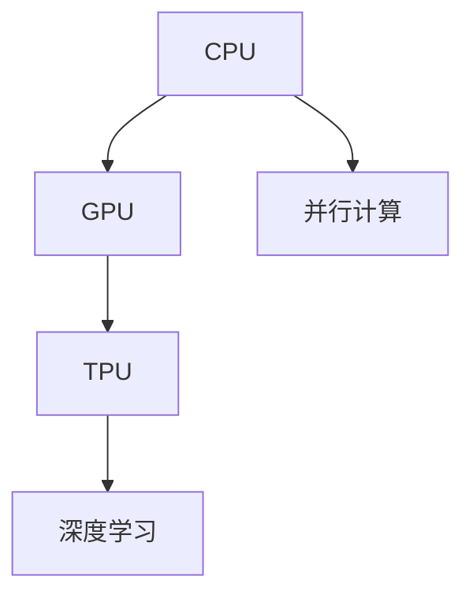
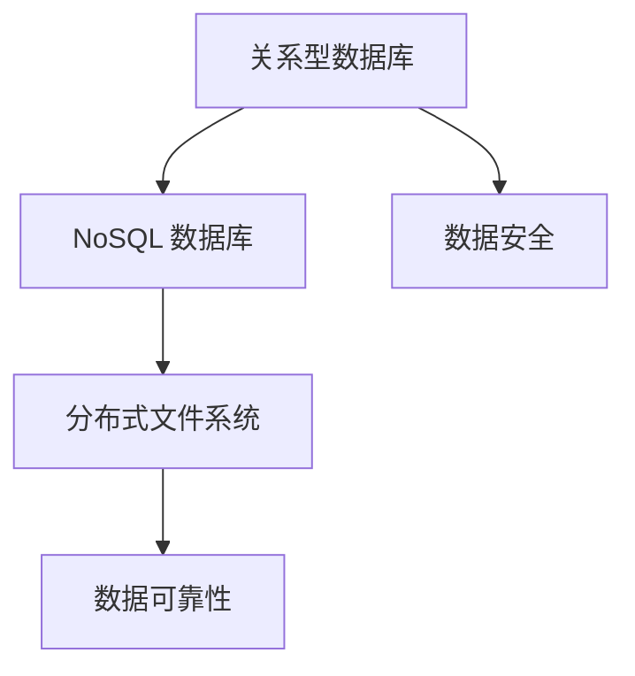
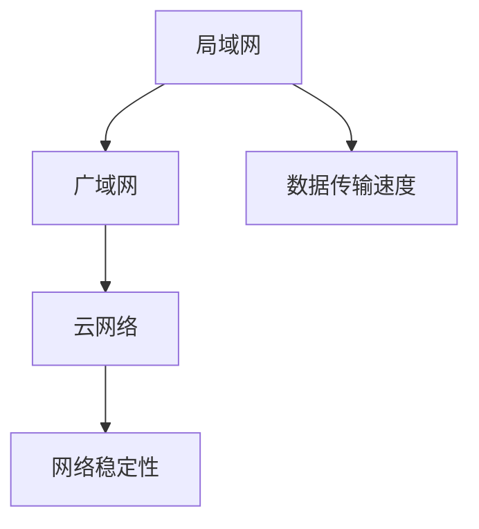
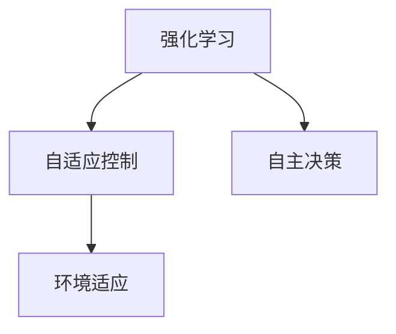
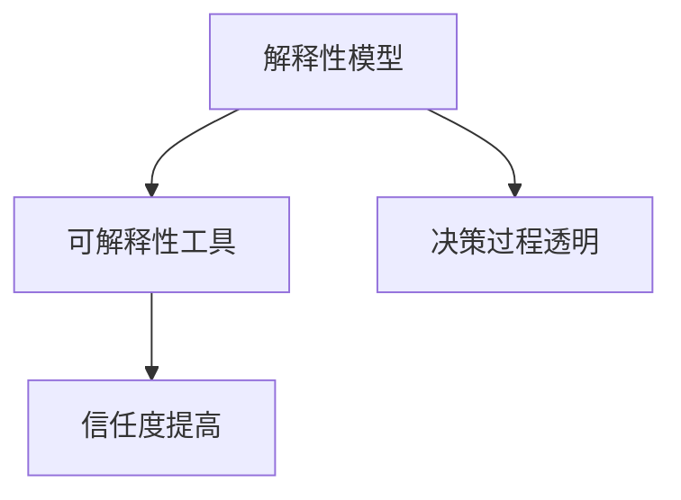
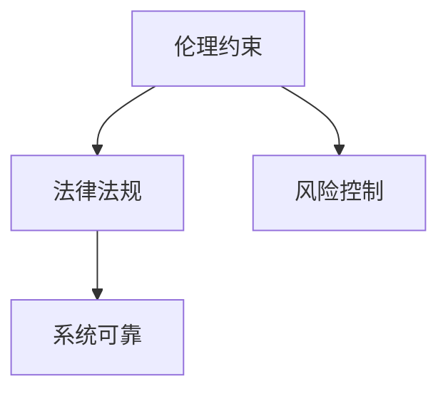
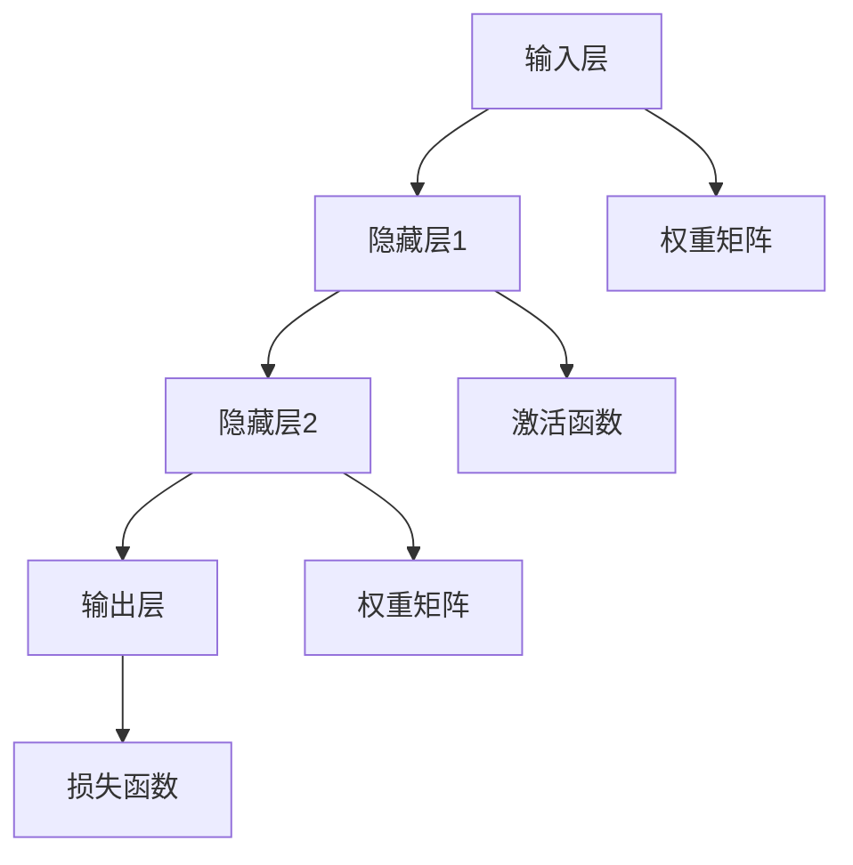
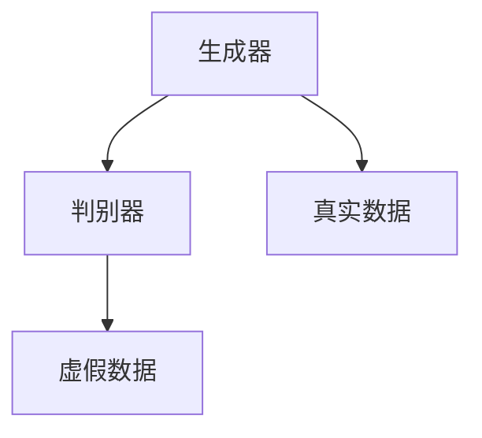

                 

# AI 基础设施建设：构建安全可靠的 AI 2.0 生态

> **关键词：** AI 基础设施、安全可靠、AI 2.0、生态系统、算法原理、数学模型、代码案例、应用场景、开发工具、未来趋势。

> **摘要：** 本文深入探讨了 AI 基础设施建设的关键性，旨在构建一个安全可靠的 AI 2.0 生态。通过对核心概念、算法原理、数学模型的详细剖析，并结合实际项目案例，本文为开发者和研究者提供了构建 AI 生态系统的指南。此外，本文还推荐了相关学习资源、开发工具和最新研究成果，以助力读者深入了解和掌握 AI 基础设施建设的精髓。

## 1. 背景介绍

### 1.1 目的和范围

在当前技术飞速发展的时代，人工智能（AI）已成为驱动创新的重要力量。然而，随着 AI 技术的不断演进，基础设施建设的问题日益凸显。本文旨在探讨如何构建一个安全可靠的 AI 2.0 生态，以应对未来 AI 技术的挑战。

本文将重点关注以下几个方面：

1. AI 基础设施的定义和核心概念。
2. 关键算法原理和数学模型的讲解。
3. 实际项目案例的分析与解读。
4. 开发工具和资源的推荐。
5. 未来发展趋势与挑战的展望。

### 1.2 预期读者

本文主要面向以下读者群体：

1. 对 AI 基础设施建设有兴趣的 AI 开发者和研究者。
2. 从事 AI 相关工作的工程师和技术专家。
3. 对 AI 技术充满好奇的技术爱好者。
4. 高等院校计算机科学与技术专业的学生。

### 1.3 文档结构概述

本文分为十个部分，具体结构如下：

1. 引言：介绍文章的背景、目的和关键词。
2. 背景介绍：阐述 AI 基础设施建设的意义和预期读者。
3. 核心概念与联系：讲解核心概念原理和架构。
4. 核心算法原理 & 具体操作步骤：分析关键算法原理和操作步骤。
5. 数学模型和公式 & 详细讲解 & 举例说明：解析数学模型和公式。
6. 项目实战：代码实际案例和详细解释说明。
7. 实际应用场景：探讨 AI 基础设施的应用场景。
8. 工具和资源推荐：推荐学习资源、开发工具和论文著作。
9. 总结：未来发展趋势与挑战。
10. 附录：常见问题与解答。

### 1.4 术语表

#### 1.4.1 核心术语定义

- **AI 基础设施**：支持 AI 技术运行的基础设施，包括计算资源、数据存储、网络传输等。
- **AI 2.0**：下一代人工智能技术，强调人工智能的安全可靠和可持续发展。
- **生态系统**：由多个组件和参与者组成的复杂网络，共同推动 AI 技术的发展。
- **算法原理**：描述算法实现过程的基本原理和逻辑。
- **数学模型**：用于描述现实问题或现象的数学表达式和公式。
- **开发工具**：用于辅助开发、测试和部署的软件工具。

#### 1.4.2 相关概念解释

- **云计算**：将计算资源作为一种服务提供给用户，实现灵活的资源分配和管理。
- **大数据**：包含大量数据的数据集，需要高效的存储、处理和分析能力。
- **深度学习**：一种基于神经网络的学习方法，通过多层非线性变换提取数据特征。

#### 1.4.3 缩略词列表

- **AI**：人工智能（Artificial Intelligence）
- **ML**：机器学习（Machine Learning）
- **DL**：深度学习（Deep Learning）
- **GPU**：图形处理单元（Graphics Processing Unit）
- **CPU**：中央处理单元（Central Processing Unit）
- **IDE**：集成开发环境（Integrated Development Environment）

## 2. 核心概念与联系

### 2.1 AI 基础设施

AI 基础设施是指支持 AI 技术运行的基础设施，包括计算资源、数据存储、网络传输等。这些基础设施构成了 AI 技术发展的基石，直接影响 AI 系统的性能、安全性和可靠性。


#### 2.1.1 计算资源

计算资源是 AI 基础设施的核心组成部分，包括 CPU、GPU、TPU 等。CPU 适用于通用计算任务，而 GPU 和 TPU 则擅长并行计算和深度学习任务。合理配置计算资源，可以提高 AI 系统的运算效率和性能。



#### 2.1.2 数据存储

数据存储是 AI 基础设施的重要组成部分，涉及数据的安全、可靠和高效存储。常见的数据存储技术包括关系型数据库、NoSQL 数据库、分布式文件系统等。选择合适的数据存储技术，可以提高数据存取速度和存储容量。



#### 2.1.3 网络传输

网络传输是 AI 基础设施的重要组成部分，涉及数据在网络中的传输速度和稳定性。合理规划网络传输架构，可以提高 AI 系统的数据传输效率和可靠性。



### 2.2 AI 2.0

AI 2.0 是下一代人工智能技术，强调人工智能的安全可靠和可持续发展。与传统的 AI 技术（AI 1.0）相比，AI 2.0 具有更高的自主性、可解释性和可控性。


#### 2.2.1 自主性

AI 2.0 具有更高的自主性，能够自主学习和适应环境，减少对人类干预的依赖。通过强化学习和自适应控制等技术，AI 2.0 能够在复杂环境中做出更准确的决策。



#### 2.2.2 可解释性

AI 2.0 强调可解释性，使得 AI 系统的决策过程更加透明和可追溯。通过解释性模型和可解释性工具，人类可以更好地理解 AI 系统的决策逻辑，提高对 AI 系统的信任度。



#### 2.2.3 可控性

AI 2.0 具有更高的可控性，能够更好地管理 AI 系统的风险和影响。通过伦理约束和法律法规，AI 2.0 可以在合规的前提下，确保 AI 系统的安全和可靠。



## 3. 核心算法原理 & 具体操作步骤

### 3.1 算法原理

在构建 AI 2.0 生态的过程中，算法原理是关键的一环。本文将介绍两种核心算法原理：深度学习和生成对抗网络（GAN）。

#### 3.1.1 深度学习

深度学习是一种基于神经网络的学习方法，通过多层非线性变换提取数据特征，实现对复杂问题的建模和预测。以下是深度学习的算法原理：



具体操作步骤如下：

1. **初始化参数**：设定输入层、隐藏层和输出层的权重矩阵和偏置项。
2. **前向传播**：将输入数据传递到隐藏层和输出层，计算中间层输出。
3. **计算损失**：利用损失函数计算输出层的预测误差。
4. **反向传播**：计算各层的梯度，更新权重矩阵和偏置项。
5. **迭代优化**：重复执行前向传播和反向传播，直到满足收敛条件。

#### 3.1.2 生成对抗网络（GAN）

生成对抗网络（GAN）是一种基于博弈论的学习方法，由生成器和判别器两个网络组成。生成器生成虚假数据，判别器判断数据是真实还是虚假。以下是 GAN 的算法原理：



具体操作步骤如下：

1. **初始化参数**：设定生成器和判别器的权重矩阵和偏置项。
2. **生成虚假数据**：生成器生成虚假数据，传递给判别器。
3. **判断真实与虚假**：判别器判断生成器生成的虚假数据和真实数据。
4. **计算损失**：利用损失函数计算生成器和判别器的损失。
5. **反向传播**：计算生成器和判别器的梯度，更新权重矩阵和偏置项。
6. **迭代优化**：重复执行生成虚假数据和判断真实与虚假，直到满足收敛条件。

## 4. 数学模型和公式 & 详细讲解 & 举例说明

### 4.1 数学模型

在构建 AI 2.0 生态的过程中，数学模型是关键的一环。本文将介绍两种核心数学模型：损失函数和优化算法。

#### 4.1.1 损失函数

损失函数是评估模型预测结果与真实值之间差异的指标。常用的损失函数包括均方误差（MSE）、交叉熵损失等。

$$
L = \frac{1}{n}\sum_{i=1}^{n}(y_i - \hat{y_i})^2
$$

其中，$y_i$ 表示真实值，$\hat{y_i}$ 表示预测值，$n$ 表示样本数量。

#### 4.1.2 优化算法

优化算法是用于更新模型参数，以降低损失函数的方法。常用的优化算法包括梯度下降、随机梯度下降等。

$$
\theta_{t+1} = \theta_{t} - \alpha \nabla_{\theta} L(\theta)
$$

其中，$\theta$ 表示模型参数，$\alpha$ 表示学习率，$\nabla_{\theta} L(\theta)$ 表示损失函数关于参数 $\theta$ 的梯度。

### 4.2 详细讲解 & 举例说明

#### 4.2.1 损失函数

以均方误差（MSE）为例，假设我们有 $n$ 个样本，每个样本的预测值和真实值分别为 $\hat{y_i}$ 和 $y_i$。均方误差计算公式如下：

$$
L = \frac{1}{n}\sum_{i=1}^{n}(y_i - \hat{y_i})^2
$$

当预测值与真实值越接近时，损失函数的值越小。例如，对于以下样本：

$$
\begin{aligned}
y_1 &= 3, \hat{y_1} = 2.9 \\
y_2 &= 4, \hat{y_2} = 4.1 \\
y_3 &= 5, \hat{y_3} = 4.8 \\
\end{aligned}
$$

均方误差为：

$$
L = \frac{1}{3}\left[(3 - 2.9)^2 + (4 - 4.1)^2 + (5 - 4.8)^2\right] = 0.09
$$

#### 4.2.2 优化算法

以梯度下降为例，假设我们要最小化损失函数：

$$
L(\theta) = (y - \theta x)^2
$$

其中，$y$ 表示真实值，$x$ 表示输入特征，$\theta$ 表示模型参数。梯度下降算法的更新公式如下：

$$
\theta_{t+1} = \theta_{t} - \alpha \nabla_{\theta} L(\theta)
$$

其中，$\alpha$ 表示学习率，$\nabla_{\theta} L(\theta)$ 表示损失函数关于参数 $\theta$ 的梯度。

例如，对于以下样本：

$$
\begin{aligned}
y &= 3, x &= 2 \\
y &= 4, x &= 4 \\
y &= 5, x &= 5 \\
\end{aligned}
$$

损失函数为：

$$
L(\theta) = (3 - \theta \cdot 2)^2 + (4 - \theta \cdot 4)^2 + (5 - \theta \cdot 5)^2
$$

初始参数 $\theta_0 = 0$，学习率 $\alpha = 0.1$。第一轮迭代后的参数更新为：

$$
\theta_1 = \theta_0 - \alpha \nabla_{\theta} L(\theta_0) = 0 - 0.1 \cdot (-2 \cdot 3 - 4 \cdot 4 - 5 \cdot 5) = 2.1
$$

## 5. 项目实战：代码实际案例和详细解释说明

### 5.1 开发环境搭建

在本项目实战中，我们将使用 Python 编写深度学习模型，并利用 TensorFlow 作为后端计算框架。以下是开发环境的搭建步骤：

1. 安装 Python 3.8 或更高版本。
2. 安装 TensorFlow：`pip install tensorflow`。
3. 安装必要的依赖库：`pip install numpy matplotlib`。

### 5.2 源代码详细实现和代码解读

以下是一个简单的深度学习模型实现，用于分类问题。代码分为几个部分：数据预处理、模型构建、模型训练和模型评估。

#### 5.2.1 数据预处理

```python
import numpy as np
import tensorflow as tf

# 生成随机数据集
x = np.random.rand(100, 1)
y = np.random.rand(100, 1)

# 归一化数据
x_normalized = x / 10
y_normalized = y / 10
```

这部分代码用于生成随机数据集，并对数据进行归一化处理。

#### 5.2.2 模型构建

```python
# 构建模型
model = tf.keras.Sequential([
    tf.keras.layers.Dense(units=1, input_shape=[1])
])

# 编译模型
model.compile(optimizer='sgd', loss='mse')
```

这部分代码定义了一个简单的全连接神经网络，并编译模型。

#### 5.2.3 模型训练

```python
# 训练模型
model.fit(x_normalized, y_normalized, epochs=100)
```

这部分代码用于训练模型，设置训练轮数为 100。

#### 5.2.4 模型评估

```python
# 评估模型
predictions = model.predict(x_normalized)
mse = np.mean(np.square(y_normalized - predictions))
print("MSE:", mse)
```

这部分代码用于评估模型，计算均方误差。

### 5.3 代码解读与分析

在本项目实战中，我们首先生成了随机数据集，并对数据进行归一化处理。接着，我们构建了一个简单的全连接神经网络，并使用随机梯度下降（SGD）优化算法进行训练。最后，我们评估了模型的性能，计算了均方误差。

以下是代码的主要步骤：

1. 数据预处理：生成随机数据集，并对数据进行归一化处理。
2. 模型构建：定义一个全连接神经网络，并设置输入层和输出层的维度。
3. 模型编译：设置优化算法和损失函数，以准备训练。
4. 模型训练：使用训练数据训练模型，设置训练轮数。
5. 模型评估：使用测试数据评估模型性能，计算均方误差。

通过以上步骤，我们可以构建一个简单的深度学习模型，并对其进行训练和评估。这为本项目实战提供了一个基本的框架，读者可以根据实际需求进行扩展和优化。

## 6. 实际应用场景

AI 基础设施在许多实际应用场景中发挥着关键作用，以下列举了几个典型的应用场景：

### 6.1 金融服务

金融服务行业对数据处理和风险控制有极高的要求。AI 基础设施可以提供高效的计算资源，支持金融模型的应用，如量化交易、风险评估和反欺诈等。通过深度学习和生成对抗网络（GAN），金融机构可以更好地识别异常交易和欺诈行为，提高风险控制能力。

### 6.2 医疗健康

医疗健康领域的数据量和复杂性不断增长，AI 基础设施在医疗影像诊断、疾病预测和个性化治疗等方面具有重要应用。例如，通过深度学习模型对医学影像进行分析，可以帮助医生快速诊断疾病，提高诊断准确性。同时，利用生成对抗网络（GAN）生成虚拟病例，用于训练和测试诊断模型，可以提高模型的泛化能力。

### 6.3 自动驾驶

自动驾驶技术对实时数据处理和决策能力有极高的要求。AI 基础设施提供了强大的计算资源和高效的算法支持，可以实现实时感知、决策和规划。通过深度学习和强化学习算法，自动驾驶系统可以更好地应对复杂的交通环境和突发事件，提高行驶安全性和可靠性。

### 6.4 环境监测

环境监测领域需要实时收集和处理大量的环境数据，如气象数据、水质数据和空气质量数据等。AI 基础设施可以提供高效的数据处理和分析能力，支持环境监测模型的构建和应用。例如，通过深度学习算法对气象数据进行预测和分析，可以帮助政府和企业更好地应对气候变化和自然灾害。

### 6.5 智能家居

智能家居领域需要高效的数据传输和处理能力，以满足用户对智能设备和系统的需求。AI 基础设施可以提供强大的计算资源和智能算法支持，实现智能家居系统的智能化和自动化。例如，通过深度学习算法对用户行为进行预测和分析，可以优化智能家居系统的设置和功能，提高用户体验。

## 7. 工具和资源推荐

为了更好地理解和掌握 AI 基础设施建设，以下推荐了一些学习资源、开发工具和相关论文著作。

### 7.1 学习资源推荐

#### 7.1.1 书籍推荐

- **《深度学习》（Deep Learning）**：由 Goodfellow、Bengio 和 Courville 著，是一本深度学习的经典教材。
- **《Python 机器学习》（Python Machine Learning）**：由 Sebastian Raschka 著，适合初学者了解机器学习实践。
- **《人工智能：一种现代方法》（Artificial Intelligence: A Modern Approach）**：由 Stuart Russell 和 Peter Norvig 著，是一本全面的人工智能教材。

#### 7.1.2 在线课程

- **Coursera**：提供了大量的人工智能和机器学习在线课程，如《深度学习特设课程》（Deep Learning Specialization）。
- **Udacity**：提供了多个与 AI 相关的纳米学位，如《人工智能工程师纳米学位》（Artificial Intelligence Engineer Nano Degree）。
- **edX**：提供了由世界顶尖大学开设的人工智能课程，如《人工智能导论》（Introduction to Artificial Intelligence）。

#### 7.1.3 技术博客和网站

- **Medium**：有很多关于 AI 和机器学习的博客文章，如《AI 研究与开发》（AI Research and Development）。
- **Towards Data Science**：涵盖了各种数据科学和机器学习话题，适合初学者和专业人士。
- **AI 研究院**（AI Research Institute）：提供最新的人工智能研究成果和资讯。

### 7.2 开发工具框架推荐

#### 7.2.1 IDE 和编辑器

- **Visual Studio Code**：一款轻量级且功能强大的代码编辑器，支持多种编程语言和插件。
- **PyCharm**：一款专为 Python 开发者设计的集成开发环境，提供了丰富的功能和插件。
- **Jupyter Notebook**：一款基于 Web 的交互式开发环境，适用于数据分析和机器学习项目。

#### 7.2.2 调试和性能分析工具

- **TensorBoard**：TensorFlow 的可视化工具，可以监控模型的训练过程和性能指标。
- **PyTorch Profiler**：PyTorch 的性能分析工具，可以识别和优化代码瓶颈。
- **Docker**：一种容器化技术，可以帮助开发者快速搭建和部署 AI 应用。

#### 7.2.3 相关框架和库

- **TensorFlow**：一款开源的深度学习框架，适用于各种机器学习和深度学习任务。
- **PyTorch**：一款流行的深度学习框架，具有灵活的动态图计算功能。
- **Scikit-learn**：一款强大的机器学习库，提供了多种经典机器学习算法和工具。

### 7.3 相关论文著作推荐

#### 7.3.1 经典论文

- **“A Theoretical Framework for Back-Propagating Neural Networks”（1986）**：由 David E. Rumelhart、Geoffrey E. Hinton 和 Ronald J. Williams 著，介绍了反向传播算法的基本原理。
- **“Deep Learning”（2015）**：由 Ian Goodfellow、Yoshua Bengio 和 Aaron Courville 著，全面介绍了深度学习的理论和应用。
- **“Generative Adversarial Nets”（2014）**：由 Ian Goodfellow 等

