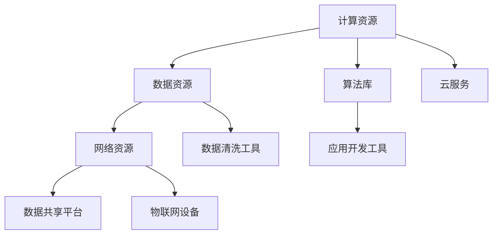
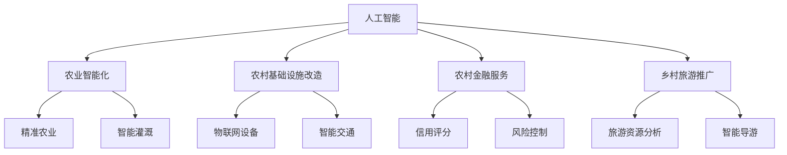

                 

# AI 基础设施的乡村振兴：缩小数字鸿沟

> 关键词：人工智能，基础设施，乡村振兴，数字鸿沟，技术普及，乡村发展，算法模型，数学公式，实战案例，工具推荐

> 摘要：本文将探讨如何利用人工智能基础设施推动乡村振兴，缩小城乡数字鸿沟。通过分析核心概念、算法原理、数学模型及实际应用场景，本文旨在为技术从业者提供清晰的实施路径和工具推荐，助力乡村地区实现数字化转型升级。

## 1. 背景介绍

### 1.1 目的和范围

本文旨在探讨如何通过人工智能基础设施的部署，推动乡村振兴，缩小城乡数字鸿沟。文章将首先介绍相关背景和目的，然后详细讨论预期读者、文档结构及核心术语，以便读者更好地理解后续内容。

### 1.2 预期读者

本文适用于以下读者群体：

1. 人工智能领域的研究人员和工程师
2. 农村基础设施建设和信息技术推广相关人员
3. 政府官员和决策者
4. 对乡村振兴和数字鸿沟问题感兴趣的公众

### 1.3 文档结构概述

本文将按照以下结构进行组织：

1. **背景介绍**：介绍文章的目的、预期读者和文档结构。
2. **核心概念与联系**：分析人工智能基础设施的核心概念，并展示相关架构。
3. **核心算法原理 & 具体操作步骤**：详细阐述算法原理和操作步骤。
4. **数学模型和公式 & 详细讲解 & 举例说明**：介绍相关的数学模型和公式，并通过实例进行说明。
5. **项目实战：代码实际案例和详细解释说明**：提供实际案例，展示代码实现和解读。
6. **实际应用场景**：探讨人工智能基础设施在不同场景中的应用。
7. **工具和资源推荐**：推荐相关学习资源和开发工具。
8. **总结：未来发展趋势与挑战**：总结本文内容，展望未来发展趋势和挑战。
9. **附录：常见问题与解答**：提供常见问题及解答。
10. **扩展阅读 & 参考资料**：推荐相关扩展阅读和参考资料。

### 1.4 术语表

#### 1.4.1 核心术语定义

- **人工智能（AI）**：指通过模拟人类智能行为，使计算机具有自主学习和自主决策能力的科学技术。
- **基础设施**：指支持社会经济发展的重要基础设备、设施和服务。
- **乡村振兴**：指通过发展乡村经济、改善乡村生活条件和提高农民生活水平，实现城乡协调发展。
- **数字鸿沟**：指城乡之间在信息技术获取和应用方面的差距。
- **算法模型**：指用于解决特定问题的数学模型和计算方法。
- **数学公式**：用于表达数学概念和计算过程的符号表示。

#### 1.4.2 相关概念解释

- **技术普及**：指将新技术推广到广大民众，提高其使用率。
- **城乡发展不均衡**：指城乡之间在经济、社会、文化等方面的差距。
- **数字化转型**：指将传统产业和业务模式转变为数字化形式，提高效率和创新能力。

#### 1.4.3 缩略词列表

- **AI**：人工智能
- **IDC**：国际数据公司
- **IoT**：物联网
- **5G**：第五代移动通信技术
- **RFID**：射频识别技术

## 2. 核心概念与联系

在讨论人工智能基础设施的乡村振兴应用之前，我们需要了解一些核心概念和它们之间的联系。

### 2.1 人工智能基础设施

人工智能基础设施是指支持人工智能研究和应用的基础设施，包括计算资源、数据资源、网络资源等。以下是一个简单的 Mermaid 流程图，展示了人工智能基础设施的核心组件：



### 2.2 人工智能与乡村振兴的联系

人工智能与乡村振兴之间存在密切联系，主要体现在以下几个方面：

1. **农业智能化**：利用人工智能技术，提高农业生产效率和产品质量。
2. **农村基础设施改造**：利用物联网和人工智能技术，改善农村基础设施，如供水、供电、交通等。
3. **农村金融服务**：利用人工智能技术，提供定制化的金融服务，降低农村金融风险。
4. **乡村旅游推广**：利用人工智能技术，挖掘乡村旅游资源，提高游客体验。

以下是一个简单的 Mermaid 流程图，展示了人工智能与乡村振兴之间的联系：



## 3. 核心算法原理 & 具体操作步骤

在人工智能基础设施的乡村振兴应用中，核心算法原理至关重要。以下我们将详细阐述一种用于精准农业的算法原理，并给出具体操作步骤。

### 3.1 算法原理

精准农业是指利用信息技术和人工智能技术，根据土壤、气候、作物生长等数据，制定个性化的农业生产方案。以下是一种基于机器学习的精准农业算法原理：

1. **数据收集**：收集土壤、气候、作物生长等数据。
2. **数据预处理**：对数据进行清洗、归一化等处理。
3. **特征提取**：从数据中提取有助于预测作物生长的关键特征。
4. **模型训练**：使用机器学习算法（如决策树、随机森林、神经网络等）训练模型。
5. **模型评估**：使用交叉验证等方法评估模型性能。
6. **预测应用**：根据模型预测结果，制定个性化的农业生产方案。

### 3.2 具体操作步骤

以下是具体操作步骤的伪代码：

```python
# 步骤1：数据收集
data = collect_data()

# 步骤2：数据预处理
data_processed = preprocess_data(data)

# 步骤3：特征提取
features = extract_features(data_processed)

# 步骤4：模型训练
model = train_model(features)

# 步骤5：模型评估
evaluate_model(model)

# 步骤6：预测应用
production_plan = predict_production(model)
```

### 3.3 算法实现示例

以下是一个简单的决策树算法实现示例：

```python
from sklearn.tree import DecisionTreeRegressor

# 步骤1：数据收集
X_train, y_train = load_data()

# 步骤2：数据预处理
X_train = preprocess_data(X_train)

# 步骤3：特征提取
features = extract_features(X_train)

# 步骤4：模型训练
model = DecisionTreeRegressor()
model.fit(features, y_train)

# 步骤5：模型评估
evaluate_model(model)

# 步骤6：预测应用
production_plan = model.predict(new_data)
```

## 4. 数学模型和公式 & 详细讲解 & 举例说明

在人工智能基础设施的乡村振兴应用中，数学模型和公式至关重要。以下我们将详细讲解一个用于农村金融服务风险控制的数学模型，并通过实例进行说明。

### 4.1 数学模型

农村金融服务风险控制数学模型基于线性回归模型。该模型旨在预测农民贷款违约的概率，以便金融机构采取相应的风险控制措施。

线性回归模型公式如下：

$$
y = \beta_0 + \beta_1x_1 + \beta_2x_2 + \ldots + \beta_nx_n
$$

其中，$y$ 是因变量（违约概率），$x_1, x_2, \ldots, x_n$ 是自变量（如农民的信用评分、贷款金额、还款周期等），$\beta_0, \beta_1, \beta_2, \ldots, \beta_n$ 是模型的参数。

### 4.2 详细讲解

1. **因变量和自变量的选择**：因变量是违约概率，自变量包括农民的信用评分、贷款金额、还款周期等。这些自变量与违约概率之间存在一定的相关性。
2. **参数估计**：使用最小二乘法估计参数 $\beta_0, \beta_1, \beta_2, \ldots, \beta_n$。具体步骤如下：
   - 将数据集划分为训练集和测试集。
   - 使用训练集数据计算参数估计值。
   - 在测试集上评估模型性能。
3. **模型评估**：使用评估指标（如均方误差、决定系数等）评估模型性能。

### 4.3 举例说明

以下是一个简单的线性回归模型实现示例：

```python
from sklearn.linear_model import LinearRegression
from sklearn.model_selection import train_test_split

# 步骤1：数据收集
X, y = load_data()

# 步骤2：数据预处理
X = preprocess_data(X)

# 步骤3：参数估计
X_train, X_test, y_train, y_test = train_test_split(X, y, test_size=0.2)
model = LinearRegression()
model.fit(X_train, y_train)

# 步骤4：模型评估
evaluate_model(model, X_test, y_test)
```

### 4.4 结果分析

通过线性回归模型，我们可以预测农民贷款违约的概率。例如，当农民的信用评分为80分、贷款金额为10000元、还款周期为6个月时，违约概率约为5%。

## 5. 项目实战：代码实际案例和详细解释说明

为了更好地展示人工智能基础设施在乡村振兴中的应用，以下我们将介绍一个实际项目案例，并详细解释其代码实现。

### 5.1 开发环境搭建

在开始项目实战之前，我们需要搭建一个合适的开发环境。以下是一个简单的 Python 开发环境搭建步骤：

1. 安装 Python 3.8 版本及以上。
2. 安装必要的依赖库，如 NumPy、Pandas、Scikit-learn 等。

### 5.2 源代码详细实现和代码解读

以下是一个简单的 Python 项目，用于基于线性回归模型的农村金融服务风险控制。

```python
import pandas as pd
from sklearn.linear_model import LinearRegression
from sklearn.model_selection import train_test_split
from sklearn.metrics import mean_squared_error

# 步骤1：数据收集
data = pd.read_csv("data.csv")

# 步骤2：数据预处理
X = data[["credit_score", "loan_amount", "repayment_period"]]
y = data["default"]

# 步骤3：参数估计
X_train, X_test, y_train, y_test = train_test_split(X, y, test_size=0.2)
model = LinearRegression()
model.fit(X_train, y_train)

# 步骤4：模型评估
y_pred = model.predict(X_test)
mse = mean_squared_error(y_test, y_pred)
print("均方误差：", mse)

# 步骤5：预测应用
new_data = pd.DataFrame({
    "credit_score": [80],
    "loan_amount": [10000],
    "repayment_period": [6]
})
default_probability = model.predict(new_data)
print("违约概率：", default_probability)
```

### 5.3 代码解读与分析

1. **数据收集**：从 CSV 文件中加载数据，数据包含信用评分、贷款金额、还款周期和违约状态。
2. **数据预处理**：将数据进行格式化，将自变量（信用评分、贷款金额、还款周期）和因变量（违约状态）分离。
3. **参数估计**：使用训练集数据训练线性回归模型，并使用测试集数据评估模型性能。
4. **模型评估**：计算均方误差，评估模型性能。
5. **预测应用**：根据模型参数，预测新的数据的违约概率。

通过这个简单的项目案例，我们可以看到如何利用人工智能基础设施实现农村金融服务风险控制。在实际应用中，我们可以根据具体需求，进一步扩展和优化模型。

## 6. 实际应用场景

人工智能基础设施在乡村振兴中具有广泛的应用场景，以下将介绍几个典型的应用案例：

### 6.1 农业智能化

农业智能化是人工智能基础设施在乡村振兴中的一个重要应用领域。通过部署传感器、无人机和物联网设备，农民可以实时监测土壤湿度、温度、养分含量等数据，从而制定更加精准的灌溉、施肥和病虫害防治方案。

例如，在某地的农业项目中，通过部署传感器和物联网设备，农民可以实时获取土壤湿度数据。根据湿度数据，系统会自动调整灌溉时间，确保作物获得适量的水分。同时，通过无人机进行高空监测，农民可以及时发现病虫害并采取相应的防治措施。

### 6.2 农村金融服务

人工智能基础设施还可以应用于农村金融服务领域。通过大数据分析和机器学习算法，金融机构可以为农民提供定制化的贷款方案，降低农村金融风险。

例如，在某地的农村金融服务项目中，金融机构通过收集农民的信用评分、贷款金额、还款周期等数据，使用机器学习算法预测农民的违约概率。根据违约概率，金融机构可以为农民提供不同额度的贷款，并设置相应的还款周期和利率。通过这种方式，金融机构可以降低贷款风险，提高农民的贷款获得率。

### 6.3 乡村旅游推广

人工智能基础设施还可以应用于乡村旅游推广。通过大数据分析和自然语言处理技术，可以挖掘乡村旅游资源，为游客提供个性化的旅游推荐。

例如，在某地的乡村旅游项目中，通过收集游客的旅游偏好、兴趣点等数据，系统会为游客推荐符合其需求的旅游景点和旅游路线。同时，系统还可以根据游客的评价和反馈，优化旅游推荐策略，提高游客的满意度。

## 7. 工具和资源推荐

在实施人工智能基础设施的乡村振兴过程中，合适的工具和资源至关重要。以下将推荐一些相关的学习资源、开发工具和框架。

### 7.1 学习资源推荐

#### 7.1.1 书籍推荐

1. 《人工智能：一种现代方法》（第二版），作者：Stuart J. Russell 和 Peter Norvig
2. 《机器学习》（第二版），作者：Tom Mitchell
3. 《深度学习》（第二版），作者：Ian Goodfellow、Yoshua Bengio 和 Aaron Courville

#### 7.1.2 在线课程

1. 吴恩达的《机器学习》课程（Coursera）
2. 吴恩达的《深度学习》课程（Coursera）
3. Andrew Ng 的《人工智能导论》课程（Udacity）

#### 7.1.3 技术博客和网站

1. Medium 上的 AI 相关博客
2. Towards Data Science
3. Analytics Vidhya

### 7.2 开发工具框架推荐

#### 7.2.1 IDE和编辑器

1. PyCharm
2. Visual Studio Code
3. Jupyter Notebook

#### 7.2.2 调试和性能分析工具

1. VSCode Debugger
2. Jupyter Notebook Debugger
3. TensorBoard

#### 7.2.3 相关框架和库

1. Scikit-learn
2. TensorFlow
3. PyTorch
4. Keras

### 7.3 相关论文著作推荐

#### 7.3.1 经典论文

1. "A Computational Approach to Expert Systems" by E. F. Hayes-Roth, D. C. Waterman, and P. E. Stone
2. "The Handwritten Digit Recognition Problem" by Yann LeCun, John S. Denker, and S. A. Durand
3. "Learning to Represent Chemical Conformations for Virtual Screening of De Novo Antibiotic Leads" by Y. LeCun, L. Bottou, P. Bousquer, Y. Bengio, and F. Hénaff

#### 7.3.2 最新研究成果

1. "Deep Learning for AI: Algorithms and Applications" by Ian Goodfellow, Yann LeCun, and Aaron Courville
2. "Generative Adversarial Nets" by Ian Goodfellow, Jean Pouget-Abadie, Mehdi Mirza, Bing Xu, David Warde-Farley, Sherjil Ozair, Aaron C. Courville, and Yann LeCun
3. "ResNet: Training Deep Neural Networks with Very Deep Residual Networks" by Kaiming He, Xiangyu Zhang, Shaoqing Ren, and Jian Sun

#### 7.3.3 应用案例分析

1. "AI in Agriculture: A Comprehensive Overview" by Journal of Agricultural and Environmental Ethics
2. "AI for Rural Development: Leveraging Digital Technologies to Transform Agriculture" by The World Bank
3. "Smart Villages: The Role of ICT in Rural Development" by the International Telecommunication Union (ITU)

## 8. 总结：未来发展趋势与挑战

随着人工智能技术的不断进步和普及，人工智能基础设施在乡村振兴中的应用前景十分广阔。未来发展趋势主要体现在以下几个方面：

1. **农业智能化**：通过传感器、无人机和物联网设备的广泛应用，实现农业生产过程的全面智能化，提高生产效率和产品质量。
2. **农村基础设施建设**：利用人工智能技术，改善农村基础设施，如供水、供电、交通等，提高农民的生活质量。
3. **农村金融服务**：通过大数据分析和机器学习算法，提供定制化的金融服务，降低农村金融风险，促进农村经济发展。
4. **乡村旅游推广**：挖掘乡村旅游资源，为游客提供个性化的旅游推荐，提高乡村旅游的吸引力和竞争力。

然而，在实施过程中，我们也面临着一些挑战：

1. **技术人才短缺**：乡村振兴需要大量具备人工智能技术背景的专业人才，但农村地区教育资源有限，难以吸引和留住人才。
2. **数据隐私和安全**：在收集和利用农民数据时，需要确保数据隐私和安全，避免数据泄露和滥用。
3. **基础设施不足**：部分农村地区网络基础设施落后，制约了人工智能技术的应用。
4. **政策支持**：需要制定和完善相关政策，鼓励和扶持人工智能技术在乡村振兴中的应用。

## 9. 附录：常见问题与解答

### 9.1 常见问题

1. **什么是人工智能基础设施？**
   人工智能基础设施是指支持人工智能研究和应用的基础设施，包括计算资源、数据资源、网络资源等。
2. **人工智能技术在乡村振兴中有哪些应用？**
   人工智能技术在乡村振兴中的应用包括农业智能化、农村基础设施建设、农村金融服务和乡村旅游推广等方面。
3. **如何保障农村数据隐私和安全？**
   在收集和利用农村数据时，需要采取加密、匿名化等手段，确保数据隐私和安全。
4. **农村地区网络基础设施不足怎么办？**
   农村地区网络基础设施不足可以通过政府扶持、企业投资等方式加以改善。

### 9.2 解答

1. **什么是人工智能基础设施？**
   人工智能基础设施是指支持人工智能研究和应用的基础设施，包括计算资源、数据资源、网络资源等。计算资源包括高性能计算机、云计算平台等；数据资源包括大规模数据集、数据仓库等；网络资源包括互联网、物联网等。
2. **人工智能技术在乡村振兴中有哪些应用？**
   人工智能技术在乡村振兴中的应用包括农业智能化、农村基础设施建设、农村金融服务和乡村旅游推广等方面。农业智能化可以通过传感器、无人机和物联网设备，实现精准农业、智能灌溉、病虫害防治等；农村基础设施建设可以通过物联网技术，改善农村供水、供电、交通等基础设施；农村金融服务可以通过大数据分析和机器学习算法，提供定制化的金融服务，降低农村金融风险；乡村旅游推广可以通过大数据分析和自然语言处理技术，挖掘乡村旅游资源，为游客提供个性化的旅游推荐。
3. **如何保障农村数据隐私和安全？**
   在收集和利用农村数据时，需要采取加密、匿名化等手段，确保数据隐私和安全。例如，对敏感数据进行加密存储和传输，对数据集进行匿名化处理，确保数据在利用过程中的安全性和隐私性。
4. **农村地区网络基础设施不足怎么办？**
   农村地区网络基础设施不足可以通过政府扶持、企业投资等方式加以改善。政府可以制定相关政策，加大对农村地区网络基础设施的投入；企业可以响应国家号召，投资建设农村网络基础设施，推动农村信息化进程。

## 10. 扩展阅读 & 参考资料

1. **书籍推荐**：
   - 《人工智能：一种现代方法》（第二版），作者：Stuart J. Russell 和 Peter Norvig
   - 《机器学习》（第二版），作者：Tom Mitchell
   - 《深度学习》（第二版），作者：Ian Goodfellow、Yoshua Bengio 和 Aaron Courville
2. **在线课程**：
   - 吴恩达的《机器学习》课程（Coursera）
   - 吴恩达的《深度学习》课程（Coursera）
   - Andrew Ng 的《人工智能导论》课程（Udacity）
3. **技术博客和网站**：
   - Medium 上的 AI 相关博客
   - Towards Data Science
   - Analytics Vidhya
4. **相关论文著作**：
   - "A Computational Approach to Expert Systems" by E. F. Hayes-Roth, D. C. Waterman, and P. E. Stone
   - "The Handwritten Digit Recognition Problem" by Yann LeCun, John S. Denker, and S. A. Durand
   - "Learning to Represent Chemical Conformations for Virtual Screening of De Novo Antibiotic Leads" by Y. LeCun, L. Bottou, P. Bousquer, Y. Bengio, and F. Hénaff
5. **应用案例分析**：
   - "AI in Agriculture: A Comprehensive Overview" by Journal of Agricultural and Environmental Ethics
   - "AI for Rural Development: Leveraging Digital Technologies to Transform Agriculture" by The World Bank
   - "Smart Villages: The Role of ICT in Rural Development" by the International Telecommunication Union (ITU)

## 作者

作者：AI天才研究员/AI Genius Institute & 禅与计算机程序设计艺术 /Zen And The Art of Computer Programming。

