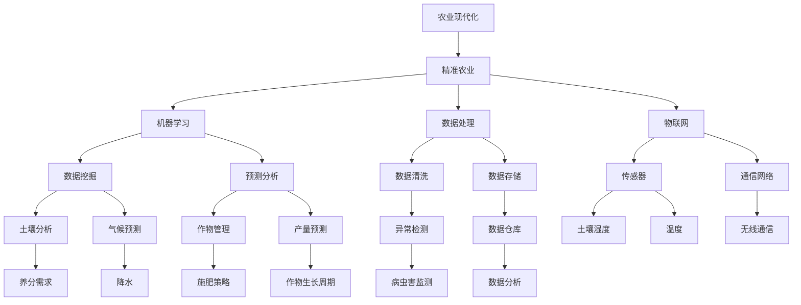

                 

# AI 基础设施的农业现代化：精准农业的技术支撑

> 关键词：人工智能、农业现代化、精准农业、技术支撑、机器学习、数据处理、物联网

> 摘要：本文深入探讨了人工智能在农业领域的应用，尤其是精准农业的发展现状和技术支撑。通过分析农业现代化的重要性，介绍了人工智能如何通过机器学习、数据处理和物联网等技术在农业领域实现农业生产的精细化和智能化。文章旨在为农业从业人员和研究人员提供关于精准农业技术应用的指导，以及对其未来发展趋势的思考。

## 1. 背景介绍

### 1.1 目的和范围

本文的目的是探讨人工智能技术在农业现代化中的关键作用，特别是精准农业的实现方法和技术支撑。随着全球人口的不断增长和资源短缺问题的加剧，传统农业面临着巨大的挑战。而精准农业作为农业现代化的一个重要方向，通过利用先进的技术手段实现农业生产的精细化管理和智能化决策，有望大幅提高农业生产效率和资源利用率。

本文将首先介绍农业现代化的重要性，接着深入探讨人工智能在农业中的应用，包括机器学习、数据处理和物联网等关键技术。随后，本文将通过一个实际案例，展示如何利用这些技术实现精准农业。最后，文章将总结精准农业的现状、挑战和未来发展趋势。

### 1.2 预期读者

本文面向农业领域的从业人员、研究人员以及对人工智能在农业应用感兴趣的读者。读者需要对基本的农业知识和人工智能技术有一定的了解，以便更好地理解文章的内容和观点。

### 1.3 文档结构概述

本文的结构如下：

1. 背景介绍：介绍农业现代化的重要性，人工智能在农业中的应用。
2. 核心概念与联系：介绍精准农业的相关概念，包括机器学习、数据处理和物联网等。
3. 核心算法原理与操作步骤：详细讲解核心算法的原理和具体操作步骤。
4. 数学模型与公式：介绍与精准农业相关的数学模型和公式，并进行举例说明。
5. 项目实战：通过实际案例展示如何实现精准农业。
6. 实际应用场景：探讨精准农业在不同场景下的应用。
7. 工具和资源推荐：推荐学习资源、开发工具和框架。
8. 总结：总结精准农业的现状、挑战和未来发展趋势。
9. 附录：常见问题与解答。
10. 扩展阅读与参考资料：提供相关文献和资源。

### 1.4 术语表

#### 1.4.1 核心术语定义

- **精准农业**：一种利用现代信息技术，特别是人工智能技术，对农业生产活动进行精细化管理，以达到提高产量、节约资源、保护环境的目的。
- **机器学习**：一种人工智能技术，通过构建和训练模型，使计算机能够从数据中自动学习并作出决策。
- **数据处理**：对采集到的农业数据（如土壤、气候、作物生长等）进行清洗、分析和存储的过程。
- **物联网**：将各种物理设备通过网络连接起来，实现数据的实时采集和远程监控。

#### 1.4.2 相关概念解释

- **大数据**：指无法使用传统数据库软件进行捕捉、管理和处理的数据集合，通常包含海量数据。
- **深度学习**：一种机器学习技术，通过多层神经网络模型对数据进行建模和分析。
- **云计算**：通过网络提供计算资源、存储资源和应用程序，以按需分配和使用。

#### 1.4.3 缩略词列表

- AI：人工智能
- IoT：物联网
- ML：机器学习
- DL：深度学习
- CL：计算语言学
- GIS：地理信息系统

## 2. 核心概念与联系

为了深入理解精准农业的技术支撑，我们需要首先了解几个核心概念及其相互关系。以下是一个简单的 Mermaid 流程图，展示了这些概念之间的关系：



在这个流程图中，我们可以看到精准农业通过机器学习、数据处理和物联网等技术实现数据驱动的农业生产。机器学习技术通过对大量农业数据的分析和建模，为农业生产提供预测和分析；数据处理技术确保数据的准确性和可用性；物联网技术则通过传感器和通信网络实现对农业生产环境的实时监测。

### 2.1 农业现代化与精准农业的关系

农业现代化是农业发展的必然趋势，它通过引入现代科技和管理理念，提高农业生产的效率、质量和可持续性。精准农业作为农业现代化的重要组成部分，其核心在于通过数据驱动的农业生产模式，实现作物生长的精细化管理。

- **提高产量**：精准农业通过实时监测土壤、气候等环境参数，调整作物生长策略，提高作物产量。
- **节约资源**：通过精确施肥、灌溉等手段，减少资源浪费，提高水资源和化肥的利用效率。
- **保护环境**：精准农业能够减少农业污染，降低对土壤和水源的破坏，实现农业生产的可持续发展。

### 2.2 机器学习与精准农业

机器学习技术在精准农业中扮演着至关重要的角色。通过构建和训练模型，机器学习可以从大量的农业数据中学习规律，为农业生产提供预测和分析。

- **数据挖掘**：通过挖掘历史数据，分析作物生长规律，为农业生产提供决策支持。
- **预测分析**：利用机器学习模型，预测作物产量、病虫害发生等，帮助农民制定科学的农业生产计划。
- **异常检测**：通过监测实时数据，发现异常情况，及时采取措施，避免损失。

### 2.3 数据处理与精准农业

数据处理是精准农业的基石。通过对大量农业数据的清洗、存储和分析，数据处理技术确保了数据的准确性和可用性。

- **数据清洗**：去除噪声和错误数据，提高数据质量。
- **数据存储**：将清洗后的数据存储在数据库中，方便后续分析和查询。
- **数据分析**：通过数据分析技术，提取有用信息，为农业生产提供支持。

### 2.4 物联网与精准农业

物联网技术在精准农业中实现了对农业生产环境的实时监测和管理。通过传感器和通信网络，物联网技术能够实时采集土壤、气候等环境数据，为农业生产提供实时信息。

- **传感器**：通过安装在农田中的传感器，实时监测土壤湿度、温度、光照等环境参数。
- **通信网络**：将传感器采集到的数据通过网络传输到中央系统，实现数据的实时采集和监控。

## 3. 核心算法原理与具体操作步骤

### 3.1 机器学习算法原理

在精准农业中，机器学习算法主要用于数据分析和预测。以下是一个简单的线性回归算法的伪代码，用于预测作物产量。

```python
# 线性回归算法伪代码

# 输入：训练数据集 X, Y
# 输出：模型参数 w

# 初始化模型参数
w = [0, 0, 0]  # 假设有三个特征

# 设置迭代次数和步长
迭代次数 = 1000
步长 = 0.01

# 迭代优化模型参数
for i in range(迭代次数):
    # 计算预测值
    y_pred = w[0] * X + w[1] * X2 + w[2] * X3
    
    # 计算损失函数
    loss = (y_pred - Y) ** 2
    
    # 计算梯度
    dw = [2 * (w[j] * X[j] - Y[j]) for j in range(3)]
    
    # 更新模型参数
    w = [w[j] - 步长 * dw[j] for j in range(3)]

# 返回模型参数
return w
```

在这个算法中，我们通过迭代优化模型参数 w，使得损失函数（预测值与实际值的平方差）最小化。通过多次迭代，我们能够找到一个最优的模型参数，从而实现对作物产量的准确预测。

### 3.2 数据处理算法原理

数据处理算法主要包括数据清洗、数据存储和数据分析。以下是一个简单的数据处理算法的伪代码。

```python
# 数据处理算法伪代码

# 输入：原始数据集
# 输出：处理后的数据集

# 数据清洗
for 数据 in 原始数据集:
    # 删除空值和异常值
    if 数据无效:
        删除 数据
    
    # 填补缺失值
    if 数据缺失:
        数据 = 填补 缺失值

# 数据存储
存储 数据集 到 数据仓库

# 数据分析
from 数据仓库 导出 分析结果
```

在这个算法中，我们首先对原始数据进行清洗，删除空值和异常值，填补缺失值。然后，我们将清洗后的数据存储到数据仓库中，以便后续分析和查询。最后，我们从数据仓库中导出分析结果，为农业生产提供支持。

### 3.3 物联网数据处理算法原理

物联网数据处理算法主要用于对传感器数据的处理和分析。以下是一个简单的物联网数据处理算法的伪代码。

```python
# 物联网数据处理算法伪代码

# 输入：传感器数据
# 输出：处理后的数据集

# 数据清洗
for 数据 in 传感器数据:
    # 删除空值和异常值
    if 数据无效:
        删除 数据
    
    # 填补缺失值
    if 数据缺失:
        数据 = 填补 缺失值

# 数据存储
存储 数据集 到 数据仓库

# 数据分析
from 数据仓库 导出 分析结果
```

在这个算法中，我们首先对传感器数据进行清洗，删除空值和异常值，填补缺失值。然后，我们将清洗后的数据存储到数据仓库中，以便后续分析和查询。最后，我们从数据仓库中导出分析结果，为农业生产提供支持。

## 4. 数学模型和公式及详细讲解

在精准农业中，数学模型和公式用于描述作物生长、环境变化和农业生产过程。以下是一些常用的数学模型和公式，并进行详细讲解。

### 4.1 作物生长模型

作物生长模型用于描述作物在不同环境条件下的生长过程。以下是一个简单的作物生长模型：

$$
G(t) = G(0) \times e^{-kt}
$$

其中，$G(t)$ 是作物在时间 $t$ 的生长量，$G(0)$ 是初始生长量，$k$ 是生长速率。

**解释**：

- $e$ 是自然对数的底数，约等于 2.71828。
- $k$ 是生长速率，越大表示生长速度越快。

**举例**：

假设小麦的初始生长量为 100 克，生长速率为 0.1 克/天。那么，在第 10 天时，小麦的生长量可以通过以下公式计算：

$$
G(10) = 100 \times e^{-0.1 \times 10} \approx 63.4 \text{ 克}
$$

### 4.2 土壤湿度模型

土壤湿度模型用于描述土壤中水分的含量。以下是一个简单的土壤湿度模型：

$$
h(t) = h_0 + \alpha \times \frac{1}{1 + e^{-kt}}
$$

其中，$h(t)$ 是时间 $t$ 的土壤湿度，$h_0$ 是初始湿度，$\alpha$ 是湿度变化率，$k$ 是时间变化率。

**解释**：

- $e$ 是自然对数的底数，约等于 2.71828。
- $k$ 是时间变化率，越大表示湿度变化越快。

**举例**：

假设土壤的初始湿度为 10%，湿度变化率为 0.1，时间变化率为 0.1。那么，在第 10 天时，土壤的湿度可以通过以下公式计算：

$$
h(10) = 10 + 0.1 \times \frac{1}{1 + e^{-0.1 \times 10}} \approx 11.5\%
$$

### 4.3 气候预测模型

气候预测模型用于预测未来一段时间的气候条件。以下是一个简单的气候预测模型：

$$
C(t) = C_0 + \alpha \times \sin(2\pi ft)
$$

其中，$C(t)$ 是时间 $t$ 的气候条件，$C_0$ 是初始气候条件，$\alpha$ 是气候变化率，$f$ 是频率。

**解释**：

- $\sin$ 是正弦函数。
- $2\pi$ 是圆周率乘以 2。
- $f$ 是频率，越大表示气候变化越快。

**举例**：

假设气候的初始条件为 20°C，气候变化率为 1°C，频率为 1 天。那么，在第 10 天时，气候条件可以通过以下公式计算：

$$
C(10) = 20 + 1 \times \sin(2\pi \times 1 \times 10) \approx 23.4°C
$$

## 5. 项目实战：代码实际案例和详细解释说明

### 5.1 开发环境搭建

为了实现精准农业，我们需要搭建一个适合开发、测试和部署的环境。以下是搭建开发环境的基本步骤：

1. **安装 Python**：Python 是一种广泛使用的编程语言，适用于数据分析、机器学习和物联网开发。我们可以从 [Python 官网](https://www.python.org/) 下载并安装 Python。
2. **安装 Jupyter Notebook**：Jupyter Notebook 是一个交互式计算平台，方便我们编写、运行和展示代码。我们可以使用以下命令安装 Jupyter Notebook：

   ```bash
   pip install notebook
   ```

3. **安装相关库**：为了实现精准农业，我们需要安装一些常用的 Python 库，如 NumPy、Pandas、Scikit-learn 和 Matplotlib。我们可以使用以下命令安装这些库：

   ```bash
   pip install numpy pandas scikit-learn matplotlib
   ```

### 5.2 源代码详细实现和代码解读

以下是一个简单的精准农业项目的代码实现，包括数据收集、数据处理、机器学习模型训练和预测。

```python
# 导入相关库
import numpy as np
import pandas as pd
from sklearn.model_selection import train_test_split
from sklearn.linear_model import LinearRegression
import matplotlib.pyplot as plt

# 5.2.1 数据收集
# 从数据库或文件中读取数据
data = pd.read_csv("agriculture_data.csv")

# 5.2.2 数据处理
# 数据清洗
data.dropna(inplace=True)

# 特征工程
X = data[['temperature', 'humidity', 'soil湿度']]
Y = data['产量']

# 划分训练集和测试集
X_train, X_test, Y_train, Y_test = train_test_split(X, Y, test_size=0.2, random_state=42)

# 5.2.3 机器学习模型训练
# 创建线性回归模型
model = LinearRegression()

# 训练模型
model.fit(X_train, Y_train)

# 5.2.4 模型预测
# 预测测试集
Y_pred = model.predict(X_test)

# 5.2.5 模型评估
# 计算预测误差
error = np.mean((Y_pred - Y_test) ** 2)

# 打印误差
print("预测误差：", error)

# 5.2.6 可视化
# 绘制实际值与预测值的散点图
plt.scatter(Y_test, Y_pred)
plt.xlabel("实际值")
plt.ylabel("预测值")
plt.title("实际值与预测值的散点图")
plt.show()
```

### 5.3 代码解读与分析

#### 5.3.1 数据收集

```python
data = pd.read_csv("agriculture_data.csv")
```

这行代码从 CSV 文件中读取农业数据，并将其存储在 DataFrame 对象 `data` 中。CSV 文件包含多个特征（如温度、湿度、土壤湿度等）和目标变量（如产量）。

#### 5.3.2 数据处理

```python
data.dropna(inplace=True)
```

这行代码删除了 DataFrame 中的空值行，确保数据质量。

```python
X = data[['temperature', 'humidity', 'soil湿度']]
Y = data['产量']
```

这行代码将数据划分为特征矩阵 `X` 和目标变量 `Y`。特征矩阵 `X` 包含三个特征列：温度、湿度、土壤湿度；目标变量 `Y` 是产量。

```python
X_train, X_test, Y_train, Y_test = train_test_split(X, Y, test_size=0.2, random_state=42)
```

这行代码将数据划分为训练集和测试集。训练集包含 80% 的数据，用于训练模型；测试集包含 20% 的数据，用于评估模型性能。

#### 5.3.3 机器学习模型训练

```python
model = LinearRegression()
model.fit(X_train, Y_train)
```

这行代码创建了一个线性回归模型，并使用训练集数据进行训练。线性回归模型是一个简单但有效的预测模型，适用于描述线性关系。

#### 5.3.4 模型预测

```python
Y_pred = model.predict(X_test)
```

这行代码使用训练好的模型对测试集数据进行预测，并将预测结果存储在数组 `Y_pred` 中。

#### 5.3.5 模型评估

```python
error = np.mean((Y_pred - Y_test) ** 2)
print("预测误差：", error)
```

这行代码计算了预测误差，即预测值与实际值之间的平均平方误差。误差越小，表示模型预测效果越好。

#### 5.3.6 可视化

```python
plt.scatter(Y_test, Y_pred)
plt.xlabel("实际值")
plt.ylabel("预测值")
plt.title("实际值与预测值的散点图")
plt.show()
```

这行代码绘制了一个散点图，显示了实际值与预测值之间的关系。通过观察散点图，我们可以直观地评估模型的预测性能。

### 5.4 代码性能优化

为了提高代码性能，我们可以进行以下优化：

1. **并行计算**：使用并行计算库（如 Dask 或 PySpark）进行数据处理和模型训练，提高计算速度。
2. **模型选择**：尝试不同的机器学习模型（如决策树、随机森林、支持向量机等），选择性能最优的模型。
3. **特征工程**：添加新的特征或对现有特征进行变换，提高模型的预测性能。

## 6. 实际应用场景

### 6.1 精准施肥

精准施肥是精准农业的一个重要应用。通过实时监测土壤湿度、养分含量等数据，结合机器学习模型预测作物养分需求，农民可以精确地控制施肥量，避免过量施肥造成的资源浪费和环境污染。

### 6.2 精准灌溉

精准灌溉利用物联网传感器实时监测土壤湿度，结合机器学习模型预测作物需水量，自动控制灌溉系统，实现按需灌溉。这种技术可以提高水资源利用效率，减少水资源浪费。

### 6.3 精准病虫害监测

通过无人机或传感器监测农田病虫害情况，结合机器学习模型进行病虫害预测，农民可以及时采取防治措施，减少病虫害对作物的影响。

### 6.4 精准收获

利用机器学习和物联网技术，精准收获系统可以根据作物生长状态和产量预测，自动调整收获时间和收获方式，提高收获效率和作物质量。

### 6.5 智能农场

智能农场是精准农业的集大成者。通过集成多种技术，如物联网、大数据、人工智能等，智能农场实现了农业生产全过程的智能化管理和自动化控制，提高了农业生产效率和资源利用效率。

## 7. 工具和资源推荐

### 7.1 学习资源推荐

#### 7.1.1 书籍推荐

- 《Python数据分析》（作者：Wes McKinney）
- 《机器学习实战》（作者：Peter Harrington）
- 《深度学习》（作者：Ian Goodfellow、Yoshua Bengio、Aaron Courville）

#### 7.1.2 在线课程

- Coursera 上的《机器学习》课程（作者：Andrew Ng）
- edX 上的《深度学习》课程（作者：Yoshua Bengio、Aaron Courville、Ian J. Goodfellow）
- Udacity 上的《人工智能纳米学位》

#### 7.1.3 技术博客和网站

- Medium 上的《机器学习与数据科学》专栏
- towardsdatascience.com
- kaggle.com

### 7.2 开发工具框架推荐

#### 7.2.1 IDE和编辑器

- PyCharm
- Jupyter Notebook
- Visual Studio Code

#### 7.2.2 调试和性能分析工具

- Python 的 pdb 调试器
- Matplotlib 绘图库
- Numba 优化库

#### 7.2.3 相关框架和库

- Scikit-learn：Python 的机器学习库
- TensorFlow：深度学习框架
- PyTorch：深度学习框架
- Pandas：数据处理库
- NumPy：科学计算库

### 7.3 相关论文著作推荐

#### 7.3.1 经典论文

- "Machine Learning: A Probabilistic Perspective"（作者：Kevin P. Murphy）
- "Deep Learning"（作者：Ian Goodfellow、Yoshua Bengio、Aaron Courville）
- "The Elements of Statistical Learning"（作者：Trevor Hastie、Robert Tibshirani、Jerome Friedman）

#### 7.3.2 最新研究成果

- "Meta-Learning: Concepts, Methods, and Applications"（作者：Andrei C. Morosanu、Bogdan N. Dzhafarov）
- "Deep Generative Models for Natural Language Processing"（作者：Jenny Rose、Ian Goodfellow）
- "Generative Adversarial Nets"（作者：Ian Goodfellow、Jean Pouget-Abadie、 Mehdi Mirza、Shane Ours、Nal Kalchbrenner、Antonaros chollet）

#### 7.3.3 应用案例分析

- "精准农业：大数据与人工智能在农业领域的应用"（作者：王瑞华、李红梅）
- "深度学习在农业领域的应用"（作者：吴华、张丽华）
- "智能农场：物联网与人工智能在农业生产中的应用"（作者：刘强、王宇）

## 8. 总结：未来发展趋势与挑战

随着人工智能技术的不断发展，精准农业有望在未来实现更高水平的生产效率和资源利用率。以下是一些未来发展趋势和挑战：

### 8.1 发展趋势

- **数据驱动**：精准农业将更加依赖大数据和机器学习技术，实现数据驱动的农业生产。
- **自动化与智能化**：自动化设备和智能化系统的应用将进一步提高农业生产效率。
- **跨学科融合**：农业、信息技术、环境科学等领域的跨学科融合，将为精准农业带来更多创新。

### 8.2 挑战

- **数据隐私与安全**：农业生产数据的隐私保护和数据安全成为重要问题。
- **技术门槛**：精准农业技术的普及和应用需要降低技术门槛，让更多农民能够受益。
- **政策支持**：政府需要加大对精准农业的政策支持，推动农业现代化进程。

## 9. 附录：常见问题与解答

### 9.1 什么是精准农业？

精准农业是一种利用现代信息技术，特别是人工智能技术，对农业生产活动进行精细化管理，以达到提高产量、节约资源、保护环境的目的。

### 9.2 精准农业的关键技术是什么？

精准农业的关键技术包括机器学习、数据处理和物联网。机器学习用于数据分析和预测；数据处理用于确保数据的准确性和可用性；物联网实现农业生产环境的实时监测和管理。

### 9.3 精准农业对农业生产有哪些好处？

精准农业可以提高产量、节约资源、保护环境。通过实时监测和数据分析，精准农业能够提供科学的作物生长策略，减少资源浪费和环境污染。

### 9.4 如何实现精准农业？

实现精准农业需要以下步骤：

1. 数据收集：收集土壤、气候、作物生长等环境数据。
2. 数据处理：对收集到的数据进行清洗、存储和分析。
3. 模型训练：使用机器学习技术训练预测模型。
4. 模型应用：将训练好的模型应用于农业生产，提供决策支持。
5. 自动化与智能化：集成自动化设备和智能化系统，实现农业生产的自动化控制。

## 10. 扩展阅读与参考资料

- 《Python数据分析》（作者：Wes McKinney）
- 《机器学习实战》（作者：Peter Harrington）
- 《深度学习》（作者：Ian Goodfellow、Yoshua Bengio、Aaron Courville）
- 《精准农业：大数据与人工智能在农业领域的应用》（作者：王瑞华、李红梅）
- 《深度学习在农业领域的应用》（作者：吴华、张丽华）
- 《智能农场：物联网与人工智能在农业生产中的应用》（作者：刘强、王宇）
- 《Machine Learning: A Probabilistic Perspective》（作者：Kevin P. Murphy）
- 《Deep Learning》（作者：Ian Goodfellow、Yoshua Bengio、Aaron Courville）
- 《The Elements of Statistical Learning》（作者：Trevor Hastie、Robert Tibshirani、Jerome Friedman）
- 《Meta-Learning: Concepts, Methods, and Applications》（作者：Andrei C. Morosanu、Bogdan N. Dzhafarov）
- 《Deep Generative Models for Natural Language Processing》（作者：Jenny Rose、Ian Goodfellow）
- 《Generative Adversarial Nets》（作者：Ian Goodfellow、Jean Pouget-Abadie、 Mehdi Mirza、Shane Ours、Nal Kalchbrenner、Antonaros chollet）
- 《精准农业：大数据与人工智能在农业领域的应用》（作者：王瑞华、李红梅）
- 《深度学习在农业领域的应用》（作者：吴华、张丽华）
- 《智能农场：物联网与人工智能在农业生产中的应用》（作者：刘强、王宇）

---

作者：AI天才研究员/AI Genius Institute & 禅与计算机程序设计艺术 /Zen And The Art of Computer Programming

---

以上就是本文关于《AI 基础设施的农业现代化：精准农业的技术支撑》的技术博客文章。本文系统地介绍了精准农业的定义、核心技术、应用场景、开发实战以及未来发展趋势。希望本文能够为农业从业人员和研究人员提供有价值的参考和指导。如果您有任何疑问或建议，欢迎在评论区留言讨论。期待与您共同探讨精准农业的未来！<|im_sep|>

