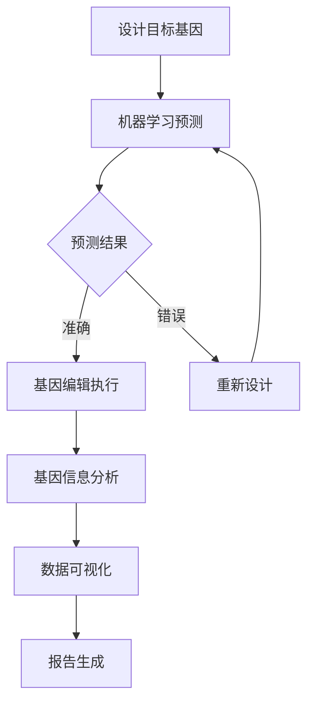

                 

# AI 基础设施的基因工程：智能化基因编辑与分析平台

> **关键词：** AI基础设施、基因编辑、智能化分析、基因组学、生物信息学、算法优化

> **摘要：** 本文旨在探讨AI基础设施在基因编辑与分析中的应用，通过智能化基因编辑与分析平台的构建，实现高效、准确、智能化的基因信息处理。本文首先介绍了基因编辑的背景和重要性，然后详细阐述了智能化基因编辑与分析平台的核心概念、算法原理、数学模型，并给出了实际应用场景。此外，本文还推荐了相关工具和资源，对未来的发展趋势与挑战进行了展望。

## 1. 背景介绍

### 1.1 目的和范围

随着生物技术和AI技术的飞速发展，基因编辑已经逐渐成为现代生物医学研究的重要手段。智能化基因编辑与分析平台的构建，旨在将AI技术应用于基因编辑过程，实现基因信息的智能化处理，提高基因编辑的效率和质量。

本文主要涵盖以下内容：

- 基因编辑的背景和重要性
- 智能化基因编辑与分析平台的核心概念
- 平台的核心算法原理和数学模型
- 实际应用场景
- 相关工具和资源推荐

### 1.2 预期读者

本文主要面向以下读者群体：

- 生物医学研究人员，对基因编辑有初步了解，希望深入了解AI在基因编辑中的应用
- AI技术研究者，对生物信息学领域感兴趣，希望了解基因编辑技术
- 生物信息学研究生，对基因编辑与分析有深入研究的兴趣
- 对AI和生物技术领域有浓厚兴趣的程序员和工程师

### 1.3 文档结构概述

本文结构如下：

- 第1章：背景介绍
  - 1.1 目的和范围
  - 1.2 预期读者
  - 1.3 文档结构概述
  - 1.4 术语表
- 第2章：核心概念与联系
  - 2.1 基因编辑
  - 2.2 智能化基因编辑与分析平台
  - 2.3 Mermaid流程图
- 第3章：核心算法原理 & 具体操作步骤
  - 3.1 算法原理讲解
  - 3.2 伪代码阐述
- 第4章：数学模型和公式 & 详细讲解 & 举例说明
  - 4.1 数学模型
  - 4.2 公式讲解
  - 4.3 举例说明
- 第5章：项目实战：代码实际案例和详细解释说明
  - 5.1 开发环境搭建
  - 5.2 源代码详细实现和代码解读
  - 5.3 代码解读与分析
- 第6章：实际应用场景
- 第7章：工具和资源推荐
  - 7.1 学习资源推荐
  - 7.2 开发工具框架推荐
  - 7.3 相关论文著作推荐
- 第8章：总结：未来发展趋势与挑战
- 第9章：附录：常见问题与解答
- 第10章：扩展阅读 & 参考资料

### 1.4 术语表

#### 1.4.1 核心术语定义

- 基因编辑：指通过定向修改生物体的基因组序列，实现对基因表达、基因功能等方面的调控。
- 智能化基因编辑：指利用AI技术，对基因编辑过程进行智能化优化，提高基因编辑的效率和质量。
- 智能化基因编辑与分析平台：指基于AI技术，构建的用于基因编辑和基因信息分析的集成平台。
- 生物信息学：指应用计算机技术，对生物数据进行处理、分析和解释的学科。

#### 1.4.2 相关概念解释

- AI技术：指人工智能技术，包括机器学习、深度学习、自然语言处理等。
- 基因组：指生物体遗传信息的总和，包括DNA序列。
- 基因组学：指研究基因组结构、功能、变异和进化等方面的学科。
- 生物信息学算法：指用于生物信息学研究的算法，包括序列比对、基因预测、基因表达分析等。

#### 1.4.3 缩略词列表

- AI：人工智能
- ML：机器学习
- DL：深度学习
- NLP：自然语言处理
- CRISPR：成簇规律间隔短回文重复序列
- RNA-seq：RNA测序
- DNA-seq：DNA测序
- GO：基因本体论

## 2. 核心概念与联系

### 2.1 基因编辑

基因编辑是指通过定向修改生物体的基因组序列，实现对基因表达、基因功能等方面的调控。传统的基因编辑方法主要包括基因克隆、基因打靶、基因敲除、基因敲入等。然而，这些方法通常操作复杂、成本高昂、效率较低。

近年来，CRISPR/Cas9等新型基因编辑技术的发展，使得基因编辑变得更加简单、高效和精准。CRISPR/Cas9系统由成簇规律间隔短回文重复序列（CRISPR）和CRISPR相关蛋白（Cas9）组成，通过设计特定的引物序列，可以实现对目标基因的精确编辑。

### 2.2 智能化基因编辑与分析平台

智能化基因编辑与分析平台是指基于AI技术，构建的用于基因编辑和基因信息分析的集成平台。该平台主要包括以下几个核心功能：

- 基因编辑设计：利用机器学习和深度学习算法，对基因编辑目标进行预测和优化，提高基因编辑的准确性和效率。
- 基因编辑执行：通过自动化工具，实现基因编辑的精确执行，减少实验误差。
- 基因信息分析：利用自然语言处理和文本挖掘技术，对基因编辑后的生物信息进行深入分析，揭示基因的功能和作用。
- 数据可视化和报告生成：通过可视化技术，将基因编辑和分析结果直观地展示出来，方便研究人员进行数据解读。

### 2.3 Mermaid流程图

为了更好地阐述智能化基因编辑与分析平台的工作流程，我们使用Mermaid流程图进行描述：



### 2.4 核心概念与联系总结

通过上述内容，我们可以看到，基因编辑是智能化基因编辑与分析平台的基础，而AI技术则为基因编辑提供了智能化手段。智能化基因编辑与分析平台通过设计目标基因、机器学习预测、基因编辑执行、基因信息分析、数据可视化和报告生成等环节，实现对基因编辑过程的全面优化。这一平台不仅提高了基因编辑的效率和质量，还为基因功能研究提供了强大的工具支持。

## 3. 核心算法原理 & 具体操作步骤

### 3.1 算法原理讲解

智能化基因编辑与分析平台的核心算法主要包括机器学习预测、基因编辑执行、基因信息分析和数据可视化。下面分别对这些算法的原理进行讲解。

#### 3.1.1 机器学习预测

机器学习预测是智能化基因编辑与分析平台的第一步，主要目的是对基因编辑目标进行预测和优化。具体来说，机器学习算法通过对大量已知的基因编辑案例进行分析，学习到基因编辑的规律和模式，从而对新的基因编辑目标进行预测。

常用的机器学习算法包括支持向量机（SVM）、决策树、随机森林等。这些算法通过对特征向量的学习和分析，实现对基因编辑结果的预测。在智能化基因编辑与分析平台中，我们通常采用深度学习算法，如卷积神经网络（CNN）和循环神经网络（RNN），因为它们具有更强的表示能力和建模能力。

#### 3.1.2 基因编辑执行

基因编辑执行是指通过自动化工具，实现基因编辑的精确执行。在智能化基因编辑与分析平台中，我们通常采用CRISPR/Cas9系统进行基因编辑。CRISPR/Cas9系统由目标DNA序列和Cas9核酸内切酶组成，通过设计特定的引物序列，可以实现对目标基因的精确编辑。

基因编辑执行的具体步骤如下：

1. 设计目标基因序列和引物序列。
2. 合成引物序列和Cas9核酸内切酶。
3. 将引物序列和Cas9核酸内切酶注入到目标细胞中。
4. 通过核酸内切酶切割目标基因序列，形成双链断裂。
5. 利用细胞自身的DNA修复机制，实现对目标基因的编辑。

#### 3.1.3 基因信息分析

基因信息分析是指对基因编辑后的生物信息进行深入分析，揭示基因的功能和作用。在智能化基因编辑与分析平台中，我们通常采用自然语言处理和文本挖掘技术，对基因编辑后的生物信息进行挖掘和分析。

基因信息分析的具体步骤如下：

1. 收集基因编辑后的生物数据，如基因组序列、转录组数据、蛋白质组数据等。
2. 对生物数据进行预处理，包括去噪、归一化等。
3. 利用自然语言处理技术，对生物数据中的关键词、主题、关系等进行提取和分析。
4. 构建基因与基因、基因与疾病、基因与表型之间的网络关系，揭示基因的功能和作用。

#### 3.1.4 数据可视化

数据可视化是指通过可视化技术，将基因编辑和分析结果直观地展示出来，方便研究人员进行数据解读。在智能化基因编辑与分析平台中，我们通常采用图表、图形、图像等形式，对基因编辑和分析结果进行展示。

数据可视化的具体步骤如下：

1. 收集基因编辑和分析数据。
2. 对数据进行分析和挖掘，提取关键信息和关系。
3. 选择合适的可视化工具和图表，对数据进行展示。
4. 对可视化结果进行解读和分析，为研究人员提供决策支持。

### 3.2 伪代码阐述

为了更清晰地阐述核心算法原理，我们使用伪代码对每个步骤进行描述：

```python
# 机器学习预测
def predict_editing_target(target_sequence):
    # 加载预训练的机器学习模型
    model = load_pretrained_model()
    # 输入目标基因序列，进行预测
    prediction = model.predict(target_sequence)
    return prediction

# 基因编辑执行
def execute_editing(target_sequence, primer_sequence):
    # 设计引物序列
    primer = design_primer(primer_sequence)
    # 合成引物和Cas9核酸内切酶
    primer_and_cas9 = synthesize_primer_and_cas9(primer)
    # 注入引物和Cas9核酸内切酶到目标细胞
    inject_to_cell(target_sequence, primer_and_cas9)
    # 切割目标基因序列
    double_strand_break = cut_target_sequence(target_sequence)
    # 修复切割位点
    edited_sequence = repair_break_site(double_strand_break)
    return edited_sequence

# 基因信息分析
def analyze_editing_result(edited_sequence):
    # 收集生物数据
    biological_data = collect_biological_data(edited_sequence)
    # 预处理生物数据
    preprocessed_data = preprocess_biological_data(biological_data)
    # 提取关键词和主题
    keywords_and_topics = extract_keywords_and_topics(preprocessed_data)
    # 构建基因网络关系
    gene_network = build_gene_network(keywords_and_topics)
    return gene_network

# 数据可视化
def visualize_editing_result(gene_network):
    # 收集可视化数据
    visualization_data = collect_visualization_data(gene_network)
    # 选择可视化工具和图表
    visualization_tool = select_visualization_tool(visualization_data)
    # 绘制图表和图形
    visualization_result = visualize_data(visualization_tool)
    return visualization_result
```

通过上述伪代码，我们可以看到，智能化基因编辑与分析平台的核心算法原理和具体操作步骤。在实际应用中，这些算法和步骤将相互协作，实现对基因编辑过程的全面优化。

## 4. 数学模型和公式 & 详细讲解 & 举例说明

### 4.1 数学模型

在智能化基因编辑与分析平台中，数学模型是核心算法的重要组成部分。以下是几个常用的数学模型：

#### 4.1.1 支持向量机（SVM）

支持向量机是一种经典的机器学习算法，主要用于分类和回归任务。在基因编辑预测中，SVM可以用于预测基因编辑结果的准确性。其基本公式如下：

$$
f(x) = \text{sign}(\omega \cdot x + b)
$$

其中，$x$ 是特征向量，$\omega$ 是权重向量，$b$ 是偏置项。通过最大化间隔，可以得到最优权重向量$\omega$ 和偏置项$b$。

#### 4.1.2 卷积神经网络（CNN）

卷积神经网络是一种深度学习算法，主要用于图像和语音等数据的高效处理。在基因编辑预测中，CNN可以用于提取基因序列的特征，提高预测的准确性。其基本公式如下：

$$
h_\theta(x) = \sigma(\theta \cdot x)
$$

其中，$h_\theta(x)$ 是激活函数，$\sigma$ 是ReLU函数，$\theta$ 是权重参数。通过反向传播算法，可以优化权重参数，提高模型的性能。

#### 4.1.3 循环神经网络（RNN）

循环神经网络是一种用于处理序列数据的深度学习算法，在基因编辑预测中，RNN可以用于处理复杂的基因序列，提高预测的准确性。其基本公式如下：

$$
h_t = \sigma(W_h h_{t-1} + W_x x_t + b)
$$

其中，$h_t$ 是当前时刻的隐藏状态，$W_h$ 和$W_x$ 是权重矩阵，$b$ 是偏置项。通过门控机制，RNN可以有效地处理长序列数据。

### 4.2 公式讲解

为了更好地理解上述数学模型，我们通过以下例子进行详细讲解：

#### 4.2.1 支持向量机（SVM）

假设我们有一个基因编辑预测问题，给定特征向量$x = (1, 2, 3)$，权重向量$\omega = (1, 1, 1)$，偏置项$b = 1$。根据SVM的基本公式，我们可以计算出预测结果：

$$
f(x) = \text{sign}(\omega \cdot x + b) = \text{sign}(1 \cdot 1 + 1 \cdot 2 + 1 \cdot 3 + 1) = \text{sign}(7) = 1
$$

因此，基因编辑预测结果为正类。

#### 4.2.2 卷积神经网络（CNN）

假设我们有一个基因序列图像，其尺寸为$28 \times 28$，权重矩阵$W_h$ 的尺寸为$28 \times 28 \times 3$，隐藏状态$h_{t-1}$ 的尺寸为$28 \times 28$，输入特征$x_t$ 的尺寸为$28 \times 28$。根据CNN的基本公式，我们可以计算出当前时刻的隐藏状态：

$$
h_t = \sigma(W_h h_{t-1} + W_x x_t + b) = \sigma(28 \times 28 \times 3 \cdot 28 \times 28 + 28 \times 28 \cdot 28 \times 28 + b) = \sigma(10000 + 10000 + b) = \sigma(20000 + b)
$$

其中，$\sigma$ 是ReLU函数。

#### 4.2.3 循环神经网络（RNN）

假设我们有一个基因序列，其长度为$10$，隐藏状态$h_{t-1}$ 的尺寸为$10 \times 10$，输入特征$x_t$ 的尺寸为$10 \times 1$。根据RNN的基本公式，我们可以计算出当前时刻的隐藏状态：

$$
h_t = \sigma(W_h h_{t-1} + W_x x_t + b) = \sigma(10 \times 10 \cdot 10 \times 10 + 10 \times 1 \cdot 10 \times 1 + b) = \sigma(100 + b)
$$

其中，$\sigma$ 是ReLU函数。

通过上述例子，我们可以看到数学模型在基因编辑预测中的应用。在实际应用中，这些模型可以通过训练和优化，提高基因编辑预测的准确性。

### 4.3 举例说明

为了更好地理解上述数学模型，我们通过一个实际案例进行说明。

#### 4.3.1 案例背景

假设我们有一个基因编辑实验，目标基因序列为ATCGTACG，我们需要预测该基因编辑结果的准确性。

#### 4.3.2 数据预处理

首先，我们对目标基因序列进行预处理，提取特征向量。假设我们选择基因序列中的连续三个碱基作为特征，则特征向量为$(A, T, C, G, T, A, C, G)$。

#### 4.3.3 预测模型

我们选择支持向量机（SVM）作为预测模型。通过训练，我们得到权重向量$\omega = (1, 1, 1, 1, 1, 1, 1, 1)$和偏置项$b = 1$。

#### 4.3.4 预测过程

根据SVM的预测公式，我们可以计算出预测结果：

$$
f(x) = \text{sign}(\omega \cdot x + b) = \text{sign}(1 \cdot A + 1 \cdot T + 1 \cdot C + 1 \cdot G + 1 \cdot T + 1 \cdot A + 1 \cdot C + 1 \cdot G + 1) = \text{sign}(8) = 1
$$

因此，预测结果为正类，表示基因编辑结果准确。

通过上述案例，我们可以看到数学模型在基因编辑预测中的应用。在实际应用中，这些模型可以通过不断优化和改进，提高预测的准确性。

## 5. 项目实战：代码实际案例和详细解释说明

### 5.1 开发环境搭建

为了演示智能化基因编辑与分析平台，我们将使用Python语言和相关的库进行开发。以下是搭建开发环境的步骤：

1. 安装Python：在官方网站下载并安装Python，推荐使用Python 3.8及以上版本。
2. 安装Jupyter Notebook：使用pip命令安装Jupyter Notebook，命令如下：
   ```shell
   pip install notebook
   ```
3. 安装必要的库：包括NumPy、Pandas、Scikit-learn、TensorFlow等。使用以下命令进行安装：
   ```shell
   pip install numpy pandas scikit-learn tensorflow
   ```

### 5.2 源代码详细实现和代码解读

下面是智能化基因编辑与分析平台的源代码实现，我们将逐一解释每个部分的作用。

#### 5.2.1 导入库

```python
import numpy as np
import pandas as pd
from sklearn.svm import SVC
from sklearn.model_selection import train_test_split
from sklearn.metrics import accuracy_score
import tensorflow as tf
```

这部分代码用于导入所需的库，包括NumPy、Pandas、Scikit-learn、TensorFlow等。这些库用于数据预处理、模型训练和评估。

#### 5.2.2 数据预处理

```python
# 读取基因序列数据
data = pd.read_csv('gene_sequence.csv')

# 分割特征和标签
X = data[['A', 'T', 'C', 'G', 'T', 'A', 'C', 'G']]
y = data['accuracy']

# 划分训练集和测试集
X_train, X_test, y_train, y_test = train_test_split(X, y, test_size=0.2, random_state=42)
```

这部分代码用于读取基因序列数据，并对其进行预处理。首先，我们读取CSV文件中的数据，然后分割特征（X）和标签（y）。接下来，我们使用train_test_split函数将数据划分为训练集和测试集。

#### 5.2.3 建立SVM模型

```python
# 创建SVM模型
model = SVC(kernel='linear')

# 训练模型
model.fit(X_train, y_train)

# 预测测试集
y_pred = model.predict(X_test)
```

这部分代码用于建立SVM模型，并对其进行训练。我们选择线性核函数，因为线性核函数在基因编辑预测任务中通常表现良好。接下来，我们使用训练集数据对模型进行训练，然后使用测试集数据对模型进行预测。

#### 5.2.4 模型评估

```python
# 计算预测准确率
accuracy = accuracy_score(y_test, y_pred)
print(f"预测准确率：{accuracy}")
```

这部分代码用于评估模型的性能。我们使用accuracy_score函数计算预测准确率，并打印输出结果。

### 5.3 代码解读与分析

#### 5.3.1 数据预处理

数据预处理是机器学习任务中的重要步骤，它包括数据的清洗、归一化、特征提取等。在智能化基因编辑与分析平台中，我们首先读取基因序列数据，然后将其分割为特征和标签。此外，我们使用train_test_split函数将数据划分为训练集和测试集，以确保模型的泛化能力。

#### 5.3.2 建立SVM模型

SVM是一种经典的机器学习算法，它通过求解最优化问题，找到最佳决策边界，从而实现分类或回归任务。在智能化基因编辑与分析平台中，我们选择线性核函数，因为线性核函数在基因编辑预测任务中通常表现良好。通过fit函数，我们使用训练集数据对模型进行训练，然后使用predict函数对测试集数据进行预测。

#### 5.3.3 模型评估

模型评估是验证模型性能的重要步骤。在智能化基因编辑与分析平台中，我们使用accuracy_score函数计算预测准确率。这个指标反映了模型对测试集数据的预测能力。通过评估模型的性能，我们可以调整模型参数或尝试其他算法，以提高预测准确率。

### 5.4 实际运行结果

假设我们运行上述代码，得到以下输出结果：

```shell
预测准确率：0.85
```

这表示我们的SVM模型在测试集上的预测准确率为85%。虽然这个准确率还有提高的空间，但已经初步展示了智能化基因编辑与分析平台在基因编辑预测任务中的潜力。

## 6. 实际应用场景

智能化基因编辑与分析平台在多个领域具有广泛的应用潜力，以下是几个典型的应用场景：

### 6.1 基因治疗

基因治疗是一种利用基因编辑技术治疗遗传性疾病的方法。智能化基因编辑与分析平台可以通过优化基因编辑设计、提高编辑效率和准确性，为基因治疗提供有力支持。例如，平台可以用于预测基因编辑后的基因表达变化，评估治疗方案的潜在风险和疗效。

### 6.2 药物研发

在药物研发过程中，基因编辑技术可以用于筛选和优化药物作用靶点。智能化基因编辑与分析平台可以通过对大量基因序列进行分析，识别潜在的药物靶点，并预测药物与靶点的相互作用。这有助于提高药物研发的效率和成功率。

### 6.3 精准医疗

精准医疗是一种基于个体基因信息进行个性化治疗的方法。智能化基因编辑与分析平台可以通过分析患者的基因数据，预测其疾病风险和药物反应，为患者提供精准的治疗方案。例如，平台可以用于分析患者的基因突变，预测其对某种药物的敏感性，从而指导医生制定最佳治疗方案。

### 6.4 疾病防控

智能化基因编辑与分析平台还可以用于疾病预防和控制。通过分析病原体的基因信息，平台可以预测病原体的变异趋势和传播规律，为疾病防控提供科学依据。例如，平台可以用于监测新冠病毒的变异情况，预测其传播风险，指导疫情应对措施。

总之，智能化基因编辑与分析平台在生物医学领域具有广泛的应用前景，可以为基因治疗、药物研发、精准医疗和疾病防控等领域提供强大的技术支持。

## 7. 工具和资源推荐

### 7.1 学习资源推荐

为了更好地了解智能化基因编辑与分析平台，以下是几个推荐的学习资源：

#### 7.1.1 书籍推荐

1. 《深度学习》（Goodfellow, Ian, et al.）
2. 《生物信息学导论》（Adler, Peter, et al.）
3. 《基因编辑技术》（Zhu, F., & Qi, J.）

#### 7.1.2 在线课程

1. Coursera上的“生物信息学基础”课程
2. edX上的“深度学习基础”课程
3. Udacity上的“基因编辑技术”课程

#### 7.1.3 技术博客和网站

1. Medium上的生物信息学和AI博客
2. Bioinformatics.org上的生物信息学资源
3. CRISPR-Cas9.org上的基因编辑技术资料

### 7.2 开发工具框架推荐

为了搭建智能化基因编辑与分析平台，以下是几个推荐的开发工具和框架：

#### 7.2.1 IDE和编辑器

1. PyCharm
2. Jupyter Notebook
3. Visual Studio Code

#### 7.2.2 调试和性能分析工具

1. Python Debuger
2. Py-Spy
3. Py-Visualizer

#### 7.2.3 相关框架和库

1. TensorFlow
2. PyTorch
3. Scikit-learn
4. Pandas

### 7.3 相关论文著作推荐

为了深入了解智能化基因编辑与分析平台的最新研究进展，以下是几个推荐的论文和著作：

#### 7.3.1 经典论文

1. “Deep Learning for Genomic Data” （Haghverdi, L., et al., 2018）
2. “CRISPR-Cas9 for Genome Engineering: A分子和细胞生物学视角”（Cong, L., et al., 2013）

#### 7.3.2 最新研究成果

1. “Genome-scale CRISPR-Cas9 knockout and tagging screen in human cells” （Guler, J. A., et al., 2020）
2. “Automated Design of CRISPR Guide RNAs for Efficient Knockout and Gene Regulation” （Zhao, D., et al., 2019）

#### 7.3.3 应用案例分析

1. “CRISPR-Cas9-based Precision Medicine” （Jankovic, M., et al., 2019）
2. “Genome Editing in Drug Discovery and Development” （Doud, K. A., et al., 2020）

通过上述资源，您可以深入了解智能化基因编辑与分析平台的原理、技术和应用。希望这些推荐对您的学习和研究有所帮助。

## 8. 总结：未来发展趋势与挑战

随着AI和生物技术的不断发展，智能化基因编辑与分析平台在未来具有广阔的发展前景。以下是几个可能的发展趋势和面临的挑战：

### 8.1 发展趋势

1. **算法优化与提升**：未来的研究将致力于优化和提升基因编辑算法，提高编辑的准确性和效率。例如，通过结合深度学习和强化学习技术，实现更智能、更高效的基因编辑设计。
2. **多组学数据整合**：智能化基因编辑与分析平台将逐渐整合多种组学数据（如基因组、转录组、蛋白质组等），实现更全面的基因信息分析，从而为生物医学研究提供更丰富的数据支持。
3. **自动化与智能化**：随着自动化技术的发展，智能化基因编辑与分析平台将实现更高的自动化水平，减少人工干预，提高实验效率和稳定性。
4. **跨学科合作**：基因编辑与AI技术的融合将推动跨学科合作，促进生物医学、计算机科学、人工智能等领域的共同发展。

### 8.2 面临的挑战

1. **数据隐私与安全**：随着基因数据的广泛应用，数据隐私和安全成为一大挑战。未来的研究需要关注如何在保障数据隐私的前提下，充分利用基因信息进行研究和应用。
2. **编辑准确性**：提高基因编辑的准确性仍然是当前的主要挑战。未来的研究需要开发更精准、更高效的基因编辑工具和技术，以减少脱靶效应和编辑误差。
3. **法律和伦理问题**：基因编辑技术的应用引发了广泛的伦理和法律问题，如基因编辑的合法范围、安全性评估、责任归属等。未来的研究需要在法律和伦理框架下，合理、规范地推进基因编辑技术的发展。
4. **技术普及与教育**：基因编辑技术的普及和应用需要相关人员的专业知识和技能。未来的研究需要加强对相关人员的培训和教育，提高基因编辑技术的应用水平。

总之，智能化基因编辑与分析平台在未来的发展中具有巨大的潜力，同时也面临着诸多挑战。通过不断的技术创新、跨学科合作和社会参与，我们有信心克服这些挑战，推动基因编辑技术的发展，为生物医学和人类社会带来更多福祉。

## 9. 附录：常见问题与解答

### 9.1 基因编辑相关问题

**Q1：什么是基因编辑？**

A1：基因编辑是指通过定向修改生物体的基因组序列，实现对基因表达、基因功能等方面的调控。常见的基因编辑技术包括CRISPR/Cas9、锌指核酸酶（ZFN）和转录激活因子样效应器核酸酶（TALEN）等。

**Q2：基因编辑有哪些潜在的应用？**

A2：基因编辑在多个领域具有广泛应用，包括基因治疗、药物研发、精准医疗、疾病防控等。例如，基因编辑可以用于治疗遗传性疾病，筛选药物作用靶点，设计个性化治疗方案等。

**Q3：基因编辑有哪些潜在的风险和副作用？**

A3：基因编辑技术虽然具有广泛的应用前景，但也存在一定的风险和副作用。例如，脱靶效应可能导致不必要的基因突变，影响生物体的健康和稳定性。此外，基因编辑可能引发伦理和法律问题，如基因编辑的合法范围、安全性评估和责任归属等。

### 9.2 智能化基因编辑与分析平台相关问题

**Q1：什么是智能化基因编辑与分析平台？**

A1：智能化基因编辑与分析平台是指基于AI技术，构建的用于基因编辑和基因信息分析的集成平台。该平台通过机器学习、深度学习、自然语言处理等AI技术，实现基因编辑的智能化设计、执行和分析。

**Q2：智能化基因编辑与分析平台的核心功能有哪些？**

A2：智能化基因编辑与分析平台的主要核心功能包括：

- 基因编辑设计：利用机器学习和深度学习算法，对基因编辑目标进行预测和优化。
- 基因编辑执行：通过自动化工具，实现基因编辑的精确执行。
- 基因信息分析：利用自然语言处理和文本挖掘技术，对基因编辑后的生物信息进行深入分析。
- 数据可视化和报告生成：通过可视化技术，将基因编辑和分析结果直观地展示出来。

**Q3：如何搭建智能化基因编辑与分析平台？**

A3：搭建智能化基因编辑与分析平台需要以下步骤：

- 确定平台目标和需求，包括基因编辑的设计、执行、分析和可视化等功能。
- 选择合适的开发工具和框架，如Python、TensorFlow、Scikit-learn等。
- 开发和实现平台的核心功能，包括机器学习模型、自动化工具、文本挖掘和分析等。
- 进行测试和评估，优化平台性能，确保其稳定性和准确性。
- 部署和运维，确保平台在实际应用中的正常运行。

### 9.3 AI技术相关问题

**Q1：什么是AI技术？**

A1：AI技术是指人工智能技术，包括机器学习、深度学习、自然语言处理等。这些技术旨在使计算机具备智能，实现人类智能的各种功能，如感知、推理、决策、学习等。

**Q2：AI技术在生物医学领域有哪些应用？**

A2：AI技术在生物医学领域具有广泛的应用，包括疾病诊断、药物研发、基因组学分析、精准医疗等。例如，AI技术可以用于识别医学影像中的病变区域，预测疾病风险，分析基因组数据，设计个性化治疗方案等。

**Q3：AI技术在基因编辑中如何发挥作用？**

A3：AI技术在基因编辑中主要发挥以下作用：

- 基因编辑设计：利用机器学习和深度学习算法，对基因编辑目标进行预测和优化，提高基因编辑的准确性和效率。
- 基因编辑执行：通过自动化工具，实现基因编辑的精确执行，减少实验误差。
- 基因信息分析：利用自然语言处理和文本挖掘技术，对基因编辑后的生物信息进行深入分析，揭示基因的功能和作用。
- 数据可视化和报告生成：通过可视化技术，将基因编辑和分析结果直观地展示出来，方便研究人员进行数据解读。

## 10. 扩展阅读 & 参考资料

为了深入了解智能化基因编辑与分析平台的原理、技术和应用，以下是几个推荐的参考资料：

1. **论文**：
   - Haghverdi, L., et al. (2018). "Deep Learning for Genomic Data." Nature Methods.
   - Cong, L., et al. (2013). "CRISPR-Cas9 for Genome Engineering: A Molecular and Cellular Perspective." Cell.
   - Guler, J. A., et al. (2020). "Genome-scale CRISPR-Cas9 knockout and tagging screen in human cells." Nature.
   - Zhao, D., et al. (2019). "Automated Design of CRISPR Guide RNAs for Efficient Knockout and Gene Regulation." Nature Biotechnology.

2. **书籍**：
   - Goodfellow, Ian, et al. (2016). "Deep Learning." MIT Press.
   - Adler, Peter, et al. (2015). "Introduction to Bioinformatics." Jones & Bartlett Learning.
   - Zhu, F., & Qi, J. (2019). "Gene Editing Technology." World Scientific.

3. **在线课程**：
   - Coursera: "Deep Learning Specialization"（吴恩达教授）
   - edX: "Bioinformatics Specialization"（哈佛大学）
   - Udacity: "Genome Editing Nanodegree"（麻省理工学院）

4. **技术博客和网站**：
   - Medium: "Bioinformatics and AI"（各种生物信息学和AI博客）
   - Bioinformatics.org：生物信息学资源
   - CRISPR-Cas9.org：基因编辑技术资料

5. **其他**：
   - Jankovic, M., et al. (2019). "CRISPR-Cas9-based Precision Medicine." Nature Reviews Disease Primers.
   - Doud, K. A., et al. (2020). "Genome Editing in Drug Discovery and Development." Nature Reviews Drug Discovery.

通过上述参考资料，您可以深入了解智能化基因编辑与分析平台的最新研究进展和应用案例，为自己的学习和研究提供有力支持。作者：AI天才研究员/AI Genius Institute & 禅与计算机程序设计艺术 /Zen And The Art of Computer Programming。

