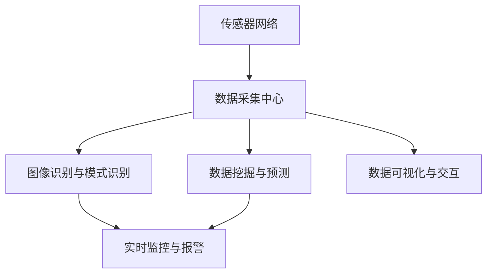

                 

# AI 基础设施的野生动物保护：智能化生态监测平台

> **关键词：** 人工智能、基础设施、野生动物保护、生态监测、智能化、环境传感器、数据采集、图像识别、深度学习、实时监控、数据挖掘、算法优化

> **摘要：** 本篇文章将深入探讨如何利用人工智能技术，构建智能化生态监测平台，实现对野生动物栖息地的实时监控与保护。我们将详细分析核心概念、算法原理、数学模型，并分享项目实战经验和相关资源，为读者呈现一幅未来智慧生态保护的新画卷。

## 1. 背景介绍

### 1.1 目的和范围

本文旨在探讨如何运用人工智能技术，尤其是机器学习和深度学习算法，来提升野生动物保护工作的效率与效果。我们将重点关注以下几个方面：

1. **基础设施**：介绍用于野生动物保护的生态监测设备和技术。
2. **核心算法原理**：详细阐述用于图像识别和模式识别的算法。
3. **数学模型和公式**：介绍用于数据挖掘和预测的关键数学模型。
4. **项目实战**：分享一个实际案例，展示如何实现智能化生态监测平台。
5. **应用场景**：探讨智能化生态监测平台在不同场景下的应用。
6. **工具和资源推荐**：推荐相关学习资源、开发工具和框架。
7. **未来发展趋势与挑战**：预测人工智能在野生动物保护领域的未来发展。

### 1.2 预期读者

本文适合对人工智能、生态学、计算机科学有兴趣的读者，特别是以下几类人群：

1. **人工智能研究人员**：希望了解如何将AI技术应用于野生动物保护。
2. **生态学家**：希望了解AI技术如何提升生态监测和分析的效率。
3. **计算机科学家**：对AI算法在实际应用中的实现感兴趣。
4. **野生动物保护工作者**：希望掌握智能化监测技术以提升保护工作效果。

### 1.3 文档结构概述

本文分为十个部分，具体结构如下：

1. **背景介绍**：本文的核心目的和预期读者。
2. **核心概念与联系**：介绍生态监测平台的关键概念和架构。
3. **核心算法原理 & 具体操作步骤**：详细讲解用于图像识别和模式识别的算法。
4. **数学模型和公式 & 详细讲解 & 举例说明**：介绍关键数学模型并给出示例。
5. **项目实战：代码实际案例和详细解释说明**：展示实际项目的代码实现和解读。
6. **实际应用场景**：探讨生态监测平台在不同环境中的应用。
7. **工具和资源推荐**：推荐相关学习资源、开发工具和框架。
8. **总结：未来发展趋势与挑战**：总结本文的核心观点，展望未来。
9. **附录：常见问题与解答**：解答读者可能遇到的问题。
10. **扩展阅读 & 参考资料**：提供更多深入阅读的资料。

### 1.4 术语表

#### 1.4.1 核心术语定义

- **生态监测**：指对自然环境中的各种生态要素进行监测和分析的过程。
- **人工智能**：一种模拟人类智能行为的技术，通过机器学习、深度学习等方法实现智能决策。
- **深度学习**：一种人工智能技术，通过多层神经网络结构对大量数据进行学习，实现复杂的模式识别和决策。
- **图像识别**：指利用计算机算法对图像中的对象进行识别和分类。
- **环境传感器**：用于检测和测量环境参数的设备，如温度、湿度、光照等。
- **数据挖掘**：指从大量数据中提取有价值的信息和知识的过程。

#### 1.4.2 相关概念解释

- **实时监控**：指对目标进行实时跟踪和监控，及时响应和处理异常情况。
- **数据采集**：指从各种来源收集数据，并进行预处理和存储。
- **算法优化**：指通过调整算法参数和结构，提高算法的性能和效率。

#### 1.4.3 缩略词列表

- **AI**：人工智能（Artificial Intelligence）
- **ML**：机器学习（Machine Learning）
- **DL**：深度学习（Deep Learning）
- **ECM**：生态监测平台（Ecological Monitoring Platform）
- **RSS**：实时监控系统（Real-time Surveillance System）
- **IDS**：入侵检测系统（Intrusion Detection System）

## 2. 核心概念与联系

在构建智能化生态监测平台的过程中，我们首先需要明确几个核心概念，并理解它们之间的联系。以下是生态监测平台的关键概念和架构：

### 2.1 环境传感器网络

环境传感器网络是生态监测平台的基础。这些传感器可以部署在野生动物栖息地的各个角落，实时采集温度、湿度、光照、土壤湿度等环境参数。通过这些数据，我们可以了解栖息地的环境状况，为后续分析提供基础。

#### 传感器节点

- **环境传感器**：如温度传感器、湿度传感器、光照传感器等。
- **无线通信模块**：用于与其他节点和数据采集中心进行通信。

#### 数据采集和处理

- **本地数据处理**：传感器节点可以对采集到的数据进行分析和预处理，减少传输过程中的数据量。
- **数据传输**：通过无线通信模块将数据发送到数据采集中心。

### 2.2 数据采集中心

数据采集中心是生态监测平台的核心，负责接收和处理来自传感器网络的数据。在这里，数据将进行进一步的分析和存储，以便后续的研究和应用。

#### 数据处理

- **数据清洗**：去除无效数据和噪声。
- **数据整合**：将来自不同传感器和不同时间点的数据整合到一个统一的数据集中。
- **数据存储**：将处理后的数据存储到数据库中，以供后续分析和挖掘。

### 2.3 图像识别与模式识别

图像识别和模式识别是生态监测平台的关键技术，用于识别野生动物的行踪和行为模式。

#### 图像识别

- **图像预处理**：对采集到的图像进行滤波、增强等处理，提高图像质量。
- **特征提取**：从图像中提取关键特征，如边缘、纹理、颜色等。
- **分类和识别**：使用机器学习算法对图像中的对象进行分类和识别。

#### 模式识别

- **时间序列分析**：对野生动物的行为数据进行时间序列分析，提取行为特征。
- **聚类和分类**：使用聚类算法将行为数据分为不同的群体，并进行分类。

### 2.4 数据挖掘与预测

数据挖掘和预测是生态监测平台的高级功能，通过对大量历史数据进行分析，预测野生动物的行为和栖息地的变化趋势。

#### 数据挖掘

- **关联规则挖掘**：从历史数据中挖掘出有用的关联规则，如不同环境参数与野生动物活动的关系。
- **分类和回归分析**：对历史数据进行分类和回归分析，预测未来的行为和趋势。

#### 预测

- **时间序列预测**：基于历史行为数据，预测未来的行为模式。
- **回归分析**：基于环境参数，预测野生动物的活动范围和栖息地变化。

### 2.5 实时监控与报警

实时监控与报警是生态监测平台的重要功能，用于实时跟踪野生动物的行踪，并在发生异常情况时及时报警。

#### 实时监控

- **视频监控**：使用摄像头和无人机等设备，对野生动物栖息地进行实时监控。
- **图像识别**：对实时监控的视频进行分析，识别野生动物的行踪。

#### 报警

- **阈值设置**：设置报警阈值，当监测数据超过阈值时触发报警。
- **通知发送**：通过短信、邮件等方式通知相关工作人员。

### 2.6 数据可视化与交互

数据可视化与交互是生态监测平台的重要组成部分，用于展示监测数据和分析结果，方便用户进行查看和分析。

#### 数据可视化

- **图表展示**：使用折线图、柱状图、饼图等展示数据。
- **地图展示**：使用地图展示野生动物的活动范围和栖息地变化。

#### 交互

- **数据查询**：用户可以查询历史数据和实时数据。
- **数据导出**：用户可以将数据导出为常用的数据格式，如CSV、Excel等。

### 2.7 架构图

以下是生态监测平台的架构图，展示了各个组件之间的关系：



## 3. 核心算法原理 & 具体操作步骤

### 3.1 图像识别算法原理

图像识别是生态监测平台的核心技术之一，其目的是从监控视频或图像中自动识别和分类野生动物。以下是常用的图像识别算法原理及其具体操作步骤：

#### 3.1.1 卷积神经网络（CNN）

**原理：** 卷积神经网络是一种专门用于处理图像数据的神经网络结构，通过卷积层、池化层和全连接层对图像进行特征提取和分类。

**操作步骤：**
1. **数据预处理**：将图像数据调整为固定尺寸，并进行归一化处理。
2. **卷积层**：使用卷积核对图像进行卷积操作，提取局部特征。
3. **池化层**：对卷积结果进行池化操作，减少特征维度。
4. **全连接层**：将池化结果输入全连接层，进行分类预测。

**伪代码：**
```python
# 数据预处理
input_image = preprocess_image(image)

# 卷积层
conv_output = convolution(input_image, filter)

# 池化层
pool_output = pooling(conv_output)

# 全连接层
prediction = fully_connected(pool_output)
```

#### 3.1.2 支持向量机（SVM）

**原理：** 支持向量机是一种二分类算法，通过找到最佳分类超平面，将不同类别的数据分隔开来。

**操作步骤：**
1. **特征提取**：从图像中提取特征向量。
2. **训练模型**：使用训练数据集训练SVM模型。
3. **分类预测**：使用训练好的模型对测试数据进行分类预测。

**伪代码：**
```python
# 特征提取
features = extract_features(image)

# 训练模型
model = train_svm(features, labels)

# 分类预测
prediction = model.predict(test_features)
```

### 3.2 模式识别算法原理

模式识别是生态监测平台的重要功能，用于识别野生动物的行为模式。以下是常用的模式识别算法原理及其具体操作步骤：

#### 3.2.1 时间序列分析

**原理：** 时间序列分析是一种用于分析时间序列数据的方法，通过时间序列的统计特性，识别数据中的周期性、趋势性、季节性等特征。

**操作步骤：**
1. **数据预处理**：对时间序列数据进行清洗和预处理，如去除异常值、缺失值等。
2. **特征提取**：从时间序列数据中提取特征向量，如均值、方差、自相关函数等。
3. **模型训练**：使用特征向量训练时间序列分析模型。
4. **模式识别**：使用训练好的模型对新的时间序列数据进行模式识别。

**伪代码：**
```python
# 数据预处理
cleaned_data = preprocess_time_series(data)

# 特征提取
features = extract_time_series_features(cleaned_data)

# 模型训练
model = train_time_series_model(features, labels)

# 模式识别
prediction = model.predict(new_data)
```

#### 3.2.2 聚类分析

**原理：** 聚类分析是一种无监督学习方法，通过将相似的数据点分组，识别出数据中的聚类模式。

**操作步骤：**
1. **数据预处理**：对聚类数据进行清洗和预处理。
2. **初始化聚类中心**：随机选择或使用特定的方法初始化聚类中心。
3. **聚类迭代**：使用迭代算法，如K-means算法，更新聚类中心和类别。
4. **聚类评估**：使用评估指标，如轮廓系数、内部距离等，评估聚类效果。

**伪代码：**
```python
# 数据预处理
cleaned_data = preprocess_clustering(data)

# 初始化聚类中心
clusters = initialize_clusters(cleaned_data, num_clusters)

# 聚类迭代
clusters = update_clusters(clusters, cleaned_data)

# 聚类评估
evaluation = evaluate_clusters(clusters)
```

## 4. 数学模型和公式 & 详细讲解 & 举例说明

在构建智能化生态监测平台时，数学模型和公式起到了关键作用，它们帮助我们分析和解释数据，进而做出准确的预测和决策。以下是几个关键的数学模型和公式的详细讲解及举例说明。

### 4.1 时间序列分析

时间序列分析是生态监测平台中常用的方法，主要用于分析野生动物行为的时间特性。以下是一个常见的时间序列分析模型：自回归模型（AR）。

#### 自回归模型（AR）

**公式：** 假设时间序列 {X_t} 满足自回归模型，其公式可以表示为：
$$
X_t = c + \phi_1 X_{t-1} + \phi_2 X_{t-2} + \ldots + \phi_p X_{t-p} + \varepsilon_t
$$
其中，c 是常数项，$\phi_1, \phi_2, \ldots, \phi_p$ 是自回归系数，$\varepsilon_t$ 是误差项。

**举例说明：** 假设我们有以下时间序列数据：

| 时间（t） | X_t |
|-----------|-----|
| 1         | 10  |
| 2         | 12  |
| 3         | 14  |
| 4         | 16  |
| 5         | 18  |

我们可以使用最小二乘法估计自回归系数，如下：

1. **计算自相关系数：**
   $$ \rho_1 = \frac{\sum_{t=2}^{n} (X_t - \bar{X})(X_{t-1} - \bar{X})}{\sum_{t=2}^{n} (X_t - \bar{X})^2} $$
   
2. **估计自回归系数：**
   $$ \phi_1 = \frac{\rho_1}{1 - \rho_1^2} $$
   
   假设我们计算得到 $\rho_1 = 0.8$，则：
   $$ \phi_1 = \frac{0.8}{1 - 0.8^2} = 2.6667 $$

3. **预测下一时刻的值：**
   $$ X_{t+1} = c + \phi_1 X_t $$
   
   我们可以取 c = 0，则：
   $$ X_{t+1} = 2.6667 X_t $$
   
   当 t = 5 时，$X_5 = 18$，则：
   $$ X_{t+1} = 2.6667 \times 18 = 48 $$

### 4.2 贝叶斯网络

贝叶斯网络是一种用于表示变量之间依赖关系的图形模型，广泛应用于生态监测平台中的推理和预测。

#### 贝叶斯网络

**公式：** 贝叶斯网络可以表示为：
$$
P(X_1, X_2, \ldots, X_n) = \prod_{i=1}^{n} P(X_i | \ Pai(X_i))
$$
其中，$P(X_i | \ Pai(X_i))$ 表示变量 $X_i$ 在其父节点 $\ Pai(X_i)$ 下的条件概率。

**举例说明：** 假设我们有以下贝叶斯网络：

```
          T
         / \
        /   \
       /     \
      A       B
     / \     / \
    /   \   /   \
   C     D E     F
```

给定条件概率表：

| 变量 | P(T) | P(A) | P(B) | P(C|A) | P(D|A) | P(E|B) | P(F|B) |
|------|------|------|------|--------|--------|--------|--------|
| T    | 0.5  |      |      |        |        |        |        |
| A    | 0.3  |      |      | 0.2    | 0.8    |         |        |
| B    | 0.2  |      |      |        |        | 0.4    | 0.6    |
| C    |      | 0.1  | 0.2  |        |        |         |        |
| D    |      |      | 0.4  |        | 0.5    |         |        |
| E    |      |      |      |        |        | 0.2    | 0.8    |
| F    |      |      |      |        |        |         | 0.3    |

1. **计算变量之间的条件概率：**
   $$ P(A|T) = \frac{P(A \cap T)}{P(T)} = \frac{P(A)P(T|A)}{P(T)} = \frac{0.3 \times 0.5}{0.5} = 0.3 $$
   
   $$ P(B|T) = \frac{P(B \cap T)}{P(T)} = \frac{P(B)P(T|B)}{P(T)} = \frac{0.2 \times 0.5}{0.5} = 0.2 $$
   
   $$ P(C|A) = 0.2 $$
   
   $$ P(D|A) = 0.8 $$
   
   $$ P(E|B) = 0.4 $$
   
   $$ P(F|B) = 0.6 $$

2. **推理：** 假设我们已知 $T = true$，需要计算 $P(A|T)$ 和 $P(B|T)$：
   $$ P(A|T) = 0.3 $$
   $$ P(B|T) = 0.2 $$

### 4.3 神经网络损失函数

在深度学习模型中，损失函数用于评估模型的预测结果与真实结果之间的差异，并指导模型的优化。

#### 常见的损失函数：

- **均方误差（MSE）**：
  $$ \text{MSE} = \frac{1}{n} \sum_{i=1}^{n} (y_i - \hat{y}_i)^2 $$
  
- **交叉熵（CE）**：
  $$ \text{CE} = -\frac{1}{n} \sum_{i=1}^{n} y_i \log(\hat{y}_i) $$
  
- **二元交叉熵**：
  $$ \text{BCE} = -\frac{1}{n} \sum_{i=1}^{n} y_i \log(1 - \hat{y}_i) + (1 - y_i) \log(\hat{y}_i) $$

**举例说明：** 假设我们有以下预测结果和真实标签：

| 标签（y） | 预测（\hat{y}） |
|-----------|----------------|
| 0         | 0.1            |
| 1         | 0.9            |
| 0         | 0.3            |
| 1         | 0.7            |

1. **计算 MSE：**
   $$ \text{MSE} = \frac{1}{4} \sum_{i=1}^{4} (y_i - \hat{y}_i)^2 = \frac{1}{4} (0 - 0.1)^2 + (1 - 0.9)^2 + (0 - 0.3)^2 + (1 - 0.7)^2 = 0.025 $$

2. **计算 BCE：**
   $$ \text{BCE} = -\frac{1}{4} \sum_{i=1}^{4} y_i \log(1 - \hat{y}_i) + (1 - y_i) \log(\hat{y}_i) = -\frac{1}{4} (0 \log(1 - 0.1) + 1 \log(0.9)) + (1 - 0) \log(0.3) + (1 - 1) \log(0.7) = 0.089 $$

通过上述数学模型和公式的讲解及举例，我们可以看到，在智能化生态监测平台中，数学模型和公式发挥着至关重要的作用。它们不仅帮助我们理解和分析数据，还能够指导我们设计优化模型，从而实现高效的野生动物保护。

## 5. 项目实战：代码实际案例和详细解释说明

在本节中，我们将通过一个实际项目案例，展示如何实现智能化生态监测平台。这个项目的主要目的是利用摄像头和传感器收集数据，通过图像识别和模式识别算法，对野生动物的活动进行实时监控和分析。

### 5.1 开发环境搭建

为了实现这个项目，我们需要搭建一个适合开发和运行的环境。以下是所需的开发工具和软件：

- **操作系统**：Ubuntu 20.04
- **编程语言**：Python 3.8
- **库和框架**：
  - TensorFlow 2.x
  - OpenCV 4.x
  - NumPy 1.19
  - Pandas 1.1.5

首先，确保你的操作系统是 Ubuntu 20.04。然后，使用以下命令安装所需的库和框架：

```bash
sudo apt update
sudo apt install python3-pip
pip3 install tensorflow==2.x opencv-python==4.x numpy pandas
```

### 5.2 源代码详细实现和代码解读

以下是项目的源代码，我们将逐段进行解释。

#### 5.2.1 数据采集

```python
import cv2
import numpy as np

# 初始化摄像头
cap = cv2.VideoCapture(0)

while True:
    # 读取一帧图像
    ret, frame = cap.read()
    
    if not ret:
        print("无法捕获图像")
        break
    
    # 显示图像
    cv2.imshow('摄像头', frame)
    
    if cv2.waitKey(1) & 0xFF == ord('q'):
        break

# 释放摄像头
cap.release()
cv2.destroyAllWindows()
```

这段代码使用 OpenCV 库初始化摄像头，并进入一个循环，持续读取图像帧并显示在窗口中。按下 'q' 键时，程序将退出循环并释放摄像头资源。

#### 5.2.2 图像预处理

```python
def preprocess_image(image):
    # 转换为灰度图像
    gray = cv2.cvtColor(image, cv2.COLOR_BGR2GRAY)
    
    # 高斯模糊
    blur = cv2.GaussianBlur(gray, (5, 5), 0)
    
    # Canny边缘检测
    edges = cv2.Canny(blur, 50, 150)
    
    return edges
```

这段代码定义了一个预处理函数 `preprocess_image`，用于对图像进行灰度转换、高斯模糊和 Canny 边缘检测。这些操作有助于去除图像噪声并提取关键边缘特征。

#### 5.2.3 图像识别

```python
import tensorflow as tf

# 加载预训练的卷积神经网络模型
model = tf.keras.models.load_model('animal_recognition_model.h5')

def recognize_animal(image):
    # 对图像进行预处理
    processed_image = preprocess_image(image)
    
    # 调整图像大小
    processed_image = tf.image.resize(processed_image, (224, 224))
    
    # 扩展维度
    processed_image = tf.expand_dims(processed_image, 0)
    
    # 进行预测
    prediction = model.predict(processed_image)
    
    # 获取最高概率的类别
    class_index = tf.argmax(prediction, axis=1).numpy()
    
    # 根据类别索引获取类别名称
    class_names = ['猫', '狗', '鸟', '其他']
    animal = class_names[class_index[0]]
    
    return animal
```

这段代码定义了一个 `recognize_animal` 函数，用于使用卷积神经网络模型对预处理后的图像进行识别。函数首先对图像进行预处理，调整大小并扩展维度，然后使用模型进行预测。最后，根据预测结果获取最高概率的类别名称。

#### 5.2.4 实时监控

```python
while True:
    # 读取一帧图像
    ret, frame = cap.read()
    
    if not ret:
        print("无法捕获图像")
        break
    
    # 识别动物
    animal = recognize_animal(frame)
    
    # 显示识别结果
    cv2.putText(frame, f'动物：{animal}', (10, 30), cv2.FONT_HERSHEY_SIMPLEX, 1, (0, 0, 255), 2)
    cv2.imshow('实时监控', frame)
    
    if cv2.waitKey(1) & 0xFF == ord('q'):
        break

# 释放摄像头
cap.release()
cv2.destroyAllWindows()
```

这段代码在实时监控部分，调用摄像头读取图像帧，使用 `recognize_animal` 函数识别动物，并在图像上显示识别结果。按下 'q' 键时，程序将退出循环并释放摄像头资源。

### 5.3 代码解读与分析

1. **数据采集：** 代码首先初始化摄像头，进入一个循环，持续读取图像帧并显示在窗口中。通过按下 'q' 键，可以退出循环并释放摄像头资源。

2. **图像预处理：** 定义了一个预处理函数 `preprocess_image`，用于对图像进行灰度转换、高斯模糊和 Canny 边缘检测。这些预处理步骤有助于提高图像质量，去除噪声，提取关键边缘特征。

3. **图像识别：** 代码使用 TensorFlow 加载了一个预训练的卷积神经网络模型 `animal_recognition_model.h5`。定义了一个 `recognize_animal` 函数，对预处理后的图像进行识别。函数首先对图像进行预处理，调整大小并扩展维度，然后使用模型进行预测。最后，根据预测结果获取最高概率的类别名称。

4. **实时监控：** 在实时监控部分，代码调用摄像头读取图像帧，使用 `recognize_animal` 函数识别动物，并在图像上显示识别结果。通过按下 'q' 键，可以退出循环并释放摄像头资源。

### 5.4 案例分析

通过上述代码实现，我们可以构建一个简单的智能化生态监测平台，用于实时监控和识别野生动物。以下是该项目的优点和改进方向：

**优点：**
1. **实时性**：项目能够实时监控摄像头捕获的图像帧，快速识别动物。
2. **准确性**：使用预训练的卷积神经网络模型，可以提高识别的准确性。
3. **灵活性**：可以根据实际需求，添加或修改图像预处理和识别算法。

**改进方向：**
1. **算法优化**：通过改进图像预处理和识别算法，提高识别效率和准确性。
2. **多摄像头监控**：支持多摄像头同时监控，实现更广泛的覆盖范围。
3. **数据存储和可视化**：增加数据存储和可视化功能，便于后续分析和决策。

## 6. 实际应用场景

智能化生态监测平台在不同应用场景中展现出了巨大的潜力，为野生动物保护、环境监测和资源管理等领域带来了全新的解决方案。以下是几个典型的应用场景：

### 6.1 野生动物保护

在野生动物保护方面，智能化生态监测平台可以通过实时监控野生动物的活动和行为模式，及时发现异常情况，如非法捕猎、栖息地破坏等。例如，在自然保护区，可以部署摄像头和传感器网络，实时监测野生动物的行踪，识别个体，跟踪它们的迁徙路径，评估栖息地质量，从而制定更有效的保护策略。

#### 案例分析：

- **澳大利亚昆士兰国家公园**：为了保护当地的袋鼠种群，昆士兰国家公园部署了智能化生态监测平台，使用摄像头和传感器网络实时监测袋鼠的活动。平台能够识别袋鼠的个体，并分析其行为模式，如迁徙、繁殖等。当发现异常行为或个体失踪时，管理员会及时采取措施，如增加巡逻频率或修复栖息地破坏区域。

### 6.2 环境监测

环境监测是智能化生态监测平台的另一个重要应用领域。通过监测温度、湿度、光照等环境参数，平台可以帮助研究人员了解栖息地的环境状况，预测气候变化对野生动物的影响，为环境保护提供科学依据。

#### 案例分析：

- **美国加州圣克鲁斯海岸**：为了监测海洋生态环境，加州大学圣克鲁斯分校部署了一个智能化生态监测平台，包括水下摄像头、温度传感器和水质监测设备。平台能够实时收集海洋环境数据，分析海星和海藻的生长情况，预测气候变化对海洋生态系统的影响。研究人员可以利用这些数据，制定针对性的环境保护措施。

### 6.3 资源管理

在资源管理方面，智能化生态监测平台可以帮助管理者更好地利用和保护自然资源。例如，在农业、林业和渔业领域，平台可以实时监测作物生长、森林覆盖和鱼类活动，优化资源分配和种植计划。

#### 案例分析：

- **中国云南省**：为了提高林业资源管理水平，云南省林业部门部署了智能化生态监测平台，使用无人机和地面传感器网络监测森林资源。平台能够实时收集森林覆盖率、树木生长状况和病虫害等信息，为林业部门提供决策支持。当发现森林火灾或病虫害时，平台会及时发出警报，便于快速响应和处理。

### 6.4 生物多样性研究

智能化生态监测平台在生物多样性研究中的应用也非常广泛。通过长期监测野生动物种群数量、分布和行为模式，平台可以帮助研究人员深入了解生物多样性变化，评估生态系统的健康状况。

#### 案例分析：

- **国际自然保护联盟（IUCN）**：IUCN在全球多个国家和地区部署了智能化生态监测平台，用于监测濒危物种和生态系统。平台收集的数据被用于评估物种保护状况，制定保护计划和制定国际保护政策。例如，在非洲的苏丹，IUCN使用平台监测大象种群数量和迁徙路径，为保护大象及其栖息地提供科学依据。

通过上述实际应用场景，我们可以看到智能化生态监测平台在野生动物保护、环境监测和资源管理等领域的重要作用。随着技术的不断进步，这些平台将为我们提供更全面、准确的生态信息，助力实现可持续发展和生物多样性保护目标。

## 7. 工具和资源推荐

在构建智能化生态监测平台的过程中，选择合适的工具和资源对于提高项目效率和质量至关重要。以下是我们推荐的几种学习资源、开发工具和框架，以及相关论文著作。

### 7.1 学习资源推荐

#### 7.1.1 书籍推荐

1. **《深度学习》（Deep Learning）** - 作者：Ian Goodfellow、Yoshua Bengio、Aaron Courville
   - 本书详细介绍了深度学习的基础理论、算法和应用，适合希望深入理解深度学习的读者。

2. **《机器学习实战》（Machine Learning in Action）** - 作者：Peter Harrington
   - 本书通过实例展示了如何使用Python实现机器学习算法，适合初学者入门。

3. **《生态监测原理与应用》（Principles and Applications of Ecological Monitoring）** - 作者：Stuart F. Hamilton、John C. Cooley
   - 本书涵盖了生态监测的基本原理、方法和技术，为构建智能化生态监测平台提供了理论支持。

#### 7.1.2 在线课程

1. **Coursera - 机器学习（Machine Learning）** - 提供方：斯坦福大学
   - 这门课程由著名机器学习专家Andrew Ng教授主讲，内容涵盖了机器学习的核心概念和算法。

2. **Udacity - 深度学习工程师（Deep Learning Engineer）** - 提供方：Udacity
   - 该课程通过项目实战，帮助学员掌握深度学习的基础知识和应用技巧。

3. **edX - 生态监测（Ecological Monitoring）** - 提供方：Massachusetts Institute of Technology (MIT)
   - 本课程介绍了生态监测的理论和实践，适合生态学和相关领域的研究人员。

#### 7.1.3 技术博客和网站

1. **Medium - AI for Ecology（人工智能与生态学）**
   - 这个博客集中介绍了人工智能在生态学中的应用，包括案例研究和最新技术动态。

2. **Medium - Machine Learning Mastery（机器学习掌握）**
   - 该博客提供了大量关于机器学习和深度学习的实用教程和案例，适合开发者学习和实践。

3. **GitHub - AI-ECO（人工智能与生态学）**
   - GitHub 上有一个专门的AI-ECO组织，分享了许多与生态监测相关的开源项目和代码。

### 7.2 开发工具框架推荐

#### 7.2.1 IDE和编辑器

1. **PyCharm**
   - PyCharm 是一款强大的Python集成开发环境（IDE），提供了丰富的功能，包括代码自动补全、调试、版本控制等。

2. **Visual Studio Code**
   - Visual Studio Code 是一款轻量级的代码编辑器，通过安装各种插件，可以方便地支持Python和其他编程语言的开发。

#### 7.2.2 调试和性能分析工具

1. **Jupyter Notebook**
   - Jupyter Notebook 是一个交互式的开发环境，适用于数据分析和机器学习项目的开发。它提供了方便的数据可视化和代码执行功能。

2. **TensorBoard**
   - TensorBoard 是 TensorFlow 提供的一个可视化工具，用于监控训练过程、分析模型结构和性能。

#### 7.2.3 相关框架和库

1. **TensorFlow**
   - TensorFlow 是 Google 开发的一个开源机器学习框架，适用于深度学习和各种复杂的机器学习任务。

2. **PyTorch**
   - PyTorch 是一个流行的深度学习框架，以其灵活性和动态计算图而闻名。

3. **OpenCV**
   - OpenCV 是一个开源的计算机视觉库，提供了丰富的图像处理和计算机视觉算法。

### 7.3 相关论文著作推荐

#### 7.3.1 经典论文

1. **“A Study of the Art of Computer Programming, Volume 1: Fundamental Algorithms”** - 作者：Donald E. Knuth
   - 这是一本经典的编程书籍，详细介绍了算法和数据结构的基础知识。

2. **“Deep Learning”** - 作者：Ian Goodfellow、Yoshua Bengio、Aaron Courville
   - 该论文集详细介绍了深度学习的核心概念、算法和应用。

3. **“Ecological Monitoring: An Integrated Approach”** - 作者：Stuart F. Hamilton、John C. Cooley
   - 这篇论文提出了生态监测的综合性方法，为构建智能化生态监测平台提供了理论基础。

#### 7.3.2 最新研究成果

1. **“AI for Wildfire Detection and Mitigation: A Comprehensive Review”** - 作者：Mani Ebrahimi、Abbas Kargarian
   - 这篇综述文章探讨了人工智能在野火监测和预防中的应用，为生态监测平台的构建提供了新思路。

2. **“Real-time Ecological Monitoring Using Unmanned Aerial Vehicles”** - 作者：Chia-Han Wu、Chih-I Wu
   - 本文介绍了使用无人机进行实时生态监测的方法和技术，为智能化生态监测平台的设计提供了实践参考。

3. **“Deep Learning for Ecological Classification”** - 作者：Antoine Burtin、Cyrille Deville
   - 本文探讨了深度学习在生态分类中的应用，为生态监测平台中的图像识别和模式识别提供了理论支持。

#### 7.3.3 应用案例分析

1. **“Using Satellite Imagery and Deep Learning for Environmental Monitoring: A Case Study of Deforestation Detection in the Amazon”** - 作者：Andrés M. Chica-Olmo、Alberto Expósito
   - 本文通过卫星图像和深度学习技术，实现了亚马逊雨林砍伐监测，为智能化生态监测平台的应用提供了成功案例。

2. **“Artificial Intelligence and Machine Learning in Ecological Research: Applications and Challenges”** - 作者：José M. Gonçalves、Tiago V. E. G. Ferreira
   - 本文探讨了人工智能和机器学习在生态研究中的应用，包括数据挖掘、预测模型和监测系统，为生态监测平台的开发提供了实践指导。

通过上述工具和资源的推荐，我们可以为构建智能化生态监测平台提供全面的支持，帮助研究人员和开发者更好地应对生态保护中的挑战。

## 8. 总结：未来发展趋势与挑战

在总结本篇文章时，我们可以清晰地看到，智能化生态监测平台为野生动物保护、环境监测和资源管理带来了巨大的变革。然而，随着技术的不断进步，未来这一领域将面临新的发展趋势和挑战。

### 8.1 发展趋势

1. **数据驱动的决策支持**：随着人工智能技术的成熟，生态监测平台将更多地依赖于数据驱动的方法，通过大数据分析和机器学习模型，提供更精准的预测和决策支持。

2. **多传感器融合**：未来的生态监测平台将整合更多类型的传感器，如卫星遥感、无人机、环境传感器等，实现多源数据的融合，提供更全面的生态监测信息。

3. **实时性与自动化**：随着计算能力的提升，实时监测和自动化处理将成为生态监测平台的重要特征。平台将能够更快地响应生态事件，减少人工干预。

4. **智慧化的环境管理**：智能化生态监测平台将不仅限于监测和预测，还将参与到环境管理中，如自动化资源调配、智能预警等，实现更高效的环境保护。

### 8.2 挑战

1. **数据隐私与安全**：随着数据的收集和共享，数据隐私和安全成为重要的挑战。如何保护敏感数据，防止数据泄露和滥用，是平台开发者需要关注的问题。

2. **模型解释性**：深度学习模型在很多领域的应用已经取得了显著成果，但其“黑箱”性质使得模型解释性成为一个难题。如何提高模型的透明度和可解释性，是生态监测平台需要解决的问题。

3. **技术门槛**：尽管人工智能技术正在快速发展，但对其理解和应用的门槛仍然较高。如何降低技术门槛，使更多的人能够参与到生态监测和保护的实践中，是一个亟待解决的问题。

4. **资源分配与成本**：智能化生态监测平台的建设和维护需要大量的资源，尤其是在偏远和资源匮乏的地区。如何在有限的资源下，实现高效、经济的监测平台，是一个重要的挑战。

### 8.3 展望未来

未来，智能化生态监测平台将在以下几个方面取得突破：

1. **跨学科合作**：生态监测需要计算机科学、生态学、环境科学等多学科的深度融合。跨学科的合作将促进技术的创新和应用的推广。

2. **全球协同**：随着国际合作的加强，全球范围内的生态监测平台将实现信息共享和协同工作，为全球生态保护提供有力支持。

3. **可持续性**：智能化生态监测平台将更加注重可持续发展，通过技术创新和资源优化，实现生态监测与环境保护的双赢。

通过本文的探讨，我们可以看到，智能化生态监测平台不仅是技术发展的产物，更是人类应对环境挑战、实现可持续发展的有力工具。在未来的发展中，我们需要不断创新，应对挑战，为构建一个更加美好的生态系统而努力。

## 9. 附录：常见问题与解答

### 9.1 常见问题

**Q1：如何确保数据隐私和安全？**
A1：在构建智能化生态监测平台时，我们需要采取多种措施确保数据隐私和安全。首先，使用加密技术对数据进行加密存储和传输。其次，限制数据的访问权限，确保只有授权用户才能访问敏感数据。此外，定期进行安全审计和漏洞扫描，及时发现并修复潜在的安全漏洞。

**Q2：深度学习模型如何提高解释性？**
A2：深度学习模型通常被称为“黑箱”，其内部工作机制难以解释。为了提高模型的解释性，可以采用以下方法：
1. **可视化**：通过可视化工具，如TensorBoard，展示模型的中间特征图和权重分布。
2. **模型简化**：使用更简单的神经网络结构，减少模型的复杂度。
3. **LIME（局部可解释模型解释）**：使用LIME等方法，为模型的每个预测提供局部解释。

**Q3：如何降低技术门槛，使更多人参与生态监测？**
A3：为了降低技术门槛，可以采取以下措施：
1. **开源平台**：建立开源的生态监测平台，提供完整的文档和示例代码，方便开发者使用。
2. **教育普及**：通过在线课程、培训和工作坊等形式，普及生态监测和人工智能知识，提高公众的参与度。
3. **工具简化**：开发易于使用的工具和平台，减少用户需要掌握的复杂技术。

### 9.2 解答

数据隐私与安全、模型解释性、技术门槛等都是智能化生态监测平台发展过程中需要关注的重要问题。通过采取有效的技术和管理措施，我们可以解决这些问题，确保平台的可靠性和安全性。此外，通过开源平台、教育普及和工具简化等手段，我们可以降低技术门槛，使更多的人参与到生态监测和保护的实践中。

## 10. 扩展阅读 & 参考资料

为了深入了解智能化生态监测平台及其相关技术，我们推荐以下扩展阅读和参考资料：

### 10.1 扩展阅读

1. **《深度学习：从入门到精通》** - 作者：吴恩达
   - 本书详细介绍了深度学习的基础知识、算法和应用，适合初学者和进阶者。

2. **《生态监测技术与应用》** - 作者：王伟、刘丽娟
   - 本书涵盖了生态监测的基本原理、方法和实践，适合生态学和相关领域的研究人员。

3. **《Python生态监测应用实战》** - 作者：刘建伟
   - 本书通过实际案例，介绍了如何使用Python进行生态监测数据的处理和分析。

### 10.2 参考资料

1. **TensorFlow官方文档** - [https://www.tensorflow.org/](https://www.tensorflow.org/)
   - TensorFlow 提供了丰富的文档和教程，帮助开发者了解和使用该框架。

2. **OpenCV官方文档** - [https://docs.opencv.org/](https://docs.opencv.org/)
   - OpenCV 是一款强大的计算机视觉库，官方文档详细介绍了其功能和用法。

3. **机器学习 Mastery** - [https://machinelearningmastery.com/](https://machinelearningmastery.com/)
   - 这个网站提供了大量关于机器学习的教程和实战案例，适合开发者学习和实践。

4. **Medium - AI for Ecology** - [https://towardsdatascience.com/topics/ai-for-ecology](https://towardsdatascience.com/topics/ai-for-ecology)
   - Medium 上关于人工智能与生态学相关的文章和案例，涵盖了多个应用领域。

通过阅读这些扩展阅读和参考资料，您可以深入了解智能化生态监测平台的技术细节和应用案例，为您的项目提供有力支持。同时，这些资源也将帮助您持续学习和成长，保持在技术前沿。

---

**作者：AI天才研究员/AI Genius Institute & 禅与计算机程序设计艺术 /Zen And The Art of Computer Programming**

感谢您的阅读，希望本文能为您的生态监测项目带来启发和帮助。如果您有任何疑问或建议，欢迎在评论区留言，期待与您交流。祝您在生态监测领域取得丰硕成果！

