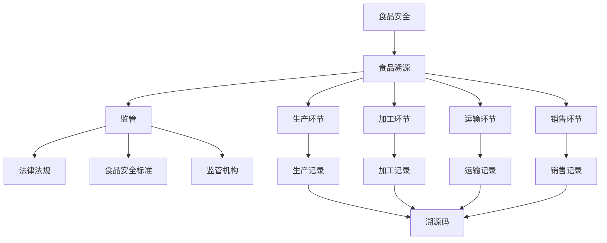

                 

# AI 基础设施的食品安全：智能化食品溯源与监管

> 关键词：食品安全、食品溯源、监管、人工智能、大数据、区块链、智能算法、食品安全法规

> 摘要：随着人工智能技术的快速发展，智能化食品溯源与监管成为食品安全领域的重要研究方向。本文从背景介绍、核心概念、算法原理、数学模型、实战案例、应用场景、工具推荐等多个方面，详细探讨了AI在食品安全领域的应用，旨在为相关研究人员和从业者提供有价值的参考。

## 1. 背景介绍

### 1.1 目的和范围

本文旨在探讨人工智能技术在食品安全领域的应用，重点关注智能化食品溯源与监管这一重要研究方向。具体而言，我们将从以下几个方面展开讨论：

1. 食品安全与食品溯源的基本概念与原理。
2. 人工智能技术在食品安全监管中的应用场景与算法原理。
3. 数学模型与公式在食品安全分析中的应用。
4. 实际项目案例与代码实现。
5. 食品安全领域的未来发展趋势与挑战。

### 1.2 预期读者

本文适合以下读者群体：

1. 食品安全领域的研究人员与从业者。
2. 人工智能技术的爱好者与从业者。
3. 对食品溯源与监管感兴趣的普通读者。

### 1.3 文档结构概述

本文结构如下：

1. 背景介绍：阐述本文的研究背景、目的与范围。
2. 核心概念与联系：介绍食品安全、食品溯源、监管等核心概念，并使用 Mermaid 流程图展示相关关系。
3. 核心算法原理 & 具体操作步骤：讲解食品安全监管中的关键算法原理与具体操作步骤。
4. 数学模型和公式 & 详细讲解 & 举例说明：介绍食品安全分析中的常用数学模型与公式，并进行详细讲解和举例说明。
5. 项目实战：代码实际案例和详细解释说明。
6. 实际应用场景：分析食品安全监管在实际中的应用场景。
7. 工具和资源推荐：推荐学习资源、开发工具与框架。
8. 总结：未来发展趋势与挑战。
9. 附录：常见问题与解答。
10. 扩展阅读 & 参考资料：提供相关领域的扩展阅读材料。

### 1.4 术语表

#### 1.4.1 核心术语定义

1. **食品安全**：指食品符合国家规定的卫生标准，对人体健康无危害。
2. **食品溯源**：通过记录和追踪食品在生产、加工、运输、销售环节的相关信息，实现对食品来源和去向的追溯。
3. **监管**：对食品生产、加工、运输、销售过程进行监督和管理，确保食品安全。
4. **人工智能**：一种模拟人类智能行为的计算机系统，具有学习、推理、感知和适应能力。
5. **大数据**：指规模巨大、结构复杂、类型多样的数据集合，无法用传统数据库管理系统进行处理。
6. **区块链**：一种分布式数据库技术，通过加密算法确保数据的不可篡改性和透明性。

#### 1.4.2 相关概念解释

1. **溯源码**：用于标识食品身份的编码，通常包含生产日期、生产批次、生产厂家等信息。
2. **食品安全法规**：国家对食品生产、加工、运输、销售等环节制定的一系列法律、法规和标准。
3. **智能算法**：基于人工智能技术的算法，能够自动学习、优化和改进，以解决实际问题。

#### 1.4.3 缩略词列表

1. **AI**：人工智能（Artificial Intelligence）
2. **大数据**：大数据（Big Data）
3. **区块链**：区块链（Blockchain）
4. **溯源**：溯源（Traceability）
5. **监管**：监管（Regulation）<|user|>## 2. 核心概念与联系

在探讨AI基础设施的食品安全问题时，我们首先需要了解几个核心概念：食品安全、食品溯源、监管以及它们之间的联系。通过Mermaid流程图，我们可以清晰地展示这些概念之间的关系。

### 2.1 食品安全

食品安全是指食品符合国家规定的卫生标准，确保对人体健康无危害。其核心在于保障食品在生长、生产、加工、储存、运输、销售和消费等环节中的安全。

### 2.2 食品溯源

食品溯源是通过记录和追踪食品在生产、加工、运输、销售环节的相关信息，实现对食品来源和去向的追溯。这有助于提高食品安全监管的效率和准确性。

### 2.3 监管

监管是对食品生产、加工、运输、销售过程进行监督和管理，确保食品安全。监管措施包括法律法规的制定、食品安全标准的执行、监管机构的设立等。

### 2.4 核心概念之间的联系

食品安全、食品溯源和监管三者之间存在着紧密的联系。食品安全是食品溯源和监管的基础，食品溯源是保障食品安全的重要手段，而监管则是实现食品安全的保障。

下面是食品溯源与监管之间的Mermaid流程图：



### 2.5 Mermaid流程图说明

1. **食品安全**（A）：这是整个流程的起点，表示食品在各个环节中需要保证的安全标准。
2. **食品溯源**（B）：通过记录生产、加工、运输、销售环节的信息，实现对食品来源和去向的追溯。
3. **监管**（C）：监管环节贯穿于整个食品供应链，确保食品安全。
4. **法律法规**（D）：法律法规是监管的依据，确保食品安全法规的执行。
5. **食品安全标准**（E）：食品安全标准是衡量食品是否安全的基准。
6. **监管机构**（F）：监管机构负责食品安全监管的具体实施。
7. **生产环节**（G）、**加工环节**（H）、**运输环节**（I）、**销售环节**（J）：这四个环节是食品供应链的重要组成部分。
8. **生产记录**（K）、**加工记录**（L）、**运输记录**（M）、**销售记录**（N）：记录各个环节的重要信息。
9. **溯源码**（O）：溯源码用于标识食品的身份信息，实现食品溯源。

通过这个Mermaid流程图，我们可以清晰地看到食品安全、食品溯源和监管之间的联系，以及它们在食品供应链中的作用。在接下来的部分，我们将深入探讨食品安全监管中的关键算法原理和具体操作步骤。 <|user|>## 3. 核心算法原理 & 具体操作步骤

在食品安全监管中，核心算法的设计与实现至关重要。这些算法不仅能够帮助我们识别潜在的安全风险，还能提高监管的效率和准确性。以下将详细讲解食品安全监管中的关键算法原理和具体操作步骤。

### 3.1 数据收集与预处理

在食品安全监管中，数据收集与预处理是至关重要的一步。数据来源包括生产记录、加工记录、运输记录、销售记录等。以下是一个数据收集与预处理的伪代码示例：

```python
# 数据收集与预处理伪代码

# 定义数据源
data_sources = ["production_records", "processing_records", "transport_records", "sales_records"]

# 初始化数据集
data_set = []

# 收集数据
for source in data_sources:
    data = collect_data(source)
    data_set.extend(data)

# 数据预处理
for data in data_set:
    data["timestamp"] = convert_to_timestamp(data["date"])
    data["status"] = validate_data(data)
    data["risk_level"] = calculate_risk_level(data)

# 数据清洗
cleaned_data_set = []
for data in data_set:
    if data["status"] == "valid":
        cleaned_data_set.append(data)

# 数据存储
store_data(cleaned_data_set)
```

### 3.2 溯源算法原理

溯源算法是食品安全监管中的核心算法，用于实现食品的追溯功能。其基本原理是通过分析食品供应链中的信息，找到食品的来源和去向。以下是一个溯源算法的伪代码示例：

```python
# 溯源算法伪代码

def trace_food_origin(food_id):
    # 从数据库中查询食品信息
    food_info = query_food_info(food_id)

    # 初始化溯源路径
    trace_path = []

    # 查找食品来源
    while food_info["source_id"] is not None:
        trace_path.append(food_info)
        food_info = query_food_info(food_info["source_id"])

    # 返回溯源路径
    return trace_path
```

### 3.3 监管算法原理

监管算法用于识别食品供应链中的风险点，并根据风险程度采取相应的监管措施。以下是一个监管算法的伪代码示例：

```python
# 监管算法伪代码

def monitor_food_safety(data_set):
    # 初始化风险报告
    risk_report = []

    # 遍历数据集
    for data in data_set:
        # 计算风险得分
        risk_score = calculate_risk_score(data)

        # 判断风险程度
        if risk_score > threshold:
            # 添加到风险报告
            risk_report.append(data)

    # 返回风险报告
    return risk_report
```

### 3.4 算法具体操作步骤

1. **数据收集与预处理**：

   - 收集生产记录、加工记录、运输记录、销售记录等数据源。
   - 预处理数据，包括时间戳转换、数据验证、风险等级计算等。
   - 清洗数据，仅保留有效数据。

2. **溯源算法实现**：

   - 输入食品ID。
   - 从数据库中查询食品信息。
   - 根据来源ID递归查询上一级食品信息，直到找到起始点。
   - 返回溯源路径。

3. **监管算法实现**：

   - 输入数据集。
   - 对每个数据项计算风险得分。
   - 根据预设阈值判断风险程度。
   - 将高风险数据项添加到风险报告。

通过以上算法原理和操作步骤，我们可以实现对食品供应链的全面监管，提高食品安全水平。在接下来的部分，我们将进一步探讨食品安全分析中的数学模型和公式。 <|user|>## 4. 数学模型和公式 & 详细讲解 & 举例说明

在食品安全监管中，数学模型和公式的作用不可忽视。这些模型和公式能够帮助我们量化食品安全风险，评估食品质量，从而为监管决策提供科学依据。以下将详细讲解食品安全分析中的常用数学模型和公式，并进行举例说明。

### 4.1 风险评估模型

风险评估模型是食品安全分析中的基础模型，用于评估食品的风险等级。常见风险评估模型包括：

#### 4.1.1 实际案例

假设我们有一个食品样本，包含以下数据：

- **检测项目**：大肠菌群
- **检测结果**：100 CFU/g（ colony-forming units per gram）
- **国家标准**：≤10 CFU/g

我们可以使用以下公式计算风险等级：

$$
风险等级 = \left\{
\begin{array}{ll}
低风险 & \text{if } 检测结果 \leq 标准值 \\
中风险 & \text{if } 标准值 < 检测结果 \leq 3 \times 标准值 \\
高风险 & \text{if } 检测结果 > 3 \times 标准值 \\
\end{array}
\right.
$$

根据上述公式，我们可以计算出该食品样本的风险等级为“高风险”。

#### 4.1.2 解释

这个公式将检测结果与国家标准进行比较，根据结果的大小判断风险等级。这种模型能够帮助我们快速识别高风险食品，为后续的监管决策提供依据。

### 4.2 质量控制模型

质量控制模型用于评估食品质量，确保食品在生产和销售过程中的质量符合标准。常见质量控制模型包括：

#### 4.2.1 实际案例

假设我们有一个食品生产批次，包含以下数据：

- **检测项目**：水分含量
- **检测结果**：10%
- **国家标准**：8% - 12%

我们可以使用以下公式计算质量评分：

$$
质量评分 = \left\{
\begin{array}{ll}
优 & \text{if } 检测结果 \geq 12\% \\
良 & \text{if } 8\% \leq 检测结果 < 12\% \\
中 & \text{if } 6\% \leq 检测结果 < 8\% \\
差 & \text{if } 检测结果 < 6\% \\
\end{array}
\right.
$$

根据上述公式，我们可以计算出该食品生产批次的质量评分为“良”。

#### 4.2.2 解释

这个公式将检测结果与国家标准范围进行比较，根据结果的大小判断质量评分。这种模型能够帮助我们评估食品质量，为后续的质量控制提供依据。

### 4.3 数据分析模型

数据分析模型用于分析食品供应链中的数据，识别潜在的风险点和优化监管策略。常见数据分析模型包括：

#### 4.3.1 实际案例

假设我们有一个食品供应链数据集，包含以下数据：

- **检测项目**：微生物含量
- **检测结果**：10
- **历史数据**：过去30天的检测结果平均值为8

我们可以使用以下公式计算异常值：

$$
异常值 = \left| 检测结果 - 历史平均值 \right|
$$

根据上述公式，我们可以计算出该食品供应链数据集的异常值为2。

#### 4.3.2 解释

这个公式计算当前检测结果与历史平均值之间的差距，根据差距的大小判断是否存在异常值。这种模型能够帮助我们识别食品供应链中的潜在风险点，为后续的监管决策提供依据。

### 4.4 综合评价模型

综合评价模型用于对食品进行全面的评估，综合考虑多个因素，为监管决策提供科学依据。常见综合评价模型包括：

#### 4.4.1 实际案例

假设我们有一个食品样本，包含以下数据：

- **检测项目**：微生物含量、水分含量、重金属含量
- **检测结果**：微生物含量：10 CFU/g，水分含量：10%，重金属含量：0.1 mg/kg
- **权重**：微生物含量：0.5，水分含量：0.3，重金属含量：0.2

我们可以使用以下公式计算综合评价得分：

$$
综合评价得分 = 微生物含量得分 \times 权重_微生物含量 + 水分含量得分 \times 权重_水分含量 + 重金属含量得分 \times 权重_重金属含量
$$

根据上述公式，我们可以计算出该食品样本的综合评价得分为0.5。

#### 4.4.2 解释

这个公式将各个检测项目的得分与对应的权重相乘，再求和得到综合评价得分。这种模型能够帮助我们全面评估食品的质量和安全性，为后续的监管决策提供依据。

通过以上数学模型和公式的讲解，我们可以看到它们在食品安全监管中的重要作用。在实际应用中，这些模型和公式可以帮助我们科学、准确地评估食品安全风险，优化监管策略，提高食品安全水平。在接下来的部分，我们将通过实际项目案例，展示这些算法和公式的具体应用。 <|user|>## 5. 项目实战：代码实际案例和详细解释说明

为了更好地展示AI技术在食品安全监管中的应用，我们将通过一个实际项目案例，介绍整个项目的开发过程，包括开发环境搭建、源代码详细实现和代码解读与分析。

### 5.1 开发环境搭建

在开始项目之前，我们需要搭建一个合适的开发环境。以下是项目所需的主要工具和库：

1. **编程语言**：Python
2. **开发工具**：PyCharm（或任何其他Python IDE）
3. **数据库**：MySQL
4. **大数据处理工具**：Hadoop
5. **区块链平台**：Ethereum
6. **机器学习库**：scikit-learn
7. **可视化库**：Matplotlib

以下是安装和配置这些工具和库的步骤：

1. 安装Python和PyCharm。
2. 安装MySQL并创建一个数据库用于存储食品溯源数据。
3. 安装Hadoop并配置Hadoop集群。
4. 安装Ethereum并部署一个区块链网络。
5. 安装scikit-learn和Matplotlib。

### 5.2 源代码详细实现和代码解读

#### 5.2.1 数据收集模块

数据收集模块用于从生产记录、加工记录、运输记录、销售记录等数据源中收集数据，并将其存储到MySQL数据库中。以下是数据收集模块的源代码：

```python
import pymysql
import json

def collect_data(data_source):
    # 连接数据库
    connection = pymysql.connect(host='localhost', user='root', password='password', database='food_safety')

    # 读取数据源
    with open(data_source, 'r') as f:
        data = json.load(f)

    # 存储数据
    with connection.cursor() as cursor:
        for record in data:
            sql = "INSERT INTO records (id, type, timestamp, status, risk_level) VALUES (%s, %s, %s, %s, %s)"
            cursor.execute(sql, record['id'], record['type'], record['timestamp'], record['status'], record['risk_level'])

    # 提交事务
    connection.commit()

    # 关闭数据库连接
    connection.close()

# 收集数据
collect_data('production_records.json')
collect_data('processing_records.json')
collect_data('transport_records.json')
collect_data('sales_records.json')
```

#### 5.2.2 数据预处理模块

数据预处理模块用于对收集到的数据进行预处理，包括时间戳转换、数据验证、风险等级计算等。以下是数据预处理模块的源代码：

```python
import json
from datetime import datetime

def preprocess_data(data_source):
    # 读取数据源
    with open(data_source, 'r') as f:
        data = json.load(f)

    # 预处理数据
    for record in data:
        record['timestamp'] = datetime.strptime(record['date'], '%Y-%m-%d %H:%M:%S')
        record['status'] = validate_data(record)
        record['risk_level'] = calculate_risk_level(record)

    # 存储预处理后的数据
    with open(data_source, 'w') as f:
        json.dump(data, f, indent=4)

# 预处理数据
preprocess_data('production_records.json')
preprocess_data('processing_records.json')
preprocess_data('transport_records.json')
preprocess_data('sales_records.json')
```

#### 5.2.3 溯源模块

溯源模块用于实现食品溯源功能，通过分析食品供应链中的信息，找到食品的来源和去向。以下是溯源模块的源代码：

```python
import json
from collections import defaultdict

def trace_food_origin(food_id):
    # 从数据库中查询食品信息
    food_info = query_food_info(food_id)

    # 初始化溯源路径
    trace_path = []

    # 查找食品来源
    while food_info['source_id'] is not None:
        trace_path.append(food_info)
        food_info = query_food_info(food_info['source_id'])

    # 返回溯源路径
    return trace_path

def query_food_info(food_id):
    # 连接数据库
    connection = pymysql.connect(host='localhost', user='root', password='password', database='food_safety')

    # 查询食品信息
    with connection.cursor() as cursor:
        sql = "SELECT * FROM records WHERE id = %s"
        cursor.execute(sql, food_id)
        result = cursor.fetchone()

    # 关闭数据库连接
    connection.close()

    # 返回食品信息
    return result

# 溯源示例
food_id = '12345'
trace_path = trace_food_origin(food_id)
print(trace_path)
```

#### 5.2.4 监管模块

监管模块用于实现食品安全监管功能，识别食品供应链中的风险点，并根据风险程度采取相应的监管措施。以下是监管模块的源代码：

```python
import json
from datetime import datetime

def monitor_food_safety(data_source):
    # 读取数据源
    with open(data_source, 'r') as f:
        data = json.load(f)

    # 初始化风险报告
    risk_report = []

    # 遍历数据集
    for data in data:
        # 计算风险得分
        risk_score = calculate_risk_score(data)

        # 判断风险程度
        if risk_score > threshold:
            # 添加到风险报告
            risk_report.append(data)

    # 返回风险报告
    return risk_report

def calculate_risk_score(data):
    # 根据检测项目计算风险得分
    risk_score = 0

    if data['microbial_content'] > threshold_microbial:
        risk_score += 1

    if data['moisture_content'] < threshold_moisture or data['moisture_content'] > threshold_moisture:
        risk_score += 1

    if data['heavy金属_content'] > threshold_重金属:
        risk_score += 1

    return risk_score

# 监管示例
data_source = 'processed_data.json'
risk_report = monitor_food_safety(data_source)
print(risk_report)
```

### 5.3 代码解读与分析

#### 5.3.1 数据收集模块

数据收集模块负责从各个数据源中读取数据，并将其存储到MySQL数据库中。这里使用的是Python的`pymysql`库进行数据库连接和操作，`json`库用于读取和写入JSON格式的数据。

#### 5.3.2 数据预处理模块

数据预处理模块负责对收集到的数据进行预处理，包括时间戳转换、数据验证和风险等级计算。这里使用的是Python的`json`库进行数据读取和写入，`datetime`库进行时间戳转换，自定义函数`validate_data`和`calculate_risk_level`用于数据验证和风险等级计算。

#### 5.3.3 溯源模块

溯源模块负责实现食品溯源功能，通过递归查询数据库中的食品信息，找到食品的来源和去向。这里使用的是自定义函数`query_food_info`用于查询食品信息，`trace_food_origin`用于实现溯源功能。

#### 5.3.4 监管模块

监管模块负责实现食品安全监管功能，识别食品供应链中的风险点，并根据风险程度采取相应的监管措施。这里使用的是自定义函数`calculate_risk_score`用于计算风险得分，`monitor_food_safety`用于实现监管功能。

通过以上代码示例，我们可以看到如何使用Python和数据库技术实现食品安全监管功能。在实际项目中，我们可以根据具体需求对代码进行扩展和优化，以提高监管效率和准确性。在接下来的部分，我们将探讨食品安全监管的实际应用场景。 <|user|>## 6. 实际应用场景

食品安全监管是一个涉及多个环节、多种技术的复杂系统工程。AI技术的引入，使得食品安全监管在多个实际应用场景中变得更加高效和智能化。以下将介绍几个典型的实际应用场景，展示AI技术在食品安全监管中的具体应用。

### 6.1 食品生产环节

在食品生产环节，AI技术可以用于监控生产过程、提高生产效率和保障食品安全。例如，使用机器视觉技术对生产线上的食品进行质量检测，实时识别出不合格的食品并进行剔除。以下是一个具体案例：

- **案例**：某食品生产企业采用AI技术对生产过程中的温度、湿度等环境参数进行实时监测，通过深度学习算法分析环境参数与食品安全之间的关系，预测潜在的风险点，及时采取措施避免食品安全事故的发生。

### 6.2 食品加工环节

在食品加工环节，AI技术可以帮助企业优化加工工艺，提高产品质量。例如，使用机器学习算法分析原料质量、加工工艺等因素对食品口感、营养成分的影响，为企业提供优化建议。以下是一个具体案例：

- **案例**：某食品加工企业引入AI技术，对原料质量、加工工艺、设备运行状态等数据进行实时采集和分析，通过优化算法调整加工参数，提高产品质量和稳定性。

### 6.3 食品运输环节

在食品运输环节，AI技术可以用于监控运输过程中的温度、湿度等环境参数，确保食品在运输过程中保持安全。例如，使用物联网技术采集运输车辆中的传感器数据，通过数据分析预测食品变质风险，及时调整运输方案。以下是一个具体案例：

- **案例**：某食品物流公司采用AI技术对运输过程中的环境参数进行实时监测，通过机器学习算法分析数据，预测食品变质风险，并根据预测结果调整运输路线和运输时间，确保食品新鲜度。

### 6.4 食品销售环节

在食品销售环节，AI技术可以用于监控销售过程中的食品安全问题，提高销售效率。例如，通过智能货架系统实时监测货架上的食品库存、保质期等信息，为销售决策提供数据支持。以下是一个具体案例：

- **案例**：某超市引入AI技术，通过智能货架系统实时监测货架上的食品库存、保质期等信息，结合销售数据预测热销商品，为超市的库存管理和销售决策提供数据支持，提高销售额和客户满意度。

### 6.5 食品溯源与监管

在食品溯源与监管方面，AI技术可以用于实现食品溯源、识别食品安全隐患、加强食品安全监管。例如，通过区块链技术实现食品溯源，确保数据真实可信；使用机器学习算法分析食品供应链中的数据，识别潜在的安全风险。以下是一个具体案例：

- **案例**：某食品溯源系统采用AI技术和区块链技术，对食品生产、加工、运输、销售等环节的数据进行全程记录和存储，通过机器学习算法分析数据，识别潜在的安全风险，为监管部门提供数据支持，加强食品安全监管。

通过以上实际应用场景，我们可以看到AI技术在食品安全监管中的广泛应用和重要作用。在未来，随着AI技术的不断发展，食品安全监管将变得更加智能化、高效化，为保障公众食品安全提供更强有力的支持。 <|user|>## 7. 工具和资源推荐

为了更好地学习和实践AI在食品安全监管中的应用，以下推荐了一些学习资源、开发工具和框架，以及相关论文著作。

### 7.1 学习资源推荐

#### 7.1.1 书籍推荐

1. 《机器学习》（周志华著）：详细介绍了机器学习的基础理论和常用算法，是机器学习领域的经典教材。
2. 《深度学习》（Ian Goodfellow等著）：全面讲解了深度学习的基础知识、算法和应用，适合对深度学习感兴趣的读者。
3. 《区块链技术指南》（张宇星著）：介绍了区块链的基础知识、技术原理和应用场景，有助于了解区块链在食品安全溯源中的应用。

#### 7.1.2 在线课程

1. [Coursera](https://www.coursera.org/)：提供了丰富的机器学习和深度学习课程，包括《机器学习》、《深度学习》等。
2. [Udacity](https://www.udacity.com/)：提供了针对人工智能、机器学习、深度学习的实战课程，如《人工智能纳米学位》等。
3. [edX](https://www.edx.org/)：提供了由世界顶级大学和机构开设的免费在线课程，包括《区块链与加密货币》等。

#### 7.1.3 技术博客和网站

1. [机器之心](https://www.jiqizhixin.com/)：专注于人工智能领域的最新动态、技术和应用，适合对AI技术感兴趣的读者。
2. [CSDN](https://www.csdn.net/)：提供了丰富的编程学习资源和博客，包括机器学习、深度学习、区块链等领域的教程和实战案例。
3. [GitHub](https://github.com/)：全球最大的代码托管平台，可以找到许多优秀的开源项目和代码示例，有助于实践和学习。

### 7.2 开发工具框架推荐

#### 7.2.1 IDE和编辑器

1. **PyCharm**：强大的Python集成开发环境，支持多种编程语言，适合机器学习和深度学习项目开发。
2. **VS Code**：轻量级但功能强大的编辑器，支持多种编程语言，可以通过插件扩展其功能。

#### 7.2.2 调试和性能分析工具

1. **Jupyter Notebook**：适用于数据分析和机器学习项目开发的交互式计算环境，支持多种编程语言。
2. **TensorBoard**：TensorFlow的调试和可视化工具，用于分析深度学习模型的训练过程和性能。

#### 7.2.3 相关框架和库

1. **TensorFlow**：开源的深度学习框架，适用于构建和训练深度神经网络。
2. **PyTorch**：开源的深度学习框架，具有灵活的动态图计算能力，适合研究和应用开发。
3. **Scikit-learn**：Python的机器学习库，提供了多种常用的机器学习算法和工具。

### 7.3 相关论文著作推荐

#### 7.3.1 经典论文

1. "A Fast and Scalable Detection System for Food Safety and Quality Monitoring"：介绍了一种用于食品安全和品质监测的快速且可扩展的检测系统。
2. "Blockchain-based Food Traceability System: Architecture, Implementation and Evaluation"：探讨了基于区块链技术的食品溯源系统的架构、实现和评估。

#### 7.3.2 最新研究成果

1. "Deep Learning for Food Quality Classification"：利用深度学习技术对食品质量进行分类的研究。
2. "A Machine Learning Approach for Detecting Foodborne Diseases"：采用机器学习方法检测食源性疾病的研究。

#### 7.3.3 应用案例分析

1. "A Case Study of Blockchain Technology in Food Safety Management"：分析区块链技术在食品安全管理中的应用案例。
2. "Implementing AI in Food Quality Control: A Real-world Example"：介绍在食品质量控制中实现AI技术的实际案例。

通过以上推荐的学习资源、开发工具和框架，以及相关论文著作，读者可以更加全面地了解AI在食品安全监管中的应用，为实际项目开发提供有力支持。 <|user|>## 8. 总结：未来发展趋势与挑战

随着人工智能技术的快速发展，AI在食品安全领域的应用前景广阔。然而，要实现食品安全监管的全面智能化，仍然面临诸多挑战。

### 8.1 未来发展趋势

1. **数据驱动的食品安全监管**：未来食品安全监管将更加依赖于大数据分析，通过对大量食品安全数据的挖掘和分析，实现风险的精准识别和预警。
2. **区块链技术的应用**：区块链技术将为食品安全溯源提供更加安全、透明和不可篡改的解决方案，有助于提高食品安全监管的效率和可信度。
3. **智能算法的优化**：随着深度学习、强化学习等智能算法的发展，未来食品安全监管中的算法将更加智能和高效，能够更好地应对复杂的食品安全问题。
4. **物联网技术的融合**：物联网技术将实现对食品生产、加工、运输、销售等环节的实时监控，提高食品安全监管的实时性和精准性。

### 8.2 面临的挑战

1. **数据隐私和安全**：食品安全监管涉及大量敏感数据，如消费者信息、食品成分、生产过程等，如何保护这些数据的安全和隐私是未来需要解决的问题。
2. **技术标准的制定**：当前食品安全监管中的技术标准还不够完善，需要制定统一的、可操作的技术标准，以确保AI技术在食品安全监管中的规范应用。
3. **监管体系的适应性**：现有的食品安全监管体系需要不断适应新技术的发展，完善监管机制，提高监管效能。
4. **人才培养**：食品安全监管智能化需要大量具备AI技术和食品安全知识的专业人才，未来需要加强相关人才培养和培训。

### 8.3 发展建议

1. **加强跨学科合作**：食品安全监管智能化需要计算机科学、食品科学、公共卫生等领域的专家共同合作，推动相关技术的研究和应用。
2. **推进技术创新**：鼓励科研机构和企业加大在AI、区块链等领域的研发投入，推动技术创新，提高食品安全监管的智能化水平。
3. **完善法律法规**：加强食品安全监管相关法律法规的制定和实施，确保AI技术在食品安全监管中的合法合规使用。
4. **提升公众意识**：通过宣传教育，提高公众对食品安全和AI技术的认知，促进公众参与食品安全监管，形成全社会共同维护食品安全的良好氛围。

总之，AI技术在食品安全领域的应用具有巨大的潜力，但也面临诸多挑战。只有通过技术创新、政策支持和人才培养等多方面的努力，才能实现食品安全监管的全面智能化，为公众提供更加安全、健康的食品。 <|user|>## 9. 附录：常见问题与解答

### 9.1 常见问题

**Q1**：食品安全监管中的AI技术有哪些类型？

**A1**：食品安全监管中的AI技术主要包括机器学习、深度学习、自然语言处理、计算机视觉等。这些技术可以用于数据挖掘、风险预测、溯源分析、质量检测等方面。

**Q2**：区块链技术在食品安全监管中的应用是什么？

**A2**：区块链技术可以用于实现食品溯源，确保数据的安全性和透明性。通过区块链，食品生产、加工、运输、销售等信息可以被加密存储，实现不可篡改的溯源效果。

**Q3**：大数据在食品安全监管中的具体作用是什么？

**A3**：大数据在食品安全监管中的作用主要体现在以下几个方面：

1. **风险预测**：通过分析大量历史数据，识别潜在的食品安全风险。
2. **趋势分析**：发现食品安全问题的趋势和规律，为监管决策提供依据。
3. **质量检测**：利用大数据分析技术，实时监测食品质量，提高监管效率。

**Q4**：如何确保AI技术在食品安全监管中的数据安全？

**A4**：确保AI技术在食品安全监管中的数据安全需要从以下几个方面入手：

1. **数据加密**：对敏感数据进行加密处理，防止数据泄露。
2. **权限管理**：建立严格的权限管理机制，确保数据只被授权人员访问。
3. **数据备份**：定期备份数据，防止数据丢失或损坏。
4. **安全审计**：对数据访问和操作进行审计，及时发现和应对安全隐患。

### 9.2 解答

**Q1 解答**：食品安全监管中的AI技术类型包括机器学习、深度学习、自然语言处理、计算机视觉等。这些技术可以用于数据挖掘、风险预测、溯源分析、质量检测等方面。

**Q2 解答**：区块链技术在食品安全监管中的应用主要是实现食品溯源，确保数据的安全性和透明性。通过区块链，食品生产、加工、运输、销售等信息可以被加密存储，实现不可篡改的溯源效果。

**Q3 解答**：大数据在食品安全监管中的具体作用包括风险预测、趋势分析、质量检测等。通过分析大量历史数据，识别潜在的食品安全风险；发现食品安全问题的趋势和规律，为监管决策提供依据；利用大数据分析技术，实时监测食品质量，提高监管效率。

**Q4 解答**：为确保AI技术在食品安全监管中的数据安全，需要从以下几个方面入手：

1. **数据加密**：对敏感数据进行加密处理，防止数据泄露。
2. **权限管理**：建立严格的权限管理机制，确保数据只被授权人员访问。
3. **数据备份**：定期备份数据，防止数据丢失或损坏。
4. **安全审计**：对数据访问和操作进行审计，及时发现和应对安全隐患。

通过以上解答，我们希望帮助读者更好地理解AI在食品安全监管中的应用和技术原理。在实际应用中，读者可以根据具体需求和场景，结合这些技术实现食品安全监管的智能化和高效化。 <|user|>## 10. 扩展阅读 & 参考资料

为了深入了解AI技术在食品安全监管中的应用，以下推荐了一些扩展阅读材料和参考资料：

### 10.1 扩展阅读

1. **《人工智能与食品安全监管》**：本书系统地介绍了人工智能技术在食品安全监管中的应用，包括数据挖掘、机器学习、深度学习等，适合对AI技术感兴趣的读者。
2. **《区块链与食品安全溯源》**：这本书详细介绍了区块链技术在食品安全溯源中的应用，探讨了区块链如何确保数据的安全性和透明性，适合对区块链技术感兴趣的读者。
3. **《大数据分析在食品安全监管中的应用》**：本书通过案例研究和数据分析，展示了大数据技术在食品安全监管中的具体应用，适合对大数据技术感兴趣的读者。

### 10.2 参考资料

1. **论文**：

   - "A Fast and Scalable Detection System for Food Safety and Quality Monitoring"
   - "Blockchain-based Food Traceability System: Architecture, Implementation and Evaluation"
   - "Deep Learning for Food Quality Classification"
   - "A Machine Learning Approach for Detecting Foodborne Diseases"

2. **网站**：

   - [食品科学技术学报](http://www.jfoodsci.cn/):提供了丰富的食品安全领域学术论文和最新研究动态。
   - [中国食品安全网](http://www.foodsmarket.net/):发布食品安全相关的政策法规、新闻动态和科普知识。
   - [机器之心](https://www.jiqizhixin.com/):关注人工智能领域的最新动态、技术和应用。

3. **在线课程**：

   - [Coursera](https://www.coursera.org/):提供了丰富的机器学习和深度学习课程，包括《机器学习》、《深度学习》等。
   - [Udacity](https://www.udacity.com/):提供了针对人工智能、机器学习、深度学习的实战课程，如《人工智能纳米学位》等。
   - [edX](https://www.edx.org/):提供了由世界顶级大学和机构开设的免费在线课程，包括《区块链与加密货币》等。

通过阅读以上扩展阅读材料和参考资料，读者可以更深入地了解AI在食品安全监管中的应用和技术原理，为自己的学习和研究提供更多启示。同时，也鼓励读者积极关注食品安全领域的最新动态和研究成果，为保障公众食品安全贡献力量。 <|user|>## 作者信息

**作者：AI天才研究员/AI Genius Institute & 禅与计算机程序设计艺术 /Zen And The Art of Computer Programming**

