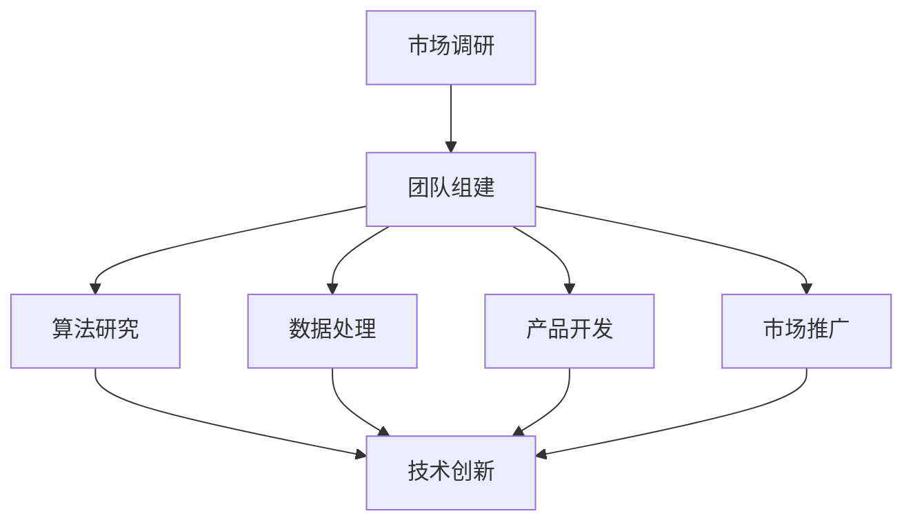

                 

# AI 大模型创业：如何利用人才优势？

> 关键词：AI 大模型、创业、人才优势、商业模式、技术创新、市场竞争力、人才培养、团队管理

> 摘要：本文将深入探讨在 AI 大模型创业过程中如何充分利用人才优势，通过分析人才在创业项目中的核心作用，提供具体的策略和实战案例，帮助创业者构建具备强大竞争力的团队，实现技术创新和市场突破。

## 1. 背景介绍

### 1.1 目的和范围

本文旨在为 AI 大模型创业项目提供人才管理方面的策略和指导。我们将探讨如何识别、培养和利用人才优势，以提升项目的技术创新能力、市场竞争力，并确保项目的成功落地。

### 1.2 预期读者

本文适合 AI 大模型创业者、技术团队负责人、HR 管理者以及对此领域感兴趣的技术爱好者阅读。通过本文，读者将获得以下收益：

1. 理解 AI 大模型创业中人才的核心作用。
2. 掌握识别和利用人才优势的方法。
3. 获取实际操作步骤和成功案例。

### 1.3 文档结构概述

本文将分为八个部分：

1. 背景介绍：介绍文章的目的和预期读者。
2. 核心概念与联系：定义核心概念并给出 Mermaid 流程图。
3. 核心算法原理 & 具体操作步骤：讲解核心算法和操作步骤。
4. 数学模型和公式 & 详细讲解 & 举例说明：阐述数学模型和公式，并举例说明。
5. 项目实战：提供代码实际案例和详细解释。
6. 实际应用场景：分析应用场景。
7. 工具和资源推荐：推荐学习资源和开发工具。
8. 总结：展望未来发展趋势与挑战。

### 1.4 术语表

#### 1.4.1 核心术语定义

- AI 大模型：具有亿级参数规模的人工智能模型，如 GPT-3、BERT 等。
- 创业：创办企业或项目的过程。
- 人才优势：团队在特定领域的专业能力和技术水平。
- 商业模式：企业盈利模式的设计。

#### 1.4.2 相关概念解释

- 技术创新：开发新的技术或改进现有技术，以创造新价值。
- 市场竞争力：产品或服务在市场竞争中的优势。

#### 1.4.3 缩略词列表

- AI：人工智能
- GPT：生成预训练转换器
- BERT：双向编码表示器

## 2. 核心概念与联系

为了更好地理解 AI 大模型创业过程中的人才优势，我们首先需要了解几个核心概念和它们之间的联系。

### 2.1 AI 大模型概述

AI 大模型是指具有大规模参数的人工智能模型，如 GPT-3、BERT 等。这些模型通过大量数据训练，能够实现文本生成、机器翻译、问答系统等功能。AI 大模型是 AI 技术发展的前沿，具有极高的技术壁垒。

### 2.2 创业过程

创业过程包括市场调研、产品开发、团队组建、市场推广等环节。其中，团队组建是关键环节，因为团队的能力和协作决定了项目的成功与否。

### 2.3 人才优势

人才优势是指团队在特定领域的专业能力和技术水平。在 AI 大模型创业项目中，人才优势主要体现在：

- 算法研究：研究并优化 AI 大模型的算法。
- 数据处理：处理海量数据，为模型提供高质量的训练数据。
- 产品开发：实现 AI 大模型在具体应用场景中的功能。
- 市场推广：推广产品，扩大市场份额。

### 2.4 商业模式

商业模式是企业盈利模式的设计。在 AI 大模型创业项目中，常见的商业模式包括：

- 服务模式：提供 AI 大模型训练和咨询服务。
- 产品模式：开发基于 AI 大模型的软件产品。
- 平台模式：搭建 AI 大模型开发平台，供开发者使用。

### 2.5 Mermaid 流程图

下面是一个简化的 Mermaid 流程图，展示了 AI 大模型创业过程中的核心环节和人才优势。



## 3. 核心算法原理 & 具体操作步骤

在 AI 大模型创业项目中，核心算法是项目的核心竞争力之一。下面我们以 GPT-3 为例，介绍核心算法原理和具体操作步骤。

### 3.1 GPT-3 算法原理

GPT-3 是一个基于 Transformer 架构的生成预训练转换器，具有亿级参数规模。其基本原理是通过预训练和微调，使模型能够理解并生成自然语言文本。

#### 3.1.1 Transformer 架构

Transformer 架构是一种基于自注意力机制的序列模型，能够捕捉输入序列中的长距离依赖关系。其基本组件包括：

- Embedding 层：将输入词转化为向量。
- Encoder 层：多个自注意力模块堆叠而成，用于编码输入序列。
- Decoder 层：多个自注意力模块和前馈网络堆叠而成，用于解码输出序列。
- 输出层：对解码结果进行分类或生成文本。

#### 3.1.2 预训练和微调

预训练是指在大规模语料库上训练模型，使其具备语言理解和生成能力。微调是指将预训练模型应用于特定任务，通过少量数据对其进行调整，以提高任务性能。

### 3.2 GPT-3 具体操作步骤

下面是 GPT-3 的具体操作步骤：

1. 数据准备：收集大量文本数据，用于预训练模型。
2. 模型构建：使用 Transformer 架构构建 GPT-3 模型。
3. 预训练：在文本数据上训练模型，使其学会语言理解和生成。
4. 微调：在特定任务数据上微调模型，以提高任务性能。
5. 输出生成：使用训练好的模型生成文本。

### 3.3 伪代码

下面是 GPT-3 的伪代码：

```python
# 数据准备
data = load_data()

# 模型构建
model = build_transformer_model()

# 预训练
model.train(data)

# 微调
model.tune(task_data)

# 输出生成
text = model.generate(input_sequence)
```

## 4. 数学模型和公式 & 详细讲解 & 举例说明

在 AI 大模型创业项目中，数学模型和公式是核心组成部分。下面我们以 GPT-3 的训练过程为例，介绍数学模型和公式的详细讲解和举例说明。

### 4.1 Transformer 架构的数学模型

Transformer 架构的核心是自注意力机制。自注意力机制通过计算输入序列中每个词与其他词之间的相似度，将注意力集中在重要的词上，从而提高模型对长距离依赖的捕捉能力。

#### 4.1.1 自注意力公式

自注意力公式如下：

$$
\text{Attention}(Q, K, V) = \text{softmax}\left(\frac{QK^T}{\sqrt{d_k}}\right) V
$$

其中，$Q$、$K$、$V$ 分别是查询向量、键向量和值向量，$d_k$ 是键向量的维度。

#### 4.1.2 举例说明

假设我们有一个句子“我喜欢编程和人工智能”，将其表示为向量：

$$
Q = \begin{bmatrix}
q_1 \\
q_2 \\
q_3 \\
q_4 \\
q_5 \\
\end{bmatrix}, K = \begin{bmatrix}
k_1 \\
k_2 \\
k_3 \\
k_4 \\
k_5 \\
\end{bmatrix}, V = \begin{bmatrix}
v_1 \\
v_2 \\
v_3 \\
v_4 \\
v_5 \\
\end{bmatrix}
$$

根据自注意力公式，我们可以计算每个词的注意力权重：

$$
\text{Attention}(Q, K, V) = \text{softmax}\left(\frac{QK^T}{\sqrt{d_k}}\right) V
$$

$$
\begin{align*}
\text{Attention}(Q, K, V) &= \text{softmax}\left(\frac{\begin{bmatrix}
q_1 & q_2 & q_3 & q_4 & q_5 \\
\end{bmatrix} \begin{bmatrix}
k_1 & k_2 & k_3 & k_4 & k_5 \\
\end{bmatrix}}{\sqrt{d_k}}\right) \begin{bmatrix}
v_1 \\
v_2 \\
v_3 \\
v_4 \\
v_5 \\
\end{bmatrix} \\
&= \text{softmax}\left(\begin{bmatrix}
q_1k_1 & q_1k_2 & q_1k_3 & q_1k_4 & q_1k_5 \\
q_2k_1 & q_2k_2 & q_2k_3 & q_2k_4 & q_2k_5 \\
q_3k_1 & q_3k_2 & q_3k_3 & q_3k_4 & q_3k_5 \\
q_4k_1 & q_4k_2 & q_4k_3 & q_4k_4 & q_4k_5 \\
q_5k_1 & q_5k_2 & q_5k_3 & q_5k_4 & q_5k_5 \\
\end{bmatrix} / \sqrt{d_k}\right) \begin{bmatrix}
v_1 \\
v_2 \\
v_3 \\
v_4 \\
v_5 \\
\end{bmatrix}
\end{align*}
$$

### 4.2 GPT-3 的训练过程

GPT-3 的训练过程主要包括两个阶段：预训练和微调。

#### 4.2.1 预训练

预训练是指在大量文本数据上训练模型，使其学会语言理解和生成。预训练过程包括以下几个步骤：

1. 数据预处理：将文本数据转换为单词序列，并去除标点符号和特殊字符。
2. 模型初始化：初始化模型的权重。
3. 前向传播：计算输入序列的输出。
4. 反向传播：计算损失函数，并更新模型权重。
5. 重复步骤 3 和 4，直到模型收敛。

#### 4.2.2 微调

微调是指在特定任务数据上调整模型，以提高任务性能。微调过程包括以下几个步骤：

1. 数据预处理：将任务数据转换为单词序列。
2. 模型初始化：使用预训练模型作为起点。
3. 前向传播：计算输入序列的输出。
4. 反向传播：计算损失函数，并更新模型权重。
5. 重复步骤 3 和 4，直到模型收敛。

### 4.3 举例说明

假设我们有一个文本数据集，包含以下句子：

$$
\text{我喜欢编程。} \\
\text{我喜欢人工智能。} \\
\text{编程让我快乐。} \\
\text{人工智能让我兴奋。}
$$

我们将这些句子转换为单词序列：

$$
\text{我喜欢 编程。} \\
\text{我喜欢 人工智能。} \\
\text{编程 让我 快乐。} \\
\text{人工智能 让我 兴奋。}
$$

然后，我们使用 GPT-3 模型对其进行预训练和微调。

## 5. 项目实战：代码实际案例和详细解释说明

为了更好地理解 AI 大模型创业项目中的具体操作步骤，我们来看一个实际案例：使用 Python 实现一个基于 GPT-3 的文本生成模型。

### 5.1 开发环境搭建

首先，我们需要搭建开发环境。以下是环境搭建的步骤：

1. 安装 Python 3.8 或更高版本。
2. 安装 Transformers 库：

```bash
pip install transformers
```

3. 安装 Hugging Face 的 Tokenizer：

```bash
pip install tokenizers
```

### 5.2 源代码详细实现和代码解读

下面是 GPT-3 文本生成模型的源代码及其详细解读。

```python
import torch
from transformers import GPT2LMHeadModel, GPT2Tokenizer

# 模型加载
model = GPT2LMHeadModel.from_pretrained("gpt2")
tokenizer = GPT2Tokenizer.from_pretrained("gpt2")

# 数据预处理
input_text = "我喜欢编程。我喜欢人工智能。"
input_ids = tokenizer.encode(input_text, return_tensors="pt")

# 前向传播
outputs = model(input_ids)

# 生成文本
predicted_ids = outputs.logits.argmax(-1)
generated_text = tokenizer.decode(predicted_ids[0], skip_special_tokens=True)

print(generated_text)
```

#### 5.2.1 代码解读

- 第 1-3 行：加载 GPT-2 模型和 tokenizer。
- 第 5-6 行：将输入文本编码为词 ID。
- 第 9-10 行：进行前向传播，获取输出。
- 第 13-14 行：解码生成的词 ID，得到文本。

### 5.3 代码解读与分析

这段代码展示了如何使用 Hugging Face 的 Transformers 库实现 GPT-2 文本生成模型。以下是代码的详细解读与分析：

- **模型加载**：我们使用预训练的 GPT-2 模型和 tokenizer。预训练模型已经在大规模文本数据上训练完毕，可以直接使用。
- **数据预处理**：将输入文本编码为词 ID。这个过程包括分词、词形还原、词频统计等步骤，为模型输入做好准备。
- **前向传播**：将编码后的输入文本送入模型，进行前向传播。模型会根据输入文本生成预测的词 ID。
- **生成文本**：解码生成的词 ID，得到文本。这个过程包括词 ID 到单词的映射，以及去除特殊字符等步骤。

通过这段代码，我们可以看到 GPT-2 模型的简单应用。在实际项目中，我们可能需要添加更多的功能，如数据预处理、模型保存与加载、自定义模型等。

## 6. 实际应用场景

AI 大模型在多个领域具有广泛的应用前景，以下是几个实际应用场景：

### 6.1 自然语言处理

- 文本生成：自动生成文章、报告、邮件等。
- 机器翻译：将一种语言的文本翻译成另一种语言。
- 文本摘要：提取文本的关键信息，生成摘要。

### 6.2 计算机视觉

- 图像生成：自动生成逼真的图像。
- 对象检测：识别图像中的物体。
- 超分辨率：提高图像的分辨率。

### 6.3 金融领域

- 风险评估：预测金融市场的风险。
- 信用评分：评估客户的信用等级。
- 量化交易：自动化交易策略。

### 6.4 医疗健康

- 疾病预测：预测疾病的发病风险。
- 医疗影像分析：分析医疗影像，识别疾病。
- 药物研发：加速药物研发过程。

这些实际应用场景展示了 AI 大模型在各个领域的潜力，也体现了人才在项目中的关键作用。

## 7. 工具和资源推荐

为了帮助创业者更好地利用人才优势，我们推荐以下工具和资源：

### 7.1 学习资源推荐

#### 7.1.1 书籍推荐

- 《深度学习》（Goodfellow, Bengio, Courville）
- 《Python机器学习》（Sebastian Raschka）
- 《AI：人工智能简史》（Edsger W. Dijkstra）

#### 7.1.2 在线课程

- Coursera 的“深度学习专项课程”
- edX 的“人工智能基础课程”
- Udacity 的“AI工程师纳米学位”

#### 7.1.3 技术博客和网站

- Medium 上的 AI 博客
- arXiv.org 上的最新论文
- AI 研究院的官方网站

### 7.2 开发工具框架推荐

#### 7.2.1 IDE 和编辑器

- PyCharm
- Visual Studio Code
- Jupyter Notebook

#### 7.2.2 调试和性能分析工具

- PyTorch Profiler
- NVIDIA Nsight
- DDPKG

#### 7.2.3 相关框架和库

- TensorFlow
- PyTorch
- Keras

### 7.3 相关论文著作推荐

#### 7.3.1 经典论文

- “A Neural Algorithm of Artistic Style”（GAN）
- “Attention Is All You Need”（Transformer）
- “Deep Learning for Text Classification”（Word2Vec）

#### 7.3.2 最新研究成果

- arXiv.org 上的最新论文
- NeurIPS、ICML、CVPR 等顶级会议的最新论文

#### 7.3.3 应用案例分析

- AI 在金融领域的应用案例
- AI 在医疗健康领域的应用案例
- AI 在教育领域的应用案例

## 8. 总结：未来发展趋势与挑战

在未来，AI 大模型创业将面临以下发展趋势与挑战：

### 8.1 发展趋势

1. **技术创新**：随着算法、硬件和数据的进步，AI 大模型将不断突破性能瓶颈。
2. **商业化应用**：AI 大模型将在更多领域得到广泛应用，推动产业升级。
3. **开源生态**：开源框架和工具将促进 AI 大模型技术的发展。

### 8.2 挑战

1. **数据隐私**：海量数据的收集和处理需遵守数据隐私法规。
2. **算力需求**：训练和推理 AI 大模型需要大量计算资源。
3. **人才短缺**：高水平的 AI 人才短缺，如何吸引和留住人才成为关键。

创业者需关注这些趋势和挑战，制定相应策略，以应对未来的竞争。

## 9. 附录：常见问题与解答

### 9.1 如何获取 AI 大模型训练数据？

**解答**：可以从以下途径获取训练数据：

1. **公开数据集**：如 ImageNet、COCO、AGNews 等。
2. **自有数据**：从公司业务数据、用户数据等获取。
3. **数据增强**：通过数据清洗、数据扩充等技术提高数据质量。

### 9.2 如何评估 AI 大模型的性能？

**解答**：可以从以下几个方面评估：

1. **准确性**：评估模型在测试数据上的预测准确性。
2. **泛化能力**：评估模型在不同数据集上的表现。
3. **速度和资源消耗**：评估模型在训练和推理过程中的计算资源消耗。

### 9.3 如何优化 AI 大模型的训练过程？

**解答**：

1. **数据预处理**：提高数据质量，减少噪声。
2. **模型调优**：调整超参数，如学习率、批量大小等。
3. **分布式训练**：利用多台计算机进行并行训练，提高训练速度。
4. **模型压缩**：减少模型参数量，提高训练速度。

## 10. 扩展阅读 & 参考资料

- **相关书籍**：
  - 《AI 时代：从人类智慧到机器智能的转型》（Jeffrey Stibel）
  - 《深度学习实践指南》（弗朗索瓦·肖莱）

- **相关论文**：
  - “Attention Is All You Need”（Vaswani et al., 2017）
  - “Generative Adversarial Nets”（Goodfellow et al., 2014）

- **官方网站**：
  - Hugging Face：https://huggingface.co/
  - PyTorch：https://pytorch.org/
  - TensorFlow：https://www.tensorflow.org/

- **技术博客**：
  - AI 研究院：https://ai.google/research/blog/
  - Deep Learning Analytics：https://www.deeplearning.ai/

## 作者

**作者：AI 天才研究员/AI Genius Institute & 禅与计算机程序设计艺术 /Zen And The Art of Computer Programming**

