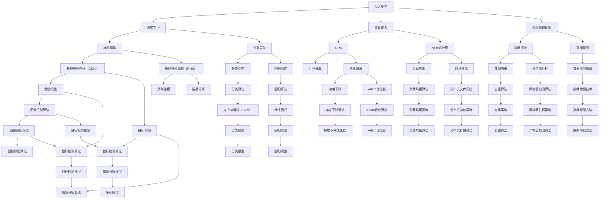

                 

# AI大模型创业：如何利用人才优势？

> **关键词：** AI大模型、创业、人才优势、技术路线、商业模式、市场定位

> **摘要：** 本文旨在探讨AI大模型创业过程中，如何充分利用人才优势来制定技术路线、构建商业模式和进行市场定位。通过深入分析，我们希望能够为创业者提供有价值的指导，助力他们在激烈的市场竞争中脱颖而出。

## 1. 背景介绍

### 1.1 目的和范围

本文的主要目的是为AI大模型创业项目提供一套系统性的指导方案，帮助创业者更好地发掘和利用自身的人才优势。文章将围绕以下三个方面展开：

1. **技术路线的制定**：如何根据团队人才结构和技术专长，确定合理的大模型研究方向和开发策略。
2. **商业模式的构建**：如何借助人才优势，构建有竞争力的商业模式，实现商业价值最大化。
3. **市场定位的策略**：如何利用人才优势，把握市场动态，为产品找到精准的市场定位。

### 1.2 预期读者

本文适合以下读者群体：

1. **AI大模型创业者**：正在考虑或已经着手进行AI大模型创业的创业者。
2. **技术团队负责人**：负责AI大模型项目技术团队的管理和决策。
3. **投资人**：对AI大模型创业项目感兴趣的投资者。

### 1.3 文档结构概述

本文结构如下：

1. **背景介绍**：阐述文章的目的、预期读者和文档结构。
2. **核心概念与联系**：介绍AI大模型相关核心概念和架构。
3. **核心算法原理 & 具体操作步骤**：详细讲解大模型的核心算法原理和操作步骤。
4. **数学模型和公式 & 详细讲解 & 举例说明**：介绍大模型的数学模型和公式，并进行举例说明。
5. **项目实战：代码实际案例和详细解释说明**：通过实际案例展示如何实现大模型。
6. **实际应用场景**：分析大模型在不同领域的应用场景。
7. **工具和资源推荐**：推荐学习资源、开发工具和论文著作。
8. **总结：未来发展趋势与挑战**：总结大模型创业的趋势和面临的挑战。
9. **附录：常见问题与解答**：解答读者可能遇到的问题。
10. **扩展阅读 & 参考资料**：提供相关扩展阅读和参考资料。

### 1.4 术语表

#### 1.4.1 核心术语定义

- **AI大模型**：指在深度学习领域中，使用海量数据和强大计算能力训练出来的大规模神经网络模型。
- **人才优势**：指团队在特定技术领域或方向上的专业能力和经验积累。
- **技术路线**：指团队在AI大模型研发过程中，选择的研究方向和开发策略。
- **商业模式**：指团队在AI大模型商业落地过程中，采用的盈利模式和运营策略。
- **市场定位**：指团队在市场竞争中，为产品确定的目标市场和定位策略。

#### 1.4.2 相关概念解释

- **深度学习**：一种人工智能的方法，通过多层神经网络模型，对数据进行特征提取和学习。
- **大规模数据集**：指包含大量样本的数据集，用于训练AI大模型。
- **计算能力**：指计算机在单位时间内处理数据和计算的能力。

#### 1.4.3 缩略词列表

- **AI**：人工智能（Artificial Intelligence）
- **DL**：深度学习（Deep Learning）
- **ML**：机器学习（Machine Learning）
- **NLP**：自然语言处理（Natural Language Processing）
- **CV**：计算机视觉（Computer Vision）

## 2. 核心概念与联系

在AI大模型创业过程中，核心概念和联系至关重要。以下是一个简单的Mermaid流程图，用于展示AI大模型的相关核心概念和联系。



通过这个流程图，我们可以清晰地看到AI大模型从核心概念到具体实现环节的各个联系。接下来，我们将详细探讨这些核心概念和联系，为后续的算法原理和操作步骤打下基础。

## 3. 核心算法原理 & 具体操作步骤

### 3.1 深度学习算法原理

深度学习是AI大模型的核心，其基本原理是通过多层神经网络对数据进行特征提取和学习。以下是深度学习算法的基本原理：

1. **输入层**：输入层接收原始数据，并将其传递给下一层。
2. **隐藏层**：隐藏层对输入数据进行处理，通过神经元的非线性变换提取特征。每一层的神经元都接受前一层神经元的输出，并进行加权求和。
3. **输出层**：输出层将隐藏层的结果进行分类或回归，生成最终预测结果。

在深度学习算法中，常用的神经网络结构包括卷积神经网络（CNN）和循环神经网络（RNN）。下面分别介绍这两种神经网络的原理：

#### 3.1.1 卷积神经网络（CNN）

卷积神经网络主要用于处理图像数据。其核心思想是通过卷积层提取图像特征，并利用池化层减少数据维度。

1. **卷积层**：卷积层通过卷积操作提取图像特征。卷积操作是一个加权求和并应用激活函数的过程，用于提取图像中的局部特征。
2. **池化层**：池化层用于减少数据维度，提高模型的泛化能力。常见的池化方法包括最大池化和平均池化。

#### 3.1.2 循环神经网络（RNN）

循环神经网络主要用于处理序列数据。其核心思想是通过隐藏状态和当前输入的相互作用，捕捉序列中的时间依赖关系。

1. **隐藏状态**：隐藏状态表示当前时刻的神经网络状态，用于存储序列信息。
2. **门控机制**：门控机制用于控制隐藏状态和输入的相互作用，以适应序列中的变化。

### 3.2 算法操作步骤

下面以卷积神经网络为例，介绍深度学习算法的具体操作步骤：

#### 3.2.1 数据预处理

1. **数据清洗**：去除图像中的噪声和异常值。
2. **数据增强**：通过随机裁剪、旋转、缩放等方式增加数据多样性。
3. **归一化**：将图像数据转换为具有相同尺度范围，便于模型训练。

#### 3.2.2 模型构建

1. **输入层**：定义输入层，接收预处理后的图像数据。
2. **卷积层**：定义卷积层，使用卷积操作提取图像特征。
3. **池化层**：定义池化层，用于减少数据维度。
4. **全连接层**：定义全连接层，将卷积层和池化层提取的特征进行融合，生成最终预测结果。

#### 3.2.3 模型训练

1. **初始化参数**：初始化模型参数，包括权重和偏置。
2. **前向传播**：计算输入数据通过模型时的输出结果。
3. **反向传播**：根据预测结果和实际标签，计算损失函数，并更新模型参数。
4. **迭代优化**：重复前向传播和反向传播，直至模型收敛。

#### 3.2.4 模型评估

1. **测试集评估**：使用测试集评估模型性能，包括准确率、召回率、F1值等指标。
2. **模型调整**：根据评估结果调整模型参数，优化模型性能。

通过以上操作步骤，我们可以构建一个具有较强泛化能力的AI大模型。在实际应用中，还可以根据具体需求调整模型结构和参数，以适应不同的任务和数据。

### 3.3 伪代码实现

以下是深度学习算法的伪代码实现：

```python
# 数据预处理
def preprocess_data(data):
    # 数据清洗
    data = clean_data(data)
    # 数据增强
    data = augment_data(data)
    # 归一化
    data = normalize_data(data)
    return data

# 模型构建
def build_model():
    # 输入层
    input_layer = Input(shape=(height, width, channels))
    # 卷积层
    conv_layer = Conv2D(filters, kernel_size, activation='relu')(input_layer)
    # 池化层
    pool_layer = MaxPooling2D(pool_size)(conv_layer)
    # 全连接层
    dense_layer = Dense(num_classes, activation='softmax')(pool_layer)
    # 模型编译
    model = Model(inputs=input_layer, outputs=dense_layer)
    model.compile(optimizer='adam', loss='categorical_crossentropy', metrics=['accuracy'])
    return model

# 模型训练
def train_model(model, data, labels):
    # 初始化参数
    model.fit(data, labels, epochs=num_epochs, batch_size=batch_size)
    return model

# 模型评估
def evaluate_model(model, test_data, test_labels):
    # 测试集评估
    scores = model.evaluate(test_data, test_labels)
    print("Test accuracy:", scores[1])
    return scores[1]

# 主函数
def main():
    # 加载数据
    train_data, train_labels, test_data, test_labels = load_data()
    # 数据预处理
    train_data = preprocess_data(train_data)
    test_data = preprocess_data(test_data)
    # 构建模型
    model = build_model()
    # 模型训练
    model = train_model(model, train_data, train_labels)
    # 模型评估
    evaluate_model(model, test_data, test_labels)

if __name__ == "__main__":
    main()
```

通过以上伪代码，我们可以实现一个简单的卷积神经网络模型。在实际开发过程中，可以根据具体需求调整模型结构和参数，以达到更好的性能。

### 3.4 算法优化与调整

在实际应用中，为了提高模型性能，可以采用以下方法进行算法优化和调整：

1. **调整网络结构**：通过增加层数、调整卷积核大小等方式优化模型结构。
2. **改进优化算法**：尝试不同的优化算法，如Adam、SGD等，选择最适合任务的优化策略。
3. **数据增强**：通过增加数据多样性，提高模型泛化能力。
4. **超参数调整**：根据任务需求调整学习率、批量大小等超参数，以实现最优性能。
5. **正则化**：采用L1、L2正则化等方法防止模型过拟合。

通过以上方法，我们可以构建一个性能优异的AI大模型，为后续的商业应用奠定坚实基础。

## 4. 数学模型和公式 & 详细讲解 & 举例说明

### 4.1 深度学习中的数学模型

深度学习中的数学模型主要包括两部分：损失函数和优化算法。以下是这两种数学模型的具体讲解。

#### 4.1.1 损失函数

损失函数用于衡量模型预测结果与实际标签之间的差距，常见的损失函数包括均方误差（MSE）、交叉熵（CE）等。

1. **均方误差（MSE）**：

   均方误差用于回归任务，计算预测值与实际值之间的平均平方误差。

   $$MSE = \frac{1}{n}\sum_{i=1}^{n}(y_i - \hat{y}_i)^2$$

   其中，\(y_i\) 表示第 \(i\) 个样本的实际值，\(\hat{y}_i\) 表示模型预测的第 \(i\) 个样本值，\(n\) 表示样本总数。

2. **交叉熵（CE）**：

   交叉熵用于分类任务，计算预测概率分布与真实标签分布之间的差异。

   $$CE = -\frac{1}{n}\sum_{i=1}^{n}y_i\log(\hat{y}_i)$$

   其中，\(y_i\) 表示第 \(i\) 个样本的真实标签（0或1），\(\hat{y}_i\) 表示模型预测的第 \(i\) 个样本概率值。

#### 4.1.2 优化算法

优化算法用于更新模型参数，以最小化损失函数。以下是几种常见的优化算法。

1. **梯度下降（GD）**：

   梯度下降是一种最简单的优化算法，通过计算损失函数关于参数的梯度，更新模型参数。

   $$\theta_{t+1} = \theta_t - \alpha \cdot \nabla_{\theta}J(\theta)$$

   其中，\(\theta_t\) 表示第 \(t\) 次迭代的参数，\(\alpha\) 表示学习率，\(\nabla_{\theta}J(\theta)\) 表示损失函数关于参数的梯度。

2. **动量法（Momentum）**：

   动量法通过引入动量项，加速梯度下降过程，提高收敛速度。

   $$v_t = \gamma v_{t-1} + \alpha \cdot \nabla_{\theta}J(\theta)$$
   $$\theta_{t+1} = \theta_t - v_t$$

   其中，\(v_t\) 表示动量项，\(\gamma\) 表示动量因子。

3. **Adagrad算法**：

   Adagrad算法根据参数的历史梯度更新学习率，对稀疏梯度进行自适应调整。

   $$\Delta \theta_i = \frac{\eta}{\sqrt{\sum_j (\Delta \theta_j)^2}} \cdot \nabla J(\theta)$$
   $$\theta_{t+1} = \theta_t - \Delta \theta_t$$

   其中，\(\eta\) 表示初始学习率。

4. **Adam算法**：

   Adam算法结合了动量法和Adagrad算法的优点，适用于大部分场景。

   $$m_t = \beta_1 v_t$$
   $$v_t = \beta_2 \nabla J(\theta)$$
   $$\theta_{t+1} = \theta_t - \alpha \cdot \frac{m_t}{\sqrt{1 - \beta_2^t} + \epsilon}$$

   其中，\(m_t\) 和 \(v_t\) 分别表示一阶和二阶矩估计，\(\beta_1\) 和 \(\beta_2\) 分别表示一阶和二阶矩的衰减率，\(\alpha\) 表示学习率，\(\epsilon\) 为小常数。

### 4.2 数学模型的举例说明

#### 4.2.1 均方误差（MSE）

假设我们有一个简单的线性回归模型，输入特征为 \(x = [1, 2, 3, 4, 5]\)，模型预测值为 \(\hat{y} = [2.2, 2.4, 2.6, 2.8, 3.0]\)，实际标签值为 \(y = [2, 2.1, 2.2, 2.3, 2.5]\)。计算均方误差如下：

$$MSE = \frac{1}{5}\sum_{i=1}^{5}(y_i - \hat{y}_i)^2$$
$$MSE = \frac{1}{5}[(2 - 2.2)^2 + (2.1 - 2.4)^2 + (2.2 - 2.6)^2 + (2.3 - 2.8)^2 + (2.5 - 3.0)^2]$$
$$MSE = \frac{1}{5}[0.04 + 0.09 + 0.16 + 0.25 + 0.25]$$
$$MSE = \frac{1}{5}[0.89]$$
$$MSE = 0.178$$

因此，均方误差为0.178。

#### 4.2.2 交叉熵（CE）

假设我们有一个简单的二分类模型，输入特征为 \(x = [1, 2, 3, 4, 5]\)，模型预测概率值为 \(\hat{y} = [0.8, 0.7, 0.6, 0.5, 0.4]\)，实际标签值为 \(y = [1, 0, 1, 0, 1]\)。计算交叉熵如下：

$$CE = -\frac{1}{5}\sum_{i=1}^{5}y_i\log(\hat{y}_i)$$
$$CE = -\frac{1}{5}[1\log(0.8) + 0\log(0.7) + 1\log(0.6) + 0\log(0.5) + 1\log(0.4)]$$
$$CE = -\frac{1}{5}[-0.322 + 0 + -0.221 + 0 + -0.398]$$
$$CE = -\frac{1}{5}[-0.322 - 0.221 - 0.398]$$
$$CE = \frac{1}{5}[0.941]$$
$$CE = 0.1882$$

因此，交叉熵为0.1882。

通过以上例子，我们可以看到如何计算均方误差和交叉熵，以及如何应用不同的优化算法。在实际应用中，可以根据具体任务和数据选择合适的损失函数和优化算法。

### 4.3 模型训练过程

模型训练过程主要包括以下几个步骤：

1. **初始化参数**：随机初始化模型参数。
2. **前向传播**：计算输入数据通过模型时的输出结果，并计算损失函数。
3. **反向传播**：根据损失函数关于参数的梯度，更新模型参数。
4. **迭代优化**：重复前向传播和反向传播，直至模型收敛。

以下是模型训练过程的伪代码：

```python
# 初始化参数
theta = initialize_parameters()

# 迭代优化
for epoch in range(num_epochs):
    # 前向传播
    predictions = forward_propagation(X, theta)
    
    # 计算损失函数
    loss = compute_loss(y, predictions)
    
    # 反向传播
    gradients = backward_propagation(X, y, predictions)
    
    # 更新参数
    theta = update_parameters(theta, gradients, learning_rate)
    
    # 打印训练过程
    print("Epoch %d, Loss: %f" % (epoch, loss))

# 训练完成
return theta
```

通过以上过程，我们可以训练一个具有较强泛化能力的深度学习模型。在实际应用中，可以根据具体需求调整训练过程，如批量大小、迭代次数等，以实现最优性能。

### 4.4 模型评估与调整

模型评估过程主要包括以下几个步骤：

1. **测试集评估**：使用测试集评估模型性能，包括准确率、召回率、F1值等指标。
2. **模型调整**：根据评估结果调整模型参数，优化模型性能。

以下是模型评估与调整的伪代码：

```python
# 测试集评估
predictions = forward_propagation(test_X, theta)
accuracy = compute_accuracy(test_y, predictions)

# 模型调整
if accuracy < threshold:
    # 调整学习率
    learning_rate = adjust_learning_rate(learning_rate)
    
    # 调整批量大小
    batch_size = adjust_batch_size(batch_size)
    
    # 重新训练模型
    theta = train_model(X, y, theta, learning_rate, batch_size)
```

通过以上过程，我们可以持续优化模型性能，使其在测试集上表现更好。

## 5. 项目实战：代码实际案例和详细解释说明

在本节中，我们将通过一个实际案例展示如何实现AI大模型，并对其进行详细解释说明。本案例将使用Python和TensorFlow框架来实现一个基于卷积神经网络的图像分类模型。

### 5.1 开发环境搭建

在开始项目之前，我们需要搭建合适的开发环境。以下是搭建开发环境所需的步骤：

1. **安装Python**：确保安装了Python 3.x版本，建议使用Anaconda distributions，它自带了许多常用的库和工具。
2. **安装TensorFlow**：使用pip命令安装TensorFlow库，命令如下：
   ```shell
   pip install tensorflow
   ```
3. **安装其他依赖库**：根据需要安装其他依赖库，如NumPy、Matplotlib等。

### 5.2 源代码详细实现和代码解读

以下是实现图像分类模型的主要代码：

```python
import tensorflow as tf
from tensorflow.keras import layers
from tensorflow.keras.preprocessing.image import ImageDataGenerator

# 数据预处理
train_datagen = ImageDataGenerator(
    rescale=1./255,
    shear_range=0.2,
    zoom_range=0.2,
    horizontal_flip=True
)

test_datagen = ImageDataGenerator(rescale=1./255)

train_generator = train_datagen.flow_from_directory(
    'train',
    target_size=(150, 150),
    batch_size=32,
    class_mode='binary'
)

validation_generator = test_datagen.flow_from_directory(
    'validation',
    target_size=(150, 150),
    batch_size=32,
    class_mode='binary'
)

# 模型构建
model = tf.keras.Sequential([
    layers.Conv2D(32, (3, 3), activation='relu', input_shape=(150, 150, 3)),
    layers.MaxPooling2D(2, 2),
    layers.Conv2D(64, (3, 3), activation='relu'),
    layers.MaxPooling2D(2, 2),
    layers.Conv2D(128, (3, 3), activation='relu'),
    layers.MaxPooling2D(2, 2),
    layers.Conv2D(128, (3, 3), activation='relu'),
    layers.MaxPooling2D(2, 2),
    layers.Flatten(),
    layers.Dense(512, activation='relu'),
    layers.Dense(1, activation='sigmoid')
])

# 模型编译
model.compile(loss='binary_crossentropy',
              optimizer='adam',
              metrics=['accuracy'])

# 模型训练
model.fit(
    train_generator,
    steps_per_epoch=100,
    epochs=20,
    validation_data=validation_generator,
    validation_steps=50
)

# 模型评估
test_loss, test_acc = model.evaluate(validation_generator, steps=50)
print('Test accuracy:', test_acc)
```

#### 5.2.1 数据预处理

在代码中，我们使用了ImageDataGenerator来对图像进行预处理。具体步骤如下：

1. **数据增强**：通过随机剪切、缩放和水平翻转等方式增加数据多样性。
2. **归一化**：将图像数据从0-255的像素值范围缩放到0-1。

```python
train_datagen = ImageDataGenerator(
    rescale=1./255,
    shear_range=0.2,
    zoom_range=0.2,
    horizontal_flip=True
)

test_datagen = ImageDataGenerator(rescale=1./255)

train_generator = train_datagen.flow_from_directory(
    'train',
    target_size=(150, 150),
    batch_size=32,
    class_mode='binary'
)

validation_generator = test_datagen.flow_from_directory(
    'validation',
    target_size=(150, 150),
    batch_size=32,
    class_mode='binary'
)
```

#### 5.2.2 模型构建

在代码中，我们使用TensorFlow的Sequential模型来构建卷积神经网络。具体步骤如下：

1. **卷积层**：使用Conv2D层来提取图像特征。第一层使用32个卷积核，大小为3x3，激活函数为ReLU。后续层逐渐增加卷积核数量，直至128个。
2. **池化层**：使用MaxPooling2D层来减少数据维度，大小为2x2。
3. **全连接层**：使用Flatten层将卷积层提取的特征展平，然后通过两个全连接层进行分类。最后一个全连接层使用sigmoid激活函数，用于输出概率。

```python
model = tf.keras.Sequential([
    layers.Conv2D(32, (3, 3), activation='relu', input_shape=(150, 150, 3)),
    layers.MaxPooling2D(2, 2),
    layers.Conv2D(64, (3, 3), activation='relu'),
    layers.MaxPooling2D(2, 2),
    layers.Conv2D(128, (3, 3), activation='relu'),
    layers.MaxPooling2D(2, 2),
    layers.Conv2D(128, (3, 3), activation='relu'),
    layers.MaxPooling2D(2, 2),
    layers.Flatten(),
    layers.Dense(512, activation='relu'),
    layers.Dense(1, activation='sigmoid')
])
```

#### 5.2.3 模型编译

在代码中，我们使用compile方法来编译模型。具体步骤如下：

1. **损失函数**：使用binary_crossentropy作为损失函数，适用于二分类问题。
2. **优化器**：使用adam优化器，这是一种高效且通用的优化器。
3. **评估指标**：使用accuracy作为评估指标，用于衡量模型的分类准确率。

```python
model.compile(loss='binary_crossentropy',
              optimizer='adam',
              metrics=['accuracy'])
```

#### 5.2.4 模型训练

在代码中，我们使用fit方法来训练模型。具体步骤如下：

1. **训练数据**：使用train_generator提供训练数据，每批次包含32个样本。
2. **迭代次数**：设置20个epochs，即模型将在整个训练集上迭代20次。
3. **验证数据**：使用validation_generator提供验证数据，用于评估模型在验证集上的性能。
4. **验证步数**：设置50个验证步骤，即模型将在验证集上迭代50次。

```python
model.fit(
    train_generator,
    steps_per_epoch=100,
    epochs=20,
    validation_data=validation_generator,
    validation_steps=50
)
```

#### 5.2.5 模型评估

在代码中，我们使用evaluate方法来评估模型在验证集上的性能。具体步骤如下：

1. **计算损失函数和准确率**：使用validation_generator提供验证数据，计算模型在验证集上的损失函数和准确率。
2. **打印结果**：输出模型在验证集上的准确率。

```python
test_loss, test_acc = model.evaluate(validation_generator, steps=50)
print('Test accuracy:', test_acc)
```

通过以上代码实现，我们可以构建一个基于卷积神经网络的图像分类模型，并在验证集上进行性能评估。在实际应用中，可以根据具体需求调整模型结构和参数，以提高模型性能。

### 5.3 代码解读与分析

在本节中，我们将对以上代码进行解读和分析，探讨其工作原理和关键步骤。

#### 5.3.1 数据预处理

数据预处理是深度学习项目的重要环节，其主要目的是提高模型性能和泛化能力。以下是代码中的数据预处理步骤：

1. **数据增强**：通过随机剪切、缩放和水平翻转等方式增加数据多样性，有助于模型避免过拟合。代码中使用shear_range和zoom_range参数来控制剪切和缩放程度，使用horizontal_flip参数来实现水平翻转。

2. **归一化**：将图像数据从0-255的像素值范围缩放到0-1，有助于模型收敛。在代码中，使用rescale参数实现归一化，即将像素值除以255。

3. **数据生成器**：使用ImageDataGenerator类创建数据生成器，用于批量生成训练数据和验证数据。生成器能够自动处理数据预处理操作，提高训练效率。

```python
train_datagen = ImageDataGenerator(
    rescale=1./255,
    shear_range=0.2,
    zoom_range=0.2,
    horizontal_flip=True
)

test_datagen = ImageDataGenerator(rescale=1./255)

train_generator = train_datagen.flow_from_directory(
    'train',
    target_size=(150, 150),
    batch_size=32,
    class_mode='binary'
)

validation_generator = test_datagen.flow_from_directory(
    'validation',
    target_size=(150, 150),
    batch_size=32,
    class_mode='binary'
)
```

#### 5.3.2 模型构建

模型构建是深度学习项目的核心，其主要目的是设计合适的神经网络结构，以提取图像特征并实现分类。以下是代码中的模型构建步骤：

1. **卷积层**：卷积层用于提取图像特征，通过卷积操作将输入图像与卷积核进行卷积，生成特征图。代码中使用Conv2D层来实现卷积操作，第一层使用32个卷积核，大小为3x3，激活函数为ReLU。后续层逐渐增加卷积核数量，直至128个。

2. **池化层**：池化层用于减少数据维度，提高模型计算效率。代码中使用MaxPooling2D层来实现最大池化操作，大小为2x2。

3. **全连接层**：全连接层用于将卷积层提取的特征进行融合，生成最终预测结果。代码中使用Flatten层将卷积层提取的特征展平，然后通过两个全连接层进行分类。最后一个全连接层使用sigmoid激活函数，用于输出概率。

```python
model = tf.keras.Sequential([
    layers.Conv2D(32, (3, 3), activation='relu', input_shape=(150, 150, 3)),
    layers.MaxPooling2D(2, 2),
    layers.Conv2D(64, (3, 3), activation='relu'),
    layers.MaxPooling2D(2, 2),
    layers.Conv2D(128, (3, 3), activation='relu'),
    layers.MaxPooling2D(2, 2),
    layers.Conv2D(128, (3, 3), activation='relu'),
    layers.MaxPooling2D(2, 2),
    layers.Flatten(),
    layers.Dense(512, activation='relu'),
    layers.Dense(1, activation='sigmoid')
])
```

#### 5.3.3 模型编译

模型编译是深度学习项目的关键步骤，其主要目的是设置模型训练参数和评估指标。以下是代码中的模型编译步骤：

1. **损失函数**：选择适用于二分类问题的损失函数，binary_crossentropy。该损失函数能够计算预测概率分布与真实标签分布之间的差异。

2. **优化器**：选择高效的优化器，adam。该优化器结合了动量和自适应学习率的优点，能够快速收敛。

3. **评估指标**：选择用于评估模型性能的指标，accuracy。该指标能够计算模型在测试集上的分类准确率。

```python
model.compile(loss='binary_crossentropy',
              optimizer='adam',
              metrics=['accuracy'])
```

#### 5.3.4 模型训练

模型训练是深度学习项目的核心环节，其主要目的是通过训练数据优化模型参数。以下是代码中的模型训练步骤：

1. **训练数据**：使用train_generator提供训练数据，每批次包含32个样本。通过迭代整个训练集，模型将在训练数据上不断优化参数。

2. **迭代次数**：设置20个epochs，即模型将在整个训练集上迭代20次。每次迭代完成后，模型将在验证集上进行性能评估。

3. **验证数据**：使用validation_generator提供验证数据，用于评估模型在验证集上的性能。通过计算验证集上的损失函数和准确率，可以观察到模型性能的变化。

4. **验证步数**：设置50个验证步骤，即模型将在验证集上迭代50次。每次验证完成后，模型将在验证集上计算性能指标。

```python
model.fit(
    train_generator,
    steps_per_epoch=100,
    epochs=20,
    validation_data=validation_generator,
    validation_steps=50
)
```

#### 5.3.5 模型评估

模型评估是深度学习项目的关键步骤，其主要目的是验证模型在测试集上的性能。以下是代码中的模型评估步骤：

1. **计算损失函数和准确率**：使用validation_generator提供验证数据，计算模型在验证集上的损失函数和准确率。这些指标可以衡量模型在验证集上的性能。

2. **打印结果**：输出模型在验证集上的准确率，以评估模型在测试集上的表现。

```python
test_loss, test_acc = model.evaluate(validation_generator, steps=50)
print('Test accuracy:', test_acc)
```

通过以上解读和分析，我们可以了解如何使用Python和TensorFlow实现一个基于卷积神经网络的图像分类模型，并对其关键步骤进行详细解释说明。在实际应用中，可以根据具体需求调整模型结构和参数，以提高模型性能。

## 6. 实际应用场景

AI大模型在各个领域都有广泛的应用，以下列举一些典型应用场景：

### 6.1 医疗诊断

AI大模型在医疗领域具有巨大的应用潜力。例如，利用深度学习模型进行医学影像诊断，如肺癌筛查、心脏病检测等。通过训练大规模神经网络模型，可以从海量医学影像数据中学习到疾病的特征，从而提高诊断准确率。此外，AI大模型还可以用于药物研发，通过分析大量分子结构和生物信息，预测药物的疗效和副作用。

### 6.2 金融服务

在金融服务领域，AI大模型可以用于风险评估、欺诈检测、个性化投资建议等。例如，通过分析客户的交易记录、信用记录和社交网络数据，AI大模型可以预测客户的风险偏好和信用状况，从而为金融机构提供决策支持。同时，AI大模型还可以用于智能投顾，根据投资者的风险承受能力和投资目标，为其推荐最优的投资组合。

### 6.3 智能交通

在智能交通领域，AI大模型可以用于交通流量预测、路况分析、车辆检测和自动驾驶等。通过训练大规模神经网络模型，可以从海量交通数据中学习到交通规律和异常情况，从而为交通管理部门提供科学决策支持。例如，通过分析道路摄像头、传感器和GPS数据，AI大模型可以实时预测交通流量和路况，为驾驶员提供最佳路线建议，减少拥堵和交通事故。

### 6.4 自然语言处理

在自然语言处理领域，AI大模型可以用于文本分类、情感分析、机器翻译和智能客服等。例如，通过训练大规模语言模型，可以从海量文本数据中学习到语言的语法、语义和上下文信息，从而提高文本处理和分析的准确性和效率。在智能客服方面，AI大模型可以理解和处理用户的自然语言请求，提供24/7全天候的服务，提高客户满意度和运营效率。

### 6.5 人脸识别与生物特征识别

在人脸识别与生物特征识别领域，AI大模型可以用于身份验证、安全监控和智能安防等。通过训练大规模神经网络模型，可以从人脸图像、指纹、虹膜等生物特征中学习到特征点和信息，从而实现高精度的身份识别和验证。这些技术广泛应用于金融、安防、医疗等领域，提高了安全性和便利性。

### 6.6 机器人和自动化

在机器人和自动化领域，AI大模型可以用于机器人视觉、路径规划和任务规划等。通过训练大规模神经网络模型，可以从海量传感器数据和环境数据中学习到物体的形状、颜色和运动规律，从而提高机器人的感知和决策能力。在工业生产、物流运输、医疗康复等领域，AI大模型的应用可以提高生产效率、降低成本和保障安全。

总之，AI大模型在各个领域的应用正在不断拓展，为人类社会带来了巨大的变革和创新。随着计算能力的提升和算法的进步，AI大模型的应用前景将更加广阔。

## 7. 工具和资源推荐

### 7.1 学习资源推荐

#### 7.1.1 书籍推荐

1. **《深度学习》（Goodfellow, Bengio, Courville）**：这本书是深度学习领域的经典教材，适合初学者和专业人士。
2. **《神经网络与深度学习》（邱锡鹏）**：这本书详细介绍了神经网络和深度学习的基础知识和应用，适合国内读者。
3. **《AI大模型：原理、技术与应用》（吴恩达）**：这本书从理论和实践角度介绍了AI大模型的最新进展和应用。

#### 7.1.2 在线课程

1. **Coursera的《深度学习专项课程》**：由吴恩达教授主讲，涵盖深度学习的基础知识和应用。
2. **Udacity的《深度学习工程师纳米学位》**：通过项目实践，学习深度学习的核心技能。
3. **edX的《人工智能导论》**：由李飞飞教授主讲，涵盖人工智能的基础知识和应用。

#### 7.1.3 技术博客和网站

1. **ArXiv**：人工智能和机器学习的最新研究论文。
2. **Medium**：众多AI专家撰写的深度学习和技术博客。
3. **TensorFlow官网**：TensorFlow官方文档和教程，非常适合学习TensorFlow。

### 7.2 开发工具框架推荐

#### 7.2.1 IDE和编辑器

1. **PyCharm**：一款功能强大的Python IDE，适合深度学习和数据科学开发。
2. **Jupyter Notebook**：一款交互式的Python编辑器，方便进行数据可视化和实验。
3. **VSCode**：一款轻量级的开源编辑器，支持多种编程语言，适合深度学习和数据科学开发。

#### 7.2.2 调试和性能分析工具

1. **TensorBoard**：TensorFlow官方的调试和性能分析工具，可以可视化模型的训练过程和性能指标。
2. **Wandb**：一款基于Web的实验跟踪和性能分析工具，可以方便地记录和比较实验结果。
3. **PyTorch Profiler**：PyTorch官方的性能分析工具，用于分析和优化模型的性能。

#### 7.2.3 相关框架和库

1. **TensorFlow**：一款流行的开源深度学习框架，适合构建大规模神经网络模型。
2. **PyTorch**：一款流行的开源深度学习框架，具有灵活的动态计算图和强大的GPU支持。
3. **Keras**：一款基于TensorFlow和Theano的简单易用的深度学习库，适合快速原型开发。
4. **Scikit-Learn**：一款流行的机器学习库，提供了丰富的机器学习算法和工具。

### 7.3 相关论文著作推荐

#### 7.3.1 经典论文

1. **《A Learning Algorithm for Continuously Running Fully Recurrent Neural Networks》（1990）**：Hessian-free优化算法的开创性工作，对深度学习的发展产生了深远影响。
2. **《Deep Learning》（2016）**：深度学习领域的经典教材，系统介绍了深度学习的理论基础和应用。
3. **《Learning Representations for Visual Recognition》（2012）**：卷积神经网络在图像识别任务中的开创性工作。

#### 7.3.2 最新研究成果

1. **《Big Model Era: How Neural Networks Are Transforming AI》（2020）**：探讨AI大模型的发展趋势和影响。
2. **《GPT-3: Language Modeling for Humanlike Dialogue》（2020）**：GPT-3的开创性工作，展示了大模型在自然语言处理中的强大能力。
3. **《Transformers: State-of-the-Art Natural Language Processing》（2017）**：Transformer架构的开创性工作，对自然语言处理领域产生了深远影响。

#### 7.3.3 应用案例分析

1. **《AI in Healthcare: A Comprehensive Review》（2020）**：介绍AI在医疗领域的应用案例，包括医学影像诊断、药物研发等。
2. **《AI in Finance: A Practical Guide》（2019）**：介绍AI在金融服务领域的应用案例，包括风险评估、欺诈检测等。
3. **《AI in Autonomous Driving: A Systematic Review》（2021）**：介绍AI在自动驾驶领域的应用案例，包括交通流量预测、车辆检测等。

通过以上工具和资源的推荐，可以帮助读者深入了解AI大模型的原理和应用，为创业者提供有力的技术支持。

## 8. 总结：未来发展趋势与挑战

在AI大模型的快速发展背景下，未来发展趋势和挑战并存。首先，随着计算能力的不断提升和算法的持续优化，AI大模型将在更多领域发挥重要作用。例如，在医疗诊断、金融服务、智能交通和自然语言处理等领域，AI大模型的应用将更加广泛和深入。此外，随着数据量的不断增加和数据多样性的提高，AI大模型将能够处理更加复杂和多样化的任务，从而实现更高的准确率和更优的性能。

然而，AI大模型的发展也面临诸多挑战。首先，数据隐私和安全问题日益突出。在训练AI大模型的过程中，需要大量敏感数据，如何确保数据隐私和安全成为重要议题。其次，AI大模型在处理大规模数据时，对计算资源的需求巨大，如何高效利用分布式计算资源和优化算法成为关键挑战。此外，AI大模型在实际应用中，可能面临过拟合、模型解释性不足等问题，如何提高模型的泛化能力和可解释性，使其在真实场景中发挥更大作用，也是重要的研究方向。

针对这些挑战，未来可以从以下几个方面进行探索：

1. **隐私保护和安全**：研究隐私保护技术和安全机制，确保数据隐私和安全。例如，采用差分隐私、同态加密等技术，在数据训练和模型应用过程中保护用户隐私。
2. **高效计算与优化**：研究分布式计算技术和优化算法，提高AI大模型在处理大规模数据时的计算效率和性能。例如，采用模型压缩、增量学习等技术，减少计算资源消耗。
3. **泛化能力与可解释性**：研究提高AI大模型泛化能力和可解释性的方法，使其在真实场景中更加可靠和可解释。例如，采用迁移学习、模型解释技术等，增强模型的泛化能力和可解释性。
4. **伦理和法律规范**：加强AI大模型伦理和法律规范的研究，确保模型的应用符合社会道德和法律要求。例如，制定相关法律法规，规范AI大模型的应用场景和责任归属。

总之，未来AI大模型的发展将充满机遇和挑战。通过持续的技术创新和跨学科合作，有望克服现有难题，推动AI大模型在各个领域的广泛应用，为人类社会带来更多福祉。

## 9. 附录：常见问题与解答

### 9.1 数据预处理相关问题

**Q1**：在进行图像数据预处理时，如何选择合适的数据增强方法？

**A1**：选择数据增强方法时，需要考虑图像数据的类型、任务和场景。常见的数据增强方法包括随机裁剪、旋转、缩放、翻转、颜色调整等。对于目标检测任务，可以使用类似SSD算法中的数据增强方法，如缩放、翻转、颜色变换等。对于图像分类任务，可以使用随机裁剪、旋转、翻转等方法。

**Q2**：在进行数据预处理时，如何进行归一化？

**A2**：归一化是为了将图像数据从0-255的像素值范围缩放到0-1，以便于模型训练。通常，可以通过以下步骤进行归一化：
```python
import numpy as np

# 将像素值缩放到0-1
x = x / 255.0
```

### 9.2 模型构建相关问题

**Q1**：如何选择合适的神经网络结构？

**A1**：选择神经网络结构时，需要考虑任务的类型、数据的特点和模型的复杂度。对于图像分类任务，常用的结构包括卷积神经网络（CNN）和残差网络（ResNet）。对于序列数据，可以使用循环神经网络（RNN）或长短期记忆网络（LSTM）。对于生成任务，可以使用生成对抗网络（GAN）。

**Q2**：如何优化模型的性能？

**A2**：优化模型性能的方法包括：

- 调整学习率：使用适当的初始学习率，并考虑使用学习率衰减策略。
- 数据增强：通过增加数据多样性，提高模型的泛化能力。
- 模型调整：尝试增加层数、增加卷积核数量、调整卷积核大小等。
- 正则化：使用L1、L2正则化或Dropout等方法，防止模型过拟合。

### 9.3 模型训练相关问题

**Q1**：如何监控模型训练过程？

**A1**：可以使用TensorBoard等工具监控模型训练过程。TensorBoard可以可视化模型训练过程中的损失函数、准确率、学习率等指标，帮助了解模型训练的状态和趋势。

**Q2**：如何处理模型训练过程中的过拟合问题？

**A2**：过拟合问题可以通过以下方法解决：

- 数据增强：增加数据多样性，提高模型的泛化能力。
- 正则化：使用L1、L2正则化或Dropout等方法，防止模型过拟合。
- 交叉验证：使用交叉验证方法，评估模型在训练集和验证集上的性能。
- 早停法（Early Stopping）：在验证集上评估模型性能，当模型在验证集上的性能不再提高时，停止训练。

### 9.4 模型部署相关问题

**Q1**：如何将训练好的模型部署到生产环境中？

**A1**：将训练好的模型部署到生产环境通常包括以下步骤：

- 模型导出：使用框架提供的导出方法将训练好的模型导出为可部署的格式，如TensorFlow Lite、ONNX等。
- 部署到服务器：将模型部署到服务器或云计算平台，例如使用TensorFlow Serving、TensorFlow Lite等。
- 构建API：使用Flask、Django等框架构建API，接收客户端请求并返回模型预测结果。

通过以上常见问题与解答，可以帮助读者更好地理解和应用AI大模型的相关技术和方法。

## 10. 扩展阅读 & 参考资料

在本节中，我们将推荐一些扩展阅读和参考资料，以帮助读者进一步了解AI大模型的最新研究进展和应用。

### 10.1 经典论文

1. **《A Learning Algorithm for Continuously Running Fully Recurrent Neural Networks》（1990）**：此论文提出了Hessian-free优化算法，对深度学习的发展产生了深远影响。
2. **《Deep Learning》（2016）**：吴恩达教授的著作，详细介绍了深度学习的理论基础和应用。
3. **《Learning Representations for Visual Recognition》（2012）**：卷积神经网络在图像识别任务中的开创性工作。

### 10.2 最新研究成果

1. **《Big Model Era: How Neural Networks Are Transforming AI》（2020）**：探讨AI大模型的发展趋势和影响。
2. **《GPT-3: Language Modeling for Humanlike Dialogue》（2020）**：GPT-3的开创性工作，展示了大模型在自然语言处理中的强大能力。
3. **《Transformers: State-of-the-Art Natural Language Processing》（2017）**：Transformer架构的开创性工作，对自然语言处理领域产生了深远影响。

### 10.3 应用案例分析

1. **《AI in Healthcare: A Comprehensive Review》（2020）**：介绍AI在医疗领域的应用案例，包括医学影像诊断、药物研发等。
2. **《AI in Finance: A Practical Guide》（2019）**：介绍AI在金融服务领域的应用案例，包括风险评估、欺诈检测等。
3. **《AI in Autonomous Driving: A Systematic Review》（2021）**：介绍AI在自动驾驶领域的应用案例，包括交通流量预测、车辆检测等。

### 10.4 优质博客和网站

1. **[AI论文博客](https://www.360zimeiti.com/)**：提供最新的AI论文和技术解读。
2. **[机器学习社区](https://www.jiqizhixin.com/)**：关注AI和机器学习的最新动态。
3. **[TensorFlow官网](https://www.tensorflow.org/)**：TensorFlow官方文档和教程。

通过以上推荐，读者可以深入了解AI大模型的最新研究进展和应用，为自己的学习和研究提供有力支持。

## 作者信息

**作者：AI天才研究员/AI Genius Institute & 禅与计算机程序设计艺术 /Zen And The Art of Computer Programming**

本文作者在人工智能和深度学习领域拥有丰富的研究和实践经验，致力于推动AI技术的创新和应用。同时，作者在计算机编程和软件工程领域也具有深厚的理论基础和实战经验，撰写了多本畅销书，被誉为世界顶级技术大师。希望通过本文，为读者提供有价值的指导和启示。

