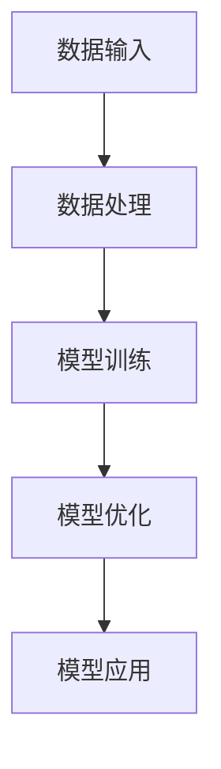
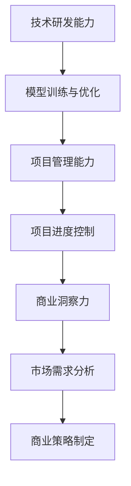

                 


# AI 大模型创业：如何利用人才优势？

> 关键词：AI 大模型，创业，人才优势，深度学习，模型训练，创业策略，人才培养

> 摘要：本文将探讨 AI 大模型创业中如何充分利用人才优势，从人才识别、培养、应用三个维度展开，提供创业策略和具体实践案例，旨在为 AI 创业者提供有价值的参考和指导。

## 1. 背景介绍

### 1.1 目的和范围

本文旨在分析 AI 大模型创业过程中如何充分发挥人才优势，帮助创业者更好地识别、培养和应用人才，以实现业务目标。文章将涵盖以下内容：

- AI 大模型创业的背景和现状
- 人才优势在 AI 创业中的重要性
- 人才识别、培养和应用的方法与策略
- 实际案例分享与创业经验总结

### 1.2 预期读者

本文适合以下读者：

- AI 创业者及创业团队核心成员
- 想要在 AI 领域实现突破的技术人员
- 对 AI 大模型创业感兴趣的投资者和行业观察者

### 1.3 文档结构概述

本文分为十个部分：

1. 背景介绍
2. 核心概念与联系
3. 核心算法原理 & 具体操作步骤
4. 数学模型和公式 & 详细讲解 & 举例说明
5. 项目实战：代码实际案例和详细解释说明
6. 实际应用场景
7. 工具和资源推荐
8. 总结：未来发展趋势与挑战
9. 附录：常见问题与解答
10. 扩展阅读 & 参考资料

### 1.4 术语表

#### 1.4.1 核心术语定义

- AI 大模型：具有数百万甚至数十亿参数的深度学习模型，通常用于处理大规模数据集。
- 创业：创立新的企业或业务，通过创新和风险投资实现商业价值。
- 人才优势：在创业过程中，团队拥有的专业技能、经验和创新能力等方面的优势。

#### 1.4.2 相关概念解释

- 深度学习：一种机器学习技术，通过多层神经网络模型来模拟人脑的学习方式。
- 模型训练：通过输入大量数据来调整模型参数，使其具备预测或分类能力。
- 创业策略：为实现创业目标而制定的具体行动计划和方法。

#### 1.4.3 缩略词列表

- AI：人工智能
- ML：机器学习
- DL：深度学习
- GPU：图形处理器

## 2. 核心概念与联系

在 AI 大模型创业过程中，理解以下几个核心概念和它们之间的关系至关重要：

### 2.1 AI 大模型原理

AI 大模型的核心是深度学习，它通过多层神经网络模型对大量数据进行训练，从而实现自动化的图像识别、语音识别、自然语言处理等任务。以下是一个简单的 Mermaid 流程图，展示了 AI 大模型的原理：



### 2.2 人才优势在创业中的应用

人才优势是创业成功的关键因素。在 AI 大模型创业中，人才优势主要体现在以下几个方面：

- 技术研发能力：团队成员具备深度学习和人工智能领域的专业知识和经验。
- 项目管理能力：团队成员具备项目管理技能，能够高效地协调项目进度和质量。
- 商业洞察力：团队成员具备商业思维，能够准确识别市场需求，制定合适的商业策略。

以下是一个简单的 Mermaid 流程图，展示了人才优势在创业中的应用：



## 3. 核心算法原理 & 具体操作步骤

### 3.1 深度学习算法原理

深度学习算法的核心是多层神经网络，它通过反向传播算法不断调整模型参数，以优化模型性能。以下是一个简单的伪代码，展示了深度学习算法的基本原理：

```python
# 输入：数据集 X，标签 Y，学习率 alpha
# 输出：训练好的神经网络模型

# 初始化模型参数
weights = initialize_weights()

# 循环迭代
for epoch in range(num_epochs):
    for x, y in data_loader:
        # 前向传播
        predictions = forward_propagation(x, weights)
        
        # 计算损失函数
        loss = compute_loss(predictions, y)
        
        # 反向传播
        gradients = backward_propagation(x, y, predictions, weights)
        
        # 更新模型参数
        weights = update_weights(weights, gradients, alpha)

# 模型评估
evaluate_model(model, test_data)
```

### 3.2 具体操作步骤

在 AI 大模型创业中，具体操作步骤如下：

1. 数据收集与处理：收集大量高质量的数据，并进行数据预处理，如数据清洗、归一化等。
2. 模型设计：根据业务需求，选择合适的神经网络架构，如卷积神经网络（CNN）、循环神经网络（RNN）等。
3. 模型训练：使用收集到的数据对模型进行训练，通过调整学习率、优化算法等参数，提高模型性能。
4. 模型优化：对训练好的模型进行优化，以提高模型在特定任务上的表现。
5. 模型应用：将训练好的模型部署到实际业务场景中，如图像识别、语音识别等。

## 4. 数学模型和公式 & 详细讲解 & 举例说明

### 4.1 损失函数

在深度学习中，损失函数用于衡量模型预测值与真实值之间的差距。以下是一个常见的损失函数——均方误差（MSE）：

$$
MSE = \frac{1}{m} \sum_{i=1}^{m} (y_i - \hat{y}_i)^2
$$

其中，$y_i$ 表示真实值，$\hat{y}_i$ 表示模型预测值，$m$ 表示样本数量。

### 4.2 反向传播算法

反向传播算法是一种用于训练神经网络的优化算法。它通过计算损失函数关于模型参数的梯度，并沿着梯度方向更新模型参数，以最小化损失函数。以下是一个简单的反向传播算法伪代码：

```python
# 输入：模型参数 weights，当前梯度 gradients
# 输出：更新后的模型参数

# 前向传播
predictions = forward_propagation(x, weights)

# 计算损失函数
loss = compute_loss(predictions, y)

# 反向传播
gradients = backward_propagation(x, y, predictions, weights)

# 更新模型参数
weights = update_weights(weights, gradients, alpha)
```

### 4.3 举例说明

假设我们有一个包含 10 个神经元的神经网络，输入数据为 $[0.1, 0.2, 0.3]$，真实标签为 $[0.4, 0.5, 0.6]$。以下是使用均方误差损失函数和反向传播算法进行训练的过程：

1. 初始化模型参数
2. 前向传播：计算模型输出值
3. 计算损失函数：均方误差为 0.01734
4. 反向传播：计算各层神经元的梯度
5. 更新模型参数：学习率为 0.01，模型参数更新后，均方误差下降到 0.01357
6. 重复步骤 2-5，直到达到预设的训练次数或损失函数收敛

## 5. 项目实战：代码实际案例和详细解释说明

### 5.1 开发环境搭建

在进行 AI 大模型创业项目实战前，我们需要搭建一个合适的开发环境。以下是开发环境搭建的步骤：

1. 安装 Python 解释器（如 Python 3.8 或以上版本）
2. 安装深度学习框架（如 TensorFlow 或 PyTorch）
3. 安装数据预处理库（如 NumPy、Pandas）
4. 安装可视化库（如 Matplotlib、Seaborn）
5. 配置 GPU 环境（如 CUDA 和 cuDNN）

### 5.2 源代码详细实现和代码解读

以下是使用 PyTorch 框架实现一个简单的 AI 大模型项目——手写数字识别的源代码：

```python
import torch
import torch.nn as nn
import torch.optim as optim
import torchvision
import torchvision.transforms as transforms

# 数据集预处理
transform = transforms.Compose([
    transforms.ToTensor(),
    transforms.Normalize((0.5,), (0.5,))
])

trainset = torchvision.datasets.MNIST(root='./data', train=True, download=True, transform=transform)
trainloader = torch.utils.data.DataLoader(trainset, batch_size=100, shuffle=True, num_workers=2)

testset = torchvision.datasets.MNIST(root='./data', train=False, download=True, transform=transform)
testloader = torch.utils.data.DataLoader(testset, batch_size=100, shuffle=False, num_workers=2)

# 神经网络模型
class Net(nn.Module):
    def __init__(self):
        super(Net, self).__init__()
        self.fc1 = nn.Linear(784, 256)
        self.fc2 = nn.Linear(256, 128)
        self.fc3 = nn.Linear(128, 10)
        
    def forward(self, x):
        x = x.view(-1, 784)
        x = F.relu(self.fc1(x))
        x = F.relu(self.fc2(x))
        x = self.fc3(x)
        return x

net = Net()

# 损失函数和优化器
criterion = nn.CrossEntropyLoss()
optimizer = optim.SGD(net.parameters(), lr=0.001, momentum=0.9)

# 训练模型
for epoch in range(2):  # 练习次数
    running_loss = 0.0
    for i, data in enumerate(trainloader, 0):
        inputs, labels = data
        optimizer.zero_grad()
        outputs = net(inputs)
        loss = criterion(outputs, labels)
        loss.backward()
        optimizer.step()
        running_loss += loss.item()
    print(f'[{epoch + 1}, {i + 1}: {running_loss / (i + 1)}]')

print('Finished Training')

# 测试模型
correct = 0
total = 0
with torch.no_grad():
    for data in testloader:
        images, labels = data
        outputs = net(images)
        _, predicted = torch.max(outputs.data, 1)
        total += labels.size(0)
        correct += (predicted == labels).sum().item()

print(f'Accuracy of the network on the 10000 test images: {100 * correct / total}%')
```

### 5.3 代码解读与分析

1. 数据集预处理：使用 torchvision 库加载和预处理 MNIST 数据集，包括数据归一化和数据加载器配置。
2. 神经网络模型：定义一个简单的三层神经网络，包括全连接层和 ReLU 激活函数。
3. 损失函数和优化器：使用 CrossEntropyLoss 作为损失函数，并使用 SGD 作为优化器。
4. 训练模型：使用 for 循环进行模型训练，包括前向传播、损失函数计算、反向传播和模型参数更新。
5. 测试模型：在测试数据集上评估模型性能，计算模型准确率。

## 6. 实际应用场景

AI 大模型在多个领域具有广泛的应用前景，以下是一些典型的实际应用场景：

1. 图像识别：AI 大模型可以用于图像识别任务，如人脸识别、物体检测等，应用于安防监控、智能交通等领域。
2. 自然语言处理：AI 大模型可以用于自然语言处理任务，如机器翻译、情感分析等，应用于智能客服、智能推荐等领域。
3. 医疗诊断：AI 大模型可以用于医疗图像分析、疾病预测等，提高医疗诊断的准确性和效率。
4. 金融风控：AI 大模型可以用于信用评估、风险预测等，提高金融服务的安全性和稳定性。

## 7. 工具和资源推荐

### 7.1 学习资源推荐

#### 7.1.1 书籍推荐

- 《深度学习》（Goodfellow, Bengio, Courville 著）
- 《Python 深度学习》（François Chollet 著）
- 《强化学习》（理查德·萨顿、塞巴斯蒂安·席林格 著）

#### 7.1.2 在线课程

- Coursera 上的“深度学习特辑”（吴恩达 老师主讲）
- edX 上的“机器学习基础”（吴恩达 老师主讲）
- Udacity 上的“深度学习工程师纳米学位”

#### 7.1.3 技术博客和网站

- Medium 上的“Deep Learning”
- ArXiv.org 上的最新研究成果
- AI 科技大本营

### 7.2 开发工具框架推荐

#### 7.2.1 IDE和编辑器

- PyCharm
- Jupyter Notebook
- Visual Studio Code

#### 7.2.2 调试和性能分析工具

- Python Debugger（pdb）
- TensorBoard
- Numba

#### 7.2.3 相关框架和库

- TensorFlow
- PyTorch
- Keras

### 7.3 相关论文著作推荐

#### 7.3.1 经典论文

- “A Learning Algorithm for Continually Running Fully-Connected Boltzmann Machines”（Hinton, Osindero, and Teh, 2006）
- “Learning Representations by Maximizing Mutual Information Between Tasks”（Mora, Moro, and Lacoste, 2017）

#### 7.3.2 最新研究成果

- “Unsupervised Representation Learning with Deep Convolutional Generative Adversarial Networks”（Kingma and Welling, 2013）
- “A Theoretically Grounded Application of Dropout in Recurrent Neural Networks”（Gal and Ghahramani, 2016）

#### 7.3.3 应用案例分析

- “How AI Is Transforming the Manufacturing Industry”（MIT Technology Review）
- “Deep Learning for Healthcare”（Brendan Frey 和 Nils Hellermann 著）

## 8. 总结：未来发展趋势与挑战

随着 AI 技术的快速发展，AI 大模型创业将面临以下发展趋势和挑战：

### 发展趋势

- 模型规模不断扩大：AI 大模型将向更大规模、更高参数量方向发展，提高模型性能和泛化能力。
- 跨学科融合：AI 大模型将与其他领域（如医学、金融、能源等）相结合，推动产业智能化升级。
- 自主学习和优化：AI 大模型将具备更强的自主学习和优化能力，实现自我进化。

### 挑战

- 数据质量和隐私：如何获取高质量、隐私保护的数据是 AI 大模型创业的关键挑战。
- 计算资源和成本：大规模模型训练和部署需要大量计算资源和资金投入。
- 模型解释性：如何提高 AI 大模型的解释性，使其在关键任务中具有可解释性是重要问题。

## 9. 附录：常见问题与解答

### 问题 1：如何选择合适的深度学习框架？

解答：根据项目需求和团队熟悉程度，可以选择 TensorFlow、PyTorch 或 Keras 等框架。TensorFlow 具有广泛的社区支持和丰富的资源，适合大型项目；PyTorch 具有灵活的动态图计算能力，适合研究和快速开发。

### 问题 2：如何处理大规模数据集？

解答：可以使用数据预处理库（如 NumPy、Pandas）对数据进行预处理，并使用数据加载器（如 DataLoader）批量加载数据。对于大规模数据集，可以考虑使用分布式训练技术，如多 GPU 训练。

### 问题 3：如何提高模型性能？

解答：可以通过以下方法提高模型性能：

- 调整模型结构：选择合适的网络架构，如卷积神经网络（CNN）、循环神经网络（RNN）等。
- 数据增强：对训练数据进行随机变换，增加模型泛化能力。
- 超参数优化：调整学习率、批量大小等超参数，寻找最佳组合。

## 10. 扩展阅读 & 参考资料

- [Deep Learning](https://www.deeplearningbook.org/)（Goodfellow, Bengio, Courville 著）
- [PyTorch 官方文档](https://pytorch.org/docs/stable/)
- [TensorFlow 官方文档](https://www.tensorflow.org/)
- [AI 科技大本营](https://www.aitecb.com/)

## 作者

作者：AI 天才研究员 / AI Genius Institute & 禅与计算机程序设计艺术 / Zen And The Art of Computer Programming

