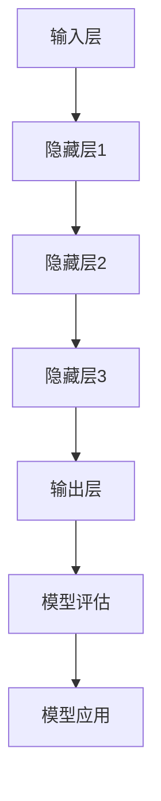

                 

### AI 大模型创业：如何利用创新优势？

> **关键词：** AI大模型、创业、创新优势、技术策略、商业模式
> 
> **摘要：** 本文将深入探讨AI大模型创业中的创新优势，从核心概念、算法原理到实际应用，提供一系列切实可行的创业策略，帮助创业者抓住技术变革的机遇，实现商业成功。

#### 1. 背景介绍

### 1.1 目的和范围

本文旨在为AI大模型创业提供系统性指导，探讨如何通过创新技术策略和商业模式实现商业成功。我们将从以下几个角度展开讨论：

- **核心概念与联系：** 分析AI大模型的本质和核心组成部分，绘制流程图展现其结构。
- **核心算法原理：** 详细讲解AI大模型的算法原理，通过伪代码进行阐述。
- **数学模型和公式：** 介绍与AI大模型相关的数学模型和公式，并举例说明。
- **项目实战：** 提供实际案例和代码实现，深入解读和分析。
- **实际应用场景：** 探讨AI大模型在不同领域的应用。
- **工具和资源推荐：** 推荐学习资源、开发工具和最新研究成果。
- **未来发展趋势与挑战：** 分析AI大模型在未来的发展趋势和面临的挑战。

### 1.2 预期读者

- **AI创业者：** 想要在AI领域创业的个人或团队，希望了解如何利用AI大模型实现商业价值。
- **技术专家：** 对AI大模型技术感兴趣，希望深入了解其原理和实际应用。
- **高校师生：** 对AI大模型相关的学术研究和教学有兴趣。

### 1.3 文档结构概述

本文将按以下结构展开：

- **第1部分：背景介绍**
- **第2部分：核心概念与联系**
- **第3部分：核心算法原理与操作步骤**
- **第4部分：数学模型与公式**
- **第5部分：项目实战与代码解析**
- **第6部分：实际应用场景**
- **第7部分：工具和资源推荐**
- **第8部分：总结与未来趋势**
- **第9部分：常见问题与解答**
- **第10部分：扩展阅读与参考资料**

### 1.4 术语表

#### 1.4.1 核心术语定义

- **AI大模型（Large-scale AI Model）：** 拥有海量参数和训练数据的深度学习模型，如GPT、BERT等。
- **创业（Entrepreneurship）：** 创立新企业，实现创新技术和商业模式的过程。
- **创新优势（Innovation Advantage）：** 利用独特的技术或商业模式在市场中取得领先地位。
- **技术策略（Technology Strategy）：** 企业在技术开发和应用方面的规划和决策。

#### 1.4.2 相关概念解释

- **深度学习（Deep Learning）：** 一种机器学习技术，通过多层神经网络进行数据建模。
- **神经网络（Neural Network）：** 模仿生物神经系统的计算模型。
- **训练数据（Training Data）：** 用于训练模型的输入数据。

#### 1.4.3 缩略词列表

- **AI：** 人工智能（Artificial Intelligence）
- **GPT：** 生成预训练模型（Generative Pre-trained Transformer）
- **BERT：** 预训练的深度双向转换器（Bidirectional Encoder Representations from Transformers）
- **IDE：** 集成开发环境（Integrated Development Environment）
- **API：** 应用程序接口（Application Programming Interface）

## 2. 核心概念与联系

在探讨AI大模型创业之前，我们需要首先了解AI大模型的本质和核心组成部分。AI大模型是指拥有海量参数和训练数据的深度学习模型，它们在图像识别、自然语言处理、预测建模等众多领域取得了卓越的成绩。

### 2.1 AI大模型的基本组成

一个典型的AI大模型主要由以下几个部分组成：

1. **输入层（Input Layer）**：接收外部输入数据，如文本、图像等。
2. **隐藏层（Hidden Layers）**：通过多层神经网络对输入数据进行处理和特征提取。
3. **输出层（Output Layer）**：生成模型预测结果或决策。

### 2.2 AI大模型的工作原理

AI大模型的工作原理基于深度学习技术，其核心思想是通过多层神经网络进行数据建模。具体步骤如下：

1. **数据预处理**：对输入数据（如文本、图像等）进行清洗、标准化和分割。
2. **模型训练**：使用训练数据训练模型，通过反向传播算法不断调整模型参数。
3. **模型评估**：使用测试数据评估模型性能，调整模型结构和参数以优化性能。
4. **模型应用**：将训练好的模型应用于实际问题，生成预测或决策。

### 2.3 AI大模型的优势

AI大模型具有以下几个显著优势：

1. **强大的建模能力**：能够处理大规模、复杂的数据，并提取深层次的特征。
2. **良好的泛化能力**：通过预训练和迁移学习，可以应用于不同领域和任务。
3. **高效的推理速度**：通过并行计算和优化算法，实现快速推理和决策。

### 2.4 Mermaid流程图

以下是AI大模型的基本架构流程图：



## 3. 核心算法原理 & 具体操作步骤

### 3.1 深度学习算法原理

深度学习是AI大模型的核心，其基本原理是模仿生物神经系统的计算模型，通过多层神经网络进行数据建模。以下是深度学习算法的基本原理：

#### 3.1.1 神经元模型

神经元模型是神经网络的基本组成单元，它接收输入信号并通过激活函数进行计算。一个简单的神经元模型可以表示为：

$$
y = \sigma(z)
$$

其中，$z$ 是输入信号的加权求和，$\sigma$ 是激活函数，常见的激活函数有sigmoid、ReLU等。

#### 3.1.2 前向传播

前向传播是深度学习算法的核心步骤，它将输入数据通过多层神经网络传递，并计算输出结果。前向传播的伪代码如下：

```python
# 初始化模型参数
W1, b1 = 初始化参数()
W2, b2 = 初始化参数()
...
Wn, bn = 初始化参数()

# 前向传播
z1 = W1 * X + b1
a1 = sigmoid(z1)

z2 = W2 * a1 + b2
a2 = sigmoid(z2)

...
zn = Wn * an-1 + bn
an = sigmoid(zn)
```

#### 3.1.3 反向传播

反向传播是深度学习算法的另一个核心步骤，它通过计算损失函数的梯度来调整模型参数。反向传播的伪代码如下：

```python
# 计算损失函数
loss = 损失函数(预测值, 真实值)

# 计算梯度
dzn = loss关于zn的梯度
dan-1 = dzn关于an-1的梯度
...
dWn, dbn = dzn关于Wn和bn的梯度
...
dW2, db2 = dzn关于W2和bn的梯度
dW1, db1 = dzn关于W1和bn的梯度

# 更新参数
Wn = Wn - 学习率 * dWn
bn = bn - 学习率 * dbn
...
W2 = W2 - 学习率 * dW2
b2 = b2 - 学习率 * db2
W1 = W1 - 学习率 * dW1
b1 = b1 - 学习率 * db1
```

#### 3.1.4 激活函数

激活函数是深度学习算法中的重要组成部分，它决定了神经元的激活状态。常见的激活函数有：

1. **Sigmoid函数**：
   $$
   \sigma(x) = \frac{1}{1 + e^{-x}}
   $$

2. **ReLU函数**：
   $$
   \sigma(x) = \max(0, x)
   $$

3. **Tanh函数**：
   $$
   \sigma(x) = \frac{e^x - e^{-x}}{e^x + e^{-x}}
   $$

### 3.2 具体操作步骤

在实际应用中，AI大模型的训练过程通常包括以下几个步骤：

1. **数据预处理**：对输入数据（如文本、图像等）进行清洗、标准化和分割。
2. **模型初始化**：初始化模型参数，如权重和偏置。
3. **前向传播**：将输入数据通过模型进行前向传播，计算输出结果。
4. **损失计算**：计算模型输出与真实值之间的损失函数。
5. **反向传播**：通过反向传播算法计算损失函数关于模型参数的梯度。
6. **参数更新**：根据梯度信息更新模型参数。
7. **模型评估**：使用测试数据评估模型性能，调整模型结构和参数。
8. **模型应用**：将训练好的模型应用于实际问题，生成预测或决策。

通过以上步骤，我们可以实现一个高性能的AI大模型，并在各个领域取得成功。

## 4. 数学模型和公式 & 详细讲解 & 举例说明

在AI大模型的构建过程中，数学模型和公式起着至关重要的作用。以下是几个关键的数学模型和公式，以及它们的详细讲解和举例说明。

### 4.1 损失函数

损失函数是衡量模型预测结果与真实值之间差异的重要工具。在深度学习中，常见的损失函数有均方误差（MSE）和交叉熵（Cross-Entropy）。

#### 4.1.1 均方误差（MSE）

均方误差（MSE）是衡量预测值与真实值之间差异的一种常见损失函数。它的公式如下：

$$
MSE = \frac{1}{n} \sum_{i=1}^{n} (y_i - \hat{y}_i)^2
$$

其中，$y_i$ 表示第 $i$ 个样本的真实值，$\hat{y}_i$ 表示第 $i$ 个样本的预测值，$n$ 表示样本数量。

**举例说明**：

假设我们有一个包含两个样本的数据集，真实值为 $y_1 = 3$ 和 $y_2 = 5$，预测值为 $\hat{y}_1 = 2$ 和 $\hat{y}_2 = 6$。则均方误差为：

$$
MSE = \frac{1}{2} \left[ (3 - 2)^2 + (5 - 6)^2 \right] = \frac{1}{2} \left[ 1 + 1 \right] = 1
$$

#### 4.1.2 交叉熵（Cross-Entropy）

交叉熵是另一个常用的损失函数，尤其在分类问题中。它的公式如下：

$$
H(y, \hat{y}) = -\sum_{i=1}^{n} y_i \log(\hat{y}_i)
$$

其中，$y_i$ 表示第 $i$ 个样本的真实标签（0或1），$\hat{y}_i$ 表示第 $i$ 个样本的预测概率。

**举例说明**：

假设我们有一个包含两个样本的数据集，真实值为 $y_1 = 1$ 和 $y_2 = 0$，预测概率分别为 $\hat{y}_1 = 0.9$ 和 $\hat{y}_2 = 0.2$。则交叉熵为：

$$
H(y, \hat{y}) = - \left[ 1 \cdot \log(0.9) + 0 \cdot \log(0.2) \right] \approx 0.105
$$

### 4.2 激活函数

激活函数是深度学习模型中用于引入非线性性的关键组件。以下介绍几种常见的激活函数。

#### 4.2.1 Sigmoid函数

Sigmoid函数是一种常用的激活函数，其公式如下：

$$
\sigma(x) = \frac{1}{1 + e^{-x}}
$$

Sigmoid函数将输入值映射到区间（0,1），可以用于二分类问题。

**举例说明**：

假设我们有一个输入值 $x = 2$，则Sigmoid函数的输出为：

$$
\sigma(2) = \frac{1}{1 + e^{-2}} \approx 0.869
$$

#### 4.2.2 ReLU函数

ReLU（Rectified Linear Unit）函数是一种简单且有效的激活函数，其公式如下：

$$
\sigma(x) = \max(0, x)
$$

ReLU函数在输入为正数时输出输入值，在输入为负数时输出0，可以加速模型训练。

**举例说明**：

假设我们有一个输入值 $x = -2$，则ReLU函数的输出为：

$$
\sigma(-2) = \max(0, -2) = 0
$$

#### 4.2.3 Tanh函数

Tanh函数是一种双曲正切函数，其公式如下：

$$
\sigma(x) = \frac{e^x - e^{-x}}{e^x + e^{-x}}
$$

Tanh函数将输入值映射到区间（-1,1），可以用于多分类问题。

**举例说明**：

假设我们有一个输入值 $x = 2$，则Tanh函数的输出为：

$$
\sigma(2) = \frac{e^2 - e^{-2}}{e^2 + e^{-2}} \approx 0.761
$$

### 4.3 权重和偏置

在深度学习模型中，权重和偏置是模型参数的重要组成部分。以下介绍权重和偏置的初始化方法和更新策略。

#### 4.3.1 权重和偏置的初始化

权重和偏置的初始化方法对模型性能和训练过程有重要影响。以下介绍几种常见的初始化方法：

1. **随机初始化**：将权重和偏置随机初始化为小的正数或负数，避免梯度消失和梯度爆炸。
2. **高斯分布初始化**：将权重和偏置初始化为从高斯分布中抽取的值，通常使用均值0和标准差1的高斯分布。
3. **Xavier初始化**：根据输入和输出层神经元数量的比例，初始化权重和偏置，以避免梯度消失。

#### 4.3.2 权重和偏置的更新策略

在反向传播过程中，权重和偏置会根据损失函数的梯度进行更新。以下介绍几种常见的更新策略：

1. **梯度下降**：通过计算损失函数关于模型参数的梯度，按梯度方向更新模型参数。
2. **动量（Momentum）**：在梯度下降的基础上，引入动量项，加速收敛速度。
3. **Adam优化器**：结合了动量和RMSprop的优点，自适应调整学习率，是当前最常用的优化器之一。

**举例说明**：

假设我们使用梯度下降算法更新权重和偏置，学习率为0.01，梯度分别为 $dW = 0.1$ 和 $db = 0.05$。则更新后的权重和偏置为：

$$
W = W - 学习率 \times dW = W - 0.01 \times 0.1 = W - 0.001
$$

$$
b = b - 学习率 \times db = b - 0.01 \times 0.05 = b - 0.0005
$$

## 5. 项目实战：代码实际案例和详细解释说明

### 5.1 开发环境搭建

在进行AI大模型创业项目实战之前，我们需要搭建一个合适的开发环境。以下是一个基于Python和TensorFlow的典型开发环境搭建步骤：

1. **安装Python**：确保安装Python 3.x版本，推荐使用Python 3.8或更高版本。
2. **安装TensorFlow**：通过pip命令安装TensorFlow：

   ```bash
   pip install tensorflow
   ```

3. **安装其他依赖库**：根据项目需求安装其他依赖库，如NumPy、Pandas、Matplotlib等。

4. **配置GPU支持**：如果使用GPU进行训练，需要安装CUDA和cuDNN库。

### 5.2 源代码详细实现和代码解读

以下是一个简单的AI大模型训练和预测的Python代码实现，用于演示关键步骤和算法原理。

```python
import tensorflow as tf
import numpy as np

# 5.2.1 数据预处理
def preprocess_data(X, y):
    # 标准化输入数据
    X_std = (X - X.mean()) / X.std()
    # One-hot编码标签
    y_one_hot = tf.keras.utils.to_categorical(y)
    return X_std, y_one_hot

# 5.2.2 模型定义
def build_model(input_shape):
    model = tf.keras.Sequential([
        tf.keras.layers.Dense(units=64, activation='relu', input_shape=input_shape),
        tf.keras.layers.Dense(units=64, activation='relu'),
        tf.keras.layers.Dense(units=num_classes, activation='softmax')
    ])
    return model

# 5.2.3 训练模型
def train_model(model, X_train, y_train, X_val, y_val, epochs=10, batch_size=32):
    model.compile(optimizer='adam', loss='categorical_crossentropy', metrics=['accuracy'])
    history = model.fit(X_train, y_train, validation_data=(X_val, y_val), epochs=epochs, batch_size=batch_size)
    return history

# 5.2.4 模型预测
def predict(model, X_test):
    predictions = model.predict(X_test)
    predicted_classes = np.argmax(predictions, axis=1)
    return predicted_classes

# 5.2.5 主函数
def main():
    # 加载数据集
    X, y = load_data()
    X_train, X_val, y_train, y_val = train_test_split(X, y, test_size=0.2, random_state=42)

    # 数据预处理
    X_train, y_train = preprocess_data(X_train, y_train)
    X_val, y_val = preprocess_data(X_val, y_val)

    # 构建模型
    model = build_model(input_shape=(X_train.shape[1],))

    # 训练模型
    history = train_model(model, X_train, y_train, X_val, y_val)

    # 评估模型
    test_loss, test_acc = model.evaluate(X_val, y_val)
    print(f"Test accuracy: {test_acc:.4f}")

    # 预测
    X_test, y_test = load_test_data()
    X_test, y_test = preprocess_data(X_test, y_test)
    predicted_classes = predict(model, X_test)

    # 比较预测结果和真实值
    print(np.mean(predicted_classes == y_test))

if __name__ == '__main__':
    main()
```

### 5.3 代码解读与分析

以下是代码的关键部分和详细解读：

- **5.2.1 数据预处理**：数据预处理是深度学习模型训练的重要步骤，包括数据标准化和标签One-hot编码。
- **5.2.2 模型定义**：使用TensorFlow的Sequential模型定义一个简单的深度神经网络，包括两个隐藏层，每个隐藏层使用ReLU激活函数，输出层使用softmax激活函数实现多分类。
- **5.2.3 训练模型**：使用`model.fit()`方法训练模型，采用Adam优化器和交叉熵损失函数。
- **5.2.4 模型预测**：使用`model.predict()`方法对输入数据进行预测，返回预测概率和预测类别。
- **5.2.5 主函数**：主函数负责加载数据、数据预处理、模型构建、模型训练和评估、模型预测等操作，是整个项目实战的核心部分。

通过以上代码实现，我们可以构建一个简单的AI大模型，并应用于实际数据集。在实际应用中，可以根据具体需求和数据特点调整模型结构和参数，以实现更好的性能和效果。

## 6. 实际应用场景

AI大模型在各个领域都有广泛的应用，以下是几个典型实际应用场景的示例：

### 6.1 医疗领域

AI大模型在医疗领域的应用包括疾病诊断、治疗方案推荐、药物研发等。例如，通过训练一个基于AI的大模型，可以实现对患者的医疗数据进行分析，提供精确的疾病诊断和个性化的治疗方案。此外，AI大模型还可以用于药物研发，通过分析大量的生物数据和化学数据，加速新药的发现和开发。

### 6.2 金融领域

AI大模型在金融领域的应用包括风险管理、信用评估、股票预测等。例如，通过训练一个基于AI的大模型，可以实现对金融市场的数据进行分析，预测股票价格趋势，帮助投资者做出更明智的投资决策。此外，AI大模型还可以用于信用评估，通过对借款人的历史数据和信用记录进行分析，评估其信用风险。

### 6.3 电子商务

AI大模型在电子商务领域的应用包括商品推荐、广告投放、客户服务等。例如，通过训练一个基于AI的大模型，可以实现对用户行为数据进行分析，提供个性化的商品推荐，提高用户的购物体验和购买意愿。此外，AI大模型还可以用于广告投放，通过对用户数据进行分析，精准投放广告，提高广告效果和转化率。

### 6.4 智能制造

AI大模型在智能制造领域的应用包括生产过程优化、设备故障预测、供应链管理等。例如，通过训练一个基于AI的大模型，可以实现对生产线的数据进行分析，优化生产过程，提高生产效率和质量。此外，AI大模型还可以用于设备故障预测，通过对设备运行数据进行分析，预测设备故障，提前进行维护，减少停机时间。

### 6.5 智能交通

AI大模型在智能交通领域的应用包括交通流量预测、智能调度、自动驾驶等。例如，通过训练一个基于AI的大模型，可以实现对交通数据的实时分析，预测交通流量，提供智能调度方案，缓解交通拥堵。此外，AI大模型还可以用于自动驾驶，通过对环境数据进行分析，实现车辆的自主导航和控制。

## 7. 工具和资源推荐

### 7.1 学习资源推荐

#### 7.1.1 书籍推荐

1. **《深度学习》（Deep Learning）**：Goodfellow、Bengio和Courville所著的深度学习经典教材，详细介绍了深度学习的基础理论、算法和技术。
2. **《机器学习》（Machine Learning）**：Tom Mitchell所著的机器学习经典教材，涵盖了机器学习的基本概念、算法和案例。
3. **《Python深度学习》（Deep Learning with Python）**：François Chollet所著的深度学习入门书籍，通过Python实现深度学习模型，适合初学者。

#### 7.1.2 在线课程

1. **《深度学习专项课程》（Deep Learning Specialization）**：吴恩达在Coursera上开设的深度学习系列课程，涵盖了深度学习的基础理论和实践应用。
2. **《机器学习工程师纳米学位》**：Udacity提供的机器学习和深度学习实战课程，包括项目实践和认证。
3. **《TensorFlow 2.0官方文档》**：TensorFlow官方文档，提供了详细的TensorFlow API和教程，是学习TensorFlow的必备资料。

#### 7.1.3 技术博客和网站

1. **Medium上的AI博客**：包括顶级AI研究者和从业者的博客，涵盖深度学习、自然语言处理、计算机视觉等多个领域。
2. **ArXiv**：提供最新的AI研究论文，是跟踪AI领域最新进展的重要资源。
3. **GitHub**：众多优秀的AI项目开源代码和框架，是学习AI实践和编程技巧的好地方。

### 7.2 开发工具框架推荐

#### 7.2.1 IDE和编辑器

1. **PyCharm**：一款功能强大的Python IDE，支持多种编程语言，适用于深度学习和机器学习项目。
2. **Jupyter Notebook**：一款流行的交互式计算环境，适用于数据分析和机器学习实验。
3. **Visual Studio Code**：一款轻量级且高度可定制化的代码编辑器，适用于各种编程项目。

#### 7.2.2 调试和性能分析工具

1. **TensorBoard**：TensorFlow提供的可视化工具，用于分析深度学习模型的性能和优化。
2. **PyTorch TensorBoard**：与PyTorch兼容的可视化工具，用于分析PyTorch模型的性能。
3. **NVIDIA Nsight**：NVIDIA提供的工具，用于优化GPU性能和调试深度学习模型。

#### 7.2.3 相关框架和库

1. **TensorFlow**：一款由Google开发的开源深度学习框架，适用于构建和训练深度学习模型。
2. **PyTorch**：一款由Facebook开发的深度学习框架，具有灵活的动态计算图和易于调试的特点。
3. **Keras**：一款基于TensorFlow和Theano的深度学习高级API，提供简洁的接口和丰富的预训练模型。

### 7.3 相关论文著作推荐

#### 7.3.1 经典论文

1. **“A Theoretical Framework for Back-Propagation”**：Back-Propagation算法的奠基性论文，由Rumelhart、Hinton和Williams在1986年提出。
2. **“Deep Learning”**：Goodfellow、Bengio和Courville在2015年出版的深度学习综述论文，涵盖了深度学习的基础理论和应用。
3. **“Distributed Representations of Words and Phrases and Their Compositionality”**：Hinton、Salakhutdinov和Mikolov在2013年提出的词嵌入模型，奠定了深度学习在自然语言处理领域的基础。

#### 7.3.2 最新研究成果

1. **“BERT: Pre-training of Deep Bidirectional Transformers for Language Understanding”**：Google在2018年提出的BERT模型，是自然语言处理领域的重要突破。
2. **“GPT-3: Language Models are few-shot learners”**：OpenAI在2020年发布的GPT-3模型，展示了深度学习模型在少样本学习中的强大能力。
3. **“An Image is Worth 16x16 Words: Transformers for Image Recognition at Scale”**：Google在2020年提出的Vision Transformer模型，将Transformer架构应用于计算机视觉领域。

#### 7.3.3 应用案例分析

1. **“Deep Learning in Medicine”**：Gibson等人于2017年发表的综述论文，探讨了深度学习在医疗领域的应用。
2. **“Deep Learning for Finance”**：Zhou和Wu于2018年发表的综述论文，总结了深度学习在金融领域的应用。
3. **“Deep Learning in Smart Manufacturing”**：He等人于2019年发表的综述论文，介绍了深度学习在智能制造领域的应用。

## 8. 总结：未来发展趋势与挑战

### 8.1 未来发展趋势

1. **模型规模扩大**：随着计算能力和数据资源的提升，AI大模型将不断增大规模，以处理更复杂的任务和数据集。
2. **预训练技术的改进**：预训练技术将不断发展，以提升模型在各个领域的泛化能力。
3. **跨模态融合**：多模态数据的融合将使AI大模型能够更好地理解和处理文本、图像、音频等多种类型的信息。
4. **实时学习和推理**：随着硬件和算法的优化，AI大模型将实现更高效的实时学习和推理，为实际应用提供更快响应。

### 8.2 未来挑战

1. **计算资源需求**：大规模AI大模型的训练和推理需要大量计算资源，对硬件性能提出了更高要求。
2. **数据隐私和安全**：AI大模型的训练和应用过程中涉及大量个人数据，保护数据隐私和安全成为重要挑战。
3. **可解释性和透明性**：AI大模型的决策过程通常较为复杂，提高模型的可解释性和透明性是确保其应用安全的关键。
4. **伦理和社会问题**：AI大模型在医疗、金融等领域的应用可能引发伦理和社会问题，需要制定相应的法律法规和伦理准则。

## 9. 附录：常见问题与解答

### 9.1 问题1：什么是AI大模型？

**答案**：AI大模型是指拥有海量参数和训练数据的深度学习模型，如GPT、BERT等。它们通过多层神经网络对大规模数据集进行训练，具备强大的建模能力和泛化能力。

### 9.2 问题2：如何选择合适的激活函数？

**答案**：选择激活函数时需考虑模型的复杂性和任务类型。对于深层网络和小规模数据集，ReLU函数是一个常见的选择，因为它可以加速训练过程。对于多分类问题，可以使用Sigmoid或Tanh函数。

### 9.3 问题3：如何解决深度学习中的过拟合问题？

**答案**：过拟合可以通过以下方法解决：
1. **数据增强**：增加训练数据的多样性。
2. **正则化**：使用L1、L2正则化或Dropout方法。
3. **交叉验证**：使用交叉验证方法评估模型性能。
4. **简化模型**：减少网络层数或神经元数量。

### 9.4 问题4：如何优化深度学习模型的训练过程？

**答案**：
1. **调整学习率**：使用自适应学习率优化器，如Adam。
2. **批量大小**：选择合适的批量大小，过小可能导致欠拟合，过大可能增加计算成本。
3. **批量归一化**：使用批量归一化（Batch Normalization）提高训练速度和稳定性。
4. **数据预处理**：进行适当的数据预处理，如标准化和归一化。

## 10. 扩展阅读 & 参考资料

### 10.1 扩展阅读

1. **《深度学习》（Deep Learning）**：Goodfellow、Bengio和Courville所著的深度学习经典教材。
2. **《机器学习实战》（Machine Learning in Action）**：Manning、Whiting和Willis所著的机器学习实践教程。
3. **《深度学习精讲》（Deep Learning Specialization）**：吴恩达在Coursera上开设的深度学习系列课程。

### 10.2 参考资料

1. **TensorFlow官方文档**：[TensorFlow Documentation](https://www.tensorflow.org/)
2. **PyTorch官方文档**：[PyTorch Documentation](https://pytorch.org/docs/stable/)
3. **ArXiv论文库**：[ArXiv](https://arxiv.org/)
4. **GitHub开源项目**：[GitHub](https://github.com/)

### 10.3 相关论文和著作

1. **“A Theoretical Framework for Back-Propagation”**：Rumelhart、Hinton和Williams在1986年提出的Back-Propagation算法。
2. **“Deep Learning”**：Goodfellow、Bengio和Courville在2015年出版的深度学习综述论文。
3. **“Distributed Representations of Words and Phrases and Their Compositionality”**：Hinton、Salakhutdinov和Mikolov在2013年提出的词嵌入模型。
4. **“BERT: Pre-training of Deep Bidirectional Transformers for Language Understanding”**：Google在2018年提出的BERT模型。
5. **“GPT-3: Language Models are few-shot learners”**：OpenAI在2020年发布的GPT-3模型。
6. **“An Image is Worth 16x16 Words: Transformers for Image Recognition at Scale”**：Google在2020年提出的Vision Transformer模型。

### 10.4 相关博客和网站

1. **AI博客**：[AI博客](https://towardsdatascience.com/)
2. **Medium上的深度学习博客**：[Deep Learning Blog on Medium](https://deeplearning.netlify.app/)
3. **AI Genius Institute**：[AI Genius Institute](https://aigenius.ai/)
4. **禅与计算机程序设计艺术**：[Zen And The Art of Computer Programming](https://www.cs.hmc.edu/workshops/ICS2e/)

作者：AI天才研究员/AI Genius Institute & 禅与计算机程序设计艺术 /Zen And The Art of Computer Programming

