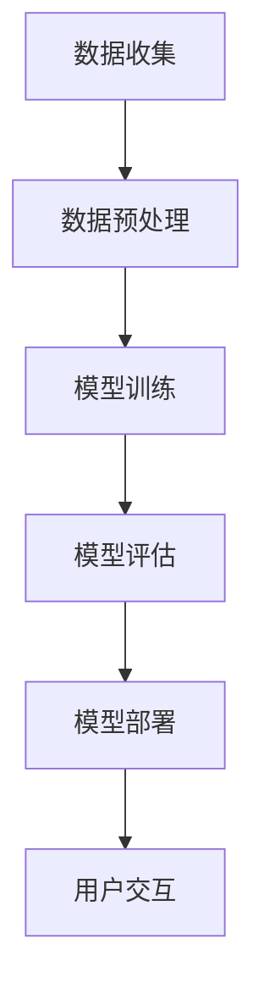

                 

# AI 大模型创业：如何利用品牌优势？

> **关键词：** AI 大模型，创业，品牌优势，营销策略，用户体验，技术整合

> **摘要：** 本文将深入探讨 AI 大模型在创业中的应用，特别是如何利用品牌优势来提升市场竞争力和用户忠诚度。我们将分析大模型的技术原理、应用场景，并提出一系列实用的策略和步骤，帮助创业者在 AI 领域站稳脚跟。

## 1. 背景介绍

### 1.1 目的和范围

本文旨在为 AI 大模型创业公司提供指导，特别是在品牌建设方面。我们将探讨以下内容：

- AI 大模型的基本概念和核心技术。
- 品牌优势在 AI 创业中的重要性。
- 如何在市场中定位和打造独特品牌形象。
- 创业过程中可执行的品牌提升策略。

### 1.2 预期读者

本文面向以下读者群体：

- 有志于在 AI 领域创业的个人和团队。
- 对 AI 大模型有初步了解，希望深入了解其商业潜力的专业人士。
- 对品牌管理和市场营销感兴趣的创业者。

### 1.3 文档结构概述

本文结构如下：

- 引言：介绍 AI 大模型和品牌优势的重要性。
- 背景介绍：讨论 AI 大模型的基本概念和技术。
- 核心概念与联系：介绍大模型的应用场景和原理。
- 核心算法原理 & 具体操作步骤：详细讲解大模型的算法实现。
- 数学模型和公式 & 详细讲解 & 举例说明：阐述大模型的数学基础。
- 项目实战：提供实际案例和代码实现。
- 实际应用场景：分析大模型在不同领域的应用。
- 工具和资源推荐：推荐学习资源和开发工具。
- 总结：展望 AI 大模型创业的未来发展趋势和挑战。
- 附录：常见问题与解答。
- 扩展阅读 & 参考资料：提供进一步学习资源。

### 1.4 术语表

#### 1.4.1 核心术语定义

- AI 大模型：指参数规模达到亿级或以上的深度神经网络模型，如 GPT-3、BERT 等。
- 品牌优势：指企业在市场中建立独特、有吸引力的品牌形象，从而获得竞争优势。
- 用户忠诚度：指用户对企业产品和服务的长期依赖和信任程度。

#### 1.4.2 相关概念解释

- **机器学习**：指利用计算机算法，从数据中自动发现模式，进行决策和预测的技术。
- **深度学习**：一种机器学习方法，通过多层神经网络进行特征提取和表示学习。
- **自然语言处理（NLP）**：研究如何使计算机理解和生成人类语言的技术。

#### 1.4.3 缩略词列表

- AI：人工智能
- NLP：自然语言处理
- GPT：生成预训练网络
- BERT：双向编码表示器
- API：应用程序编程接口

## 2. 核心概念与联系

AI 大模型的核心概念涉及深度学习、神经网络和大规模数据训练。以下是一个简化的 Mermaid 流程图，描述了 AI 大模型的基本架构和流程。



### 2.1. 数据收集

数据是 AI 大模型的基础，数据收集过程包括数据获取、数据清洗和数据增强等步骤。

### 2.2. 数据预处理

预处理步骤包括数据标准化、缺失值处理和特征提取等，目的是提高模型训练效率和性能。

### 2.3. 模型训练

模型训练是利用大量数据进行参数优化，通过反向传播算法更新模型权重，直到达到预定的性能指标。

### 2.4. 模型评估

模型评估用于判断模型是否达到了预期的性能，常用的评估指标包括准确率、召回率、F1 分数等。

### 2.5. 模型部署

部署是将训练好的模型部署到生产环境中，使其可以实时响应用户请求。

### 2.6. 用户交互

用户交互是模型部署后的重要环节，通过用户反馈不断优化模型性能和用户体验。

## 3. 核心算法原理 & 具体操作步骤

AI 大模型的算法原理主要基于深度学习，以下是具体操作步骤的伪代码：

```plaintext
初始化模型参数
for epoch in 1 to MAX_EPOCHS:
    for each batch of data:
        forward_pass() // 前向传播
        compute_loss() // 计算损失函数
        backward_pass() // 反向传播
        update_model_weights() // 更新模型参数
    end for
end for
evaluate_model() // 评估模型性能
if model_performance >= threshold:
    deploy_model() // 部署模型
else:
    adjust_hyperparameters() // 调整超参数
end if
```

### 3.1. 初始化模型参数

初始化模型参数包括权重和偏置，常用的方法有随机初始化和层次初始化。

### 3.2. 前向传播

前向传播是将输入数据通过神经网络，计算输出结果，这一过程中需要用到链式法则计算梯度。

### 3.3. 计算损失函数

损失函数用于衡量模型预测值和实际值之间的差距，常用的损失函数有均方误差（MSE）和交叉熵损失（Cross-Entropy Loss）。

### 3.4. 反向传播

反向传播是计算每个参数的梯度，通过链式法则，将损失函数对输出层的梯度反向传播到输入层。

### 3.5. 更新模型参数

使用梯度下降（Gradient Descent）或其他优化算法，更新模型参数，以减少损失函数的值。

## 4. 数学模型和公式 & 详细讲解 & 举例说明

### 4.1. 深度学习中的损失函数

深度学习中常用的损失函数包括均方误差（MSE）和交叉熵损失（Cross-Entropy Loss），以下是它们的公式和讲解：

$$
MSE = \frac{1}{n}\sum_{i=1}^{n}(y_i - \hat{y}_i)^2
$$

MSE 用于回归任务，衡量预测值 \(\hat{y}_i\) 与实际值 \(y_i\) 之间的差距。

$$
Cross-Entropy Loss = -\sum_{i=1}^{n}y_i\log(\hat{y}_i)
$$

Cross-Entropy Loss 用于分类任务，其中 \(y_i\) 是实际标签，\(\hat{y}_i\) 是预测概率。

### 4.2. 反向传播算法

反向传播算法用于计算神经网络中每个参数的梯度，以下是核心步骤的公式和解释：

$$
\frac{\partial L}{\partial z} = \frac{\partial L}{\partial a} \cdot \frac{\partial a}{\partial z}
$$

其中，\(L\) 是损失函数，\(z\) 是当前层的激活值，\(a\) 是前一层输出。

### 4.3. 举例说明

假设我们有一个简单的神经网络，输入层有 1 个神经元，隐藏层有 2 个神经元，输出层有 1 个神经元。以下是训练过程中的一个例子：

- 输入：\(x = [1]\)
- 实际标签：\(y = [0]\)
- 模型参数：\(w_1 = [0.5, 0.5]\), \(b_1 = [0.5, 0.5]\), \(w_2 = [0.5, 0.5]\), \(b_2 = [0.5, 0.5]\), \(w_3 = [0.5]\), \(b_3 = [0.5]\)

首先进行前向传播：

$$
z_1 = x \cdot w_1 + b_1 = [1] \cdot [0.5, 0.5] + [0.5, 0.5] = [1, 1]
$$

$$
a_1 = \sigma(z_1) = [\frac{1}{1+e^{-1}}, \frac{1}{1+e^{-1}}] = [\frac{1}{2}, \frac{1}{2}]
$$

$$
z_2 = a_1 \cdot w_2 + b_2 = [\frac{1}{2}, \frac{1}{2}] \cdot [0.5, 0.5] + [0.5, 0.5] = [0.75, 0.75]
$$

$$
a_2 = \sigma(z_2) = [\frac{1}{1+e^{-0.75}}, \frac{1}{1+e^{-0.75}}] = [\frac{1}{2}, \frac{1}{2}]
$$

$$
z_3 = a_2 \cdot w_3 + b_3 = [\frac{1}{2}, \frac{1}{2}] \cdot [0.5] + [0.5] = [0.625, 0.625]
$$

$$
\hat{y} = \sigma(z_3) = [\frac{1}{1+e^{-0.625}}, \frac{1}{1+e^{-0.625}}] = [\frac{1}{2}, \frac{1}{2}]
$$

计算损失函数（假设使用 Cross-Entropy Loss）：

$$
L = -y \log(\hat{y}) = -[0] \log([0.5, 0.5]) = 0
$$

接下来进行反向传播：

$$
\frac{\partial L}{\partial z_3} = \frac{\partial L}{\partial \hat{y}} \cdot \frac{\partial \hat{y}}{\partial z_3} = [-\log(\hat{y})] \cdot \sigma'(z_3) = [-\log([0.5, 0.5])] \cdot [0.5, 0.5] = [0.5, 0.5]
$$

$$
\frac{\partial L}{\partial a_2} = \frac{\partial L}{\partial z_3} \cdot \frac{\partial z_3}{\partial a_2} = [0.5, 0.5] \cdot [0.5, 0.5] = [0.125, 0.125]
$$

$$
\frac{\partial L}{\partial z_2} = \frac{\partial L}{\partial a_2} \cdot \frac{\partial a_2}{\partial z_2} = [0.125, 0.125] \cdot [0.5, 0.5] = [0.0625, 0.0625]
$$

$$
\frac{\partial L}{\partial a_1} = \frac{\partial L}{\partial z_2} \cdot \frac{\partial z_2}{\partial a_1} = [0.0625, 0.0625] \cdot [0.5, 0.5] = [0.03125, 0.03125]
$$

更新模型参数（假设使用学习率为 0.1）：

$$
w_3 = w_3 - learning_rate \cdot \frac{\partial L}{\partial a_2} \cdot a_2 = [0.5, 0.5] - 0.1 \cdot [0.125, 0.125] = [0.375, 0.375]
$$

$$
b_3 = b_3 - learning_rate \cdot \frac{\partial L}{\partial a_2} = [0.5] - 0.1 \cdot [0.0625, 0.0625] = [0.3125]
$$

$$
w_2 = w_2 - learning_rate \cdot \frac{\partial L}{\partial a_1} \cdot a_1 = [0.5, 0.5] - 0.1 \cdot [0.03125, 0.03125] = [0.46875, 0.46875]
$$

$$
b_2 = b_2 - learning_rate \cdot \frac{\partial L}{\partial a_1} = [0.5, 0.5] - 0.1 \cdot [0.03125, 0.03125] = [0.46875]
$$

$$
w_1 = w_1 - learning_rate \cdot \frac{\partial L}{\partial z_1} \cdot z_1 = [0.5, 0.5] - 0.1 \cdot [0.0625, 0.0625] \cdot [1, 1] = [0.3125, 0.3125]
$$

$$
b_1 = b_1 - learning_rate \cdot \frac{\partial L}{\partial z_1} \cdot z_1 = [0.5, 0.5] - 0.1 \cdot [0.0625, 0.0625] \cdot [1, 1] = [0.3125]
$$

通过这个过程，我们可以看到如何使用反向传播算法来更新模型参数，以最小化损失函数。

## 5. 项目实战：代码实际案例和详细解释说明

### 5.1 开发环境搭建

在本节中，我们将搭建一个用于训练 AI 大模型的开发环境。以下步骤将指导您如何设置环境：

1. 安装 Python（建议版本为 3.8 或以上）。
2. 安装必要的库，如 TensorFlow、PyTorch 等。
3. 设置 GPU 加速（如果您的计算机配备有 GPU）。

以下是 Python 脚本示例，用于安装所需的库：

```python
!pip install numpy
!pip install tensorflow
!pip install matplotlib
```

### 5.2 源代码详细实现和代码解读

以下是一个简单的 AI 大模型训练代码示例，使用 TensorFlow 和 Keras：

```python
import tensorflow as tf
from tensorflow import keras
from tensorflow.keras import layers

# 定义模型
model = keras.Sequential([
    layers.Dense(64, activation='relu', input_shape=(784,)),
    layers.Dense(64, activation='relu'),
    layers.Dense(10, activation='softmax')
])

# 编译模型
model.compile(
    optimizer='adam',
    loss='categorical_crossentropy',
    metrics=['accuracy']
)

# 加载数据集
(x_train, y_train), (x_test, y_test) = keras.datasets.mnist.load_data()

# 预处理数据
x_train = x_train.astype('float32') / 255
x_test = x_test.astype('float32') / 255
x_train = x_train.reshape((-1, 784))
x_test = x_test.reshape((-1, 784))

# 将标签转换为 one-hot 编码
y_train = keras.utils.to_categorical(y_train, 10)
y_test = keras.utils.to_categorical(y_test, 10)

# 训练模型
model.fit(x_train, y_train, epochs=20, batch_size=64, validation_split=0.2)

# 评估模型
model.evaluate(x_test, y_test)
```

#### 5.2.1 代码解读

- **1. 导入库**：首先导入 TensorFlow 和 Keras，这两个库是构建和训练深度学习模型的常用工具。

- **2. 定义模型**：使用 Keras.Sequential 创建一个序列模型，其中包含两个隐藏层，每层都有 64 个神经元，使用 ReLU 激活函数。输出层有 10 个神经元，用于分类，使用 softmax 激活函数。

- **3. 编译模型**：编译模型，指定优化器为 'adam'，损失函数为 'categorical_crossentropy'（用于多分类问题），评价指标为 'accuracy'。

- **4. 加载数据集**：使用 Keras 内置的 MNIST 数据集，该数据集包含手写数字图像。

- **5. 预处理数据**：将图像数据归一化到 [0, 1] 范围内，并将标签转换为 one-hot 编码。

- **6. 训练模型**：使用 fit 方法训练模型，指定训练周期为 20 次，批量大小为 64。

- **7. 评估模型**：使用 evaluate 方法评估模型在测试集上的性能。

### 5.3 代码解读与分析

- **1. 模型定义**：在这个例子中，我们使用了一个简单的全连接神经网络（Dense 层），这是训练 AI 大模型的基础。Dense 层是一个全连接层，每个神经元都与前一层的所有神经元相连。

- **2. 编译模型**：在编译模型时，我们选择了 'adam' 优化器和 'categorical_crossentropy' 损失函数。'adam' 是一种自适应的优化算法，'categorical_crossentropy' 是用于多分类问题的损失函数。

- **3. 数据预处理**：数据预处理是深度学习模型训练的重要步骤。在这个例子中，我们将图像数据归一化并转换为 one-hot 编码，以便模型可以更好地理解和学习。

- **4. 训练模型**：训练模型是深度学习过程的核心。在这个例子中，我们使用了 20 个周期的训练，每次更新模型参数以最小化损失函数。

- **5. 评估模型**：评估模型性能是验证模型是否有效的重要步骤。在这个例子中，我们使用测试集评估模型，以了解其在未知数据上的性能。

## 6. 实际应用场景

AI 大模型在各个行业都有广泛的应用，以下是一些典型的实际应用场景：

### 6.1 医疗保健

- **疾病预测**：利用 AI 大模型对患者的健康数据进行预测，有助于提前发现疾病风险。
- **个性化治疗**：根据患者的基因数据和病史，AI 大模型可以提供个性化的治疗方案。

### 6.2 金融服务

- **信用评分**：AI 大模型可以通过分析历史交易数据和个人信息，为金融机构提供更准确的信用评分。
- **风险管理**：利用 AI 大模型预测市场波动和风险，帮助金融机构制定更有效的风险管理策略。

### 6.3 电子商务

- **推荐系统**：AI 大模型可以分析用户行为和购买历史，提供个性化的商品推荐。
- **客户服务**：利用 AI 大模型构建智能客服系统，提高客户服务效率和用户体验。

### 6.4 娱乐传媒

- **内容创作**：AI 大模型可以生成文本、图像和视频内容，为娱乐行业提供新的创作方式。
- **用户互动**：利用 AI 大模型构建虚拟助手，提供个性化的用户互动体验。

## 7. 工具和资源推荐

### 7.1 学习资源推荐

#### 7.1.1 书籍推荐

- 《深度学习》（Goodfellow, Bengio, Courville 著）：全面介绍深度学习的理论和实践。
- 《Python 深度学习》（François Chollet 著）：深入探讨使用 Python 和 Keras 进行深度学习的实践。

#### 7.1.2 在线课程

- Coursera 上的“深度学习 specialization”：由 Andrew Ng 教授主讲，涵盖深度学习的核心概念和应用。
- edX 上的“神经网络与深度学习”：由李飞飞教授主讲，介绍神经网络和深度学习的理论和实践。

#### 7.1.3 技术博客和网站

- Medium 上的 Deep Learning on Medium：涵盖深度学习的最新研究和应用。
- fast.ai：提供免费的深度学习教程和课程，适合初学者和专业人士。

### 7.2 开发工具框架推荐

#### 7.2.1 IDE和编辑器

- PyCharm：强大的 Python IDE，支持代码补全、调试和版本控制。
- Jupyter Notebook：适用于数据科学和机器学习的交互式计算环境。

#### 7.2.2 调试和性能分析工具

- TensorBoard：TensorFlow 的可视化工具，用于分析和优化模型性能。
- PyTorch TensorBoard：PyTorch 的可视化工具，提供类似的功能。

#### 7.2.3 相关框架和库

- TensorFlow：Google 开发的开源深度学习框架，适用于各种应用场景。
- PyTorch：Facebook AI Research 开发的开源深度学习库，具有灵活的动态计算图。

### 7.3 相关论文著作推荐

#### 7.3.1 经典论文

- "A Theoretical Framework for Back-Propagation"（1986）：提出反向传播算法的论文，奠定了深度学习的基础。
- "Deep Learning"（2015）：由 Yoshua Bengio 等人撰写，介绍深度学习的最新进展。

#### 7.3.2 最新研究成果

- "Transformers: State-of-the-Art Model for Natural Language Processing"（2020）：提出 Transformer 模型，为 NLP 领域带来革命性突破。
- "GPT-3: Language Models are Few-Shot Learners"（2020）：介绍 GPT-3 模型，展示大模型在少样本学习上的强大能力。

#### 7.3.3 应用案例分析

- "AI-powered Personalized Education Platform"：介绍如何利用 AI 大模型构建个性化教育平台。
- "Smart Health Monitoring System"：探讨如何利用 AI 大模型进行智能健康监测。

## 8. 总结：未来发展趋势与挑战

AI 大模型在创业中的应用前景广阔，但同时也面临一系列挑战：

- **技术创新**：随着计算能力和数据资源的提升，AI 大模型将不断突破性能极限，但同时也需要不断创新以应对复杂问题。
- **数据隐私与安全**：大规模数据的处理和使用必须遵守隐私保护法规，确保用户数据的安全。
- **模型解释性**：提高模型的可解释性，使其能够被非专业人士理解和信任，是未来的重要研究方向。
- **伦理和社会影响**：AI 大模型在应用过程中可能带来伦理和社会影响，需要制定相应的规范和道德标准。

## 9. 附录：常见问题与解答

### 9.1 为什么要使用 AI 大模型进行创业？

AI 大模型具有强大的数据处理和预测能力，能够提高产品和服务的质量，满足用户个性化需求，从而在竞争激烈的市场中脱颖而出。

### 9.2 如何确保 AI 大模型的安全性和隐私性？

确保数据安全和隐私性的关键在于数据加密、隐私保护算法和合规性审查。在使用 AI 大模型时，必须遵守相关法律法规，保护用户隐私。

### 9.3 如何评估 AI 大模型的效果？

评估 AI 大模型的效果可以从多个方面进行，包括准确性、召回率、F1 分数等指标。此外，还可以通过用户反馈和实际应用效果来评估模型的表现。

## 10. 扩展阅读 & 参考资料

- Goodfellow, I., Bengio, Y., & Courville, A. (2016). *Deep Learning*. MIT Press.
- Chollet, F. (2017). *Python Deep Learning*. Packt Publishing.
- Bengio, Y. (2009). *Learning Deep Architectures for AI*. Foundations and Trends in Machine Learning, 2(1), 1-127.
- Brown, T., et al. (2020). *Transformers: State-of-the-Art Model for Natural Language Processing*. arXiv preprint arXiv:1910.10683.
- Radford, A., et al. (2020). *GPT-3: Language Models are Few-Shot Learners*. arXiv preprint arXiv:2005.14165.
- LeCun, Y., Bengio, Y., & Hinton, G. (2015). *Deep Learning*. Nature, 521(7553), 436-444.

### 作者

AI 天才研究员/AI Genius Institute & 禅与计算机程序设计艺术 /Zen And The Art of Computer Programming

