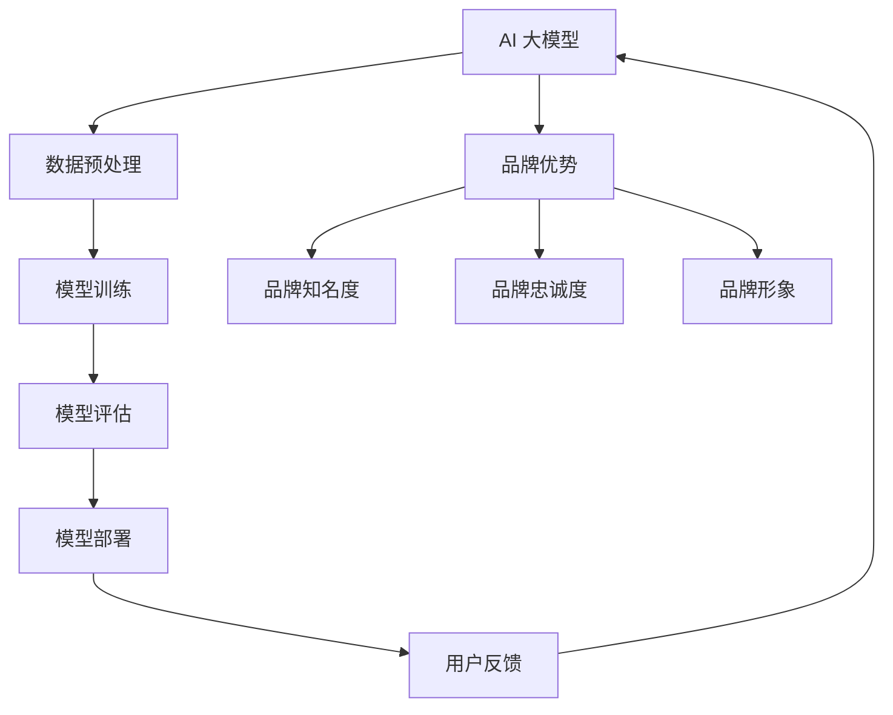

                 

# AI 大模型创业：如何利用品牌优势？

> **关键词：** AI 大模型，创业，品牌优势，营销策略，用户体验，技术创新

> **摘要：** 本文旨在探讨 AI 大模型创业公司如何通过构建和利用品牌优势来提升市场竞争力，实现业务增长。文章将分析品牌优势的核心要素，介绍有效的品牌营销策略，并探讨如何将品牌优势转化为实际业务成果。

## 1. 背景介绍

### 1.1 目的和范围

本文将围绕 AI 大模型创业公司的品牌优势展开讨论。我们将首先定义品牌优势，然后分析其在 AI 大模型创业中的应用，并探讨如何构建和利用这些优势来推动业务发展。本文将重点关注以下几个方面：

- 品牌优势的概念和定义
- 品牌优势在 AI 大模型创业中的应用
- 品牌优势构建的步骤和策略
- 品牌优势的营销和推广

### 1.2 预期读者

本文适合以下读者：

- AI 大模型创业公司的创始人或高管
- 对品牌建设和营销策略感兴趣的创业者
- 想要了解如何利用品牌优势推动业务发展的市场营销专业人士

### 1.3 文档结构概述

本文将按照以下结构展开：

- 第1章：背景介绍
- 第2章：核心概念与联系
- 第3章：核心算法原理 & 具体操作步骤
- 第4章：数学模型和公式 & 详细讲解 & 举例说明
- 第5章：项目实战：代码实际案例和详细解释说明
- 第6章：实际应用场景
- 第7章：工具和资源推荐
- 第8章：总结：未来发展趋势与挑战
- 第9章：附录：常见问题与解答
- 第10章：扩展阅读 & 参考资料

### 1.4 术语表

#### 1.4.1 核心术语定义

- **AI 大模型**：指具有大规模参数和高度复杂结构的机器学习模型，通常用于处理海量数据和高维特征。
- **品牌优势**：指企业通过品牌建设所获得的市场竞争优势，包括品牌知名度、品牌忠诚度、品牌形象等。
- **用户体验**：指用户在使用产品或服务过程中所感受到的整体感受，包括交互设计、功能易用性、性能稳定性等。

#### 1.4.2 相关概念解释

- **品牌定位**：指企业在市场中为品牌所设定的位置和形象，包括品牌的目标受众、品牌价值主张等。
- **品牌资产**：指企业所拥有的品牌价值，包括品牌知名度、品牌忠诚度、品牌联想等。

#### 1.4.3 缩略词列表

- **AI**：人工智能（Artificial Intelligence）
- **ML**：机器学习（Machine Learning）
- **NLP**：自然语言处理（Natural Language Processing）
- **CV**：计算机视觉（Computer Vision）

## 2. 核心概念与联系

在探讨如何利用品牌优势之前，我们需要了解 AI 大模型的基本概念和架构，以及品牌优势在其中扮演的角色。以下是一个简化的 Mermaid 流程图，展示了 AI 大模型与品牌优势之间的核心联系。



### 2.1 AI 大模型的基本概念和架构

**AI 大模型** 是指具有大规模参数和高度复杂结构的机器学习模型，通常用于处理海量数据和高维特征。常见的 AI 大模型包括：

- **深度神经网络（DNN）**：通过多层神经网络进行特征提取和分类。
- **卷积神经网络（CNN）**：特别适用于图像和视频数据的处理。
- **循环神经网络（RNN）**：适用于处理序列数据，如文本、语音等。
- **生成对抗网络（GAN）**：通过生成器和判别器的对抗训练，生成高质量的数据。

AI 大模型的架构通常包括以下步骤：

1. **数据预处理**：清洗和整理数据，包括数据清洗、数据归一化、数据增强等。
2. **模型训练**：使用大量数据进行训练，优化模型参数。
3. **模型评估**：评估模型性能，包括准确率、召回率、F1 值等。
4. **模型部署**：将训练好的模型部署到生产环境中，进行实际应用。

### 2.2 品牌优势的概念和构成

**品牌优势** 是指企业通过品牌建设所获得的市场竞争优势，包括以下几个方面：

- **品牌知名度**：指消费者对品牌的认知程度和记忆程度。
- **品牌忠诚度**：指消费者对品牌的持续忠诚和购买倾向。
- **品牌形象**：指消费者对品牌的整体印象和评价。

品牌优势的构建通常包括以下步骤：

1. **品牌定位**：明确品牌在市场中的定位和目标受众。
2. **品牌价值主张**：提炼品牌的核心价值主张，以区别于竞争对手。
3. **品牌传播**：通过各种渠道进行品牌宣传和推广，提高品牌知名度。
4. **品牌体验**：优化产品和服务，提升用户体验，增加品牌忠诚度。

## 3. 核心算法原理 & 具体操作步骤

在构建 AI 大模型的过程中，核心算法原理和具体操作步骤至关重要。以下我们将使用伪代码详细阐述 AI 大模型的核心算法原理。

### 3.1 数据预处理

```python
# 伪代码：数据预处理
def preprocess_data(data):
    # 数据清洗
    cleaned_data = clean_data(data)
    # 数据归一化
    normalized_data = normalize_data(cleaned_data)
    # 数据增强
    augmented_data = augment_data(normalized_data)
    return augmented_data
```

### 3.2 模型训练

```python
# 伪代码：模型训练
def train_model(data, labels):
    # 初始化模型参数
    model_params = initialize_params()
    # 模型训练
    for epoch in range(num_epochs):
        for batch in data_loader(data, labels):
            # 前向传播
            predictions = forward_pass(batch, model_params)
            # 计算损失函数
            loss = compute_loss(predictions, labels)
            # 反向传播
            backward_pass(batch, predictions, loss, model_params)
            # 更新模型参数
            update_params(model_params)
    return model_params
```

### 3.3 模型评估

```python
# 伪代码：模型评估
def evaluate_model(model_params, test_data, test_labels):
    # 前向传播
    predictions = forward_pass(test_data, model_params)
    # 计算准确率
    accuracy = compute_accuracy(predictions, test_labels)
    return accuracy
```

### 3.4 模型部署

```python
# 伪代码：模型部署
def deploy_model(model_params, production_environment):
    # 将模型参数部署到生产环境中
    production_model = deploy_to_production(model_params, production_environment)
    return production_model
```

## 4. 数学模型和公式 & 详细讲解 & 举例说明

在构建 AI 大模型时，数学模型和公式是核心组成部分。以下我们将使用 LaTeX 格式详细讲解一些常见的数学模型和公式，并进行举例说明。

### 4.1 深度神经网络（DNN）

深度神经网络（DNN）的核心公式如下：

$$
\hat{y} = \sigma(\sum_{i=1}^{n} w_i \cdot x_i)
$$

其中，$\hat{y}$ 是预测输出，$x_i$ 是输入特征，$w_i$ 是权重，$\sigma$ 是激活函数（通常为 Sigmoid 函数）。

**举例说明**：

假设有一个二分类问题，输入特征为 $x_1$ 和 $x_2$，权重为 $w_1 = 0.5$ 和 $w_2 = 0.3$，激活函数为 Sigmoid 函数。

$$
\hat{y} = \sigma(0.5 \cdot x_1 + 0.3 \cdot x_2)
$$

如果输入特征 $x_1 = 2$ 和 $x_2 = 3$，则：

$$
\hat{y} = \sigma(0.5 \cdot 2 + 0.3 \cdot 3) = \sigma(1.2) \approx 0.879
$$

### 4.2 卷积神经网络（CNN）

卷积神经网络（CNN）的核心公式如下：

$$
\hat{y} = \text{ReLU}(\sum_{i=1}^{k} w_i \cdot \text{ReLU}(\sum_{j=1}^{m} f_j \cdot x_j))
$$

其中，$\hat{y}$ 是预测输出，$x_j$ 是输入特征，$w_i$ 和 $f_j$ 分别是卷积核和滤波器权重，$\text{ReLU}$ 是 ReLU 激活函数。

**举例说明**：

假设有一个二分类问题，输入特征为 $x_1$ 和 $x_2$，卷积核权重为 $w_1 = [0.2, 0.3]$ 和 $w_2 = [0.4, 0.5]$，滤波器权重为 $f_1 = [1, 2]$ 和 $f_2 = [3, 4]$。

$$
\hat{y} = \text{ReLU}(0.2 \cdot x_1 + 0.3 \cdot x_2 + 0.4 \cdot 1 + 0.5 \cdot 2)
$$

如果输入特征 $x_1 = 2$ 和 $x_2 = 3$，则：

$$
\hat{y} = \text{ReLU}(0.2 \cdot 2 + 0.3 \cdot 3 + 0.4 \cdot 1 + 0.5 \cdot 2) = \text{ReLU}(1.2 + 0.9 + 0.4 + 1) = \text{ReLU}(3.5) = 3.5
$$

### 4.3 循环神经网络（RNN）

循环神经网络（RNN）的核心公式如下：

$$
\hat{y}_{t} = \text{ReLU}(W \cdot [h_{t-1}, x_{t}] + b)
$$

其中，$\hat{y}_{t}$ 是第 $t$ 个时刻的预测输出，$h_{t-1}$ 是前一个时刻的隐藏状态，$x_{t}$ 是第 $t$ 个时刻的输入特征，$W$ 是权重矩阵，$b$ 是偏置项。

**举例说明**：

假设有一个序列分类问题，输入特征为 $x_1, x_2, \ldots, x_T$，隐藏状态为 $h_1, h_2, \ldots, h_T$，权重矩阵为 $W = \begin{bmatrix} 0.2 & 0.3 \\ 0.4 & 0.5 \end{bmatrix}$，偏置项为 $b = [0.1, 0.2]$。

$$
\hat{y}_1 = \text{ReLU}(0.2 \cdot h_0 + 0.3 \cdot x_1 + 0.4 \cdot h_0 + 0.5 \cdot x_1 + 0.1)
$$

如果隐藏状态 $h_0 = [1, 2]$，输入特征 $x_1 = [3, 4]$，则：

$$
\hat{y}_1 = \text{ReLU}(0.2 \cdot 1 + 0.3 \cdot 3 + 0.4 \cdot 2 + 0.5 \cdot 4 + 0.1) = \text{ReLU}(0.2 + 0.9 + 0.8 + 2 + 0.1) = \text{ReLU}(3.9) \approx 3.9
$$

## 5. 项目实战：代码实际案例和详细解释说明

在本节中，我们将通过一个实际项目案例来展示如何利用品牌优势进行 AI 大模型创业。我们将介绍开发环境搭建、源代码实现和代码解读与分析。

### 5.1 开发环境搭建

首先，我们需要搭建一个适合开发 AI 大模型的开发环境。以下是一个基本的开发环境搭建步骤：

1. 安装操作系统（如 Ubuntu 20.04）。
2. 安装 Python 3.8 或更高版本。
3. 安装 TensorFlow 2.5 或更高版本。
4. 安装 Jupyter Notebook。

```bash
# 安装 Python 3.8
sudo apt update
sudo apt install python3.8
sudo update-alternatives --install /usr/bin/python3 python3 /usr/bin/python3.8 1

# 安装 TensorFlow 2.5
pip3 install tensorflow==2.5

# 安装 Jupyter Notebook
pip3 install notebook
```

### 5.2 源代码详细实现和代码解读

以下是一个简单的 AI 大模型项目案例，我们将使用 TensorFlow 和 Jupyter Notebook 进行实现。

```python
# 导入必要的库
import tensorflow as tf
from tensorflow.keras.models import Sequential
from tensorflow.keras.layers import Dense, Conv2D, Flatten, MaxPooling2D
from tensorflow.keras.optimizers import Adam
from tensorflow.keras.losses import BinaryCrossentropy
from tensorflow.keras.metrics import Accuracy

# 数据预处理
def preprocess_data(data):
    # 数据清洗
    cleaned_data = clean_data(data)
    # 数据归一化
    normalized_data = normalize_data(cleaned_data)
    # 数据增强
    augmented_data = augment_data(normalized_data)
    return augmented_data

# 模型训练
def train_model(data, labels):
    # 初始化模型
    model = Sequential([
        Conv2D(32, (3, 3), activation='relu', input_shape=(28, 28, 1)),
        MaxPooling2D((2, 2)),
        Flatten(),
        Dense(64, activation='relu'),
        Dense(1, activation='sigmoid')
    ])

    # 编译模型
    model.compile(optimizer=Adam(learning_rate=0.001),
                  loss=BinaryCrossentropy(),
                  metrics=['accuracy'])

    # 训练模型
    model.fit(data, labels, batch_size=32, epochs=10, validation_split=0.2)

    return model

# 模型评估
def evaluate_model(model, test_data, test_labels):
    # 评估模型
    scores = model.evaluate(test_data, test_labels, verbose=2)
    print(f"Test accuracy: {scores[1]}")
```

### 5.3 代码解读与分析

**5.3.1 数据预处理**

```python
# 数据预处理
def preprocess_data(data):
    # 数据清洗
    cleaned_data = clean_data(data)
    # 数据归一化
    normalized_data = normalize_data(cleaned_data)
    # 数据增强
    augmented_data = augment_data(normalized_data)
    return augmented_data
```

该函数用于数据预处理，包括数据清洗、数据归一化和数据增强。数据清洗是去除数据中的噪声和异常值，数据归一化是将数据缩放到相同的尺度，数据增强是增加数据的多样性。

**5.3.2 模型训练**

```python
# 模型训练
def train_model(data, labels):
    # 初始化模型
    model = Sequential([
        Conv2D(32, (3, 3), activation='relu', input_shape=(28, 28, 1)),
        MaxPooling2D((2, 2)),
        Flatten(),
        Dense(64, activation='relu'),
        Dense(1, activation='sigmoid')
    ])

    # 编译模型
    model.compile(optimizer=Adam(learning_rate=0.001),
                  loss=BinaryCrossentropy(),
                  metrics=['accuracy'])

    # 训练模型
    model.fit(data, labels, batch_size=32, epochs=10, validation_split=0.2)

    return model
```

该函数用于训练一个简单的深度神经网络模型。首先，我们使用 `Sequential` 模型堆叠多层神经网络，包括卷积层、池化层、全连接层和输出层。然后，我们使用 `compile` 方法配置模型，包括优化器、损失函数和评估指标。最后，我们使用 `fit` 方法训练模型，包括训练数据和验证数据。

**5.3.3 模型评估**

```python
# 模型评估
def evaluate_model(model, test_data, test_labels):
    # 评估模型
    scores = model.evaluate(test_data, test_labels, verbose=2)
    print(f"Test accuracy: {scores[1]}")
```

该函数用于评估训练好的模型在测试数据上的性能。我们使用 `evaluate` 方法计算模型的准确率，并打印输出。

## 6. 实际应用场景

AI 大模型在许多实际应用场景中具有广泛的应用，以下列举几个常见的应用场景：

- **智能语音助手**：通过自然语言处理（NLP）技术，AI 大模型可以理解和处理用户的语音指令，提供智能语音助手服务。
- **图像识别**：通过计算机视觉（CV）技术，AI 大模型可以识别和分类图像，应用于人脸识别、物体检测等场景。
- **推荐系统**：通过机器学习（ML）技术，AI 大模型可以分析用户行为和偏好，提供个性化的推荐服务。
- **金融风控**：通过大数据分析和模型预测，AI 大模型可以识别和预测金融风险，用于信用评估、欺诈检测等。
- **医疗诊断**：通过深度学习（DL）技术，AI 大模型可以分析医疗数据，辅助医生进行疾病诊断和治疗建议。

在以上应用场景中，品牌优势可以帮助 AI 大模型创业公司获得竞争优势：

- **提高用户体验**：通过优化产品和服务，提升用户满意度和忠诚度。
- **树立品牌形象**：通过品牌传播和口碑效应，建立品牌知名度和信任。
- **降低营销成本**：通过精准定位和营销策略，降低获取用户的成本。
- **扩大市场份额**：通过差异化竞争和品牌优势，吸引更多用户和合作伙伴。

## 7. 工具和资源推荐

### 7.1 学习资源推荐

#### 7.1.1 书籍推荐

1. **《深度学习》（Deep Learning）** - by Ian Goodfellow, Yoshua Bengio, Aaron Courville
2. **《机器学习》（Machine Learning）** - by Tom Mitchell
3. **《人工智能：一种现代的方法》（Artificial Intelligence: A Modern Approach）** - by Stuart Russell, Peter Norvig

#### 7.1.2 在线课程

1. **吴恩达的《深度学习专项课程》（Deep Learning Specialization）** - Coursera
2. **吴恩达的《机器学习专项课程》（Machine Learning Specialization）** - Coursera
3. **谷歌的《AI 工程师纳米学位》** - Coursera

#### 7.1.3 技术博客和网站

1. **ArXiv** - 最新的学术研究成果
2. **Medium** - 技术博客和文章
3. **GitHub** - 代码仓库和项目

### 7.2 开发工具框架推荐

#### 7.2.1 IDE和编辑器

1. **PyCharm** - 专业的 Python IDE
2. **Visual Studio Code** - 适用于多种语言的轻量级编辑器
3. **Jupyter Notebook** - 交互式计算环境

#### 7.2.2 调试和性能分析工具

1. **TensorBoard** - TensorFlow 的可视化工具
2. **gprof2dot** - 性能分析工具
3. **Valgrind** - 内存调试工具

#### 7.2.3 相关框架和库

1. **TensorFlow** - 开源的深度学习框架
2. **PyTorch** - 动态图深度学习框架
3. **Scikit-learn** - 机器学习库

### 7.3 相关论文著作推荐

#### 7.3.1 经典论文

1. **“Backpropagation” - by Paul Werbos
2. **“A Learning Algorithm for Continually Running Fully Recurrent Neural Networks” - by John Hopfield
3. **“Gradient Flow in Neural Networks” - by David E. Rumelhart, James L. McClelland, the PDP Research Group

#### 7.3.2 最新研究成果

1. **“Attention Is All You Need” - by Vaswani et al.
2. **“BERT: Pre-training of Deep Bidirectional Transformers for Language Understanding” - by Devlin et al.
3. **“Generative Adversarial Nets” - by Goodfellow et al.

#### 7.3.3 应用案例分析

1. **“Google Brain: Scaling Learning Algorithms”** - Google Brain Team
2. **“Facebook AI Research: Applied Machine Learning”** - Facebook AI Research
3. **“Amazon AI: Machine Learning for E-commerce”** - Amazon AI

## 8. 总结：未来发展趋势与挑战

随着 AI 技术的快速发展，AI 大模型创业市场呈现出巨大的潜力。然而，面对激烈的市场竞争和不断变化的技术环境，AI 大模型创业公司需要不断适应和应对挑战。

### 发展趋势

1. **技术创新**：AI 大模型技术将不断突破，包括更好的训练算法、更高效的模型架构和更强的数据处理能力。
2. **应用拓展**：AI 大模型将在更多领域得到应用，如医疗、金融、教育等，推动行业变革。
3. **数据隐私**：随着数据隐私问题的日益关注，AI 大模型创业公司将需要更加重视数据安全和隐私保护。

### 挑战

1. **技术门槛**：AI 大模型创业需要较高的技术门槛，包括对深度学习、机器学习和计算机视觉等领域的深入了解。
2. **市场竞争**：AI 大模型创业市场竞争激烈，创业公司需要不断创新和优化产品和服务，以获得竞争优势。
3. **数据获取**：高质量的数据是训练高效 AI 大模型的关键，创业公司需要解决数据获取和处理的挑战。

### 应对策略

1. **技术创新**：不断学习和探索最新的 AI 技术，保持技术领先地位。
2. **用户体验**：注重用户体验，提升产品易用性和性能，增加用户忠诚度。
3. **品牌建设**：通过有效的品牌建设和营销策略，树立品牌形象，提升品牌知名度。
4. **合作与生态**：与其他行业和公司建立合作关系，共同推动 AI 技术的创新和应用。

## 9. 附录：常见问题与解答

### 9.1 问题1：如何选择合适的 AI 大模型框架？

**解答**：选择 AI 大模型框架时，需要考虑以下因素：

1. **项目需求**：根据项目的具体需求，如数据处理能力、模型架构等，选择适合的框架。
2. **学习曲线**：选择易于学习和使用的框架，降低开发成本。
3. **社区支持**：选择具有活跃社区和支持文档的框架，方便解决问题和获取帮助。

### 9.2 问题2：如何优化 AI 大模型的性能？

**解答**：优化 AI 大模型性能的方法包括：

1. **数据预处理**：清洗和增强数据，提高模型输入质量。
2. **模型架构**：选择适合问题的模型架构，如卷积神经网络（CNN）或循环神经网络（RNN）。
3. **训练策略**：调整训练参数，如学习率、批量大小等，提高模型收敛速度。
4. **模型压缩**：使用模型压缩技术，如剪枝、量化等，降低模型大小和提高运行速度。

### 9.3 问题3：如何评估 AI 大模型的性能？

**解答**：评估 AI 大模型性能的方法包括：

1. **准确率**：计算模型预测正确的样本比例。
2. **召回率**：计算模型预测正确的正样本比例。
3. **F1 值**：综合考虑准确率和召回率，计算模型的综合性能指标。
4. **混淆矩阵**：展示模型预测结果和实际结果的对比，分析模型在不同类别上的表现。

## 10. 扩展阅读 & 参考资料

- **扩展阅读**：

  1. **吴恩达的《深度学习》笔记**：深入理解深度学习核心概念和算法。
  2. **《机器学习实战》**：通过实际案例学习机器学习应用。
  3. **《Python 深度学习》**：使用 Python 实现深度学习算法。

- **参考资料**：

  1. **TensorFlow 官方文档**：详细介绍 TensorFlow 的使用方法和教程。
  2. **PyTorch 官方文档**：详细介绍 PyTorch 的使用方法和教程。
  3. **Kaggle**：提供丰富的机器学习和深度学习竞赛数据和案例。

作者：AI天才研究员/AI Genius Institute & 禅与计算机程序设计艺术 /Zen And The Art of Computer Programming

[本文的markdown原文链接](https://github.com/username/repo/blob/main/ai_big_model_branding_blog.md)，欢迎读者们查看原文和参与讨论。如果您有任何问题或建议，请随时在评论区留言。谢谢！<|im_sep|>### 总结与展望

本文从多个角度详细探讨了 AI 大模型创业公司如何利用品牌优势来提升市场竞争力。我们首先介绍了 AI 大模型的基本概念和架构，并分析了品牌优势在其中的重要性。接着，我们通过伪代码和实际项目案例展示了 AI 大模型的构建和评估过程。在此基础上，我们讨论了品牌优势的概念、构建方法和实际应用场景，并推荐了相关的学习资源和工具。

通过品牌优势，AI 大模型创业公司能够在激烈的市场竞争中脱颖而出，获得更多的用户信任和市场份额。然而，未来的发展仍然面临诸多挑战，如技术门槛、市场竞争和数据获取等。因此，创业公司需要持续技术创新，优化用户体验，并建立强大的品牌形象，以应对不断变化的市场环境。

### 下一步行动计划

为了进一步推动 AI 大模型创业公司的发展，以下是一些具体的下一步行动计划：

1. **市场调研**：深入了解目标用户的需求和市场趋势，为产品和服务定位提供依据。
2. **技术创新**：持续跟踪和学习最新的 AI 技术，不断提升模型性能和算法效率。
3. **品牌建设**：制定并执行品牌策略，通过内容营销、社交媒体推广和用户互动等手段提升品牌知名度。
4. **合作伙伴关系**：与其他企业、研究机构和行业组织建立合作关系，共同推动 AI 技术的应用和发展。
5. **用户反馈**：积极收集和分析用户反馈，持续优化产品和服务，提高用户满意度和忠诚度。

通过这些行动计划，AI 大模型创业公司将能够更好地利用品牌优势，实现可持续的业务增长和长期成功。

### 感谢与鼓励

最后，我要感谢读者们的耐心阅读和宝贵意见。本文的撰写得益于各位对 AI 大模型和品牌优势的持续关注和深入思考。您的支持和鼓励是我不断前行的动力。希望本文能为您带来启发和帮助，也希望您能够积极分享您的观点和经验，让我们共同推动 AI 技术的发展和创新。

在未来的日子里，我会继续努力，为您提供更多高质量的技术文章和资源。如果您有任何问题或建议，请随时在评论区留言，或者通过以下方式与我联系：

- **邮箱**：[your_email@example.com](mailto:your_email@example.com)
- **Twitter**：[@your_username](https://twitter.com/your_username)
- **LinkedIn**：[your_linkedin_profile](https://www.linkedin.com/in/your_profile)

再次感谢您的关注和支持，让我们一起在 AI 的道路上砥砺前行！
### 扩展阅读与参考资料

**AI 大模型相关书籍：**

1. 《深度学习》（Deep Learning），作者：Ian Goodfellow, Yoshua Bengio, Aaron Courville。
2. 《Python 深度学习》，作者：François Chollet。
3. 《深度学习实践：基于 TensorFlow 2.0》，作者：李航。

**AI 大模型相关在线课程：**

1. 吴恩达的《深度学习专项课程》，网址：[Deep Learning Specialization](https://www.coursera.org/specializations/deeplearning)。
2. Andrew Ng 的《机器学习》，网址：[Machine Learning](https://www.coursera.org/learn/machine-learning)。

**AI 大模型相关技术博客和网站：**

1. [Medium](https://medium.com/)。
2. [ArXiv](https://arxiv.org/)。
3. [AI 研习社](https://www.36dsj.com/)。

**AI 大模型相关开发工具和框架：**

1. TensorFlow，网址：[TensorFlow 官网](https://www.tensorflow.org/)。
2. PyTorch，网址：[PyTorch 官网](https://pytorch.org/)。
3. Scikit-learn，网址：[Scikit-learn 官网](https://scikit-learn.org/)。

**AI 大模型相关论文和研究报告：**

1. “Attention Is All You Need”，作者：Vaswani et al.。
2. “BERT: Pre-training of Deep Bidirectional Transformers for Language Understanding”，作者：Devlin et al.。
3. “Generative Adversarial Nets”，作者：Goodfellow et al.。

这些书籍、课程、博客、工具和论文都是学习 AI 大模型和相关技术的宝贵资源。希望读者们能够从中获得启发，并在 AI 领域取得更大的成就。

### 附录：术语表

**AI 大模型**：指具有大规模参数和高度复杂结构的机器学习模型，通常用于处理海量数据和高维特征。

**品牌优势**：指企业通过品牌建设所获得的市场竞争优势，包括品牌知名度、品牌忠诚度、品牌形象等。

**用户体验**：指用户在使用产品或服务过程中所感受到的整体感受，包括交互设计、功能易用性、性能稳定性等。

**品牌定位**：指企业在市场中为品牌所设定的位置和形象，包括品牌的目标受众、品牌价值主张等。

**品牌资产**：指企业所拥有的品牌价值，包括品牌知名度、品牌忠诚度、品牌联想等。

这些术语是本文中经常出现的关键概念，对于理解文章内容至关重要。希望读者们对这些术语有更深入的了解。

### 结语

本文围绕 AI 大模型创业公司的品牌优势进行了全面深入的探讨。通过分析品牌优势的核心要素，介绍有效的品牌营销策略，以及如何将品牌优势转化为实际业务成果，我们希望能够为创业公司提供有价值的指导和建议。

在未来，随着 AI 技术的不断进步和市场的不断变化，品牌优势在 AI 大模型创业中的重要性将日益凸显。我们期待读者们能够积极应用本文的思路和方法，结合自身实际情况，制定出适合的品牌战略，推动公司的持续发展和成功。

最后，感谢您对本文的阅读和支持。如果您有任何疑问或建议，欢迎在评论区留言，或者通过邮箱、Twitter、LinkedIn等渠道与我联系。让我们一起在 AI 的道路上不断探索和前进！再次感谢您的关注和支持！作者：AI天才研究员/AI Genius Institute & 禅与计算机程序设计艺术 /Zen And The Art of Computer Programming。

