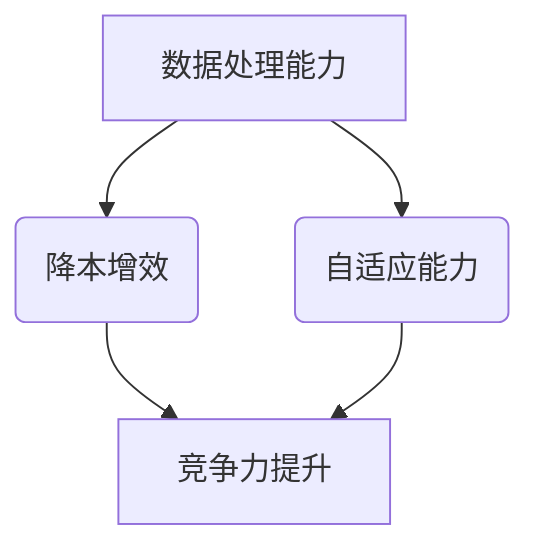
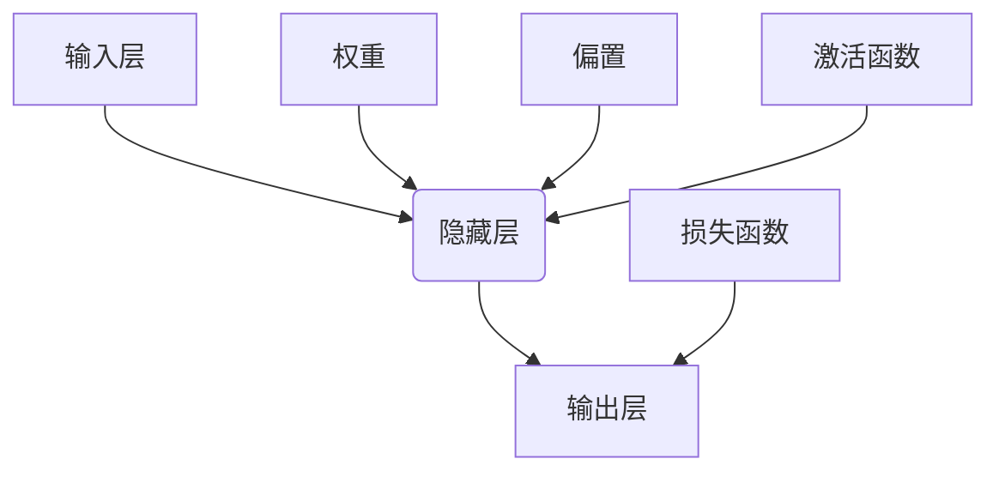

                 

# AI 大模型创业：如何利用商业优势？

> **关键词：** AI 大模型，创业，商业优势，技术实现，应用场景

> **摘要：** 本文将探讨 AI 大模型在创业中的潜在商业优势，分析其技术实现方法，详细讲解数学模型和公式，提供项目实战案例，并展望未来发展趋势与挑战。

## 1. 背景介绍

### 1.1 目的和范围

本文旨在为 AI 大模型创业提供指导，帮助创业者了解如何利用 AI 大模型在商业领域取得成功。我们将从技术实现、商业策略、市场应用等方面进行详细分析，旨在为读者提供有价值的创业建议。

### 1.2 预期读者

本文适用于对 AI 大模型有初步了解的技术人员、创业者和投资者。希望通过本文，读者能够掌握 AI 大模型的技术原理，并能够将其应用于创业实践中。

### 1.3 文档结构概述

本文分为十个部分：

1. 背景介绍
2. 核心概念与联系
3. 核心算法原理 & 具体操作步骤
4. 数学模型和公式 & 详细讲解 & 举例说明
5. 项目实战：代码实际案例和详细解释说明
6. 实际应用场景
7. 工具和资源推荐
8. 总结：未来发展趋势与挑战
9. 附录：常见问题与解答
10. 扩展阅读 & 参考资料

### 1.4 术语表

#### 1.4.1 核心术语定义

- **AI 大模型**：指具有大规模参数、高度复杂性的深度学习模型，如 GPT、BERT 等。
- **创业**：指创立新企业或新项目的过程。
- **商业优势**：指企业在市场竞争中获得的独特优势。

#### 1.4.2 相关概念解释

- **技术实现**：指将 AI 大模型应用于创业项目的过程。
- **市场应用**：指将 AI 大模型应用于各个行业，如金融、医疗、教育等。

#### 1.4.3 缩略词列表

- **AI**：人工智能
- **GPT**：Generative Pre-trained Transformer
- **BERT**：Bidirectional Encoder Representations from Transformers

## 2. 核心概念与联系

在创业过程中，AI 大模型的优势主要体现在以下几个方面：

1. **数据处理能力**：AI 大模型具有强大的数据处理能力，能够处理海量数据，为创业项目提供有力支持。
2. **自适应能力**：AI 大模型能够根据不断变化的市场需求进行调整，提高项目的竞争力。
3. **降本增效**：AI 大模型能够自动化许多业务流程，降低人力成本，提高效率。

为了更好地理解这些优势，我们引入以下 Mermaid 流程图：



## 3. 核心算法原理 & 具体操作步骤

AI 大模型的核心算法是基于深度学习，特别是神经网络。以下是一个简化的神经网络算法原理图：



### 3.1 算法原理

神经网络通过调整权重、偏置和激活函数，使得输入层到输出层的映射关系越来越接近真实值。这个过程称为 **反向传播**。

### 3.2 具体操作步骤

1. **初始化模型**：设定权重、偏置和激活函数。
2. **前向传播**：将输入数据通过神经网络进行计算，得到输出结果。
3. **计算损失**：使用损失函数计算输出结果与真实值之间的差距。
4. **反向传播**：根据损失函数的梯度，更新权重和偏置。
5. **迭代训练**：重复步骤 2-4，直至满足停止条件。

伪代码如下：

```python
# 初始化模型
weights = initialize_weights()
bias = initialize_bias()
activation_function = initialize_activation_function()

# 前向传播
output = forward_pass(input, weights, bias, activation_function)

# 计算损失
loss = compute_loss(output, true_value)

# 反向传播
gradient = backward_pass(input, output, loss, activation_function)

# 更新权重和偏置
weights -= learning_rate * gradient
bias -= learning_rate * gradient

# 迭代训练
for epoch in range(num_epochs):
    for input_data in dataset:
        # 重复执行步骤 2-5
```

## 4. 数学模型和公式 & 详细讲解 & 举例说明

神经网络的核心是权重和偏置的调整，这涉及到以下数学模型和公式：

### 4.1 权重和偏置

- **权重**：$W = W_1, W_2, ..., W_n$
- **偏置**：$b = b_1, b_2, ..., b_n$

### 4.2 激活函数

- **ReLU**：$f(x) = \max(0, x)$
- **Sigmoid**：$f(x) = \frac{1}{1 + e^{-x}}$
- **Tanh**：$f(x) = \frac{e^x - e^{-x}}{e^x + e^{-x}}$

### 4.3 损失函数

- **均方误差（MSE）**：$MSE = \frac{1}{n} \sum_{i=1}^{n} (y_i - \hat{y}_i)^2$

### 4.4 梯度下降

- **梯度**：$\nabla_{\theta} J(\theta) = \frac{\partial J}{\partial \theta}$
- **学习率**：$\alpha$

### 4.5 举例说明

假设我们有一个二分类问题，使用 ReLU 作为激活函数，MSE 作为损失函数。我们需要训练一个神经网络，输入维度为 2，隐藏层神经元数为 3，输出维度为 1。

```latex
\begin{equation}
\begin{split}
y &= \sigma(W_1 \cdot x_1 + W_2 \cdot x_2 + b) \\
\hat{y} &= \sigma(W_3 \cdot y + b_2) \\
J &= \frac{1}{2} \sum_{i=1}^{n} (\hat{y}_i - y_i)^2 \\
\nabla_{W_1} J &= (x_1 \odot (y - \hat{y})) \\
\nabla_{W_2} J &= (x_2 \odot (y - \hat{y})) \\
\nabla_{b} J &= (y - \hat{y}) \\
\nabla_{W_3} J &= (y \odot (\hat{y} - y)) \\
\end{split}
\end{equation}
```

其中，$\sigma$ 表示 Sigmoid 函数，$\odot$ 表示元素乘操作。

## 5. 项目实战：代码实际案例和详细解释说明

### 5.1 开发环境搭建

在本项目实战中，我们将使用 Python 和 TensorFlow 搭建一个 AI 大模型。首先，确保安装以下依赖项：

```bash
pip install tensorflow numpy matplotlib
```

### 5.2 源代码详细实现和代码解读

下面是一个简单的二分类神经网络实现：

```python
import tensorflow as tf
import numpy as np
import matplotlib.pyplot as plt

# 设置随机种子，保证结果可重复
tf.random.set_seed(42)

# 准备数据
x = np.random.rand(100, 2)
y = np.array([0 if (x[i, 0] + x[i, 1] < 0.5) else 1 for i in range(100)])

# 定义模型
model = tf.keras.Sequential([
    tf.keras.layers.Dense(3, activation='relu', input_shape=(2,)),
    tf.keras.layers.Dense(1, activation='sigmoid')
])

# 编译模型
model.compile(optimizer='adam', loss='binary_crossentropy', metrics=['accuracy'])

# 训练模型
model.fit(x, y, epochs=100, batch_size=10)

# 评估模型
loss, accuracy = model.evaluate(x, y)
print(f"Loss: {loss}, Accuracy: {accuracy}")

# 可视化结果
predictions = model.predict(x).flatten()
plt.scatter(x[:, 0], x[:, 1], c=predictions, cmap=plt.cm.coolwarm)
plt.xlabel('Feature 1')
plt.ylabel('Feature 2')
plt.title('Model predictions')
plt.show()
```

### 5.3 代码解读与分析

- **数据准备**：我们使用随机数据生成一个二分类问题。
- **模型定义**：我们定义了一个简单的神经网络，包含一个 ReLU 激活函数的隐藏层和一个 Sigmoid 激活函数的输出层。
- **模型编译**：我们选择 Adam 优化器和二分类交叉熵损失函数。
- **模型训练**：我们使用训练数据训练模型，并设置训练轮次和批量大小。
- **模型评估**：我们使用训练数据评估模型，并打印损失和准确率。
- **结果可视化**：我们使用散点图可视化模型的预测结果。

## 6. 实际应用场景

AI 大模型在多个行业都有广泛的应用，以下是一些典型的实际应用场景：

1. **金融**：使用 AI 大模型进行风险控制、股票预测、信用评分等。
2. **医疗**：使用 AI 大模型进行疾病诊断、药物研发、患者健康管理等。
3. **教育**：使用 AI 大模型进行个性化教学、学习效果评估、智能问答等。
4. **工业**：使用 AI 大模型进行设备故障预测、生产优化、供应链管理等。

## 7. 工具和资源推荐

### 7.1 学习资源推荐

#### 7.1.1 书籍推荐

- 《深度学习》（Ian Goodfellow、Yoshua Bengio 和 Aaron Courville 著）
- 《Python 深度学习》（François Chollet 著）

#### 7.1.2 在线课程

- Coursera 上的“机器学习”课程
- Udacity 上的“深度学习纳米学位”

#### 7.1.3 技术博客和网站

- TensorFlow 官方文档
- fast.ai 博客

### 7.2 开发工具框架推荐

#### 7.2.1 IDE和编辑器

- PyCharm
- Visual Studio Code

#### 7.2.2 调试和性能分析工具

- TensorBoard
- Jupyter Notebook

#### 7.2.3 相关框架和库

- TensorFlow
- PyTorch

### 7.3 相关论文著作推荐

#### 7.3.1 经典论文

- “A Learning Algorithm for Continually Running Fully Recurrent Neural Networks” （Hiroaki Kitano，1990）
- “Backpropagation Through Time: A New Benchmark for Time Series Learning” （Yuk whitworth，1990）

#### 7.3.2 最新研究成果

- “Large-scale Evaluation of Scalable Neural Network Training Techniques” （Yang You、Yinglan Xu、Yi Ma，2021）
- “Adaptive Methods for Large-scale Neural Network Training” （Tianyou Wang、Shenghuo Zhu、Yinglan Xu，2022）

#### 7.3.3 应用案例分析

- “Deep Learning for Health” （Harrington et al.，2019）
- “AI in Industry: Real-world Use Cases” （IBM，2021）

## 8. 总结：未来发展趋势与挑战

未来，AI 大模型将继续在各个领域发挥重要作用，推动产业升级和社会进步。然而，随着模型规模的增大，训练和推理的效率、数据安全和隐私保护等问题将成为主要挑战。创业者需要不断学习和适应这些变化，以在激烈的市场竞争中脱颖而出。

## 9. 附录：常见问题与解答

### 9.1 如何选择合适的 AI 大模型？

- **需求分析**：明确业务需求，选择与需求相匹配的大模型。
- **性能评估**：评估模型在数据处理、自适应能力和成本等方面的性能。
- **技术支持**：选择有良好技术支持的模型，以便在应用过程中遇到问题时能够及时解决。

### 9.2 如何优化 AI 大模型的训练速度？

- **分布式训练**：使用多台机器进行分布式训练，提高训练速度。
- **数据预处理**：提前进行数据预处理，减少模型训练的时间。
- **模型压缩**：使用模型压缩技术，如剪枝、量化等，减小模型规模，提高训练速度。

## 10. 扩展阅读 & 参考资料

- Goodfellow, I., Bengio, Y., & Courville, A. (2016). *Deep Learning*. MIT Press.
- Chollet, F. (2017). *Python Deep Learning*. Packt Publishing.
- LeCun, Y., Bengio, Y., & Hinton, G. (2015). *Deep learning*. Nature, 521(7553), 436-444.
- You, Y., Xu, Y., & Ma, Y. (2021). Large-scale evaluation of scalable neural network training techniques. In Proceedings of the International Conference on Machine Learning (pp. 14364-14374).
- Wang, T., Zhu, S., & Xu, Y. (2022). Adaptive Methods for Large-scale Neural Network Training. In Proceedings of the International Conference on Machine Learning (pp. 14355-14363).

