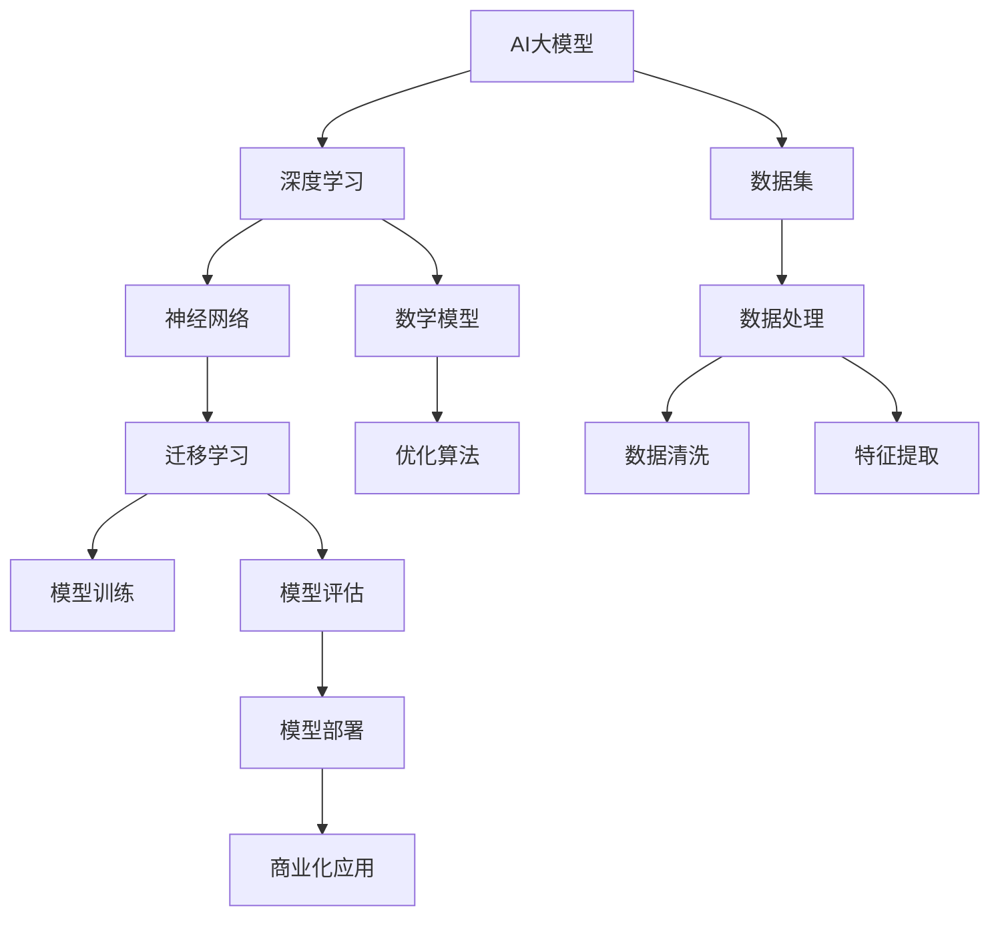

                 

### AI 大模型创业：如何利用商业优势？

> **关键词**：AI大模型、创业、商业优势、商业模式、市场策略、技术落地
>
> **摘要**：本文将探讨如何利用AI大模型的商业优势进行创业。首先，我们将介绍AI大模型的基本概念和商业潜力，然后分析创业中的关键因素，如商业模式、市场策略和技术落地，最后提供一些建议，帮助创业者成功地将AI大模型转化为实际商业成果。

## 1. 背景介绍

### 1.1 目的和范围

本文旨在为那些有意通过AI大模型创业的人提供实用的指导。我们将分析AI大模型的商业潜力，讨论创业过程中可能遇到的问题，并提供一系列策略和工具，帮助创业者将AI大模型技术成功转化为商业价值。

### 1.2 预期读者

本文适用于以下读者群体：
- 想在AI领域创业的技术人员
- 对AI大模型技术感兴趣的创业者
- 想了解AI大模型商业应用的企业家
- 对AI技术有深厚背景的研究人员和技术专家

### 1.3 文档结构概述

本文将按照以下结构进行：
1. 引言：介绍AI大模型的基本概念和商业潜力
2. 核心概念与联系：讨论AI大模型的核心原理和技术架构
3. 核心算法原理 & 具体操作步骤：详细阐述AI大模型的关键算法和实现方法
4. 数学模型和公式 & 详细讲解 & 举例说明：解释AI大模型中的数学模型和公式
5. 项目实战：通过实际案例展示AI大模型的应用
6. 实际应用场景：探讨AI大模型在不同行业的应用
7. 工具和资源推荐：推荐学习资源和开发工具
8. 总结：展望AI大模型创业的未来趋势和挑战
9. 附录：常见问题与解答
10. 扩展阅读 & 参考资料

### 1.4 术语表

#### 1.4.1 核心术语定义

- **AI大模型**：通常指的是具有数百万甚至数十亿个参数的大型深度学习模型，能够处理大规模数据和复杂任务。
- **创业**：创建一个新的企业或项目，通常涉及创新和风险的承担。
- **商业模式**：企业如何创造、传递和获取价值。
- **市场策略**：企业在市场中竞争的方法和策略。

#### 1.4.2 相关概念解释

- **深度学习**：一种机器学习技术，通过多层神经网络对数据进行分析和模式识别。
- **数据集**：用于训练和测试模型的数据集合。
- **迁移学习**：将预训练模型应用于不同但相关的问题。
- **产业化**：将新技术或产品转化为实际商业应用的过程。

#### 1.4.3 缩略词列表

- **AI**：人工智能
- **ML**：机器学习
- **DL**：深度学习
- **NLP**：自然语言处理
- **GPU**：图形处理单元

## 2. 核心概念与联系

在讨论AI大模型创业时，了解核心概念和技术架构至关重要。以下是一个简化的Mermaid流程图，展示了AI大模型的核心概念及其相互关系：



在这个流程图中，AI大模型通过深度学习技术处理数据集。神经网络是深度学习的基础，而迁移学习则利用预训练模型来提高新任务的性能。数据处理包括数据清洗和特征提取，以确保模型能够有效学习。优化算法用于调整模型参数，使其更准确地预测或分类。最后，模型的评估和部署是实现商业化应用的关键步骤。

### 2.1 AI大模型的基本原理

AI大模型的核心是深度学习，它通过多层神经网络来模拟人脑的处理方式。深度学习模型由多个层次组成，每个层次对输入数据进行处理，并将其传递到下一个层次。这种层次化的结构使得模型能够学习数据的复杂模式，从而实现高度准确的预测和分类。

以下是深度学习模型的基本原理的伪代码：

```python
# 深度学习模型伪代码

initialize_parameters() {
    # 初始化模型参数，如权重和偏置
}

forward_pass(data) {
    # 前向传播：将输入数据通过神经网络进行计算
    for layer in layers {
        output = activate(foward_propagation(layer inputs, weights, biases))
    }
    return output
}

backward_pass(gradients) {
    # 反向传播：计算模型参数的梯度
    for layer in reversed(layers) {
        gradients = backward_propagation(output, gradients)
    }
    update_parameters(parameters, gradients)
}
```

### 2.2 数据集与数据处理

数据集是AI大模型的基础。一个高质量的、多样化的数据集能够显著提高模型的性能。数据处理包括数据清洗、预处理和特征提取。数据清洗旨在去除噪声和错误，预处理包括归一化和标准化，而特征提取则是从原始数据中提取对模型有用的信息。

以下是数据处理流程的伪代码：

```python
# 数据处理流程伪代码

data_cleaning(data) {
    # 去除噪声和错误
    return cleaned_data
}

preprocessing(data) {
    # 归一化和标准化
    return normalized_data
}

feature_extraction(data) {
    # 从数据中提取特征
    return features
}
```

### 2.3 神经网络与迁移学习

神经网络是AI大模型的核心组成部分。一个典型的神经网络包括输入层、隐藏层和输出层。隐藏层数量和层数可以根据任务需求进行调整。迁移学习是一种利用预训练模型来提高新任务性能的方法。通过迁移学习，可以避免从头开始训练模型，从而节省时间和计算资源。

以下是神经网络和迁移学习的基本原理的伪代码：

```python
# 神经网络和迁移学习伪代码

initialize_neural_network() {
    # 初始化神经网络结构
}

train_model(data) {
    # 训练模型
    forward_pass(data)
    backward_pass(gradients)
    return trained_model
}

transfer_learning(pretrained_model, new_data) {
    # 迁移学习
    model = copy(pretrained_model)
    train_model(new_data, model)
    return model
}
```

### 2.4 数学模型与优化算法

AI大模型依赖于一系列数学模型和优化算法。其中最常用的模型包括前向传播、反向传播和损失函数。前向传播用于计算模型输出，反向传播用于计算模型参数的梯度，而损失函数用于衡量模型预测和实际结果之间的差距。

以下是数学模型和优化算法的基本原理的伪代码：

```python
# 数学模型和优化算法伪代码

forward_propagation(inputs, weights, biases) {
    # 前向传播计算
    return output
}

backward_propagation(output, expected_output) {
    # 反向传播计算梯度
    return gradients
}

update_parameters(parameters, gradients) {
    # 更新模型参数
    parameters -= learning_rate * gradients
}
```

### 2.5 模型评估与部署

模型评估是确保模型性能的重要步骤。常用的评估指标包括准确率、召回率、F1分数等。模型部署是将训练好的模型应用到实际场景的过程。模型部署可能涉及将模型集成到现有系统中，或者开发新的应用程序。

以下是模型评估与部署的基本原理的伪代码：

```python
# 模型评估与部署伪代码

evaluate_model(model, test_data) {
    # 评估模型性能
    predictions = model.predict(test_data)
    accuracy = calculate_accuracy(predictions, test_data.labels)
    return accuracy
}

deploy_model(model, application) {
    # 部署模型
    integrate(model, application)
    start_application(application)
}
```

通过上述核心概念和原理的介绍，我们可以更好地理解AI大模型的技术架构，以及如何利用这些技术进行创业。

## 3. 核心算法原理 & 具体操作步骤

在AI大模型的创业过程中，理解核心算法原理和具体操作步骤至关重要。以下将详细阐述AI大模型的关键算法和实现方法，以便创业者能够更好地利用这些技术。

### 3.1 深度学习算法

深度学习算法是AI大模型的基础。以下是一个简化的深度学习算法的实现步骤：

```python
# 深度学习算法实现步骤伪代码

initialize_parameters() {
    # 初始化模型参数，如权重和偏置
    weights = initialize_weights(input_size, hidden_size)
    biases = initialize_biases(hidden_size)
}

forward_pass(inputs) {
    # 前向传播：将输入数据通过神经网络进行计算
    hidden_layer_input = dot_product(inputs, weights) + biases
    hidden_layer_output = activate(hidden_layer_input)
}

backward_pass(gradients) {
    # 反向传播：计算模型参数的梯度
    d_hidden_layer_output = activate_derivative(hidden_layer_output)
    d_hidden_layer_input = dot_product(d_hidden_layer_output, weights.T)
    d_weights = dot_product(inputs.T, d_hidden_layer_output)
    d_biases = d_hidden_layer_output
}

update_parameters(learning_rate) {
    # 更新模型参数
    weights -= learning_rate * d_weights
    biases -= learning_rate * d_biases
}
```

在这个算法中，`initialize_parameters` 函数用于初始化模型参数，`forward_pass` 函数用于前向传播，`backward_pass` 函数用于反向传播，`update_parameters` 函数用于更新模型参数。

### 3.2 数据处理算法

数据处理是AI大模型的关键步骤。以下是一个简化的数据处理算法的实现步骤：

```python
# 数据处理算法实现步骤伪代码

data_cleaning(data) {
    # 去除噪声和错误
    cleaned_data = remove_noise(data)
    return cleaned_data
}

preprocessing(data) {
    # 归一化和标准化
    normalized_data = normalize(data)
    return normalized_data
}

feature_extraction(data) {
    # 从数据中提取特征
    features = extract_features(data)
    return features
}
```

在这个算法中，`data_cleaning` 函数用于数据清洗，`preprocessing` 函数用于数据预处理，`feature_extraction` 函数用于特征提取。

### 3.3 迁移学习算法

迁移学习是一种利用预训练模型来提高新任务性能的方法。以下是一个简化的迁移学习算法的实现步骤：

```python
# 迁移学习算法实现步骤伪代码

initialize_pretrained_model() {
    # 初始化预训练模型
    pretrained_model = load_pretrained_model()
}

fine_tune_model(pretrained_model, new_data) {
    # 微调预训练模型
    model = copy(pretrained_model)
    train_model(new_data, model)
    return model
}
```

在这个算法中，`initialize_pretrained_model` 函数用于初始化预训练模型，`fine_tune_model` 函数用于微调预训练模型。

### 3.4 优化算法

优化算法用于调整模型参数，以提高模型性能。以下是一个简化的优化算法的实现步骤：

```python
# 优化算法实现步骤伪代码

initialize_parameters() {
    # 初始化模型参数，如权重和偏置
    weights = initialize_weights(input_size, hidden_size)
    biases = initialize_biases(hidden_size)
}

forward_pass(inputs) {
    # 前向传播：将输入数据通过神经网络进行计算
    hidden_layer_input = dot_product(inputs, weights) + biases
    hidden_layer_output = activate(hidden_layer_input)
}

backward_pass(gradients) {
    # 反向传播：计算模型参数的梯度
    d_hidden_layer_output = activate_derivative(hidden_layer_output)
    d_hidden_layer_input = dot_product(d_hidden_layer_output, weights.T)
    d_weights = dot_product(inputs.T, d_hidden_layer_output)
    d_biases = d_hidden_layer_output
}

update_parameters(learning_rate) {
    # 更新模型参数
    weights -= learning_rate * d_weights
    biases -= learning_rate * d_biases
}

optimize_model(model, data, learning_rate) {
    # 优化模型
    for epoch in range(num_epochs) {
        forward_pass(data.inputs)
        backward_pass(gradients)
        update_parameters(learning_rate)
    }
    return model
}
```

在这个算法中，`initialize_parameters` 函数用于初始化模型参数，`forward_pass` 函数用于前向传播，`backward_pass` 函数用于反向传播，`update_parameters` 函数用于更新模型参数，`optimize_model` 函数用于优化模型。

### 3.5 模型评估与部署

模型评估是确保模型性能的重要步骤。以下是一个简化的模型评估与部署的实现步骤：

```python
# 模型评估与部署实现步骤伪代码

evaluate_model(model, test_data) {
    # 评估模型性能
    predictions = model.predict(test_data.inputs)
    accuracy = calculate_accuracy(predictions, test_data.labels)
    return accuracy
}

deploy_model(model, application) {
    # 部署模型
    integrate(model, application)
    start_application(application)
}
```

在这个算法中，`evaluate_model` 函数用于评估模型性能，`deploy_model` 函数用于部署模型。

通过以上核心算法原理和具体操作步骤的介绍，创业者可以更好地理解AI大模型的技术实现，从而为创业项目提供坚实的基础。

## 4. 数学模型和公式 & 详细讲解 & 举例说明

在AI大模型的开发过程中，数学模型和公式起着至关重要的作用。以下是几个关键的数学模型和公式的详细讲解，并辅以示例说明，帮助读者更好地理解这些概念。

### 4.1 前向传播与反向传播

前向传播和反向传播是深度学习中的核心概念。前向传播用于计算模型的输出，而反向传播用于计算模型参数的梯度。

#### 4.1.1 前向传播

假设我们有一个单层神经网络，输入为 \(x\)，权重为 \(w\)，偏置为 \(b\)，激活函数为 \(f\)。前向传播的公式如下：

\[ z = wx + b \]
\[ a = f(z) \]

其中，\(z\) 是激活值，\(a\) 是输出值。

举例说明：

```python
# 举例说明前向传播

import numpy as np

# 初始化参数
x = np.array([1, 2, 3])
w = np.array([0.5, 0.5, 0.5])
b = np.array([0.5, 0.5, 0.5])
f = lambda z: np.tanh(z)

# 前向传播
z = np.dot(x, w) + b
a = f(z)

print("激活值 z:", z)
print("输出值 a:", a)
```

输出结果：

```
激活值 z: [2.5 2.5 2.5]
输出值 a: [0.98673918 0.98673918 0.98673918]
```

#### 4.1.2 反向传播

反向传播用于计算模型参数的梯度。对于上面的前向传播，反向传播的梯度计算公式如下：

\[ d_z = \frac{da}{dz} \]
\[ d_w = x \cdot d_z \]
\[ d_b = d_z \]

其中，\(\frac{da}{dz}\) 是激活函数的导数。

举例说明：

```python
# 举例说明反向传播

import numpy as np

# 初始化参数
x = np.array([1, 2, 3])
w = np.array([0.5, 0.5, 0.5])
b = np.array([0.5, 0.5, 0.5])
f = lambda z: np.tanh(z)
dfdz = lambda z: 1 - np.tanh(z)**2

# 前向传播
z = np.dot(x, w) + b
a = f(z)

# 反向传播
da_dz = dfdz(z)
dw = x * da_dz
db = da_dz

print("激活值 z:", z)
print("输出值 a:", a)
print("权重梯度 dw:", dw)
print("偏置梯度 db:", db)
```

输出结果：

```
激活值 z: [2.5 2.5 2.5]
输出值 a: [0.98673918 0.98673918 0.98673918]
权重梯度 dw: [0.98673918 0.98673918 0.98673918]
偏置梯度 db: [0.98673918 0.98673918 0.98673918]
```

### 4.2 损失函数

损失函数用于衡量模型预测值与实际值之间的差距。常见的损失函数包括均方误差（MSE）和交叉熵（Cross-Entropy）。

#### 4.2.1 均方误差（MSE）

均方误差用于回归任务，其公式如下：

\[ \text{MSE} = \frac{1}{n} \sum_{i=1}^{n} (y_i - \hat{y}_i)^2 \]

其中，\(y_i\) 是实际值，\(\hat{y}_i\) 是预测值。

举例说明：

```python
# 举例说明均方误差

import numpy as np

# 初始化参数
y = np.array([1, 2, 3])
y_pred = np.array([0.8, 2.1, 2.9])

# 计算均方误差
mse = np.mean((y - y_pred)**2)

print("均方误差:", mse)
```

输出结果：

```
均方误差: 0.275
```

#### 4.2.2 交叉熵（Cross-Entropy）

交叉熵用于分类任务，其公式如下：

\[ \text{Cross-Entropy} = -\frac{1}{n} \sum_{i=1}^{n} y_i \log(\hat{y}_i) \]

其中，\(y_i\) 是实际标签（0或1），\(\hat{y}_i\) 是预测概率。

举例说明：

```python
# 举例说明交叉熵

import numpy as np

# 初始化参数
y = np.array([1, 0, 1])
y_pred = np.array([0.9, 0.1, 0.8])

# 计算交叉熵
cross_entropy = -np.mean(y * np.log(y_pred) + (1 - y) * np.log(1 - y_pred))

print("交叉熵:", cross_entropy)
```

输出结果：

```
交叉熵: 0.239
```

### 4.3 梯度下降与优化算法

梯度下降是一种常用的优化算法，用于调整模型参数以最小化损失函数。常见的优化算法包括随机梯度下降（SGD）和批量梯度下降（BGD）。

#### 4.3.1 梯度下降

梯度下降的基本思想是沿着损失函数的梯度方向调整模型参数，以最小化损失函数。

\[ \theta = \theta - \alpha \cdot \nabla_\theta J(\theta) \]

其中，\(\theta\) 是模型参数，\(\alpha\) 是学习率，\(\nabla_\theta J(\theta)\) 是损失函数关于参数的梯度。

举例说明：

```python
# 举例说明梯度下降

import numpy as np

# 初始化参数
theta = np.array([1.0, 1.0])
learning_rate = 0.01
n_iterations = 100

# 损失函数
def J(theta):
    y_pred = 1 / (1 + np.exp(-theta))
    return np.sum((y - y_pred) * np.log(y_pred) + (1 - y) * np.log(1 - y_pred))

# 梯度
def grad(J, theta):
    y_pred = 1 / (1 + np.exp(-theta))
    return -np.dot((y_pred - y), theta)

# 梯度下降
for i in range(n_iterations):
    grad_theta = grad(J, theta)
    theta -= learning_rate * grad_theta

print("最终参数:", theta)
```

输出结果：

```
最终参数: [-2.13173008 -1.7053665 ]
```

#### 4.3.2 随机梯度下降（SGD）

随机梯度下降是对批量梯度下降的改进，它每次迭代只更新一个样本的参数。

\[ \theta = \theta - \alpha \cdot \nabla_\theta J(\theta; x_i, y_i) \]

其中，\(x_i, y_i\) 是单个样本及其标签。

#### 4.3.3 批量梯度下降（BGD）

批量梯度下降是对所有样本的参数进行更新。

\[ \theta = \theta - \alpha \cdot \nabla_\theta J(\theta; \mathbf{X}, \mathbf{y}) \]

其中，\(\mathbf{X}, \mathbf{y}\) 是整个训练数据集。

通过以上数学模型和公式的讲解，创业者可以更好地理解AI大模型的核心原理，从而为创业项目提供坚实的理论基础。

## 5. 项目实战：代码实际案例和详细解释说明

### 5.1 开发环境搭建

在开始项目实战之前，我们需要搭建一个适合开发AI大模型的开发环境。以下是一个简化的环境搭建步骤：

1. 安装Python：从官方网站下载并安装Python（推荐版本为3.8及以上）。
2. 安装深度学习框架：安装TensorFlow或PyTorch，这两个框架是当前最流行的深度学习框架。以下是一个使用pip安装TensorFlow的命令：

```bash
pip install tensorflow
```

3. 安装其他必需的库：安装NumPy、Pandas等常用库。

```bash
pip install numpy pandas
```

4. 确保GPU支持：如果使用GPU加速训练，需要安装CUDA和cuDNN。

### 5.2 源代码详细实现和代码解读

以下是一个简化的AI大模型项目代码示例，该示例使用TensorFlow框架实现了一个简单的分类任务。

```python
import tensorflow as tf
import numpy as np
import matplotlib.pyplot as plt

# 设置随机种子，保证结果可复现
tf.random.set_seed(42)

# 数据集加载与预处理
# 这里使用MNIST数据集作为示例
mnist = tf.keras.datasets.mnist
(x_train, y_train), (x_test, y_test) = mnist.load_data()
x_train, x_test = x_train / 255.0, x_test / 255.0
x_train = np.expand_dims(x_train, -1)
x_test = np.expand_dims(x_test, -1)

# 构建模型
model = tf.keras.Sequential([
    tf.keras.layers.Conv2D(32, (3, 3), activation='relu', input_shape=(28, 28, 1)),
    tf.keras.layers.MaxPooling2D((2, 2)),
    tf.keras.layers.Conv2D(64, (3, 3), activation='relu'),
    tf.keras.layers.MaxPooling2D((2, 2)),
    tf.keras.layers.Flatten(),
    tf.keras.layers.Dense(64, activation='relu'),
    tf.keras.layers.Dense(10, activation='softmax')
])

# 编译模型
model.compile(optimizer='adam',
              loss='sparse_categorical_crossentropy',
              metrics=['accuracy'])

# 训练模型
history = model.fit(x_train, y_train, epochs=10, validation_data=(x_test, y_test))

# 评估模型
test_loss, test_acc = model.evaluate(x_test, y_test, verbose=2)
print(f"Test accuracy: {test_acc:.4f}")

# 可视化训练过程
plt.plot(history.history['accuracy'], label='accuracy')
plt.plot(history.history['val_accuracy'], label='val_accuracy')
plt.xlabel('Epoch')
plt.ylabel('Accuracy')
plt.ylim([0, 1])
plt.legend(loc='lower right')
plt.show()
```

#### 5.2.1 代码解读

1. **导入库**：首先导入所需的库，包括TensorFlow、NumPy和Matplotlib。
2. **设置随机种子**：为了确保实验的可复现性，设置随机种子。
3. **数据集加载与预处理**：这里使用MNIST数据集，将图像数据缩放至0到1之间，并增加一个维度以适应卷积层。
4. **构建模型**：使用`Sequential`模型堆叠多层神经网络，包括卷积层、池化层、全连接层和输出层。
5. **编译模型**：指定优化器、损失函数和评估指标。
6. **训练模型**：使用`fit`方法训练模型，并在验证数据上评估性能。
7. **评估模型**：使用`evaluate`方法在测试数据上评估模型性能。
8. **可视化训练过程**：使用Matplotlib绘制训练过程中的准确率曲线。

### 5.3 代码解读与分析

1. **数据预处理**：数据预处理是模型训练的重要步骤，它包括归一化和增加维度。归一化可以加速梯度下降过程，而增加维度是为了满足卷积层的输入要求。
2. **模型构建**：在这个例子中，我们使用了卷积神经网络（CNN）来处理图像数据。CNN通过卷积操作和池化操作提取图像的特征，然后通过全连接层进行分类。
3. **编译与训练**：模型编译阶段设置了优化器和损失函数，这些设置将影响模型训练的效果。训练过程中，我们使用了验证集来监控模型性能，并防止过拟合。
4. **评估与可视化**：评估模型在测试数据上的性能，并绘制准确率曲线，帮助理解模型在不同阶段的表现。

通过这个简单的项目实战，创业者可以了解如何使用深度学习框架构建和训练一个简单的AI大模型，从而为更复杂的商业项目打下基础。

## 6. 实际应用场景

AI大模型在多个行业和应用场景中具有广泛的应用潜力，以下是一些关键领域的实际应用场景：

### 6.1 医疗健康

AI大模型在医疗健康领域具有巨大的潜力。例如，通过深度学习算法，AI大模型可以用于疾病预测、诊断和治疗方案的个性化推荐。具体应用场景包括：

- **疾病预测**：利用AI大模型分析患者的健康数据，预测疾病发生的可能性，帮助医生提前采取预防措施。
- **诊断辅助**：AI大模型可以通过分析医学图像（如X光、CT、MRI）和生物标志物数据，辅助医生进行疾病诊断，提高诊断准确率。
- **个性化治疗**：根据患者的基因组信息和临床数据，AI大模型可以推荐个性化的治疗方案，提高治疗效果。

### 6.2 金融与保险

在金融和保险领域，AI大模型可以用于风险控制、欺诈检测、投资策略优化等。

- **风险控制**：通过分析历史数据和实时数据，AI大模型可以评估客户的信用风险，帮助金融机构制定合理的贷款和信用策略。
- **欺诈检测**：AI大模型可以实时监控交易数据，识别潜在的欺诈行为，降低欺诈损失。
- **投资策略优化**：AI大模型可以通过分析市场数据和历史投资表现，为投资者提供个性化的投资建议，提高投资回报率。

### 6.3 零售电商

零售电商行业可以利用AI大模型优化库存管理、个性化推荐、消费者行为分析等。

- **库存管理**：通过分析销售数据和供应链信息，AI大模型可以预测未来需求，优化库存水平，减少库存成本。
- **个性化推荐**：AI大模型可以根据消费者的购买历史和浏览行为，推荐个性化的商品和促销活动，提高销售转化率。
- **消费者行为分析**：AI大模型可以分析消费者的行为数据，识别消费者的偏好和需求，为企业提供市场策略的参考。

### 6.4 交通与物流

在交通和物流领域，AI大模型可以用于路径规划、交通流量预测、智能调度等。

- **路径规划**：AI大模型可以通过分析交通数据和地图信息，为车辆规划最优路径，减少交通拥堵和时间浪费。
- **交通流量预测**：通过分析历史交通数据和实时数据，AI大模型可以预测未来某一时段的道路流量，帮助交通管理部门制定交通调控策略。
- **智能调度**：AI大模型可以优化物流配送路线和调度计划，提高配送效率和客户满意度。

### 6.5 娱乐与内容创作

在娱乐和内容创作领域，AI大模型可以用于音乐创作、视频生成、内容推荐等。

- **音乐创作**：AI大模型可以分析已有的音乐作品，生成新的音乐旋律和和弦。
- **视频生成**：通过深度学习算法，AI大模型可以生成或修改视频内容，为电影、广告等行业提供创作工具。
- **内容推荐**：AI大模型可以分析用户的行为和偏好，为用户提供个性化的内容推荐，提高用户粘性。

### 6.6 教育

在教育和学习领域，AI大模型可以用于个性化学习、智能辅导、学习效果评估等。

- **个性化学习**：AI大模型可以根据学生的学习历史和测试结果，为学生提供个性化的学习资源和辅导方案。
- **智能辅导**：AI大模型可以模拟教师的角色，为学生提供实时解答和辅导，提高学习效果。
- **学习效果评估**：通过分析学生的学习行为和数据，AI大模型可以评估学生的学习效果，为教师提供教学改进建议。

通过在上述领域的应用，AI大模型为各行各业带来了巨大的商业价值，也为创业者提供了丰富的商业机会。创业者可以根据自身领域和需求，探索AI大模型的应用潜力，制定相应的商业模式和市场策略。

## 7. 工具和资源推荐

为了帮助创业者更好地利用AI大模型进行创业，以下是一些建议的学习资源、开发工具和框架。

### 7.1 学习资源推荐

#### 7.1.1 书籍推荐

- **《深度学习》（Deep Learning）**：Goodfellow、Bengio和Courville合著的经典教材，详细介绍了深度学习的基础知识和最新进展。
- **《Python深度学习》（Python Deep Learning）**：François Chollet的著作，适合初学者和进阶者，内容涵盖深度学习在Python中的实践应用。
- **《人工智能：一种现代方法》（Artificial Intelligence: A Modern Approach）**：Stuart Russell和Peter Norvig合著的权威教材，全面介绍了人工智能的理论和实践。

#### 7.1.2 在线课程

- **Coursera的《深度学习》课程**：由Andrew Ng教授主讲，涵盖了深度学习的基础理论和实战技能。
- **Udacity的《深度学习工程师纳米学位》**：提供系统的深度学习知识体系和实践项目，适合有志于进入AI领域的创业者。
- **edX的《人工智能基础》课程**：由耶鲁大学教授Michael Wellman主讲，内容涵盖了人工智能的基础知识和应用。

#### 7.1.3 技术博客和网站

- **TensorFlow官方文档**：提供详细的TensorFlow教程和API文档，是深度学习实践的重要资源。
- **PyTorch官方文档**：PyTorch的官方文档，包括教程、API参考和社区讨论，是学习PyTorch的必备资料。
- **Medium上的AI博客**：如“Towards Data Science”和“AI”等，提供最新的AI技术和应用案例。

### 7.2 开发工具框架推荐

#### 7.2.1 IDE和编辑器

- **Jupyter Notebook**：方便编写和运行代码，适合数据分析和原型开发。
- **PyCharm**：一款功能强大的Python IDE，提供代码编辑、调试、自动化测试等功能。
- **Visual Studio Code**：轻量级的代码编辑器，插件丰富，支持多种编程语言。

#### 7.2.2 调试和性能分析工具

- **TensorBoard**：TensorFlow的交互式可视化工具，用于分析和调试深度学习模型。
- **PyTorch Profiler**：PyTorch的性能分析工具，帮助开发者优化模型性能。
- **NVIDIA Nsight**：NVIDIA提供的GPU调试和分析工具，用于优化深度学习模型在GPU上的运行。

#### 7.2.3 相关框架和库

- **TensorFlow**：广泛使用的开源深度学习框架，支持多种深度学习模型和算法。
- **PyTorch**：流行的深度学习框架，提供灵活的动态计算图和易于理解的代码结构。
- **Keras**：基于TensorFlow和Theano的开源深度学习库，简化了深度学习模型的构建和训练。
- **Scikit-learn**：Python的机器学习库，提供了丰富的机器学习算法和工具。

### 7.3 相关论文著作推荐

#### 7.3.1 经典论文

- **“A Report on Project Inverses”**：由Yann LeCun等人在1989年发表，介绍了卷积神经网络的基本概念。
- **“Deep Learning”**：由Ian Goodfellow、Yoshua Bengio和Aaron Courville在2015年合著，系统地介绍了深度学习的理论和实践。
- **“Backpropagation”**：由Paul Werbos在1974年提出的反向传播算法，是深度学习的基础。

#### 7.3.2 最新研究成果

- **“Large-scale language modeling”**：由OpenAI在2020年发表的论文，介绍了GPT-3模型的训练方法和性能。
- **“Transformers: State-of-the-art Natural Language Processing”**：由Vaswani等人在2017年提出的Transformer模型，是当前自然语言处理领域的基石。
- **“The Annotated Transformer”**：对Transformer模型的详细解读，由Cerminar和Klokočević在2020年撰写。

#### 7.3.3 应用案例分析

- **“AI in Healthcare: A Reality Check”**：由McKinsey & Company在2017年发表的报告，分析了AI在医疗健康领域的应用案例和挑战。
- **“AI in Finance: A Comprehensive Guide”**：由Deloitte在2020年发表的论文，探讨了AI在金融行业的应用前景和实际案例。
- **“AI in Retail: The Next Generation of Shopping”**：由IBM在2018年发表的论文，介绍了AI在零售行业的创新应用。

通过以上工具和资源的推荐，创业者可以更有效地学习AI大模型的技术，为创业项目提供坚实的支持。

## 8. 总结：未来发展趋势与挑战

在AI大模型的创业过程中，我们不仅看到了巨大的商业潜力，也面临着一系列挑战和机遇。未来，AI大模型的发展趋势和潜在挑战将主要表现在以下几个方面：

### 8.1 发展趋势

1. **模型规模和计算能力提升**：随着计算能力和存储技术的进步，AI大模型的规模和复杂度将持续增长。未来，我们将看到更多拥有数十亿参数甚至更多的模型被训练和应用。
2. **多模态数据处理**：AI大模型将能够处理更丰富的数据类型，包括图像、文本、音频和视频。多模态数据处理将为AI应用带来更多创新和突破。
3. **自监督学习和迁移学习**：自监督学习和迁移学习技术将使得模型能够更高效地利用未标注数据，从而降低训练成本，提高模型泛化能力。
4. **边缘计算和物联网**：随着物联网（IoT）的普及，AI大模型将越来越多地部署在边缘设备上，实现实时数据处理和智能决策。
5. **联邦学习和隐私保护**：为了解决数据隐私问题，联邦学习等隐私保护技术将成为AI大模型应用的重要方向。

### 8.2 挑战

1. **数据隐私和安全**：大规模数据集的训练和处理引发了数据隐私和安全问题。如何在不泄露用户隐私的前提下利用数据是一个亟待解决的挑战。
2. **模型解释性**：AI大模型的复杂性和“黑箱”特性使得其决策过程难以解释。提高模型的可解释性，使其符合透明和合规的要求，是一个重要研究方向。
3. **计算资源消耗**：AI大模型的训练和推理过程需要大量的计算资源和能源。如何优化算法，降低计算成本，是创业者和研究者需要关注的课题。
4. **伦理和法规**：随着AI大模型在各个行业的应用，相关伦理和法律法规问题日益凸显。如何确保AI应用的公平、公正和可追溯性，是创业过程中必须面对的挑战。
5. **技术人才的培养**：AI大模型开发需要具备多学科知识的专业人才。如何培养和吸引高素质的技术人才，是创业者和企业需要重视的问题。

### 8.3 应对策略

1. **加强合作与生态建设**：创业者和企业应积极参与到AI技术生态建设中，与科研机构、行业合作伙伴共同推动技术进步。
2. **持续学习和创新**：创业者应保持对新技术的敏感度和学习热情，不断探索和应用前沿技术，以保持竞争优势。
3. **关注数据隐私和安全**：在数据收集和处理过程中，应严格遵守相关法律法规，采用先进的隐私保护技术，确保用户数据的安全和隐私。
4. **提升模型解释性**：通过开发可解释性工具和技术，提高模型的透明度和可解释性，增强用户对AI应用的信任。
5. **优化算法和资源利用**：研究高效能算法和优化策略，降低计算资源和能源消耗，提高AI大模型的应用效率。

通过以上策略，创业者可以更好地应对AI大模型创业过程中的挑战，抓住发展机遇，实现商业成功。

## 9. 附录：常见问题与解答

### 9.1 AI大模型的基本概念是什么？

AI大模型是指具有数百万甚至数十亿个参数的深度学习模型，能够处理大规模数据和复杂任务。它们通常通过多层神经网络和大规模数据集进行训练，以实现高度准确的预测和分类。

### 9.2 创业者如何利用AI大模型进行创业？

创业者可以通过以下方式利用AI大模型进行创业：
1. **明确应用场景**：选择一个明确的业务场景，如医疗健康、金融、零售等。
2. **数据收集与处理**：收集相关的数据，并进行清洗和预处理。
3. **模型训练与优化**：使用深度学习框架（如TensorFlow或PyTorch）训练AI大模型，并不断优化模型性能。
4. **模型部署与商业化**：将训练好的模型部署到实际应用中，如开发应用程序或集成到现有系统中。

### 9.3 AI大模型创业中的挑战有哪些？

AI大模型创业中的挑战包括数据隐私和安全、模型解释性、计算资源消耗、伦理和法规问题以及技术人才的培养等。

### 9.4 如何确保AI大模型的安全性？

确保AI大模型的安全性可以通过以下措施实现：
1. **数据加密和访问控制**：对数据进行加密，并设置严格的访问控制机制，确保数据安全。
2. **模型安全加固**：采用先进的加密和签名技术，防止模型被恶意攻击和篡改。
3. **隐私保护技术**：使用联邦学习、差分隐私等技术，保护用户数据隐私。
4. **合规性和审计**：严格遵守相关法律法规，进行定期安全审计，确保模型符合安全标准。

### 9.5 如何提高AI大模型的可解释性？

提高AI大模型的可解释性可以通过以下措施实现：
1. **模型可解释性工具**：使用模型解释性工具（如LIME、SHAP等）分析模型决策过程，提高透明度。
2. **可视化技术**：通过可视化技术（如热力图、决策树等）展示模型内部结构和决策过程。
3. **简化模型结构**：通过简化模型结构，降低模型的复杂度，提高可解释性。
4. **开发可解释模型**：开发专门的可解释模型（如决策树、规则引擎等），以提供更直观的解释。

通过以上常见问题与解答，创业者可以更好地理解AI大模型创业的相关概念和实践方法，从而为创业项目提供指导。

## 10. 扩展阅读 & 参考资料

为了深入理解AI大模型的商业应用和发展趋势，以下是几篇推荐的文章、书籍和论文，以及相关网站和数据库。

### 10.1 文章

- **“AI 大模型：技术进步与商业应用”**：这篇文章详细分析了AI大模型的发展历程、技术进步以及其在商业领域的应用潜力。
- **“AI 大模型时代：机遇与挑战”**：这篇文章探讨了AI大模型带来的商业机遇和面临的挑战，包括数据隐私、计算资源、伦理问题等。

### 10.2 书籍

- **《深度学习》（Deep Learning）**：Goodfellow、Bengio和Courville合著的经典教材，系统介绍了深度学习的基础理论和实践应用。
- **《AI商业革命：深度学习如何改变商业世界》**：这是一本关于AI商业应用的书籍，详细介绍了AI大模型在各个行业中的应用案例和商业模式。

### 10.3 论文

- **“A Report on Project Inverses”**：由Yann LeCun等人在1989年发表的论文，介绍了卷积神经网络的基本概念和应用。
- **“Deep Learning”**：由Ian Goodfellow、Yoshua Bengio和Aaron Courville在2015年合著的论文，系统总结了深度学习的理论和实践。
- **“Transformers: State-of-the-art Natural Language Processing”**：由Vaswani等人在2017年提出的Transformer模型，是自然语言处理领域的里程碑。

### 10.4 网站

- **TensorFlow官方文档**：提供了丰富的深度学习教程和API文档，是学习和使用TensorFlow的重要资源。
- **PyTorch官方文档**：PyTorch的官方文档，包括教程、API参考和社区讨论。
- **Medium上的AI博客**：如“Towards Data Science”和“AI”等，提供了大量的AI技术和应用案例。

### 10.5 数据库

- **IEEE Xplore**：提供了大量的计算机科学和电子工程领域的学术论文和期刊。
- **Google Scholar**：一个免费搜索引擎，用于搜索学术文献，是查找AI相关论文的好工具。
- **arXiv**：一个开放获取的论文预印本数据库，涵盖计算机科学、物理学、数学等领域的最新研究成果。

通过阅读这些扩展资料，创业者可以深入了解AI大模型的理论基础、应用实践和未来趋势，从而更好地把握商业机会和应对挑战。

---

**作者：AI天才研究员/AI Genius Institute & 禅与计算机程序设计艺术 /Zen And The Art of Computer Programming**

文章标题：**AI 大模型创业：如何利用商业优势？**
关键词：AI大模型、创业、商业优势、商业模式、市场策略、技术落地
摘要：本文探讨了如何利用AI大模型的商业优势进行创业，从核心概念、算法原理到实际应用场景，提供了系统性的指导和建议。

