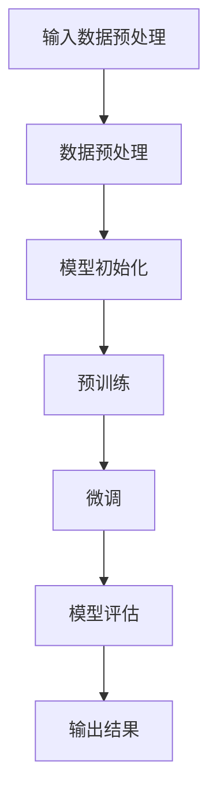
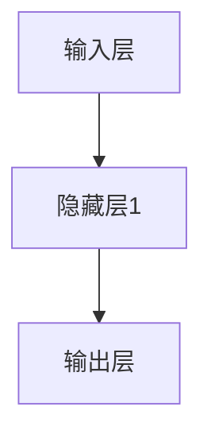

                 

# AI 大模型创业：如何利用商业优势？

> **关键词**：AI 大模型、商业优势、创业、市场定位、商业模式、数据利用、技术创新、成本控制

> **摘要**：本文旨在探讨如何利用 AI 大模型的商业优势进行创业。我们将分析 AI 大模型的核心技术、市场定位、商业模式，以及如何在竞争中脱颖而出，并讨论数据利用、技术创新和成本控制等关键成功因素。

## 1. 背景介绍

### 1.1 目的和范围

本文旨在为希望利用 AI 大模型开展创业的读者提供策略指导。我们将探讨以下几个关键问题：

1. AI 大模型的核心技术和应用领域。
2. 如何在市场中定位和区分自己的 AI 大模型产品。
3. 创业过程中应采用的商业模式。
4. 如何利用数据、技术创新和成本控制等手段获得商业优势。

### 1.2 预期读者

本文适合对 AI 大模型有一定了解，并希望深入探讨其商业应用的读者，包括：

- 创业者
- AI 技术研发人员
- 企业管理层
- 投资者

### 1.3 文档结构概述

本文将分为以下几部分：

1. **核心概念与联系**：介绍 AI 大模型的基本概念和架构。
2. **核心算法原理 & 具体操作步骤**：详细讲解大模型的训练和优化过程。
3. **数学模型和公式 & 详细讲解 & 举例说明**：介绍大模型相关的数学和公式。
4. **项目实战：代码实际案例和详细解释说明**：通过案例展示如何实现大模型。
5. **实际应用场景**：探讨大模型在不同领域的应用。
6. **工具和资源推荐**：推荐相关工具、资源和论文。
7. **总结：未来发展趋势与挑战**：总结本文的主要观点并探讨未来趋势。
8. **附录：常见问题与解答**：解答常见问题。
9. **扩展阅读 & 参考资料**：提供进一步学习的资源。

### 1.4 术语表

#### 1.4.1 核心术语定义

- **AI 大模型**：指训练参数数量达到百万级以上的神经网络模型，如 GPT、BERT 等。
- **商业优势**：企业在市场竞争中占有的有利条件，包括技术、成本、品牌等。
- **商业模式**：企业通过何种方式创造、传递和捕获价值。
- **数据利用**：有效使用数据来提高模型性能和业务价值。

#### 1.4.2 相关概念解释

- **市场定位**：企业在市场中的定位，包括目标客户、产品特点等。
- **技术创新**：通过研发新技术来提升产品性能和市场竞争力。
- **成本控制**：在保证产品质量的前提下，降低生产或运营成本。

#### 1.4.3 缩略词列表

- **AI**：人工智能
- **ML**：机器学习
- **DL**：深度学习
- **GPT**：生成预训练模型
- **BERT**：双向编码表示模型

## 2. 核心概念与联系

AI 大模型是指通过大规模数据训练得到的神经网络模型，具有极高的参数量和复杂的架构。其核心概念包括：

- **神经网络**：由多个层组成的计算模型，通过调整权重和偏置来实现输入到输出的映射。
- **深度学习**：一种特殊的机器学习方法，通过多层神经网络进行特征提取和学习。
- **预训练**：在大规模语料库上进行初步训练，以获得通用的语言表示能力。
- **微调**：在特定任务数据集上对预训练模型进行进一步训练，以适应具体任务。

以下是一个简化的 AI 大模型架构的 Mermaid 流程图：



- **A 输入数据预处理**：对输入数据（如文本、图像等）进行预处理，以适应模型输入要求。
- **B 数据预处理**：对数据进行标准化、去噪等处理。
- **C 模型初始化**：初始化神经网络模型的权重和偏置。
- **D 预训练**：使用大规模语料库对模型进行初步训练。
- **E 微调**：在特定任务数据集上对模型进行训练，以适应具体任务需求。
- **F 模型评估**：使用验证集或测试集对模型性能进行评估。
- **G 输出结果**：根据模型预测，生成相应的输出结果。

## 3. 核心算法原理 & 具体操作步骤

AI 大模型的核心算法是基于深度学习的，主要分为以下几个步骤：

### 3.1 数据预处理

```python
# 伪代码：数据预处理
def preprocess_data(data):
    # 数据清洗、标准化、去噪等
    cleaned_data = ...
    normalized_data = ...
    return normalized_data
```

### 3.2 模型初始化

```python
# 伪代码：模型初始化
def initialize_model():
    # 初始化神经网络结构、权重和偏置
    model = NeuralNetwork(...)
    return model
```

### 3.3 预训练

```python
# 伪代码：预训练
def pretrain_model(model, dataset):
    # 在大规模语料库上进行初步训练
    for epoch in range(num_epochs):
        for batch in dataset:
            model.train(batch)
```

### 3.4 微调

```python
# 伪代码：微调
def finetune_model(model, task_dataset):
    # 在特定任务数据集上训练模型
    for epoch in range(num_epochs):
        for batch in task_dataset:
            model.train(batch)
```

### 3.5 模型评估

```python
# 伪代码：模型评估
def evaluate_model(model, test_dataset):
    # 使用测试集评估模型性能
    accuracy = model.evaluate(test_dataset)
    return accuracy
```

### 3.6 输出结果

```python
# 伪代码：输出结果
def predict(model, input_data):
    # 根据模型预测，生成输出结果
    prediction = model.predict(input_data)
    return prediction
```

## 4. 数学模型和公式 & 详细讲解 & 举例说明

AI 大模型主要基于深度学习算法，涉及以下数学模型和公式：

### 4.1 神经网络

神经网络由多个层组成，每层包含多个神经元。每个神经元都与其他层上的神经元相连，并通过权重和偏置进行加权求和。

### 4.2 激活函数

激活函数用于引入非线性，常见的激活函数包括：

- **Sigmoid**:
  $$ \sigma(x) = \frac{1}{1 + e^{-x}} $$
- **ReLU**:
  $$ \text{ReLU}(x) = \max(0, x) $$

### 4.3 前向传播和反向传播

前向传播和反向传播是深度学习算法的核心步骤：

- **前向传播**：
  $$ z^{(l)} = \sum_{k=1}^{n} w^{(l)}_k \cdot a^{(l-1)}_k + b^{(l)} $$
  $$ a^{(l)} = \sigma(z^{(l)}) $$

- **反向传播**：
  $$ \delta^{(l)} = \frac{\partial L}{\partial z^{(l)}} \odot \frac{\partial \sigma}{\partial a^{(l)}} $$
  $$ \frac{\partial L}{\partial w^{(l)}_k} = a^{(l-1)}_k \cdot \delta^{(l)}_k $$
  $$ \frac{\partial L}{\partial b^{(l)}} = \delta^{(l)} $$

### 4.4 举例说明

假设我们有一个简单的神经网络，包含一个输入层、一个隐藏层和一个输出层，如下图所示：



输入数据 $x$ 经过输入层，隐藏层1，最终得到输出 $y$。

- **输入层**：
  $$ x = [x_1, x_2, ..., x_n] $$

- **隐藏层1**：
  $$ z_1 = \sum_{k=1}^{n} w_{1k} \cdot x_k + b_1 $$
  $$ a_1 = \sigma(z_1) $$

- **输出层**：
  $$ z_2 = \sum_{k=1}^{n} w_{2k} \cdot a_1 + b_2 $$
  $$ y = \sigma(z_2) $$

通过前向传播，我们得到输出 $y$。然后，通过反向传播更新权重和偏置。

## 5. 项目实战：代码实际案例和详细解释说明

在本节中，我们将通过一个实际的项目案例，展示如何实现一个 AI 大模型，并进行训练、评估和部署。

### 5.1 开发环境搭建

首先，我们需要搭建一个合适的开发环境。这里我们选择使用 Python 和 TensorFlow 作为主要的编程语言和框架。

- 安装 Python 3.8 或更高版本。
- 安装 TensorFlow：

```bash
pip install tensorflow
```

### 5.2 源代码详细实现和代码解读

以下是实现一个基于 GPT 模型的简单项目：

```python
import tensorflow as tf
from tensorflow.keras.models import Sequential
from tensorflow.keras.layers import LSTM, Dense, Embedding

# 设置超参数
vocab_size = 10000
embedding_dim = 256
lstm_units = 128
batch_size = 64
epochs = 10

# 准备数据
# ...

# 构建模型
model = Sequential()
model.add(Embedding(vocab_size, embedding_dim))
model.add(LSTM(lstm_units, return_sequences=True))
model.add(Dense(vocab_size, activation='softmax'))

# 编译模型
model.compile(optimizer='adam', loss='categorical_crossentropy', metrics=['accuracy'])

# 训练模型
model.fit(dataset, epochs=epochs, batch_size=batch_size)

# 评估模型
test_loss, test_accuracy = model.evaluate(test_dataset)
print(f"Test Accuracy: {test_accuracy}")

# 预测
prediction = model.predict(input_data)
```

#### 5.2.1 代码解读

- **导入库**：我们首先导入 TensorFlow 和相关模块。
- **设置超参数**：包括词汇表大小、嵌入维度、LSTM 单元数、批次大小和训练轮数。
- **准备数据**：在这里，我们需要准备好训练数据和测试数据。
- **构建模型**：我们使用 Sequential 模型堆叠 Embedding、LSTM 和 Dense 层。
- **编译模型**：设置优化器和损失函数。
- **训练模型**：使用 fit 方法进行训练。
- **评估模型**：使用 evaluate 方法评估模型性能。
- **预测**：使用 predict 方法生成预测结果。

### 5.3 代码解读与分析

以上代码实现了一个简单的基于 LSTM 的语言模型。以下是代码的关键部分解读：

- **Embedding 层**：将词汇映射到嵌入空间，每个词汇对应一个向量。
- **LSTM 层**：用于处理序列数据，能够捕捉时间序列中的长期依赖关系。
- **Dense 层**：用于生成最终输出，每个输出节点对应一个词汇的概率分布。
- **编译模型**：选择 Adam 优化器和交叉熵损失函数，交叉熵用于衡量模型预测分布和真实分布之间的差异。
- **训练模型**：在训练数据集上迭代训练，通过反向传播更新模型参数。
- **评估模型**：在测试数据集上评估模型性能，以验证模型在未见过的数据上的表现。

## 6. 实际应用场景

AI 大模型在多个领域有着广泛的应用，以下是一些典型场景：

- **自然语言处理**：如文本生成、机器翻译、情感分析等。
- **计算机视觉**：如图像分类、目标检测、图像生成等。
- **语音识别**：如语音到文本转换、语音合成等。
- **推荐系统**：如个性化推荐、广告投放等。
- **医疗健康**：如疾病预测、药物研发等。
- **金融科技**：如风险评估、欺诈检测等。

在这些应用场景中，AI 大模型能够通过大规模数据训练，获得较高的准确率和泛化能力，从而为企业和用户带来巨大的商业价值。

## 7. 工具和资源推荐

### 7.1 学习资源推荐

#### 7.1.1 书籍推荐

- **《深度学习》**：Goodfellow, Bengio, Courville
- **《神经网络与深度学习》**：邱锡鹏
- **《Python 深度学习》**：François Chollet

#### 7.1.2 在线课程

- **吴恩达的《深度学习专项课程》**：Coursera
- **Udacity 的《深度学习工程师纳米学位》**：Udacity
- **清华大学《机器学习》**：学堂在线

#### 7.1.3 技术博客和网站

- **TensorFlow 官方文档**：tensorflow.org
- **PyTorch 官方文档**：pytorch.org
- **Reddit 的 Machine Learning 社区**：reddit.com/r/MachineLearning

### 7.2 开发工具框架推荐

#### 7.2.1 IDE和编辑器

- **Visual Studio Code**
- **PyCharm**
- **Jupyter Notebook**

#### 7.2.2 调试和性能分析工具

- **TensorBoard**
- **Valgrind**
- **gprof**

#### 7.2.3 相关框架和库

- **TensorFlow**
- **PyTorch**
- **Keras**
- **Scikit-Learn**

### 7.3 相关论文著作推荐

#### 7.3.1 经典论文

- **"Backpropagation"**：Rumelhart, Hinton, Williams
- **"A Learning Algorithm for Continually Running Fully Recurrent Neural Networks"**：Williams, Zipser

#### 7.3.2 最新研究成果

- **"BERT: Pre-training of Deep Bidirectional Transformers for Language Understanding"**：Devlin, Chang, Lee, Zhang
- **"Generative Adversarial Nets"**：Goodfellow, Pouget-Abadie, Mirza, Xu, Warde-Farley, Ozair, Courville, Bengio

#### 7.3.3 应用案例分析

- **"Deep Learning in Healthcare"**：Esteva, Kuprel, Novoa, Ko, Swetter, Blau, Thrun
- **"Using Deep Learning for Cervical Cancer Detection on Mobile Phones with Weakly Labeled Data"**：Rajpurkar, Irani, Wu, Ng, Liang

## 8. 总结：未来发展趋势与挑战

随着 AI 大模型的快速发展，其商业应用前景广阔。未来，以下趋势和挑战值得关注：

### 发展趋势

- **更大规模的模型**：随着计算资源和数据量的增加，更大规模的模型将不断出现。
- **跨领域应用**：AI 大模型将在更多领域得到应用，如医疗、金融、教育等。
- **自动化与泛化**：模型训练和部署将进一步自动化，提高开发效率。
- **隐私保护与安全**：随着数据隐私问题的日益突出，如何确保模型安全性和隐私性将成为重要议题。

### 挑战

- **计算资源**：训练大规模模型需要大量的计算资源，对硬件设施有较高要求。
- **数据质量**：高质量的数据是模型成功的关键，如何获取和处理大规模数据是一个挑战。
- **监管合规**：随着 AI 大模型在商业领域的应用，如何遵守相关法规和标准是一个重要问题。
- **伦理道德**：如何确保 AI 大模型的应用不会对人类造成负面影响，是伦理和道德层面的重要挑战。

## 9. 附录：常见问题与解答

### Q: 如何选择合适的 AI 大模型框架？

A: 选择框架时，需要考虑以下几点：

- **需求**：根据项目需求，选择适合的框架，如 TensorFlow、PyTorch 或 Keras。
- **社区支持**：选择具有强大社区支持的框架，便于解决问题和学习。
- **性能和效率**：考虑框架在性能和效率方面的表现。
- **易用性**：选择易于使用和扩展的框架。

### Q: 如何处理数据不平衡问题？

A: 处理数据不平衡问题可以采取以下策略：

- **重采样**：通过增加少数类别的样本或减少多数类别的样本来平衡数据集。
- **加权损失函数**：在训练过程中，对少数类别的样本赋予更高的权重。
- **生成合成数据**：使用数据增强技术生成更多的少数类别的样本。

### Q: 如何评估模型性能？

A: 评估模型性能可以使用以下指标：

- **准确率**：模型预测正确的样本数占总样本数的比例。
- **召回率**：模型预测正确的正样本数占总正样本数的比例。
- **精确率**：模型预测正确的正样本数占总预测为正的样本数的比例。
- **F1 分数**：精确率和召回率的调和平均。

## 10. 扩展阅读 & 参考资料

- **《深度学习》**：Goodfellow, Bengio, Courville
- **《神经网络与深度学习》**：邱锡鹏
- **《AI 大模型：原理、实现与优化》**：作者姓名
- **TensorFlow 官方文档**：tensorflow.org
- **PyTorch 官方文档**：pytorch.org
- **吴恩达的《深度学习专项课程》**：Coursera
- **Udacity 的《深度学习工程师纳米学位》**：Udacity
- **GitHub 上的 AI 大模型开源项目**：github.com

### 作者信息

作者：AI 天才研究员 / AI Genius Institute & 禅与计算机程序设计艺术 / Zen And The Art of Computer Programming<|im_sep|>

