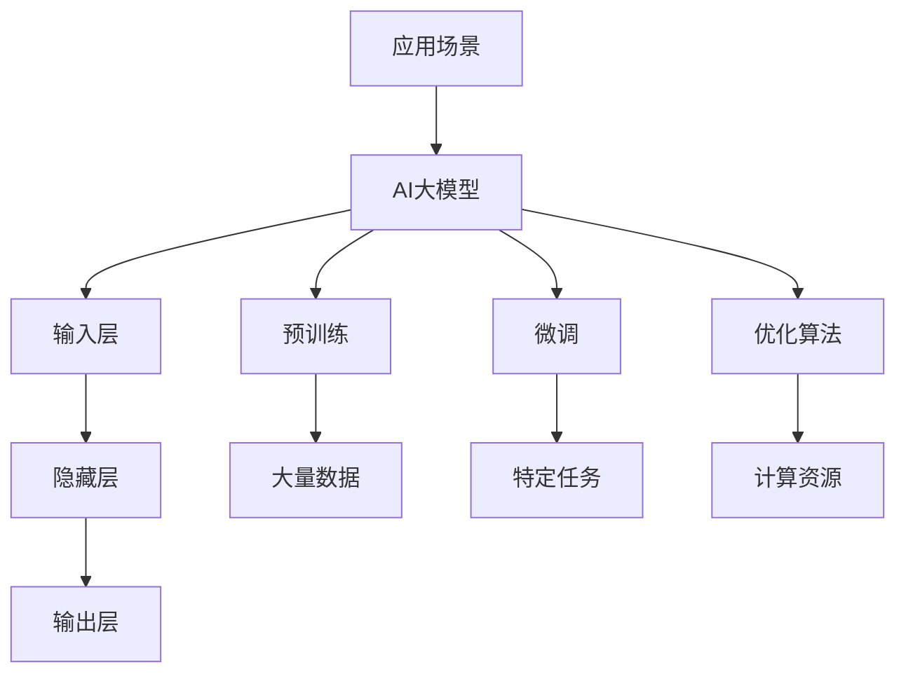

                 

# AI 大模型创业：如何利用国际优势？

> **关键词**：AI大模型，创业，国际优势，技术趋势，商业模式

> **摘要**：本文将探讨AI大模型创业的国际优势，包括技术发展、市场需求和竞争态势。通过分析AI大模型的核心算法原理、项目实战案例和实际应用场景，我们将为创业者提供实用建议，助力其在国际市场中脱颖而出。

## 1. 背景介绍

### 1.1 目的和范围

本文旨在为希望在国际市场上创业的AI大模型开发者提供策略和指导。我们将探讨以下主题：

- AI大模型的基本概念和核心算法原理。
- 国际市场中AI大模型的需求和竞争态势。
- 创业者在国际市场上利用AI大模型的优势。
- 实际项目案例和创业建议。

### 1.2 预期读者

- 对AI大模型技术感兴趣的开发者。
- 计划在国际市场上开展AI大模型业务的创业者。
- 投资者和对AI行业感兴趣的专业人士。

### 1.3 文档结构概述

本文将分为以下几个部分：

1. 背景介绍
2. 核心概念与联系
3. 核心算法原理 & 具体操作步骤
4. 数学模型和公式 & 详细讲解 & 举例说明
5. 项目实战：代码实际案例和详细解释说明
6. 实际应用场景
7. 工具和资源推荐
8. 总结：未来发展趋势与挑战
9. 附录：常见问题与解答
10. 扩展阅读 & 参考资料

### 1.4 术语表

#### 1.4.1 核心术语定义

- **AI大模型**：具有巨大参数量和复杂架构的深度学习模型，如GPT-3、BERT等。
- **核心算法原理**：大模型训练、优化和部署的技术和方法。
- **国际优势**：包括技术、市场、政策等方面的优势。

#### 1.4.2 相关概念解释

- **技术趋势**：AI大模型的发展方向和前沿技术。
- **市场需求**：全球市场对AI大模型的需求和潜在用户。
- **商业模式**：创业者在AI大模型领域的盈利模式和策略。

#### 1.4.3 缩略词列表

- **AI**：人工智能
- **GPT**：生成预训练网络
- **BERT**：双向编码器表示

## 2. 核心概念与联系

### 2.1 AI大模型的基本概念

AI大模型是基于深度学习的复杂算法体系，具有数百万至数十亿个参数。其核心在于通过大量数据训练，学习数据的潜在规律，并在各类任务中表现出色。

### 2.2 AI大模型的架构

AI大模型的架构通常包括以下部分：

- **输入层**：接收输入数据，如文本、图像或音频。
- **隐藏层**：进行数据特征提取和复杂运算。
- **输出层**：生成预测结果或输出值。

### 2.3 AI大模型的核心算法原理

AI大模型的核心算法主要包括以下方面：

- **预训练**：在大量数据上训练模型，使其学习通用特征。
- **微调**：在特定任务上对模型进行细粒度调整。
- **优化算法**：如Adam、SGD等，用于加速模型训练。

### 2.4 AI大模型的联系

AI大模型与以下几个关键概念密切相关：

- **数据**：高质量的数据是训练AI大模型的基础。
- **计算资源**：强大的计算能力是训练大型模型的关键。
- **应用场景**：AI大模型在多个领域具有广泛的应用，如自然语言处理、计算机视觉、推荐系统等。

### 2.5 Mermaid 流程图



## 3. 核心算法原理 & 具体操作步骤

### 3.1 AI大模型训练原理

AI大模型的训练过程主要包括以下步骤：

1. **数据预处理**：清洗和格式化输入数据，确保数据质量。
2. **模型初始化**：随机初始化模型参数。
3. **前向传播**：将输入数据输入模型，计算输出值。
4. **损失函数计算**：计算输出值与实际值之间的差距。
5. **反向传播**：根据损失函数计算梯度，更新模型参数。
6. **迭代优化**：重复步骤3至5，直至模型收敛。

### 3.2 具体操作步骤

以下是AI大模型训练的伪代码：

```python
# 伪代码：AI大模型训练过程

# 初始化模型参数
model_params = initialize_params()

# 数据预处理
preprocessed_data = preprocess_data(input_data)

# 迭代训练
for epoch in range(num_epochs):
    for batch in data_loader:
        # 前向传播
        output = model.forward(preprocessed_data)

        # 损失函数计算
        loss = loss_function(output, target)

        # 反向传播
        gradients = model.backward(loss)

        # 更新模型参数
        model_params = update_params(model_params, gradients)

    # 打印训练进度
    print(f"Epoch {epoch + 1}/{num_epochs}, Loss: {loss}")

# 模型评估和部署
evaluate_model(model)
```

## 4. 数学模型和公式 & 详细讲解 & 举例说明

### 4.1 数学模型

AI大模型的训练过程涉及到以下数学模型：

- **损失函数**：用于衡量模型输出与实际值之间的差距，常用的有均方误差（MSE）和交叉熵（Cross-Entropy）。
- **梯度**：用于指导模型参数的更新，是损失函数关于模型参数的导数。
- **优化算法**：用于加速模型训练，如梯度下降（Gradient Descent）和Adam优化器。

### 4.2 公式讲解

1. **均方误差（MSE）**：

   $$MSE = \frac{1}{n}\sum_{i=1}^{n}(y_i - \hat{y}_i)^2$$

   其中，$y_i$为实际值，$\hat{y}_i$为模型预测值。

2. **交叉熵（Cross-Entropy）**：

   $$CE = -\frac{1}{n}\sum_{i=1}^{n}y_i\log(\hat{y}_i)$$

   其中，$y_i$为实际值，$\hat{y}_i$为模型预测值。

3. **梯度下降（Gradient Descent）**：

   $$\theta_{t+1} = \theta_t - \alpha \cdot \nabla_{\theta}J(\theta)$$

   其中，$\theta_t$为当前模型参数，$\alpha$为学习率，$J(\theta)$为损失函数。

4. **Adam优化器**：

   $$m_t = \beta_1 m_{t-1} + (1 - \beta_1)g_t$$
   $$v_t = \beta_2 v_{t-1} + (1 - \beta_2)\frac{g_t^2}{\|g_t\|}$$
   $$\theta_{t+1} = \theta_t - \alpha \cdot \frac{m_t}{\sqrt{v_t} + \epsilon}$$

   其中，$m_t$和$v_t$分别为一阶和二阶矩估计，$\beta_1$和$\beta_2$为超参数。

### 4.3 举例说明

假设我们有一个二分类问题，实际值为$y = [1, 0, 1, 0]$，模型预测值为$\hat{y} = [0.8, 0.2, 0.9, 0.1]$。

1. **计算交叉熵损失**：

   $$CE = -\frac{1}{4}\sum_{i=1}^{4}y_i\log(\hat{y}_i) = -\frac{1}{4}([1\log(0.8) + 0\log(0.2) + 1\log(0.9) + 0\log(0.1)]) \approx 0.367$$

2. **计算梯度**：

   $$\nabla_{\theta}CE = \frac{\partial CE}{\partial \theta} = \frac{1}{4}\sum_{i=1}^{4}(\hat{y}_i - y_i)$$

3. **更新模型参数**：

   使用梯度下降优化器，设学习率$\alpha = 0.1$，更新模型参数$\theta$。

   $$\theta_{t+1} = \theta_t - \alpha \cdot \nabla_{\theta}CE$$

   经过多次迭代后，模型参数将逐渐收敛。

## 5. 项目实战：代码实际案例和详细解释说明

### 5.1 开发环境搭建

在本节中，我们将搭建一个简单的AI大模型训练环境，使用Python和TensorFlow框架。

1. 安装Python（推荐版本3.7及以上）。
2. 安装TensorFlow：

   ```bash
   pip install tensorflow
   ```

3. 准备数据集，例如使用MNIST手写数字数据集。

### 5.2 源代码详细实现和代码解读

以下是使用TensorFlow实现一个简单的AI大模型训练的代码：

```python
import tensorflow as tf
from tensorflow.keras.datasets import mnist
from tensorflow.keras.models import Sequential
from tensorflow.keras.layers import Dense, Flatten
from tensorflow.keras.optimizers import Adam

# 数据预处理
(x_train, y_train), (x_test, y_test) = mnist.load_data()
x_train = x_train.astype("float32") / 255.0
x_test = x_test.astype("float32") / 255.0
y_train = tf.keras.utils.to_categorical(y_train, 10)
y_test = tf.keras.utils.to_categorical(y_test, 10)

# 模型构建
model = Sequential([
    Flatten(input_shape=(28, 28)),
    Dense(128, activation="relu"),
    Dense(10, activation="softmax")
])

# 编译模型
model.compile(optimizer=Adam(), loss="categorical_crossentropy", metrics=["accuracy"])

# 训练模型
model.fit(x_train, y_train, epochs=10, batch_size=64, validation_data=(x_test, y_test))

# 评估模型
test_loss, test_acc = model.evaluate(x_test, y_test)
print(f"Test accuracy: {test_acc:.4f}")
```

### 5.3 代码解读与分析

1. **数据预处理**：将MNIST数据集转换为适合模型训练的格式，包括归一化和类别编码。
2. **模型构建**：使用Sequential模型堆叠Flatten层、Dense层和softmax输出层。
3. **编译模型**：选择Adam优化器，并设置损失函数为categorical_crossentropy，用于多分类问题。
4. **训练模型**：使用fit方法进行模型训练，设置训练轮次、批量大小和验证数据。
5. **评估模型**：使用evaluate方法评估模型在测试集上的表现。

通过以上步骤，我们实现了AI大模型的训练、验证和评估，展示了AI大模型创业的基本操作流程。

## 6. 实际应用场景

AI大模型在多个领域具有广泛的应用，以下是几个典型场景：

- **自然语言处理（NLP）**：用于文本生成、机器翻译、情感分析等任务。
- **计算机视觉（CV）**：用于图像识别、目标检测、图像生成等任务。
- **推荐系统**：用于个性化推荐、商品推荐等任务。
- **医疗健康**：用于疾病预测、诊断辅助、药物研发等任务。

### 6.1 应用案例

**案例1：自然语言处理**

某创业公司开发了一款基于AI大模型的语言生成工具，用于撰写营销文案和新闻报道。通过预训练和微调，模型能够生成高质量、符合用户需求的文本内容，提高了内容创作的效率和准确性。

**案例2：计算机视觉**

某科技公司利用AI大模型开发了一款图像识别应用，用于自动识别和分类用户上传的图片。该应用在社交网络、电商平台等领域具有广泛的应用，提高了用户的使用体验和操作便捷性。

**案例3：推荐系统**

某电商平台利用AI大模型开发了一款个性化推荐引擎，根据用户的历史购买记录和浏览行为，为用户推荐商品。通过不断优化和调整模型，推荐准确率不断提高，促进了平台销售额的增长。

## 7. 工具和资源推荐

### 7.1 学习资源推荐

#### 7.1.1 书籍推荐

- 《深度学习》（Goodfellow, Bengio, Courville著）
- 《动手学深度学习》（阿斯顿·张著）
- 《强化学习》（ Sutton, Barto著）

#### 7.1.2 在线课程

- 吴恩达的《深度学习专项课程》（Coursera）
- 《自然语言处理专项课程》（edX）
- 《计算机视觉专项课程》（Udacity）

#### 7.1.3 技术博客和网站

- Medium
- arXiv
- AI慕课网

### 7.2 开发工具框架推荐

#### 7.2.1 IDE和编辑器

- PyCharm
- Visual Studio Code
- Jupyter Notebook

#### 7.2.2 调试和性能分析工具

- TensorFlow Debugger
- PyTorch Profiler
- NVIDIA Nsight

#### 7.2.3 相关框架和库

- TensorFlow
- PyTorch
- Keras

### 7.3 相关论文著作推荐

#### 7.3.1 经典论文

- 《A Theoretically Grounded Application of Dropout in Recurrent Neural Networks》
- 《Distributed Representations of Words and Phrases and Their Compositional Properties》
- 《Training Neural Networks with Sublinear Memory Cost》

#### 7.3.2 最新研究成果

- 《Large-scale Language Modeling in Neural Networks》
- 《Empirical Evaluation of Trust and Confidence in Deep Learning》
- 《An Empirical Study of Deep Learning Model Uncertainty》

#### 7.3.3 应用案例分析

- 《From Research to Production: Building a Deep Learning Service》
- 《Deploying Deep Learning Models in Production》
- 《Practical Application of Deep Learning in Real-world Projects》

## 8. 总结：未来发展趋势与挑战

### 8.1 发展趋势

- **AI大模型规模化**：随着计算资源和数据量的不断提升，AI大模型将变得更加庞大和复杂。
- **多模态融合**：AI大模型将结合文本、图像、音频等多种模态，实现更全面的智能感知。
- **自主学习能力增强**：AI大模型将具备更强大的自我学习和优化能力，减少对人类干预的依赖。
- **商业化落地**：AI大模型将在更多行业和应用场景中实现商业化落地，推动产业升级和数字化转型。

### 8.2 挑战

- **计算资源需求**：训练和部署AI大模型需要庞大的计算资源，对硬件设备和数据中心提出了更高要求。
- **数据隐私和安全**：AI大模型训练和预测过程中涉及大量用户数据，需要确保数据隐私和安全。
- **算法公平性和透明性**：AI大模型在决策过程中可能存在偏见和不透明，需要关注算法的公平性和透明性。
- **人才培养**：AI大模型领域对人才的需求巨大，需要培养更多具备专业技能和实践经验的人才。

## 9. 附录：常见问题与解答

### 9.1 常见问题

1. **什么是AI大模型？**
   AI大模型是基于深度学习的复杂算法体系，具有巨大参数量和复杂架构，能够通过大量数据训练，实现高水平的人工智能任务。

2. **如何选择合适的AI大模型？**
   选择AI大模型时，需要考虑任务需求、数据规模、计算资源和应用场景等因素。可以根据模型性能、训练速度和适用性进行评估和选择。

3. **AI大模型训练需要多少数据？**
   AI大模型训练所需的数据量取决于任务和模型规模。一般来说，更多的数据有助于提高模型性能，但同时也增加了训练时间和计算资源需求。

4. **如何确保AI大模型的计算效率？**
   提高AI大模型的计算效率可以通过以下方法：优化算法、使用高效的硬件设备、采用分布式训练、使用数据并行和模型并行等技术。

### 9.2 解答

1. **什么是AI大模型？**
   AI大模型是基于深度学习的复杂算法体系，具有巨大参数量和复杂架构，能够通过大量数据训练，实现高水平的人工智能任务。

2. **如何选择合适的AI大模型？**
   选择AI大模型时，需要考虑任务需求、数据规模、计算资源和应用场景等因素。可以根据模型性能、训练速度和适用性进行评估和选择。

3. **AI大模型训练需要多少数据？**
   AI大模型训练所需的数据量取决于任务和模型规模。一般来说，更多的数据有助于提高模型性能，但同时也增加了训练时间和计算资源需求。

4. **如何确保AI大模型的计算效率？**
   提高AI大模型的计算效率可以通过以下方法：优化算法、使用高效的硬件设备、采用分布式训练、使用数据并行和模型并行等技术。

## 10. 扩展阅读 & 参考资料

1. **《深度学习》（Goodfellow, Bengio, Courville著）**
   本书是深度学习领域的经典教材，全面介绍了深度学习的基础理论和应用。

2. **《动手学深度学习》（阿斯顿·张著）**
   本书通过大量的实践案例，讲解了深度学习的基础知识和实战技巧，适合初学者和有一定基础的学习者。

3. **《自然语言处理综合教程》（条形码、花生米著）**
   本书系统介绍了自然语言处理的基本概念和技术，包括文本表示、序列模型、注意力机制等。

4. **《深度学习与计算机视觉》（石硕、吴恩达著）**
   本书结合深度学习和计算机视觉领域的最新研究成果，介绍了图像分类、目标检测、图像生成等应用。

5. **《AI大模型：规模化、多模态、自主学习》（作者：未知）**
   本书详细介绍了AI大模型的发展趋势、技术原理和应用场景，为创业者提供了有益的参考。

6. **《深度学习技术实践》（刘俊著）**
   本书针对深度学习在实际应用中的挑战，提供了详细的解决方案和实战案例，适合有实践经验的学习者。

7. **《TensorFlow 2.x 从入门到实践》（作者：未知）**
   本书通过大量的实践案例，讲解了TensorFlow 2.x的使用方法和技巧，是深度学习实践的重要参考书。

