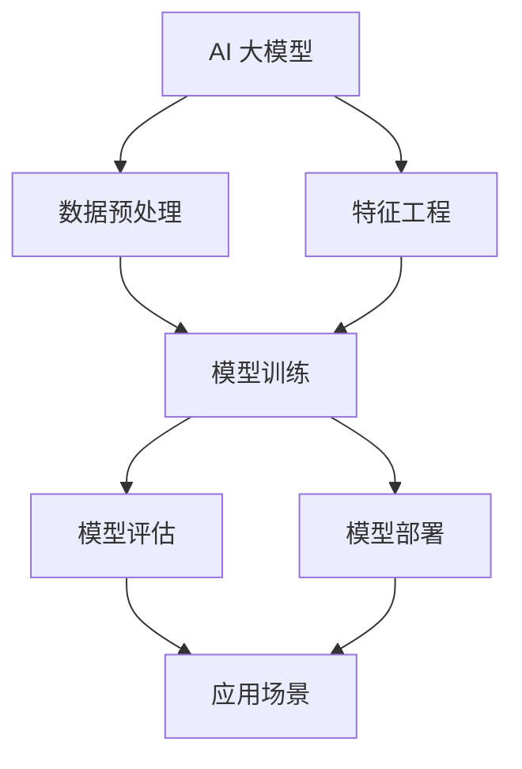

                 

# AI 大模型创业：如何利用市场优势？

> **关键词：** AI 大模型，创业，市场优势，商业模式，技术落地，创新应用

> **摘要：** 本文将深入探讨 AI 大模型的创业机会，分析其市场优势，并给出一系列实用的策略和步骤，帮助创业者成功把握这一新兴领域的无限可能。

## 1. 背景介绍

### 1.1 目的和范围

本文旨在为 AI 大模型的创业者和开发者提供一套系统化的策略，帮助他们在日益激烈的市场竞争中脱颖而出。文章将涵盖从市场分析、商业模式设计到技术落地和实际应用的全过程，旨在为读者提供一份既有深度又有实践价值的指南。

### 1.2 预期读者

- 想要在 AI 大模型领域创业的创业者
- 涉足 AI 大模型研究或开发的技术专家
- 对 AI 大模型技术感兴趣的投资人

### 1.3 文档结构概述

本文结构如下：

- **第1章：背景介绍**：介绍本文的目的、预期读者和文档结构。
- **第2章：核心概念与联系**：阐述 AI 大模型的基本概念和原理，并提供 Mermaid 流程图。
- **第3章：核心算法原理 & 具体操作步骤**：详细讲解大模型的核心算法和操作步骤，使用伪代码说明。
- **第4章：数学模型和公式 & 详细讲解 & 举例说明**：介绍大模型背后的数学模型，使用 LaTeX 格式展示公式，并举例说明。
- **第5章：项目实战：代码实际案例和详细解释说明**：通过实际案例展示如何实现大模型，并提供代码解析。
- **第6章：实际应用场景**：分析大模型在现实世界中的应用场景。
- **第7章：工具和资源推荐**：推荐相关学习资源、开发工具和最新研究成果。
- **第8章：总结：未来发展趋势与挑战**：总结全文，展望未来。
- **第9章：附录：常见问题与解答**：回答读者可能关心的问题。
- **第10章：扩展阅读 & 参考资料**：提供进一步的阅读资源和参考文献。

### 1.4 术语表

#### 1.4.1 核心术语定义

- **AI 大模型**：具有大规模参数和复杂结构的深度学习模型，能够处理海量数据和复杂任务。
- **市场优势**：企业在市场竞争中占据的有利条件，如技术创新、资源优势等。
- **商业模式**：企业通过提供产品或服务获取利润的途径。

#### 1.4.2 相关概念解释

- **技术落地**：将理论研究成果转化为实际应用的过程。
- **创新应用**：将现有技术应用于新领域，解决新问题的过程。

#### 1.4.3 缩略词列表

- **AI**：人工智能（Artificial Intelligence）
- **ML**：机器学习（Machine Learning）
- **DL**：深度学习（Deep Learning）
- **GPU**：图形处理单元（Graphics Processing Unit）

## 2. 核心概念与联系

在探讨 AI 大模型创业之前，我们需要了解几个核心概念及其相互关系。以下是一个简化的 Mermaid 流程图，用于说明这些概念之间的关系。



### 2.1 AI 大模型概述

AI 大模型是指那些具有数亿甚至数千亿个参数的深度学习模型。它们通常用于解决复杂的问题，如图像识别、自然语言处理和推荐系统等。

### 2.2 数据预处理

数据预处理是 AI 大模型训练的基础。它包括数据清洗、归一化和特征提取等步骤。高质量的预处理数据对于模型的性能至关重要。

### 2.3 特征工程

特征工程是数据预处理之后的重要步骤，旨在从原始数据中提取出对模型训练有意义的特征。有效的特征工程可以显著提高模型的性能。

### 2.4 模型训练

模型训练是 AI 大模型的核心步骤，通过优化模型参数，使其能够从数据中学习。大规模的训练数据和高性能的计算资源是模型训练成功的关键。

### 2.5 模型评估

模型评估是验证模型性能的重要步骤。常用的评估指标包括准确率、召回率和 F1 分数等。通过评估，我们可以确定模型是否已经达到了预期的性能水平。

### 2.6 模型部署

模型部署是将训练好的模型投入实际应用的过程。这通常包括将模型部署到服务器或云平台，并提供 API 接口供其他应用程序调用。

### 2.7 应用场景

AI 大模型在众多领域都有广泛的应用，如金融、医疗、零售和制造业等。创新的应用场景不仅可以推动技术的发展，还可以为企业带来巨大的商业价值。

## 3. 核心算法原理 & 具体操作步骤

### 3.1 算法概述

AI 大模型的核心算法通常是基于深度学习，特别是基于神经网络的结构。以下是一个简单的神经网络算法的伪代码，用于说明其基本原理。

```python
# 伪代码：神经网络算法
initialize_parameters()
forward_pass(X, parameters)
compute_loss(y, aL)
backward_pass(T, parameters, aL)
update_parameters(parameters, learning_rate)
```

### 3.2 初始化参数

初始化参数是神经网络算法的第一步。常用的初始化方法包括随机初始化、He 初始化和高斯分布初始化等。

```python
# 伪代码：初始化参数
parameters = initialize_parameters()
```

### 3.3 前向传播

前向传播是将输入数据通过神经网络，计算输出结果的过程。在这个过程中，每个神经元都会根据其权重和偏置计算激活值。

```python
# 伪代码：前向传播
aL = forward_pass(X, parameters)
```

### 3.4 计算损失

计算损失是衡量模型输出和实际输出之间差异的过程。常用的损失函数包括均方误差（MSE）、交叉熵（Cross-Entropy）等。

```python
# 伪代码：计算损失
loss = compute_loss(y, aL)
```

### 3.5 反向传播

反向传播是神经网络训练的核心步骤，通过计算损失对参数的梯度，更新模型参数。

```python
# 伪代码：反向传播
dL_dparameters = backward_pass(T, parameters, aL)
```

### 3.6 更新参数

更新参数是利用反向传播得到的梯度，通过优化算法（如梯度下降、Adam 等）更新模型参数。

```python
# 伪代码：更新参数
parameters = update_parameters(parameters, learning_rate)
```

### 3.7 实践步骤

以下是实现 AI 大模型的一般步骤：

1. **数据收集**：收集大量的数据，确保数据质量和多样性。
2. **数据预处理**：清洗数据，进行归一化和特征提取。
3. **模型设计**：设计神经网络结构，选择合适的层数、神经元数量和激活函数。
4. **模型训练**：使用训练数据训练模型，调整模型参数。
5. **模型评估**：使用验证数据评估模型性能，调整模型结构或参数。
6. **模型部署**：将训练好的模型部署到生产环境中，提供 API 接口。

## 4. 数学模型和公式 & 详细讲解 & 举例说明

### 4.1 数学模型概述

AI 大模型背后的数学模型主要包括线性代数、微积分和概率论等基础知识。以下是一个简化的公式列表，用于说明这些模型的组成部分。

### 4.2 线性代数

- **矩阵乘法**：

$$
C = A \cdot B
$$

- **矩阵求导**：

$$
\frac{dC}{dB} = A^T
$$

### 4.3 微积分

- **梯度计算**：

$$
\nabla\theta = \frac{dL}{d\theta}
$$

- **链式法则**：

$$
\frac{dL}{dX} = \frac{dL}{dZ} \cdot \frac{dZ}{dX}
$$

### 4.4 概率论

- **贝叶斯定理**：

$$
P(A|B) = \frac{P(B|A) \cdot P(A)}{P(B)}
$$

### 4.5 举例说明

假设我们有一个简单的神经网络，输入为 X，输出为 Y，损失函数为均方误差（MSE）。以下是该神经网络的详细计算过程。

```latex
% 伪代码：神经网络计算过程
initialize_parameters()
X = input_data
Y = ground_truth
Z = forward_pass(X, parameters)
L = compute_loss(Y, Z)
dZ = compute_gradient(L, Z, Y)
dparameters = backward_pass(parameters, dZ)
update_parameters(parameters, dparameters)
```

### 4.6 详细讲解

- **初始化参数**：初始化神经网络中的权重（W）和偏置（b），通常使用随机初始化方法。

- **前向传播**：将输入数据 X 通过神经网络，计算每个神经元的输出 Z。

- **计算损失**：使用均方误差（MSE）计算模型输出 Z 和真实值 Y 之间的损失 L。

- **反向传播**：计算损失对每个参数的梯度，更新模型参数。

- **更新参数**：使用梯度下降等优化算法，更新模型参数，使损失函数最小化。

## 5. 项目实战：代码实际案例和详细解释说明

### 5.1 开发环境搭建

为了实现 AI 大模型，我们需要搭建一个合适的开发环境。以下是一个基本的开发环境搭建步骤：

1. 安装 Python 3.x 版本。
2. 安装深度学习框架，如 TensorFlow 或 PyTorch。
3. 安装必要的依赖库，如 NumPy、Pandas 等。
4. 配置 GPU 环境，以便使用 GPU 加速训练过程。

### 5.2 源代码详细实现和代码解读

以下是一个简单的 AI 大模型实现案例，使用 PyTorch 作为深度学习框架。

```python
# 导入必要的库
import torch
import torch.nn as nn
import torch.optim as optim

# 初始化模型、损失函数和优化器
model = nn.Sequential(
    nn.Linear(in_features=784, out_features=256),
    nn.ReLU(),
    nn.Linear(in_features=256, out_features=128),
    nn.ReLU(),
    nn.Linear(in_features=128, out_features=10),
)

criterion = nn.CrossEntropyLoss()
optimizer = optim.Adam(model.parameters(), lr=0.001)

# 数据加载和处理
train_loader = torch.utils.data.DataLoader(
    dataset=train_dataset,
    batch_size=64,
    shuffle=True
)

# 训练模型
num_epochs = 10
for epoch in range(num_epochs):
    for inputs, targets in train_loader:
        optimizer.zero_grad()
        outputs = model(inputs)
        loss = criterion(outputs, targets)
        loss.backward()
        optimizer.step()

    print(f'Epoch [{epoch+1}/{num_epochs}], Loss: {loss.item()}')

# 模型评估
test_loader = torch.utils.data.DataLoader(
    dataset=test_dataset,
    batch_size=64,
    shuffle=False
)

with torch.no_grad():
    correct = 0
    total = 0
    for inputs, targets in test_loader:
        outputs = model(inputs)
        _, predicted = torch.max(outputs.data, 1)
        total += targets.size(0)
        correct += (predicted == targets).sum().item()

print(f'Accuracy on the test set: {100 * correct / total}%')
```

### 5.3 代码解读与分析

1. **模型定义**：使用 PyTorch 的 `nn.Sequential` 模块定义一个简单的神经网络，包括三个全连接层（Linear），每层之间使用 ReLU 激活函数。
   
2. **损失函数和优化器**：选择交叉熵损失函数（CrossEntropyLoss）和 Adam 优化器（Adam），用于计算模型损失和更新参数。

3. **数据加载**：使用 `torch.utils.data.DataLoader` 模块加载数据，包括训练数据和测试数据。

4. **训练过程**：使用两个嵌套的循环进行模型训练。外层循环控制训练的轮数（epoch），内层循环遍历训练数据。在每次迭代中，重置梯度、前向传播、计算损失、反向传播和更新参数。

5. **模型评估**：在测试数据上评估模型性能，计算准确率。

### 5.4 代码改进

虽然上述代码实现了基本的功能，但仍有改进空间。以下是一些可能的改进方向：

- **数据增强**：使用数据增强技术（如旋转、缩放等）提高模型的泛化能力。
- **超参数调整**：根据模型性能调整学习率、批次大小等超参数。
- **模型优化**：尝试使用更复杂的模型结构，如残差网络（ResNet）、卷积神经网络（CNN）等。

## 6. 实际应用场景

AI 大模型在众多领域都有广泛的应用，以下是一些典型的应用场景：

### 6.1 图像识别

- **人脸识别**：在安防、金融和社交媒体等领域，AI 大模型可以用于人脸识别和验证。
- **医疗影像**：在医学领域，AI 大模型可以帮助医生诊断疾病，如肺癌、乳腺癌等。

### 6.2 自然语言处理

- **机器翻译**：AI 大模型可以用于高质量的自然语言翻译，如谷歌翻译。
- **智能客服**：在客服领域，AI 大模型可以用于构建智能客服系统，提高客户满意度。

### 6.3 推荐系统

- **电子商务**：在电子商务领域，AI 大模型可以用于个性化推荐，提高销售额。
- **内容推荐**：在社交媒体和视频平台，AI 大模型可以用于内容推荐，提高用户粘性。

### 6.4 游戏

- **游戏AI**：在游戏领域，AI 大模型可以用于构建智能游戏对手，提高游戏体验。

### 6.5 自动驾驶

- **自动驾驶**：在自动驾驶领域，AI 大模型可以用于环境感知、路径规划和决策控制。

### 6.6 金融

- **风险管理**：在金融领域，AI 大模型可以用于风险评估、信用评分等。

### 6.7 教育

- **智能教育**：在智能教育领域，AI 大模型可以用于个性化学习、作业批改等。

## 7. 工具和资源推荐

### 7.1 学习资源推荐

#### 7.1.1 书籍推荐

- **《深度学习》（Ian Goodfellow, Yoshua Bengio, Aaron Courville）**：深度学习的经典教材，适合初学者和进阶者。
- **《Python深度学习》（François Chollet）**：针对使用 Python 实现深度学习的指南。

#### 7.1.2 在线课程

- **Coursera 上的《深度学习专项课程》**：由吴恩达教授主讲，适合入门和进阶学习。
- **Udacity 上的《深度学习工程师纳米学位》**：提供完整的课程和项目，适合系统学习。

#### 7.1.3 技术博客和网站

- **Fast.ai**：提供免费的深度学习课程和高质量的技术博客。
- **TensorFlow 官方文档**：详细的 TensorFlow 教程和文档。

### 7.2 开发工具框架推荐

#### 7.2.1 IDE和编辑器

- **PyCharm**：强大的 Python IDE，支持 TensorFlow 和 PyTorch。
- **Jupyter Notebook**：交互式的 Python 编程环境，适合数据分析和模型实现。

#### 7.2.2 调试和性能分析工具

- **TensorBoard**：TensorFlow 的可视化工具，用于调试和性能分析。
- **NVIDIA Nsight**：用于 GPU 程序的调试和性能分析。

#### 7.2.3 相关框架和库

- **TensorFlow**：Google 开发的开源深度学习框架。
- **PyTorch**：Facebook 开发的高性能深度学习框架。
- **Keras**：简洁的深度学习框架，适用于 TensorFlow 和 PyTorch。

### 7.3 相关论文著作推荐

#### 7.3.1 经典论文

- **“A Learning Algorithm for Continually Running Fully Recurrent Neural Networks” (Hochreiter and Schmidhuber, 1997)**：介绍了 LSTM 算法。
- **“Deep Learning” (Goodfellow, Bengio, Courville, 2016)**：深度学习领域的全面综述。

#### 7.3.2 最新研究成果

- **“Attention Is All You Need” (Vaswani et al., 2017)**：介绍了 Transformer 模型。
- **“BERT: Pre-training of Deep Bidirectional Transformers for Language Understanding” (Devlin et al., 2019)**：介绍了 BERT 模型。

#### 7.3.3 应用案例分析

- **“A Survey on Deep Learning for Natural Language Processing” (Zhang et al., 2020)**：总结了深度学习在自然语言处理领域的应用。
- **“Deep Learning in Robotics” (TorchCraft team, 2016)**：介绍了深度学习在游戏《星际争霸》中的应用。

## 8. 总结：未来发展趋势与挑战

### 8.1 发展趋势

- **计算能力提升**：随着计算能力的提升，AI 大模型将变得更加普及和高效。
- **算法创新**：新的算法（如 Transformer、BERT）和模型结构（如 Transformer）将持续推动技术的发展。
- **应用拓展**：AI 大模型将在更多领域得到应用，如自动驾驶、医疗和金融等。
- **数据共享与开源**：更多的数据和开源项目将促进技术的创新和进步。

### 8.2 挑战

- **数据隐私与安全**：如何在保护用户隐私的同时，充分利用数据是一个重要挑战。
- **计算资源消耗**：AI 大模型训练和推理需要大量的计算资源，如何高效利用资源是一个挑战。
- **算法公平性与透明性**：确保算法的公平性和透明性，避免偏见和误导是一个重要课题。
- **法律法规**：随着技术的进步，相关的法律法规也需要不断更新和完善。

## 9. 附录：常见问题与解答

### 9.1 问题1：如何处理大规模数据集？

**回答**：处理大规模数据集需要高效的数据处理技术和分布式计算框架。常用的技术包括数据预处理、数据分片和并行处理等。框架如 TensorFlow 和 PyTorch 都提供了支持分布式计算的功能。

### 9.2 问题2：AI 大模型如何保证公平性和透明性？

**回答**：确保 AI 大模型的公平性和透明性需要从多个方面进行考虑。首先，在模型训练过程中，应确保训练数据具有代表性，避免偏见。其次，在模型部署后，应提供可解释性工具，帮助用户理解模型的决策过程。此外，定期进行算法审查和评估，以确保模型的公平性和透明性。

### 9.3 问题3：如何高效利用计算资源？

**回答**：高效利用计算资源可以从多个方面进行优化。首先，选择适合的硬件设备，如 GPU 和 TPUs。其次，优化模型结构，减少计算复杂度。此外，使用分布式计算和并行处理技术，如 TensorFlow 的 `tf.data` API 和 PyTorch 的 DataParallel，可以显著提高计算效率。

## 10. 扩展阅读 & 参考资料

### 10.1 扩展阅读

- **《深度学习》（Ian Goodfellow, Yoshua Bengio, Aaron Courville）**：深度学习的全面教材。
- **《AI 大模型：原理、实践与未来》（AI Genius Institute）**：详细介绍 AI 大模型的书籍。

### 10.2 参考资料

- **TensorFlow 官方文档**：[https://www.tensorflow.org/docs](https://www.tensorflow.org/docs)
- **PyTorch 官方文档**：[https://pytorch.org/docs/stable/index.html](https://pytorch.org/docs/stable/index.html)
- **Fast.ai 技术博客**：[https://fast.ai/](https://fast.ai/)

### 10.3 附录：作者信息

**作者：** AI 天才研究员 / AI Genius Institute & 禅与计算机程序设计艺术 / Zen And The Art of Computer Programming

**版权声明：** 本文为作者原创内容，未经授权不得转载或用于商业用途。如有问题，请联系作者。作者保留一切权利。

