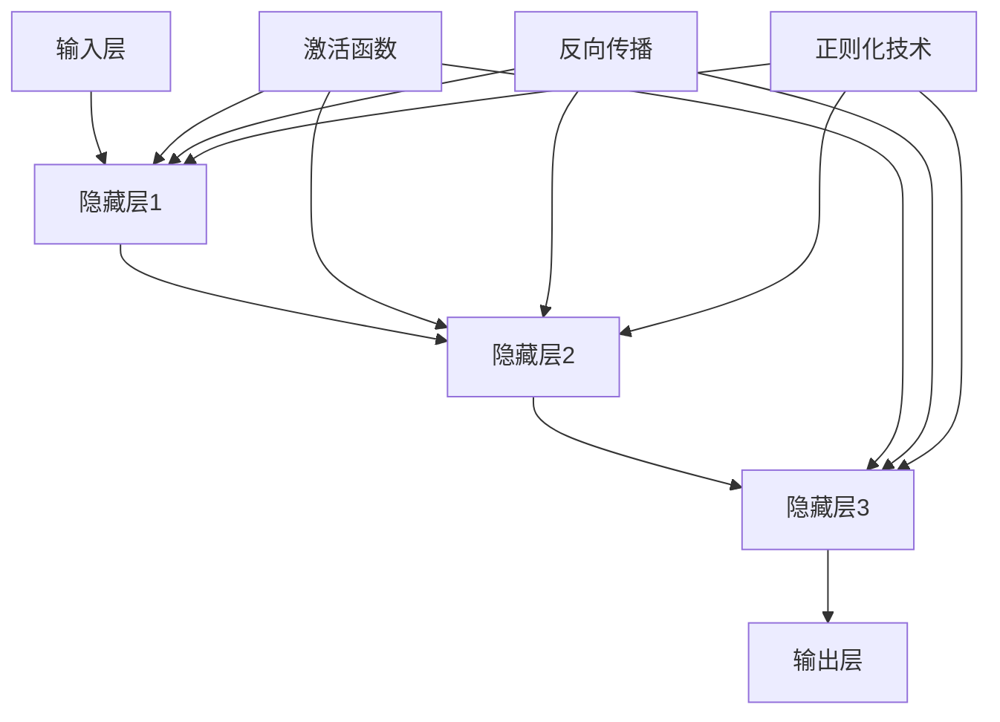

                 

# AI 大模型创业：如何利用市场优势？

> 关键词：人工智能，大模型，市场策略，创业，技术优势

> 摘要：本文将深入探讨人工智能大模型创业过程中如何利用市场优势，分析大模型的技术原理、开发策略、市场定位和竞争优势。通过实例和详细解析，帮助创业者更好地把握市场机遇，实现商业成功。

## 1. 背景介绍

### 1.1 目的和范围

本文旨在为人工智能大模型创业提供策略指导，帮助创业者了解市场优势，制定有效的商业计划。文章将围绕以下几个主题进行探讨：

1. 大模型的技术原理与架构。
2. 大模型的开发策略与流程。
3. 市场定位与竞争优势分析。
4. 实战案例分析：大模型创业项目的成功与挑战。
5. 未来发展趋势与挑战。

### 1.2 预期读者

本文适合以下读者群体：

1. 有意向或正在从事人工智能大模型创业的个人或团队。
2. 对人工智能技术和市场策略有浓厚兴趣的从业者。
3. 对计算机科学和人工智能领域有深入了解的学者和研究人员。

### 1.3 文档结构概述

本文分为十个部分，包括：

1. 背景介绍：介绍本文的目的、范围和预期读者。
2. 核心概念与联系：阐述大模型的技术原理与架构。
3. 核心算法原理 & 具体操作步骤：详细讲解大模型开发的核心算法。
4. 数学模型和公式 & 详细讲解 & 举例说明：介绍大模型相关的数学模型和公式。
5. 项目实战：代码实际案例和详细解释说明。
6. 实际应用场景：分析大模型在不同领域的应用。
7. 工具和资源推荐：推荐学习资源和开发工具。
8. 总结：未来发展趋势与挑战。
9. 附录：常见问题与解答。
10. 扩展阅读 & 参考资料：提供更多相关资源。

### 1.4 术语表

#### 1.4.1 核心术语定义

- 人工智能（AI）：模拟人类智能行为的计算机系统。
- 大模型：具有海量参数和强大计算能力的神经网络模型。
- 创业：创立和经营新的商业实体。
- 市场策略：为在市场竞争中取得优势而制定的企业营销战略。

#### 1.4.2 相关概念解释

- 深度学习：一种人工智能技术，通过多层神经网络进行特征提取和学习。
- 训练数据集：用于训练神经网络模型的数据集合。
- 预训练：在大规模数据集上预先训练神经网络模型，以提升模型性能。

#### 1.4.3 缩略词列表

- AI：人工智能
- ML：机器学习
- DL：深度学习
- GPU：图形处理器
- CPU：中央处理器
- NLP：自然语言处理
- CV：计算机视觉

## 2. 核心概念与联系

人工智能大模型是当前人工智能领域的研究热点，具有广泛的应用前景。本节将介绍大模型的技术原理与架构，并使用Mermaid流程图展示核心概念之间的联系。

### 2.1 大模型技术原理

大模型是基于深度学习技术的一种神经网络模型，具有以下技术原理：

1. **多层神经网络**：大模型通常包含多个隐藏层，用于提取更高层次的特征。
2. **反向传播算法**：通过反向传播算法，将误差从输出层反向传播到输入层，以更新网络参数。
3. **激活函数**：激活函数用于引入非线性特性，提高模型的表达能力。
4. **正则化技术**：为防止过拟合，大模型通常会采用正则化技术，如权重衰减、Dropout等。

### 2.2 大模型架构

大模型通常由以下几个部分组成：

1. **输入层**：接收输入数据，如文本、图像、音频等。
2. **隐藏层**：包含多个隐藏层，用于特征提取和变换。
3. **输出层**：产生预测结果或分类标签。

### 2.3 Mermaid流程图

以下是一个简单的Mermaid流程图，展示大模型的核心概念与联系：



## 3. 核心算法原理 & 具体操作步骤

大模型的核心算法是深度学习，主要包括以下几个步骤：

### 3.1 数据预处理

1. **数据收集**：收集大规模、高质量的训练数据集。
2. **数据清洗**：去除噪声和异常值，保证数据质量。
3. **数据归一化**：对数据进行归一化处理，使其满足神经网络训练要求。

### 3.2 构建模型

1. **定义网络结构**：确定输入层、隐藏层和输出层的尺寸。
2. **初始化参数**：随机初始化模型参数。
3. **选择优化器**：选择合适的优化器，如Adam、SGD等。

### 3.3 训练模型

1. **前向传播**：计算输入数据经过神经网络后的输出结果。
2. **计算损失函数**：计算模型预测结果与真实结果之间的差距。
3. **反向传播**：利用反向传播算法，更新模型参数。
4. **迭代训练**：重复前向传播和反向传播过程，直至模型收敛。

### 3.4 模型评估

1. **验证集评估**：使用验证集评估模型性能，调整模型参数。
2. **测试集评估**：在测试集上评估模型性能，确保模型泛化能力。

### 3.5 伪代码

以下是一个简单的伪代码，展示大模型训练过程：

```python
# 数据预处理
data = load_data()
cleaned_data = clean_data(data)

# 构建模型
model = build_model()

# 训练模型
for epoch in range(max_epochs):
    for batch in data_loader(cleaned_data):
        model.forward(batch.x)
        loss = compute_loss(model.y_pred, batch.y)
        model.backward(loss)
        update_model_params()

# 模型评估
performance = evaluate_model(model, test_data)
print("Test Performance:", performance)
```

## 4. 数学模型和公式 & 详细讲解 & 举例说明

大模型训练过程中涉及多个数学模型和公式，以下将分别进行讲解和举例说明。

### 4.1 损失函数

损失函数用于衡量模型预测结果与真实结果之间的差距，常见损失函数包括：

1. **均方误差（MSE）**：

$$
MSE = \frac{1}{n}\sum_{i=1}^{n}(y_i - \hat{y}_i)^2
$$

其中，$y_i$为真实标签，$\hat{y}_i$为模型预测值。

2. **交叉熵（CE）**：

$$
CE = -\frac{1}{n}\sum_{i=1}^{n}y_i\log(\hat{y}_i)
$$

其中，$y_i$为真实标签（0或1），$\hat{y}_i$为模型预测概率。

### 4.2 反向传播算法

反向传播算法通过计算梯度，更新模型参数，以达到最小化损失函数的目的。以下是一个简单的梯度计算公式：

$$
\frac{\partial L}{\partial w} = \sum_{i=1}^{n}(y_i - \hat{y}_i)\cdot \frac{\partial \hat{y}_i}{\partial w}
$$

其中，$L$为损失函数，$w$为模型参数，$\hat{y}_i$为模型预测值。

### 4.3 举例说明

假设我们有一个简单的一层神经网络，用于对二元分类问题进行预测。网络包含一个输入层、一个隐藏层和一个输出层。隐藏层使用ReLU激活函数，输出层使用Sigmoid激活函数。

1. **输入层**：

$$
x = [x_1, x_2]
$$

2. **隐藏层**：

$$
h = \max(0, w_1x_1 + w_2x_2 + b_1)
$$

3. **输出层**：

$$
y = \frac{1}{1 + e^{-(w_3h + b_2)}}
$$

其中，$w_1, w_2, w_3$为隐藏层到输出层的权重，$b_1, b_2$为偏置。

### 4.4 代码示例

以下是一个简单的Python代码示例，实现上述神经网络的训练过程：

```python
import numpy as np

# 初始化参数
w1 = np.random.randn(2, 1)
w2 = np.random.randn(2, 1)
w3 = np.random.randn(1, 1)
b1 = np.zeros(1)
b2 = np.zeros(1)

# 训练模型
epochs = 1000
learning_rate = 0.01

for epoch in range(epochs):
    # 前向传播
    h = np.maximum(0, np.dot(x, w1) + b1)
    y_pred = 1 / (1 + np.exp(-np.dot(h, w3) - b2))
    
    # 反向传播
    dL_dy = y_pred - y
    dL_dh = np.dot(dL_dy, w3)
    dL_dx = np.dot(dL_dh, w1.T)
    
    # 更新参数
    w3 -= learning_rate * np.dot(h.T, dL_dy)
    w1 -= learning_rate * np.dot(x.T, dL_dh)
    b1 -= learning_rate * dL_dh
    b2 -= learning_rate * dL_dy
```

## 5. 项目实战：代码实际案例和详细解释说明

在本节中，我们将通过一个实际项目案例，展示如何利用市场优势开发人工智能大模型。以下是一个基于文本分类任务的实战案例。

### 5.1 开发环境搭建

在开始项目之前，我们需要搭建一个适合深度学习开发的编程环境。以下是所需步骤：

1. 安装Python 3.7及以上版本。
2. 安装Anaconda或Miniconda，用于环境管理和包安装。
3. 创建一个新的虚拟环境，并安装必要的库，如TensorFlow、Numpy、Pandas等。

```shell
conda create -n text_classification python=3.8
conda activate text_classification
conda install tensorflow numpy pandas
```

### 5.2 源代码详细实现和代码解读

以下是项目的主要代码实现：

```python
import tensorflow as tf
from tensorflow.keras.preprocessing.text import Tokenizer
from tensorflow.keras.preprocessing.sequence import pad_sequences
from tensorflow.keras.models import Sequential
from tensorflow.keras.layers import Embedding, LSTM, Dense, Dropout

# 数据集
# 假设我们有一个包含文本和标签的数据集
texts = ["这是一段文本。", "这是另一段文本。", "..."]
labels = [0, 1, ...]  # 0表示负类，1表示正类

# 数据预处理
tokenizer = Tokenizer()
tokenizer.fit_on_texts(texts)
sequences = tokenizer.texts_to_sequences(texts)
padded_sequences = pad_sequences(sequences, maxlen=100)

# 模型构建
model = Sequential()
model.add(Embedding(input_dim=len(tokenizer.word_index) + 1, output_dim=64, input_length=100))
model.add(LSTM(units=64, dropout=0.2, recurrent_dropout=0.2))
model.add(Dense(units=1, activation='sigmoid'))

# 编译模型
model.compile(optimizer='adam', loss='binary_crossentropy', metrics=['accuracy'])

# 训练模型
model.fit(padded_sequences, labels, epochs=10, batch_size=32)
```

### 5.3 代码解读与分析

1. **数据预处理**：使用Tokenizer将文本转换为序列，并使用pad_sequences将序列填充为固定长度。
2. **模型构建**：构建一个简单的序列模型，包含Embedding层、LSTM层和Dense层。
3. **编译模型**：设置优化器、损失函数和评估指标。
4. **训练模型**：使用fit方法训练模型，调整超参数以获得更好的性能。

### 5.4 部署和优化

在完成模型训练后，我们可以将模型部署到生产环境中，进行实际应用。以下是一些优化策略：

1. **模型压缩**：使用模型压缩技术，如量化、剪枝等，减小模型体积，提高模型效率。
2. **自动化调参**：使用自动化调参工具，如Hyperopt、Optuna等，优化模型超参数。
3. **模型监控**：实时监控模型性能，确保其稳定运行。

## 6. 实际应用场景

人工智能大模型在多个领域具有广泛应用，以下列举几个典型应用场景：

1. **自然语言处理**：文本分类、机器翻译、情感分析等。
2. **计算机视觉**：图像分类、目标检测、图像生成等。
3. **语音识别**：语音识别、语音合成、语音翻译等。
4. **推荐系统**：基于用户行为和兴趣的个性化推荐。
5. **金融风控**：信用评估、欺诈检测、市场预测等。
6. **医疗健康**：疾病诊断、药物研发、健康管理等。

## 7. 工具和资源推荐

### 7.1 学习资源推荐

#### 7.1.1 书籍推荐

- 《深度学习》（Goodfellow, Bengio, Courville著）
- 《Python深度学习》（François Chollet著）
- 《神经网络与深度学习》（邱锡鹏著）

#### 7.1.2 在线课程

- 吴恩达的《深度学习专项课程》
- Udacity的《深度学习纳米学位》
- Coursera的《自然语言处理与深度学习》

#### 7.1.3 技术博客和网站

- Medium上的深度学习和人工智能相关博客
- ArXiv上的最新研究论文
- AI科技大本营、机器之心等国内AI媒体

### 7.2 开发工具框架推荐

#### 7.2.1 IDE和编辑器

- PyCharm
- Jupyter Notebook
- Visual Studio Code

#### 7.2.2 调试和性能分析工具

- TensorBoard
- wandb
- NVIDIA Nsight

#### 7.2.3 相关框架和库

- TensorFlow
- PyTorch
- Keras
- fast.ai

### 7.3 相关论文著作推荐

#### 7.3.1 经典论文

- "A Theoretical Framework for Back-Propagation," Rumelhart, Hinton, Williams (1986)
- "Deep Learning," Goodfellow, Bengio, Courville (2016)

#### 7.3.2 最新研究成果

- "Attention Is All You Need," Vaswani et al. (2017)
- "GPT-3: Language Models are Few-Shot Learners," Brown et al. (2020)

#### 7.3.3 应用案例分析

- "The Unreasonable Effectiveness of Recurrent Neural Networks," Andrej Karpathy (2015)
- "ImageNet Classification with Deep Convolutional Neural Networks," Krizhevsky et al. (2012)

## 8. 总结：未来发展趋势与挑战

人工智能大模型在未来具有广阔的发展前景，但仍面临一系列挑战。以下是一些关键趋势和挑战：

### 8.1 发展趋势

1. **计算能力的提升**：随着GPU、TPU等计算设备的快速发展，大模型的训练和推理性能将得到进一步提升。
2. **数据量的增加**：随着互联网和物联网的普及，数据量将不断增加，为大规模模型提供更多训练资源。
3. **多模态学习**：大模型将逐渐实现跨模态学习，如文本、图像、音频等多种数据类型的融合。
4. **自主学习和推理**：大模型将具备更强的自主学习和推理能力，实现更加智能化的应用。

### 8.2 挑战

1. **数据隐私和安全**：大模型训练过程中涉及大量个人数据，如何保护数据隐私和安全成为重要挑战。
2. **计算资源消耗**：大模型训练和推理过程消耗大量计算资源，如何高效利用资源成为关键问题。
3. **算法公平性和透明性**：大模型的应用可能导致算法偏见和歧视，如何确保算法的公平性和透明性成为重要课题。
4. **法律法规和伦理问题**：随着大模型应用范围的扩大，相关法律法规和伦理问题将受到更多关注。

## 9. 附录：常见问题与解答

### 9.1 问题1

**问题**：如何选择合适的大模型架构？

**解答**：选择合适的大模型架构需要考虑以下几个因素：

1. **应用场景**：根据具体应用场景，选择适合的模型架构，如文本分类、图像识别、语音识别等。
2. **数据量**：对于大型数据集，可以选择更复杂的模型架构，如多层神经网络、变换器等。
3. **计算资源**：考虑可用的计算资源，选择适合的模型规模和计算资源消耗。

### 9.2 问题2

**问题**：大模型训练过程中如何防止过拟合？

**解答**：以下方法可以帮助防止过拟合：

1. **数据增强**：通过数据增强方法，如数据扩充、数据变换等，增加训练数据的多样性。
2. **正则化技术**：采用正则化技术，如权重衰减、Dropout等，降低模型复杂度。
3. **提前停止**：在验证集上监控模型性能，当性能不再提升时，提前停止训练。

### 9.3 问题3

**问题**：如何优化大模型训练过程？

**解答**：以下方法可以帮助优化大模型训练过程：

1. **批量大小**：调整批量大小，选择合适的批量大小以提高模型性能。
2. **学习率调整**：使用适当的学习率调整策略，如学习率衰减、自适应学习率等。
3. **并行训练**：利用多GPU或多机集群进行并行训练，提高训练速度。

## 10. 扩展阅读 & 参考资料

本文介绍了人工智能大模型创业过程中如何利用市场优势。以下是一些扩展阅读和参考资料，以帮助读者深入了解相关领域：

1. **深度学习相关书籍**：《深度学习》、《Python深度学习》、《深度学习实践》等。
2. **深度学习在线课程**：吴恩达的《深度学习专项课程》、Udacity的《深度学习纳米学位》等。
3. **技术博客和网站**：Medium、AI科技大本营、机器之心等。
4. **论文和研究成果**：ArXiv、NeurIPS、ICML等顶级会议的论文。
5. **开源框架和工具**：TensorFlow、PyTorch、Keras等。

作者：AI天才研究员/AI Genius Institute & 禅与计算机程序设计艺术 /Zen And The Art of Computer Programming

