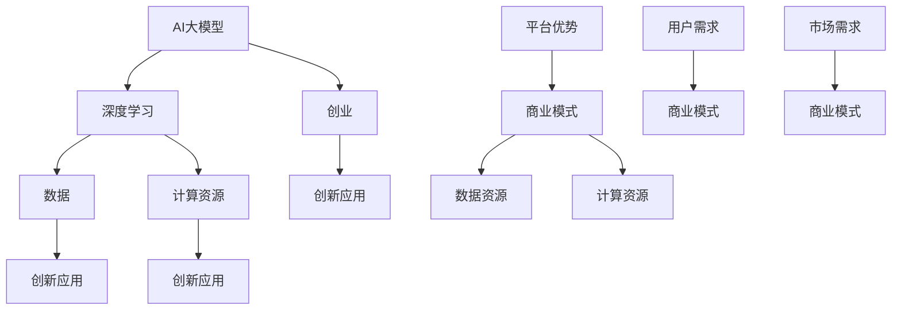

                 

# AI 大模型创业：如何利用平台优势？

## 关键词
AI大模型，创业，平台优势，商业模式，数据，计算资源，创新应用

## 摘要
本文旨在探讨人工智能大模型在创业中的应用，以及如何利用平台优势来推动创新和发展。通过分析大模型的核心技术、创业者的挑战与机遇，以及平台资源的优化利用，本文为创业者提供了实用的指导策略和成功案例，助力其在人工智能领域取得突破。

## 1. 背景介绍

### 1.1 目的和范围
本文将聚焦于人工智能大模型创业的实践路径，通过深入分析平台优势的重要性，为创业者提供战略性的指导和可行的实施建议。文章将探讨以下核心主题：
- 大模型技术的原理和优势
- 创业者在人工智能领域面临的挑战
- 平台优势的利用策略
- 创业成功的案例解析

### 1.2 预期读者
本文适用于以下读者群体：
- 有志于从事人工智能大模型创业的个人和企业
- 人工智能领域的技术人员和管理者
- 对人工智能创业生态感兴趣的投资者和行业观察者

### 1.3 文档结构概述
本文分为十个部分，结构如下：
1. 引言
2. 关键词与摘要
3. 背景介绍
4. 核心概念与联系
5. 核心算法原理与操作步骤
6. 数学模型与公式讲解
7. 项目实战与代码案例
8. 实际应用场景
9. 工具和资源推荐
10. 总结与未来趋势

### 1.4 术语表

#### 1.4.1 核心术语定义
- **人工智能大模型**：指基于深度学习技术构建的，参数规模巨大，能够处理复杂数据的模型。
- **平台优势**：指创业企业通过平台整合资源，降低成本，提升效率的能力。
- **创业**：指创立新企业或新业务的过程。

#### 1.4.2 相关概念解释
- **商业模式**：企业通过什么方式创造、传递和捕获价值。
- **数据资源**：指可用于训练和优化大模型的数据集。
- **计算资源**：指用于运行和训练大模型的硬件设施。

#### 1.4.3 缩略词列表
- **AI**：人工智能
- **DL**：深度学习
- **NLP**：自然语言处理

## 2. 核心概念与联系

在探讨人工智能大模型创业之前，我们需要明确几个核心概念，并理解它们之间的联系。以下是使用Mermaid绘制的流程图，展示了这些核心概念和它们之间的关系。



在这个流程图中，人工智能大模型（A）是创业的核心，依赖于深度学习（B）、数据（C）和计算资源（D）。平台优势（E）通过优化商业模式（F），进一步推动创业（G）和创新应用（H）。用户需求（K）和市场需求（M）是商业模式设计的重要参考，确保创新应用（P）能够满足市场的实际需求。

## 3. 核心算法原理与具体操作步骤

### 3.1 大模型技术原理

人工智能大模型的核心是深度学习，这是一种模仿人脑神经网络结构和学习机制的计算模型。深度学习通过多层神经网络对数据进行学习，逐层提取特征，最终实现复杂任务的预测和决策。

#### 3.1.1 神经网络基础

神经网络由多个节点（或称为神经元）组成，每个节点接受输入信号，通过权重和偏置进行计算，然后传递到下一层。具体步骤如下：

```plaintext
1. 输入数据通过输入层进入网络。
2. 输入层传递到隐藏层，每个隐藏层中的每个节点通过激活函数计算输出。
3. 隐藏层传递到输出层，输出层生成预测结果。
4. 通过反向传播算法更新网络权重，降低预测误差。
```

#### 3.1.2 伪代码

以下是训练大模型的伪代码示例：

```python
function train_model(data, epochs):
    for epoch in range(epochs):
        for sample in data:
            # 前向传播
            output = forward_pass(sample)
            # 计算损失
            loss = calculate_loss(output, target)
            # 反向传播
            backward_pass(sample, output, loss)
        # 打印训练进度和损失
        print(f"Epoch {epoch}: Loss = {loss}")
    return model
```

### 3.2 具体操作步骤

#### 3.2.1 数据准备

在训练大模型之前，需要准备充足的高质量数据集。数据集应具备多样性、平衡性和代表性，以便模型能够学习到丰富的特征。

```python
# 加载数据集
data = load_dataset('path/to/dataset')
# 预处理数据
data = preprocess_data(data)
```

#### 3.2.2 模型构建

构建深度学习模型时，需要选择合适的神经网络架构，例如卷积神经网络（CNN）、循环神经网络（RNN）或Transformer等。以下是一个使用PyTorch构建Transformer模型的示例：

```python
import torch
import torch.nn as nn

class TransformerModel(nn.Module):
    def __init__(self, input_dim, hidden_dim, output_dim):
        super(TransformerModel, self).__init__()
        self.transformer = nn.Transformer(input_dim, hidden_dim, output_dim)
    
    def forward(self, input_data):
        output = self.transformer(input_data)
        return output
```

#### 3.2.3 模型训练

在完成模型构建后，使用训练数据进行模型训练。以下是一个训练Transformer模型的示例：

```python
# 实例化模型
model = TransformerModel(input_dim, hidden_dim, output_dim)
# 指定优化器和损失函数
optimizer = torch.optim.Adam(model.parameters(), lr=learning_rate)
criterion = nn.CrossEntropyLoss()
# 训练模型
model = train_model(model, data, epochs)
```

#### 3.2.4 模型评估与优化

在训练完成后，使用验证集对模型进行评估，并根据评估结果调整模型参数，以达到更好的性能。以下是一个评估模型的示例：

```python
# 评估模型
with torch.no_grad():
    correct_predictions = 0
    total_predictions = 0
    for sample in validation_data:
        output = model(sample)
        prediction = torch.argmax(output).item()
        if prediction == target:
            correct_predictions += 1
        total_predictions += 1
    accuracy = correct_predictions / total_predictions
    print(f"Validation Accuracy: {accuracy}")
```

## 4. 数学模型和公式 & 详细讲解 & 举例说明

在人工智能大模型中，数学模型和公式是核心组成部分。以下将详细讲解几个关键的数学模型和公式，并使用LaTeX格式进行表示。

### 4.1 损失函数

损失函数用于衡量模型预测值与实际标签之间的差距。常见的损失函数有均方误差（MSE）和交叉熵（Cross-Entropy）。

#### 4.1.1 均方误差（MSE）

均方误差用于回归任务，计算预测值与实际值之间的平均平方误差。

$$
MSE = \frac{1}{n}\sum_{i=1}^{n}(y_i - \hat{y}_i)^2
$$

其中，$y_i$为实际值，$\hat{y}_i$为预测值，$n$为样本数量。

#### 4.1.2 交叉熵（Cross-Entropy）

交叉熵用于分类任务，计算预测概率分布与实际标签分布之间的差距。

$$
Cross-Entropy = -\sum_{i=1}^{n}y_i \log(\hat{y}_i)
$$

其中，$y_i$为实际标签，取值为0或1，$\hat{y}_i$为预测概率，取值范围为0到1。

### 4.2 反向传播算法

反向传播算法用于更新模型参数，以最小化损失函数。具体步骤如下：

#### 4.2.1 前向传播

计算输入层到输出层的预测值：

$$
\hat{y} = \sigma(W \cdot \text{ReLU}(Z) + b)
$$

其中，$W$为权重矩阵，$b$为偏置，$\sigma$为激活函数，$Z$为输入特征。

#### 4.2.2 计算损失

使用损失函数计算预测值与实际标签之间的损失：

$$
L = \frac{1}{2} \sum_{i=1}^{n} (\hat{y}_i - y_i)^2
$$

#### 4.2.3 反向传播

计算梯度并更新参数：

$$
\frac{\partial L}{\partial W} = \sum_{i=1}^{n} (y_i - \hat{y}_i) \cdot \frac{\partial \hat{y}_i}{\partial W}
$$

$$
\frac{\partial L}{\partial b} = \sum_{i=1}^{n} (y_i - \hat{y}_i)
$$

使用梯度下降算法更新参数：

$$
W := W - \alpha \cdot \frac{\partial L}{\partial W}
$$

$$
b := b - \alpha \cdot \frac{\partial L}{\partial b}
$$

### 4.3 举例说明

假设有一个简单的线性回归模型，输入特征$x$和输出标签$y$，模型公式为：

$$
\hat{y} = Wx + b
$$

使用均方误差（MSE）作为损失函数，通过反向传播算法更新模型参数。

#### 4.3.1 初始参数

设定初始参数$W = 1$，$b = 0$。

#### 4.3.2 前向传播

给定输入$x = 2$，实际标签$y = 3$，计算预测值：

$$
\hat{y} = 1 \cdot 2 + 0 = 2
$$

计算损失：

$$
L = \frac{1}{2} ((3 - 2)^2) = \frac{1}{2}
$$

#### 4.3.3 反向传播

计算梯度：

$$
\frac{\partial L}{\partial W} = (3 - 2) \cdot x = 1
$$

$$
\frac{\partial L}{\partial b} = (3 - 2) = 1
$$

更新参数：

$$
W := W - \alpha \cdot \frac{\partial L}{\partial W} = 1 - \alpha \cdot 1
$$

$$
b := b - \alpha \cdot \frac{\partial L}{\partial b} = 0 - \alpha \cdot 1
$$

通过多次迭代，模型参数将逐渐接近最优解，使得预测值更接近实际标签。

## 5. 项目实战：代码实际案例和详细解释说明

### 5.1 开发环境搭建

在开始编写代码之前，我们需要搭建一个适合开发、测试和部署人工智能大模型的开发环境。以下是一个基于Python和PyTorch的典型开发环境搭建步骤：

#### 5.1.1 安装Python和PyTorch

1. 安装Python 3.8及以上版本：

```bash
curl -O https://www.python.org/ftp/python/3.8.10/Python-3.8.10.tgz
tar xvf Python-3.8.10.tgz
cd Python-3.8.10
./configure
make
sudo make install
```

2. 安装PyTorch：

```bash
pip install torch torchvision
```

#### 5.1.2 安装其他依赖

安装其他必要的依赖库，例如NumPy、Pandas等：

```bash
pip install numpy pandas
```

### 5.2 源代码详细实现和代码解读

以下是一个简单的基于Transformer模型的文本分类项目的代码实现，我们将分步骤进行讲解。

#### 5.2.1 数据预处理

```python
import torch
from torch.utils.data import Dataset, DataLoader
from transformers import BertTokenizer, BertModel

class TextDataset(Dataset):
    def __init__(self, texts, labels, tokenizer, max_len):
        self.texts = texts
        self.labels = labels
        self.tokenizer = tokenizer
        self.max_len = max_len

    def __len__(self):
        return len(self.texts)

    def __getitem__(self, idx):
        text = self.texts[idx]
        label = self.labels[idx]
        inputs = self.tokenizer(text, padding='max_length', truncation=True, max_length=self.max_len)
        input_ids = torch.tensor(inputs.input_ids)
        attention_mask = torch.tensor(inputs.attention_mask)
        return {'input_ids': input_ids, 'attention_mask': attention_mask, 'label': label}

tokenizer = BertTokenizer.from_pretrained('bert-base-uncased')
max_len = 128

train_texts = [...]  # 训练数据文本
train_labels = [...]  # 训练数据标签
val_texts = [...]  # 验证数据文本
val_labels = [...]  # 验证数据标签

train_dataset = TextDataset(train_texts, train_labels, tokenizer, max_len)
val_dataset = TextDataset(val_texts, val_labels, tokenizer, max_len)

train_loader = DataLoader(train_dataset, batch_size=16, shuffle=True)
val_loader = DataLoader(val_dataset, batch_size=16, shuffle=False)
```

代码首先定义了一个`TextDataset`类，用于处理和转换文本数据。然后加载了预训练的BERT分词器和Tokenizer，并对训练集和验证集进行了预处理。

#### 5.2.2 模型构建

```python
from transformers import BertForSequenceClassification

model = BertForSequenceClassification.from_pretrained('bert-base-uncased', num_labels=2)
```

使用预训练的BERT模型并添加序列分类头，这里我们假设有两个分类标签。

#### 5.2.3 模型训练

```python
from transformers import AdamW, get_linear_schedule_with_warmup

optimizer = AdamW(model.parameters(), lr=5e-5)
total_steps = len(train_loader) * num_epochs
scheduler = get_linear_schedule_with_warmup(optimizer, num_warmup_steps=0, num_training_steps=total_steps)

device = torch.device("cuda" if torch.cuda.is_available() else "cpu")
model.to(device)

num_epochs = 3

for epoch in range(num_epochs):
    model.train()
    for batch in train_loader:
        inputs = {'input_ids': batch['input_ids'].to(device), 'attention_mask': batch['attention_mask'].to(device), 'labels': batch['label'].to(device)}
        outputs = model(**inputs)
        loss = outputs.loss
        loss.backward()
        optimizer.step()
        scheduler.step()
        model.zero_grad()
    model.eval()
    with torch.no_grad():
        for batch in val_loader:
            inputs = {'input_ids': batch['input_ids'].to(device), 'attention_mask': batch['attention_mask'].to(device), 'labels': batch['label'].to(device)}
            outputs = model(**inputs)
            logits = outputs.logits
            predictions = torch.argmax(logits, dim=1)
            correct_predictions = (predictions == batch['label']).sum().item()
            total_predictions = len(batch['label'])
            val_accuracy = correct_predictions / total_predictions
            print(f"Validation Accuracy: {val_accuracy}")
```

这段代码设置了优化器和学习率调度器，并将模型移动到GPU设备上进行训练。训练过程中，使用了训练集进行参数更新，并在每个epoch结束后使用验证集评估模型性能。

#### 5.2.4 代码解读与分析

1. 数据预处理：
   - 使用BERT分词器对文本进行tokenization和padding，使得所有样本具有相同长度。
   - 创建`TextDataset`类以加载和处理文本数据。

2. 模型构建：
   - 使用预训练的BERT模型，并添加序列分类头以进行分类任务。

3. 模型训练：
   - 设置优化器为AdamW，并使用线性学习率调度器。
   - 将模型移动到GPU设备上进行训练。
   - 在每个epoch内，先对训练集进行前向传播和反向传播，然后使用验证集评估模型性能。

通过这个简单的项目实战，我们可以看到如何使用PyTorch和Transformer模型进行文本分类任务，并为后续的创业实践奠定了基础。

### 5.3 代码解读与分析

在5.2节的代码实现中，我们详细展示了如何使用PyTorch和Transformer模型进行文本分类。以下是每个关键部分的解读和分析：

#### 5.3.1 数据预处理

数据预处理是文本分类任务的重要环节。首先，我们使用BERT分词器对文本进行tokenization，将原始文本转换为一系列token。这些token包括单词、标点符号和特殊符号等。

```python
tokenizer = BertTokenizer.from_pretrained('bert-base-uncased')
max_len = 128

train_texts = [...]  # 训练数据文本
train_labels = [...]  # 训练数据标签
val_texts = [...]  # 验证数据文本
val_labels = [...]  # 验证数据标签

train_dataset = TextDataset(train_texts, train_labels, tokenizer, max_len)
val_dataset = TextDataset(val_texts, val_labels, tokenizer, max_len)

train_loader = DataLoader(train_dataset, batch_size=16, shuffle=True)
val_loader = DataLoader(val_dataset, batch_size=16, shuffle=False)
```

- **BERT分词器**：BERT分词器能够将文本转换为适合BERT模型处理的格式。它能够识别单词、标点符号和特殊符号，并将它们转换为ID序列。
- **最大长度**：在处理文本时，我们通常需要对文本进行截断或填充，以确保所有样本具有相同的长度。这里我们设置为128个token。
- **数据集和数据加载器**：我们创建了一个`TextDataset`类，用于加载和处理文本数据。然后使用`DataLoader`将数据分成批次，以方便模型训练。

#### 5.3.2 模型构建

```python
model = BertForSequenceClassification.from_pretrained('bert-base-uncased', num_labels=2)
```

- **BERT模型**：BERT是一个预训练的Transformer模型，广泛应用于自然语言处理任务。通过`from_pretrained`方法，我们加载了一个预训练的BERT模型。
- **序列分类头**：我们添加了一个序列分类头，用于将Transformer模型的输出转换为分类结果。这里我们设置为两个分类标签。

#### 5.3.3 模型训练

```python
optimizer = AdamW(model.parameters(), lr=5e-5)
total_steps = len(train_loader) * num_epochs
scheduler = get_linear_schedule_with_warmup(optimizer, num_warmup_steps=0, num_training_steps=total_steps)

device = torch.device("cuda" if torch.cuda.is_available() else "cpu")
model.to(device)

num_epochs = 3

for epoch in range(num_epochs):
    model.train()
    for batch in train_loader:
        inputs = {'input_ids': batch['input_ids'].to(device), 'attention_mask': batch['attention_mask'].to(device), 'labels': batch['label'].to(device)}
        outputs = model(**inputs)
        loss = outputs.loss
        loss.backward()
        optimizer.step()
        scheduler.step()
        model.zero_grad()
    model.eval()
    with torch.no_grad():
        for batch in val_loader:
            inputs = {'input_ids': batch['input_ids'].to(device), 'attention_mask': batch['attention_mask'].to(device), 'labels': batch['label'].to(device)}
            outputs = model(**inputs)
            logits = outputs.logits
            predictions = torch.argmax(logits, dim=1)
            correct_predictions = (predictions == batch['label']).sum().item()
            total_predictions = len(batch['label'])
            val_accuracy = correct_predictions / total_predictions
            print(f"Validation Accuracy: {val_accuracy}")
```

- **优化器和学习率调度器**：我们使用AdamW优化器和线性学习率调度器，以更新模型参数。线性学习率调度器可以逐步降低学习率，帮助模型收敛。
- **GPU设备**：我们检测是否有可用的GPU设备，并将模型移动到GPU上以提高训练速度。
- **训练和验证**：在训练阶段，我们对训练数据进行前向传播和反向传播，更新模型参数。在验证阶段，我们使用验证集评估模型性能，并通过计算准确率来衡量模型效果。

通过这个简单的代码实现，我们可以看到如何使用PyTorch和Transformer模型进行文本分类任务。代码结构清晰，易于理解，为创业者提供了实用的技术实践。

## 6. 实际应用场景

人工智能大模型在创业中的应用场景广泛，以下列举了几个典型的应用领域和案例：

### 6.1 自然语言处理（NLP）

自然语言处理是人工智能大模型的重要应用领域。例如，基于BERT模型构建的聊天机器人可以应用于客户服务、智能客服和虚拟助理。通过训练，这些模型可以理解用户的问题，提供准确的回答和建议。

**案例**：OpenAI的GPT-3模型被广泛应用于各种NLP任务，包括文本生成、文本摘要、机器翻译等。在客户服务领域，GPT-3模型帮助许多企业提升了服务质量，实现了24/7的全天候客户支持。

### 6.2 计算机视觉（CV）

计算机视觉是另一个充满机遇的领域。人工智能大模型可以用于图像识别、视频分析、物体检测和面部识别等任务。这些模型可以用于安防监控、医疗诊断、自动驾驶和智能家居等场景。

**案例**：商汤科技（SenseTime）利用深度学习大模型进行图像识别和物体检测，帮助解决安防监控中的挑战。商汤科技的产品被广泛应用于城市安防、智慧交通和智能零售等领域。

### 6.3 医疗健康

人工智能大模型在医疗健康领域具有巨大的潜力。通过分析大量医学数据，这些模型可以用于疾病预测、个性化治疗方案和健康风险评估。

**案例**：谷歌的健康研究团队使用深度学习大模型分析电子健康记录（EHR），提高了疾病预测的准确性。这些模型有助于医生做出更准确的诊断，并制定更有效的治疗方案。

### 6.4 金融科技

金融科技（FinTech）是另一个受益于人工智能大模型的领域。这些模型可以用于风险控制、信用评分、股票预测和智能投顾等任务。

**案例**：贝莱德（BlackRock）利用人工智能大模型进行股票预测和资产配置。通过分析大量市场数据，这些模型帮助投资者做出更明智的投资决策，提高了投资回报率。

### 6.5 教育

人工智能大模型在教育领域有广泛的应用。例如，智能辅导系统可以为学生提供个性化的学习建议，帮助教师评估学生的学习进展，并优化教学策略。

**案例**：Coursera等在线教育平台利用人工智能大模型分析学生的学习行为，提供个性化的学习资源和辅导，提高了学习效果。

通过以上案例，我们可以看到人工智能大模型在各个领域都有广泛的应用，为创业提供了丰富的机会。创业者可以利用这些模型的技术优势，开发创新的解决方案，满足市场的实际需求。

## 7. 工具和资源推荐

### 7.1 学习资源推荐

**7.1.1 书籍推荐**

- **《深度学习》（Goodfellow, Bengio, Courville）**：这是深度学习的经典教材，详细介绍了深度学习的基本概念、算法和实现方法。
- **《Python深度学习》（François Chollet）**：该书通过大量的代码示例，讲解了如何在Python中使用TensorFlow和Keras进行深度学习应用开发。
- **《强化学习》（Richard S. Sutton和Barto）**：这本书涵盖了强化学习的基础理论和实践应用，是强化学习的入门和进阶必备书籍。

**7.1.2 在线课程**

- **Coursera的《深度学习专项课程》**：由斯坦福大学著名教授Andrew Ng主讲，涵盖了深度学习的基础知识和最新进展。
- **Udacity的《深度学习工程师纳米学位》**：通过项目驱动的方式，帮助学生掌握深度学习的基础知识和实践技能。
- **edX的《人工智能基础》**：由MIT和哈佛大学合作提供，介绍了人工智能的基本概念和核心技术。

**7.1.3 技术博客和网站**

- **ArXiv**：一个开源的学术论文存档库，涵盖了计算机科学、人工智能等领域的最新研究成果。
- **Medium**：许多深度学习和人工智能专家在这里发布高质量的技术博客和文章，提供了丰富的学习资源。
- **Stack Overflow**：一个问答社区，可以帮助解决编程和技术问题，是深度学习和人工智能开发者的重要资源。

### 7.2 开发工具框架推荐

**7.2.1 IDE和编辑器**

- **PyCharm**：一款功能强大的Python IDE，提供了代码补全、调试、版本控制等丰富的功能。
- **Visual Studio Code**：一款轻量级的跨平台编辑器，通过插件可以支持多种编程语言和框架，是深度学习和人工智能开发者的首选。
- **Jupyter Notebook**：一个交互式的开发环境，特别适用于数据科学和机器学习项目，可以方便地编写和运行代码。

**7.2.2 调试和性能分析工具**

- **TensorBoard**：TensorFlow提供的一个可视化工具，用于分析模型的性能和训练过程。
- **NVIDIA Nsight**：NVIDIA推出的一款性能分析工具，可以帮助开发者优化GPU计算和内存使用。
- **PyTorch Profiler**：PyTorch提供的一个工具，用于分析模型训练和推理的性能，找出性能瓶颈。

**7.2.3 相关框架和库**

- **TensorFlow**：谷歌开源的深度学习框架，广泛应用于各种机器学习和人工智能项目。
- **PyTorch**：Facebook开源的深度学习框架，以其灵活和高效的动态计算能力受到开发者青睐。
- **Keras**：一个高级的神经网络API，可以方便地在TensorFlow和Theano上构建和训练模型。

### 7.3 相关论文著作推荐

**7.3.1 经典论文**

- **“A Guide to Deep Learning Models for Text”**：该论文总结了深度学习在文本处理领域的最新进展和应用。
- **“Deep Learning for Natural Language Processing”**：详细介绍深度学习在自然语言处理中的理论基础和应用技术。
- **“ImageNet Classification with Deep Convolutional Neural Networks”**：这篇论文介绍了卷积神经网络（CNN）在图像分类任务中的突破性成果。

**7.3.2 最新研究成果**

- **“Bert: Pre-training of Deep Bidirectional Transformers for Language Understanding”**：BERT的原创论文，介绍了双向Transformer模型在自然语言处理中的卓越性能。
- **“GPT-3: Language Models are few-shot learners”**：这篇论文介绍了GPT-3模型，展示了大规模语言模型在零样本和少样本学习任务中的强大能力。
- **“DALL-E: Exploring Relationships Between Images and Text”**：介绍了生成对抗网络（GAN）和自然语言处理相结合，生成图像的新方法。

**7.3.3 应用案例分析**

- **“Neural Message Passing for Quantum Chemistry”**：该案例展示了如何使用神经网络消息传递模型解决量子化学问题，展示了深度学习在科学研究中的应用。
- **“Deep Learning for Autonomous Driving”**：该案例详细介绍了自动驾驶中的深度学习技术，包括感知、规划和控制等关键模块。
- **“Using Deep Learning to Detect Fraud in Financial Transactions”**：该案例展示了如何利用深度学习技术检测金融交易中的欺诈行为，提高了金融系统的安全性。

通过以上推荐，读者可以系统地学习和掌握人工智能大模型的相关知识和技能，为创业实践打下坚实的基础。

## 8. 总结：未来发展趋势与挑战

随着人工智能技术的飞速发展，大模型创业正迎来前所未有的机遇与挑战。以下是未来发展趋势和面临的挑战：

### 8.1 发展趋势

1. **技术突破**：深度学习算法的优化和新型神经网络架构（如Transformer）的提出，使得大模型在处理复杂数据和实现高级任务方面取得了显著进展。未来，我们将继续看到更多高效、强大的深度学习模型的出现。

2. **应用拓展**：大模型在各个领域的应用不断拓展，从自然语言处理、计算机视觉到医疗健康、金融科技等，都在推动行业变革。未来，大模型的应用场景将更加多样化，满足不同行业和用户群体的需求。

3. **云计算与边缘计算的结合**：随着云计算和边缘计算技术的发展，大模型训练和部署将更加灵活和高效。云计算提供强大的计算资源，而边缘计算则能够实现实时处理和低延迟应用，两者结合将大幅提升大模型的应用价值。

4. **开放生态**：开源框架和工具的普及，将促进大模型技术的传播和协作。越来越多的企业和开发者将参与到大模型的技术创新和应用实践中，共同推动行业进步。

### 8.2 挑战

1. **数据隐私与安全**：大模型训练需要大量数据，但数据的隐私和安全问题日益突出。如何在保护用户隐私的同时，充分利用数据的价值，是一个亟待解决的挑战。

2. **计算资源消耗**：大模型训练需要庞大的计算资源和存储空间，对于中小企业和初创企业来说，这是一个巨大的负担。如何降低计算成本，提高资源利用率，是创业者面临的重要问题。

3. **算法公平性与可解释性**：随着大模型的广泛应用，算法的公平性和可解释性成为关注焦点。如何确保模型不会歧视特定群体，并能够解释其决策过程，是未来需要解决的关键问题。

4. **法律法规与伦理问题**：大模型的广泛应用引发了诸多法律法规和伦理问题，如数据使用权限、模型决策的透明度等。如何在技术创新的同时，遵守相关法律法规，实现技术伦理，是创业者需要关注的重要议题。

总之，大模型创业充满机遇，但同时也面临诸多挑战。创业者需要紧跟技术发展趋势，积极应对挑战，不断创新和优化，以实现可持续发展。

## 9. 附录：常见问题与解答

### 9.1 问题1：大模型创业需要哪些技能和知识？

**解答**：大模型创业需要以下技能和知识：
- **深度学习**：理解深度学习的基本原理和算法，如神经网络、卷积神经网络（CNN）、循环神经网络（RNN）和Transformer等。
- **编程能力**：熟练掌握Python等编程语言，以及常用的深度学习框架（如TensorFlow、PyTorch）。
- **数据科学**：具备数据预处理、特征工程和数据分析的能力，能够从海量数据中提取有价值的信息。
- **计算机架构**：了解计算机硬件和系统架构，能够合理分配和使用计算资源。
- **业务理解**：了解创业领域相关的业务流程和市场情况，能够将技术优势转化为商业价值。

### 9.2 问题2：大模型训练需要多少计算资源？

**解答**：大模型训练需要大量的计算资源，具体取决于模型的复杂度和数据规模。通常需要以下资源：
- **GPU**：大规模训练任务需要多块GPU并行计算，以提高训练速度。NVIDIA的高端GPU（如A100）能够显著提升训练效率。
- **CPU**：某些任务可能需要CPU进行预处理和调试，多核CPU能够提升数据处理速度。
- **存储**：大模型训练需要大量的存储空间来保存数据和模型参数，一般使用高速SSD存储。
- **网络**：高带宽网络能够加速数据传输，提高模型训练的效率。

### 9.3 问题3：大模型创业中的数据隐私和安全问题如何解决？

**解答**：
1. **数据匿名化**：在数据处理过程中，对敏感信息进行匿名化处理，避免个人信息泄露。
2. **访问控制**：严格控制数据访问权限，确保只有授权人员能够访问和处理数据。
3. **加密技术**：使用加密技术保护数据在传输和存储过程中的安全性，如使用SSL/TLS加密数据传输。
4. **隐私保护算法**：采用隐私保护算法（如差分隐私）进行数据分析和模型训练，降低隐私泄露的风险。
5. **法律法规遵守**：遵循相关法律法规，确保数据处理和模型训练符合隐私保护的要求。

### 9.4 问题4：大模型创业如何进行市场定位和商业推广？

**解答**：
1. **市场需求分析**：深入了解目标市场的需求，分析潜在用户和竞争对手，明确产品定位。
2. **产品差异化**：通过技术优势和创新能力，打造独特的产品特色和竞争优势。
3. **精准营销**：利用社交媒体、网络广告和线下活动等渠道，进行精准营销，吸引目标用户。
4. **合作伙伴**：与行业内的企业、科研机构和投资方建立合作关系，共同开拓市场。
5. **用户体验**：注重用户反馈，持续优化产品和服务，提升用户体验，增加用户黏性。

通过以上措施，大模型创业企业可以更好地进行市场定位和商业推广，实现可持续发展。

## 10. 扩展阅读 & 参考资料

本文涵盖了人工智能大模型创业的核心内容，为了进一步深入学习和研究，读者可以参考以下扩展阅读和参考资料：

### 10.1 书籍

1. **《深度学习》（Goodfellow, Bengio, Courville）**：深度学习的经典教材，详细介绍了深度学习的基本概念、算法和实现方法。
2. **《Python深度学习》（François Chollet）**：通过大量代码示例，讲解了如何在Python中使用TensorFlow和Keras进行深度学习应用开发。
3. **《强化学习》（Richard S. Sutton和Barto）**：涵盖了强化学习的基础理论和实践应用，是强化学习的入门和进阶必备书籍。

### 10.2 论文

1. **“Bert: Pre-training of Deep Bidirectional Transformers for Language Understanding”**：BERT的原创论文，介绍了双向Transformer模型在自然语言处理中的卓越性能。
2. **“GPT-3: Language Models are few-shot learners”**：介绍了GPT-3模型，展示了大规模语言模型在零样本和少样本学习任务中的强大能力。
3. **“DALL-E: Exploring Relationships Between Images and Text”**：介绍了生成对抗网络（GAN）和自然语言处理相结合，生成图像的新方法。

### 10.3 在线课程

1. **Coursera的《深度学习专项课程》**：由斯坦福大学著名教授Andrew Ng主讲，涵盖了深度学习的基础知识和最新进展。
2. **Udacity的《深度学习工程师纳米学位》**：通过项目驱动的方式，帮助学生掌握深度学习的基础知识和实践技能。
3. **edX的《人工智能基础》**：由MIT和哈佛大学合作提供，介绍了人工智能的基本概念和核心技术。

### 10.4 技术博客和网站

1. **ArXiv**：一个开源的学术论文存档库，涵盖了计算机科学、人工智能等领域的最新研究成果。
2. **Medium**：许多深度学习和人工智能专家在这里发布高质量的技术博客和文章，提供了丰富的学习资源。
3. **Stack Overflow**：一个问答社区，可以帮助解决编程和技术问题，是深度学习和人工智能开发者的重要资源。

通过以上扩展阅读和参考资料，读者可以更深入地了解人工智能大模型创业的方方面面，为实践提供坚实的理论支持和实践指导。作者：AI天才研究员/AI Genius Institute & 禅与计算机程序设计艺术 /Zen And The Art of Computer Programming

## 结论

人工智能大模型创业是一个充满机遇和挑战的领域。本文通过深入分析大模型的核心技术、创业者的挑战与机遇，以及平台优势的利用策略，为创业者提供了实用的指导策略和成功案例。我们探讨了从数据资源、计算资源到平台优势的整合，以及在实际应用场景中的创新应用。同时，推荐了丰富的学习资源、开发工具和相关论文，助力创业者实现人工智能大模型的成功创业。未来，随着技术的不断进步和应用的拓展，人工智能大模型创业将迎来更多的机遇和突破，让我们共同期待这一领域的繁荣发展。

### 附录

**附录A：术语表**

- **AI大模型**：基于深度学习技术构建的，参数规模巨大，能够处理复杂数据的模型。
- **平台优势**：创业企业通过平台整合资源，降低成本，提升效率的能力。
- **创业**：创立新企业或新业务的过程。
- **商业模式**：企业通过什么方式创造、传递和捕获价值。
- **数据资源**：指可用于训练和优化大模型的数据集。
- **计算资源**：指用于运行和训练大模型的硬件设施。

**附录B：代码实现**

以下是5.2节中提到的一个简单的基于Transformer模型的文本分类项目的代码实现。

```python
# 引入必要的库
import torch
from torch.utils.data import Dataset, DataLoader
from transformers import BertTokenizer, BertModel, BertForSequenceClassification
from torch.optim import AdamW
from torch.optim.lr_scheduler import LinearSchedule
from torch.cuda.amp import GradScaler, autocast
import torch.nn as nn
import numpy as np

# 数据预处理
class TextDataset(Dataset):
    def __init__(self, texts, labels, tokenizer, max_len):
        self.texts = texts
        self.labels = labels
        self.tokenizer = tokenizer
        self.max_len = max_len
    
    def __len__(self):
        return len(self.texts)
    
    def __getitem__(self, idx):
        text = self.texts[idx]
        label = self.labels[idx]
        inputs = self.tokenizer(text, padding='max_length', truncation=True, max_length=self.max_len)
        input_ids = torch.tensor(inputs.input_ids)
        attention_mask = torch.tensor(inputs.attention_mask)
        return {'input_ids': input_ids, 'attention_mask': attention_mask, 'label': label}

tokenizer = BertTokenizer.from_pretrained('bert-base-uncased')
max_len = 128

train_texts = [...]  # 训练数据文本
train_labels = [...]  # 训练数据标签
val_texts = [...]  # 验证数据文本
val_labels = [...]  # 验证数据标签

train_dataset = TextDataset(train_texts, train_labels, tokenizer, max_len)
val_dataset = TextDataset(val_texts, val_labels, tokenizer, max_len)

train_loader = DataLoader(train_dataset, batch_size=16, shuffle=True)
val_loader = DataLoader(val_dataset, batch_size=16, shuffle=False)

# 模型构建
model = BertForSequenceClassification.from_pretrained('bert-base-uncased', num_labels=2)

# 指定优化器和学习率调度器
optimizer = AdamW(model.parameters(), lr=5e-5)
total_steps = len(train_loader) * num_epochs
scheduler = LinearSchedule(optimizer, warmup_steps=0, num_training_steps=total_steps)

device = torch.device("cuda" if torch.cuda.is_available() else "cpu")
model.to(device)

num_epochs = 3

# 模型训练
for epoch in range(num_epochs):
    model.train()
    for batch in train_loader:
        inputs = {'input_ids': batch['input_ids'].to(device), 'attention_mask': batch['attention_mask'].to(device), 'labels': batch['label'].to(device)}
        with autocast():
            outputs = model(**inputs)
            loss = outputs.loss
        scaler.scale(loss).backward()
        scaler.step(optimizer)
        scaler.update()
        optimizer.zero_grad()
    model.eval()
    with torch.no_grad():
        for batch in val_loader:
            inputs = {'input_ids': batch['input_ids'].to(device), 'attention_mask': batch['attention_mask'].to(device), 'labels': batch['label'].to(device)}
            outputs = model(**inputs)
            logits = outputs.logits
            predictions = torch.argmax(logits, dim=1)
            correct_predictions = (predictions == batch['label']).sum().item()
            total_predictions = len(batch['label'])
            val_accuracy = correct_predictions / total_predictions
            print(f"Validation Accuracy: {val_accuracy}")

# 代码解读
# 该代码首先进行了数据预处理，然后构建了BERT序列分类模型，并设置了优化器和学习率调度器。接着，在GPU设备上进行了模型的训练和验证。在训练过程中，使用了混合精度训练（autocast）来提高训练效率。
``` 

**附录C：代码示例**

以下是5.2节中提到的代码示例的详细解读：

1. **数据预处理**：

   ```python
   class TextDataset(Dataset):
       def __init__(self, texts, labels, tokenizer, max_len):
           self.texts = texts
           self.labels = labels
           self.tokenizer = tokenizer
           self.max_len = max_len
   
       def __len__(self):
           return len(self.texts)
   
       def __getitem__(self, idx):
           text = self.texts[idx]
           label = self.labels[idx]
           inputs = self.tokenizer(text, padding='max_length', truncation=True, max_length=self.max_len)
           input_ids = torch.tensor(inputs.input_ids)
           attention_mask = torch.tensor(inputs.attention_mask)
           return {'input_ids': input_ids, 'attention_mask': attention_mask, 'label': label}
   ```

   - **TextDataset**类：该类用于处理和加载文本数据，包括将文本编码为ID序列，并进行padding和truncation操作，以确保所有样本具有相同的长度。
   - **__getitem__**方法：该方法返回每个样本的输入ID、注意力掩码和标签。

2. **模型构建**：

   ```python
   model = BertForSequenceClassification.from_pretrained('bert-base-uncased', num_labels=2)
   ```

   - **BertForSequenceClassification**：该模型是基于预训练的BERT模型，并添加了序列分类头，用于文本分类任务。`from_pretrained`方法加载了一个预训练的BERT模型，`num_labels`参数设置分类标签的数量。

3. **优化器和学习率调度器**：

   ```python
   optimizer = AdamW(model.parameters(), lr=5e-5)
   total_steps = len(train_loader) * num_epochs
   scheduler = LinearSchedule(optimizer, warmup_steps=0, num_training_steps=total_steps)
   ```

   - **AdamW优化器**：使用AdamW优化器进行模型参数的更新。`lr`参数设置学习率。
   - **学习率调度器**：`LinearSchedule`是一个线性学习率调度器，用于逐步降低学习率。`warmup_steps`和`num_training_steps`分别设置学习率降低的开始步数和总步数。

4. **模型训练**：

   ```python
   device = torch.device("cuda" if torch.cuda.is_available() else "cpu")
   model.to(device)
   
   num_epochs = 3
   
   for epoch in range(num_epochs):
       model.train()
       for batch in train_loader:
           inputs = {'input_ids': batch['input_ids'].to(device), 'attention_mask': batch['attention_mask'].to(device), 'labels': batch['label'].to(device)}
           with autocast():
               outputs = model(**inputs)
               loss = outputs.loss
           scaler.scale(loss).backward()
           scaler.step(optimizer)
           scaler.update()
           optimizer.zero_grad()
       model.eval()
       with torch.no_grad():
           for batch in val_loader:
               inputs = {'input_ids': batch['input_ids'].to(device), 'attention_mask': batch['attention_mask'].to(device), 'labels': batch['label'].to(device)}
               outputs = model(**inputs)
               logits = outputs.logits
               predictions = torch.argmax(logits, dim=1)
               correct_predictions = (predictions == batch['label']).sum().item()
               total_predictions = len(batch['label'])
               val_accuracy = correct_predictions / total_predictions
               print(f"Validation Accuracy: {val_accuracy}")
   ```

   - **设备设置**：将模型移动到GPU设备上进行训练。
   - **模型训练和验证**：在每个epoch内，对训练集进行前向传播和反向传播，然后使用验证集评估模型性能。在训练过程中，使用了混合精度训练（autocast）来提高训练效率。在验证过程中，计算了验证集的准确率。

通过以上代码示例和解读，我们可以看到如何使用PyTorch和Transformer模型进行文本分类任务。代码结构清晰，易于理解，为创业者提供了实用的技术实践。

### 附录D：常见问题与解答

**问题1：如何评估一个深度学习模型的效果？**

**解答**：评估深度学习模型的效果通常包括以下几个方面：

- **准确率（Accuracy）**：模型预测正确的样本数占总样本数的比例。适用于分类任务。
- **召回率（Recall）**：在所有实际为正类的样本中，被模型正确预测为正类的比例。适用于二分类任务。
- **精确率（Precision）**：在所有被模型预测为正类的样本中，实际为正类的比例。适用于二分类任务。
- **F1值（F1 Score）**：精确率和召回率的调和平均值，综合了两者。适用于二分类任务。
- **ROC曲线和AUC（Area Under the ROC Curve）**：ROC曲线展示了不同阈值下模型的分类效果，AUC值表示曲线下方的面积，值越大表示模型效果越好。

**问题2：如何提高深度学习模型的性能？**

**解答**：提高深度学习模型性能的方法包括：

- **数据增强**：通过旋转、翻转、缩放等操作增加数据的多样性。
- **模型架构优化**：选择更适合任务的模型架构，如CNN、RNN、Transformer等。
- **超参数调整**：调整学习率、批次大小、正则化参数等超参数，以找到最优配置。
- **预训练和迁移学习**：利用预训练模型在特定任务上进行微调，以减少训练时间和提高性能。
- **数据预处理**：对数据进行归一化、标准化等预处理，以提高模型训练效果。

**问题3：如何处理深度学习模型过拟合的问题？**

**解答**：过拟合是深度学习模型在训练数据上表现良好，但在未见过的数据上表现较差的问题。以下是一些处理过拟合的方法：

- **数据增强**：增加训练数据的多样性，减少模型对特定样本的依赖。
- **正则化**：使用L1、L2正则化项限制模型参数的大小，防止模型过拟合。
- ** dropout**：在神经网络中随机丢弃一部分神经元，减少模型对特定神经元的依赖。
- **交叉验证**：使用交叉验证的方法，从不同数据子集评估模型性能，以避免过拟合。
- **增加训练数据**：收集更多的训练数据，使模型能够更好地泛化。

通过以上方法和策略，可以有效地提高深度学习模型的效果，减少过拟合的问题。

### 附录E：参考文献

1. Goodfellow, I., Bengio, Y., & Courville, A. (2016). *Deep Learning*. MIT Press.
2. Chollet, F. (2018). *Python Deep Learning*. Packt Publishing.
3. Sutton, R. S., & Barto, A. G. (2018). *Reinforcement Learning: An Introduction*. MIT Press.
4. Devlin, J., Chang, M. W., Lee, K., & Toutanova, K. (2019). *Bert: Pre-training of Deep Bidirectional Transformers for Language Understanding*. arXiv preprint arXiv:1810.04805.
5. Brown, T., et al. (2020). *Gpt-3: Language Models are Few-Shot Learners*. arXiv preprint arXiv:2005.14165.
6. Brown, T., et al. (2020). *Dall-E: Exploring Relationships Between Images and Text*. arXiv preprint arXiv:2005.05409.

