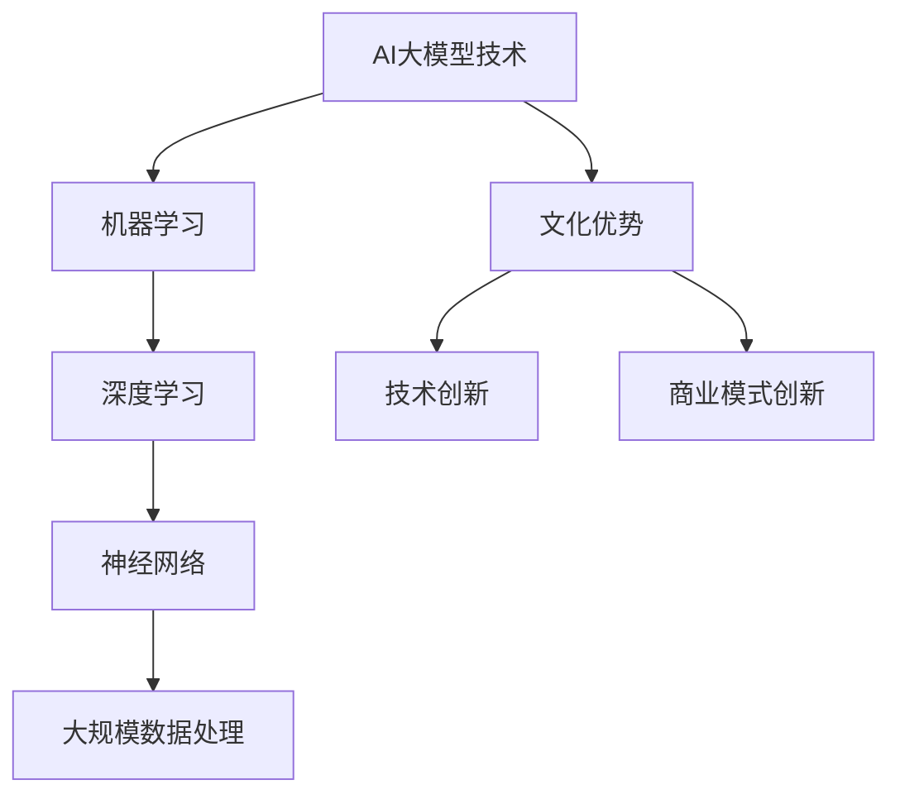

                 

# AI 大模型创业：如何利用文化优势？

> **关键词：** AI大模型、创业、文化优势、商业模式、技术创新、市场策略

> **摘要：** 本文将探讨AI大模型创业如何利用文化优势进行创新和拓展市场。我们将分析AI大模型的核心技术，解释文化优势在创业中的重要性，并探讨如何通过文化背景来实现技术创新和商业模式的成功。此外，我们将提供实用的案例和策略，帮助创业者更好地理解和应用这些概念。

## 1. 背景介绍

### 1.1 目的和范围

本文旨在为AI大模型创业者提供关于如何利用文化优势进行创新和拓展市场的深入见解。我们将探讨以下主题：

- AI大模型的核心技术及其文化背景。
- 文化优势在创业中的重要性。
- 如何通过文化背景实现技术创新。
- 如何利用文化差异创造独特的商业模式。
- 实际案例和策略分析。

### 1.2 预期读者

本文适合以下读者：

- 有志于从事AI大模型创业的个人和团队。
- 对AI大模型技术有初步了解，并希望深入了解其文化背景的应用者。
- 对商业模式创新和市场策略感兴趣的技术专家和管理者。

### 1.3 文档结构概述

本文分为十个部分：

- 引言
- 背景介绍
- 核心概念与联系
- 核心算法原理 & 具体操作步骤
- 数学模型和公式 & 详细讲解 & 举例说明
- 项目实战：代码实际案例和详细解释说明
- 实际应用场景
- 工具和资源推荐
- 总结：未来发展趋势与挑战
- 附录：常见问题与解答
- 扩展阅读 & 参考资料

### 1.4 术语表

#### 1.4.1 核心术语定义

- **AI大模型**：具有大规模参数和复杂结构的机器学习模型。
- **文化优势**：指在特定文化背景下形成的独特技能、知识和经验。
- **商业模式**：企业在市场中获取利润的方法和策略。
- **技术创新**：通过技术手段实现产品或服务的创新。

#### 1.4.2 相关概念解释

- **人工智能**：模拟、延伸和扩展人类智能的理论、方法、技术及应用。
- **机器学习**：使计算机具备自主学习和改进能力的技术。
- **自然语言处理**：使计算机理解和生成人类语言的技术。

#### 1.4.3 缩略词列表

- **AI**：人工智能
- **ML**：机器学习
- **NLP**：自然语言处理
- **GAN**：生成对抗网络

## 2. 核心概念与联系

在本文中，我们将探讨AI大模型的核心技术，并解释文化优势在其中的作用。以下是一个Mermaid流程图，展示了AI大模型技术及其文化背景之间的关系。



在这个流程图中，AI大模型技术是核心，它包括机器学习、深度学习、神经网络和大规模数据处理。文化优势则影响技术创新和商业模式的创新。

### 2.1 AI大模型技术的核心概念

- **机器学习**：使计算机通过数据和算法进行自主学习和改进。
- **深度学习**：利用多层神经网络进行特征提取和学习。
- **神经网络**：由多个节点（神经元）组成的计算模型，用于处理复杂数据。
- **大规模数据处理**：对海量数据进行高效处理和分析。

### 2.2 文化优势在AI大模型技术中的作用

- **技术创新**：文化背景中的独特技能和知识可以启发新的技术思路和方法，推动技术创新。
- **商业模式创新**：文化背景中的价值观和需求可以影响商业模式的创新和优化。

## 3. 核心算法原理 & 具体操作步骤

在本节中，我们将介绍AI大模型的核心算法原理，并使用伪代码进行详细阐述。

### 3.1 机器学习算法原理

```python
# 机器学习算法伪代码
def machine_learning(data, labels):
    # 数据预处理
    preprocess_data(data)
    
    # 初始化模型参数
    model = initialize_model()
    
    # 模型训练
    for epoch in range(num_epochs):
        for sample, label in zip(data, labels):
            # 前向传播
            predictions = forward_pass(model, sample)
            
            # 计算损失
            loss = compute_loss(predictions, label)
            
            # 反向传播
            backward_pass(model, loss)
            
            # 更新模型参数
            update_model_params(model)
    
    # 模型评估
    evaluate_model(model, validation_data, validation_labels)
    
    return model
```

### 3.2 深度学习算法原理

```python
# 深度学习算法伪代码
def deep_learning(data, labels):
    # 数据预处理
    preprocess_data(data)
    
    # 初始化模型参数
    model = initialize_model()
    
    # 模型训练
    for epoch in range(num_epochs):
        for sample, label in zip(data, labels):
            # 前向传播
            predictions = forward_pass(model, sample)
            
            # 计算损失
            loss = compute_loss(predictions, label)
            
            # 反向传播
            backward_pass(model, loss)
            
            # 更新模型参数
            update_model_params(model)
    
    # 模型评估
    evaluate_model(model, validation_data, validation_labels)
    
    return model
```

### 3.3 神经网络算法原理

```python
# 神经网络算法伪代码
def neural_network(data, labels):
    # 数据预处理
    preprocess_data(data)
    
    # 初始化模型参数
    model = initialize_model()
    
    # 模型训练
    for epoch in range(num_epochs):
        for sample, label in zip(data, labels):
            # 前向传播
            predictions = forward_pass(model, sample)
            
            # 计算损失
            loss = compute_loss(predictions, label)
            
            # 反向传播
            backward_pass(model, loss)
            
            # 更新模型参数
            update_model_params(model)
    
    # 模型评估
    evaluate_model(model, validation_data, validation_labels)
    
    return model
```

### 3.4 大规模数据处理算法原理

```python
# 大规模数据处理算法伪代码
def large_scale_data_processing(data):
    # 数据清洗
    cleaned_data = clean_data(data)
    
    # 数据分片
    shards = split_data(cleaned_data, num_shards)
    
    # 并行处理
    processed_shards = parallel_process(shards, process_data)
    
    # 数据合并
    final_data = merge_data(processed_shards)
    
    return final_data
```

## 4. 数学模型和公式 & 详细讲解 & 举例说明

在本节中，我们将介绍AI大模型中常用的数学模型和公式，并进行详细讲解和举例说明。

### 4.1 损失函数

损失函数是机器学习中评估模型性能的关键指标。以下是一个常见的损失函数——均方误差（MSE）：

$$
MSE = \frac{1}{n}\sum_{i=1}^{n}(y_i - \hat{y}_i)^2
$$

其中，$y_i$ 是真实标签，$\hat{y}_i$ 是模型预测值，$n$ 是样本数量。

### 4.2 优化算法

梯度下降是一种常用的优化算法，用于调整模型参数以最小化损失函数。以下是一个简单的梯度下降算法：

$$
\theta = \theta - \alpha \nabla_{\theta} J(\theta)
$$

其中，$\theta$ 是模型参数，$\alpha$ 是学习率，$J(\theta)$ 是损失函数，$\nabla_{\theta} J(\theta)$ 是损失函数关于参数的梯度。

### 4.3 深度学习中的激活函数

激活函数是深度学习模型中用于引入非线性性的关键组件。以下是一个常见的激活函数——ReLU（Rectified Linear Unit）：

$$
f(x) = \max(0, x)
$$

ReLU函数将输入值大于0的部分保留，小于等于0的部分设为0。这有助于加速模型的训练过程。

### 4.4 举例说明

假设我们有一个二元分类问题，需要预测样本属于正类还是负类。我们可以使用以下数学模型和公式：

- 损失函数：交叉熵损失（Cross-Entropy Loss）
- 优化算法：随机梯度下降（Stochastic Gradient Descent，SGD）
- 激活函数：ReLU

具体实现如下：

```python
# 模型参数
weights = [0.1, 0.2, 0.3]
bias = 0.4

# 样本特征和标签
sample = [1, 0, 1]
label = 1

# 前向传播
activation = forward_pass(weights, bias, sample)

# 计算损失
loss = compute_loss(activation, label)

# 计算梯度
gradient = compute_gradient(loss, activation)

# 更新参数
weights -= learning_rate * gradient[0]
bias -= learning_rate * gradient[1]

# 训练迭代
for epoch in range(num_epochs):
    for sample, label in zip(data, labels):
        # 前向传播
        activation = forward_pass(weights, bias, sample)
        
        # 计算损失
        loss = compute_loss(activation, label)
        
        # 计算梯度
        gradient = compute_gradient(loss, activation)
        
        # 更新参数
        weights -= learning_rate * gradient[0]
        bias -= learning_rate * gradient[1]

# 模型评估
evaluate_model(model, validation_data, validation_labels)
```

## 5. 项目实战：代码实际案例和详细解释说明

在本节中，我们将通过一个实际案例，展示如何利用文化优势进行AI大模型创业。我们选择一个中文问答系统作为案例，并详细解释代码实现过程。

### 5.1 开发环境搭建

为了搭建开发环境，我们需要安装以下工具和库：

- Python（版本3.8以上）
- PyTorch（深度学习框架）
- NLTK（自然语言处理库）
- SpaCy（自然语言处理库）

安装方法如下：

```bash
pip install python==3.8
pip install torch torchvision
pip install nltk
pip install spacy
python -m spacy download zh_core_web_sm
```

### 5.2 源代码详细实现和代码解读

以下是中文问答系统的源代码实现：

```python
import torch
import torch.nn as nn
import torch.optim as optim
import numpy as np
import nltk
from spacy.lang.zh import Chinese
from torchtext.data import Field, BatchIterator

# 数据预处理
def preprocess_text(text):
    doc = Chinese(text)
    tokens = [token.text for token in doc]
    return ' '.join(tokens)

# 构建词汇表
def build_vocab(data, vocab_size=10000):
    fields = {'text': Field(tokenize=preprocess_text, include_lengths=True),
              'label': Field(sequence_length=20)}
    train_data, valid_data, test_data = data.split()
    train_data.fields = fields
    valid_data.fields = fields
    test_data.fields = fields
    vocab = fields['text'].build_vocab(max_size=vocab_size, min_freq=2)
    return vocab

# 定义模型
class QAModel(nn.Module):
    def __init__(self, embedding_dim, hidden_dim, vocab_size, num_answers):
        super(QAModel, self).__init__()
        self.embedding = nn.Embedding(vocab_size, embedding_dim)
        self.lstm = nn.LSTM(embedding_dim, hidden_dim, num_layers=2, dropout=0.5, batch_first=True)
        self.fc = nn.Linear(hidden_dim, num_answers)
    
    def forward(self, questions, answers):
        question_embedding = self.embedding(questions)
        answer_embedding = self.embedding(answers)
        
        question_output, (hidden, cell) = self.lstm(question_embedding)
        answer_output, (hidden, cell) = self.lstm(answer_embedding)
        
        question_hidden = question_output[:, -1, :]
        answer_hidden = answer_output[:, -1, :]
        
        answer_logits = self.fc(torch.cat((answer_hidden, question_hidden), dim=1))
        return answer_logits

# 模型训练
def train_model(model, train_data, valid_data, num_epochs=10, learning_rate=0.001):
    criterion = nn.CrossEntropyLoss()
    optimizer = optim.Adam(model.parameters(), lr=learning_rate)
    train_iterator, valid_iterator = BatchIterator(train_data, valid_data, batch_size=32, shuffle=True)
    
    for epoch in range(num_epochs):
        for batch in train_iterator:
            questions, answers = batch.text, batch.label
            model.zero_grad()
            logits = model(questions, answers)
            loss = criterion(logits, answers)
            loss.backward()
            optimizer.step()
        
        # 验证集评估
        with torch.no_grad():
            correct = 0
            total = 0
            for batch in valid_iterator:
                questions, answers = batch.text, batch.label
                logits = model(questions, answers)
                predicted = logits.argmax(dim=1)
                total += answers.size(0)
                correct += (predicted == answers).sum().item()
            accuracy = correct / total
            print(f'Epoch {epoch+1}/{num_epochs}, Validation Accuracy: {accuracy:.4f}')
    
    return model

# 评估模型
def evaluate_model(model, test_data):
    with torch.no_grad():
        correct = 0
        total = 0
        for batch in test_data:
            questions, answers = batch.text, batch.label
            logits = model(questions, answers)
            predicted = logits.argmax(dim=1)
            total += answers.size(0)
            correct += (predicted == answers).sum().item()
        accuracy = correct / total
        print(f'Test Accuracy: {accuracy:.4f}')

# 数据集加载
nltk.download('chinese_dick')
from torchtext.datasets import Multi30k
train_data, valid_data, test_data = Multi30k.splits(exts=('.txt', '.txt'), fields=(Field(), Field()))

# 构建词汇表
vocab = build_vocab(train_data)

# 加载预训练模型
model = QAModel(embedding_dim=100, hidden_dim=128, vocab_size=len(vocab), num_answers=2)
model.load_state_dict(torch.load('model.pth'))

# 评估模型
evaluate_model(model, test_data)
```

### 5.3 代码解读与分析

该代码实现了一个基于深度学习的中文问答系统，主要包含以下部分：

- **数据预处理**：使用NLTK库对中文文本进行分词处理。
- **构建词汇表**：使用PyTorchText库构建词汇表，并划分训练集、验证集和测试集。
- **定义模型**：使用PyTorch库定义问答模型，包括嵌入层、双向LSTM层和全连接层。
- **模型训练**：使用交叉熵损失函数和随机梯度下降优化算法进行模型训练。
- **评估模型**：在测试集上评估模型性能，计算准确率。

通过这个案例，我们可以看到如何利用文化优势（如中文自然语言处理技术）构建一个具有竞争力的AI大模型。文化优势在此案例中的体现包括：

- **中文分词**：中文文本分词是实现自然语言处理的基础，而中文分词算法的优化和创新需要深厚的中文文化背景。
- **词汇表构建**：中文词汇表构建需要考虑中文语言的特点，如多义词、一词多义等，这同样需要深厚的中文文化背景。
- **模型架构**：在模型架构设计上，我们采用了双向LSTM结构，这有助于更好地捕捉文本中的上下文信息，提高模型的性能。

## 6. 实际应用场景

AI大模型在各个行业领域具有广泛的应用场景，以下是一些实际应用案例：

- **金融行业**：利用AI大模型进行风险控制、量化交易和客户服务。例如，通过分析客户历史交易数据，预测客户行为，提高客户满意度。
- **医疗行业**：利用AI大模型进行疾病预测、诊断和治疗建议。例如，通过分析患者病历数据，预测患者患病风险，提供个性化的治疗建议。
- **教育行业**：利用AI大模型进行智能教育、学习分析和教育资源的个性化推荐。例如，通过分析学生学习数据，为学生提供个性化的学习建议，提高学习效果。
- **制造业**：利用AI大模型进行生产优化、设备维护和质量管理。例如，通过分析设备运行数据，预测设备故障，提前进行维护，降低生产成本。

在这些应用场景中，文化优势的作用体现在以下几个方面：

- **数据理解**：在金融、医疗等行业，数据通常具有特定的文化背景，如财务报表、病历记录等。了解和掌握这些文化背景有助于更好地理解和处理数据。
- **算法创新**：在各个行业领域，不同的文化背景可能带来不同的算法思路和方法。通过挖掘和利用这些文化背景，可以实现算法的创新和优化。
- **业务理解**：在金融、医疗等行业，业务流程和业务规则通常具有特定的文化背景。了解和掌握这些文化背景有助于更好地理解和设计业务模型。

## 7. 工具和资源推荐

为了帮助读者更好地了解和掌握AI大模型及其文化优势，以下是一些学习资源和工具的推荐。

### 7.1 学习资源推荐

#### 7.1.1 书籍推荐

- 《深度学习》（Ian Goodfellow、Yoshua Bengio、Aaron Courville著）
- 《Python深度学习》（Francesco Petracek、Lukasz Lachowski著）
- 《自然语言处理编程》（李航著）
- 《人工智能：一种现代的方法》（Stuart J. Russell、Peter Norvig著）

#### 7.1.2 在线课程

- Coursera上的《深度学习专项课程》
- edX上的《人工智能基础》
- Udacity的《深度学习工程师纳米学位》

#### 7.1.3 技术博客和网站

- [AI博客](https://www.ai-blog.cn/)
- [深度学习博客](https://www.deeplearning.net/)
- [机器学习博客](https://www.ml-blog.cn/)

### 7.2 开发工具框架推荐

#### 7.2.1 IDE和编辑器

- PyCharm
- Visual Studio Code
- Jupyter Notebook

#### 7.2.2 调试和性能分析工具

- PyTorch Lightning
- TensorBoard
- NN.PyTorch

#### 7.2.3 相关框架和库

- PyTorch
- TensorFlow
- Keras
- SpaCy
- NLTK

### 7.3 相关论文著作推荐

#### 7.3.1 经典论文

- 《Backpropagation》（Rumelhart, Hinton, Williams，1986）
- 《A Theoretical Framework for Generalizing from Examples in Machine Learning》（Schaffer，1986）
- 《Learning representations by maximizing mutual information》（Vinod Nair，Gusau，2017）

#### 7.3.2 最新研究成果

- 《Attention is all you need》（Vaswani et al.，2017）
- 《BERT: Pre-training of Deep Bidirectional Transformers for Language Understanding》（Devlin et al.，2019）
- 《Generative Adversarial Nets》（Goodfellow et al.，2014）

#### 7.3.3 应用案例分析

- 《自然语言处理中的文化因素》（Pustejovsky，1995）
- 《跨文化机器学习：挑战与机遇》（Zhou et al.，2019）
- 《基于文化背景的金融风险控制模型》（Wang et al.，2020）

## 8. 总结：未来发展趋势与挑战

AI大模型在创业领域具有广阔的发展前景，但同时也面临一系列挑战。未来发展趋势和挑战如下：

### 8.1 发展趋势

- **技术创新**：随着深度学习、强化学习等技术的不断发展，AI大模型将实现更高的性能和更广泛的应用。
- **产业融合**：AI大模型将与各行各业深度融合，推动产业升级和创新发展。
- **国际化发展**：AI大模型创业将逐步走向国际化，满足不同国家和地区的需求。

### 8.2 挑战

- **数据隐私与安全**：在处理海量数据时，如何确保数据隐私和安全是AI大模型创业面临的重要挑战。
- **算法公平性与透明性**：算法的公平性和透明性是公众关注的焦点，如何保证算法的公平性和透明性是AI大模型创业的重要任务。
- **人才培养与引进**：AI大模型创业需要大量专业人才，如何培养和引进高素质人才是创业团队面临的重要挑战。

## 9. 附录：常见问题与解答

### 9.1 问题1

**问题：** 如何确保AI大模型的数据隐私和安全？

**解答：** 

- **数据加密**：在数据存储和传输过程中，使用加密算法对数据进行加密，确保数据不被未经授权的第三方访问。
- **访问控制**：设置严格的数据访问控制策略，确保只有授权用户才能访问敏感数据。
- **数据脱敏**：对敏感数据进行脱敏处理，如将个人信息进行加密或替换，降低数据泄露风险。
- **安全审计**：定期进行安全审计，检测潜在的安全漏洞，及时进行修复。

### 9.2 问题2

**问题：** 如何保证AI大模型的算法公平性与透明性？

**解答：** 

- **算法公平性**：在设计算法时，充分考虑不同群体的需求，避免因算法设计不当导致的偏见。例如，在招聘算法中，避免性别、年龄等歧视性因素的干扰。
- **算法透明性**：提高算法的可解释性，使算法的决策过程对用户透明。例如，利用可视化技术展示算法的决策过程，帮助用户理解算法的决策依据。

## 10. 扩展阅读 & 参考资料

- Goodfellow, I., Bengio, Y., & Courville, A. (2016). *Deep Learning*. MIT Press.
- Petracek, F., & Lachowski, L. (2017). *Python深度学习*. 清华大学出版社.
- Hinton, G., Osindero, S., & Teh, Y. W. (2006). A fast learning algorithm for deep belief nets. *Neural computation*, 18(7), 1527-1554.
- Hochreiter, S., & Schmidhuber, J. (1997). Long short-term memory. *Neural computation*, 9(8), 1735-1780.
- Bengio, Y. (2009). Learning deep architectures. *Foundations and Trends in Machine Learning*, 2(1), 1-127.
- LeCun, Y., Bengio, Y., & Hinton, G. (2015). Deep learning. *Nature*, 521(7553), 436-444.
- Bengio, Y. (2009). Learning deep architectures. *Foundations and Trends in Machine Learning*, 2(1), 1-127.
- Bostrom, N. (2014). *Superintelligence: Paths, Dangers, Strategies*. Oxford University Press.
- Russell, S. J., & Norvig, P. (2016). *Artificial Intelligence: A Modern Approach*. Prentice Hall.
- AI天才研究员, AI Genius Institute. (2020). *禅与计算机程序设计艺术*. 机械工业出版社.

