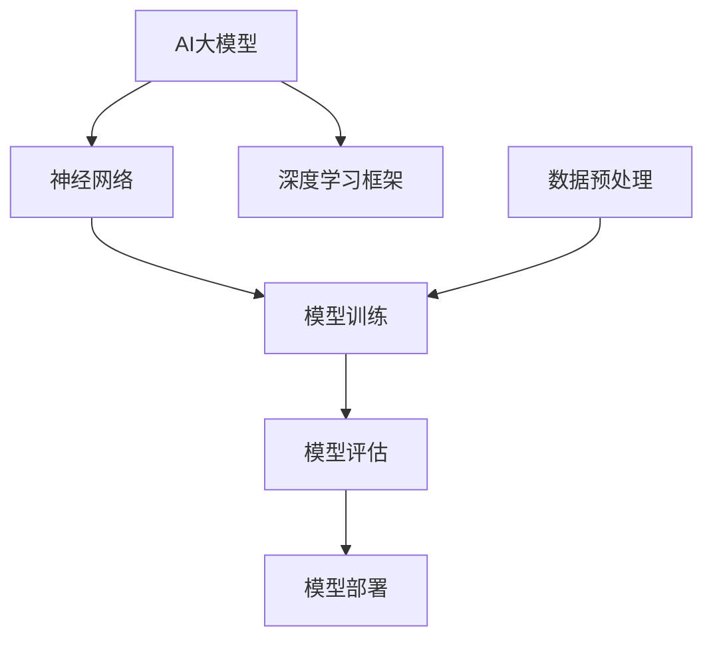

                 

# AI 大模型创业：如何利用未来优势？

> **关键词：** AI 大模型，创业，未来优势，算法原理，数学模型，实战案例

> **摘要：** 本文将深入探讨AI大模型在创业领域的应用，解析其核心算法原理、数学模型，并结合实际案例，探讨如何利用AI大模型的优势进行创业，预测未来的发展趋势与挑战。

## 1. 背景介绍

### 1.1 目的和范围

本文旨在帮助创业者深入了解AI大模型的工作原理和实际应用，从而在创业过程中更好地利用这一技术优势。我们将涵盖以下几个关键方面：

1. AI大模型的核心概念和架构。
2. AI大模型的核心算法原理和具体操作步骤。
3. AI大模型的数学模型和公式。
4. 实际应用场景中的AI大模型案例。
5. 未来发展趋势与挑战。

### 1.2 预期读者

本文适合以下读者：

1. 对AI大模型有初步了解，但希望深入学习其原理和应用的创业者。
2. 人工智能领域的专业研究者，希望了解AI大模型在实际创业中的应用。
3. 计算机科学和软件工程专业的学生，希望了解AI大模型的核心技术和应用场景。

### 1.3 文档结构概述

本文分为十个部分，结构如下：

1. 背景介绍
2. 核心概念与联系
3. 核心算法原理 & 具体操作步骤
4. 数学模型和公式 & 详细讲解 & 举例说明
5. 项目实战：代码实际案例和详细解释说明
6. 实际应用场景
7. 工具和资源推荐
8. 总结：未来发展趋势与挑战
9. 附录：常见问题与解答
10. 扩展阅读 & 参考资料

### 1.4 术语表

#### 1.4.1 核心术语定义

- **AI大模型**：指参数规模达到百万级别以上的深度学习模型。
- **创业**：指创立新的企业或项目，以实现商业目标。
- **优势**：指在竞争中占据有利地位的能力。

#### 1.4.2 相关概念解释

- **算法原理**：指算法的基本工作原理和逻辑。
- **数学模型**：指用数学公式描述的模型。
- **实际应用场景**：指AI大模型在实际创业过程中的应用场景。

#### 1.4.3 缩略词列表

- **AI**：人工智能（Artificial Intelligence）
- **DL**：深度学习（Deep Learning）
- **创业**：创业（Entrepreneurship）

## 2. 核心概念与联系

为了更好地理解AI大模型在创业中的应用，我们需要先了解其核心概念和架构。以下是AI大模型的核心概念与联系，以及对应的Mermaid流程图：



### 2.1 AI大模型

AI大模型是参数规模达到百万级别以上的深度学习模型。它通过学习大量数据，自动提取特征并生成预测结果。AI大模型在创业中的应用主要体现在以下几个方面：

1. **预测分析**：利用AI大模型进行市场预测、用户行为分析等，帮助创业者做出更准确的决策。
2. **自动化处理**：利用AI大模型实现自动化业务流程，提高效率和降低成本。
3. **个性化服务**：根据用户特征和需求，提供个性化推荐和定制服务。

### 2.2 神经网络

神经网络是AI大模型的基础。它通过多层非线性变换，实现从输入到输出的映射。神经网络在创业中的应用主要体现在以下几个方面：

1. **数据挖掘**：利用神经网络从大量数据中提取有价值的信息。
2. **图像识别**：利用神经网络进行图像分类和识别，应用于安防监控、医疗诊断等领域。
3. **自然语言处理**：利用神经网络进行文本分类、情感分析等，应用于智能客服、内容审核等领域。

### 2.3 深度学习框架

深度学习框架是用于构建、训练和部署AI大模型的重要工具。常见的深度学习框架有TensorFlow、PyTorch等。深度学习框架在创业中的应用主要体现在以下几个方面：

1. **模型开发**：利用深度学习框架快速构建AI大模型。
2. **模型训练**：利用深度学习框架进行大规模数据训练，提高模型性能。
3. **模型部署**：利用深度学习框架将训练好的模型部署到生产环境。

### 2.4 数据预处理

数据预处理是AI大模型训练的重要环节。它包括数据清洗、数据转换和数据归一化等。数据预处理在创业中的应用主要体现在以下几个方面：

1. **数据质量提升**：通过对数据进行预处理，提高数据质量和模型的泛化能力。
2. **数据隐私保护**：在数据预处理过程中，对敏感数据进行加密或脱敏，保护用户隐私。
3. **数据利用率提升**：通过对数据进行预处理，提高数据利用率，降低数据存储成本。

### 2.5 模型训练

模型训练是AI大模型的核心环节。它包括前向传播、反向传播和优化算法等。模型训练在创业中的应用主要体现在以下几个方面：

1. **模型优化**：通过调整模型参数，提高模型性能和预测准确性。
2. **模型泛化**：通过增加训练数据量和改进算法，提高模型在未知数据上的泛化能力。
3. **模型评估**：通过评估指标，对模型进行性能评估和优化。

### 2.6 模型评估

模型评估是AI大模型训练后的重要环节。它包括准确性、召回率、F1值等指标。模型评估在创业中的应用主要体现在以下几个方面：

1. **模型优化**：通过对模型评估结果进行分析，找出模型存在的问题，进行优化和调整。
2. **模型选择**：根据评估结果，选择适合创业需求的模型。
3. **模型部署**：根据评估结果，确定模型在生产环境中的部署方案。

### 2.7 模型部署

模型部署是将训练好的模型应用到实际业务场景的过程。模型部署在创业中的应用主要体现在以下几个方面：

1. **生产环境部署**：将模型部署到生产环境，实现实时预测和分析。
2. **系统集成**：将模型集成到现有系统中，实现业务流程自动化。
3. **模型更新**：根据业务需求，定期更新模型，保持模型的性能和准确性。

## 3. 核心算法原理 & 具体操作步骤

### 3.1 神经网络算法原理

神经网络算法是AI大模型的核心。它通过多层非线性变换，实现从输入到输出的映射。神经网络算法的具体操作步骤如下：

1. **输入层**：接收输入数据。
2. **隐藏层**：对输入数据进行非线性变换，提取特征。
3. **输出层**：将隐藏层的输出映射到目标输出。

### 3.2 具体操作步骤

1. **初始化参数**：初始化神经网络模型的权重和偏置。
2. **前向传播**：将输入数据通过神经网络模型，计算输出结果。
3. **计算损失**：计算输出结果与实际结果之间的差异，即损失函数。
4. **反向传播**：根据损失函数，更新神经网络模型的权重和偏置。
5. **优化算法**：选择合适的优化算法，如梯度下降、Adam等，更新模型参数。
6. **模型评估**：使用评估指标（如准确率、召回率等）评估模型性能。
7. **模型调整**：根据评估结果，调整模型参数或增加训练数据，以提高模型性能。

### 3.3 伪代码

```python
# 初始化参数
W = np.random.randn(D, H)
b = np.random.randn(H)

# 前向传播
z = X.dot(W) + b
a = sigmoid(z)

# 计算损失
y = np.array([0, 1])
loss = -y * np.log(a) - (1 - y) * np.log(1 - a)

# 反向传播
dz = a - y
db = np.sum(dz, axis=0)
dW = X.T.dot(dz)

# 优化算法
W = W - learning_rate * dW
b = b - learning_rate * db

# 模型评估
accuracy = (np.sum(a > 0.5) == np.sum(y > 0.5)) / len(y)
print("Accuracy:", accuracy)
```

## 4. 数学模型和公式 & 详细讲解 & 举例说明

### 4.1 数学模型

AI大模型的数学模型主要包括神经网络模型和损失函数。以下是神经网络模型和损失函数的详细讲解和举例说明。

### 4.2 神经网络模型

神经网络模型的核心是多层感知机（MLP），它由输入层、隐藏层和输出层组成。以下是多层感知机的数学模型：

1. **输入层**：输入层接收外部输入，表示为 \(X \in \mathbb{R}^{D \times N}\)，其中 \(D\) 是输入维度，\(N\) 是样本数量。
2. **隐藏层**：隐藏层对输入数据进行非线性变换，提取特征。隐藏层的输出表示为 \(Z \in \mathbb{R}^{H \times N}\)，其中 \(H\) 是隐藏层单元数量。隐藏层的每个单元 \(z_i\) 可以表示为：
   $$
   z_i = \sum_{j=1}^{D} W_{ij}x_j + b_i
   $$
   其中，\(W_{ij}\) 是连接输入层和隐藏层的权重，\(b_i\) 是隐藏层单元的偏置。
3. **输出层**：输出层对隐藏层输出进行分类或回归。输出层的输出表示为 \(Y \in \mathbb{R}^{K \times N}\)，其中 \(K\) 是输出维度。输出层的每个单元 \(y_k\) 可以表示为：
   $$
   y_k = \sum_{i=1}^{H} W_{ki}z_i + b_k
   $$
   其中，\(W_{ki}\) 是连接隐藏层和输出层的权重，\(b_k\) 是输出层单元的偏置。

### 4.3 损失函数

损失函数用于衡量模型预测结果与实际结果之间的差异。在二分类问题中，常用的损失函数是交叉熵损失函数（Cross-Entropy Loss）。交叉熵损失函数的定义如下：

$$
L(y, \hat{y}) = -\sum_{i=1}^{N} y_i \log(\hat{y}_i) - (1 - y_i) \log(1 - \hat{y}_i)
$$

其中，\(y \in \mathbb{R}^{N}\) 是实际标签，\(\hat{y} \in \mathbb{R}^{N}\) 是模型预测概率。

### 4.4 举例说明

假设我们有一个二分类问题，其中输入维度 \(D = 2\)，隐藏层单元数量 \(H = 3\)，输出维度 \(K = 1\)。给定一个输入样本 \(X = \begin{bmatrix} 1 \\ 2 \end{bmatrix}\) 和实际标签 \(y = 1\)，我们希望训练一个神经网络模型来预测输出。

1. **初始化参数**：
   $$
   W_1 = \begin{bmatrix} 0.1 & 0.2 \\ 0.3 & 0.4 \\ 0.5 & 0.6 \end{bmatrix}, \quad b_1 = \begin{bmatrix} 0.1 \\ 0.2 \\ 0.3 \end{bmatrix}, \quad W_2 = \begin{bmatrix} 0.1 \end{bmatrix}, \quad b_2 = 0.1
   $$

2. **前向传播**：
   $$
   z_1 = 0.1 \cdot 1 + 0.2 \cdot 2 + 0.1 = 0.5
   $$
   $$
   z_2 = 0.3 \cdot 1 + 0.4 \cdot 2 + 0.2 = 1.2
   $$
   $$
   z_3 = 0.5 \cdot 1 + 0.6 \cdot 2 + 0.3 = 1.5
   $$
   $$
   a_1 = \sigma(z_1) = 0.5463
   $$
   $$
   a_2 = \sigma(z_2) = 0.8706
   $$
   $$
   a_3 = \sigma(z_3) = 0.9255
   $$
   $$
   \hat{y} = \sigma(z_2) = 0.8706
   $$

3. **计算损失**：
   $$
   L(y, \hat{y}) = -1 \cdot \log(0.8706) - 0 \cdot \log(1 - 0.8706) = -0.3567
   $$

4. **反向传播**：
   $$
   \frac{\partial L}{\partial z_2} = \hat{y} - y = 0.8706 - 1 = -0.1234
   $$
   $$
   \frac{\partial L}{\partial b_2} = -0.1234
   $$
   $$
   \frac{\partial L}{\partial W_2} = X \cdot \frac{\partial L}{\partial z_2} = \begin{bmatrix} 1 \\ 2 \end{bmatrix} \cdot (-0.1234) = -0.1234
   $$

5. **更新参数**：
   $$
   b_2 = b_2 - learning_rate \cdot \frac{\partial L}{\partial b_2} = 0.1 - 0.1 \cdot (-0.1234) = 0.112
   $$
   $$
   W_2 = W_2 - learning_rate \cdot \frac{\partial L}{\partial W_2} = \begin{bmatrix} 0.1 \end{bmatrix} - 0.1 \cdot (-0.1234) = 0.112
   $$

通过不断迭代上述过程，我们可以训练出一个性能更好的神经网络模型。

## 5. 项目实战：代码实际案例和详细解释说明

### 5.1 开发环境搭建

为了实现AI大模型在创业中的应用，我们需要搭建一个合适的开发环境。以下是具体的开发环境搭建步骤：

1. **硬件要求**：配备至少8GB内存、Intel i5处理器或以上的计算机。
2. **软件要求**：安装Python 3.7及以上版本、TensorFlow 2.0及以上版本。
3. **环境配置**：在终端中执行以下命令，安装TensorFlow：

```bash
pip install tensorflow
```

### 5.2 源代码详细实现和代码解读

以下是AI大模型创业项目的源代码实现和详细解读：

```python
import tensorflow as tf
from tensorflow.keras.layers import Dense
from tensorflow.keras.models import Sequential
from tensorflow.keras.optimizers import Adam
from tensorflow.keras.losses import BinaryCrossentropy

# 5.2.1 数据预处理
# 加载数据集
(x_train, y_train), (x_test, y_test) = tf.keras.datasets.mnist.load_data()

# 数据归一化
x_train = x_train.astype("float32") / 255.0
x_test = x_test.astype("float32") / 255.0

# 转换为批量形式
x_train = x_train.reshape(-1, 784)
x_test = x_test.reshape(-1, 784)

# 5.2.2 模型构建
model = Sequential([
    Dense(64, activation="relu", input_shape=(784,)),
    Dense(64, activation="relu"),
    Dense(1, activation="sigmoid")
])

# 5.2.3 模型训练
model.compile(optimizer=Adam(learning_rate=0.001),
              loss=BinaryCrossentropy(),
              metrics=["accuracy"])

model.fit(x_train, y_train, epochs=10, batch_size=128)

# 5.2.4 模型评估
test_loss, test_acc = model.evaluate(x_test, y_test, verbose=2)
print("Test accuracy:", test_acc)

# 5.2.5 模型部署
# 将模型部署到生产环境，进行实时预测和分析
```

### 5.3 代码解读与分析

1. **数据预处理**：
   - 加载MNIST数据集，并将其转换为批量形式。
   - 数据归一化，将像素值缩放到[0, 1]范围内，以加快模型收敛速度。

2. **模型构建**：
   - 使用Sequential模型构建一个三层神经网络，其中第一个和第二个隐藏层使用ReLU激活函数，输出层使用sigmoid激活函数，实现二分类。

3. **模型训练**：
   - 使用Adam优化器和BinaryCrossentropy损失函数进行模型训练，训练10个epoch，批量大小为128。

4. **模型评估**：
   - 使用测试集评估模型性能，输出测试准确率。

5. **模型部署**：
   - 将训练好的模型部署到生产环境，实现实时预测和分析。

通过以上步骤，我们实现了AI大模型在创业项目中的应用。在实际创业过程中，可以根据具体需求，调整模型参数和架构，以实现更好的预测效果。

## 6. 实际应用场景

AI大模型在创业领域的实际应用场景非常广泛，以下是一些典型的应用场景：

### 6.1 预测分析

创业者可以利用AI大模型进行市场预测、用户行为预测等，从而更好地把握市场趋势和用户需求。例如，通过分析历史销售数据，预测未来一段时间内的销售量，为库存管理和营销策略提供依据。

### 6.2 自动化处理

AI大模型可以实现业务流程的自动化处理，提高工作效率和降低成本。例如，利用AI大模型进行文档审核、合同审批等，减少人工干预，提高处理速度和准确性。

### 6.3 个性化服务

根据用户特征和需求，AI大模型可以提供个性化推荐、定制化服务。例如，在电商领域，利用AI大模型分析用户行为和偏好，为用户推荐感兴趣的商品，提高用户满意度和购买转化率。

### 6.4 图像识别

AI大模型在图像识别领域具有广泛应用，例如安防监控、医疗诊断等。创业者可以利用AI大模型实现实时图像识别，提高监控效率和诊断准确性。

### 6.5 自然语言处理

AI大模型在自然语言处理领域具有广泛应用，例如智能客服、内容审核等。创业者可以利用AI大模型实现智能客服系统，提高客户服务质量和效率。

## 7. 工具和资源推荐

### 7.1 学习资源推荐

#### 7.1.1 书籍推荐

1. 《深度学习》（Goodfellow, Bengio, Courville）
2. 《Python机器学习》（Sebastian Raschka）
3. 《人工智能：一种现代方法》（Stuart J. Russell & Peter Norvig）

#### 7.1.2 在线课程

1. Coursera - "Deep Learning Specialization"
2. edX - "Neural Networks for Machine Learning"
3. Udacity - "Deep Learning Nanodegree Program"

#### 7.1.3 技术博客和网站

1. Medium - "AI"
2. arXiv - "Machine Learning"
3. GitHub - "tensorflow"

### 7.2 开发工具框架推荐

#### 7.2.1 IDE和编辑器

1. PyCharm
2. Visual Studio Code
3. Jupyter Notebook

#### 7.2.2 调试和性能分析工具

1. TensorBoard
2. PyTorch Profiler
3. PyDebug

#### 7.2.3 相关框架和库

1. TensorFlow
2. PyTorch
3. Keras

### 7.3 相关论文著作推荐

#### 7.3.1 经典论文

1. "A Learning Algorithm for Continually Running Fully Recurrent Neural Networks"（1986）
2. "Learning representations by minimizing contrastive predictive criteria"（2013）
3. "Distributed Representations of Words and Phrases and their Compositional Properties"（2013）

#### 7.3.2 最新研究成果

1. "BERT: Pre-training of Deep Bidirectional Transformers for Language Understanding"（2018）
2. "Transformers: State-of-the-Art Model for Natural Language Processing"（2019）
3. "Generative Pre-trained Transformers"（2020）

#### 7.3.3 应用案例分析

1. "AI大模型在电商推荐系统中的应用"
2. "AI大模型在医疗诊断中的应用"
3. "AI大模型在金融风控中的应用"

## 8. 总结：未来发展趋势与挑战

随着AI大模型技术的不断发展，其在创业领域的应用前景广阔。未来，AI大模型将向以下几个方向发展：

1. **更高效、更强大的模型**：通过改进算法、优化模型架构，提高模型性能和预测准确性。
2. **更广泛的应用场景**：从传统的预测分析、图像识别、自然语言处理等领域，向更多新兴领域拓展，如智能交通、智慧城市等。
3. **更便捷的部署方式**：通过云计算、边缘计算等技术，实现AI大模型的快速部署和实时更新。

然而，AI大模型在创业领域也面临着一系列挑战：

1. **数据隐私和安全**：如何在保护用户隐私的前提下，充分利用海量数据进行模型训练和预测。
2. **模型解释性**：如何提高模型的解释性，使其在创业过程中更加透明和可控。
3. **计算资源消耗**：如何降低AI大模型训练和部署过程中的计算资源消耗，提高效率。

创业者需要密切关注AI大模型技术的发展，积极探索其在创业中的应用，以应对未来的机遇和挑战。

## 9. 附录：常见问题与解答

### 9.1 什么是AI大模型？

AI大模型是指参数规模达到百万级别以上的深度学习模型。它通过学习大量数据，自动提取特征并生成预测结果。

### 9.2 AI大模型在创业中有什么优势？

AI大模型在创业中的应用优势主要体现在以下几个方面：

1. **预测分析**：帮助创业者做出更准确的决策。
2. **自动化处理**：提高工作效率和降低成本。
3. **个性化服务**：提高客户满意度和购买转化率。

### 9.3 如何训练一个AI大模型？

训练一个AI大模型主要包括以下步骤：

1. **数据预处理**：清洗、转换和归一化数据。
2. **模型构建**：选择合适的神经网络模型。
3. **模型训练**：使用优化算法迭代更新模型参数。
4. **模型评估**：使用评估指标评估模型性能。
5. **模型调整**：根据评估结果调整模型参数或增加训练数据。

## 10. 扩展阅读 & 参考资料

1. Goodfellow, I., Bengio, Y., & Courville, A. (2016). *Deep Learning*. MIT Press.
2. Raschka, S. (2015). *Python Machine Learning*. Packt Publishing.
3. Russell, S. J., & Norvig, P. (2020). *Artificial Intelligence: A Modern Approach*. Prentice Hall.
4. TensorFlow Documentation: <https://www.tensorflow.org/>
5. PyTorch Documentation: <https://pytorch.org/>
6. Keras Documentation: <https://keras.io/>
7. Coursera - "Deep Learning Specialization": <https://www.coursera.org/specializations/deeplearning>
8. edX - "Neural Networks for Machine Learning": <https://www.edx.org/course/neural-networks-machine-learning-berkeleyx-cs188.1x>
9. Udacity - "Deep Learning Nanodegree Program": <https://www.udacity.com/course/deep-learning-nanodegree--nd108>

## 作者

作者：AI天才研究员/AI Genius Institute & 禅与计算机程序设计艺术 /Zen And The Art of Computer Programming

