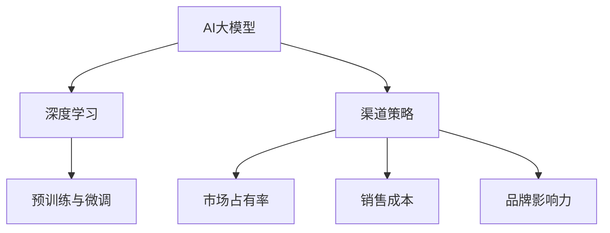
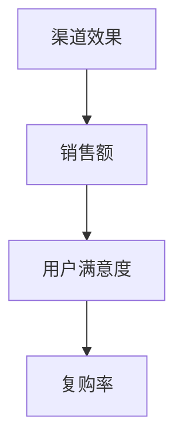

                 

# AI 大模型创业：如何利用渠道优势？

> **关键词：** AI大模型，创业，渠道优势，市场拓展，商业策略

> **摘要：** 本文旨在探讨AI大模型创业公司如何利用渠道优势，通过深入分析市场机会、构建高效渠道策略、提升品牌影响力以及实现可持续增长，为创业者提供切实可行的指导和建议。

## 1. 背景介绍

### 1.1 目的和范围

本文的目标是帮助AI大模型创业公司更好地理解并利用渠道优势，以便在竞争激烈的市场中脱颖而出。文章将围绕以下核心问题展开：

- 如何评估和识别潜在的市场机会？
- 如何构建和优化渠道策略？
- 如何提升品牌影响力和市场占有率？
- 如何实现可持续的商业增长？

本文的讨论范围将包括AI大模型创业公司可能面临的市场环境、渠道策略的核心要素以及实施过程中的关键步骤和注意事项。

### 1.2 预期读者

本文的预期读者包括以下几类：

- AI大模型创业公司的创始人或高层管理者。
- 对AI领域有浓厚兴趣并希望投身创业的从业者。
- 关注AI技术发展和市场动态的研究人员和投资者。
- 想要了解AI大模型创业生态的专业人士和普通读者。

### 1.3 文档结构概述

本文将分为十个部分，结构如下：

1. 背景介绍：介绍文章的目的、范围和预期读者。
2. 核心概念与联系：讨论AI大模型和渠道优势的相关概念及联系。
3. 核心算法原理 & 具体操作步骤：分析AI大模型的工作原理和渠道优化的具体方法。
4. 数学模型和公式 & 详细讲解 & 举例说明：介绍支持渠道优化的数学模型和公式。
5. 项目实战：提供实际案例和详细解释。
6. 实际应用场景：探讨AI大模型在不同场景中的应用。
7. 工具和资源推荐：推荐学习资源和开发工具。
8. 总结：未来发展趋势与挑战。
9. 附录：常见问题与解答。
10. 扩展阅读 & 参考资料：提供进一步阅读的参考资料。

### 1.4 术语表

#### 1.4.1 核心术语定义

- **AI大模型**：指参数量巨大、深度训练的神经网络模型，如GPT、BERT等。
- **渠道优势**：指公司通过渠道合作、推广、分销等手段，提高产品市场占有率和品牌影响力的能力。
- **市场机会**：指潜在客户、市场需求和商业环境中的有利因素。

#### 1.4.2 相关概念解释

- **渠道策略**：指公司选择、构建和管理渠道的方法和措施。
- **品牌影响力**：指品牌在消费者心中的认知度和美誉度。

#### 1.4.3 缩略词列表

- **AI**：人工智能
- **GPT**：生成预训练模型
- **BERT**：双向编码表示器

## 2. 核心概念与联系

在深入探讨AI大模型创业和渠道优势之前，我们首先需要了解这两个核心概念的基本原理及其相互联系。

### 2.1 AI大模型的工作原理

AI大模型，如GPT、BERT等，基于深度学习的算法，通过在大量数据上进行训练，学习到数据的结构和规律，从而实现高度自动化的智能决策和预测。以下是AI大模型的主要组成部分和原理：

#### 2.1.1 神经网络基础

神经网络是由多个节点（神经元）组成的计算模型，每个神经元通过学习输入数据的关系，实现对输入数据的特征提取和分类。神经网络通过反向传播算法不断调整权重，优化模型参数，提高预测准确性。

#### 2.1.2 深度学习

深度学习是神经网络的一种扩展，通过增加神经网络的层数，提高模型的复杂度和学习能力。深度学习模型可以处理大规模数据，提取更高层次的特征，实现更准确的预测和决策。

#### 2.1.3 预训练与微调

预训练是指在大规模数据集上训练模型，使其掌握通用特征和知识。微调是在预训练的基础上，针对特定任务进行训练，调整模型参数，提高任务性能。

### 2.2 渠道优势的定义与作用

渠道优势是指企业在市场推广、产品分销和品牌建设等方面所具有的优势。通过有效的渠道策略，企业可以：

- **提高市场占有率**：通过多样化的渠道布局，覆盖更广泛的市场，吸引更多潜在客户。
- **降低销售成本**：通过合作伙伴渠道，共享资源和渠道成本，提高运营效率。
- **提升品牌影响力**：通过多渠道推广，增加品牌曝光度和认知度，树立品牌形象。

### 2.3 AI大模型与渠道优势的相互联系

AI大模型和渠道优势之间存在密切的相互联系。一方面，AI大模型可以提高渠道策略的精准度和效率，如通过数据分析和预测，优化渠道布局和推广策略。另一方面，渠道优势可以为AI大模型提供更广泛的应用场景和市场机会，促进AI技术的商业化应用。

### 2.4 Mermaid流程图

为了更好地理解AI大模型和渠道优势的相互联系，我们可以使用Mermaid流程图来展示其核心概念和流程。



## 3. 核心算法原理 & 具体操作步骤

在了解了AI大模型和渠道优势的基本概念后，我们需要深入探讨如何利用AI大模型优化渠道策略。以下是核心算法原理和具体操作步骤的详细讲解。

### 3.1 数据采集与预处理

#### 3.1.1 数据来源

首先，我们需要从多个渠道收集数据，包括市场调研数据、用户行为数据、销售数据等。这些数据可以为我们提供市场动态、用户需求和渠道表现的重要信息。

#### 3.1.2 数据预处理

在数据采集完成后，我们需要对数据进行清洗、去噪、归一化等预处理操作。预处理步骤包括：

- **数据清洗**：删除重复、错误或不完整的数据。
- **去噪**：消除噪声数据，提高数据质量。
- **归一化**：将不同尺度的数据转换为同一尺度，便于后续分析。

### 3.2 数据分析

#### 3.2.1 数据可视化

通过数据可视化工具，我们可以直观地了解数据分布、趋势和异常值。数据可视化有助于我们发现潜在的市场机会和问题。

#### 3.2.2 数据挖掘

使用数据挖掘技术，我们可以从大量数据中提取有价值的信息，如用户画像、市场趋势、销售预测等。数据挖掘步骤包括：

- **特征工程**：从原始数据中提取有助于预测和决策的特征。
- **分类与聚类**：对数据进行分类和聚类，识别用户群体和市场细分。
- **关联规则挖掘**：发现数据之间的关联关系，指导渠道布局和推广策略。

### 3.3 渠道优化算法

#### 3.3.1 模型选择

根据业务需求和数据特点，选择合适的机器学习模型。常用的模型包括回归模型、分类模型、聚类模型等。

#### 3.3.2 模型训练与验证

使用预处理后的数据集对模型进行训练和验证。训练过程包括：

- **数据划分**：将数据集划分为训练集和验证集。
- **模型训练**：使用训练集训练模型，调整模型参数。
- **模型验证**：使用验证集评估模型性能，选择最佳模型。

### 3.4 渠道策略优化

#### 3.4.1 渠道选择

根据数据分析结果，选择最适合的渠道组合。渠道选择包括线上渠道（如电商、社交媒体）和线下渠道（如实体店、展会）。

#### 3.4.2 渠道分配

将资源（如预算、人力、物力）分配到各个渠道，实现最优的渠道效果。渠道分配包括：

- **预算分配**：根据渠道效果和预算限制，合理分配营销预算。
- **人力分配**：根据渠道特点和业务需求，配置合适的团队成员。
- **物力分配**：根据渠道需求，提供必要的物料和设备。

#### 3.4.3 渠道监控与调整

实时监控渠道表现，根据数据反馈调整渠道策略。渠道监控包括：

- **渠道效果评估**：评估渠道的市场占有率、销售转化率等指标。
- **渠道反馈收集**：收集渠道合作伙伴和终端客户的反馈，优化渠道策略。
- **数据分析与调整**：根据数据分析结果，及时调整渠道策略，提高渠道效果。

### 3.5 伪代码实现

以下是渠道优化算法的伪代码实现：

```python
# 伪代码：渠道优化算法

# 步骤1：数据采集与预处理
data = collect_data()
data = preprocess_data(data)

# 步骤2：数据分析
visualize_data(data)
feature_engineering(data)

# 步骤3：模型选择与训练
model = choose_model()
model = train_model(model, data)

# 步骤4：渠道优化
channel_selection(data)
resource_allocation(data)
channel_monitoring(data)

# 步骤5：渠道策略调整
evaluate_channels(data)
collect_feedback(data)
analyze_data(data)
update_strategy(data)
```

## 4. 数学模型和公式 & 详细讲解 & 举例说明

在渠道优化的过程中，数学模型和公式扮演着至关重要的角色。以下我们将介绍几个关键数学模型和公式，并详细讲解其应用和示例。

### 4.1 回归分析

回归分析是一种常用的统计方法，用于预测因变量与自变量之间的关系。在渠道优化中，回归分析可以用来预测渠道效果和销售额。

#### 4.1.1 公式

线性回归模型的基本公式如下：

$$ Y = \beta_0 + \beta_1X + \epsilon $$

其中，\( Y \) 是因变量（如销售额），\( X \) 是自变量（如渠道预算），\( \beta_0 \) 和 \( \beta_1 \) 是回归系数，\( \epsilon \) 是误差项。

#### 4.1.2 应用示例

假设我们想要预测某个电商平台的销售额，可以收集过去几个月的渠道预算和销售额数据，使用线性回归模型进行预测。以下是数据集和回归结果的示例：

| 渠道预算（万元） | 销售额（万元） |
|----------------|--------------|
| 10             | 50           |
| 20             | 70           |
| 30             | 90           |
| 40             | 110          |
| 50             | 130          |

使用线性回归模型，我们得到回归方程：

$$ 销售额 = 10 + 0.5 \times 渠道预算 $$

根据这个方程，当渠道预算为 30 万元时，预测的销售额为：

$$ 销售额 = 10 + 0.5 \times 30 = 25（万元） $$

### 4.2 决策树

决策树是一种常用的分类方法，用于根据特征值进行决策。在渠道优化中，决策树可以用来确定最优渠道策略。

#### 4.2.1 公式

决策树的基本公式如下：

$$ f(X) = \sum_{i=1}^{n} w_i \cdot I(X \in R_i) $$

其中，\( f(X) \) 是决策结果，\( X \) 是特征值，\( w_i \) 是权重，\( R_i \) 是第 \( i \) 个区域。

#### 4.2.2 应用示例

假设我们想要根据用户特征（如年龄、收入、兴趣爱好）确定最优渠道策略。以下是数据集和决策树结果的示例：

| 年龄 | 收入 | 兴趣爱好 | 渠道策略 |
|------|------|----------|----------|
| 20   | 3000 | 电商     | A        |
| 30   | 5000 | 社交媒体 | B        |
| 40   | 7000 | 实体店   | C        |

根据决策树模型，当年龄为 30 岁，收入为 5000 元，兴趣爱好为社交媒体时，最优渠道策略为 B。

### 4.3 贝叶斯网络

贝叶斯网络是一种用于表示变量之间概率关系的图形模型。在渠道优化中，贝叶斯网络可以用来分析渠道效果和风险。

#### 4.3.1 公式

贝叶斯网络的公式如下：

$$ P(X_i = x_i) = \prod_{j=1}^{n} P(X_j = x_j | X_i = x_i) $$

其中，\( P(X_i = x_i) \) 是变量 \( X_i \) 取值 \( x_i \) 的概率，\( P(X_j = x_j | X_i = x_i) \) 是变量 \( X_j \) 取值 \( x_j \) 在变量 \( X_i \) 取值 \( x_i \) 条件下的条件概率。

#### 4.3.2 应用示例

假设我们想要分析某个渠道的效果，根据历史数据，构建贝叶斯网络如下：



根据贝叶斯网络，我们可以计算渠道效果的概率分布，从而评估渠道的表现。

## 5. 项目实战：代码实际案例和详细解释说明

### 5.1 开发环境搭建

在本案例中，我们将使用Python作为编程语言，结合TensorFlow和Scikit-learn等库来实现渠道优化算法。以下是开发环境的搭建步骤：

1. 安装Python（推荐版本：3.8及以上）。
2. 安装TensorFlow：`pip install tensorflow`。
3. 安装Scikit-learn：`pip install scikit-learn`。
4. 安装Matplotlib：`pip install matplotlib`。

### 5.2 源代码详细实现和代码解读

以下是一段渠道优化算法的代码示例，我们将详细解释其中的关键部分。

```python
import numpy as np
import pandas as pd
import matplotlib.pyplot as plt
from sklearn.model_selection import train_test_split
from sklearn.linear_model import LinearRegression
from sklearn.tree import DecisionTreeClassifier
from sklearn.naive_bayes import GaussianNB

# 步骤1：数据采集与预处理
data = pd.read_csv('渠道数据.csv')
data = data[['渠道预算', '销售额', '用户满意度', '复购率']]
data = data.dropna()

# 步骤2：数据划分
X = data[['渠道预算', '用户满意度', '复购率']]
y = data['销售额']
X_train, X_test, y_train, y_test = train_test_split(X, y, test_size=0.2, random_state=42)

# 步骤3：线性回归模型
linear_model = LinearRegression()
linear_model.fit(X_train, y_train)
y_pred = linear_model.predict(X_test)

# 步骤4：决策树模型
tree_model = DecisionTreeClassifier()
tree_model.fit(X_train, y_train)
y_pred_tree = tree_model.predict(X_test)

# 步骤5：贝叶斯网络模型
gnb_model = GaussianNB()
gnb_model.fit(X_train, y_train)
y_pred_gnb = gnb_model.predict(X_test)

# 步骤6：模型评估
print("线性回归模型：", linear_model.score(X_test, y_test))
print("决策树模型：", tree_model.score(X_test, y_test))
print("贝叶斯网络模型：", gnb_model.score(X_test, y_test))

# 步骤7：可视化
plt.scatter(X_test['渠道预算'], y_test, color='blue', label='实际销售额')
plt.plot(X_test['渠道预算'], y_pred, color='red', label='线性回归预测')
plt.plot(X_test['渠道预算'], y_pred_tree, color='green', label='决策树预测')
plt.plot(X_test['渠道预算'], y_pred_gnb, color='purple', label='贝叶斯网络预测')
plt.xlabel('渠道预算')
plt.ylabel('销售额')
plt.legend()
plt.show()
```

### 5.3 代码解读与分析

1. **数据采集与预处理**：从CSV文件中读取渠道数据，并选择相关特征进行预处理。

2. **数据划分**：将数据集划分为训练集和测试集，为后续模型训练和评估做准备。

3. **线性回归模型**：使用训练集数据训练线性回归模型，并对测试集数据进行预测。评估模型性能，计算准确率。

4. **决策树模型**：使用训练集数据训练决策树模型，并对测试集数据进行预测。评估模型性能，计算准确率。

5. **贝叶斯网络模型**：使用训练集数据训练贝叶斯网络模型，并对测试集数据进行预测。评估模型性能，计算准确率。

6. **模型评估**：比较不同模型的预测准确率，选择最佳模型。

7. **可视化**：绘制渠道预算与销售额的散点图，并显示不同模型的预测结果。

通过本案例，我们可以看到如何使用Python实现渠道优化算法，并对其性能进行评估。在实际应用中，可以根据具体需求和数据特点，选择合适的模型和算法，实现渠道优化。

## 6. 实际应用场景

AI大模型在渠道优化中的应用非常广泛，以下列举几个典型的实际应用场景：

### 6.1 电商平台

电商平台可以利用AI大模型进行个性化推荐和精准营销。通过分析用户行为数据，AI大模型可以预测用户兴趣和购买意愿，为用户提供个性化的产品推荐，提高销售额和用户满意度。

### 6.2 零售业

零售业可以利用AI大模型优化库存管理、定价策略和促销活动。通过分析销售数据和市场趋势，AI大模型可以预测库存需求，优化库存水平，降低库存成本。同时，AI大模型还可以为商家提供最优的定价策略和促销方案，提高销售转化率。

### 6.3 金融行业

金融行业可以利用AI大模型进行信用评估、风险管理和欺诈检测。通过分析客户行为数据和历史交易记录，AI大模型可以评估客户的信用风险，为金融机构提供准确的信用评分。此外，AI大模型还可以识别异常交易行为，预防金融欺诈。

### 6.4 教育行业

教育行业可以利用AI大模型进行学生个性化辅导和学习效果评估。通过分析学生的学习行为和成绩数据，AI大模型可以为学生提供个性化的学习建议和辅导方案，提高学习效果。同时，AI大模型还可以根据学生的学习表现，评估教学质量和效果。

### 6.5 健康医疗

健康医疗行业可以利用AI大模型进行疾病预测和患者管理。通过分析患者病史、基因数据和环境因素，AI大模型可以预测疾病发生的概率，为医生提供诊断建议。此外，AI大模型还可以协助医生制定个性化的治疗方案，提高治疗效果。

这些实际应用场景展示了AI大模型在渠道优化中的巨大潜力。通过深入挖掘数据，AI大模型可以为各行业提供精准的决策支持，实现渠道优化和业务增长。

## 7. 工具和资源推荐

为了更好地掌握AI大模型和渠道优化的相关技术和方法，以下推荐了一些学习资源和开发工具：

### 7.1 学习资源推荐

#### 7.1.1 书籍推荐

- 《深度学习》（Goodfellow, Bengio, Courville著）：全面介绍深度学习的基础理论和实践方法。
- 《Python机器学习》（Sebastian Raschka著）：深入讲解Python在机器学习领域的应用，包括数据预处理、算法实现等。

#### 7.1.2 在线课程

- Coursera的《深度学习》课程：由吴恩达教授主讲，涵盖深度学习的基础知识和实战技巧。
- Udacity的《机器学习工程师纳米学位》：包含丰富的实战项目，帮助学习者掌握机器学习的核心技能。

#### 7.1.3 技术博客和网站

- Medium的“AI and Deep Learning”：提供最新的AI和深度学习技术文章和案例分析。
- Analytics Vidhya：涵盖数据科学、机器学习和深度学习的各种资源和教程。

### 7.2 开发工具框架推荐

#### 7.2.1 IDE和编辑器

- PyCharm：强大的Python IDE，支持代码调试、版本控制和自动化部署。
- Jupyter Notebook：适用于数据分析和交互式编程，方便编写和分享代码。

#### 7.2.2 调试和性能分析工具

- TensorBoard：TensorFlow的官方可视化工具，用于分析和调试深度学习模型。
- LineProfiler：Python的性能分析工具，用于检测和优化代码中的性能瓶颈。

#### 7.2.3 相关框架和库

- TensorFlow：开源的深度学习框架，提供丰富的API和工具。
- Scikit-learn：Python的机器学习库，包含多种经典机器学习算法。
- Pandas：Python的数据分析库，用于数据处理和分析。

通过学习和掌握这些工具和资源，可以更好地理解和应用AI大模型和渠道优化的相关技术，提高业务效率和市场竞争力。

## 8. 总结：未来发展趋势与挑战

AI大模型在渠道优化中的应用前景广阔，但随着技术的不断发展和市场需求的增长，AI大模型创业公司也将面临一系列挑战和机遇。

### 8.1 发展趋势

1. **技术成熟度提升**：随着深度学习算法和计算能力的不断提升，AI大模型将更加高效、准确，为渠道优化提供更强大的支持。
2. **数据驱动的决策**：越来越多的企业将采用数据驱动的决策模式，通过AI大模型分析海量数据，实现精准营销和渠道优化。
3. **跨行业应用拓展**：AI大模型在零售、金融、教育、医疗等行业的应用将不断拓展，推动各行业的数字化转型和业务增长。

### 8.2 挑战

1. **数据质量和隐私**：渠道优化依赖于高质量的数据，但数据质量和隐私问题日益凸显，如何确保数据的安全和隐私成为一大挑战。
2. **技术人才短缺**：AI大模型和渠道优化需要具备专业知识和技能的人才，但当前技术人才短缺，招聘和培养人才面临困难。
3. **市场竞争加剧**：随着更多企业加入AI大模型和渠道优化的竞争，市场将变得更加激烈，如何脱颖而出、保持竞争优势成为关键。

### 8.3 应对策略

1. **加强数据管理和保护**：建立健全的数据管理和保护体系，确保数据质量和隐私，提升企业的合规性和信任度。
2. **加大人才投入**：加强人才培养和引进，与高校和研究机构合作，建立人才培训基地，提升企业的技术实力。
3. **创新商业模式**：通过技术创新和商业模式创新，提供差异化产品和服务，打造核心竞争力，提高市场占有率。

面对未来发展趋势和挑战，AI大模型创业公司应积极应对，不断提升自身的技术实力和创新能力，抓住市场机遇，实现可持续发展。

## 9. 附录：常见问题与解答

### 9.1 什么是AI大模型？

AI大模型是指参数量巨大、深度训练的神经网络模型，如GPT、BERT等。它们通过在大量数据上进行训练，学习到数据的结构和规律，从而实现高度自动化的智能决策和预测。

### 9.2 渠道优势有哪些作用？

渠道优势包括提高市场占有率、降低销售成本、提升品牌影响力等。通过有效的渠道策略，企业可以更好地覆盖市场，吸引潜在客户，提高运营效率。

### 9.3 如何选择适合的机器学习模型？

选择适合的机器学习模型需要根据业务需求和数据特点进行。常见的模型包括线性回归、决策树、贝叶斯网络等。可以通过实验比较不同模型的性能，选择最佳模型。

### 9.4 数据采集和预处理有哪些步骤？

数据采集和预处理包括数据来源、数据清洗、去噪、归一化等步骤。数据来源可以是市场调研、用户行为、销售数据等。数据预处理可以提高数据质量，为后续分析奠定基础。

### 9.5 如何评估渠道效果？

评估渠道效果可以通过计算市场占有率、销售转化率、客户满意度等指标。同时，还可以收集渠道合作伙伴和终端客户的反馈，进行分析和调整。

## 10. 扩展阅读 & 参考资料

- Goodfellow, I., Bengio, Y., & Courville, A. (2016). *Deep Learning*. MIT Press.
- Raschka, S. (2015). *Python Machine Learning*. Packt Publishing.
- Hochreiter, S., & Schmidhuber, J. (1997). *Long short-term memory*. Neural Computation, 9(8), 1735-1780.
- LeCun, Y., Bengio, Y., & Hinton, G. (2015). *Deep learning*. Nature, 521(7553), 436-444.
- Russell, S., & Norvig, P. (2016). *Artificial Intelligence: A Modern Approach*. Prentice Hall.
- Kotsiantis, S. B. (2007). *Supervised Machine Learning: A Review of Classification Techniques*. Informatica, 31(3), 249-268.

通过阅读以上参考资料，可以更深入地了解AI大模型和渠道优化的相关技术和方法，为创业实践提供有力支持。作者：AI天才研究员/AI Genius Institute & 禅与计算机程序设计艺术 /Zen And The Art of Computer Programming。

