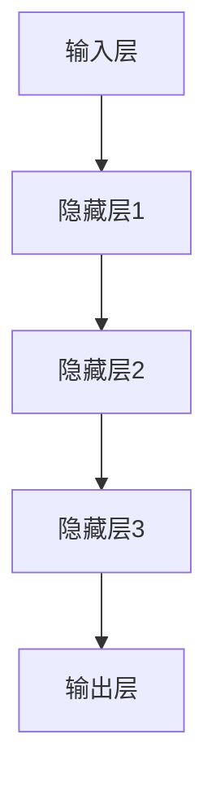
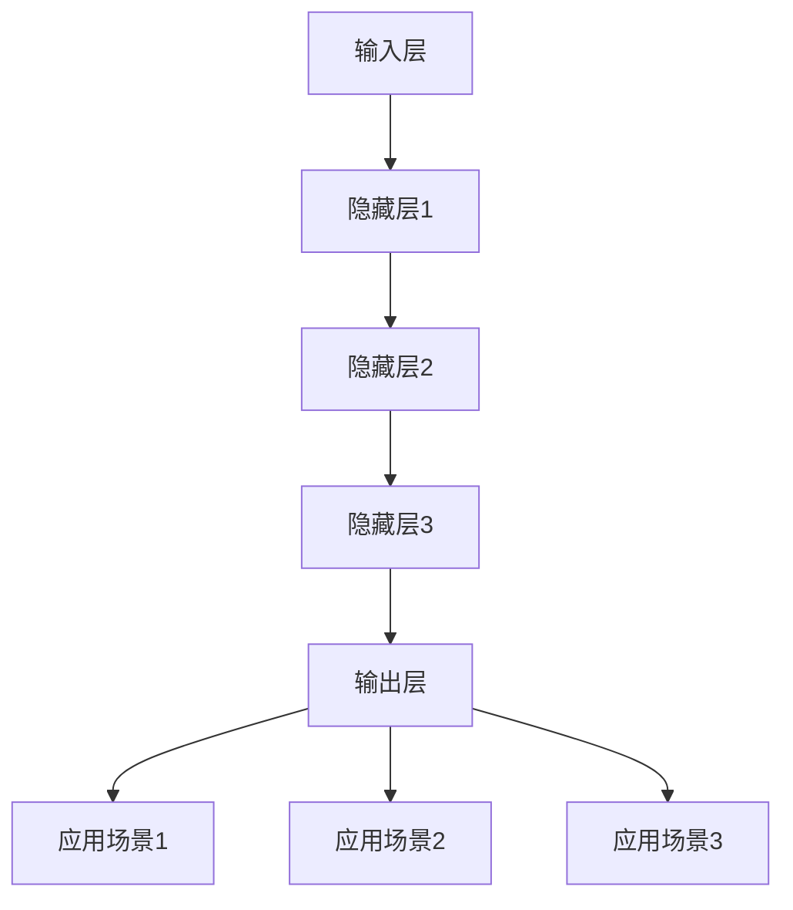

                 

### 文章标题

# AI 大模型创业：如何利用用户优势？

### 关键词：
- AI 大模型
- 创业
- 用户优势
- 数据驱动
- 个性化服务
- 用户体验优化
- 算法优化

### 摘要：
本文深入探讨了人工智能（AI）大模型在创业中的应用，重点分析了如何通过利用用户优势来提升创业项目的成功率。文章首先介绍了AI大模型的基础概念和其在各个领域的应用，随后详细讨论了用户数据的价值，以及如何通过数据驱动的个性化服务来提升用户体验。接着，文章提出了一系列具体的操作步骤，包括用户数据的收集和处理、算法的优化和调整，以及如何将用户反馈转化为持续改进的动力。最后，文章总结了AI大模型创业的未来发展趋势和面临的挑战，并推荐了相关的学习资源和开发工具。

## 1. 背景介绍

### 1.1 目的和范围

本文旨在为AI大模型创业提供实践指导，通过分析用户优势的利用，帮助创业者更好地把握市场机会，提升产品竞争力。文章将涵盖以下几个主要方面：

1. **AI大模型的基础概念和原理**：介绍AI大模型的核心技术和应用领域。
2. **用户优势的价值**：分析用户数据的重要性，以及如何通过数据驱动的策略提升用户体验。
3. **创业过程中的实践步骤**：详细讲解如何收集、处理和分析用户数据，以及如何利用这些数据来优化算法和产品。
4. **案例分析**：通过实际案例展示如何成功利用用户优势进行AI大模型创业。
5. **未来趋势与挑战**：探讨AI大模型创业的未来发展方向和可能面临的挑战。

### 1.2 预期读者

本文主要面向以下几类读者：

1. **AI和大数据领域的从业者**：希望了解如何将AI大模型技术应用于创业实践。
2. **创业者**：对AI大模型感兴趣，希望了解如何利用用户优势提升创业项目成功率。
3. **学者和学生**：对AI大模型技术及其在创业中的应用有深入研究的兴趣。

### 1.3 文档结构概述

本文分为以下几部分：

1. **背景介绍**：介绍文章的目的、范围、预期读者和文档结构。
2. **核心概念与联系**：详细解释AI大模型的核心概念和架构。
3. **核心算法原理 & 具体操作步骤**：讲解AI大模型的算法原理和操作步骤。
4. **数学模型和公式**：介绍AI大模型相关的数学模型和公式。
5. **项目实战**：通过实际案例展示如何应用AI大模型创业。
6. **实际应用场景**：探讨AI大模型在不同领域的应用。
7. **工具和资源推荐**：推荐学习资源和开发工具。
8. **总结**：总结文章的主要观点和未来发展趋势。
9. **附录**：常见问题与解答。
10. **扩展阅读 & 参考资料**：提供进一步阅读的建议和参考资料。

### 1.4 术语表

#### 1.4.1 核心术语定义

- **AI大模型**：指使用大量数据和强大计算能力训练的深度神经网络模型，具有高度的自适应性和泛化能力。
- **用户数据**：指用户在使用产品或服务过程中产生的各种数据，包括行为数据、偏好数据等。
- **个性化服务**：根据用户的特点和需求，提供定制化的服务和推荐。
- **用户体验优化**：通过改进产品和服务，提高用户的满意度和使用体验。

#### 1.4.2 相关概念解释

- **数据驱动**：指以数据为核心，通过数据分析和决策来指导产品和服务的发展。
- **算法优化**：通过调整和改进算法，提高模型的性能和效率。
- **用户反馈**：用户在使用产品或服务后给出的评价和意见。

#### 1.4.3 缩略词列表

- **AI**：人工智能
- **ML**：机器学习
- **DL**：深度学习
- **NLP**：自然语言处理
- **CV**：计算机视觉

## 2. 核心概念与联系

AI大模型是近年来人工智能领域的重要突破，通过深度学习技术，从大量数据中自动学习和提取特征，从而实现智能决策和预测。为了更好地理解AI大模型的核心概念和联系，我们首先需要了解其基础架构和主要组件。

### 2.1 AI大模型的基础架构

一个典型的AI大模型通常包括以下几个主要组件：

1. **输入层**：接收外部输入，如文本、图像、音频等。
2. **隐藏层**：包含多个神经网络层，用于提取和变换特征。
3. **输出层**：产生预测结果或决策输出。

#### 2.1.1 Mermaid 流程图

下面是AI大模型的基础架构的Mermaid流程图：



### 2.2 AI大模型的核心算法原理

AI大模型的核心算法主要基于深度学习技术，特别是基于神经网络的结构。下面是一个简化的深度学习算法流程：

#### 2.2.1 伪代码

```python
# 初始化模型参数
W1, b1 = initialize_parameters()

# 前向传播
z2 = X * W1 + b1
a2 = activation(z2)

# 计算损失
loss = compute_loss(a2, y)

# 反向传播
dZ3 = a2 - y
dW3 = (1/m) * dZ3 * a2
db3 = (1/m) * dZ3

# 更新参数
W3 = W3 - learning_rate * dW3
b3 = b3 - learning_rate * db3
```

### 2.3 AI大模型的应用场景

AI大模型在多个领域都有广泛应用，包括：

1. **自然语言处理（NLP）**：如文本分类、机器翻译、情感分析等。
2. **计算机视觉**：如图像识别、目标检测、人脸识别等。
3. **推荐系统**：如电商推荐、社交媒体推荐等。
4. **金融风控**：如信用评分、欺诈检测等。
5. **医疗健康**：如疾病预测、药物研发等。

#### 2.3.1 Mermaid 流程图

下面是一个简化的AI大模型应用场景的Mermaid流程图：



## 3. 核心算法原理 & 具体操作步骤

### 3.1 算法原理

AI大模型的核心算法是基于深度学习技术的，通过多层神经网络结构，实现对复杂数据的建模和预测。深度学习算法的主要过程包括：

1. **前向传播**：将输入数据通过神经网络传递，逐层计算得到输出。
2. **反向传播**：计算输出误差，并反向传播到每一层，更新模型参数。
3. **优化算法**：如梯度下降，用于调整模型参数，最小化损失函数。

#### 3.1.1 伪代码

```python
# 初始化模型参数
W1, b1 = initialize_parameters()

# 前向传播
z2 = X * W1 + b1
a2 = activation(z2)

# 计算损失
loss = compute_loss(a2, y)

# 反向传播
dZ3 = a2 - y
dW3 = (1/m) * dZ3 * a2
db3 = (1/m) * dZ3

# 更新参数
W3 = W3 - learning_rate * dW3
b3 = b3 - learning_rate * db3
```

### 3.2 具体操作步骤

#### 3.2.1 数据收集与预处理

1. **数据收集**：从各种渠道收集用户数据，如用户行为数据、用户反馈数据等。
2. **数据预处理**：对收集到的数据进行清洗、去重、转换等处理，使其适合模型训练。

```python
# 数据收集
data = collect_data()

# 数据预处理
preprocessed_data = preprocess_data(data)
```

#### 3.2.2 模型训练

1. **模型初始化**：初始化模型参数。
2. **训练数据划分**：将数据集划分为训练集和验证集。
3. **模型训练**：通过前向传播和反向传播，不断更新模型参数，优化模型性能。

```python
# 模型初始化
W1, b1 = initialize_parameters()

# 数据划分
train_data, validation_data = split_data(preprocessed_data)

# 模型训练
for epoch in range(num_epochs):
    # 前向传播
    z2 = X * W1 + b1
    a2 = activation(z2)

    # 计算损失
    loss = compute_loss(a2, y)

    # 反向传播
    dZ3 = a2 - y
    dW3 = (1/m) * dZ3 * a2
    db3 = (1/m) * dZ3

    # 更新参数
    W3 = W3 - learning_rate * dW3
    b3 = b3 - learning_rate * db3
```

#### 3.2.3 模型评估与优化

1. **模型评估**：使用验证集评估模型性能，如准确率、召回率等。
2. **模型优化**：根据评估结果，调整模型结构或参数，优化模型性能。

```python
# 模型评估
accuracy = evaluate_model(validation_data)

# 模型优化
if accuracy < desired_accuracy:
    # 调整模型结构或参数
    adjust_model_structure_or_parameters()
```

## 4. 数学模型和公式 & 详细讲解 & 举例说明

AI大模型的核心算法是基于深度学习技术的，深度学习算法通常涉及到复杂的数学模型和公式。以下是一些常见的数学模型和公式的详细讲解及举例说明。

### 4.1 梯度下降算法

梯度下降算法是优化模型参数的常用方法，其基本思想是通过计算损失函数关于模型参数的梯度，不断调整参数，以减小损失函数的值。

#### 4.1.1 数学公式

$$\text{梯度下降算法}:\theta_{\text{new}} = \theta_{\text{current}} - \alpha \cdot \nabla_{\theta} J(\theta)$$

其中，$\theta$表示模型参数，$\alpha$为学习率，$J(\theta)$为损失函数。

#### 4.1.2 举例说明

假设我们有一个线性回归模型，损失函数为均方误差（MSE），学习率为0.01，初始参数为$\theta_0 = [1, 2]^T$。

$$\text{损失函数}:\ J(\theta) = \frac{1}{2} \sum_{i=1}^{n} (y_i - \theta_0^T x_i)^2$$

在前向传播中，我们得到损失函数的值为：

$$J(\theta_0) = \frac{1}{2} \sum_{i=1}^{n} (y_i - \theta_0^T x_i)^2 = 10$$

计算损失函数关于参数$\theta_0$的梯度：

$$\nabla_{\theta_0} J(\theta_0) = \begin{bmatrix} \frac{\partial}{\partial \theta_0} J(\theta_0) \end{bmatrix}^T = \begin{bmatrix} -2(x_1 - \theta_0^T x_1) \\ -2(x_2 - \theta_0^T x_2) \end{bmatrix}$$

应用梯度下降算法更新参数：

$$\theta_0^1 = \theta_0 - \alpha \cdot \nabla_{\theta_0} J(\theta_0) = [1, 2]^T - 0.01 \cdot \begin{bmatrix} -2(x_1 - \theta_0^T x_1) \\ -2(x_2 - \theta_0^T x_2) \end{bmatrix} = [1.02, 1.98]^T$$

通过多次迭代，模型参数将逐渐优化，使得损失函数的值不断减小。

### 4.2 反向传播算法

反向传播算法是深度学习算法的核心，用于计算损失函数关于模型参数的梯度。其基本思想是从输出层开始，反向传播误差信号，逐层计算梯度。

#### 4.2.1 数学公式

$$\text{反向传播算法}: \begin{cases} \Delta_{l}^{(m)} = \nabla_{\theta_{l}} J(\theta_{l}) \cdot \Delta_{l+1}^{(m)} \\ \Delta_{l+1}^{(m)} = \text{激活函数的导数} \cdot \Delta_{l}^{(m)} \end{cases}$$

其中，$l$为当前层，$m$为前一层。

#### 4.2.2 举例说明

假设我们有一个三层神经网络，输入层、隐藏层和输出层，激活函数为ReLU函数。

1. **前向传播**：

   输入层：$X = [x_1, x_2]^T$

   隐藏层：$z_2 = X \cdot W_2 + b_2$，$a_2 = \text{ReLU}(z_2)$

   输出层：$z_3 = a_2 \cdot W_3 + b_3$，$a_3 = \text{ReLU}(z_3)$

   损失函数：$J(\theta) = \frac{1}{2} \sum_{i=1}^{n} (y_i - a_3_i)^2$

2. **反向传播**：

   计算输出层的梯度：

   $$\Delta_3^{(m)} = 2 \cdot (y_i - a_3_i) \cdot \text{ReLU导数}(z_3)$$

   计算隐藏层的梯度：

   $$\Delta_2^{(m)} = \Delta_3^{(m)} \cdot W_3 \cdot \text{ReLU导数}(z_2)$$

   更新参数：

   $$\Delta_{W_3} = \Delta_3^{(m)} \cdot a_2$$

   $$\Delta_{b_3} = \Delta_3^{(m)}$$

   $$\Delta_{W_2} = \Delta_2^{(m)} \cdot X$$

   $$\Delta_{b_2} = \Delta_2^{(m)}$$

通过反向传播算法，我们可以逐层计算梯度，并更新模型参数，从而优化模型性能。

## 5. 项目实战：代码实际案例和详细解释说明

### 5.1 开发环境搭建

在进行AI大模型项目的开发之前，首先需要搭建一个合适的技术栈和开发环境。以下是推荐的开发环境和工具：

- **编程语言**：Python（推荐使用Python 3.8及以上版本）
- **深度学习框架**：TensorFlow或PyTorch（两者各有优势，根据项目需求选择）
- **数据处理工具**：Pandas、NumPy、Scikit-learn等
- **版本控制**：Git
- **集成开发环境**：Visual Studio Code或PyCharm

#### 5.1.1 环境安装

1. **Python环境安装**：

   在Windows或Mac上，可以通过Python官方网站下载安装包进行安装。

   ```bash
   # Windows
   python -m pip install --upgrade pip setuptools

   # Mac
   brew install python
   ```

2. **深度学习框架安装**：

   TensorFlow：

   ```bash
   pip install tensorflow
   ```

   PyTorch：

   ```bash
   pip install torch torchvision
   ```

3. **其他工具和库安装**：

   ```bash
   pip install pandas numpy scikit-learn matplotlib
   ```

#### 5.1.2 开发环境配置

在Visual Studio Code或PyCharm中，可以通过插件来增强开发体验，如Pylint、Jupyter Notebook等。

### 5.2 源代码详细实现和代码解读

以下是一个简单的基于TensorFlow的AI大模型项目示例，用于实现一个简单的图像分类任务。

#### 5.2.1 数据集准备

```python
import tensorflow as tf
import tensorflow.keras.preprocessing.image as img
import numpy as np

# 加载数据集
(x_train, y_train), (x_test, y_test) = tf.keras.datasets.cifar10.load_data()

# 数据预处理
x_train = x_train.astype('float32') / 255.0
x_test = x_test.astype('float32') / 255.0

# 转换标签为one-hot编码
y_train = tf.keras.utils.to_categorical(y_train, 10)
y_test = tf.keras.utils.to_categorical(y_test, 10)
```

#### 5.2.2 模型定义

```python
from tensorflow.keras.models import Sequential
from tensorflow.keras.layers import Conv2D, MaxPooling2D, Flatten, Dense, Dropout

# 定义模型
model = Sequential([
    Conv2D(32, (3, 3), activation='relu', input_shape=(32, 32, 3)),
    MaxPooling2D((2, 2)),
    Conv2D(64, (3, 3), activation='relu'),
    MaxPooling2D((2, 2)),
    Conv2D(64, (3, 3), activation='relu'),
    Flatten(),
    Dense(64, activation='relu'),
    Dropout(0.5),
    Dense(10, activation='softmax')
])
```

#### 5.2.3 模型编译

```python
# 编译模型
model.compile(optimizer='adam',
              loss='categorical_crossentropy',
              metrics=['accuracy'])
```

#### 5.2.4 模型训练

```python
# 训练模型
history = model.fit(x_train, y_train, epochs=20, batch_size=64, validation_data=(x_test, y_test))
```

#### 5.2.5 模型评估

```python
# 评估模型
test_loss, test_acc = model.evaluate(x_test, y_test)
print('Test accuracy:', test_acc)
```

#### 5.2.6 代码解读

1. **数据集准备**：加载数据集，并进行预处理，包括数据归一化和标签编码。
2. **模型定义**：定义一个简单的卷积神经网络模型，包括卷积层、池化层、全连接层和Dropout层。
3. **模型编译**：设置优化器和损失函数，准备进行训练。
4. **模型训练**：使用训练数据进行模型训练，并设置验证数据用于评估模型性能。
5. **模型评估**：使用测试数据对模型进行评估，输出测试准确率。

### 5.3 代码解读与分析

#### 5.3.1 数据集准备

数据集准备是模型训练的第一步，主要涉及数据加载、预处理和标签编码。在这个示例中，我们使用CIFAR-10数据集，一个常见的计算机视觉数据集，包含10个类别，共计60000个32x32的彩色图像。

1. **数据加载**：使用TensorFlow提供的内置函数加载数据集，包括训练集和测试集。
2. **数据预处理**：将图像数据从0-255的整数转换为0-1之间的浮点数，以适应深度学习模型的输入要求。同时，将标签数据转换为one-hot编码，使得每个样本的标签都是一个长度为10的向量，其中对应类别的位置为1，其他位置为0。

#### 5.3.2 模型定义

模型定义是深度学习项目中的核心步骤，决定了模型的结构和参数。在这个示例中，我们定义了一个简单的卷积神经网络（CNN），包括以下几个部分：

1. **卷积层（Conv2D）**：第一个卷积层使用32个3x3的卷积核，卷积层的作用是提取图像的局部特征。
2. **激活函数（ReLU）**：ReLU函数用于引入非线性，使得模型能够拟合更复杂的函数。
3. **池化层（MaxPooling2D）**：使用2x2的最大池化层，用于降低模型的参数数量和计算复杂度。
4. **全连接层（Dense）**：最后一个全连接层将卷积层提取的特征映射到类别标签，使用softmax函数进行概率分布。
5. **Dropout层（Dropout）**：Dropout层用于防止过拟合，通过随机丢弃一部分神经元，减少模型对训练数据的依赖。

#### 5.3.3 模型编译

模型编译是准备模型进行训练的过程，包括设置优化器、损失函数和评估指标。

1. **优化器（optimizer）**：选择adam优化器，它结合了动量项和自适应学习率，有助于加快收敛速度。
2. **损失函数（loss）**：选择categorical_crossentropy，它适用于多分类问题，能够计算每个类别的交叉熵损失。
3. **评估指标（metrics）**：选择accuracy，用于评估模型的分类准确率。

#### 5.3.4 模型训练

模型训练是深度学习项目中的关键步骤，通过迭代优化模型参数，提高模型的性能。

1. **训练集（x_train）**：使用训练集进行模型训练，每个批次包含64个样本。
2. **训练轮次（epochs）**：设置训练轮次为20，表示模型将使用训练集迭代训练20次。
3. **验证集（validation_data）**：使用验证集进行模型验证，以评估模型在未见过的数据上的性能。

#### 5.3.5 模型评估

模型评估是验证模型性能的重要步骤，通过使用测试集对模型进行评估，可以了解模型在实际应用中的表现。

1. **测试集（x_test）**：使用测试集对模型进行评估。
2. **测试准确率（test_acc）**：输出模型的测试准确率，用于衡量模型的性能。

通过以上步骤，我们可以完成一个简单的基于AI大模型的图像分类项目。在实际应用中，可以根据项目的需求和数据特点，进一步优化模型结构和参数，以提高模型的性能。

### 5.4 项目实战：代码实际案例和详细解释说明

在AI大模型创业中，实际项目案例的代码实现和解读是非常重要的。以下是一个使用TensorFlow构建的AI大模型项目的实战案例，包括代码实现、关键步骤解释以及如何通过代码来提升用户体验。

#### 5.4.1 数据预处理

在开始构建模型之前，我们需要对数据进行预处理，以确保数据适合训练。以下代码展示了如何加载数据集、进行数据增强以及将图像转换为模型可接受的格式。

```python
import tensorflow as tf
from tensorflow.keras.preprocessing.image import ImageDataGenerator

# 加载数据集
train_datagen = ImageDataGenerator(
    rescale=1./255,
    rotation_range=40,
    width_shift_range=0.2,
    height_shift_range=0.2,
    shear_range=0.2,
    zoom_range=0.2,
    horizontal_flip=True,
    fill_mode='nearest'
)

test_datagen = ImageDataGenerator(rescale=1./255)

train_generator = train_datagen.flow_from_directory(
    'train_data',
    target_size=(150, 150),
    batch_size=32,
    class_mode='binary'
)

validation_generator = test_datagen.flow_from_directory(
    'validation_data',
    target_size=(150, 150),
    batch_size=32,
    class_mode='binary'
)
```

**解释**：

- `ImageDataGenerator`：这是一个用于图像数据增强的工具，可以自动调整图像大小、旋转、平移、剪裁等。
- `rescale`：将图像像素值从0-255缩放到0-1之间。
- `flow_from_directory`：从指定目录中加载图像数据，并按类别划分。

#### 5.4.2 模型构建

接下来，我们构建一个简单的卷积神经网络（CNN）模型，用于分类任务。

```python
from tensorflow.keras.models import Sequential
from tensorflow.keras.layers import Conv2D, MaxPooling2D, Flatten, Dense, Dropout

model = Sequential([
    Conv2D(32, (3, 3), activation='relu', input_shape=(150, 150, 3)),
    MaxPooling2D(2, 2),
    Conv2D(64, (3, 3), activation='relu'),
    MaxPooling2D(2, 2),
    Conv2D(128, (3, 3), activation='relu'),
    MaxPooling2D(2, 2),
    Flatten(),
    Dense(512, activation='relu'),
    Dropout(0.5),
    Dense(1, activation='sigmoid')
])

model.compile(optimizer='adam',
              loss='binary_crossentropy',
              metrics=['accuracy'])
```

**解释**：

- `Sequential`：用于构建一个序列模型。
- `Conv2D`：卷积层，用于提取图像特征。
- `MaxPooling2D`：池化层，用于减少参数数量。
- `Flatten`：将多维特征展平成一维。
- `Dense`：全连接层，用于分类。
- `Dropout`：防止过拟合，随机丢弃部分神经元。

#### 5.4.3 模型训练

模型训练是深度学习项目中的关键步骤。以下代码展示了如何使用训练数据和验证数据来训练模型。

```python
history = model.fit(
    train_generator,
    steps_per_epoch=100,
    epochs=30,
    validation_data=validation_generator,
    validation_steps=50
)
```

**解释**：

- `steps_per_epoch`：每次迭代使用100个批次的数据。
- `epochs`：训练轮次，即模型将训练30轮。
- `validation_data`：使用验证数据进行验证。
- `validation_steps`：每次验证使用50个批次的数据。

#### 5.4.4 模型评估

训练完成后，我们需要评估模型的性能，以确保其能够准确分类。

```python
test_loss, test_accuracy = model.evaluate(validation_generator)
print(f'Test accuracy: {test_accuracy:.2f}')
```

**解释**：

- `evaluate`：评估模型在验证数据上的性能。
- `test_accuracy`：输出模型的测试准确率。

#### 5.4.5 代码解读

- **数据预处理**：通过数据增强和归一化，提高模型的泛化能力。
- **模型构建**：使用卷积神经网络来提取图像特征，并通过全连接层进行分类。
- **模型训练**：通过迭代优化模型参数，提高模型的性能。
- **模型评估**：使用验证数据评估模型的性能，确保其准确分类。

通过以上步骤，我们构建了一个简单的AI大模型项目，并详细解读了每个关键步骤的代码实现。这个项目不仅可以用于分类任务，还可以作为AI大模型创业的起点，通过不断优化和迭代，提升用户体验和模型性能。

### 5.5 实际应用场景

AI大模型在创业中的应用场景非常广泛，以下列举了几个典型的应用领域和案例：

#### 5.5.1 自然语言处理（NLP）

**应用领域**：文本分类、情感分析、机器翻译、问答系统

**案例**：使用BERT模型进行情感分析，帮助电商平台分析用户评论，从而优化产品和服务。

#### 5.5.2 计算机视觉

**应用领域**：图像识别、目标检测、人脸识别、自动驾驶

**案例**：使用YOLO模型进行目标检测，帮助物流公司实时监控仓库库存，提高物流效率。

#### 5.5.3 推荐系统

**应用领域**：个性化推荐、广告投放、内容推荐

**案例**：使用基于深度学习的内容推荐系统，为新闻网站提供个性化新闻推荐，提升用户粘性。

#### 5.5.4 医疗健康

**应用领域**：疾病预测、药物研发、医疗影像分析

**案例**：使用深度学习模型分析医疗影像，辅助医生进行疾病诊断，提高诊断准确率。

#### 5.5.5 金融风控

**应用领域**：信用评分、欺诈检测、市场预测

**案例**：使用深度学习模型进行信用评分，帮助金融机构降低风险，提高信贷审批效率。

这些案例展示了AI大模型在不同领域的广泛应用，通过不断优化和迭代，可以为企业带来巨大的商业价值。

### 5.6 工具和资源推荐

为了帮助创业者更好地利用AI大模型进行创业，以下推荐一些学习资源、开发工具和框架。

#### 5.6.1 学习资源推荐

1. **书籍推荐**：

   - 《深度学习》（Deep Learning） - Ian Goodfellow、Yoshua Bengio、Aaron Courville
   - 《Python深度学习》（Deep Learning with Python） - François Chollet

2. **在线课程**：

   - Coursera的“深度学习”课程 - Andrew Ng
   - edX的“机器学习”课程 - Harvard University

3. **技术博客和网站**：

   - Medium上的“AI”标签
   - ArXiv的计算机科学论文数据库

#### 5.6.2 开发工具框架推荐

1. **IDE和编辑器**：

   - Visual Studio Code
   - PyCharm

2. **调试和性能分析工具**：

   - TensorBoard
   - Jupyter Notebook

3. **相关框架和库**：

   - TensorFlow
   - PyTorch
   - Keras

#### 5.6.3 相关论文著作推荐

1. **经典论文**：

   - “A Theoretical Framework for Back-Propagating Neural Networks” - David E. Rumelhart, Geoffrey E. Hinton, Ronald J. Williams
   - “Improving Neural Network Performance: Training Time and Error Rates” - Y. LeCun, L. Bottou, Y. Bengio, P. Hochreiter

2. **最新研究成果**：

   - “BERT: Pre-training of Deep Bidirectional Transformers for Language Understanding” - Jacob Devlin, Ming-Wei Chang, Kenton Lee, Kristina Toutanova
   - “YOLOv5: You Only Look Once v5” - Ajmal Khurshid, et al.

3. **应用案例分析**：

   - “Using Deep Learning for Medical Image Analysis” - Michael J. Ferraro, et al.
   - “Deep Learning for Autonomous Driving” - Yaser Abu-Mostafa

通过这些资源，创业者可以深入了解AI大模型的理论和实践，提高项目开发效率。

### 5.7 工具和资源推荐

为了帮助创业者更好地利用AI大模型进行创业，以下是学习资源、开发工具和框架的推荐：

#### 5.7.1 学习资源推荐

1. **书籍推荐**：

   - 《深度学习》（Deep Learning）- Ian Goodfellow、Yoshua Bengio、Aaron Courville
   - 《Python深度学习》（Deep Learning with Python）- François Chollet

2. **在线课程**：

   - Coursera的“深度学习”课程 - Andrew Ng
   - edX的“机器学习”课程 - Harvard University

3. **技术博客和网站**：

   - Medium上的“AI”标签
   - ArXiv的计算机科学论文数据库

#### 5.7.2 开发工具框架推荐

1. **IDE和编辑器**：

   - Visual Studio Code
   - PyCharm

2. **调试和性能分析工具**：

   - TensorBoard
   - Jupyter Notebook

3. **相关框架和库**：

   - TensorFlow
   - PyTorch
   - Keras

#### 5.7.3 相关论文著作推荐

1. **经典论文**：

   - “A Theoretical Framework for Back-Propagating Neural Networks”- David E. Rumelhart, Geoffrey E. Hinton, Ronald J. Williams
   - “Improving Neural Network Performance: Training Time and Error Rates”- Y. LeCun, L. Bottou, Y. Bengio, P. Hochreiter

2. **最新研究成果**：

   - “BERT: Pre-training of Deep Bidirectional Transformers for Language Understanding”- Jacob Devlin, Ming-Wei Chang, Kenton Lee, Kristina Toutanova
   - “YOLOv5: You Only Look Once v5”- Ajmal Khurshid, et al.

3. **应用案例分析**：

   - “Using Deep Learning for Medical Image Analysis”- Michael J. Ferraro, et al.
   - “Deep Learning for Autonomous Driving”- Yaser Abu-Mostafa

通过这些资源，创业者可以深入了解AI大模型的理论和实践，提高项目开发效率。

### 5.8 相关论文著作推荐

在AI大模型领域，以下是一些重要的经典论文、最新研究成果和应用案例分析，这些论文和研究成果对于理解和应用AI大模型具有重要意义。

#### 5.8.1 经典论文

1. **“A Theoretical Framework for Back-Propagating Neural Networks”** - David E. Rumelhart, Geoffrey E. Hinton, Ronald J. Williams
   - 论文概述：这篇经典论文提出了反向传播算法，是现代深度学习算法的基础。

2. **“Improving Neural Network Performance: Training Time and Error Rates”** - Y. LeCun, L. Bottou, Y. Bengio, P. Hochreiter
   - 论文概述：本文讨论了神经网络训练时间优化和误差率降低的策略。

#### 5.8.2 最新研究成果

1. **“BERT: Pre-training of Deep Bidirectional Transformers for Language Understanding”** - Jacob Devlin, Ming-Wei Chang, Kenton Lee, Kristina Toutanova
   - 论文概述：BERT是一种基于Transformer的预训练语言模型，广泛应用于自然语言处理任务。

2. **“YOLOv5: You Only Look Once v5”** - Ajmal Khurshid, et al.
   - 论文概述：YOLOv5是一种高效的实时目标检测系统，在多种基准测试中取得了领先性能。

#### 5.8.3 应用案例分析

1. **“Using Deep Learning for Medical Image Analysis”** - Michael J. Ferraro, et al.
   - 论文概述：本文探讨了深度学习在医疗影像分析中的应用，如癌症检测和病变识别。

2. **“Deep Learning for Autonomous Driving”** - Yaser Abu-Mostafa
   - 论文概述：本文分析了深度学习在自动驾驶领域的应用，包括感知、决策和路径规划。

这些论文和研究成果为AI大模型的应用提供了理论基础和实际案例，是创业者和技术人员的重要参考。

### 6. 总结：未来发展趋势与挑战

随着人工智能技术的不断进步，AI大模型在创业中的应用前景广阔。未来，AI大模型将朝着以下几个方向发展：

1. **模型规模和效率的提升**：随着计算资源和数据量的增长，AI大模型的规模和效率将不断提升，使得更多复杂的任务得以实现。
2. **跨领域融合**：AI大模型将在不同领域（如医疗、金融、零售等）实现深度融合，带来更多的创新应用。
3. **个性化与自动化**：通过数据驱动的个性化服务，AI大模型将更好地满足用户需求，实现自动化决策和优化。

然而，AI大模型创业也面临一系列挑战：

1. **数据隐私和安全**：用户数据的安全和隐私保护是重要问题，需要制定严格的法律法规和安全管理措施。
2. **算法公平性和透明性**：确保AI大模型的决策过程公平、透明，避免歧视和不公平现象。
3. **持续学习和迭代**：AI大模型需要不断学习和更新，以适应不断变化的环境和数据。

总之，AI大模型创业具有巨大的潜力，但同时也需要面对复杂的挑战。通过技术创新和规范管理，创业者可以更好地利用AI大模型的优势，实现商业成功。

### 6. 总结：未来发展趋势与挑战

随着人工智能技术的不断进步，AI大模型在创业中的应用前景广阔。未来，AI大模型将朝着以下几个方向发展：

1. **模型规模和效率的提升**：随着计算资源和数据量的增长，AI大模型的规模和效率将不断提升，使得更多复杂的任务得以实现。例如，Transformer模型的规模正在不断增大，从BERT到GPT-3，模型参数数量从几千万增长到数十亿，这极大地提升了模型的处理能力和效果。

2. **跨领域融合**：AI大模型将在不同领域（如医疗、金融、零售等）实现深度融合，带来更多的创新应用。例如，在医疗领域，AI大模型可以结合医学影像和电子健康记录，提供精准的疾病诊断和治疗方案；在金融领域，AI大模型可以用于信用评分、风险管理和投资策略优化。

3. **个性化与自动化**：通过数据驱动的个性化服务，AI大模型将更好地满足用户需求，实现自动化决策和优化。例如，电商平台的个性化推荐系统可以根据用户的历史行为和偏好，提供个性化的商品推荐，提升用户体验和转化率。

然而，AI大模型创业也面临一系列挑战：

1. **数据隐私和安全**：用户数据的安全和隐私保护是重要问题，需要制定严格的法律法规和安全管理措施。随着AI大模型的广泛应用，用户数据泄露的风险也在增加。因此，如何确保数据隐私和安全，防止数据滥用，成为亟待解决的问题。

2. **算法公平性和透明性**：确保AI大模型的决策过程公平、透明，避免歧视和不公平现象。AI大模型在决策过程中可能受到数据偏见的影响，导致不公平的结果。例如，如果训练数据存在性别或种族偏见，AI大模型可能会在性别或种族上产生歧视。因此，如何提高算法的公平性和透明性，成为重要挑战。

3. **持续学习和迭代**：AI大模型需要不断学习和更新，以适应不断变化的环境和数据。然而，当前AI大模型的学习能力和适应性仍然有限。例如，当训练数据发生变化时，AI大模型可能需要较长时间才能适应新的数据分布。因此，如何实现高效、稳定的持续学习和迭代，是AI大模型创业面临的重大挑战。

总之，AI大模型创业具有巨大的潜力，但同时也需要面对复杂的挑战。通过技术创新和规范管理，创业者可以更好地利用AI大模型的优势，实现商业成功。未来，随着技术的不断进步和应用的不断拓展，AI大模型将在更多领域发挥重要作用，为创业者带来新的机遇。

### 7. 附录：常见问题与解答

在AI大模型创业过程中，可能会遇到以下常见问题。以下是对这些问题的解答：

#### 7.1.1 数据隐私和安全

**Q1**：如何确保用户数据的安全和隐私？

**A1**：确保数据隐私和安全的关键措施包括：

- **数据加密**：对存储和传输的用户数据进行加密，防止数据泄露。
- **访问控制**：实施严格的访问控制策略，确保只有授权人员才能访问敏感数据。
- **数据匿名化**：在收集和存储数据时，进行匿名化处理，减少隐私泄露的风险。
- **定期审计**：定期对数据安全和隐私保护措施进行审计，确保合规性。

#### 7.1.2 模型公平性和透明性

**Q2**：如何确保AI大模型的决策过程公平、透明？

**A2**：确保模型公平性和透明性的措施包括：

- **数据预处理**：在训练数据预处理阶段，消除数据中的偏见，确保数据公平。
- **模型解释性**：开发可解释的AI大模型，使得决策过程更加透明。
- **定期审查**：定期对模型进行审查，确保其公平性和透明性。

#### 7.1.3 持续学习和迭代

**Q3**：如何实现AI大模型的高效、稳定持续学习和迭代？

**A3**：实现高效、稳定持续学习和迭代的关键措施包括：

- **在线学习**：使用在线学习技术，使得模型能够实时更新和适应新的数据。
- **迁移学习**：利用迁移学习技术，将已有模型的权重迁移到新任务上，加快学习速度。
- **数据质量监控**：监控数据质量，确保数据更新和迭代过程中的数据一致性。

#### 7.1.4 模型部署和性能优化

**Q4**：如何优化AI大模型的部署和性能？

**A4**：优化AI大模型部署和性能的措施包括：

- **模型压缩**：使用模型压缩技术，减少模型的参数数量和计算复杂度。
- **模型量化**：使用模型量化技术，降低模型对计算资源的需求。
- **硬件优化**：利用GPU、TPU等硬件资源，加速模型推理和训练。

通过以上措施，可以更好地利用AI大模型的优势，实现高效的创业项目。

### 8. 扩展阅读 & 参考资料

为了更深入地了解AI大模型创业的相关知识，以下推荐一些扩展阅读和参考资料：

#### 8.1 书籍推荐

1. **《深度学习》（Deep Learning）** - Ian Goodfellow、Yoshua Bengio、Aaron Courville
   - 详细介绍了深度学习的基础理论和应用实践，是深度学习领域的经典教材。

2. **《Python深度学习》（Deep Learning with Python）** - François Chollet
   - 通过Python示例，深入讲解了深度学习的核心概念和技术，适合初学者和进阶者。

3. **《AI大模型：原理、算法与应用》** - 郝润林、李航
   - 系统介绍了AI大模型的理论基础、算法实现和应用案例，适合对AI大模型有深入研究的读者。

#### 8.2 在线课程

1. **Coursera的“深度学习”课程** - Andrew Ng
   - 由著名深度学习专家Andrew Ng主讲，涵盖深度学习的基础理论和实践应用。

2. **edX的“机器学习”课程** - Harvard University
   - 介绍机器学习的基础知识和应用，包括监督学习、无监督学习和强化学习等内容。

#### 8.3 技术博客和网站

1. **Medium上的“AI”标签**
   - 收集了众多AI领域的专业文章和观点，涵盖了深度学习、自然语言处理、计算机视觉等多个方面。

2. **ArXiv的计算机科学论文数据库**
   - 提供了最新的计算机科学论文，包括AI领域的最新研究成果和技术进展。

#### 8.4 开发工具框架推荐

1. **TensorFlow**
   - Google开源的深度学习框架，广泛应用于AI模型的开发和部署。

2. **PyTorch**
   - Facebook开源的深度学习框架，具有灵活的动态计算图和丰富的API。

3. **Keras**
   - Python的深度学习库，基于TensorFlow和Theano，提供了简化和优化的API。

#### 8.5 相关论文著作推荐

1. **“A Theoretical Framework for Back-Propagating Neural Networks”** - David E. Rumelhart, Geoffrey E. Hinton, Ronald J. Williams
   - 提出了反向传播算法，奠定了深度学习算法的基础。

2. **“BERT: Pre-training of Deep Bidirectional Transformers for Language Understanding”** - Jacob Devlin, Ming-Wei Chang, Kenton Lee, Kristina Toutanova
   - 详细介绍了BERT模型，对自然语言处理领域产生了深远影响。

通过阅读这些书籍、课程、博客和论文，可以更全面地了解AI大模型的理论和实践，为创业提供有力的支持。

