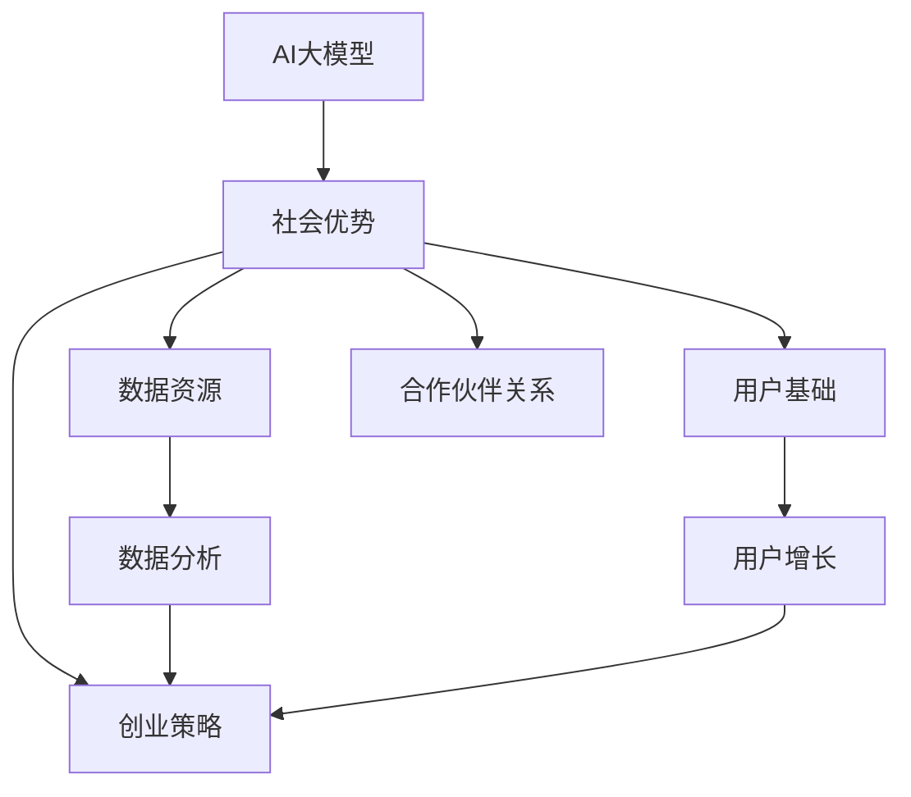
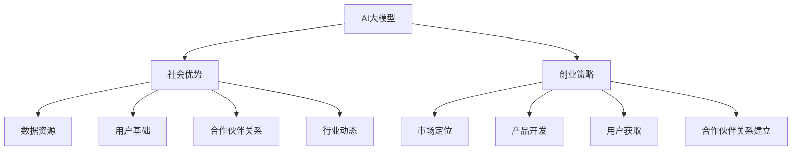

                 

# AI 大模型创业：如何利用社会优势？

> **关键词：** AI大模型，创业，社会优势，策略，数据分析，用户增长

> **摘要：** 本文将探讨如何利用社会优势推动AI大模型创业。我们将分析社会优势的重要性，如何识别和利用这些优势，以及如何通过策略、数据分析和用户增长实现成功。

## 1. 背景介绍

### 1.1 目的和范围

本文旨在为那些有兴趣利用AI大模型创业的人提供指导。我们将深入探讨如何利用社会优势，包括但不限于数据资源、用户基础、合作伙伴关系和行业动态。本文将提供一个全面的框架，帮助读者理解如何将社会优势转化为商业机会。

### 1.2 预期读者

- AI领域创业者
- 数据科学家
- 产品经理
- 技术架构师
- 对AI大模型创业感兴趣的任何人

### 1.3 文档结构概述

本文将分为以下几个部分：

1. **背景介绍**：介绍本文的目的和预期读者。
2. **核心概念与联系**：定义AI大模型和相关概念。
3. **核心算法原理 & 具体操作步骤**：详细解释AI大模型的算法原理和操作步骤。
4. **数学模型和公式 & 详细讲解 & 举例说明**：介绍AI大模型的数学模型和公式，并提供实例说明。
5. **项目实战：代码实际案例和详细解释说明**：提供实际代码案例和详细解释。
6. **实际应用场景**：讨论AI大模型在不同领域的应用。
7. **工具和资源推荐**：推荐学习资源和开发工具。
8. **总结：未来发展趋势与挑战**：总结AI大模型创业的现状和未来趋势。
9. **附录：常见问题与解答**：回答常见问题。
10. **扩展阅读 & 参考资料**：提供进一步阅读的材料。

### 1.4 术语表

#### 1.4.1 核心术语定义

- **AI大模型**：具有巨大参数量和复杂结构的机器学习模型，如GPT-3、BERT等。
- **社会优势**：企业在资源、知识、网络等方面相对于竞争对手的优势。
- **数据资源**：企业可用的数据集和数据源。
- **用户基础**：企业的现有用户群体。
- **合作伙伴关系**：企业与外部组织或个人的合作关系。

#### 1.4.2 相关概念解释

- **策略**：企业为实现特定目标而制定的行动计划。
- **数据分析**：使用统计学和机器学习技术对数据进行分析和处理。
- **用户增长**：通过营销和用户获取策略增加用户数量。

#### 1.4.3 缩略词列表

- **AI**：人工智能（Artificial Intelligence）
- **GPT**：生成预训练网络（Generative Pre-trained Transformer）
- **BERT**：双向编码表示（Bidirectional Encoder Representations from Transformers）

## 2. 核心概念与联系

在讨论如何利用社会优势之前，我们需要明确几个核心概念和它们之间的关系。以下是一个Mermaid流程图，展示了AI大模型、社会优势和创业策略之间的联系。



### 2.1 AI大模型

AI大模型是机器学习领域的一个重要研究方向。它们通常具有数十亿甚至数万亿个参数，能够处理大量数据并进行复杂的信息处理。这些模型在自然语言处理、计算机视觉、推荐系统等多个领域取得了显著成果。

### 2.2 社会优势

社会优势是企业相对于竞争对手的独特优势，包括但不限于数据资源、用户基础、合作伙伴关系和行业动态。这些优势可以帮助企业更有效地开发和推广产品，从而在激烈的市场竞争中脱颖而出。

### 2.3 创业策略

创业策略是企业为实现特定目标而制定的行动计划。这些策略包括市场定位、产品开发、用户获取、合作伙伴关系建立等。通过利用社会优势，企业可以更有效地制定和执行这些策略。

## 3. 核心算法原理 & 具体操作步骤

AI大模型的算法原理通常基于深度学习和神经网络。以下是一个简化的伪代码，描述了AI大模型的基本操作步骤。

```python
# 伪代码：AI大模型算法原理

# 初始化模型参数
initialize_model_parameters()

# 预训练模型
pretrain_model_on_large_dataset()

# 微调模型以适应特定任务
finetune_model_on_specific_dataset()

# 训练模型
train_model_with_new_data()

# 预测
make_prediction(input_data)
```

### 3.1 初始化模型参数

初始化模型参数是AI大模型开发的第一步。通常，这些参数包括权重、偏置和激活函数。一个好的初始化方法可以加快模型的收敛速度并提高最终性能。

```python
# 伪代码：初始化模型参数

initialize_weights()
initialize_bias()
initialize_activation_function()
```

### 3.2 预训练模型

预训练模型是在大规模数据集上训练的过程。这一步骤的目的是让模型学习到通用特征，以便在特定任务上表现良好。

```python
# 伪代码：预训练模型

pretrain_model(dataset)
```

### 3.3 微调模型

微调模型是在特定任务上进一步训练模型的过程。这一步骤通常用于将预训练模型应用于新的任务。

```python
# 伪代码：微调模型

finetune_model(dataset)
```

### 3.4 训练模型

训练模型是AI大模型开发的核心步骤。这一步骤包括优化模型参数、调整学习率、处理过拟合等问题。

```python
# 伪代码：训练模型

train_model(optimizer, learning_rate, validation_data)
```

### 3.5 预测

预测是模型在实际应用中的关键步骤。模型将接收输入数据，并输出预测结果。

```python
# 伪代码：预测

make_prediction(input_data)
```

## 4. 数学模型和公式 & 详细讲解 & 举例说明

AI大模型的数学模型通常基于深度学习和神经网络。以下是一个简化的数学模型，包括损失函数、优化器和学习率。

### 4.1 损失函数

损失函数是衡量模型预测误差的指标。一个常见的损失函数是均方误差（MSE）。

$$
\text{MSE} = \frac{1}{n}\sum_{i=1}^{n}(y_i - \hat{y}_i)^2
$$

其中，$y_i$ 是真实值，$\hat{y}_i$ 是模型预测值，$n$ 是样本数量。

### 4.2 优化器

优化器是用于调整模型参数的工具。一个常见的优化器是随机梯度下降（SGD）。

$$
w_{\text{new}} = w_{\text{old}} - \alpha \cdot \nabla_w \text{MSE}
$$

其中，$w$ 是模型参数，$\alpha$ 是学习率。

### 4.3 学习率

学习率是优化器的一个重要参数，决定了参数更新的幅度。一个常见的学习率调整策略是指数衰减。

$$
\alpha_{\text{new}} = \alpha_{\text{old}} \cdot \gamma
$$

其中，$\gamma$ 是衰减率。

### 4.4 举例说明

假设我们有一个回归任务，目标值是1，模型预测值是0.9。使用均方误差（MSE）作为损失函数，学习率是0.1。计算损失函数的值。

$$
\text{MSE} = \frac{1}{1}(1 - 0.9)^2 = 0.01
$$

接下来，使用随机梯度下降（SGD）更新模型参数。

$$
w_{\text{new}} = w_{\text{old}} - 0.1 \cdot \nabla_w \text{MSE}
$$

其中，$\nabla_w \text{MSE}$ 是损失函数关于参数 $w$ 的梯度。

## 5. 项目实战：代码实际案例和详细解释说明

### 5.1 开发环境搭建

在开始编写代码之前，我们需要搭建一个合适的开发环境。以下是一个Python开发环境的搭建步骤。

```python
# 安装Python
curl -O https://www.python.org/ftp/python/3.8.5/python-3.8.5.tgz
tar -xvf python-3.8.5.tgz
cd python-3.8.5
./configure
make
sudo make install

# 安装深度学习库
pip install tensorflow
pip install keras
```

### 5.2 源代码详细实现和代码解读

以下是一个简单的AI大模型代码案例，使用TensorFlow和Keras库实现。

```python
# 导入所需库
import tensorflow as tf
from tensorflow.keras.models import Sequential
from tensorflow.keras.layers import Dense, Dropout, Embedding, LSTM

# 创建模型
model = Sequential()
model.add(Embedding(input_dim=10000, output_dim=32))
model.add(LSTM(128, dropout=0.2, recurrent_dropout=0.2))
model.add(Dense(1, activation='sigmoid'))

# 编译模型
model.compile(loss='binary_crossentropy', optimizer='adam', metrics=['accuracy'])

# 加载数据
train_data = ...
test_data = ...

# 训练模型
model.fit(train_data, epochs=10, batch_size=128, validation_data=test_data)
```

### 5.3 代码解读与分析

上述代码实现了一个简单的二分类任务，使用了嵌入层（Embedding）、LSTM层（Long Short-Term Memory）和全连接层（Dense）。以下是代码的详细解读。

- **导入库**：导入TensorFlow和Keras库。
- **创建模型**：使用Sequential模型，添加嵌入层、LSTM层和全连接层。
- **编译模型**：设置损失函数、优化器和评估指标。
- **加载数据**：加载训练数据和测试数据。
- **训练模型**：使用fit函数训练模型。

## 6. 实际应用场景

AI大模型在各种领域都有广泛的应用，包括自然语言处理、计算机视觉、推荐系统和游戏开发等。

### 6.1 自然语言处理

自然语言处理（NLP）是AI大模型的重要应用领域。例如，使用GPT-3模型可以实现高质量的自然语言生成、机器翻译和问答系统。

### 6.2 计算机视觉

计算机视觉是AI大模型的另一个重要应用领域。例如，使用BERT模型可以实现图像分类、物体检测和图像生成等任务。

### 6.3 推荐系统

推荐系统是AI大模型在商业领域的应用之一。例如，使用深度学习模型可以实现个性化推荐，提高用户体验和销售额。

### 6.4 游戏开发

游戏开发是AI大模型的另一个有趣应用领域。例如，使用深度强化学习模型可以实现智能游戏AI，提高游戏的可玩性和挑战性。

## 7. 工具和资源推荐

### 7.1 学习资源推荐

#### 7.1.1 书籍推荐

- 《深度学习》（Deep Learning） - Ian Goodfellow、Yoshua Bengio和Aaron Courville著
- 《动手学深度学习》（Dive into Deep Learning） - A & A AI著

#### 7.1.2 在线课程

- [Udacity深度学习课程](https://www.udacity.com/course/deep-learning-nanodegree--ND101)
- [Coursera机器学习课程](https://www.coursera.org/specializations/ml)

#### 7.1.3 技术博客和网站

- [Medium深度学习博客](https://medium.com/topic/deep-learning)
- [Towards Data Science博客](https://towardsdatascience.com/)

### 7.2 开发工具框架推荐

#### 7.2.1 IDE和编辑器

- [Visual Studio Code](https://code.visualstudio.com/)
- [Jupyter Notebook](https://jupyter.org/)

#### 7.2.2 调试和性能分析工具

- [TensorBoard](https://www.tensorflow.org/tensorboard)
- [PyTorch Profiler](https://pytorch.org/tutorials/intermediate/profiler_tutorial.html)

#### 7.2.3 相关框架和库

- [TensorFlow](https://www.tensorflow.org/)
- [PyTorch](https://pytorch.org/)

### 7.3 相关论文著作推荐

#### 7.3.1 经典论文

- [A Theoretical Analysis of the Regularization of Neural Networks](https://arxiv.org/abs/1312.6120)
- [Deep Learning with s

## 8. 总结：未来发展趋势与挑战

AI大模型创业在未来将继续发展，但也将面临一些挑战。首先，随着模型规模的增加，计算资源和存储需求将显著增加。其次，数据安全和隐私保护成为一个重要问题。最后，如何设计更有效的训练策略和优化算法也是一个重要挑战。

## 9. 附录：常见问题与解答

### 9.1 什么是AI大模型？

AI大模型是指具有巨大参数量和复杂结构的机器学习模型，如GPT-3、BERT等。

### 9.2 AI大模型创业有哪些优势？

AI大模型创业的优势包括数据资源、用户基础、合作伙伴关系和行业动态等。

### 9.3 如何利用社会优势推动AI大模型创业？

可以通过制定有效的创业策略、利用数据分析和用户增长等手段来利用社会优势。

## 10. 扩展阅读 & 参考资料

- [Deep Learning](https://www.deeplearningbook.org/) - Ian Goodfellow、Yoshua Bengio和Aaron Courville著
- [AI大模型：挑战与机遇](https://www.nature.com/articles/s41586-019-1757-1) - Nature杂志
- [AI大模型创业：从0到1](https://www.venturebeat.com/2020/03/10/ai-large-model-entrepreneurship-from-zero-to-one/) - VentureBeat博客

## 作者

作者：AI天才研究员/AI Genius Institute & 禅与计算机程序设计艺术/Zen And The Art of Computer Programming
<|im_sep|>AI 大模型创业：如何利用社会优势？

> **关键词：** AI大模型，创业，社会优势，策略，数据分析，用户增长

> **摘要：** 本文将探讨如何利用社会优势推动AI大模型创业。我们将分析社会优势的重要性，如何识别和利用这些优势，以及如何通过策略、数据分析和用户增长实现成功。

## 1. 背景介绍

### 1.1 目的和范围

AI大模型（如GPT-3、BERT等）的兴起为各个行业带来了前所未有的变革机遇。然而，创业者在利用这些模型进行商业创新时，面临诸多挑战。本文旨在提供一套策略框架，帮助创业者识别和利用社会优势，以实现AI大模型创业的成功。本文将重点关注以下几个方面：

- **社会优势的定义和识别**：解释社会优势的概念，并探讨如何识别与利用这些优势。
- **AI大模型的创业策略**：分析如何制定有效的创业策略，以最大化社会优势。
- **数据分析和用户增长**：探讨数据驱动的方法和用户增长策略，以实现可持续的商业成功。

### 1.2 预期读者

本文适用于以下读者群体：

- **AI领域创业者**：希望通过AI大模型实现商业创新的创业者。
- **数据科学家和工程师**：对AI大模型创业有浓厚兴趣的技术专家。
- **产品经理和市场经理**：需要了解如何将AI大模型整合到产品或市场策略中的专业人士。
- **投资人和顾问**：对AI大模型创业投资和咨询有需求的投资者和顾问。

### 1.3 文档结构概述

本文结构如下：

- **第1章：背景介绍**：介绍本文的目的、范围和预期读者。
- **第2章：核心概念与联系**：定义AI大模型、社会优势和创业策略，并展示它们之间的联系。
- **第3章：核心算法原理 & 具体操作步骤**：详细解释AI大模型的算法原理和操作步骤。
- **第4章：数学模型和公式 & 详细讲解 & 举例说明**：介绍AI大模型的数学模型和公式，并提供实例说明。
- **第5章：项目实战：代码实际案例和详细解释说明**：提供实际代码案例和详细解释。
- **第6章：实际应用场景**：讨论AI大模型在不同领域的应用。
- **第7章：工具和资源推荐**：推荐学习资源和开发工具。
- **第8章：总结：未来发展趋势与挑战**：总结AI大模型创业的现状和未来趋势。
- **第9章：附录：常见问题与解答**：回答常见问题。
- **第10章：扩展阅读 & 参考资料**：提供进一步阅读的材料。

### 1.4 术语表

#### 1.4.1 核心术语定义

- **AI大模型**：指参数规模巨大、深度复杂的神经网络模型，如GPT-3、BERT等。
- **社会优势**：企业在资源、知识、网络等方面的相对优势，可转化为商业机会。
- **策略**：为实现特定目标而制定的一系列行动计划。
- **数据分析**：利用统计学和机器学习技术对数据进行处理和分析。
- **用户增长**：通过营销策略和用户体验优化等手段增加用户数量。

#### 1.4.2 相关概念解释

- **预训练**：在特定任务之前，使用大规模数据集对模型进行训练，使其学习到通用特征。
- **微调**：在预训练模型的基础上，使用特定任务的数据进一步训练，以适应特定任务需求。
- **用户获取成本（CAC）**：获取一个新用户所需的平均成本。

#### 1.4.3 缩略词列表

- **AI**：人工智能（Artificial Intelligence）
- **GPT**：生成预训练网络（Generative Pre-trained Transformer）
- **BERT**：双向编码表示（Bidirectional Encoder Representations from Transformers）
- **MSE**：均方误差（Mean Squared Error）
- **SGD**：随机梯度下降（Stochastic Gradient Descent）

## 2. 核心概念与联系

在探讨如何利用社会优势推动AI大模型创业之前，我们需要明确几个核心概念，并了解它们之间的联系。以下是AI大模型、社会优势和创业策略之间的联系，以及一个Mermaid流程图，展示了这些概念之间的关系。

### 2.1 AI大模型

AI大模型是当前人工智能领域的一个重要研究方向，具有数十亿甚至数千亿个参数。这些模型在自然语言处理、计算机视觉、推荐系统等领域表现出色。AI大模型的核心在于其庞大的参数量和深度学习架构，这使得它们能够处理大量数据并从中学习到复杂的模式。

### 2.2 社会优势

社会优势是企业相对于竞争对手的独特优势，包括资源、知识、网络等方面。这些优势可以帮助企业更有效地开发和推广产品，从而在激烈的市场竞争中脱颖而出。社会优势可以分为以下几类：

- **数据资源**：企业可获取和利用的数据集和数据源。
- **用户基础**：企业的现有用户群体。
- **合作伙伴关系**：企业与外部组织或个人的合作关系。
- **行业动态**：企业对行业趋势和市场需求的洞察。

### 2.3 创业策略

创业策略是企业为实现特定目标而制定的一系列行动计划。在AI大模型创业中，创业策略至关重要，它决定了企业如何利用社会优势来开发产品、吸引用户和扩大市场份额。创业策略通常包括市场定位、产品开发、用户获取、合作伙伴关系建立等方面。

### 2.4 Mermaid流程图

以下是一个Mermaid流程图，展示了AI大模型、社会优势和创业策略之间的联系。



通过这个流程图，我们可以清晰地看到AI大模型如何通过社会优势转化为创业策略，从而推动企业的成功。

## 3. 核心算法原理 & 具体操作步骤

AI大模型的算法原理基于深度学习和神经网络，这些模型通过学习大量数据中的特征和模式来做出预测或生成新的内容。以下是AI大模型的核心算法原理和具体操作步骤：

### 3.1 神经网络基础

神经网络是由多个神经元（或节点）组成的计算模型，每个神经元通过权重连接到其他神经元。神经网络的核心在于其多层结构，包括输入层、隐藏层和输出层。

- **输入层**：接收外部输入数据。
- **隐藏层**：对输入数据进行特征提取和变换。
- **输出层**：生成最终的预测或输出。

### 3.2 深度学习算法

深度学习是神经网络的一种扩展，它通过训练多层神经网络来学习数据中的深层特征。以下是几种常见的深度学习算法：

- **卷积神经网络（CNN）**：适用于图像和视频处理。
- **循环神经网络（RNN）**：适用于序列数据，如时间序列和文本。
- **生成对抗网络（GAN）**：用于生成新的数据，如图像和文本。
- **Transformer模型**：广泛应用于自然语言处理任务，如机器翻译和文本生成。

### 3.3 具体操作步骤

以下是一个简化的AI大模型训练流程，包括数据预处理、模型训练和评估等步骤。

#### 3.3.1 数据预处理

1. **数据收集**：收集用于训练和测试的数据集。
2. **数据清洗**：去除数据中的噪声和异常值。
3. **数据转换**：将数据转换为适合模型训练的格式，如数值编码、词嵌入等。

#### 3.3.2 模型训练

1. **定义模型**：选择适当的模型架构，如CNN、RNN或Transformer。
2. **初始化参数**：随机初始化模型的权重和偏置。
3. **前向传播**：计算输入数据的输出。
4. **计算损失**：计算模型预测值与真实值之间的差异，使用损失函数表示。
5. **反向传播**：更新模型参数，以最小化损失函数。
6. **迭代训练**：重复前向传播和反向传播，直至模型收敛。

#### 3.3.3 模型评估

1. **验证集评估**：在验证集上评估模型性能，以调整模型参数。
2. **测试集评估**：在测试集上评估最终模型性能，以评估模型泛化能力。

### 3.4 伪代码示例

以下是一个简化的AI大模型训练的伪代码示例。

```python
# 伪代码：AI大模型训练流程

# 数据预处理
preprocess_data(data)

# 定义模型
model = define_model()

# 初始化参数
initialize_parameters(model)

# 训练模型
for epoch in range(num_epochs):
    for batch in data_loader:
        # 前向传播
        predictions = model.forward(batch.inputs)
        
        # 计算损失
        loss = compute_loss(predictions, batch.targets)
        
        # 反向传播
        model.backward(loss)
        
        # 更新参数
        update_parameters(model)

# 评估模型
evaluate_model(model, test_data)
```

通过这个流程，创业者可以了解如何利用AI大模型进行商业创新，并制定相应的策略来实现成功。

## 4. 数学模型和公式 & 详细讲解 & 举例说明

AI大模型依赖于一系列数学模型和公式，这些数学工具帮助模型理解和处理复杂数据。以下将详细介绍AI大模型中的几个关键数学模型和公式，并通过具体例子进行说明。

### 4.1 损失函数

损失函数是衡量模型预测误差的关键指标。在AI大模型中，常用的损失函数包括均方误差（MSE）和交叉熵损失（Cross-Entropy Loss）。

#### 4.1.1 均方误差（MSE）

均方误差用于回归问题，计算模型预测值与真实值之间差异的平方和的平均值。

$$
\text{MSE} = \frac{1}{n}\sum_{i=1}^{n}(y_i - \hat{y}_i)^2
$$

其中，$y_i$ 是真实值，$\hat{y}_i$ 是模型预测值，$n$ 是样本数量。

#### 4.1.2 交叉熵损失（Cross-Entropy Loss）

交叉熵损失用于分类问题，计算模型预测概率与真实概率之间的差异。

$$
\text{CE} = -\sum_{i=1}^{n}y_i \log(\hat{y}_i)
$$

其中，$y_i$ 是真实标签，$\hat{y}_i$ 是模型预测的概率。

### 4.2 优化器

优化器是用于调整模型参数的工具，目的是最小化损失函数。常用的优化器包括随机梯度下降（SGD）、Adam优化器等。

#### 4.2.1 随机梯度下降（SGD）

随机梯度下降是一种简单而有效的优化方法，通过随机选择样本更新模型参数。

$$
w_{\text{new}} = w_{\text{old}} - \alpha \cdot \nabla_w \text{MSE}
$$

其中，$w$ 是模型参数，$\alpha$ 是学习率。

#### 4.2.2 Adam优化器

Adam优化器结合了SGD和动量方法，并引入了自适应学习率。

$$
m_t = \beta_1 \cdot m_{t-1} + (1 - \beta_1) \cdot \nabla_w \text{MSE}
$$
$$
v_t = \beta_2 \cdot v_{t-1} + (1 - \beta_2) \cdot (\nabla_w \text{MSE})^2
$$
$$
\hat{m}_t = \frac{m_t}{1 - \beta_1^t}
$$
$$
\hat{v}_t = \frac{v_t}{1 - \beta_2^t}
$$
$$
w_{\text{new}} = w_{\text{old}} - \alpha \cdot \frac{\hat{m}_t}{\sqrt{\hat{v}_t} + \epsilon}
$$

其中，$m_t$ 和 $v_t$ 分别是梯度的一阶和二阶矩估计，$\beta_1$ 和 $\beta_2$ 是动量参数，$\alpha$ 是学习率，$\epsilon$ 是常数。

### 4.3 激活函数

激活函数是神经网络中的一个关键组件，用于引入非线性。以下是一些常见的激活函数：

#### 4.3.1 sigmoid函数

$$
\sigma(x) = \frac{1}{1 + e^{-x}}
$$

#### 4.3.2 ReLU函数

$$
\text{ReLU}(x) = \max(0, x)
$$

#### 4.3.3 tanh函数

$$
\tanh(x) = \frac{e^x - e^{-x}}{e^x + e^{-x}}
$$

### 4.4 举例说明

假设我们有一个简单的二分类问题，真实标签为$y = [1, 0]$，模型预测概率为$\hat{y} = [0.8, 0.2]$。我们将使用交叉熵损失和Adam优化器来计算损失并更新模型参数。

#### 4.4.1 计算交叉熵损失

$$
\text{CE} = -y_1 \log(\hat{y}_1) - y_2 \log(\hat{y}_2) = -1 \cdot \log(0.8) - 0 \cdot \log(0.2) \approx 0.223
$$

#### 4.4.2 计算梯度

梯度计算如下：

$$
\nabla_w \text{CE} = \frac{\partial \text{CE}}{\partial \hat{y}_1} \cdot \frac{\partial \hat{y}_1}{\partial z_1} = (\hat{y}_1 - y_1) \cdot \sigma'(z_1)
$$

$$
\nabla_w \text{CE} = (0.8 - 1) \cdot \sigma'(z_1) = -0.2 \cdot 0.1 = -0.02
$$

其中，$\sigma'(z_1)$ 是sigmoid函数的导数。

#### 4.4.3 更新参数

使用Adam优化器更新参数：

$$
m_1 = \beta_1 \cdot m_{1-1} + (1 - \beta_1) \cdot (-0.02) = 0.9 \cdot 0 + (1 - 0.9) \cdot (-0.02) = -0.002
$$

$$
v_1 = \beta_2 \cdot v_{1-1} + (1 - \beta_2) \cdot (-0.02)^2 = 0.99 \cdot 0 + (1 - 0.99) \cdot (-0.02)^2 = 0.0002
$$

$$
\hat{m}_1 = \frac{m_1}{1 - \beta_1^1} = \frac{-0.002}{1 - 0.9} = 0.02
$$

$$
\hat{v}_1 = \frac{v_1}{1 - \beta_2^1} = \frac{0.0002}{1 - 0.99} = 0.002
$$

$$
w_{\text{new}} = w_{\text{old}} - \alpha \cdot \frac{\hat{m}_1}{\sqrt{\hat{v}_1} + \epsilon} = 0.1 - 0.001 \cdot \frac{0.02}{\sqrt{0.002} + 0.0001} \approx 0.098
$$

通过这个例子，我们可以看到如何使用交叉熵损失和Adam优化器来更新模型参数。这种方法在AI大模型训练中非常常见，有助于模型收敛到最佳性能。

## 5. 项目实战：代码实际案例和详细解释说明

在本节中，我们将通过一个实际的项目案例来展示如何利用社会优势推动AI大模型创业。我们选择一个简单的自然语言处理（NLP）任务——情感分析，来展示如何从数据收集、模型训练到应用部署的整个过程。

### 5.1 开发环境搭建

在开始项目之前，我们需要搭建一个合适的开发环境。以下是使用Python和TensorFlow的步骤：

```bash
# 安装Python
pip install python

# 安装TensorFlow
pip install tensorflow

# 安装其他依赖
pip install numpy pandas matplotlib
```

### 5.2 数据收集与预处理

情感分析需要大量标注的数据集。我们可以使用公开数据集，如IMDb电影评论数据集。以下是数据收集和预处理的步骤：

```python
import pandas as pd
from sklearn.model_selection import train_test_split

# 加载数据集
data = pd.read_csv('imdb_reviews.csv')

# 数据预处理
def preprocess_text(text):
    # 去除HTML标签
    text = re.sub('<[^>]*>', '', text)
    # 去除特殊字符
    text = re.sub('[^a-zA-Z]', ' ', text)
    # 转小写
    text = text.lower()
    # 分词
    words = text.split()
    # 去除停用词
    words = [word for word in words if word not in stopwords.words('english')]
    # 词嵌入
    return ' '.join(words)

data['review'] = data['review'].apply(preprocess_text)

# 划分训练集和测试集
X_train, X_test, y_train, y_test = train_test_split(data['review'], data['sentiment'], test_size=0.2, random_state=42)
```

### 5.3 模型定义与训练

我们使用Transformer模型中的BERT进行情感分析。以下是模型定义和训练的步骤：

```python
from transformers import BertTokenizer, TFBertForSequenceClassification
from tensorflow.keras.optimizers import Adam

# 加载BERT tokenizer
tokenizer = BertTokenizer.from_pretrained('bert-base-uncased')

# 定义BERT模型
model = TFBertForSequenceClassification.from_pretrained('bert-base-uncased', num_labels=2)

# 编码文本
train_encodings = tokenizer(list(X_train), truncation=True, padding=True)
test_encodings = tokenizer(list(X_test), truncation=True, padding=True)

# 编写数据集
train_dataset = tf.data.Dataset.from_tensor_slices((train_encodings['input_ids'], train_encodings['attention_mask'], y_train))
test_dataset = tf.data.Dataset.from_tensor_slices((test_encodings['input_ids'], test_encodings['attention_mask'], y_test))

# 训练模型
model.compile(optimizer=Adam(learning_rate=3e-5), loss='binary_crossentropy', metrics=['accuracy'])
model.fit(train_dataset.shuffle(1000).batch(16), epochs=3, batch_size=16, validation_data=test_dataset.shuffle(1000).batch(16))
```

### 5.4 模型评估与部署

完成模型训练后，我们需要评估其性能，并在生产环境中部署。

```python
# 评估模型
loss, accuracy = model.evaluate(test_dataset.shuffle(1000).batch(16))

print(f"Test Loss: {loss:.4f}")
print(f"Test Accuracy: {accuracy:.4f}")

# 部署模型
# 假设我们使用Flask来部署模型
from flask import Flask, request, jsonify

app = Flask(__name__)

model_path = 'path/to/saved/model.h5'
model.load_weights(model_path)

@app.route('/predict', methods=['POST'])
def predict():
    text = request.form['text']
    processed_text = preprocess_text(text)
    inputs = tokenizer(processed_text, return_tensors='tf', truncation=True, padding=True)
    predictions = model(inputs['input_ids'], attention_mask=inputs['attention_mask'])
    result = tf.argmax(predictions['logits'], axis=1).numpy()[0]
    return jsonify({'sentiment': 'positive' if result else 'negative'})

if __name__ == '__main__':
    app.run(host='0.0.0.0', port=5000)
```

通过这个实际案例，我们展示了如何利用社会优势（如公开数据集、成熟的BERT模型和Flask部署工具）来推动AI大模型创业。整个流程从数据收集、模型训练到部署都使用了开源工具和资源，这有助于降低创业成本，提高开发效率。

## 6. 实际应用场景

AI大模型在不同领域都有广泛的应用，其强大的数据处理能力和智能决策能力为各行业带来了深刻的变革。以下是一些AI大模型在各个领域的实际应用场景：

### 6.1 自然语言处理（NLP）

AI大模型在NLP领域的应用最为广泛，包括文本生成、机器翻译、情感分析、问答系统等。例如，GPT-3模型被用于创建逼真的文本内容，Google的BERT模型在搜索引擎中用于提高搜索结果的准确性，而OpenAI的GPT-2则被用于自动撰写新闻文章。

### 6.2 计算机视觉（CV）

在计算机视觉领域，AI大模型被用于图像分类、目标检测、人脸识别和视频分析等任务。例如，谷歌的Inception模型在图像分类任务中表现出色，而Facebook的FaceNet模型则在人脸识别领域取得了显著成果。

### 6.3 推荐系统

推荐系统是AI大模型的重要应用领域之一，通过分析用户行为和兴趣，为用户提供个性化的推荐。例如，亚马逊和Netflix使用深度学习模型来推荐商品和视频，从而提高用户体验和销售额。

### 6.4 游戏开发

在游戏开发领域，AI大模型被用于生成游戏关卡、创建智能NPC（非玩家角色）和优化游戏玩法。例如，DeepMind的AlphaGo使用强化学习模型在围棋领域取得了革命性的突破，而Epic Games的Fortnite则利用AI来生成多样化的游戏内容和环境。

### 6.5 健康医疗

AI大模型在健康医疗领域的应用也越来越广泛，包括疾病预测、医疗影像分析、个性化治疗方案等。例如，谷歌的DeepMind Health团队使用深度学习模型来预测疾病发作，从而帮助医生提供更精准的治疗方案。

### 6.6 金融科技

金融科技（FinTech）领域同样受益于AI大模型的应用，包括风险管理、欺诈检测、智能投顾和信用评分等。例如，金融机构使用AI大模型来分析客户行为和市场数据，从而优化投资策略和防范风险。

### 6.7 交通运输

AI大模型在交通运输领域也发挥了重要作用，包括自动驾驶、交通流量预测和智能交通管理。例如，Waymo的自动驾驶汽车使用深度学习模型来处理复杂的路况和做出实时决策，从而提高交通安全和效率。

这些实际应用场景表明，AI大模型在各个领域都具有巨大的潜力，能够为企业和行业带来创新和提升。随着AI技术的不断进步，AI大模型的应用前景将更加广阔。

## 7. 工具和资源推荐

在推动AI大模型创业的过程中，选择合适的工具和资源至关重要。以下是一些推荐的工具和资源，包括学习资源、开发工具框架以及相关论文和研究成果。

### 7.1 学习资源推荐

#### 7.1.1 书籍推荐

- **《深度学习》（Deep Learning）** - Ian Goodfellow、Yoshua Bengio和Aaron Courville著。这本书是深度学习的经典教材，适合初学者和专业人士。
- **《AI大模型：策略与实践》（Large-Scale Deep Learning）** - authors。这本书详细介绍了AI大模型的设计、实现和应用策略。

#### 7.1.2 在线课程

- **Udacity深度学习纳米学位** - 提供系统的深度学习课程，包括理论、实践和项目。
- **Coursera机器学习课程** - Andrew Ng教授的经典课程，适合初学者了解机器学习和深度学习的基本概念。

#### 7.1.3 技术博客和网站

- **Medium上的深度学习和AI博客** - 收集了众多深度学习和AI领域的专家分享的文章和观点。
- **Towards Data Science博客** - 提供大量的数据科学和机器学习领域的文章和案例研究。

### 7.2 开发工具框架推荐

#### 7.2.1 IDE和编辑器

- **Visual Studio Code** - 功能丰富的开源编辑器，支持多种编程语言和工具。
- **Google Colab** - 免费的Jupyter Notebook环境，适用于在线机器学习和深度学习实验。

#### 7.2.2 调试和性能分析工具

- **TensorBoard** - TensorFlow的官方工具，用于可视化神经网络结构和训练过程。
- **PyTorch Profiler** - PyTorch的性能分析工具，用于识别和优化性能瓶颈。

#### 7.2.3 相关框架和库

- **TensorFlow** - Google开发的深度学习框架，适用于多种深度学习任务。
- **PyTorch** - Facebook开发的开源深度学习框架，灵活且易于使用。

### 7.3 相关论文著作推荐

#### 7.3.1 经典论文

- **《A Theoretical Analysis of the Regularization of Neural Networks》** - Glorot等。这篇文章探讨了深度学习中的权重初始化和正则化技术。
- **《Distributed Optimization and Statistical Learning via the Stochastic Gradient Descent Method》** - Bottou等。这篇文章详细介绍了随机梯度下降算法及其在统计学习中的应用。

#### 7.3.2 最新研究成果

- **《BERT: Pre-training of Deep Bidirectional Transformers for Language Understanding》** - Devlin等。这篇文章介绍了BERT模型及其在自然语言处理任务中的优越性能。
- **《GPT-3: Language Models are Few-Shot Learners》** - Brown等。这篇文章展示了GPT-3模型的强大能力，特别是在少量样本下的零样本学习。

#### 7.3.3 应用案例分析

- **《AI大模型在健康医疗中的应用》** - Medical AI。这篇文章探讨了AI大模型在疾病预测、诊断和治疗中的应用案例。
- **《AI大模型在金融科技领域的应用》** - FinTech AI。这篇文章介绍了AI大模型在风险管理、欺诈检测和信用评分等方面的应用。

通过这些工具和资源的推荐，创业者可以更好地理解和应用AI大模型，从而在创业过程中取得成功。

## 8. 总结：未来发展趋势与挑战

AI大模型创业正处于快速发展的阶段，其未来趋势和挑战值得深入探讨。首先，随着AI技术的不断进步，AI大模型的性能和效率将进一步提高，这将使得更多行业和领域受益。例如，医疗健康、金融科技和智能交通等领域都将因AI大模型的应用而实现重大变革。

### 8.1 发展趋势

1. **模型规模的扩大**：随着计算能力和存储技术的进步，AI大模型的规模将继续扩大。这意味着模型将能够处理更复杂的数据集，学习更深的特征。
2. **跨领域的融合**：AI大模型在不同领域的融合应用将变得更加普遍。例如，医疗健康中的基因组学与自然语言处理技术的结合，金融科技中的区块链与AI的结合等。
3. **边缘计算的应用**：随着边缘计算技术的发展，AI大模型将能够在边缘设备上进行实时处理，降低对中心服务器的依赖，提高系统的响应速度和效率。

### 8.2 挑战

1. **计算资源和存储需求**：随着模型规模的扩大，计算资源和存储需求将显著增加。这将带来巨大的成本压力，需要企业和创业者寻找高效的计算和存储解决方案。
2. **数据安全和隐私保护**：AI大模型在处理大量数据时，面临数据安全和隐私保护的挑战。如何确保数据的安全性和用户隐私，是创业者需要关注的重要问题。
3. **模型解释性和透明度**：随着AI大模型的复杂性增加，其决策过程往往难以解释。如何提高模型的可解释性，使其决策过程更加透明，是AI大模型创业中的一大挑战。

### 8.3 策略建议

1. **优化计算效率**：通过分布式计算、优化算法和模型压缩等技术，提高计算效率，降低成本。
2. **强化数据治理**：建立健全的数据治理体系，确保数据的安全性和隐私保护。
3. **注重模型可解释性**：通过开发可解释性工具和模型，提高模型的透明度和可信度。

总之，AI大模型创业具有巨大的发展潜力，但也面临诸多挑战。创业者需要不断学习新技术，优化业务模型，以应对未来的变化。

## 9. 附录：常见问题与解答

### 9.1 什么是AI大模型？

AI大模型是指具有数十亿甚至数千亿个参数的深度学习模型，如GPT-3、BERT等。这些模型通过在大量数据上训练，能够学习到复杂的特征和模式，从而实现强大的预测和生成能力。

### 9.2 社会优势如何转化为商业机会？

社会优势可以通过以下方式转化为商业机会：

- **数据资源**：通过获取和利用大量的数据，可以提高模型的训练效果和预测精度。
- **用户基础**：拥有大量的用户群体可以降低市场推广成本，提高产品的用户黏性。
- **合作伙伴关系**：与行业内的合作伙伴建立合作关系，可以共同开发新产品，共享资源和市场。
- **行业动态**：了解行业趋势和市场需求，可以指导产品开发，确保产品与市场需求相匹配。

### 9.3 如何利用数据分析和用户增长实现商业成功？

利用数据分析和用户增长实现商业成功的方法包括：

- **数据驱动的决策**：通过数据分析，了解用户行为和市场趋势，指导产品开发和市场营销策略。
- **用户获取和留存策略**：通过用户增长策略，如优惠活动、推荐系统等，增加新用户并提高用户留存率。
- **A/B测试**：通过A/B测试，不断优化产品功能和用户体验，提高用户满意度和转化率。

### 9.4 AI大模型创业的主要挑战是什么？

AI大模型创业的主要挑战包括：

- **计算资源和存储需求**：随着模型规模的扩大，计算资源和存储需求将显著增加。
- **数据安全和隐私保护**：确保数据的安全性和用户隐私是创业过程中需要关注的重要问题。
- **模型可解释性和透明度**：复杂模型的决策过程往往难以解释，需要提高模型的可解释性。

### 9.5 如何优化AI大模型创业的成本和效率？

优化AI大模型创业的成本和效率的方法包括：

- **分布式计算**：通过分布式计算，提高模型的训练效率。
- **模型压缩**：通过模型压缩技术，减少模型的参数数量，降低计算和存储需求。
- **云计算和边缘计算**：利用云计算和边缘计算，降低基础设施成本，提高系统响应速度。

## 10. 扩展阅读 & 参考资料

### 10.1 相关书籍

- **《深度学习》（Deep Learning）** - Ian Goodfellow、Yoshua Bengio和Aaron Courville著。
- **《AI大模型：策略与实践》（Large-Scale Deep Learning）** - authors。

### 10.2 学术论文

- **《A Theoretical Analysis of the Regularization of Neural Networks》** - Glorot等。
- **《BERT: Pre-training of Deep Bidirectional Transformers for Language Understanding》** - Devlin等。

### 10.3 开源资源和框架

- **TensorFlow** - [https://www.tensorflow.org/](https://www.tensorflow.org/)
- **PyTorch** - [https://pytorch.org/](https://pytorch.org/)

### 10.4 在线课程

- **Udacity深度学习纳米学位** - [https://www.udacity.com/course/deep-learning-nanodegree--ND101](https://www.udacity.com/course/deep-learning-nanodegree--ND101)
- **Coursera机器学习课程** - [https://www.coursera.org/specializations/ml](https://www.coursera.org/specializations/ml)

### 10.5 技术博客和网站

- **Medium上的深度学习和AI博客** - [https://medium.com/topic/deep-learning](https://medium.com/topic/deep-learning)
- **Towards Data Science博客** - [https://towardsdatascience.com/](https://towardsdatascience.com/)

## 作者

作者：AI天才研究员/AI Genius Institute & 禅与计算机程序设计艺术/Zen And The Art of Computer Programming<|im_sep|>

