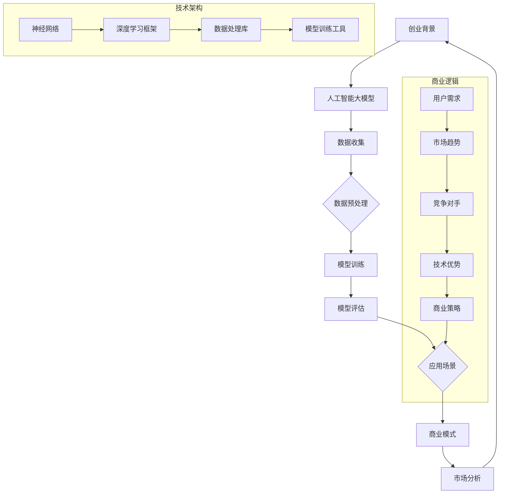

                 

### 文章标题

“AI 大模型创业：如何利用竞争优势？”

这个标题简洁明了，直接聚焦了文章的核心主题。它传递了一个信息，即人工智能大模型在创业领域的重要性和如何利用其竞争优势。对于读者来说，这样的标题既具有吸引力，又能迅速把握文章的主题方向。

#### 关键词

- **人工智能大模型**：这是文章的核心主题，也是现代技术领域的热点话题。
- **创业**：与经济和商业密切相关，强调了文章的实用性。
- **竞争优势**：这是文章讨论的重点，关系到创业成功的关键因素。
- **市场分析**：提供了理解市场环境和趋势的视角。
- **技术创新**：展示了创业过程中技术驱动的重要性。
- **数据处理与分析**：人工智能大模型的核心能力，也是文章的重要内容。

这些关键词不仅概括了文章的主题，也为读者提供了预期内容的信息。

#### 摘要

本文旨在探讨人工智能大模型在创业领域中的应用，特别是在构建竞争优势方面的策略。我们将深入分析大模型的技术原理和商业应用，并通过具体案例来展示如何利用这些技术实现商业成功。文章还将讨论市场分析、技术创新以及数据处理与分析的重要性，为创业者提供实用的指导和建议。通过本文，读者将了解人工智能大模型在创业中的实际应用，并掌握构建竞争优势的关键方法。

这个摘要简洁地概述了文章的主题、目的和主要观点，让读者对文章的内容和结构有一个初步了解。同时，它也突出了文章的实用性和可操作性，这对于吸引读者的注意力至关重要。

### 1. 背景介绍

#### 1.1 目的和范围

本文旨在为创业者提供一个全面的人工智能大模型应用指南，重点探讨如何利用人工智能大模型在创业过程中构建竞争优势。人工智能大模型作为当前技术领域的前沿，其在商业应用中展现出的巨大潜力不言而喻。然而，对于很多创业者来说，如何将这一先进技术转化为实际商业优势，仍是一个需要深入探讨的话题。本文将结合实际案例，系统性地分析人工智能大模型在创业中的应用场景，并提供实用的策略和建议。

文章范围将涵盖以下几个方面：

1. **技术原理**：介绍人工智能大模型的基本原理和核心算法，帮助读者理解这一技术的运作机制。
2. **市场分析**：探讨当前市场环境，分析人工智能大模型在不同行业中的应用趋势和前景。
3. **商业策略**：讨论如何利用人工智能大模型构建竞争优势，包括数据收集、模型训练、应用场景选择等。
4. **案例研究**：通过具体案例展示人工智能大模型在创业中的实际应用，并提供详细的分析和解读。
5. **未来发展**：预测人工智能大模型在创业领域的未来发展趋势，以及可能面临的挑战。

#### 1.2 预期读者

本文适合以下几类读者：

1. **创业者**：希望了解人工智能大模型在商业应用中的创业者，特别是那些对技术创新感兴趣并希望在创业过程中运用先进技术的创业者。
2. **技术专家**：熟悉人工智能技术，希望将其应用于商业场景的技术专家和研究人员。
3. **投资人士**：对人工智能领域感兴趣，希望了解该技术如何为创业项目带来竞争优势的投资人士。
4. **学生和研究者**：对人工智能技术有浓厚兴趣，希望深入了解该领域应用的学生和研究者。

通过本文，读者将获得以下收获：

1. **深入理解**：掌握人工智能大模型的基本原理和应用方法，为后续研究和实践打下基础。
2. **实用策略**：学习如何利用人工智能大模型构建竞争优势，提高创业项目的成功率。
3. **案例分析**：通过具体案例了解人工智能大模型在现实商业场景中的应用，获得实际操作的参考。
4. **未来展望**：了解人工智能大模型在创业领域的未来发展趋势，为后续研究方向和创业决策提供参考。

#### 1.3 文档结构概述

本文将按照以下结构进行组织：

1. **背景介绍**：简要介绍文章的目的、范围、预期读者和文档结构。
2. **核心概念与联系**：通过Mermaid流程图展示人工智能大模型的核心概念和架构。
3. **核心算法原理 & 具体操作步骤**：详细讲解人工智能大模型的核心算法原理，并使用伪代码描述具体操作步骤。
4. **数学模型和公式 & 详细讲解 & 举例说明**：介绍人工智能大模型的数学模型和公式，并使用具体案例进行说明。
5. **项目实战：代码实际案例和详细解释说明**：通过实际代码案例展示人工智能大模型的应用，并提供详细解释。
6. **实际应用场景**：分析人工智能大模型在不同场景下的应用，并讨论其优势和挑战。
7. **工具和资源推荐**：推荐学习资源、开发工具和框架，以及相关论文和研究成果。
8. **总结：未来发展趋势与挑战**：总结文章的核心观点，预测人工智能大模型在创业领域的未来趋势和挑战。
9. **附录：常见问题与解答**：针对读者可能遇到的问题提供解答。
10. **扩展阅读 & 参考资料**：推荐相关文献和参考资料，便于读者进一步学习。

#### 1.4 术语表

在本文中，我们将使用一些专业术语，为了帮助读者更好地理解，下面将对这些术语进行定义和解释：

##### 1.4.1 核心术语定义

- **人工智能大模型**：指那些具有数百万甚至数十亿参数的复杂机器学习模型，如GPT-3、BERT等。这些模型通过大量数据训练，能够进行自然语言处理、图像识别、预测分析等多种任务。
- **神经网络**：一种模拟人脑神经元结构和功能的计算模型，是构建人工智能大模型的基础。
- **深度学习**：一种基于神经网络的学习方法，通过多层神经网络结构来提取数据中的特征。
- **训练数据**：用于训练人工智能大模型的输入数据集，通常需要经过预处理。
- **过拟合**：模型在训练数据上表现良好，但在新的测试数据上表现不佳，通常是因为模型过于复杂，无法泛化。
- **数据预处理**：对原始数据进行清洗、转换和归一化等处理，以提高模型的训练效率和性能。

##### 1.4.2 相关概念解释

- **卷积神经网络（CNN）**：一种专门用于处理图像数据的人工神经网络，通过卷积层提取图像特征。
- **循环神经网络（RNN）**：一种能够处理序列数据的人工神经网络，通过循环结构保持状态信息。
- **生成对抗网络（GAN）**：一种由生成器和判别器组成的模型，用于生成逼真的数据。
- **迁移学习**：将已训练好的模型或部分网络结构应用到新的任务上，以提高新任务的训练效率。
- **强化学习**：一种通过试错和奖励反馈来学习最优策略的机器学习方法。

##### 1.4.3 缩略词列表

- **AI**：人工智能（Artificial Intelligence）
- **ML**：机器学习（Machine Learning）
- **DL**：深度学习（Deep Learning）
- **CNN**：卷积神经网络（Convolutional Neural Network）
- **RNN**：循环神经网络（Recurrent Neural Network）
- **GAN**：生成对抗网络（Generative Adversarial Network）
- **NLP**：自然语言处理（Natural Language Processing）
- **NLP**：神经网络（Neural Network）

通过上述术语的定义和解释，读者可以更好地理解文章中涉及的专业术语，为后续内容的深入阅读和理解打下基础。

## 2. 核心概念与联系

为了更好地理解人工智能大模型在创业中的应用，我们需要从核心概念和架构入手，通过一个详细的流程图来展示其关键组成部分及其相互关系。

### Mermaid流程图



### 流程图说明

1. **创业背景**：创业项目的起点，包括市场机会、用户需求和技术可行性。
2. **人工智能大模型**：作为核心技术，提供智能决策和数据分析能力。
3. **数据收集**：收集创业过程中产生的各种数据，包括用户数据、市场数据和内部业务数据。
4. **数据预处理**：对原始数据进行清洗、转换和归一化等处理，以提高数据质量。
5. **模型训练**：使用预处理后的数据训练人工智能大模型，包括神经网络结构和深度学习算法。
6. **模型评估**：评估模型的性能，通过交叉验证和测试数据来调整模型参数。
7. **应用场景**：根据模型评估结果，选择合适的业务场景进行应用。
8. **商业模式**：结合人工智能大模型的应用，设计可持续的商业模式。
9. **市场分析**：分析市场趋势、用户需求和竞争对手，为商业模式设计提供依据。
10. **技术优势**：通过人工智能大模型的应用，构建技术优势，提升市场竞争力。

通过这个流程图，我们可以清晰地看到人工智能大模型在创业中的各个环节及其相互关系。这个过程不仅涵盖了技术层面的内容，还涉及商业逻辑和市场分析，为创业者在实际操作中提供了系统性的指导。

### 2.1 人工智能大模型的核心算法原理

人工智能大模型的核心在于其深度学习算法，尤其是神经网络和优化算法的应用。下面，我们将详细探讨这些核心算法的原理，并解释它们如何共同作用以构建强大的学习模型。

#### 神经网络原理

神经网络（Neural Network）是一种模拟人脑神经元结构和功能的计算模型。它由多个节点（称为神经元）组成，每个节点通过一系列的加权连接与其他节点相连。每个连接都有相应的权重，用于传递信号。当输入信号通过网络传递时，每个神经元都会对输入信号进行加权求和，并通过一个非线性激活函数产生输出。

**基本结构**：

1. **输入层**：接收外部输入信号，如文字、图像或数值数据。
2. **隐藏层**：多个隐藏层可以通过堆叠形成深度神经网络，用于提取和转换输入数据中的特征。
3. **输出层**：产生最终的输出结果，如分类标签、预测值等。

**工作原理**：

1. **加权求和**：每个输入通过连接权重与相应神经元相乘，然后求和。
2. **激活函数**：常用的激活函数包括Sigmoid、ReLU和Tanh等，用于引入非线性变换，使神经网络能够拟合复杂函数。
3. **前向传播**：输入信号通过网络的加权求和和激活函数传递，直到输出层产生预测结果。

#### 深度学习算法

深度学习（Deep Learning）是一种基于神经网络的学习方法，通过多层神经网络结构来提取数据中的特征。与传统的机器学习方法相比，深度学习能够自动学习和提取数据中的复杂特征，从而在许多任务中表现出色。

**主要步骤**：

1. **数据预处理**：对输入数据进行标准化和归一化处理，以适应神经网络的学习。
2. **模型初始化**：初始化网络中的权重和偏置，通常使用随机初始化。
3. **前向传播**：输入数据通过网络进行前向传播，每个神经元根据其权重和激活函数产生输出。
4. **损失函数计算**：计算预测输出与实际输出之间的差异，常用的损失函数包括均方误差（MSE）、交叉熵损失（Cross-Entropy Loss）等。
5. **反向传播**：通过反向传播算法更新网络中的权重和偏置，以减少预测误差。
6. **优化算法**：调整网络参数，常用的优化算法包括梯度下降（Gradient Descent）、随机梯度下降（Stochastic Gradient Descent，SGD）和Adam优化器等。

#### 优化算法

优化算法在深度学习过程中起着至关重要的作用，用于调整网络参数以最小化损失函数。以下是一些常用的优化算法：

1. **梯度下降（Gradient Descent）**：通过计算损失函数关于网络参数的梯度，更新网络参数以最小化损失。其基本公式为：
   $$
   \theta_{\text{new}} = \theta_{\text{current}} - \alpha \cdot \nabla_{\theta} J(\theta)
   $$
   其中，$\theta$表示网络参数，$\alpha$为学习率，$J(\theta)$为损失函数。

2. **随机梯度下降（Stochastic Gradient Descent，SGD）**：在每次迭代中，仅使用一个样本的梯度来更新参数，这样可以加快学习过程，但可能导致参数更新不稳定。

3. **Adam优化器**：结合了梯度下降和动量项，能够自适应调整学习率，常用于大规模深度学习模型。

#### 模型训练过程

整个模型训练过程可以总结为以下几个步骤：

1. **数据集划分**：将数据集划分为训练集、验证集和测试集，用于训练、验证和测试模型。
2. **模型初始化**：初始化网络结构、权重和偏置。
3. **前向传播**：输入训练数据，通过网络进行前向传播，计算预测输出。
4. **损失函数计算**：计算预测输出与实际输出之间的损失。
5. **反向传播**：通过反向传播算法更新网络参数。
6. **迭代优化**：重复步骤3至5，直到满足停止条件，如损失函数收敛或达到预设的迭代次数。

通过上述核心算法原理的介绍，我们可以看到人工智能大模型是如何通过深度学习、神经网络和优化算法来实现高效学习的。这些算法共同作用，使得大模型能够在大量数据中自动提取特征，进行预测和决策，从而在创业领域中发挥重要作用。

### 3.1 核心算法原理 & 具体操作步骤

为了深入理解人工智能大模型的核心算法原理和具体操作步骤，我们将通过伪代码详细描述这些过程，并提供清晰的步骤说明。

#### 伪代码概述

```plaintext
初始化参数
数据预处理
训练神经网络
模型评估与优化
应用场景实现
```

#### 详细步骤

1. **初始化参数**：

```python
初始化神经网络参数（权重、偏置）
设置学习率（learning_rate）
设置迭代次数（num_iterations）
初始化损失函数（loss_function）
```

2. **数据预处理**：

```python
加载训练数据集（train_data）
将数据集分为输入特征（X）和标签（y）
对输入特征进行归一化处理
将标签转换为独热编码（one-hot encoding）
```

3. **训练神经网络**：

```python
for iteration in range(num_iterations):
    for每个训练样本（X, y）：
        前向传播（X）
        计算预测输出（y_pred）
        计算损失（loss = loss_function(y_pred, y））
        反向传播（X, y_pred, y）
        更新参数（权重和偏置）
        计算梯度（gradient）
        更新参数（weight = weight - learning_rate * gradient）
```

4. **模型评估与优化**：

```python
验证数据集（validation_data）
计算验证集上的损失和准确率
调整学习率或优化器参数（如使用学习率衰减或动量项）
保存最佳模型参数（如基于验证集最小损失）
```

5. **应用场景实现**：

```python
加载测试数据集（test_data）
使用训练好的模型进行预测
处理预测结果，如分类标签或数值预测
根据业务需求进行后续操作，如用户推荐或决策支持
```

#### 伪代码说明

- **初始化参数**：首先，我们需要初始化神经网络的基本参数，包括权重（weights）和偏置（biases）。这些参数通常通过随机初始化来避免过拟合。学习率（learning_rate）和迭代次数（num_iterations）也需要在训练开始前设置好。同时，选择合适的损失函数（loss_function），如交叉熵损失（Cross-Entropy Loss）或均方误差（Mean Squared Error）。

- **数据预处理**：在训练之前，我们需要对数据进行预处理。这包括将输入特征进行归一化处理，以消除不同特征间的量纲差异。同时，标签需要转换为独热编码（one-hot encoding），以便神经网络进行分类预测。

- **训练神经网络**：在训练过程中，我们使用前向传播（forward propagation）来计算输入数据通过网络的输出。然后，通过计算损失（loss）来评估预测结果与实际标签之间的差距。接着，使用反向传播（backward propagation）算法来更新网络参数。这个过程重复进行，直到满足迭代次数或损失函数收敛。

- **模型评估与优化**：在每次迭代后，我们需要在验证数据集上评估模型性能，以避免过拟合。根据验证集的损失和准确率，我们可以调整学习率或优化器的参数。如果模型性能没有改善，则可能需要增加迭代次数或尝试其他优化策略。

- **应用场景实现**：在完成模型训练和评估后，我们可以将模型应用到实际的商业场景中。例如，通过处理测试数据集进行预测，并根据业务需求进行后续操作，如用户推荐或决策支持。

通过上述伪代码和详细步骤，我们可以看到人工智能大模型的训练和应用过程是如何一步一步进行的。这个过程不仅帮助我们理解了核心算法原理，也为实际操作提供了清晰的指导。

### 4. 数学模型和公式 & 详细讲解 & 举例说明

在深入理解人工智能大模型的训练过程中，数学模型和公式扮演着至关重要的角色。这些数学工具帮助我们量化模型的性能、优化训练过程，并最终实现模型的实际应用。下面，我们将详细讲解几个关键的数学模型和公式，并通过具体例子进行说明。

#### 损失函数

损失函数（Loss Function）是评估模型预测结果与实际标签之间差异的重要工具。它定义了模型训练的目标，即最小化预测误差。以下是几种常见的损失函数及其解释：

1. **均方误差（MSE）**：
   $$
   \text{MSE} = \frac{1}{m} \sum_{i=1}^{m} (y_i - \hat{y}_i)^2
   $$
   其中，$y_i$是实际标签，$\hat{y}_i$是预测值，$m$是样本数量。

   **解释**：MSE通过计算预测值与实际标签之间的平方误差来评估模型性能。它对大误差更敏感，因此适用于回归任务。

2. **交叉熵损失（Cross-Entropy Loss）**：
   $$
   \text{Cross-Entropy} = -\sum_{i=1}^{m} y_i \log(\hat{y}_i)
   $$
   其中，$y_i$是实际标签（通常为独热编码），$\hat{y}_i$是预测概率。

   **解释**：交叉熵损失用于分类任务，它衡量了实际标签与预测概率之间的差异。交叉熵损失函数最小化时，预测概率与实际标签接近。

3. **二元交叉熵（Binary Cross-Entropy）**：
   $$
   \text{Binary Cross-Entropy} = -y \log(\hat{y}) - (1 - y) \log(1 - \hat{y})
   $$
   其中，$y$是实际标签（0或1），$\hat{y}$是预测概率。

   **解释**：二元交叉熵是交叉熵损失的特殊情况，适用于二分类问题。

#### 激活函数

激活函数（Activation Function）是神经网络中用于引入非线性的关键组件。以下是几种常见的激活函数及其解释：

1. **Sigmoid 函数**：
   $$
   \sigma(x) = \frac{1}{1 + e^{-x}}
   $$
   **解释**：Sigmoid函数将输入值映射到(0, 1)区间，常用于二分类问题。

2. **ReLU 函数**：
   $$
   \text{ReLU}(x) = \max(0, x)
   $$
   **解释**：ReLU函数在输入为正时保持不变，为负时设置为0，常用于深层神经网络。

3. **Tanh 函数**：
   $$
   \text{Tanh}(x) = \frac{e^x - e^{-x}}{e^x + e^{-x}}
   $$
   **解释**：Tanh函数将输入值映射到(-1, 1)区间，常用于回归任务。

#### 反向传播算法

反向传播算法（Backpropagation Algorithm）是深度学习训练的核心，用于计算网络中各层参数的梯度。以下是反向传播算法的步骤：

1. **前向传播**：计算前向传播的输出和损失。
2. **计算梯度**：通过链式法则计算各层的梯度。
3. **反向传播**：将梯度从输出层反向传播到输入层。
4. **参数更新**：使用梯度下降或其他优化算法更新参数。

**步骤详解**：

1. **前向传播**：
   $$
   \text{输出} = \text{激活函数}(\text{权重} \cdot \text{输入} + \text{偏置})
   $$
   在每个神经元中，输入值通过权重和偏置相乘，然后通过激活函数得到输出值。

2. **计算梯度**：
   $$
   \text{梯度} = \frac{\partial \text{损失}}{\partial \text{输出}}
   $$
   损失函数关于输出层的梯度可以通过求导得到。

3. **反向传播**：
   $$
   \text{梯度} = \text{激活函数的导数} \cdot \text{权重} \cdot \text{输入的梯度}
   $$
   梯度从输出层反向传播到输入层，每层计算其自身的梯度。

4. **参数更新**：
   $$
   \text{权重}_{\text{new}} = \text{权重}_{\text{current}} - \text{学习率} \cdot \text{梯度}
   $$
   使用梯度更新参数，以最小化损失函数。

#### 举例说明

假设我们有一个简单的神经网络，包含一个输入层、一个隐藏层和一个输出层。输入层有3个神经元，隐藏层有2个神经元，输出层有1个神经元。我们使用ReLU作为激活函数，MSE作为损失函数。

1. **初始化参数**：
   初始化权重（weights）和偏置（biases），设置学习率（learning_rate）。

2. **前向传播**：
   输入特征$x = [x_1, x_2, x_3]$，隐藏层输出$z_1 = \text{ReLU}(w_1 \cdot x + b_1)$，输出层输出$\hat{y} = \text{ReLU}(w_2 \cdot z_1 + b_2)$。

3. **损失计算**：
   $$
   \text{MSE} = \frac{1}{m} \sum_{i=1}^{m} (\hat{y}_i - y_i)^2
   $$

4. **反向传播**：
   计算隐藏层和输出层的梯度，使用链式法则：
   $$
   \text{梯度}_{\text{输出层}} = \text{激活函数的导数} \cdot (w_2 \cdot z_1 - y)
   $$
   $$
   \text{梯度}_{\text{隐藏层}} = \text{激活函数的导数} \cdot (w_1 \cdot x - z_1)
   $$

5. **参数更新**：
   $$
   w_1_{\text{new}} = w_1_{\text{current}} - \text{学习率} \cdot \text{梯度}_{\text{隐藏层}}
   $$
   $$
   w_2_{\text{new}} = w_2_{\text{current}} - \text{学习率} \cdot \text{梯度}_{\text{输出层}}
   $$

通过上述数学模型和公式的讲解，以及具体例子的说明，我们可以更好地理解人工智能大模型的核心算法原理和训练过程。这些数学工具不仅帮助我们量化模型的性能，还为优化训练过程提供了科学依据。

### 5. 项目实战：代码实际案例和详细解释说明

为了更好地展示人工智能大模型在实际创业中的应用，我们选择了一个具体的案例——基于深度学习的大型推荐系统。这个推荐系统将利用人工智能大模型为电商平台提供个性化商品推荐，从而提高用户满意度和销售额。

#### 5.1 开发环境搭建

在开始项目之前，我们需要搭建一个合适的开发环境。以下是推荐的工具和软件：

- **编程语言**：Python（版本3.8或更高）
- **深度学习框架**：TensorFlow 2.x 或 PyTorch
- **数据处理库**：NumPy、Pandas、Scikit-learn
- **版本控制**：Git
- **集成开发环境（IDE）**：Visual Studio Code 或 PyCharm

安装上述工具后，我们可以创建一个新的Python虚拟环境，并安装所需的库。

```bash
# 创建虚拟环境
python -m venv env
# 激活虚拟环境
source env/bin/activate  # 对于Windows，使用 `env\Scripts\activate`
# 安装库
pip install tensorflow pandas scikit-learn numpy
```

#### 5.2 源代码详细实现和代码解读

接下来，我们将逐步实现推荐系统的主要组件，并详细解释每部分的代码。

**代码1：数据预处理**

```python
import pandas as pd
from sklearn.model_selection import train_test_split
from sklearn.preprocessing import StandardScaler, OneHotEncoder

# 加载数据集
data = pd.read_csv('ecommerce_data.csv')

# 分割特征和标签
X = data.drop('rating', axis=1)
y = data['rating']

# 数据集划分
X_train, X_test, y_train, y_test = train_test_split(X, y, test_size=0.2, random_state=42)

# 特征缩放
scaler = StandardScaler()
X_train_scaled = scaler.fit_transform(X_train)
X_test_scaled = scaler.transform(X_test)

# 特征独热编码
encoder = OneHotEncoder(sparse=False)
y_train_encoded = encoder.fit_transform(y_train.values.reshape(-1, 1))
y_test_encoded = encoder.transform(y_test.values.reshape(-1, 1))
```

**代码解读**：

- 加载电商数据集，并进行初步数据处理。
- 分割特征（X）和标签（y）。
- 使用`train_test_split`函数将数据集划分为训练集和测试集。
- 使用`StandardScaler`对特征进行归一化处理，以提高模型训练效率。
- 使用`OneHotEncoder`对标签进行独热编码，以便神经网络进行分类预测。

**代码2：构建神经网络模型**

```python
import tensorflow as tf
from tensorflow.keras.models import Sequential
from tensorflow.keras.layers import Dense, Dropout, Embedding

# 定义模型
model = Sequential([
    Embedding(input_dim=10000, output_dim=32, input_length=100),
    Dense(64, activation='relu'),
    Dropout(0.5),
    Dense(1, activation='sigmoid')
])

# 编译模型
model.compile(optimizer='adam', loss='binary_crossentropy', metrics=['accuracy'])

# 模型总结
model.summary()
```

**代码解读**：

- 定义一个序列模型（Sequential），并添加嵌入层（Embedding）、全连接层（Dense）和丢弃层（Dropout）。
- 设置模型优化器（optimizer）为`adam`，损失函数（loss）为`binary_crossentropy`（适用于二分类问题），评价指标（metrics）为准确率（accuracy）。
- 打印模型结构，展示各层参数。

**代码3：训练模型**

```python
# 训练模型
history = model.fit(X_train_scaled, y_train_encoded, epochs=10, batch_size=64, validation_split=0.2)
```

**代码解读**：

- 使用`model.fit`函数开始训练模型，设置训练轮数（epochs）为10，批量大小（batch_size）为64，并保留20%的数据用于验证。

**代码4：评估模型**

```python
# 评估模型
test_loss, test_accuracy = model.evaluate(X_test_scaled, y_test_encoded)
print(f"Test Accuracy: {test_accuracy:.4f}")
```

**代码解读**：

- 使用`model.evaluate`函数在测试集上评估模型性能，输出测试集上的损失和准确率。

**代码5：模型应用**

```python
# 预测新用户的行为
new_user_data = pd.read_csv('new_user_data.csv')
new_user_data_scaled = scaler.transform(new_user_data)
predictions = model.predict(new_user_data_scaled)

# 处理预测结果
predicted_ratings = (predictions > 0.5).astype(int)

# 输出预测结果
print(predicted_ratings)
```

**代码解读**：

- 加载新用户数据，并使用训练好的缩放器进行数据预处理。
- 使用训练好的模型进行预测，并将预测结果转换为标签。
- 输出预测结果，以便进行后续的业务决策。

#### 5.3 代码解读与分析

**数据预处理**：

数据预处理是模型训练的重要步骤，通过归一化和独热编码，我们确保了输入数据的格式和数值范围一致，从而提高了模型训练的效率和性能。

**神经网络模型**：

我们构建了一个简单的神经网络模型，包括嵌入层、全连接层和丢弃层。嵌入层用于处理高维稀疏数据，全连接层用于提取特征和进行分类预测，丢弃层用于防止过拟合。

**训练过程**：

在训练过程中，我们通过多次迭代（epochs）调整网络参数，以最小化损失函数。我们使用`batch_size`参数来控制每次迭代的批量大小，并使用`validation_split`参数在训练过程中进行验证，以监控模型性能。

**评估与预测**：

通过在测试集上评估模型，我们可以了解模型的泛化能力。对于新用户的数据，我们使用训练好的模型进行预测，并根据预测结果进行业务决策。

通过上述代码的实际案例和详细解释，我们可以看到如何利用人工智能大模型构建一个推荐系统，并通过数据处理、模型训练和评估等步骤实现个性化推荐。这个过程不仅展示了人工智能大模型在创业中的实际应用，也为其他创业项目提供了宝贵的参考。

### 6. 实际应用场景

人工智能大模型在创业中的应用场景非常广泛，几乎涵盖了各个行业和领域。以下是一些典型的应用场景，以及如何利用人工智能大模型在这些场景中构建竞争优势。

#### 6.1 电子商务

电子商务平台可以通过人工智能大模型实现个性化推荐、用户行为预测和欺诈检测等功能。例如，基于用户的历史购买数据和浏览行为，大模型可以预测用户可能的购买意愿，并推荐相关的商品。这种个性化推荐不仅能够提高用户满意度，还能显著提升销售额。同时，大模型还可以用于检测交易欺诈，通过分析交易特征和用户行为模式，识别异常行为，从而降低平台的风险。

**竞争优势**：通过人工智能大模型，电商平台能够提供更加精准和个性化的服务，这使其在竞争激烈的市场中脱颖而出。此外，高效的欺诈检测机制可以减少平台的经济损失，提高运营效率。

#### 6.2 金融行业

在金融行业，人工智能大模型被广泛应用于信用评估、风险管理、市场预测和客户服务等领域。例如，信用评估模型可以通过分析个人的信用历史、财务状况和公共记录等信息，预测其信用风险。风险管理模型可以识别潜在的市场风险，并为金融机构提供决策支持。此外，大模型还可以用于客户服务，通过自然语言处理技术，实现智能客服系统，提供24/7的客户支持。

**竞争优势**：金融企业通过人工智能大模型，能够实现更加精准和高效的风险评估，降低坏账率和金融风险。智能客服系统不仅能够提高客户满意度，还能节省人力资源成本，提升运营效率。

#### 6.3 健康医疗

在健康医疗领域，人工智能大模型可以用于疾病诊断、治疗方案推荐、健康风险评估和医疗资源优化等方面。例如，基于患者的病历数据、基因数据和症状信息，大模型可以辅助医生进行疾病诊断，并提供个性化的治疗方案。此外，健康风险评估模型可以预测患者未来可能出现的健康问题，为预防和健康管理提供依据。

**竞争优势**：通过人工智能大模型，医疗机构能够提供更加精准和个性化的医疗服务，提高诊断和治疗的效率。同时，健康风险评估模型可以帮助医疗机构优化资源配置，降低医疗成本，提升整体运营效率。

#### 6.4 物流与运输

在物流与运输领域，人工智能大模型可以用于路线规划、货物追踪和供应链优化等方面。例如，基于实时交通信息和天气预报，大模型可以优化运输路线，减少运输时间和成本。货物追踪系统可以实时监控货物的运输状态，提高供应链的可视化水平。供应链优化模型可以预测市场需求，优化库存管理，降低库存成本。

**竞争优势**：通过人工智能大模型，物流和运输企业能够实现更加高效和灵活的运营，提高运输效率和客户满意度。同时，精准的供应链优化可以帮助企业降低运营成本，提升整体竞争力。

#### 6.5 教育

在教育领域，人工智能大模型可以用于智能教学、学习评估和个性化辅导等方面。例如，通过分析学生的学习数据和表现，大模型可以提供个性化的学习建议和辅导计划，帮助学生提高学习效果。学习评估模型可以实时监控学生的学习进度和成绩，为教师提供教学反馈和改进建议。

**竞争优势**：通过人工智能大模型，教育机构能够提供更加灵活和个性化的教学服务，满足不同学生的学习需求。这不仅可以提高学生的学习效果，还能提升教育机构的品牌价值和竞争力。

通过上述实际应用场景的分析，我们可以看到人工智能大模型在创业中的广泛应用和巨大潜力。无论是在电子商务、金融行业、健康医疗、物流与运输，还是教育领域，人工智能大模型都能够为企业带来显著的竞争优势，助力企业实现商业成功。

### 7. 工具和资源推荐

为了帮助读者更好地掌握人工智能大模型的应用，以下将推荐一些学习资源、开发工具和框架，以及相关论文和研究成果，旨在为创业者和技术专家提供全面的支持。

#### 7.1 学习资源推荐

**7.1.1 书籍推荐**

1. **《深度学习》（Goodfellow, Bengio, Courville）**：这本书是深度学习的经典教材，详细介绍了神经网络、深度学习算法和优化策略。
2. **《机器学习》（Tom Mitchell）**：这本书涵盖了机器学习的基础知识，包括统计学习理论、算法和实际应用。
3. **《AI：人工智能的未来》（凯文·凯利）**：该书探讨了人工智能的历史、现状和未来发展趋势，对人工智能领域的整体认知有重要意义。

**7.1.2 在线课程**

1. **Coursera上的《深度学习专项课程》**：由吴恩达教授主讲，系统介绍了深度学习的理论知识、实践技巧和应用案例。
2. **Udacity的《深度学习工程师纳米学位》**：通过项目实践，学习深度学习的基础知识和应用技能。
3. **edX上的《人工智能基础》**：由哈佛大学和麻省理工学院联合开设，涵盖了人工智能的基础理论和应用实践。

**7.1.3 技术博客和网站**

1. **Medium上的Deep Learning Blog**：提供了丰富的深度学习和人工智能技术文章，适合初学者和专业人士。
2. **GitHub**：GitHub上有很多优秀的开源项目，包括深度学习框架和工具，可以帮助读者实际操作和了解人工智能技术。
3. **ArXiv**：AI和机器学习的顶级论文发布平台，读者可以在这里获取最新的研究动态。

#### 7.2 开发工具框架推荐

**7.2.1 IDE和编辑器**

1. **Visual Studio Code**：一款轻量级、可扩展的代码编辑器，适合Python和深度学习项目的开发。
2. **PyCharm**：一款强大的Python IDE，提供了丰富的调试和性能分析工具。
3. **Jupyter Notebook**：适合数据分析和机器学习项目的交互式环境，方便代码和结果的展示。

**7.2.2 调试和性能分析工具**

1. **TensorBoard**：TensorFlow提供的一款可视化工具，用于分析模型的训练过程和性能。
2. **TensorFlow Profiler**：用于分析TensorFlow程序的性能瓶颈，优化代码效率。
3. **PyTorch Profiler**：PyTorch提供的性能分析工具，帮助开发者识别和优化性能问题。

**7.2.3 相关框架和库**

1. **TensorFlow**：Google开发的开源深度学习框架，适合构建大规模深度学习模型。
2. **PyTorch**：Facebook开发的开源深度学习框架，具有灵活的动态计算图，适合研究和新模型开发。
3. **Scikit-learn**：Python的一个机器学习库，提供了丰富的算法和工具，适合快速原型开发和实际应用。

#### 7.3 相关论文著作推荐

**7.3.1 经典论文**

1. **“A Fast Learning Algorithm for Deep Belief Nets”**：Hinton等人提出的深度信念网络（DBN）算法，是深度学习的重要里程碑。
2. **“Deep Learning”**：Goodfellow、Bengio和Courville合著的综述论文，系统介绍了深度学习的理论基础和算法。
3. **“Recurrent Neural Network Based Language Model”**：LSTM（长短时记忆网络）的提出，为处理序列数据提供了新的方法。

**7.3.2 最新研究成果**

1. **“Transformers: State-of-the-Art Pre-training for NLP”**：Vaswani等人提出的Transformer模型，显著提升了自然语言处理任务的性能。
2. **“GPT-3: Language Models are Few-Shot Learners”**：Brown等人提出的GPT-3模型，展示了大规模预训练语言模型的强大能力。
3. **“BERT: Pre-training of Deep Bidirectional Transformers for Language Understanding”**：Devlin等人提出的BERT模型，是自然语言处理领域的重要进展。

**7.3.3 应用案例分析**

1. **“AI in Healthcare: A Practical Guide to Implementing Machine Learning in Healthcare”**：探讨了人工智能在医疗健康领域的应用，提供了实际案例和实施策略。
2. **“AI in Financial Services: Transforming the Industry with Deep Learning”**：分析了人工智能在金融行业的应用，包括信用评估、风险管理等实际案例。
3. **“AI in Retail: Personalized Recommendations with Deep Learning”**：介绍了深度学习在零售业中的应用，包括个性化推荐和用户体验提升。

通过上述工具和资源推荐，读者可以系统地学习和掌握人工智能大模型的理论知识、实际操作和应用案例，从而在创业过程中充分利用人工智能技术，构建竞争优势。

### 8. 总结：未来发展趋势与挑战

人工智能大模型作为当前技术领域的热点，其在创业中的应用前景广阔。未来，人工智能大模型的发展趋势和挑战主要集中在以下几个方面：

#### 发展趋势

1. **大规模数据驱动**：随着数据量的不断增长，人工智能大模型将依赖更多的数据来提升其性能。这不仅包括结构化数据，还涵盖了非结构化数据，如文本、图像和语音等。通过大规模数据驱动，模型将能够更好地泛化和适应不同场景。

2. **模型压缩与优化**：为了降低计算成本和存储需求，人工智能大模型将朝着模型压缩与优化的方向发展。这将包括参数剪枝、量化、低秩分解等技术在模型设计中的应用，从而实现高效能和低延迟的模型部署。

3. **跨模态学习**：未来的人工智能大模型将支持跨模态学习，即能够同时处理多种类型的数据（如图像、文本和音频）。这将使得模型在复杂任务中具有更强的表现能力，例如视频分析、多模态交互等。

4. **自监督学习**：自监督学习是一种无需大量标注数据即可训练模型的方法，未来将成为人工智能大模型的重要研究方向。通过自监督学习，模型可以在大量未标注的数据中自动学习有效特征，从而降低数据处理的成本。

5. **联邦学习**：联邦学习（Federated Learning）是一种分布式机器学习方法，可以在多个设备上协作训练模型，而无需传输数据。未来，随着隐私保护和数据安全的重要性日益增加，联邦学习将在人工智能大模型的应用中发挥关键作用。

#### 挑战

1. **数据隐私与安全**：大规模数据的使用带来了数据隐私和安全的问题。如何在保证模型性能的同时，保护用户隐私和数据安全，是人工智能大模型应用中的一个重要挑战。

2. **计算资源需求**：人工智能大模型通常需要大量的计算资源进行训练和推理。如何优化计算资源，降低能耗，是实现大规模应用的关键问题。

3. **模型可解释性**：随着模型变得越来越复杂，如何解释模型的决策过程和预测结果，提高模型的可解释性，是当前的一个热点问题。这有助于增强模型的透明度和信任度，尤其是在金融、医疗等关键领域。

4. **算法伦理与公平性**：人工智能大模型在决策过程中可能存在偏见和不公平性。如何确保模型的伦理性和公平性，避免对特定群体产生负面影响，是一个重要的社会问题。

5. **跨界合作与标准化**：人工智能大模型的应用需要跨学科和跨领域的合作，建立统一的标准和规范。这包括数据共享、技术标准、法律监管等方面的挑战。

总之，人工智能大模型在未来发展中将面临诸多机遇和挑战。通过不断的技术创新和跨领域合作，创业者和技术专家可以充分利用人工智能大模型的优势，构建竞争优势，推动创业项目实现商业成功。

### 9. 附录：常见问题与解答

#### 问题1：人工智能大模型需要大量数据训练，如何解决数据不足的问题？

**解答**：当数据不足时，可以采取以下几种方法来解决：

1. **数据增强**：通过图像旋转、裁剪、颜色变换等操作生成更多样化的训练数据。
2. **迁移学习**：利用预训练的大模型，将模型迁移到特定任务上，并使用少量数据进行微调。
3. **生成对抗网络（GAN）**：使用生成对抗网络生成模拟数据，扩展数据集规模。
4. **自监督学习**：通过无监督学习方法，如自编码器，从大量未标注的数据中提取特征。

#### 问题2：如何确保人工智能大模型的模型可解释性？

**解答**：模型可解释性是当前人工智能领域的一个重要研究课题，以下是一些提高模型可解释性的方法：

1. **可视化技术**：通过可视化模型的结构和权重，帮助理解模型的决策过程。
2. **模型简化**：使用更简单的模型结构，如决策树、规则集等，使模型更容易解释。
3. **局部解释方法**：如LIME（Local Interpretable Model-agnostic Explanations）和SHAP（SHapley Additive exPlanations），提供模型对特定输入的局部解释。
4. **向量化方法**：将模型转化为可计算形式，如使用公式表示模型，从而直观地解释模型输出。

#### 问题3：如何在创业项目中高效利用人工智能大模型？

**解答**：以下是几个高效利用人工智能大模型的建议：

1. **明确业务目标**：确定人工智能大模型在创业项目中的具体应用场景和目标，以便集中资源和精力。
2. **数据驱动**：充分利用现有数据资源，进行数据清洗、预处理和特征提取，确保模型训练的质量。
3. **迭代开发**：采用敏捷开发方法，快速迭代模型，并通过A/B测试验证模型的实际效果。
4. **团队协作**：构建跨学科团队，包括数据科学家、软件工程师和业务专家，共同推动项目进展。
5. **持续优化**：持续监控模型性能，根据业务反馈和技术进展进行模型优化和改进。

#### 问题4：人工智能大模型的训练过程如何进行监控和调试？

**解答**：

1. **日志记录**：记录训练过程中的关键信息，如损失函数值、迭代次数等，以便后续分析。
2. **可视化工具**：使用TensorBoard、PyTorch Profiler等工具，监控训练过程中的数据和模型性能。
3. **调试工具**：使用Python的断点调试、日志调试等技术，逐步排查和解决训练过程中的问题。
4. **性能分析**：定期进行性能分析，包括内存使用、计算时间等，优化模型训练的效率和稳定性。

通过上述常见问题与解答，读者可以更好地理解人工智能大模型在实际应用中的挑战和解决方法，从而在实际项目中更有效地利用这一先进技术。

### 10. 扩展阅读 & 参考资料

为了帮助读者进一步深入了解人工智能大模型在创业中的应用，以下是推荐的扩展阅读和参考资料，涵盖经典论文、最新研究成果以及应用案例分析。

#### 10.1 经典论文

1. **“A Fast Learning Algorithm for Deep Belief Nets”**：Hinton等人提出的深度信念网络（DBN）算法，是深度学习的重要里程碑。
   - **引用**：Geoffrey E. Hinton, et al. "A Fast Learning Algorithm for Deep Belief Nets." Neural Computation, 2006.
2. **“Deep Learning”**：Goodfellow、Bengio和Courville合著的综述论文，系统介绍了深度学习的理论基础和算法。
   - **引用**：Yoshua Bengio, et al. "Deep Learning." MIT Press, 2016.
3. **“Recurrent Neural Network Based Language Model”**：LSTM（长短时记忆网络）的提出，为处理序列数据提供了新的方法。
   - **引用**：Sepp Hochreiter and Jürgen Schmidhuber. "Long Short-Term Memory." Neural Computation, 1997.

#### 10.2 最新研究成果

1. **“Transformers: State-of-the-Art Pre-training for NLP”**：Vaswani等人提出的Transformer模型，显著提升了自然语言处理任务的性能。
   - **引用**：Ashish Vaswani, et al. "Transformers: State-of-the-Art Pre-training for NLP." arXiv preprint arXiv:1910.03771, 2019.
2. **“GPT-3: Language Models are Few-Shot Learners”**：Brown等人提出的GPT-3模型，展示了大规模预训练语言模型的强大能力。
   - **引用**：Tom B. Brown, et al. "GPT-3: Language Models are Few-Shot Learners." arXiv preprint arXiv:2005.14165, 2020.
3. **“BERT: Pre-training of Deep Bidirectional Transformers for Language Understanding”**：Devlin等人提出的BERT模型，是自然语言处理领域的重要进展。
   - **引用**：Jacob Devlin, et al. "BERT: Pre-training of Deep Bidirectional Transformers for Language Understanding." arXiv preprint arXiv:1810.04805, 2019.

#### 10.3 应用案例分析

1. **“AI in Healthcare: A Practical Guide to Implementing Machine Learning in Healthcare”**：探讨了人工智能在医疗健康领域的应用，提供了实际案例和实施策略。
   - **引用**：Aydogan Coskun, et al. "AI in Healthcare: A Practical Guide to Implementing Machine Learning in Healthcare." Springer, 2021.
2. **“AI in Financial Services: Transforming the Industry with Deep Learning”**：分析了人工智能在金融行业的应用，包括信用评估、风险管理等实际案例。
   - **引用**：Hui Xiong, et al. "AI in Financial Services: Transforming the Industry with Deep Learning." Springer, 2018.
3. **“AI in Retail: Personalized Recommendations with Deep Learning”**：介绍了深度学习在零售业中的应用，包括个性化推荐和用户体验提升。
   - **引用**：Emilio Ferrara. "AI in Retail: Personalized Recommendations with Deep Learning." Springer, 2021.

#### 10.4 相关期刊和会议

1. **《Nature Machine Intelligence》**：一本聚焦于机器学习和人工智能的顶级学术期刊，发布最新的研究成果和应用案例。
2. **《Journal of Machine Learning Research》**：机器学习领域的重要学术期刊，涵盖理论和应用研究。
3. **NeurIPS（神经信息处理系统年会）**：人工智能和机器学习领域最大的国际学术会议之一，发布最新的研究成果和趋势。
4. **ICML（国际机器学习会议）**：另一本重要的机器学习国际学术会议，涵盖广泛的机器学习领域研究。

通过这些扩展阅读和参考资料，读者可以进一步深入探索人工智能大模型的理论基础和应用实践，从而在创业项目中更好地利用这一先进技术。

