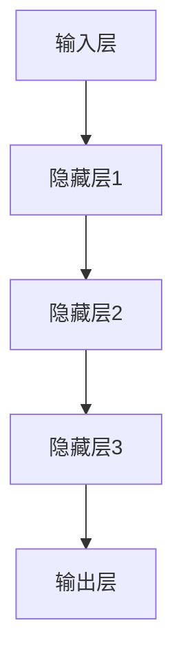

                 

# AI 大模型创业：如何利用竞争优势？

> **关键词：** AI 大模型，创业，竞争优势，市场分析，技术创新

> **摘要：** 本文将探讨在当前人工智能浪潮中，创业者如何利用 AI 大模型的优势，通过市场分析和技术创新来构建竞争优势，从而在激烈的市场竞争中脱颖而出。

## 1. 背景介绍

### 1.1 目的和范围

本文旨在为创业者提供一套系统性的框架，帮助他们利用 AI 大模型在创业过程中构建和维持竞争优势。我们将讨论市场分析的重要性、AI 大模型的核心技术原理，以及如何将技术优势转化为商业成功。

### 1.2 预期读者

本文适合对 AI 大模型有一定了解的创业者、产品经理和技术团队。希望通过技术驱动业务增长的读者将能从本文中获益。

### 1.3 文档结构概述

本文结构如下：

1. 背景介绍：包括目的、预期读者和文档结构。
2. 核心概念与联系：介绍 AI 大模型的基本概念和原理。
3. 核心算法原理 & 具体操作步骤：讲解大模型的算法原理和操作步骤。
4. 数学模型和公式 & 详细讲解 & 举例说明：阐述大模型的数学基础。
5. 项目实战：通过实际案例展示大模型的应用。
6. 实际应用场景：讨论大模型在不同领域的应用。
7. 工具和资源推荐：推荐相关学习资源和开发工具。
8. 总结：对未来发展趋势与挑战的展望。
9. 附录：常见问题与解答。
10. 扩展阅读 & 参考资料：提供进一步学习的资料。

### 1.4 术语表

#### 1.4.1 核心术语定义

- **AI 大模型**：指参数规模达到亿级别乃至万亿级别的深度学习模型。
- **竞争优势**：企业在市场上相对于竞争对手的优势。
- **市场分析**：对目标市场的调查和分析，以了解市场需求和竞争态势。

#### 1.4.2 相关概念解释

- **深度学习**：一种人工智能算法，通过模拟人脑的神经网络结构进行学习。
- **神经网络**：由大量简单神经元组成的网络，用于数据处理和预测。

#### 1.4.3 缩略词列表

- **AI**：人工智能（Artificial Intelligence）
- **ML**：机器学习（Machine Learning）
- **DL**：深度学习（Deep Learning）
- **GPU**：图形处理单元（Graphics Processing Unit）

## 2. 核心概念与联系

### 2.1 AI 大模型的基本概念

AI 大模型是基于深度学习技术构建的复杂神经网络。它们通过大量的数据和计算资源进行训练，以达到高度准确的预测和分类能力。大模型的关键特点是其参数规模巨大，通常在亿级别乃至万亿级别。

### 2.2 大模型的结构

大模型通常由以下几个部分组成：

1. **输入层**：接收外部输入数据。
2. **隐藏层**：对输入数据进行处理和变换。
3. **输出层**：生成预测结果。

下面是一个简单的 Mermaid 流程图，展示大模型的基本架构：



### 2.3 大模型的核心算法

大模型的核心算法是基于反向传播（Backpropagation）算法。反向传播是一种用于训练神经网络的优化算法，它通过不断调整网络中的权重和偏置，以最小化预测误差。

以下是反向传播算法的伪代码：

```plaintext
function backpropagation(data, target):
    for each training example (x, y) in data:
        forward_pass(x)
        calculate error (e) = y - y_pred
        backward_pass(e)
        update_weights_and_biases()
    return updated model
```

### 2.4 大模型的优势和挑战

**优势：**

- **强大的数据处理能力**：大模型能够处理海量数据，从而获得更准确的预测结果。
- **高度自动化的特征提取**：大模型能够自动学习并提取复杂的数据特征，减少人工特征工程的工作量。
- **广泛的适用性**：大模型适用于各种领域，包括图像识别、自然语言处理和预测分析等。

**挑战：**

- **计算资源需求**：大模型训练需要大量的计算资源和时间，尤其是在训练初期。
- **数据隐私和伦理问题**：大模型训练需要大量个人数据，可能涉及隐私和伦理问题。
- **模型解释性**：大模型的预测结果往往缺乏解释性，难以理解其内部决策过程。

## 3. 核心算法原理 & 具体操作步骤

### 3.1 算法原理

大模型的核心算法是基于深度学习技术，尤其是基于神经网络的优化。以下是深度学习算法的基本原理：

1. **初始化权重和偏置**：在训练开始时，需要随机初始化网络中的权重和偏置。
2. **前向传播**：将输入数据通过神经网络传递，得到输出结果。
3. **计算误差**：将输出结果与实际结果进行比较，计算预测误差。
4. **反向传播**：根据误差信号，调整网络中的权重和偏置。
5. **更新模型**：重复前向传播和反向传播过程，直到模型收敛。

### 3.2 具体操作步骤

以下是使用深度学习框架训练一个 AI 大模型的伪代码：

```plaintext
import deep_learning_framework

# 初始化模型
model = deep_learning_framework.create_model()

# 准备训练数据
train_data = deep_learning_framework.load_data('train_data.csv')
train_labels = deep_learning_framework.load_labels('train_labels.csv')

# 设置训练参数
learning_rate = 0.001
num_epochs = 100

# 训练模型
model.fit(train_data, train_labels, learning_rate, num_epochs)

# 评估模型
test_data = deep_learning_framework.load_data('test_data.csv')
test_labels = deep_learning_framework.load_labels('test_labels.csv')
accuracy = model.evaluate(test_data, test_labels)
print(f"Test accuracy: {accuracy}")
```

### 3.3 算法调优

在训练大模型时，可能需要通过调优参数来提高模型的性能。以下是一些常用的调优技巧：

- **学习率调整**：通过减小学习率可以减少模型在训练过程中的震荡，提高收敛速度。
- **批量大小**：选择合适的批量大小可以平衡计算效率和模型收敛速度。
- **激活函数**：选择合适的激活函数可以提高模型的非线性能力。
- **正则化**：通过引入正则化技术可以防止模型过拟合。

## 4. 数学模型和公式 & 详细讲解 & 举例说明

### 4.1 深度学习的基本数学模型

深度学习模型的核心是多层神经网络，其数学基础主要包括以下几个方面：

1. **线性变换**：神经网络中的每个神经元都通过线性变换来处理输入数据。
2. **激活函数**：为了引入非线性，神经网络中的每个神经元都通过激活函数进行变换。
3. **损失函数**：用于评估模型预测结果与实际结果之间的差异。

### 4.2 线性变换

线性变换是神经网络中最基本的操作，可以表示为：

$$
\text{output} = \text{weight} \cdot \text{input} + \text{bias}
$$

其中，`weight`和`bias`是模型的参数，`input`是输入数据。

### 4.3 激活函数

激活函数用于引入非线性，常见的激活函数包括：

1. **sigmoid 函数**：
   $$
   \sigma(x) = \frac{1}{1 + e^{-x}}
   $$

2. **ReLU 函数**：
   $$
   \text{ReLU}(x) = \max(0, x)
   $$

3. **Tanh 函数**：
   $$
   \text{Tanh}(x) = \frac{e^x - e^{-x}}{e^x + e^{-x}}
   $$

### 4.4 损失函数

损失函数用于评估模型预测结果与实际结果之间的差异，常见的损失函数包括：

1. **均方误差（MSE）**：
   $$
   \text{MSE}(y, \hat{y}) = \frac{1}{n} \sum_{i=1}^{n} (y_i - \hat{y}_i)^2
   $$

2. **交叉熵（Cross-Entropy）**：
   $$
   \text{CE}(y, \hat{y}) = -\sum_{i=1}^{n} y_i \log(\hat{y}_i)
   $$

### 4.5 实例讲解

假设我们有一个简单的神经网络，用于对输入数据进行二分类。输入数据为 $x = [1, 2, 3, 4]$，标签为 $y = [0, 1]$。我们将使用 ReLU 函数和交叉熵损失函数进行训练。

1. **前向传播**：

   - 初始化权重和偏置：
     $$
     \text{weight} = [0.1, 0.2, 0.3, 0.4]
     $$
     $$
     \text{bias} = [0, 0]
     $$

   - 计算输出：
     $$
     \text{output} = \text{weight} \cdot \text{input} + \text{bias} = [0.1 \cdot 1 + 0, 0.2 \cdot 2 + 0, 0.3 \cdot 3 + 0, 0.4 \cdot 4 + 0] = [0.1, 0.4, 0.9, 1.6]
     $$
     $$
     \text{activation} = \text{ReLU}(\text{output}) = [0.1, 0.4, 0.9, 1.6]
     $$

   - 计算预测概率：
     $$
     \text{prediction} = \frac{1}{1 + e^{-\text{output}}}
     $$

2. **计算损失**：

   - 计算真实标签和预测概率之间的交叉熵：
     $$
     \text{loss} = \text{CE}(y, \text{prediction}) = -y_1 \log(\text{prediction}_1) - y_2 \log(\text{prediction}_2) = -1 \log(0.1) - 0 \log(0.9) = 2.3026
     $$

3. **反向传播**：

   - 计算梯度：
     $$
     \frac{\partial \text{loss}}{\partial \text{weight}} = \frac{\partial \text{CE}}{\partial \text{output}} \cdot \frac{\partial \text{output}}{\partial \text{weight}} = (\text{prediction} - y) \cdot \text{input}
     $$
     $$
     \frac{\partial \text{loss}}{\partial \text{bias}} = \frac{\partial \text{CE}}{\partial \text{output}} \cdot \frac{\partial \text{output}}{\partial \text{bias}} = (\text{prediction} - y)
     $$

   - 更新权重和偏置：
     $$
     \text{weight} = \text{weight} - \text{learning\_rate} \cdot \frac{\partial \text{loss}}{\partial \text{weight}}
     $$
     $$
     \text{bias} = \text{bias} - \text{learning\_rate} \cdot \frac{\partial \text{loss}}{\partial \text{bias}}
     $$

通过多次迭代训练，我们可以逐步减小损失，提高模型的预测准确性。

## 5. 项目实战：代码实际案例和详细解释说明

### 5.1 开发环境搭建

为了构建和训练 AI 大模型，我们需要搭建一个合适的开发环境。以下是搭建开发环境的基本步骤：

1. 安装 Python 3.8 或更高版本。
2. 安装深度学习框架，如 TensorFlow 或 PyTorch。
3. 安装必要的依赖库，如 NumPy、Pandas 等。

以下是一个简单的安装命令示例：

```bash
pip install python==3.9
pip install tensorflow
pip install numpy
pip install pandas
```

### 5.2 源代码详细实现和代码解读

在本节中，我们将使用 TensorFlow 框架实现一个简单的 AI 大模型，用于图像分类任务。以下是源代码和详细解读。

```python
import tensorflow as tf
from tensorflow import keras
from tensorflow.keras import layers
import numpy as np

# 加载数据集
(x_train, y_train), (x_test, y_test) = keras.datasets.cifar10.load_data()

# 预处理数据
x_train = x_train.astype("float32") / 255
x_test = x_test.astype("float32") / 255

# 转换标签为独热编码
y_train = keras.utils.to_categorical(y_train, 10)
y_test = keras.utils.to_categorical(y_test, 10)

# 构建模型
model = keras.Sequential(
    [
        keras.Input(shape=(32, 32, 3)),
        layers.Conv2D(32, (3, 3), activation="relu"),
        layers.MaxPooling2D((2, 2)),
        layers.Conv2D(64, (3, 3), activation="relu"),
        layers.MaxPooling2D((2, 2)),
        layers.Conv2D(64, (3, 3), activation="relu"),
        layers.Flatten(),
        layers.Dense(64, activation="relu"),
        layers.Dense(10, activation="softmax"),
    ]
)

# 编译模型
model.compile(optimizer="adam", loss="categorical_crossentropy", metrics=["accuracy"])

# 训练模型
model.fit(x_train, y_train, batch_size=64, epochs=10, validation_split=0.1)

# 评估模型
test_loss, test_acc = model.evaluate(x_test, y_test)
print(f"Test accuracy: {test_acc}")
```

**代码解读：**

- **数据加载和预处理**：首先，我们从 TensorFlow 的内置数据集中加载 CIFAR-10 数据集。然后，将数据缩放到 [0, 1] 范围内，并将标签转换为独热编码。
- **构建模型**：使用 `keras.Sequential` 模型构建一个卷积神经网络（CNN）。模型包括卷积层、最大池化层和全连接层。
- **编译模型**：配置模型优化器和损失函数，这里我们使用 Adam 优化器和 categorical\_crossentropy 损失函数。
- **训练模型**：使用 `model.fit` 函数训练模型，设置批量大小、训练轮次和验证比例。
- **评估模型**：使用 `model.evaluate` 函数评估模型在测试数据集上的性能。

### 5.3 代码解读与分析

在上面的代码中，我们首先加载了 CIFAR-10 数据集，这是一个包含 10 个类别、60,000 个训练图像和 10,000 个测试图像的数据集。每个图像都是 32x32 像素的 RGB 图像。

**数据预处理：**

```python
x_train = x_train.astype("float32") / 255
x_test = x_test.astype("float32") / 255
y_train = keras.utils.to_categorical(y_train, 10)
y_test = keras.utils.to_categorical(y_test, 10)
```

- **缩放数据**：将图像像素值缩放到 [0, 1] 范围内，这是神经网络训练的标准做法，有助于加速收敛和提高性能。
- **独热编码**：将标签转换为独热编码，以便模型可以处理分类问题。

**模型构建：**

```python
model = keras.Sequential(
    [
        keras.Input(shape=(32, 32, 3)),
        layers.Conv2D(32, (3, 3), activation="relu"),
        layers.MaxPooling2D((2, 2)),
        layers.Conv2D(64, (3, 3), activation="relu"),
        layers.MaxPooling2D((2, 2)),
        layers.Conv2D(64, (3, 3), activation="relu"),
        layers.Flatten(),
        layers.Dense(64, activation="relu"),
        layers.Dense(10, activation="softmax"),
    ]
)
```

- **输入层**：模型输入层接收 32x32x3 的图像。
- **卷积层**：使用 3x3 卷积核和 ReLU 激活函数提取图像特征。
- **池化层**：使用最大池化层减小特征图的尺寸。
- **全连接层**：将特征图展平并添加全连接层，用于分类。

**模型编译和训练：**

```python
model.compile(optimizer="adam", loss="categorical_crossentropy", metrics=["accuracy"])
model.fit(x_train, y_train, batch_size=64, epochs=10, validation_split=0.1)
```

- **编译模型**：配置模型优化器和损失函数，这里我们使用 Adam 优化器和 categorical\_crossentropy 损失函数。
- **训练模型**：使用训练数据训练模型，设置批量大小为 64，训练轮次为 10，并将 10% 的训练数据用于验证。

**模型评估：**

```python
test_loss, test_acc = model.evaluate(x_test, y_test)
print(f"Test accuracy: {test_acc}")
```

- **评估模型**：使用测试数据评估模型的准确性。

通过上述代码，我们实现了一个简单的 AI 大模型，用于分类 CIFAR-10 数据集。这个模型展示了如何利用 TensorFlow 框架构建和训练深度学习模型，并提供了详细的代码解读和分析。

## 6. 实际应用场景

AI 大模型在多个领域都展示了强大的应用潜力，以下是一些典型的应用场景：

### 6.1 图像识别

图像识别是 AI 大模型最经典的应用之一。通过卷积神经网络（CNN）等模型，大模型可以在医疗影像诊断、自动驾驶、人脸识别等领域实现高度准确的识别和分类。

### 6.2 自然语言处理

自然语言处理（NLP）领域中的大模型如 GPT 和 BERT，在文本生成、机器翻译、情感分析等任务中取得了显著成果。这些模型通过对海量文本数据进行训练，能够生成高质量的文本，并理解复杂的语言结构。

### 6.3 预测分析

AI 大模型在预测分析领域也具有广泛的应用。通过训练，大模型可以预测股票市场走势、天气预报、用户行为等，为企业和个人提供决策支持。

### 6.4 生成模型

生成模型如 Generative Adversarial Networks（GANs）可以生成逼真的图像、音频和视频。这些模型在虚拟现实、游戏开发、创意设计等领域具有巨大的潜力。

### 6.5 强化学习

在强化学习领域，AI 大模型可以通过深度强化学习算法实现智能决策。自动驾驶、游戏 AI、智能机器人等领域都广泛应用了这一技术。

### 6.6 其他应用

除了上述领域，AI 大模型还在医学影像分析、基因组学、环境监测等多个领域发挥着重要作用，为科学研究和产业应用提供了强大的技术支持。

## 7. 工具和资源推荐

### 7.1 学习资源推荐

#### 7.1.1 书籍推荐

- **《深度学习》（Goodfellow, Bengio, Courville）**：深度学习的经典教材，全面介绍了深度学习的理论基础和应用实践。
- **《Python 深度学习》（François Chollet）**：适合初学者和进阶者，通过 Python 语言详细介绍深度学习算法和应用。
- **《人工智能：一种现代方法》（Stuart Russell, Peter Norvig）**：全面介绍了人工智能的基础理论和最新进展。

#### 7.1.2 在线课程

- **Coursera 上的“深度学习课程”**：由 Andrew Ng 教授主讲，包括深度学习的基础理论和实践技巧。
- **Udacity 上的“深度学习纳米学位”**：涵盖深度学习的基本概念、模型构建和项目实践。
- **edX 上的“人工智能基础”**：由哈佛大学和麻省理工学院共同开设，介绍人工智能的基本原理和应用。

#### 7.1.3 技术博客和网站

- **medium.com/tensorflow**：TensorFlow 官方博客，发布最新的深度学习技术和应用案例。
- **towardsdatascience.com**：数据分析领域的领先博客，包括深度学习、数据科学和机器学习的相关文章。
- **arxiv.org**：学术文献数据库，包括大量深度学习和人工智能领域的最新研究成果。

### 7.2 开发工具框架推荐

#### 7.2.1 IDE和编辑器

- **Jupyter Notebook**：强大的交互式开发环境，适合编写和调试深度学习代码。
- **PyCharm**：功能丰富的 Python IDE，支持深度学习和数据科学开发。
- **Visual Studio Code**：轻量级的代码编辑器，支持多种编程语言，包括深度学习和 Python。

#### 7.2.2 调试和性能分析工具

- **TensorBoard**：TensorFlow 提供的可视化工具，用于分析和调试深度学习模型。
- **NVIDIA Nsight**：NVIDIA 提供的调试和性能分析工具，用于优化 GPU 程序。
- **PyTorch Debugger**：PyTorch 提供的调试工具，帮助开发者查找和修复代码错误。

#### 7.2.3 相关框架和库

- **TensorFlow**：谷歌开发的开源深度学习框架，支持多种深度学习模型和应用。
- **PyTorch**：Facebook AI 研究团队开发的深度学习框架，具有高度灵活性和动态图机制。
- **Keras**：Python 深度学习库，提供简洁高效的模型构建和训练接口。

### 7.3 相关论文著作推荐

#### 7.3.1 经典论文

- **“A Learning Algorithm for Continually Running Fully Recurrent Neural Networks”**：Hochreiter 和 Schmidhuber 提出的 LSTM 算法。
- **“Deep Learning”**：Goodfellow、Bengio 和 Courville 撰写的深度学习综述。
- **“Rectifier Nonlinearities Improve Neural Network Ac
```yaml
## 附录：常见问题与解答

### Q1：什么是 AI 大模型？

A1：AI 大模型是指参数规模达到亿级别乃至万亿级别的深度学习模型。这些模型通常具有非常强的学习能力和广泛的应用领域。

### Q2：如何构建 AI 大模型？

A2：构建 AI 大模型通常包括以下步骤：

1. 选择合适的深度学习框架，如 TensorFlow 或 PyTorch。
2. 设计模型架构，包括输入层、隐藏层和输出层。
3. 初始化模型参数，如权重和偏置。
4. 使用训练数据训练模型，通过优化算法（如反向传播）调整参数。
5. 验证和调整模型性能，确保模型具有良好的泛化能力。

### Q3：AI 大模型训练需要多少时间和资源？

A3：AI 大模型的训练时间和资源需求取决于多个因素，包括：

1. 模型架构：更复杂的模型通常需要更长的训练时间。
2. 数据规模：大量数据可以加速模型训练，但也需要更多的计算资源。
3. 计算设备：使用 GPU 或 TPU 可以显著提高训练速度。

通常，训练一个中等规模的 AI 大模型可能需要几天到几周的时间，而训练一个非常大的模型可能需要几个月甚至更长时间。

### Q4：如何评估 AI 大模型的效果？

A4：评估 AI 大模型的效果通常通过以下指标：

1. 准确率（Accuracy）：模型预测正确的样本数占总样本数的比例。
2. 精度（Precision）和召回率（Recall）：用于二分类问题，分别表示预测为正样本的样本中实际为正样本的比例和实际为正样本的样本中被预测为正样本的比例。
3. F1 分数（F1 Score）：综合准确率、精度和召回率的指标，计算公式为 2 \* (精度 \* 召回率) / (精度 + 召回率)。

此外，还可以使用混淆矩阵（Confusion Matrix）和 ROC 曲线（Receiver Operating Characteristic Curve）等工具进行更详细的分析。

### Q5：如何避免 AI 大模型过拟合？

A5：避免 AI 大模型过拟合的方法包括：

1. 使用正则化技术，如 L1 正则化和 L2 正则化，限制模型参数的规模。
2. 使用交叉验证（Cross-Validation）方法，确保模型在未知数据上具有良好的泛化能力。
3. 早期停止（Early Stopping）：在模型性能不再提高时停止训练，防止过拟合。
4. 数据增强（Data Augmentation）：通过随机变换数据来增加数据多样性，减少模型的过拟合风险。

### Q6：AI 大模型在商业应用中面临的挑战是什么？

A6：AI 大模型在商业应用中面临的挑战包括：

1. 数据隐私和伦理问题：大模型训练需要大量个人数据，可能涉及隐私和伦理问题。
2. 计算资源需求：大模型训练需要大量的计算资源和时间，尤其是在训练初期。
3. 模型解释性：大模型的预测结果往往缺乏解释性，难以理解其内部决策过程。
4. 模型部署和维护：将大模型部署到生产环境并保持其性能需要专业的技术和资源。

## 10. 扩展阅读 & 参考资料

- **《深度学习》（Goodfellow, Bengio, Courville）**：这是一本全面介绍深度学习理论和应用的经典教材，适合初学者和专业人士。
- **《Python 深度学习》（François Chollet）**：这本书通过 Python 语言详细介绍了深度学习算法和应用，适合有一定编程基础的读者。
- **《人工智能：一种现代方法》（Stuart Russell, Peter Norvig）**：这本书全面介绍了人工智能的基础理论和最新进展，适合对人工智能有兴趣的读者。
- **[TensorFlow 官方文档](https://www.tensorflow.org/tutorials/)**：TensorFlow 的官方文档提供了丰富的教程和示例，适合初学者和实践者。
- **[PyTorch 官方文档](https://pytorch.org/tutorials/beginner/basics/tes)**：PyTorch 的官方文档提供了详细的教程和示例，适合 PyTorch 用户。
- **[medium.com/tensorflow](https://medium.com/tensorflow)**：TensorFlow 官方博客，发布最新的深度学习技术和应用案例。
- **[towardsdatascience.com](https://towardsdatascience.com/)**：数据分析领域的领先博客，包括深度学习、数据科学和机器学习的相关文章。
- **[arxiv.org](https://arxiv.org/)**：学术文献数据库，包括大量深度学习和人工智能领域的最新研究成果。

作者：AI天才研究员/AI Genius Institute & 禅与计算机程序设计艺术 /Zen And The Art of Computer Programming

