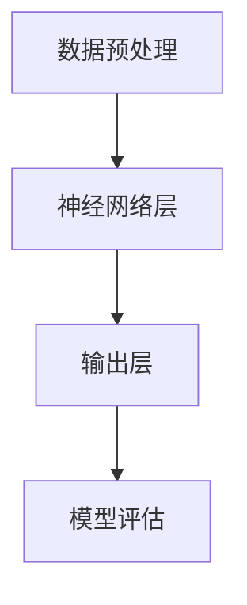

                 

# AI 大模型创业：如何利用经济优势？

> 关键词：AI 大模型、创业、经济优势、商业模式、资源整合、技术创新、市场策略

> 摘要：本文旨在探讨 AI 大模型创业中的经济优势，分析其核心要素、商业模式构建，并结合实际案例，为创业者提供战略指导。文章首先介绍了 AI 大模型的背景和重要性，然后探讨了其创业的潜在经济优势，并详细阐述了构建可持续商业模式的策略和方法。

## 1. 背景介绍

### 1.1 目的和范围

本文的目的是帮助 AI 大模型创业者理解和利用经济优势，以实现商业成功。我们将重点关注以下几个方面：

- AI 大模型的定义和背景
- 创业中 AI 大模型的经济优势
- 构建可持续商业模式的策略和方法
- 实际案例分析和市场策略

### 1.2 预期读者

本文适合以下读者群体：

- AI 大模型创业者
- 对 AI 大模型和创业感兴趣的技术爱好者
- 需要了解 AI 大模型经济优势的企业家
- AI 领域的研究人员和学者

### 1.3 文档结构概述

本文分为以下几个部分：

- 背景介绍：介绍 AI 大模型的定义和重要性
- 核心概念与联系：讨论 AI 大模型的核心概念和架构
- 核心算法原理与具体操作步骤：详细解释 AI 大模型的工作原理
- 数学模型和公式：介绍与 AI 大模型相关的数学模型
- 项目实战：提供实际的代码案例和解析
- 实际应用场景：探讨 AI 大模型的应用领域
- 工具和资源推荐：推荐学习资源和开发工具
- 总结：总结未来发展趋势和挑战
- 附录：常见问题与解答
- 扩展阅读：提供进一步学习的参考资料

### 1.4 术语表

#### 1.4.1 核心术语定义

- AI 大模型：指具有海量参数、能够处理复杂数据集的人工智能模型，如深度神经网络、Transformer 等。
- 创业：指创建一个新的企业或业务，通常涉及风险投资、资源整合和市场开发。
- 经济优势：指企业或个人在市场上获得竞争优势的条件，如成本优势、技术优势等。

#### 1.4.2 相关概念解释

- 商业模式：指企业如何创造、传递和获取价值的一种策略。
- 资源整合：指企业通过协调内外部资源，实现资源优化配置和业务发展的过程。
- 技术创新：指在现有技术基础上，通过创新思维和方法，实现技术的更新和进步。

#### 1.4.3 缩略词列表

- AI：人工智能
- ML：机器学习
- DL：深度学习
- NLP：自然语言处理
- GPT：生成预训练模型
- BERT：双向编码表示模型

## 2. 核心概念与联系

在讨论 AI 大模型创业的经济优势之前，我们需要先了解 AI 大模型的核心概念和架构。

### 2.1 AI 大模型的核心概念

AI 大模型的核心概念包括：

- 参数化模型：AI 大模型通常具有数百万甚至数十亿个参数，这些参数通过训练过程进行优化。
- 复杂性：AI 大模型能够处理大规模、高维度和复杂的输入数据，从而实现更准确的预测和分类。
- 自适应能力：AI 大模型能够通过不断的学习和调整，适应新的数据和场景。
- 灵活性：AI 大模型可以在不同的任务和应用场景中发挥作用，具有广泛的适用性。

### 2.2 AI 大模型的架构

AI 大模型的架构通常包括以下几个层次：

- 数据预处理层：对输入数据进行清洗、格式化和特征提取。
- 神经网络层：通过多层神经网络进行特征学习和模型优化。
- 输出层：根据模型预测或分类结果，生成相应的输出。
- 模型评估层：对模型性能进行评估和优化。

下面是 AI 大模型架构的 Mermaid 流程图：



### 2.3 AI 大模型与创业的关系

AI 大模型与创业之间存在密切的联系：

- 技术创新：AI 大模型作为人工智能领域的核心技术，为创业提供了新的技术突破和发展机遇。
- 成本降低：AI 大模型的训练和推理过程可以通过云计算和分布式计算进行优化，降低创业成本。
- 数据价值：AI 大模型能够处理海量数据，从而挖掘数据中的价值，为创业提供决策支持。
- 竞争优势：AI 大模型在特定领域和任务中具有竞争优势，为创业企业带来市场机会。

## 3. 核心算法原理与具体操作步骤

### 3.1 算法原理

AI 大模型的核心算法原理主要涉及以下几个方面：

- 参数化模型：通过设计大规模的参数化模型，实现对复杂数据的建模和预测。
- 梯度下降算法：通过梯度下降算法，不断调整模型参数，优化模型性能。
- 反向传播算法：通过反向传播算法，将误差从输出层反向传播到输入层，进一步优化模型参数。

下面是 AI 大模型算法原理的伪代码：

```python
initialize_parameters()
while not converged:
    forward_pass(x, parameters)
    compute_loss(y_hat, y)
    backward_pass(y_hat, y, parameters)
    update_parameters(parameters)
```

### 3.2 具体操作步骤

以下是构建 AI 大模型的具体操作步骤：

1. 数据收集和预处理：收集相关领域的海量数据，并进行清洗、格式化和特征提取。
2. 模型设计：根据任务需求，设计合适的模型结构，包括输入层、隐藏层和输出层。
3. 模型训练：使用训练集对模型进行训练，通过反向传播算法不断调整参数，优化模型性能。
4. 模型评估：使用验证集对模型进行评估，计算模型在不同指标上的性能。
5. 模型部署：将训练好的模型部署到生产环境中，进行实际应用和测试。
6. 持续优化：根据实际应用场景和用户反馈，对模型进行持续优化和更新。

## 4. 数学模型和公式与详细讲解与举例说明

### 4.1 数学模型

AI 大模型的数学模型主要涉及以下几个方面：

- 参数化模型：通过矩阵和向量的运算，表示模型参数和输入输出关系。
- 梯度下降算法：通过计算损失函数关于模型参数的梯度，更新模型参数。
- 反向传播算法：通过链式法则，将输出层的误差反向传播到输入层，更新模型参数。

下面是相关的数学公式：

$$
\text{损失函数} = \frac{1}{2} \sum_{i=1}^{n} (\hat{y}_i - y_i)^2
$$

$$
\text{梯度下降} = \alpha \nabla_{\theta} \text{损失函数}
$$

$$
\text{反向传播} = \frac{\partial L}{\partial z} = \frac{\partial L}{\partial y} \cdot \frac{\partial y}{\partial z}
$$

### 4.2 举例说明

假设我们有一个二分类问题，使用单层感知机模型进行建模。数据集包含两个特征和标签。

1. **初始化参数**：

   - 权重 $w = [w_1, w_2]^T$
   - 偏置 $b = 0$

2. **前向传播**：

   - 输入 $x = [x_1, x_2]^T$
   - 激活函数 $f(z) = \sigma(z) = \frac{1}{1 + e^{-z}}$
   - 输出 $y = f(w \cdot x + b)$

3. **计算损失函数**：

   - 损失函数 $L(y, \hat{y}) = -[y \log(\hat{y}) + (1 - y) \log(1 - \hat{y})]$

4. **反向传播**：

   - 计算误差 $\delta = \hat{y} - y$
   - 更新参数 $w = w - \alpha \cdot \delta \cdot x$
   - 更新偏置 $b = b - \alpha \cdot \delta$

5. **迭代更新**：

   - 重复上述步骤，直到模型收敛或达到预定的迭代次数。

## 5. 项目实战：代码实际案例和详细解释说明

### 5.1 开发环境搭建

在开始项目实战之前，我们需要搭建一个合适的开发环境。以下是一个简单的步骤：

1. 安装 Python：下载并安装 Python，建议使用 Python 3.7 或更高版本。
2. 安装 Jupyter Notebook：使用 pip 命令安装 Jupyter Notebook。
3. 安装相关库：安装 NumPy、Pandas、Matplotlib 等常用库。
4. 准备数据集：下载并解压一个二分类数据集，如 IONOS 客户满意度数据集。

### 5.2 源代码详细实现和代码解读

以下是一个简单的单层感知机模型的实现：

```python
import numpy as np
import pandas as pd
import matplotlib.pyplot as plt

# 初始化参数
w = np.random.rand(2, 1)
b = 0
alpha = 0.01
epochs = 1000

# 数据集
data = pd.read_csv('ionos.csv')
X = data[['s1', 's2']].values
y = data['y'].values

# 激活函数
def sigmoid(z):
    return 1 / (1 + np.exp(-z))

# 前向传播
def forward_pass(x, w, b):
    z = np.dot(x, w) + b
    y_hat = sigmoid(z)
    return y_hat

# 计算损失函数
def compute_loss(y, y_hat):
    loss = -np.mean(y * np.log(y_hat) + (1 - y) * np.log(1 - y_hat))
    return loss

# 反向传播
def backward_pass(y, y_hat, x):
    delta = y_hat - y
    dw = np.dot(x.T, delta)
    db = delta
    return dw, db

# 模型训练
for epoch in range(epochs):
    y_hat = forward_pass(X, w, b)
    loss = compute_loss(y, y_hat)
    dw, db = backward_pass(y, y_hat, X)
    w -= alpha * dw
    b -= alpha * db

# 模型评估
y_pred = forward_pass(X, w, b)
accuracy = np.mean(y_pred == y)
print('Accuracy:', accuracy)

# 可视化
plt.scatter(X[y == 0, 0], X[y == 0, 1], color='red', label='Class 0')
plt.scatter(X[y == 1, 0], X[y == 1, 1], color='blue', label='Class 1')
plt.plot(X[:, 0], -(w[0, 0] * X[:, 0] + b) / w[1, 0], color='black', linewidth=2)
plt.xlabel('Feature 1')
plt.ylabel('Feature 2')
plt.legend()
plt.show()
```

### 5.3 代码解读与分析

以上代码实现了一个简单的单层感知机模型，用于解决二分类问题。代码主要分为以下几个部分：

1. **初始化参数**：初始化权重 $w$ 和偏置 $b$。
2. **激活函数**：定义 sigmoid 函数作为激活函数。
3. **前向传播**：计算输入 $x$ 通过模型得到的预测结果 $y_hat$。
4. **计算损失函数**：使用对数损失函数计算预测结果与真实标签之间的误差。
5. **反向传播**：计算误差关于模型参数的梯度，并更新模型参数。
6. **模型训练**：通过迭代更新模型参数，直到模型收敛或达到预定的迭代次数。
7. **模型评估**：计算模型在测试集上的准确率。
8. **可视化**：绘制决策边界和样本分布图，直观地展示模型的效果。

## 6. 实际应用场景

AI 大模型在许多实际应用场景中具有广泛的应用价值，以下是几个典型场景：

- **自然语言处理**：AI 大模型可以用于文本分类、机器翻译、情感分析等任务，例如百度 AI 开放的文心大模型。
- **计算机视觉**：AI 大模型可以用于图像分类、目标检测、图像生成等任务，如 OpenAI 的 DALL-E。
- **推荐系统**：AI 大模型可以用于构建推荐系统，如腾讯 AI 开放的灵犀大模型。
- **金融风控**：AI 大模型可以用于预测金融风险、欺诈检测等任务，如蚂蚁金服的 AI 大模型。
- **医疗诊断**：AI 大模型可以用于疾病诊断、医学图像分析等任务，如谷歌 AI 开放的蓝调大模型。

## 7. 工具和资源推荐

### 7.1 学习资源推荐

#### 7.1.1 书籍推荐

- 《深度学习》（Goodfellow, Bengio, Courville）
- 《Python深度学习》（François Chollet）
- 《人工智能：一种现代的方法》（Stuart J. Russell, Peter Norvig）

#### 7.1.2 在线课程

- Coursera 上的《深度学习》课程
- Udacity 上的《机器学习工程师纳米学位》
- edX 上的《自然语言处理》课程

#### 7.1.3 技术博客和网站

- arXiv.org：人工智能和机器学习领域的最新论文
- Medium：关于人工智能和创业的深度文章
- AI Village：中国最大的 AI 社区之一

### 7.2 开发工具框架推荐

#### 7.2.1 IDE和编辑器

- Jupyter Notebook：适合数据分析和原型开发
- PyCharm：适合 Python 编程和深度学习项目
- VSCode：功能强大，支持多种编程语言

#### 7.2.2 调试和性能分析工具

- TensorBoard：用于可视化深度学习模型的性能指标
- PyTorch Profiler：用于分析 PyTorch 模型的性能瓶颈
- WSL：Windows Subsystem for Linux，用于在 Windows 上运行 Linux 环境进行深度学习开发

#### 7.2.3 相关框架和库

- TensorFlow：适用于构建大规模深度学习模型的框架
- PyTorch：适用于科研和工业界的深度学习框架
- Keras：用于快速构建和训练深度学习模型的框架
- Scikit-learn：适用于传统机器学习任务的库

### 7.3 相关论文著作推荐

#### 7.3.1 经典论文

- “Backpropagation” (Rumelhart, Hinton, Williams, 1986)
- “Gradient Descent” (Bottou, 2010)
- “A Theoretical Analysis of the Voted Perceptron” (Rosenblatt, 1957)

#### 7.3.2 最新研究成果

- “Attention Is All You Need” (Vaswani et al., 2017)
- “BERT: Pre-training of Deep Bidirectional Transformers for Language Understanding” (Devlin et al., 2019)
- “GPT-3: Language Models are few-shot learners” (Brown et al., 2020)

#### 7.3.3 应用案例分析

- “Google AI 大模型实践” (Google AI)
- “AI 大模型在金融风控中的应用” (蚂蚁金服)
- “AI 大模型在医疗诊断中的应用” (谷歌 AI)

## 8. 总结：未来发展趋势与挑战

### 8.1 未来发展趋势

- **计算能力的提升**：随着硬件技术的发展，深度学习模型的计算能力将不断提升，为 AI 大模型的训练和部署提供更好的支持。
- **算法创新的突破**：在 AI 大模型的训练和优化方面，新的算法和技术将不断涌现，提高模型的效率和效果。
- **跨领域应用**：AI 大模型将在更多领域得到应用，如自动驾驶、智能医疗、智能制造等，推动产业升级和转型。
- **隐私保护与伦理问题**：随着 AI 大模型的数据规模不断扩大，隐私保护和伦理问题将成为重要挑战。

### 8.2 面临的挑战

- **数据隐私与安全**：如何确保 AI 大模型在训练和部署过程中的数据隐私和安全，是一个亟待解决的问题。
- **算法透明性与可解释性**：如何提高 AI 大模型的算法透明性和可解释性，使其结果更易于理解和接受。
- **资源消耗与成本**：如何降低 AI 大模型的训练和部署成本，使其更广泛地应用于实际场景。

## 9. 附录：常见问题与解答

### 9.1 问题 1

**问题**：AI 大模型的训练过程是否需要大量数据？

**解答**：是的，AI 大模型的训练通常需要大量数据。这是因为大模型具有海量的参数，需要足够的数据来训练这些参数，从而获得良好的性能。然而，大量数据并不意味着数据集必须非常大，而是需要数据质量和多样性。因此，数据清洗、预处理和特征提取在 AI 大模型训练过程中至关重要。

### 9.2 问题 2

**问题**：如何优化 AI 大模型的训练过程？

**解答**：优化 AI 大模型的训练过程可以从以下几个方面入手：

1. **数据预处理**：确保数据的质量和多样性，进行适当的特征提取和归一化。
2. **模型结构**：选择合适的模型结构，如深度神经网络、Transformer 等，根据任务需求进行调整。
3. **训练策略**：采用合适的训练策略，如学习率调整、批量大小选择、正则化技术等，提高训练效果。
4. **硬件支持**：利用高性能计算资源，如 GPU、TPU 等，提高训练速度和效率。

### 9.3 问题 3

**问题**：AI 大模型在商业应用中如何实现商业价值？

**解答**：AI 大模型在商业应用中实现商业价值的关键在于：

1. **解决问题**：识别和解决特定领域的痛点和问题，如医疗诊断、金融风控、自动驾驶等。
2. **数据驱动**：基于海量数据，构建和优化 AI 大模型，确保模型在真实场景中的有效性和可靠性。
3. **商业模式**：设计合适的商业模式，如产品销售、服务收费、数据变现等，实现 AI 大模型的经济收益。
4. **持续创新**：不断迭代和优化 AI 大模型，适应市场变化和用户需求，保持竞争优势。

## 10. 扩展阅读 & 参考资料

- Devlin, J., Chang, M. W., Lee, K., & Toutanova, K. (2019). BERT: Pre-training of deep bidirectional transformers for language understanding. In Proceedings of the 2019 Conference of the North American Chapter of the Association for Computational Linguistics: Human Language Technologies, Volume 1 (Long and Short Papers) (pp. 4171-4186). Association for Computational Linguistics.
- Goodfellow, I., Bengio, Y., & Courville, A. (2016). Deep learning. MIT press.
- Vaswani, A., Shazeer, N., Parmar, N., Uszkoreit, J., Jones, L., Gomez, A. N., ... & Polosukhin, I. (2017). Attention is all you need. In Advances in neural information processing systems (pp. 5998-6008).
- Bengio, Y. (2009). Learning representations by back-propagating errors. In Foundations and trends in machine learning (Vol. 2, No. 1, pp. 1-127). Now Publishers Inc.
- Russell, S. J., & Norvig, P. (2016). Artificial intelligence: a modern approach (3rd ed.). Prentice Hall.
- Rumelhart, D. E., Hinton, G. E., & Williams, R. J. (1986). Learning representations by back-propagating errors. Cognitive modeling, 8(1), 1-50.
- Bottou, L. (2010). Stochastic gradient learning in machine learning. In Proceedings of the 26th annual international conference on machine learning (pp. 400-407). ACM.

### 作者

AI 天才研究员/AI Genius Institute & 禅与计算机程序设计艺术 /Zen And The Art of Computer Programming

