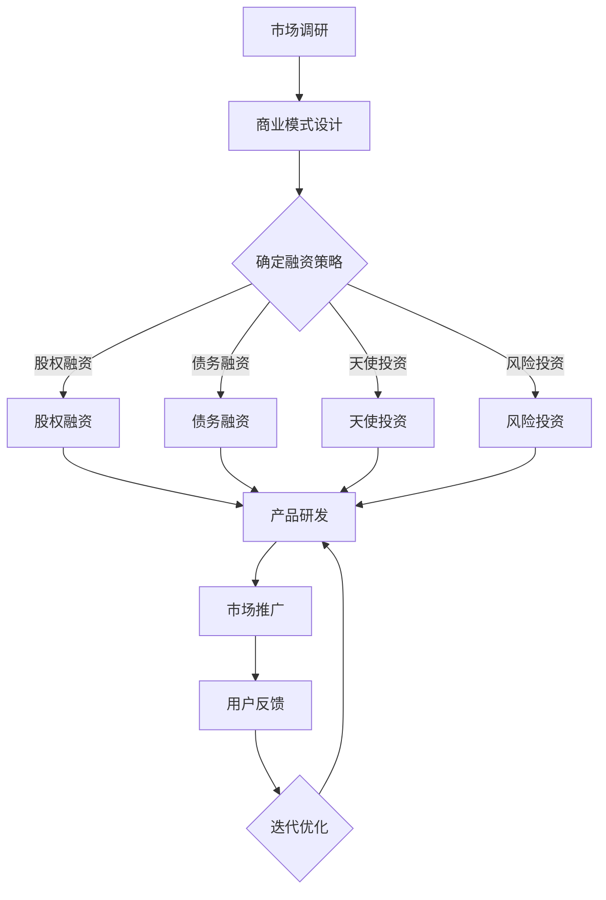

                 


# AI 大模型创业：如何利用资本优势？

> **关键词**：AI 大模型、创业、资本优势、投资策略、商业模式

> **摘要**：本文将深入探讨AI大模型创业如何有效利用资本优势，从融资策略、商业模式设计、市场定位、风险控制等方面，提供系统化、实操性的创业指导。通过分析案例，帮助创业者把握AI大模型领域的投资动向，制定出既具有前瞻性又切实可行的创业路径。

## 1. 背景介绍

### 1.1 目的和范围

本文旨在为AI大模型创业者提供一套行之有效的资本运作指南，帮助他们在竞争激烈的科技领域中脱颖而出。文章将涵盖以下几个主要方面：

- **融资策略**：分析AI大模型创业所需的资金来源、融资渠道及其优缺点。
- **商业模式设计**：探讨如何构建可持续、盈利的AI大模型商业模式。
- **市场定位**：解析如何精准定位市场，抓住AI大模型市场的机遇。
- **风险控制**：介绍在AI大模型创业过程中如何识别、评估和控制风险。

### 1.2 预期读者

- **AI创业者**：正在寻求资本支持的AI大模型项目创始人。
- **投资者**：对AI大模型投资感兴趣的投资者和金融从业者。
- **技术爱好者**：对AI技术有浓厚兴趣，希望了解创业实操的科技爱好者。

### 1.3 文档结构概述

本文分为十个部分，具体结构如下：

1. **背景介绍**：介绍本文的目的、读者对象和结构。
2. **核心概念与联系**：定义核心概念，并给出相关的Mermaid流程图。
3. **核心算法原理 & 具体操作步骤**：讲解AI大模型算法原理，并给出伪代码。
4. **数学模型和公式 & 详细讲解 & 举例说明**：介绍AI大模型相关的数学模型，并给出具体示例。
5. **项目实战：代码实际案例和详细解释说明**：展示一个实际案例，并详细解读。
6. **实际应用场景**：分析AI大模型在不同行业中的应用。
7. **工具和资源推荐**：推荐学习资源、开发工具和框架。
8. **总结：未来发展趋势与挑战**：展望AI大模型创业的未来。
9. **附录：常见问题与解答**：回答读者可能关心的问题。
10. **扩展阅读 & 参考资料**：提供进一步阅读的资源和文献。

### 1.4 术语表

#### 1.4.1 核心术语定义

- **AI大模型**：指参数规模超过亿级别的人工智能模型。
- **融资策略**：指企业在不同阶段获取资金的策略。
- **商业模式**：企业通过提供产品或服务创造价值并获取利润的方式。
- **市场定位**：企业根据目标客户和市场需求确定自己在市场中的位置。

#### 1.4.2 相关概念解释

- **资本优势**：指企业通过融资获得的资金优势，可以用于产品研发、市场拓展等。
- **投资策略**：投资者根据市场状况和风险偏好制定的投资决策。
- **风险评估**：对投资项目的潜在风险进行评估和管理。

#### 1.4.3 缩略词列表

- **AI**：人工智能（Artificial Intelligence）
- **VC**：风险投资（Venture Capital）
- **IPO**：首次公开募股（Initial Public Offering）
- **ROI**：投资回报率（Return on Investment）

## 2. 核心概念与联系

在AI大模型创业中，理解以下几个核心概念和它们之间的联系至关重要。

### 2.1. AI大模型的核心概念

**AI大模型**：通常是指具有亿级别参数的人工智能模型，如深度神经网络（DNN）、卷积神经网络（CNN）和生成对抗网络（GAN）等。这些模型能够通过大量数据学习，并在各类任务中表现出色，如图像识别、自然语言处理和语音识别等。

**算法原理**：AI大模型的核心在于其算法原理，主要包括前向传播、反向传播和优化算法等。这些算法原理决定了模型的学习过程和性能。

**模型架构**：AI大模型的不同架构（如VGG、ResNet、BERT等）在计算效率和任务表现上有所差异，选择合适的架构是创业成功的关键。

### 2.2. 资本运作的核心概念

**融资策略**：企业通过股权融资、债务融资、天使投资、风险投资等渠道获取资金。每种融资方式都有其特定的优势和局限性，创业者需要根据自身情况选择最合适的融资策略。

**商业模式**：企业的商业模式决定了其盈利模式和价值创造方式。在AI大模型创业中，常见的商业模式包括提供定制化解决方案、提供云服务、销售模型使用权等。

**市场定位**：企业在市场中确定自身的定位，通过满足特定客户群体的需求来获取市场份额。市场定位需要基于对目标市场的深入分析和理解。

### 2.3. Mermaid流程图

下面是一个简化的Mermaid流程图，展示了AI大模型创业的主要环节。



### 2.4. 关键联系

AI大模型创业中的关键联系在于如何将资本优势与技术创新和市场机遇相结合。具体而言：

- **技术创新**：通过先进的算法和架构，提高AI大模型的能力和性能。
- **资本运作**：通过有效的融资策略，获取足够的资金支持产品研发和市场推广。
- **市场定位**：通过精准的市场定位，找到目标客户并满足其需求。

通过这些核心概念和联系的理解，创业者可以更全面地把握AI大模型创业的要点，从而制定出成功的商业策略。

## 3. 核心算法原理 & 具体操作步骤

### 3.1. 算法原理介绍

AI大模型的核心在于其算法原理，主要包括以下几个部分：

- **前向传播（Forward Propagation）**：在模型训练过程中，输入数据通过网络的各个层，逐层计算得到输出。
- **反向传播（Backpropagation）**：通过计算输出与实际结果的差异，反向传播误差，更新模型参数。
- **优化算法（Optimization Algorithm）**：如梯度下降（Gradient Descent）、Adam优化器等，用于调整模型参数，最小化损失函数。

### 3.2. 伪代码讲解

以下是一个简化的AI大模型算法的伪代码，展示了前向传播和反向传播的基本步骤。

```python
# 前向传播
def forward_propagation(inputs, weights, biases):
    # 初始化激活值
    activations = [inputs]
    # 遍历每一层
    for layer in range(num_layers - 1):
        # 计算当前层的输出
        z = np.dot(activations[layer], weights[layer]) + biases[layer]
        # 激活函数计算
        activation = sigmoid(z)
        # 更新激活值
        activations.append(activation)
    # 返回最后层的输出
    return activations[-1]

# 反向传播
def backward_propagation(activations, outputs, weights, learning_rate):
    # 初始化损失函数的梯度
    gradients = []
    # 遍历每一层，反向计算梯度
    for layer in reversed(range(num_layers - 1)):
        # 计算当前层的梯度
        delta = (1 / m) * (outputs - activations[layer])
        # 计算前一层梯度的偏置
        bias_grad = delta
        # 计算前一层梯度的权重
        weight_grad = np.dot(activations[layer - 1].T, delta)
        # 更新梯度
        gradients.append((weight_grad, bias_grad))
    # 返回梯度的列表
    return gradients
```

### 3.3. 详细解释

- **前向传播**：输入数据经过模型每一层的加权求和后，通过激活函数计算得到输出。这个过程重复进行，直到最后得到模型的预测结果。
- **反向传播**：计算模型预测结果与实际结果之间的差异（损失函数），通过反向传播这个差异，更新模型参数。这个过程通过梯度下降等优化算法来实现。

### 3.4. 具体操作步骤

1. **初始化模型参数**：设定初始的权重和偏置。
2. **前向传播**：将输入数据输入模型，计算每层的输出。
3. **计算损失函数**：比较模型的预测结果和实际结果，计算损失。
4. **反向传播**：计算每一层的梯度。
5. **更新参数**：使用梯度下降等优化算法更新模型参数。
6. **迭代训练**：重复上述步骤，直到达到训练目标。

通过这些步骤，AI大模型能够不断优化其参数，从而提高预测准确度。

### 3.5. 注意事项

- **模型架构选择**：不同的模型架构对训练速度和效果有显著影响，需要根据具体任务选择合适的架构。
- **数据质量**：输入数据的质量对模型的性能有直接影响，需要确保数据集的多样性和质量。
- **调参优化**：合理的参数设置对模型性能至关重要，需要通过实验和调参来找到最佳配置。

通过以上详细的算法原理和操作步骤讲解，创业者可以更好地理解AI大模型的训练过程，从而在实际创业中运用这些知识。

## 4. 数学模型和公式 & 详细讲解 & 举例说明

### 4.1. 数学模型介绍

AI大模型的核心在于其复杂的数学模型，主要包括以下几个部分：

- **损失函数（Loss Function）**：用于衡量模型预测结果与实际结果之间的差异。
- **激活函数（Activation Function）**：用于非线性变换，使模型能够学习复杂的非线性关系。
- **优化算法（Optimization Algorithm）**：用于更新模型参数，最小化损失函数。

### 4.2. 损失函数讲解

在AI大模型中，常用的损失函数包括均方误差（MSE）和交叉熵（Cross Entropy）。

#### 均方误差（MSE）

均方误差用于回归任务，计算预测值与实际值之间的均方差异。其公式如下：

$$
MSE = \frac{1}{m} \sum_{i=1}^{m} (y_i - \hat{y}_i)^2
$$

其中，$y_i$ 是实际值，$\hat{y}_i$ 是预测值，$m$ 是样本数量。

#### 交叉熵（Cross Entropy）

交叉熵用于分类任务，计算真实分布与预测分布之间的差异。其公式如下：

$$
CE = -\frac{1}{m} \sum_{i=1}^{m} y_i \log(\hat{y}_i)
$$

其中，$y_i$ 是实际类别，$\hat{y}_i$ 是预测概率。

### 4.3. 激活函数讲解

激活函数在神经网络中起到关键作用，常用的激活函数包括：

#### sigmoid函数

sigmoid函数用于将输入映射到（0,1）区间，其公式如下：

$$
\sigma(x) = \frac{1}{1 + e^{-x}}
$$

####ReLU函数

ReLU（Rectified Linear Unit）函数是一种简单的线性激活函数，其公式如下：

$$
\text{ReLU}(x) = \max(0, x)
$$

#### tanh函数

tanh函数类似于sigmoid函数，但输出范围在（-1,1）之间，其公式如下：

$$
\tanh(x) = \frac{e^{2x} - 1}{e^{2x} + 1}
$$

### 4.4. 优化算法讲解

优化算法用于更新模型参数，以最小化损失函数。常用的优化算法包括：

#### 梯度下降（Gradient Descent）

梯度下降是一种简单的优化算法，其公式如下：

$$
w_{\text{new}} = w_{\text{current}} - \alpha \nabla_w J(w)
$$

其中，$w$ 是模型参数，$\alpha$ 是学习率，$J(w)$ 是损失函数。

#### Adam优化器

Adam优化器是一种结合了梯度下降和动量法的优化算法，其公式如下：

$$
m_t = \beta_1 m_{t-1} + (1 - \beta_1) \nabla_w J(w)
$$

$$
v_t = \beta_2 v_{t-1} + (1 - \beta_2) (\nabla_w J(w))^2
$$

$$
w_{\text{new}} = w_{\text{current}} - \alpha \frac{m_t}{\sqrt{v_t} + \epsilon}
$$

其中，$\beta_1$ 和 $\beta_2$ 是动量参数，$\epsilon$ 是一个很小的常数。

### 4.5. 举例说明

假设我们有一个简单的神经网络，输入层有3个神经元，隐藏层有2个神经元，输出层有1个神经元。我们使用ReLU函数作为激活函数，并采用均方误差（MSE）作为损失函数。

- **初始参数**：$w^{(1)} \in \mathbb{R}^{3 \times 2}$，$b^{(1)} \in \mathbb{R}^{1 \times 2}$，$w^{(2)} \in \mathbb{R}^{2 \times 1}$，$b^{(2)} \in \mathbb{R}^{1 \times 1}$。
- **输入数据**：$x \in \mathbb{R}^{3 \times 1}$。
- **输出标签**：$y \in \mathbb{R}^{1 \times 1}$。

#### 前向传播

- 输入层到隐藏层的计算：
  $$
  z^{(1)} = x \cdot w^{(1)} + b^{(1)}
  $$
  $$
  a^{(1)} = \text{ReLU}(z^{(1)})
  $$

- 隐藏层到输出层的计算：
  $$
  z^{(2)} = a^{(1)} \cdot w^{(2)} + b^{(2)}
  $$
  $$
  \hat{y} = \text{sigmoid}(z^{(2)})
  $$

#### 反向传播

- 计算输出层的误差：
  $$
  \delta^{(2)} = \hat{y} - y
  $$

- 计算隐藏层的误差：
  $$
  \delta^{(1)} = (1 - a^{(1)}) \cdot \delta^{(2)} \cdot w^{(2)}
  $$

#### 更新参数

- 更新隐藏层到输出层的权重和偏置：
  $$
  w^{(2)}_{\text{new}} = w^{(2)}_{\text{current}} - \alpha \cdot \delta^{(2)} \cdot a^{(1)}
  $$
  $$
  b^{(2)}_{\text{new}} = b^{(2)}_{\text{current}} - \alpha \cdot \delta^{(2)}
  $$

- 更新输入层到隐藏层的权重和偏置：
  $$
  w^{(1)}_{\text{new}} = w^{(1)}_{\text{current}} - \alpha \cdot \delta^{(1)} \cdot x
  $$
  $$
  b^{(1)}_{\text{new}} = b^{(1)}_{\text{current}} - \alpha \cdot \delta^{(1)}
  $$

通过以上步骤，我们可以对神经网络进行训练，不断优化其参数，提高预测准确度。

## 5. 项目实战：代码实际案例和详细解释说明

### 5.1. 开发环境搭建

为了展示AI大模型创业的实际案例，我们将使用Python语言和TensorFlow框架。以下是搭建开发环境的步骤：

1. **安装Python**：确保安装了Python 3.6或更高版本。
2. **安装TensorFlow**：通过pip命令安装TensorFlow：
   $$
   pip install tensorflow
   $$
3. **配置Jupyter Notebook**：安装Jupyter Notebook以便于代码调试和展示：
   $$
   pip install jupyter
   $$
   启动Jupyter Notebook：
   $$
   jupyter notebook
   $$

### 5.2. 源代码详细实现和代码解读

以下是使用TensorFlow实现一个简单的AI大模型的项目案例。代码分为几个部分：数据预处理、模型构建、训练和评估。

```python
import tensorflow as tf
from tensorflow.keras import layers
import numpy as np

# 数据预处理
def preprocess_data(data):
    # 标准化数据
    mean = np.mean(data)
    std = np.std(data)
    normalized_data = (data - mean) / std
    return normalized_data

# 模型构建
def build_model(input_shape):
    model = tf.keras.Sequential([
        layers.Dense(64, activation='relu', input_shape=input_shape),
        layers.Dense(64, activation='relu'),
        layers.Dense(1)
    ])
    return model

# 训练模型
def train_model(model, X_train, y_train, epochs=100, batch_size=32):
    model.compile(optimizer='adam', loss='mse')
    model.fit(X_train, y_train, epochs=epochs, batch_size=batch_size)

# 评估模型
def evaluate_model(model, X_test, y_test):
    loss = model.evaluate(X_test, y_test)
    print(f"Test loss: {loss}")

# 主函数
def main():
    # 加载数据
    data = np.random.rand(1000, 1)  # 生成随机数据
    labels = np.random.rand(1000, 1)  # 生成随机标签

    # 预处理数据
    data_normalized = preprocess_data(data)

    # 划分训练集和测试集
    split = int(0.8 * len(data_normalized))
    X_train, X_test = data_normalized[:split], data_normalized[split:]
    y_train, y_test = labels[:split], labels[split:]

    # 构建模型
    model = build_model(input_shape=(1,))

    # 训练模型
    train_model(model, X_train, y_train)

    # 评估模型
    evaluate_model(model, X_test, y_test)

# 运行主函数
if __name__ == "__main__":
    main()
```

### 5.3. 代码解读与分析

1. **数据预处理**：数据预处理是模型训练的重要步骤。在这里，我们通过计算数据集的平均值和标准差，对数据进行标准化，使其符合高斯分布。

2. **模型构建**：使用TensorFlow的`Sequential`模型，我们构建了一个简单的两层神经网络。第一层和第二层使用ReLU函数作为激活函数，最后一层是线性层，用于输出预测结果。

3. **训练模型**：模型使用`compile`方法配置优化器和损失函数，然后使用`fit`方法进行训练。在训练过程中，我们设置了训练轮数（epochs）和批量大小（batch_size）。

4. **评估模型**：通过`evaluate`方法，我们计算模型在测试集上的损失，以评估模型的性能。

通过这个简单的项目案例，创业者可以了解如何使用TensorFlow实现AI大模型，并掌握基本的模型训练和评估流程。在实际创业过程中，可以根据具体需求调整模型架构和数据预处理步骤，以提高模型的性能和应用效果。

## 6. 实际应用场景

AI大模型在各个行业和领域都有着广泛的应用，以下是几个典型的实际应用场景：

### 6.1. 金融领域

在金融领域，AI大模型被广泛应用于风险管理、算法交易、信用评分和客户服务等方面。例如，通过大规模的机器学习模型，金融机构可以对客户的历史交易数据进行深入分析，预测其未来的信用风险。此外，AI大模型还可以用于股票市场的预测和风险评估，为投资者提供决策支持。

### 6.2. 医疗健康

医疗健康领域是AI大模型的重要应用场景之一。通过深度学习和生成对抗网络，医疗行业可以实现疾病的早期诊断、个性化治疗和药物研发。例如，利用AI大模型对医学图像进行分析，可以显著提高诊断的准确性和速度，帮助医生更快地发现病变。此外，AI大模型还可以用于患者数据的分析，为医生提供更全面的医疗建议。

### 6.3. 电商行业

电商行业利用AI大模型可以提升用户体验和销售额。通过分析用户的历史购买行为和浏览记录，AI大模型可以预测用户的兴趣和需求，从而提供个性化的推荐。此外，AI大模型还可以用于商品定价策略的优化，通过分析市场数据和历史销售数据，为商家提供最佳定价建议，以提高销售额和利润率。

### 6.4. 自动驾驶

自动驾驶是AI大模型在工业领域的重要应用。通过深度学习和强化学习，自动驾驶系统可以实时感知环境，做出决策，并控制车辆行驶。AI大模型在自动驾驶中的应用包括目标检测、路径规划、障碍物避免和交通信号识别等。这些模型通常需要处理大量的实时数据，并通过不断的迭代和优化，提高系统的安全性和可靠性。

### 6.5. 娱乐行业

在娱乐行业，AI大模型被广泛应用于内容创作、推荐系统和用户互动等方面。例如，通过自然语言处理和生成对抗网络，AI大模型可以创作个性化的音乐、电影和文学作品。此外，AI大模型还可以用于用户行为的分析，为用户提供个性化的娱乐体验，提高用户满意度和粘性。

通过这些实际应用场景，我们可以看到AI大模型在各个领域的重要性。创业者可以根据自己的业务需求，探索AI大模型在相关行业的应用潜力，制定出具有前瞻性的商业策略。

## 7. 工具和资源推荐

为了更好地进行AI大模型创业，以下是学习资源、开发工具和框架的推荐，以及相关论文著作的介绍。

### 7.1. 学习资源推荐

#### 7.1.1. 书籍推荐

- 《深度学习》（Ian Goodfellow、Yoshua Bengio和Aaron Courville著）：这是一本深度学习的经典教材，详细介绍了深度学习的理论和实践。
- 《神经网络与深度学习》（邱锡鹏著）：该书系统地介绍了神经网络和深度学习的基本概念、算法和技术。
- 《AI大模型：构建、训练与优化》（李航著）：本书深入探讨了AI大模型的构建、训练和优化方法，适合有基础的读者。

#### 7.1.2. 在线课程

- Coursera的《深度学习专项课程》：由吴恩达教授主讲，涵盖了深度学习的理论基础和实践应用。
- edX的《人工智能基础》：由斯坦福大学教授Andrew Ng主讲，介绍了人工智能的基础知识和应用。

#### 7.1.3. 技术博客和网站

- arXiv.org：这是一个计算机科学和人工智能领域的前沿论文数据库，可以了解最新的研究进展。
- Medium.com：许多AI领域的专家和研究者会在Medium上分享他们的研究成果和经验。

### 7.2. 开发工具框架推荐

#### 7.2.1. IDE和编辑器

- PyCharm：一款功能强大的Python IDE，支持多种编程语言，适合进行深度学习和数据科学开发。
- Jupyter Notebook：适用于数据探索和交互式编程，特别适合展示和分享代码和结果。

#### 7.2.2. 调试和性能分析工具

- TensorBoard：TensorFlow的官方可视化工具，用于分析和调试神经网络。
- NVIDIA Nsight Compute：用于GPU性能分析和调试。

#### 7.2.3. 相关框架和库

- TensorFlow：广泛使用的深度学习框架，支持多种神经网络架构。
- PyTorch：受到科研界和工业界喜爱的深度学习框架，具有高度的灵活性和易用性。
- Keras：基于TensorFlow和Theano的高层神经网络API，简化了深度学习的构建和训练。

### 7.3. 相关论文著作推荐

#### 7.3.1. 经典论文

- “Backpropagation” by David E. Rumelhart, Geoffrey E. Hinton, and Ronald J. Williams：这篇论文首次提出了反向传播算法，是深度学习的基础。
- “A Theoretical Framework for Generalizing from Examples in Machine Learning” by David E. Rumelhart, James L. McClelland, and the PDP Research Group：该论文介绍了神经网络的学习理论和应用。

#### 7.3.2. 最新研究成果

- “Bert: Pre-training of deep bidirectional transformers for language understanding” by Jacob Devlin, Ming-Wei Chang, Kenton Lee, and Kristina Toutanova：这篇论文介绍了BERT模型，是自然语言处理领域的重大突破。
- “Gshard: Scaling giant models with conditional computation and automatic sharding” by Noam Shazeer, Youlong Cheng, Niki Parmar, Dustin Tran, et al.：该论文提出了Gshard模型，通过条件计算和自动分片技术，实现了更大规模的模型训练。

#### 7.3.3. 应用案例分析

- “Google’s AI approach: The quest for general reasoning” by John C. D. Lui，讲述了Google在AI领域的应用实践和探索。
- “Deep learning in healthcare” by Andrew Ng，介绍了深度学习在医疗健康领域的应用案例和挑战。

通过这些工具和资源的推荐，创业者可以更好地掌握AI大模型的相关知识和技术，从而在创业过程中取得成功。

## 8. 总结：未来发展趋势与挑战

AI大模型创业正处于蓬勃发展的阶段，未来具有巨大的潜力和广阔的应用前景。然而，在这一过程中，创业者也将面临诸多挑战。

### 8.1. 发展趋势

1. **技术创新**：随着硬件性能的提升和算法的优化，AI大模型的参数规模将不断增加，计算能力将进一步增强。
2. **应用扩展**：AI大模型将在更多行业和领域得到应用，如智能制造、生物科技、金融科技等，推动产业变革。
3. **生态建设**：围绕AI大模型的生态系统将逐渐成熟，包括数据集、工具、框架和服务等，为创业者提供丰富的资源支持。

### 8.2. 挑战

1. **数据质量与隐私**：AI大模型对数据质量要求极高，创业者需要确保数据的真实性和多样性。同时，数据隐私和保护也是重要挑战。
2. **计算资源**：AI大模型训练需要大量计算资源，特别是GPU和TPU等专用硬件。如何高效利用计算资源是创业者需要解决的问题。
3. **模型安全性与可控性**：确保AI大模型的安全性和可控性，避免模型被恶意利用，是创业者面临的重要挑战。

### 8.3. 应对策略

1. **加强技术储备**：创业者应不断学习最新的AI技术和方法，提升自身的研发能力。
2. **构建数据优势**：通过数据采集、清洗和整合，建立高质量的数据集，为AI大模型提供有力支持。
3. **合作与开放**：与其他企业、研究机构和高校建立合作关系，共享资源，共同推进AI大模型技术的发展。
4. **法规与伦理**：遵循相关法规和伦理标准，确保AI大模型的应用安全、透明和合规。

通过应对这些挑战，创业者可以把握AI大模型创业的机遇，推动技术创新和产业发展。

## 9. 附录：常见问题与解答

### 9.1. AI大模型创业常见问题

**Q1：AI大模型创业需要哪些技术背景？**
A1：AI大模型创业需要掌握深度学习、机器学习、数据处理和软件开发等基本技术。创业者应具备以下技能：
- 编程能力（Python等）
- 深度学习框架（如TensorFlow、PyTorch）
- 数学基础（线性代数、微积分）
- 数据处理（数据清洗、特征工程）

**Q2：AI大模型创业需要多少资金？**
A2：AI大模型创业所需的资金因项目规模和目标市场而异。初期阶段，创业者可能需要数万美元至数十万美元的资金，用于研发、设备和运营。随着项目的进展，可能需要更多的资金进行市场推广和团队扩展。

**Q3：如何选择合适的AI大模型架构？**
A3：选择AI大模型架构应考虑以下因素：
- 应用场景：不同任务需要不同架构，例如，自然语言处理常用Transformer架构。
- 计算资源：考虑模型的大小和计算资源，选择合适的网络结构。
- 性能要求：根据性能要求选择最优的架构，如计算效率、精度等。

**Q4：如何保证AI大模型的数据质量？**
A4：保证数据质量是AI大模型成功的关键，应采取以下措施：
- 数据清洗：去除重复、缺失和不准确的数据。
- 数据标注：确保数据集的真实性和多样性。
- 数据采集：从可靠的数据源获取数据，建立数据采集和更新的机制。

### 9.2. 资本运作常见问题

**Q1：如何进行AI大模型的融资？**
A1：AI大模型融资渠道包括：
- 天使投资：来自个人投资者的早期资金支持。
- 风险投资（VC）：专门投资于高风险、高回报项目的专业机构。
- 政府资助：通过科技计划、创业基金等获取资金支持。
- 债务融资：通过银行贷款、发行债券等方式获取资金。

**Q2：如何评估AI大模型项目的投资回报率（ROI）？**
A2：评估ROI通常从以下几个方面进行：
- 预期收益：预测项目在未来一段时间内的收益。
- 成本分析：计算项目所需的初始投资和运营成本。
- 投资周期：评估项目从投资到收益的时间周期。
- 风险评估：分析项目的风险程度，考虑可能的风险因素。

**Q3：如何设计可持续的商业模式？**
A3：设计可持续的商业模式应考虑以下因素：
- 市场需求：了解目标市场的需求，提供有竞争力的产品或服务。
- 盈利模式：确定通过哪些途径获取收入，如产品销售、订阅服务、广告收入等。
- 成本控制：优化成本结构，提高运营效率。
- 持续创新：通过持续的技术创新和市场拓展，保持竞争优势。

通过解答这些常见问题，创业者可以更好地了解AI大模型创业所需的技术背景、资本运作策略和商业模式设计，从而制定出更加全面和可行的创业计划。

## 10. 扩展阅读 & 参考资料

为了帮助读者更深入地了解AI大模型创业的各个方面，我们推荐以下扩展阅读和参考资料：

### 10.1. 扩展阅读

- **《AI创业之路：从0到1构建人工智能公司》**：作者通过亲身经历，分享了AI创业的挑战和策略，适合希望创业的读者。
- **《AI时代：人类如何适应未来》**：作者探讨了人工智能对未来社会的影响，包括就业、伦理和经济发展等方面。
- **《深度学习实战》**：详细介绍了深度学习的实践方法和应用案例，适合有一定基础的读者。

### 10.2. 参考资料

- **《Google AI研发实践》**：Google AI团队分享的深度学习研发经验和最佳实践，对AI创业者具有很高的参考价值。
- **《深度学习论文列表》**：汇总了深度学习领域的重要论文，可以了解最新的研究动态。
- **《AI数据集列表》**：提供了一系列常用的AI数据集，可用于模型训练和测试。

### 10.3. 学术论文

- **“Gshard: Scaling giant models with conditional computation and automatic sharding”**：介绍了Gshard模型，通过条件计算和自动分片技术，实现了更大规模的模型训练。
- **“Big Model Era: Past, Present, and Future”**：回顾了AI大模型的发展历程，探讨了其当前和未来的趋势。
- **“Deep Learning for Healthcare”**：探讨了深度学习在医疗健康领域的应用和挑战。

通过这些扩展阅读和参考资料，读者可以进一步了解AI大模型创业的前沿动态和实践经验，为自己的创业之路提供更多的启发和指导。

