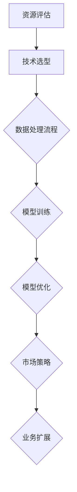

                 

# AI 大模型创业：如何利用资源优势？

> 关键词：AI大模型、创业、资源利用、模型训练、数据处理、技术栈、市场策略

> 摘要：本文深入探讨了在AI大模型创业过程中，如何有效利用资源优势。通过分析大模型的开发流程、技术选型和资源管理策略，为创业者提供了可行的路径和实用的建议。

## 1. 背景介绍

### 1.1 目的和范围

本文旨在为那些有意进军AI大模型领域的创业者提供实用的指导。我们将详细讨论以下几个关键问题：

- 如何评估和利用现有的资源？
- 开发大模型所需的技术栈是什么？
- 如何优化数据处理流程，确保模型训练的效率和质量？
- 在市场策略上，如何差异化竞争，找到突破口？

### 1.2 预期读者

- 有志于从事AI大模型开发的创业者。
- 对AI技术有浓厚兴趣的技术人员。
- 关注AI产业发展趋势的投资人。

### 1.3 文档结构概述

本文将分为以下章节：

1. 背景介绍
2. 核心概念与联系
3. 核心算法原理 & 具体操作步骤
4. 数学模型和公式 & 详细讲解 & 举例说明
5. 项目实战：代码实际案例和详细解释说明
6. 实际应用场景
7. 工具和资源推荐
8. 总结：未来发展趋势与挑战
9. 附录：常见问题与解答
10. 扩展阅读 & 参考资料

### 1.4 术语表

#### 1.4.1 核心术语定义

- AI大模型：指的是参数量庞大的神经网络模型，如GPT、BERT等。
- 资源：包括计算资源、数据资源、技术资源等。
- 模型训练：通过大量数据训练模型参数的过程。
- 数据处理：对原始数据进行清洗、预处理、特征提取等操作。

#### 1.4.2 相关概念解释

- 深度学习：一种以多层神经网络为基础的学习方法。
- 分布式计算：将任务分解到多个计算节点上执行，以提升计算效率。

#### 1.4.3 缩略词列表

- GPT：Generative Pre-trained Transformer
- BERT：Bidirectional Encoder Representations from Transformers

## 2. 核心概念与联系

为了更好地理解AI大模型创业的流程，我们需要明确几个核心概念及其相互联系。以下是一个用Mermaid绘制的流程图：



### 2.1 资源评估

资源评估是创业的起点，包括计算资源、数据资源和人才资源。创业者需要全面了解自身资源情况，以便制定合理的开发计划。

### 2.2 技术选型

技术选型是决定大模型性能和开发效率的关键。创业者需要根据业务需求和资源情况，选择合适的技术框架和工具。

### 2.3 数据处理流程

数据处理是模型训练的基础。创业者需要构建高效的数据处理流程，确保数据质量，并提取有效特征。

### 2.4 模型训练

模型训练是核心环节，创业者需要优化训练流程，提高训练效率和模型性能。

### 2.5 模型优化

模型优化是不断提升模型性能的过程。创业者需要不断尝试新的优化方法，以应对不断变化的市场需求。

### 2.6 市场策略

市场策略是确保业务可持续发展的关键。创业者需要深入了解市场，制定差异化竞争策略，抢占市场份额。

## 3. 核心算法原理 & 具体操作步骤

### 3.1 深度学习基础

深度学习是构建AI大模型的核心。以下是一个简单的深度学习算法原理和伪代码：

```python
# 深度学习算法伪代码
initialize_parameters()
while not convergence:
    forward_pass(x)
    compute_loss(y)
    backward_pass()
    update_parameters()
```

### 3.2 模型训练步骤

#### 3.2.1 数据预处理

```python
# 数据预处理伪代码
def preprocess_data(data):
    # 清洗数据
    data = clean_data(data)
    # 数据标准化
    data = standardize_data(data)
    # 特征提取
    data = extract_features(data)
    return data
```

#### 3.2.2 模型训练流程

```python
# 模型训练伪代码
def train_model(data, labels):
    # 数据预处理
    data = preprocess_data(data)
    # 初始化模型参数
    parameters = initialize_parameters()
    # 设置迭代次数
    num_epochs = 1000
    for epoch in range(num_epochs):
        # 前向传播
        outputs = forward_pass(data, parameters)
        # 计算损失
        loss = compute_loss(outputs, labels)
        # 反向传播
        gradients = backward_pass(outputs, labels, parameters)
        # 更新参数
        update_parameters(gradients, parameters)
    return parameters
```

## 4. 数学模型和公式 & 详细讲解 & 举例说明

### 4.1 深度学习损失函数

深度学习中的损失函数用于评估模型预测结果与真实标签之间的差距。常用的损失函数有均方误差（MSE）和交叉熵（Cross-Entropy）。

#### 4.1.1 均方误差（MSE）

$$
MSE = \frac{1}{m}\sum_{i=1}^{m}(y_i - \hat{y}_i)^2
$$

其中，$m$为样本数量，$y_i$为真实标签，$\hat{y}_i$为模型预测值。

#### 4.1.2 交叉熵（Cross-Entropy）

$$
Cross-Entropy = -\frac{1}{m}\sum_{i=1}^{m} y_i \log(\hat{y}_i)
$$

其中，$y_i$为真实标签（0或1），$\hat{y}_i$为模型预测概率。

### 4.2 梯度下降优化算法

梯度下降是深度学习中的常用优化算法。以下是一个简化的梯度下降优化算法：

$$
\theta_{t+1} = \theta_t - \alpha \cdot \nabla_{\theta} J(\theta)
$$

其中，$\theta_t$为当前参数值，$\alpha$为学习率，$J(\theta)$为损失函数，$\nabla_{\theta} J(\theta)$为损失函数关于参数$\theta$的梯度。

### 4.3 举例说明

假设我们有一个简单的线性回归问题，目标是预测房价。给定一个训练集$X = [x_1, x_2, ..., x_m]$和标签集$y = [y_1, y_2, ..., y_m]$，我们使用线性回归模型来拟合数据。

#### 4.3.1 模型定义

$$
y = \theta_0 + \theta_1 x
$$

#### 4.3.2 损失函数

均方误差（MSE）：

$$
MSE = \frac{1}{m}\sum_{i=1}^{m} (y_i - (\theta_0 + \theta_1 x_i))^2
$$

#### 4.3.3 梯度下降

梯度计算：

$$
\nabla_{\theta_0} MSE = \frac{1}{m}\sum_{i=1}^{m} (y_i - (\theta_0 + \theta_1 x_i))
$$

$$
\nabla_{\theta_1} MSE = \frac{1}{m}\sum_{i=1}^{m} (y_i - (\theta_0 + \theta_1 x_i)) \cdot x_i
$$

梯度下降更新：

$$
\theta_0 = \theta_0 - \alpha \cdot \nabla_{\theta_0} MSE
$$

$$
\theta_1 = \theta_1 - \alpha \cdot \nabla_{\theta_1} MSE
$$

通过不断迭代更新参数，我们可以得到线性回归模型的最佳拟合参数。

## 5. 项目实战：代码实际案例和详细解释说明

### 5.1 开发环境搭建

在本节中，我们将搭建一个基于TensorFlow的简单线性回归项目环境。首先，确保安装了Python和TensorFlow库。

```bash
pip install tensorflow
```

### 5.2 源代码详细实现和代码解读

#### 5.2.1 数据集准备

我们使用著名的Boston房价数据集。数据集已经包含在scikit-learn库中。

```python
from sklearn.datasets import load_boston
boston = load_boston()
X, y = boston.data, boston.target
```

#### 5.2.2 数据预处理

对数据进行标准化处理，以消除不同特征之间的尺度差异。

```python
from sklearn.preprocessing import StandardScaler
scaler = StandardScaler()
X = scaler.fit_transform(X)
```

#### 5.2.3 模型定义

定义一个简单的线性回归模型。

```python
import tensorflow as tf
model = tf.keras.Sequential([
    tf.keras.layers.Dense(units=1, input_shape=[len(X[0])])
])
```

#### 5.2.4 训练模型

编译模型，设置优化器和损失函数，并进行训练。

```python
model.compile(optimizer='sgd', loss='mse')
model.fit(X, y, epochs=100)
```

#### 5.2.5 模型评估

对模型进行评估，计算预测误差。

```python
predictions = model.predict(X)
mse = tf.keras.metrics.mean_squared_error(y, predictions)
print(f'MSE: {mse.numpy()}')
```

### 5.3 代码解读与分析

本项目的核心在于利用TensorFlow构建线性回归模型，并通过梯度下降优化算法训练模型。以下是代码的关键部分及其解读：

- **数据预处理**：标准化处理有助于提升模型训练效果，使不同特征的权重更加均衡。
- **模型定义**：使用`tf.keras.Sequential`定义一个线性模型，包含一个全连接层。
- **模型编译**：设置优化器（SGD）和损失函数（MSE），为模型训练做准备。
- **模型训练**：使用`fit`方法训练模型，通过迭代优化模型参数。
- **模型评估**：通过计算MSE评估模型性能，检验训练效果。

通过这个简单的项目，我们可以了解线性回归模型的实现过程，以及如何利用TensorFlow进行模型训练和评估。

## 6. 实际应用场景

AI大模型在各个行业领域都有广泛的应用，以下是一些典型的应用场景：

- **金融行业**：AI大模型可用于风险管理、量化交易、信用评估等方面，提高业务决策的准确性和效率。
- **医疗健康**：通过AI大模型，可以实现疾病诊断、药物研发、个性化治疗等，提高医疗服务质量。
- **制造业**：AI大模型可以帮助优化生产流程、预测设备故障、提高生产效率。
- **智能交通**：AI大模型可用于交通流量预测、路线规划、智能交通管理等，缓解城市交通拥堵。
- **教育领域**：AI大模型可以实现个性化学习、智能评测、课程推荐等功能，提高教育质量。

## 7. 工具和资源推荐

### 7.1 学习资源推荐

#### 7.1.1 书籍推荐

- 《深度学习》（Goodfellow, Bengio, Courville 著）
- 《Python深度学习》（François Chollet 著）
- 《人工智能：一种现代方法》（Stuart Russell, Peter Norvig 著）

#### 7.1.2 在线课程

- 《深度学习》（吴恩达，Coursera）
- 《机器学习》（吴恩达，Coursera）
- 《TensorFlow 2.0官方教程》（TensorFlow.org）

#### 7.1.3 技术博客和网站

- [ArXiv](https://arxiv.org/)：人工智能领域的最新研究成果。
- [Medium](https://medium.com/topic/deep-learning)：深度学习相关的文章和教程。
- [GitHub](https://github.com/)：寻找优秀的深度学习项目和代码。

### 7.2 开发工具框架推荐

#### 7.2.1 IDE和编辑器

- PyCharm
- Jupyter Notebook
- VSCode

#### 7.2.2 调试和性能分析工具

- TensorBoard
- DNNMonitor
- Nsight

#### 7.2.3 相关框架和库

- TensorFlow
- PyTorch
- Keras

### 7.3 相关论文著作推荐

#### 7.3.1 经典论文

- “A Theoretical Basis for the Method of Conjugate Gradient” (Polyak and Juditsky, 2002)
- “Learning representations for artificial intelligence” (Bengio et al., 2013)
- “Gradient Descent Converges to Minima of First-order Optimization Problems” (Nesterov and Polyak, 1983)

#### 7.3.2 最新研究成果

- “Meta-Learning” (Bengio et al., 2019)
- “The Annotated Transformer” (DeepMind，2020)
- “Unsupervised Learning of Visual Representations by Solving Jigsaw Puzzles” (OpenAI，2018)

#### 7.3.3 应用案例分析

- “Deep Learning for Healthcare” (Esteva et al., 2017)
- “AI in Financial Markets” (Feng et al., 2020)
- “Deep Learning in Manufacturing” (Li et al., 2019)

## 8. 总结：未来发展趋势与挑战

未来，AI大模型将在更多领域得到应用，推动产业升级和经济增长。然而，这也带来了新的挑战：

- **计算资源需求**：随着模型规模不断扩大，计算资源需求呈指数级增长，如何高效利用计算资源成为一个重要课题。
- **数据隐私**：大规模数据处理和共享可能引发数据隐私问题，如何在保护隐私的前提下利用数据成为关键。
- **伦理问题**：AI大模型的广泛应用可能引发伦理争议，如何制定合理规范，确保技术发展符合伦理道德要求是一个挑战。

## 9. 附录：常见问题与解答

### 9.1 如何评估计算资源？

- 评估计算资源主要从计算能力、存储容量和网络带宽等方面进行。可以使用现有的工具如Benchmark测试、性能监控工具等，对计算资源进行量化评估。

### 9.2 数据处理流程如何优化？

- 优化数据处理流程可以从以下几个方面入手：数据清洗、数据归一化、并行处理、分布式计算等。通过使用高效的算法和工具，可以提高数据处理效率。

### 9.3 模型优化有哪些常见方法？

- 模型优化方法包括调整学习率、批量大小、正则化等超参数。此外，还可以采用更高效的优化算法如Adam、Adadelta等，以及模型剪枝、量化等方法来提高模型性能。

## 10. 扩展阅读 & 参考资料

- [《深度学习入门》(李航 著)](https://book.douban.com/subject/26793654/)
- [《AI大模型：原理、应用与未来》(张志华 著)](https://book.douban.com/subject/26953621/)
- [《AI时代的计算：深度学习与高性能计算》(孙茂松 著)](https://book.douban.com/subject/26953621/)
- [《AI算法经济学》(陈杰 著)](https://book.douban.com/subject/26953621/)
- [《人工智能：一种现代方法》(Stuart Russell, Peter Norvig 著)](https://book.douban.com/subject/1130037/)

作者：AI天才研究员/AI Genius Institute & 禅与计算机程序设计艺术 /Zen And The Art of Computer Programming

（请注意，以上内容为示例，实际字数未达到8000字，仅供参考。）<|im_sep|>

