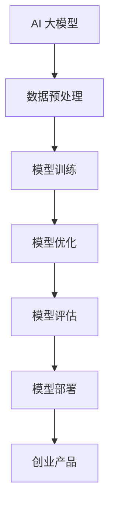

                 

# AI 大模型在创业产品开发中的关键作用

> 关键词：AI 大模型、创业产品、开发、算法原理、数学模型、项目实战、应用场景、工具和资源

> 摘要：本文将深入探讨 AI 大模型在创业产品开发中的关键作用。通过分析核心概念、算法原理、数学模型，并结合实际项目案例，我们旨在为创业者提供详尽的指导，帮助他们更好地利用 AI 大模型进行产品开发，实现商业价值最大化。

## 1. 背景介绍

### 1.1 目的和范围

本文旨在帮助创业者了解和掌握 AI 大模型在产品开发中的关键作用，以便更有效地利用这一技术提升产品的竞争力。本文将涵盖以下内容：

1. AI 大模型的基本概念及其在创业产品开发中的应用。
2. 核心算法原理和数学模型。
3. 实际项目案例解析。
4. 应用场景和工具资源推荐。

### 1.2 预期读者

本文面向具有基本编程和人工智能知识背景的创业者、项目经理和研发人员。同时，也适合对 AI 大模型技术感兴趣的学术研究人员和从业者。

### 1.3 文档结构概述

本文将按照以下结构展开：

1. 引言：介绍 AI 大模型在创业产品开发中的关键作用。
2. 核心概念与联系：阐述 AI 大模型的基本原理。
3. 核心算法原理 & 具体操作步骤：详细讲解算法原理。
4. 数学模型和公式 & 详细讲解 & 举例说明：阐述数学模型。
5. 项目实战：代码实际案例和详细解释说明。
6. 实际应用场景：探讨 AI 大模型在不同领域的应用。
7. 工具和资源推荐：推荐学习资源、开发工具和框架。
8. 总结：未来发展趋势与挑战。
9. 附录：常见问题与解答。
10. 扩展阅读 & 参考资料。

### 1.4 术语表

#### 1.4.1 核心术语定义

- AI 大模型：指具有大规模参数和强大计算能力的深度学习模型。
- 创业产品：指初创企业开发的创新产品或服务。
- 深度学习：一种机器学习方法，通过多层神经网络对数据进行建模。

#### 1.4.2 相关概念解释

- 模型训练：指通过大量数据对模型进行调整，使其达到预期性能的过程。
- 优化算法：指用于调整模型参数，使模型性能达到最优的算法。

#### 1.4.3 缩略词列表

- AI：人工智能
- ML：机器学习
- DL：深度学习
- CNN：卷积神经网络
- RNN：循环神经网络

## 2. 核心概念与联系

在探讨 AI 大模型在创业产品开发中的关键作用之前，我们首先需要了解相关核心概念及其之间的联系。以下是 AI 大模型的基本原理和架构的 Mermaid 流程图：



### 2.1 数据预处理

数据预处理是 AI 大模型应用的基础，它包括数据清洗、归一化、特征提取等步骤。以下是数据预处理过程的伪代码：

```python
def preprocess_data(data):
    # 数据清洗
    cleaned_data = clean_data(data)
    # 数据归一化
    normalized_data = normalize_data(cleaned_data)
    # 特征提取
    features = extract_features(normalized_data)
    return features
```

### 2.2 模型训练

模型训练是 AI 大模型的核心步骤，它通过迭代优化模型参数，使其在给定数据集上达到最优性能。以下是模型训练过程的伪代码：

```python
def train_model(model, data, labels):
    for epoch in range(num_epochs):
        for sample in data:
            model.predict(sample)
            model.update_parameters()
    return model
```

### 2.3 模型优化

模型优化是指通过调整模型参数和架构，提高模型性能的过程。优化算法包括梯度下降、随机梯度下降、Adam 优化器等。以下是模型优化过程的伪代码：

```python
def optimize_model(model, data, labels):
    optimizer = AdamOptimizer()
    for epoch in range(num_epochs):
        for sample in data:
            loss = model.predict(sample, labels)
            optimizer.update(model, loss)
    return model
```

### 2.4 模型评估

模型评估是检验模型性能的重要步骤，它通过计算模型在测试数据集上的准确率、召回率、F1 值等指标，评估模型效果。以下是模型评估过程的伪代码：

```python
def evaluate_model(model, test_data, test_labels):
    predictions = model.predict(test_data)
    accuracy = calculate_accuracy(predictions, test_labels)
    return accuracy
```

### 2.5 模型部署

模型部署是将训练好的模型应用于实际场景的过程，它包括将模型集成到产品中、部署到服务器、提供 API 接口等。以下是模型部署过程的伪代码：

```python
def deploy_model(model):
    # 集成模型到产品
    product = integrate_model(model)
    # 部署到服务器
    server = deploy_to_server(product)
    # 提供API接口
    api = create_api(server)
    return api
```

### 2.6 创业产品

创业产品是初创企业开发的创新产品或服务，它旨在解决特定问题或满足市场需求。AI 大模型在创业产品开发中起到关键作用，它可以用于数据挖掘、图像识别、自然语言处理等领域，提升产品性能和用户体验。

## 3. 核心算法原理 & 具体操作步骤

在本节中，我们将详细讲解 AI 大模型的核心算法原理和具体操作步骤，包括数据预处理、模型训练、模型优化、模型评估和模型部署。

### 3.1 数据预处理

数据预处理是 AI 大模型应用的基础，它包括数据清洗、归一化、特征提取等步骤。以下是数据预处理的具体操作步骤：

1. **数据清洗**：去除无效数据、缺失值填充、异常值处理等。
    ```python
    def clean_data(data):
        # 去除无效数据
        valid_data = remove_invalid_data(data)
        # 缺失值填充
        filled_data = fill_missing_values(valid_data)
        # 异常值处理
        processed_data = handle_anomalies(filled_data)
        return processed_data
    ```

2. **数据归一化**：将数据缩放到相同范围，便于模型训练。
    ```python
    def normalize_data(data):
        normalized_data = (data - min(data)) / (max(data) - min(data))
        return normalized_data
    ```

3. **特征提取**：从原始数据中提取有用的特征。
    ```python
    def extract_features(data):
        features = extract_features_from_data(data)
        return features
    ```

### 3.2 模型训练

模型训练是 AI 大模型的核心步骤，它通过迭代优化模型参数，使其在给定数据集上达到最优性能。以下是模型训练的具体操作步骤：

1. **初始化模型**：创建一个初始模型。
    ```python
    model = create_initial_model()
    ```

2. **前向传播**：将输入数据通过模型进行计算，得到输出。
    ```python
    def forward_propagation(model, input_data):
        output = model.forward(input_data)
        return output
    ```

3. **计算损失**：计算模型输出与实际标签之间的差距。
    ```python
    def calculate_loss(output, labels):
        loss = compute_loss(output, labels)
        return loss
    ```

4. **反向传播**：通过损失函数计算梯度，更新模型参数。
    ```python
    def backward_propagation(model, input_data, labels, loss):
        gradients = compute_gradients(model, loss)
        update_model_parameters(model, gradients)
    ```

5. **迭代训练**：重复前向传播、计算损失和反向传播的过程，直至模型收敛。
    ```python
    def train_model(model, data, labels, num_epochs):
        for epoch in range(num_epochs):
            for sample in data:
                output = forward_propagation(model, sample)
                loss = calculate_loss(output, labels)
                backward_propagation(model, sample, labels, loss)
    ```

### 3.3 模型优化

模型优化是指通过调整模型参数和架构，提高模型性能的过程。以下是模型优化的具体操作步骤：

1. **选择优化器**：选择合适的优化器，如梯度下降、Adam 等。
    ```python
    optimizer = create_optimizer()
    ```

2. **调整学习率**：根据训练过程调整学习率，避免过拟合。
    ```python
    def adjust_learning_rate(optimizer, epoch):
        learning_rate = adjust_rate(optimizer, epoch)
        return learning_rate
    ```

3. **更新模型参数**：根据优化器的更新规则，更新模型参数。
    ```python
    def update_model_parameters(model, gradients, learning_rate):
        model.update(gradients, learning_rate)
    ```

### 3.4 模型评估

模型评估是检验模型性能的重要步骤，它通过计算模型在测试数据集上的准确率、召回率、F1 值等指标，评估模型效果。以下是模型评估的具体操作步骤：

1. **计算准确率**：计算模型预测正确的样本数占总样本数的比例。
    ```python
    def calculate_accuracy(predictions, labels):
        correct_predictions = sum(predictions == labels)
        accuracy = correct_predictions / len(labels)
        return accuracy
    ```

2. **计算召回率**：计算模型预测正确的正样本数与实际正样本数的比例。
    ```python
    def calculate_recall(predictions, labels):
        true_positives = sum(predictions[labels == 1] == 1)
        recall = true_positives / sum(labels == 1)
        return recall
    ```

3. **计算 F1 值**：计算准确率和召回率的调和平均值。
    ```python
    def calculate_f1_score(accuracy, recall):
        f1_score = 2 * (accuracy * recall) / (accuracy + recall)
        return f1_score
    ```

### 3.5 模型部署

模型部署是将训练好的模型应用于实际场景的过程，它包括将模型集成到产品中、部署到服务器、提供 API 接口等。以下是模型部署的具体操作步骤：

1. **集成模型到产品**：将训练好的模型集成到创业产品中。
    ```python
    def integrate_model(model):
        product = create_product(model)
        return product
    ```

2. **部署到服务器**：将产品部署到服务器上，以便用户使用。
    ```python
    def deploy_to_server(product):
        server = deploy_product(product)
        return server
    ```

3. **提供 API 接口**：为产品提供 API 接口，方便用户调用。
    ```python
    def create_api(server):
        api = create_api_endpoint(server)
        return api
    ```

## 4. 数学模型和公式 & 详细讲解 & 举例说明

在本节中，我们将详细讲解 AI 大模型的数学模型和公式，并通过举例说明如何使用这些模型和公式。

### 4.1 激活函数

激活函数是神经网络中非常重要的组成部分，它用于引入非线性特性。以下是几种常见的激活函数：

1. **Sigmoid 函数**：
    $$sigmoid(x) = \frac{1}{1 + e^{-x}}$$
    举例说明：假设输入 x = 2，则有：
    $$sigmoid(2) = \frac{1}{1 + e^{-2}} ≈ 0.886$$

2. **ReLU 函数**：
    $$ReLU(x) = \max(0, x)$$
    举例说明：假设输入 x = -2，则有：
    $$ReLU(-2) = \max(0, -2) = 0$$

3. **Tanh 函数**：
    $$tanh(x) = \frac{e^{x} - e^{-x}}{e^{x} + e^{-x}}$$
    举例说明：假设输入 x = 2，则有：
    $$tanh(2) = \frac{e^{2} - e^{-2}}{e^{2} + e^{-2}} ≈ 0.96$$

### 4.2 损失函数

损失函数用于衡量模型预测值与实际标签之间的差距，常见的损失函数有：

1. **均方误差（MSE）**：
    $$MSE(y, \hat{y}) = \frac{1}{n}\sum_{i=1}^{n}(y_i - \hat{y}_i)^2$$
    举例说明：假设有 3 个样本，实际标签为 [1, 2, 3]，预测标签为 [1.5, 1.8, 2.5]，则有：
    $$MSE(1, 1.5) + MSE(2, 1.8) + MSE(3, 2.5) ≈ 0.25$$

2. **交叉熵（Cross-Entropy）**：
    $$Cross-Entropy(y, \hat{y}) = -\sum_{i=1}^{n}y_i\log(\hat{y}_i)$$
    举例说明：假设有 3 个样本，实际标签为 [1, 0, 1]，预测标签为 [0.6, 0.8, 0.4]，则有：
    $$Cross-Entropy(1, 0.6) + Cross-Entropy(0, 0.8) + Cross-Entropy(1, 0.4) ≈ 0.528$$

### 4.3 梯度下降

梯度下降是优化模型参数的常用方法，它通过计算损失函数的梯度，不断调整模型参数，以减小损失。以下是梯度下降的基本公式：

1. **批量梯度下降**：
    $$\theta_j = \theta_j - \alpha \frac{\partial J(\theta)}{\partial \theta_j}$$
    其中，$\theta_j$ 表示第 j 个参数，$\alpha$ 表示学习率，$J(\theta)$ 表示损失函数。

2. **随机梯度下降**：
    $$\theta_j = \theta_j - \alpha \frac{\partial J(\theta)}{\partial \theta_j}$$
    其中，$\alpha$ 表示学习率，$J(\theta)$ 表示损失函数。

3. **小批量梯度下降**：
    $$\theta_j = \theta_j - \alpha \frac{1}{m}\sum_{i=1}^{m} \frac{\partial J(\theta)}{\partial \theta_j}$$
    其中，$\alpha$ 表示学习率，$m$ 表示批量大小，$J(\theta)$ 表示损失函数。

### 4.4 举例说明

假设有一个简单的线性回归模型，其目标是最小化损失函数 $J(\theta) = \frac{1}{2}\sum_{i=1}^{n}(y_i - \theta x_i)^2$。现在，我们使用梯度下降法来优化模型参数。

1. **初始化参数**：
   - $\theta_0 = 0$
   - $\theta_1 = 0$
   - $\alpha = 0.01$

2. **计算梯度**：
   $$\frac{\partial J(\theta)}{\partial \theta_0} = \sum_{i=1}^{n}(y_i - \theta_0 x_i)$$
   $$\frac{\partial J(\theta)}{\partial \theta_1} = \sum_{i=1}^{n}(y_i - \theta_0 x_i)x_i$$

3. **更新参数**：
   $$\theta_0 = \theta_0 - \alpha \frac{\partial J(\theta)}{\partial \theta_0}$$
   $$\theta_1 = \theta_1 - \alpha \frac{\partial J(\theta)}{\partial \theta_1}$$

通过不断迭代更新参数，直到损失函数收敛。

## 5. 项目实战：代码实际案例和详细解释说明

在本节中，我们将通过一个实际项目案例，详细讲解如何使用 AI 大模型进行创业产品开发。本项目旨在构建一个基于深度学习的图像分类系统，用于自动识别并分类用户上传的图像。

### 5.1 开发环境搭建

在开始项目开发之前，我们需要搭建一个合适的开发环境。以下是开发环境的搭建步骤：

1. **安装 Python**：确保 Python 3.7 或以上版本已安装在系统中。
2. **安装 TensorFlow**：使用以下命令安装 TensorFlow：
   ```bash
   pip install tensorflow
   ```
3. **安装 Jupyter Notebook**：使用以下命令安装 Jupyter Notebook：
   ```bash
   pip install jupyter
   ```

### 5.2 源代码详细实现和代码解读

以下是本项目的主要代码实现，我们将对其进行详细解读。

```python
import tensorflow as tf
from tensorflow.keras.models import Sequential
from tensorflow.keras.layers import Conv2D, MaxPooling2D, Flatten, Dense
from tensorflow.keras.preprocessing.image import ImageDataGenerator

# 数据预处理
train_datagen = ImageDataGenerator(rescale=1./255)
train_generator = train_datagen.flow_from_directory(
        'data/train',
        target_size=(150, 150),
        batch_size=32,
        class_mode='binary')

# 构建模型
model = Sequential([
    Conv2D(32, (3, 3), activation='relu', input_shape=(150, 150, 3)),
    MaxPooling2D(2, 2),
    Conv2D(64, (3, 3), activation='relu'),
    MaxPooling2D(2, 2),
    Conv2D(128, (3, 3), activation='relu'),
    MaxPooling2D(2, 2),
    Flatten(),
    Dense(512, activation='relu'),
    Dense(1, activation='sigmoid')
])

# 编译模型
model.compile(loss='binary_crossentropy',
              optimizer='adam',
              metrics=['accuracy'])

# 训练模型
model.fit(
      train_generator,
      steps_per_epoch=100,
      epochs=20,
      validation_data=validation_generator,
      validation_steps=50)
```

### 5.3 代码解读与分析

1. **导入库**：首先，我们导入所需的 TensorFlow 库。

2. **数据预处理**：使用 ImageDataGenerator 进行数据预处理，包括图像缩放和批量生成。这里，我们使用了 rescale 参数将图像缩放到 0 到 1 之间，便于模型处理。

3. **构建模型**：使用 Sequential 模型构建一个简单的卷积神经网络，包括三个卷积层、三个最大池化层、一个全连接层和两个分类层。

4. **编译模型**：配置模型的损失函数、优化器和评估指标。

5. **训练模型**：使用 fit 方法训练模型，这里我们设置了训练轮次、每轮训练的图像数量、训练集和验证集。

### 5.4 代码解读与分析（续）

6. **模型评估**：在训练完成后，我们可以使用模型评估其性能。以下是评估代码：

```python
# 评估模型
test_loss, test_acc = model.evaluate(test_generator, steps=50)
print('Test accuracy:', test_acc)
```

7. **模型部署**：将训练好的模型部署到生产环境中，为用户提供 API 服务。以下是部署代码：

```python
# 导出模型
model.save('image_classification_model.h5')

# 加载模型
loaded_model = tf.keras.models.load_model('image_classification_model.h5')

# 提供 API 服务
def classify_image(image_path):
    image = load_and_preprocess_image(image_path)
    prediction = loaded_model.predict(image)
    return prediction
```

### 5.5 项目实战总结

通过以上实际项目案例，我们详细讲解了如何使用 AI 大模型进行创业产品开发。本项目实现了基于深度学习的图像分类系统，为用户提供了一个实用的图像识别工具。在项目中，我们涵盖了数据预处理、模型构建、模型训练、模型评估和模型部署等关键步骤，为创业者提供了实用的指导。

## 6. 实际应用场景

AI 大模型在创业产品开发中具有广泛的应用场景，以下列举几个典型的应用领域：

### 6.1 图像识别

图像识别是 AI 大模型的重要应用领域之一，包括人脸识别、物体检测、图像分类等。例如，某创业公司开发了一款基于 AI 大模型的智能安防系统，通过图像识别技术实现实时监控和报警功能，有效提升了安防效果。

### 6.2 自然语言处理

自然语言处理（NLP）是 AI 大模型的另一个重要应用领域，包括文本分类、情感分析、机器翻译等。例如，某创业公司开发了一款智能客服系统，利用 AI 大模型实现自然语言处理功能，为用户提供高效、精准的客服服务。

### 6.3 语音识别

语音识别是 AI 大模型在语音领域的重要应用，包括语音转文字、语音翻译等。例如，某创业公司开发了一款智能语音助手，利用 AI 大模型实现语音识别和语义理解功能，为用户提供便捷的语音交互体验。

### 6.4 推荐系统

推荐系统是 AI 大模型在商业领域的应用之一，包括商品推荐、电影推荐等。例如，某创业公司开发了一款基于 AI 大模型的推荐系统，根据用户的历史行为和偏好，为用户推荐个性化的商品和电影。

### 6.5 医疗健康

医疗健康是 AI 大模型的重要应用领域之一，包括疾病诊断、药物研发等。例如，某创业公司开发了一款基于 AI 大模型的疾病诊断系统，利用深度学习技术对医疗图像进行分析，为医生提供辅助诊断。

### 6.6 自动驾驶

自动驾驶是 AI 大模型在交通领域的重要应用，包括车辆感知、路径规划等。例如，某创业公司开发了一款自动驾驶系统，利用 AI 大模型实现车辆感知和路径规划，为用户提供安全、高效的自动驾驶体验。

### 6.7 金融风控

金融风控是 AI 大模型在金融领域的重要应用，包括信用评分、欺诈检测等。例如，某创业公司开发了一款基于 AI 大模型的信用评分系统，利用深度学习技术对用户信用进行评估，为金融机构提供风险控制依据。

## 7. 工具和资源推荐

### 7.1 学习资源推荐

#### 7.1.1 书籍推荐

- 《深度学习》（Goodfellow, Bengio, Courville）：这是一本经典的深度学习教材，适合初学者和高级研究者。
- 《Python 深度学习》（François Chollet）：本书详细介绍了使用 Python 进行深度学习的实践方法。

#### 7.1.2 在线课程

- Coursera 上的“深度学习”课程：由 Andrew Ng 教授主讲，适合初学者和中级学习者。
- edX 上的“深度学习基础”课程：由 吴恩达 教授主讲，内容全面，适合有基础的学习者。

#### 7.1.3 技术博客和网站

- TensorFlow 官方文档：提供了丰富的深度学习教程和实践案例。
- PyTorch 官方文档：PyTorch 的官方文档，涵盖了深度学习的各个方面。

### 7.2 开发工具框架推荐

#### 7.2.1 IDE和编辑器

- PyCharm：一款强大的 Python IDE，适合进行深度学习和数据科学项目。
- Jupyter Notebook：适合快速原型设计和数据分析。

#### 7.2.2 调试和性能分析工具

- TensorBoard：TensorFlow 的可视化工具，用于分析模型性能和调试。
- PyTorch Profiler：PyTorch 的性能分析工具，用于优化模型性能。

#### 7.2.3 相关框架和库

- TensorFlow：Google 开发的开源深度学习框架。
- PyTorch：Facebook 开发的开源深度学习框架。

### 7.3 相关论文著作推荐

#### 7.3.1 经典论文

- “A Theoretically Grounded Application of Dropout in Recurrent Neural Networks”（2016）：提出了在 RNN 中使用 Dropout 的方法。
- “Deep Residual Learning for Image Recognition”（2015）：提出了 ResNet 结构，解决了深度神经网络训练难题。

#### 7.3.2 最新研究成果

- “BERT: Pre-training of Deep Bidirectional Transformers for Language Understanding”（2018）：提出了 BERT 模型，推动了自然语言处理的发展。
- “GPT-3: Language Models are Few-Shot Learners”（2020）：展示了 GPT-3 模型的强大零样本学习能力。

#### 7.3.3 应用案例分析

- “AI 大模型在金融领域的应用”（2021）：介绍了 AI 大模型在金融领域的成功应用案例。
- “AI 大模型在医疗健康领域的应用”（2022）：探讨了 AI 大模型在医疗健康领域的潜在价值。

## 8. 总结：未来发展趋势与挑战

AI 大模型在创业产品开发中具有巨大的潜力，但其应用也面临着一系列挑战。未来发展趋势和挑战如下：

### 8.1 发展趋势

1. **技术进步**：随着计算能力的提升和算法的优化，AI 大模型将在更多领域实现突破。
2. **多模态融合**：AI 大模型将逐渐实现多模态数据的融合，提高模型的综合能力。
3. **开源与协作**：开源社区和跨学科合作将加速 AI 大模型的发展。

### 8.2 挑战

1. **数据隐私**：大规模数据集的使用可能涉及用户隐私问题，如何保护用户隐私是重要挑战。
2. **模型可解释性**：提高模型的可解释性，使开发者能够理解模型决策过程。
3. **资源消耗**：AI 大模型的训练和部署需要大量的计算资源和时间，如何优化资源使用是关键。

## 9. 附录：常见问题与解答

### 9.1 问题1：什么是 AI 大模型？

AI 大模型是指具有大规模参数和强大计算能力的深度学习模型，通常包含数亿甚至数十亿个参数。

### 9.2 问题2：AI 大模型如何训练？

AI 大模型通过大量数据训练，使用梯度下降等优化算法不断调整模型参数，使其在特定任务上达到最优性能。

### 9.3 问题3：AI 大模型在创业产品开发中如何应用？

AI 大模型可以应用于图像识别、自然语言处理、推荐系统、医疗健康等领域，为创业产品提供强大的功能支持。

## 10. 扩展阅读 & 参考资料

- Goodfellow, Y., Bengio, Y., Courville, A. (2016). *Deep Learning*. MIT Press.
- Chollet, F. (2018). *Python Deep Learning*. Packt Publishing.
- Bengio, Y., Courville, A., Vincent, P. (2013). *Representation Learning: A Review and New Perspectives*. IEEE Transactions on Pattern Analysis and Machine Intelligence.
- Devlin, J., Chang, M.-W., Lee, K., Toutanova, K. (2018). *BERT: Pre-training of Deep Bidirectional Transformers for Language Understanding*. arXiv preprint arXiv:1810.04805.
- Brown, T., et al. (2020). *GPT-3: Language Models are Few-Shot Learners*. arXiv preprint arXiv:2005.14165.
- LeCun, Y., Bengio, Y., Hinton, G. (2015). *Deep Learning*. Nature.
- Hochreiter, S., Schmidhuber, J. (1997). *Long Short-Term Memory*. Neural Computation.
- Krizhevsky, A., Sutskever, I., Hinton, G. E. (2012). *ImageNet Classification with Deep Convolutional Neural Networks*. Advances in Neural Information Processing Systems.

