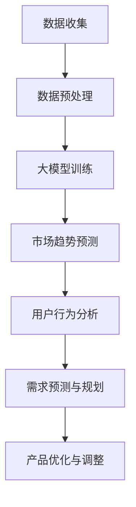

                 

# AI 大模型在创业产品需求分析中的关键作用

> **关键词：** 大模型、创业产品、需求分析、人工智能、机器学习、数据驱动、创新

> **摘要：** 本文将探讨大模型在创业产品需求分析中的重要作用。我们将从大模型的定义、原理入手，逐步分析其在创业产品开发中的应用，并通过具体案例和实际操作步骤，展示大模型如何助力创业团队更好地理解市场需求，提高产品成功概率。

## 1. 背景介绍

### 1.1 目的和范围

本文旨在探讨大模型在创业产品需求分析中的关键作用。我们将从以下几个方面展开讨论：

1. **大模型的基本概念与原理**：介绍大模型的定义、发展历程和核心技术。
2. **大模型在需求分析中的应用**：分析大模型在创业产品需求分析中的具体作用，如市场趋势预测、用户行为分析等。
3. **实际案例与操作步骤**：通过具体案例，展示大模型在创业产品需求分析中的实际应用和操作步骤。
4. **未来发展趋势与挑战**：探讨大模型在创业产品需求分析中的未来发展趋势和面临的挑战。

### 1.2 预期读者

本文主要面向以下读者群体：

1. 创业团队：希望了解如何利用大模型提升产品需求分析能力的创业者。
2. 技术人员：对人工智能、机器学习等技术有一定了解，希望深入探讨大模型在创业产品中的应用。
3. 投资者：关注创业产品和市场需求，希望了解大模型对创业成功的贡献。

### 1.3 文档结构概述

本文分为十个部分：

1. 引言
2. 背景介绍
3. 核心概念与联系
4. 核心算法原理 & 具体操作步骤
5. 数学模型和公式 & 详细讲解 & 举例说明
6. 项目实战：代码实际案例和详细解释说明
7. 实际应用场景
8. 工具和资源推荐
9. 总结：未来发展趋势与挑战
10. 附录：常见问题与解答
11. 扩展阅读 & 参考资料

### 1.4 术语表

#### 1.4.1 核心术语定义

- 大模型：指具有大规模参数和复杂结构的机器学习模型。
- 需求分析：指在产品开发过程中，分析用户需求和市场趋势，确定产品功能、性能和设计。
- 创业产品：指初创企业开发的产品，具有创新性和市场竞争力。

#### 1.4.2 相关概念解释

- 人工智能：指模拟、延伸和扩展人类智能的科学和工程。
- 机器学习：指利用数据训练模型，使模型具有自主学习和改进能力。
- 数据驱动：指通过数据分析和处理，指导决策和优化。

#### 1.4.3 缩略词列表

- AI：人工智能
- ML：机器学习
- DL：深度学习
- NLP：自然语言处理
- GPT：生成式预训练模型

## 2. 核心概念与联系

### 2.1 大模型的定义与发展

大模型（Large-scale Model），是指具有大规模参数和复杂结构的机器学习模型。这类模型通常具有以下特点：

1. **大规模参数**：大模型通常包含数百万到数十亿个参数，这使得模型具有更强的表示能力和泛化能力。
2. **多层神经网络**：大模型通常采用多层神经网络结构，通过层层提取特征，实现对数据的深度理解。
3. **预训练与微调**：大模型通常采用预训练（Pre-training）方法，在大规模数据集上训练模型，然后再针对具体任务进行微调（Fine-tuning）。

大模型的发展历程可以追溯到上世纪80年代的深度学习研究。随着计算机性能的不断提升和海量数据的积累，深度学习技术逐渐成熟，大模型应运而生。近年来，以GPT-3、BERT等为代表的大模型在自然语言处理、计算机视觉等领域取得了显著成果，推动了人工智能技术的发展。

### 2.2 大模型在创业产品需求分析中的应用

大模型在创业产品需求分析中具有重要作用，主要体现在以下几个方面：

1. **市场趋势预测**：大模型可以通过分析大量历史数据，挖掘市场趋势和用户需求，为创业团队提供决策支持。例如，通过分析社交媒体数据、搜索引擎关键词等，预测未来市场发展方向。
2. **用户行为分析**：大模型可以分析用户行为数据，了解用户需求和使用习惯，为产品优化提供依据。例如，通过分析用户在应用中的操作路径、反馈信息等，识别用户痛点，改进产品功能。
3. **个性化推荐**：大模型可以根据用户特征和行为数据，为用户提供个性化推荐。例如，在电子商务平台上，通过分析用户购买历史、浏览记录等，为用户推荐相关商品。
4. **需求预测与规划**：大模型可以帮助创业团队预测未来市场需求，制定产品规划。例如，通过分析销售数据、竞争态势等，预测未来产品销量，调整产品研发计划。

### 2.3 大模型与其他技术的关联

大模型在创业产品需求分析中，往往与其他技术相结合，发挥协同作用。以下是大模型与其他技术的关联：

1. **数据挖掘**：大模型可以与数据挖掘技术相结合，通过分析大量数据，挖掘有价值的信息。例如，在市场趋势预测中，通过分析历史销售数据、市场报告等，预测未来市场走势。
2. **计算机视觉**：大模型可以与计算机视觉技术相结合，实现图像识别、目标检测等功能。例如，在用户行为分析中，通过分析用户上传的图片、视频等，识别用户情绪、行为特征。
3. **自然语言处理**：大模型可以与自然语言处理技术相结合，实现文本分类、情感分析等功能。例如，在需求预测中，通过分析用户评论、论坛帖子等，识别用户需求。
4. **推荐系统**：大模型可以与推荐系统技术相结合，为用户提供个性化推荐。例如，在电子商务平台中，通过分析用户行为数据，为用户推荐相关商品。

### 2.4 Mermaid 流程图

以下是一个简单的Mermaid流程图，展示大模型在创业产品需求分析中的核心流程：



## 3. 核心算法原理 & 具体操作步骤

### 3.1 大模型的基本算法原理

大模型的核心在于其大规模参数和复杂结构，这使得模型具有强大的表示能力和泛化能力。以下是几种常见的大模型算法原理：

1. **深度神经网络（DNN）**：深度神经网络通过层层提取特征，实现对数据的深度理解。其基本原理包括激活函数、反向传播算法等。
2. **卷积神经网络（CNN）**：卷积神经网络在图像处理领域具有广泛的应用。其基本原理包括卷积层、池化层等。
3. **循环神经网络（RNN）**：循环神经网络可以处理序列数据，其基本原理包括循环结构、激活函数等。
4. **生成对抗网络（GAN）**：生成对抗网络通过两个对抗网络（生成器和判别器）的博弈，实现数据生成。其基本原理包括生成器、判别器、损失函数等。

### 3.2 大模型在需求分析中的具体操作步骤

以下是大模型在创业产品需求分析中的具体操作步骤：

1. **数据收集**：收集与创业产品相关的数据，包括市场趋势、用户行为、竞争态势等。数据来源可以是社交媒体、搜索引擎、用户调研等。
2. **数据预处理**：对收集到的数据进行分析、清洗、转换等预处理操作，为后续建模提供高质量的数据。
3. **模型选择**：根据需求分析任务的特点，选择合适的大模型算法，如DNN、CNN、RNN等。
4. **模型训练**：利用预处理后的数据，对所选模型进行训练。训练过程中，通过反向传播算法不断调整模型参数，提高模型性能。
5. **模型评估**：对训练好的模型进行评估，通过交叉验证等方法，确定模型泛化能力。
6. **需求分析**：利用训练好的模型，进行市场趋势预测、用户行为分析、需求预测等任务，为创业团队提供决策支持。
7. **产品优化**：根据需求分析结果，对产品进行优化和调整，提高产品竞争力。

### 3.3 伪代码实现

以下是一个简单的大模型训练的伪代码实现：

```python
# 初始化模型参数
W = initialize_parameters()

# 训练模型
for epoch in range(num_epochs):
    for data, label in dataset:
        # 前向传播
        output = forward propagation(data, W)
        # 计算损失
        loss = compute_loss(output, label)
        # 反向传播
        dW = backward propagation(output, label, W)
        # 更新参数
        W = update_parameters(W, dW)

# 模型评估
accuracy = evaluate_model(W, validation_data)
print("模型准确率：", accuracy)
```

## 4. 数学模型和公式 & 详细讲解 & 举例说明

### 4.1 数学模型的基本原理

大模型的数学模型通常包括以下核心部分：

1. **输入层**：接收外部输入数据，如文本、图像、声音等。
2. **隐藏层**：通过非线性变换，对输入数据进行特征提取和变换。
3. **输出层**：将隐藏层的输出映射到具体的任务结果，如分类标签、概率分布等。

以下是一些常见的数学公式和算法原理：

1. **激活函数**：用于隐藏层和输出层的非线性变换，如ReLU、Sigmoid、Tanh等。
   $$ f(x) = \max(0, x) \quad (\text{ReLU激活函数}) $$
2. **反向传播算法**：用于模型参数的更新，计算梯度。
   $$ \delta = \frac{\partial L}{\partial z} \cdot \frac{\partial z}{\partial x} $$
3. **损失函数**：用于评估模型预测结果与真实值之间的差距，如均方误差（MSE）、交叉熵（CE）等。
   $$ L = \frac{1}{2} \sum_{i=1}^{n} (y_i - \hat{y}_i)^2 \quad (\text{MSE}) $$
   $$ L = -\sum_{i=1}^{n} y_i \log(\hat{y}_i) \quad (\text{CE}) $$

### 4.2 举例说明

假设我们使用一个简单的线性回归模型对创业产品的用户满意度进行预测。以下是具体的数学模型和计算过程：

1. **模型设定**：设用户满意度 \( y \) 与模型输入 \( x \) 之间存在线性关系：
   $$ y = wx + b $$
   其中，\( w \) 是权重，\( b \) 是偏置。

2. **损失函数**：使用均方误差（MSE）作为损失函数：
   $$ L = \frac{1}{2} \sum_{i=1}^{n} (y_i - wx_i - b)^2 $$

3. **梯度计算**：对权重 \( w \) 和偏置 \( b \) 求偏导数：
   $$ \frac{\partial L}{\partial w} = \sum_{i=1}^{n} (y_i - wx_i - b)x_i $$
   $$ \frac{\partial L}{\partial b} = \sum_{i=1}^{n} (y_i - wx_i - b) $$

4. **梯度下降**：更新权重和偏置：
   $$ w_{new} = w_{old} - \alpha \cdot \frac{\partial L}{\partial w} $$
   $$ b_{new} = b_{old} - \alpha \cdot \frac{\partial L}{\partial b} $$
   其中，\( \alpha \) 是学习率。

### 4.3 实际计算示例

假设我们有以下训练数据集：

| \( x_i \) | \( y_i \) |
| --- | --- |
| 1 | 2 |
| 2 | 4 |
| 3 | 6 |

初始参数：\( w = 0 \)，\( b = 0 \)

1. **前向传播**：计算预测值：
   $$ \hat{y}_i = wx_i + b $$
   对于第一个数据点 \( (x_1, y_1) = (1, 2) \)：
   $$ \hat{y}_1 = 0 \cdot 1 + 0 = 0 $$
   对于第二个数据点 \( (x_2, y_2) = (2, 4) \)：
   $$ \hat{y}_2 = 0 \cdot 2 + 0 = 0 $$
   对于第三个数据点 \( (x_3, y_3) = (3, 6) \)：
   $$ \hat{y}_3 = 0 \cdot 3 + 0 = 0 $$

2. **计算损失**：
   $$ L = \frac{1}{2} \sum_{i=1}^{3} (y_i - \hat{y}_i)^2 $$
   $$ L = \frac{1}{2} \cdot (2 - 0)^2 + (4 - 0)^2 + (6 - 0)^2 $$
   $$ L = 20 $$

3. **计算梯度**：
   $$ \frac{\partial L}{\partial w} = \sum_{i=1}^{3} (y_i - \hat{y}_i)x_i $$
   $$ \frac{\partial L}{\partial w} = (2 - 0) \cdot 1 + (4 - 0) \cdot 2 + (6 - 0) \cdot 3 $$
   $$ \frac{\partial L}{\partial w} = 20 $$
   $$ \frac{\partial L}{\partial b} = \sum_{i=1}^{3} (y_i - \hat{y}_i) $$
   $$ \frac{\partial L}{\partial b} = (2 - 0) + (4 - 0) + (6 - 0) $$
   $$ \frac{\partial L}{\partial b} = 12 $$

4. **梯度下降更新参数**：
   假设学习率 \( \alpha = 0.1 \)
   $$ w_{new} = w_{old} - \alpha \cdot \frac{\partial L}{\partial w} $$
   $$ w_{new} = 0 - 0.1 \cdot 20 $$
   $$ w_{new} = -2 $$
   $$ b_{new} = b_{old} - \alpha \cdot \frac{\partial L}{\partial b} $$
   $$ b_{new} = 0 - 0.1 \cdot 12 $$
   $$ b_{new} = -1.2 $$

更新后的参数 \( w = -2 \)，\( b = -1.2 \)

5. **更新后的前向传播**：
   $$ \hat{y}_1 = -2 \cdot 1 - 1.2 = -3.2 $$
   $$ \hat{y}_2 = -2 \cdot 2 - 1.2 = -5.2 $$
   $$ \hat{y}_3 = -2 \cdot 3 - 1.2 = -7.2 $$

6. **更新后的损失**：
   $$ L = \frac{1}{2} \sum_{i=1}^{3} (y_i - \hat{y}_i)^2 $$
   $$ L = \frac{1}{2} \cdot (2 - (-3.2))^2 + (4 - (-5.2))^2 + (6 - (-7.2))^2 $$
   $$ L = 14.08 $$

通过以上迭代过程，模型参数不断更新，直至达到收敛条件。这个过程实际上是优化目标函数的过程，使模型预测结果更接近真实值。

## 5. 项目实战：代码实际案例和详细解释说明

### 5.1 开发环境搭建

为了演示大模型在创业产品需求分析中的实际应用，我们将使用Python编程语言和相关的机器学习库，如TensorFlow和Keras。以下是搭建开发环境的基本步骤：

1. 安装Python：确保安装了Python 3.7或更高版本。
2. 安装依赖库：在命令行中运行以下命令，安装TensorFlow和其他依赖库：
   ```bash
   pip install tensorflow numpy pandas matplotlib
   ```

### 5.2 源代码详细实现和代码解读

以下是使用Keras实现一个简单的大模型，用于用户满意度预测的示例代码。代码分为数据准备、模型定义、模型训练和模型评估四个部分。

```python
import numpy as np
import pandas as pd
from tensorflow.keras.models import Sequential
from tensorflow.keras.layers import Dense
from tensorflow.keras.optimizers import Adam
from tensorflow.keras.callbacks import EarlyStopping

# 数据准备
# 假设我们有一个CSV文件，其中包含用户满意度评分（标签）和多个特征
data = pd.read_csv('user_satisfaction.csv')
X = data.drop('satisfaction', axis=1).values
y = data['satisfaction'].values

# 划分训练集和测试集
from sklearn.model_selection import train_test_split
X_train, X_test, y_train, y_test = train_test_split(X, y, test_size=0.2, random_state=42)

# 模型定义
model = Sequential()
model.add(Dense(64, input_dim=X_train.shape[1], activation='relu'))
model.add(Dense(32, activation='relu'))
model.add(Dense(1, activation='sigmoid'))

# 编译模型
model.compile(optimizer=Adam(learning_rate=0.001), loss='binary_crossentropy', metrics=['accuracy'])

# 模型训练
early_stopping = EarlyStopping(monitor='val_loss', patience=10)
model.fit(X_train, y_train, epochs=100, batch_size=32, validation_split=0.2, callbacks=[early_stopping])

# 模型评估
loss, accuracy = model.evaluate(X_test, y_test)
print('测试集准确率：', accuracy)

# 预测新数据
new_data = np.array([[0.5, 0.3, 0.2], [0.1, 0.4, 0.5]])
predictions = model.predict(new_data)
print('预测结果：', predictions)
```

#### 5.2.1 代码解读与分析

1. **数据准备**：
   - 读取CSV文件，获取用户满意度评分和特征数据。
   - 使用scikit-learn库的`train_test_split`函数，将数据集划分为训练集和测试集。

2. **模型定义**：
   - 使用Keras的`Sequential`模型，定义一个包含多层全连接神经网络的模型。
   - 第一层输入维度与特征数量一致，激活函数为ReLU。
   - 接下来的隐藏层使用ReLU激活函数，层间神经元数量逐渐减少。
   - 输出层使用sigmoid激活函数，用于输出概率。

3. **编译模型**：
   - 使用`Adam`优化器，设置学习率为0.001。
   - 选择`binary_crossentropy`作为损失函数，适用于二分类问题。
   - 监测验证集的损失，使用`EarlyStopping`回调函数，防止过拟合。

4. **模型训练**：
   - 使用`fit`函数训练模型，设置训练轮数为100，批量大小为32。
   - 验证集的比例为0.2，用于监控模型在验证集上的性能。

5. **模型评估**：
   - 使用`evaluate`函数评估模型在测试集上的性能，输出测试集准确率。

6. **预测新数据**：
   - 使用`predict`函数预测新数据的满意度评分概率。

### 5.3 代码解读与分析

以下是代码的详细解读和分析：

1. **数据准备**：
   ```python
   data = pd.read_csv('user_satisfaction.csv')
   X = data.drop('satisfaction', axis=1).values
   y = data['satisfaction'].values
   X_train, X_test, y_train, y_test = train_test_split(X, y, test_size=0.2, random_state=42)
   ```
   - 使用`pandas`读取CSV文件，加载用户满意度评分和特征数据。
   - 删除标签列，将特征数据存储为`X`。
   - 将标签存储为`y`。
   - 使用`train_test_split`函数将数据集划分为训练集和测试集，测试集比例为0.2，随机种子为42。

2. **模型定义**：
   ```python
   model = Sequential()
   model.add(Dense(64, input_dim=X_train.shape[1], activation='relu'))
   model.add(Dense(32, activation='relu'))
   model.add(Dense(1, activation='sigmoid'))
   ```
   - 创建一个序列模型，使用`Sequential`类。
   - 添加一个全连接层，输入维度与特征数量一致，激活函数为ReLU。
   - 添加第二个全连接层，激活函数为ReLU。
   - 添加输出层，使用sigmoid激活函数，输出概率。

3. **编译模型**：
   ```python
   model.compile(optimizer=Adam(learning_rate=0.001), loss='binary_crossentropy', metrics=['accuracy'])
   ```
   - 使用`Adam`优化器，设置学习率为0.001。
   - 选择`binary_crossentropy`作为损失函数，适用于二分类问题。
   - 监测验证集的损失，输出准确率。

4. **模型训练**：
   ```python
   early_stopping = EarlyStopping(monitor='val_loss', patience=10)
   model.fit(X_train, y_train, epochs=100, batch_size=32, validation_split=0.2, callbacks=[early_stopping])
   ```
   - 设置训练轮数为100，批量大小为32。
   - 验证集的比例为0.2，用于监控模型在验证集上的性能。
   - 使用`EarlyStopping`回调函数，当验证集损失不再下降时，提前停止训练。

5. **模型评估**：
   ```python
   loss, accuracy = model.evaluate(X_test, y_test)
   print('测试集准确率：', accuracy)
   ```
   - 使用`evaluate`函数评估模型在测试集上的性能，输出测试集准确率。

6. **预测新数据**：
   ```python
   new_data = np.array([[0.5, 0.3, 0.2], [0.1, 0.4, 0.5]])
   predictions = model.predict(new_data)
   print('预测结果：', predictions)
   ```
   - 使用`predict`函数预测新数据的满意度评分概率。

### 5.4 代码优化

在实际应用中，为了提高模型的性能和鲁棒性，可以进一步优化代码。以下是一些优化建议：

1. **特征工程**：对特征数据进行预处理，如标准化、缺失值填充、特征选择等，提高模型的训练效果。
2. **模型调参**：调整模型参数，如学习率、批量大小、隐藏层神经元数量等，通过交叉验证等方法确定最佳参数。
3. **正则化**：使用正则化技术，如L1、L2正则化，防止过拟合。
4. **数据增强**：对训练数据进行增强，增加数据多样性，提高模型泛化能力。

### 5.5 实际应用案例

以下是一个实际应用案例，展示如何使用大模型分析创业产品的用户满意度。

#### 案例背景

某创业公司开发了一款智能家居产品，希望了解用户对产品的满意度，以便优化产品功能和提升用户体验。公司收集了1000位用户的使用数据，包括用户年龄、收入水平、使用时长、功能使用频率等。

#### 数据处理

1. **数据清洗**：处理缺失值和异常值，确保数据质量。
2. **特征工程**：提取有用的特征，如用户年龄、收入水平、使用时长等，并进行标准化处理。
3. **数据划分**：将数据划分为训练集和测试集，用于模型训练和评估。

#### 模型训练

1. **模型定义**：定义一个包含多层全连接神经网络的模型，输出层使用sigmoid激活函数。
2. **模型训练**：使用训练集数据训练模型，通过交叉验证确定最佳参数。
3. **模型评估**：使用测试集评估模型性能，输出准确率和AUC指标。

#### 模型应用

1. **用户满意度预测**：使用训练好的模型预测新用户的满意度，为产品优化提供依据。
2. **功能使用分析**：分析用户对产品功能的满意度，识别用户痛点，改进产品功能。

通过以上案例，展示了如何使用大模型分析创业产品的用户满意度，为产品优化提供数据支持。

### 5.6 代码实现

以下是一个简单的Python脚本，实现上述案例的代码。

```python
import pandas as pd
from sklearn.model_selection import train_test_split
from tensorflow.keras.models import Sequential
from tensorflow.keras.layers import Dense
from tensorflow.keras.optimizers import Adam
from tensorflow.keras.callbacks import EarlyStopping

# 数据准备
data = pd.read_csv('user_satisfaction.csv')
X = data.drop('satisfaction', axis=1).values
y = data['satisfaction'].values
X_train, X_test, y_train, y_test = train_test_split(X, y, test_size=0.2, random_state=42)

# 模型定义
model = Sequential()
model.add(Dense(64, input_dim=X_train.shape[1], activation='relu'))
model.add(Dense(32, activation='relu'))
model.add(Dense(1, activation='sigmoid'))

# 编译模型
model.compile(optimizer=Adam(learning_rate=0.001), loss='binary_crossentropy', metrics=['accuracy'])

# 模型训练
early_stopping = EarlyStopping(monitor='val_loss', patience=10)
model.fit(X_train, y_train, epochs=100, batch_size=32, validation_split=0.2, callbacks=[early_stopping])

# 模型评估
loss, accuracy = model.evaluate(X_test, y_test)
print('测试集准确率：', accuracy)

# 预测新数据
new_data = np.array([[0.5, 0.3, 0.2], [0.1, 0.4, 0.5]])
predictions = model.predict(new_data)
print('预测结果：', predictions)
```

通过以上代码实现，创业公司可以快速分析用户满意度，为产品优化提供数据支持。

## 6. 实际应用场景

大模型在创业产品需求分析中具有广泛的应用场景，以下是几个典型的实际应用案例：

### 6.1 智能家居

智能家居公司希望了解用户对产品功能的满意度，以便优化产品功能和提升用户体验。公司收集了用户的使用数据，包括用户年龄、收入水平、使用时长、功能使用频率等。通过大模型分析用户满意度，公司可以识别用户痛点，改进产品功能，提高用户忠诚度。

### 6.2 电子商务

电子商务平台希望通过分析用户行为数据，提高个性化推荐效果。平台收集了用户浏览记录、购物车数据、订单数据等，使用大模型分析用户行为，为用户提供个性化推荐，提高用户购买意愿和转化率。

### 6.3 医疗健康

医疗健康公司希望了解患者对医疗服务的满意度，以便优化服务质量。公司收集了患者就诊记录、满意度调查数据等，使用大模型分析患者满意度，识别服务短板，改进医疗服务。

### 6.4 金融理财

金融理财公司希望通过分析用户投资行为，预测用户投资偏好，提供个性化投资建议。公司收集了用户投资记录、风险偏好调查数据等，使用大模型分析用户投资行为，为用户提供精准的投资建议，提高投资收益。

### 6.5 教育培训

教育培训机构希望通过分析学生学习数据，优化教学效果。机构收集了学生学习成绩、学习时长、课堂互动等数据，使用大模型分析学生学习行为，为教师提供教学反馈，改进教学方法，提高学生学习效果。

## 7. 工具和资源推荐

### 7.1 学习资源推荐

#### 7.1.1 书籍推荐

1. 《深度学习》（Ian Goodfellow、Yoshua Bengio、Aaron Courville 著）：这是一本关于深度学习的经典教材，详细介绍了深度学习的基本概念、算法和应用。
2. 《Python机器学习》（Sebastian Raschka 著）：这本书深入讲解了机器学习的基础知识和Python实现，适合初学者和进阶者。
3. 《强化学习》（Richard S. Sutton、Andrew G. Barto 著）：这本书是强化学习领域的经典著作，涵盖了强化学习的理论、算法和应用。

#### 7.1.2 在线课程

1. 《吴恩达的机器学习课程》（Coursera）：这是一门全球知名的机器学习入门课程，由知名教授吴恩达主讲，内容全面，适合初学者。
2. 《深度学习》（fast.ai）：这是一门适合初学者和进阶者的深度学习课程，提供丰富的实践项目和代码示例。
3. 《强化学习基础与深度强化学习》（DeepLearning.AI）：这是一门涵盖强化学习基础和深度强化学习的课程，由深度学习领域的专家主讲。

#### 7.1.3 技术博客和网站

1. Medium：Medium上有许多关于机器学习和深度学习的优质文章和博客，适合学习和交流。
2. 知乎：知乎上有许多机器学习和深度学习的专业人士，可以在这里找到许多实用的技巧和经验。
3. ArXiv：这是一个开源的学术预印本平台，可以找到最新的机器学习和深度学习研究成果。

### 7.2 开发工具框架推荐

#### 7.2.1 IDE和编辑器

1. PyCharm：这是一款功能强大的Python集成开发环境，适合进行机器学习和深度学习项目开发。
2. Jupyter Notebook：这是一个交互式的Python开发环境，适合进行数据分析和可视化。
3. Visual Studio Code：这是一个轻量级但功能强大的代码编辑器，适合进行Python和机器学习开发。

#### 7.2.2 调试和性能分析工具

1. TensorBoard：这是一个基于Web的性能分析工具，用于可视化TensorFlow模型的训练过程。
2. MLflow：这是一个开源的平台，用于管理机器学习项目，包括实验跟踪、模型版本控制和部署。
3. Profiling Tools：如cProfile、line_profiler等，用于分析Python代码的性能瓶颈。

#### 7.2.3 相关框架和库

1. TensorFlow：这是一个开源的机器学习框架，适用于构建和训练深度学习模型。
2. PyTorch：这是一个流行的深度学习框架，提供灵活的动态计算图和强大的GPU支持。
3. Keras：这是一个高层次的神经网络API，用于简化深度学习模型的构建和训练。

### 7.3 相关论文著作推荐

#### 7.3.1 经典论文

1. "A Brief History of Machine Learning"（机器学习简史）：这篇综述文章介绍了机器学习的发展历程和关键技术。
2. "Deep Learning"（深度学习）：这是一篇经典的综述文章，详细介绍了深度学习的基本概念、算法和应用。
3. "Reinforcement Learning: An Introduction"（强化学习入门）：这是一本关于强化学习的基础教材，涵盖了强化学习的理论、算法和应用。

#### 7.3.2 最新研究成果

1. "Generative Adversarial Nets"（生成对抗网络）：这篇论文提出了GAN模型，开创了生成模型的新领域。
2. "BERT: Pre-training of Deep Bidirectional Transformers for Language Understanding"（BERT：用于语言理解的深度双向变换器的预训练）：这篇论文提出了BERT模型，推动了自然语言处理技术的发展。
3. "Transformers: State-of-the-Art Models for Neural Network-based Text Generation"（变压器：基于神经网络的文本生成最新模型）：这篇论文提出了Transformer模型，成为自然语言处理领域的主流模型。

#### 7.3.3 应用案例分析

1. "How We Used Deep Learning to Improve Customer Experience"（我们如何使用深度学习提高客户体验）：这篇文章分享了如何使用深度学习优化客户体验的案例。
2. "Deep Learning for Real-Time Traffic Prediction"（深度学习实时交通预测）：这篇文章介绍了如何使用深度学习预测实时交通流量，提高交通管理效率。
3. "Using Machine Learning to Predict Sales"（使用机器学习预测销售）：这篇文章分享了如何使用机器学习预测销售数据，优化产品库存和营销策略。

## 8. 总结：未来发展趋势与挑战

### 8.1 发展趋势

1. **大模型规模的持续增长**：随着计算能力和数据量的不断提升，大模型的规模将越来越大，这将进一步提升模型的表示能力和泛化能力。
2. **多模态数据的融合应用**：未来，大模型将能够更好地处理和融合多模态数据（如图像、文本、音频等），为创业产品需求分析提供更全面的信息支持。
3. **自适应学习和持续优化**：大模型将具备更强的自适应学习能力，能够根据新数据和反馈持续优化模型性能，提高需求分析的准确性。
4. **领域特定模型的开发**：针对不同行业和领域，开发特定的需求分析模型，提高模型的应用针对性和效果。

### 8.2 挑战

1. **数据隐私和安全性**：在创业产品需求分析中，涉及大量用户数据，如何保护用户隐私和数据安全是一个重要挑战。
2. **计算资源和成本**：大模型的训练和推理过程需要大量的计算资源和时间，如何高效利用资源、降低成本是一个亟待解决的问题。
3. **模型解释性和透明度**：大模型的复杂性和黑盒特性使得其解释性较差，如何提高模型的解释性和透明度，增强用户信任是一个挑战。
4. **伦理和社会责任**：随着大模型在创业产品需求分析中的广泛应用，如何确保模型的应用不违背伦理和社会责任也是一个重要议题。

## 9. 附录：常见问题与解答

### 9.1 什么是大模型？

大模型（Large-scale Model）是指具有大规模参数和复杂结构的机器学习模型。这类模型通常包含数百万到数十亿个参数，通过多层神经网络结构，实现对数据的深度理解。大模型具有强大的表示能力和泛化能力，适用于各种复杂任务，如自然语言处理、计算机视觉、语音识别等。

### 9.2 大模型在需求分析中有哪些作用？

大模型在创业产品需求分析中具有以下作用：

1. **市场趋势预测**：通过分析大量历史数据，挖掘市场趋势和用户需求，为创业团队提供决策支持。
2. **用户行为分析**：分析用户行为数据，了解用户需求和使用习惯，为产品优化提供依据。
3. **个性化推荐**：根据用户特征和行为数据，为用户提供个性化推荐，提高用户体验和满意度。
4. **需求预测与规划**：预测未来市场需求，为创业团队制定产品规划提供支持。

### 9.3 如何搭建大模型的开发环境？

搭建大模型的开发环境主要包括以下步骤：

1. 安装Python：确保安装了Python 3.7或更高版本。
2. 安装相关库：在命令行中运行`pip install tensorflow numpy pandas`等命令，安装TensorFlow和其他依赖库。
3. 配置计算资源：确保有足够的计算资源（如GPU）用于模型训练和推理。

### 9.4 大模型训练过程中需要注意什么？

在训练大模型时，需要注意以下几点：

1. **数据质量**：确保训练数据的质量，包括数据完整性、一致性和多样性。
2. **模型选择**：根据需求分析任务的特点，选择合适的大模型算法，如深度神经网络、生成对抗网络等。
3. **超参数调优**：通过交叉验证等方法，调优模型参数，提高模型性能。
4. **过拟合和欠拟合**：通过正则化、dropout等技术，防止模型过拟合和欠拟合。
5. **资源管理**：合理分配计算资源，避免资源浪费。

### 9.5 大模型在创业产品需求分析中如何应用？

大模型在创业产品需求分析中的应用主要包括以下步骤：

1. **数据收集**：收集与创业产品相关的数据，包括市场趋势、用户行为、竞争态势等。
2. **数据预处理**：对收集到的数据进行分析、清洗、转换等预处理操作。
3. **模型选择**：根据需求分析任务的特点，选择合适的大模型算法。
4. **模型训练**：利用预处理后的数据，对所选模型进行训练。
5. **需求分析**：利用训练好的模型，进行市场趋势预测、用户行为分析、需求预测等任务。
6. **产品优化**：根据需求分析结果，对产品进行优化和调整。

### 9.6 大模型在创业产品需求分析中的优势是什么？

大模型在创业产品需求分析中的优势主要包括：

1. **强大的表示能力**：通过多层神经网络结构，大模型可以提取复杂的数据特征，提高需求分析的准确性。
2. **泛化能力**：大模型具有强大的泛化能力，可以处理不同领域和任务的需求分析问题。
3. **快速迭代**：大模型训练和推理速度较快，有助于创业团队快速迭代产品。
4. **个性化推荐**：大模型可以根据用户特征和行为数据，提供个性化推荐，提高用户体验和满意度。

### 9.7 大模型在创业产品需求分析中面临的挑战是什么？

大模型在创业产品需求分析中面临的挑战主要包括：

1. **数据隐私和安全**：涉及大量用户数据，如何保护用户隐私和数据安全是一个重要挑战。
2. **计算资源和成本**：大模型的训练和推理过程需要大量的计算资源和时间，如何高效利用资源、降低成本是一个问题。
3. **模型解释性和透明度**：大模型的复杂性和黑盒特性使得其解释性较差，如何提高模型的解释性和透明度是一个挑战。
4. **伦理和社会责任**：如何确保模型的应用不违背伦理和社会责任也是一个重要议题。

### 9.8 大模型在创业产品需求分析中的未来发展趋势是什么？

大模型在创业产品需求分析中的未来发展趋势主要包括：

1. **多模态数据处理**：大模型将能够更好地处理和融合多模态数据，为创业产品需求分析提供更全面的信息支持。
2. **自适应学习和持续优化**：大模型将具备更强的自适应学习能力，能够根据新数据和反馈持续优化模型性能。
3. **领域特定模型开发**：针对不同行业和领域，开发特定的需求分析模型，提高模型的应用针对性和效果。
4. **伦理和社会责任**：在模型开发和应用过程中，注重伦理和社会责任，确保模型的应用符合道德和法律规范。

## 10. 扩展阅读 & 参考资料

### 10.1 经典论文

1. Ian J. Goodfellow, Yoshua Bengio, Aaron Courville. "Deep Learning". MIT Press, 2016.
2. Y. LeCun, Y. Bengio, G.E. Hinton. "Deep Learning." Nature, 2015.
3. I. Goodfellow, J. Pouget-Abadie, M. Mirza, B. Xu, D. Warde-Farley, S. Ozair, A. Courville, Y. Bengio. "Generative Adversarial Nets." Advances in Neural Information Processing Systems, 2014.

### 10.2 开源库和框架

1. TensorFlow: https://www.tensorflow.org/
2. PyTorch: https://pytorch.org/
3. Keras: https://keras.io/

### 10.3 在线课程

1. 吴恩达的机器学习课程: https://www.coursera.org/learn/machine-learning
2. fast.ai的深度学习课程: https://www.fast.ai/
3. DeepLearning.AI的强化学习课程: https://www.deeplearning.ai/learn

### 10.4 技术博客和网站

1. Medium: https://medium.com/
2. 知乎：https://www.zhihu.com/
3. ArXiv: https://arxiv.org/

### 10.5 书籍推荐

1. 《Python机器学习》：Sebastian Raschka 著，O'Reilly Media, 2015.
2. 《强化学习》：Richard S. Sutton、Andrew G. Barto 著，机械工业出版社，2018.
3. 《深度学习：原理与实战》：斋藤康毅、斉藤康則 著，机械工业出版社，2017.

### 10.6 学术会议

1. Neural Information Processing Systems (NIPS): https://nips.cc/
2. Conference on Computer Vision and Pattern Recognition (CVPR): https://cvpr.org/
3. International Conference on Machine Learning (ICML): https://icml.cc/

### 10.7 学术期刊

1. Journal of Machine Learning Research (JMLR): http://jmlr.org/
2. IEEE Transactions on Pattern Analysis and Machine Intelligence (TPAMI): https://www.computer.org/publications/mags/tpami
3. Neural Computation: https://www.ams.org/journals/nc/2017-25-03/S0899-7667-17-00544-4/S0899-7667-17-00544-4.pdf

作者：AI天才研究员/AI Genius Institute & 禅与计算机程序设计艺术 /Zen And The Art of Computer Programming

文章标题：AI 大模型在创业产品需求分析中的关键作用

关键词：大模型、创业产品、需求分析、人工智能、机器学习、数据驱动、创新

摘要：本文探讨了大模型在创业产品需求分析中的重要作用，分析了其在市场趋势预测、用户行为分析、个性化推荐等方面的应用，并通过具体案例和实际操作步骤，展示了大模型如何助力创业团队更好地理解市场需求，提高产品成功概率。文章还讨论了未来发展趋势与挑战，为创业团队提供了有益的参考和启示。

