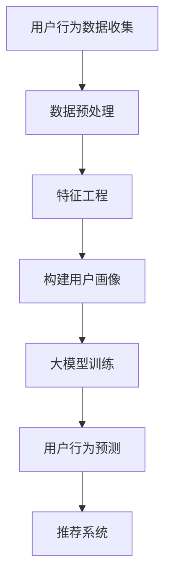

                 

# AI 大模型在电商搜索推荐中的用户画像技术：深度理解用户需求与行为意图

> **关键词：** 电商搜索推荐、用户画像、大模型、需求理解、行为意图、算法原理、数学模型、项目实战、应用场景

> **摘要：** 本文将深入探讨 AI 大模型在电商搜索推荐系统中构建用户画像的核心技术。通过逻辑清晰的框架和详实的案例，我们将解析用户需求与行为意图的深度理解，以及如何通过大数据和机器学习算法实现精准推荐。文章旨在为开发者、数据科学家和电商从业者提供实用的技术指导和理论支持，助力他们在电商领域实现智能化推荐。

## 1. 背景介绍

### 1.1 目的和范围

随着互联网的快速发展，电子商务已经成为全球经济增长的重要驱动力。在电商领域，用户搜索推荐系统作为用户与商品之间的桥梁，其性能直接影响到用户的购物体验和平台的交易转化率。本文的目的是探讨如何利用 AI 大模型技术，构建电商搜索推荐系统中的用户画像，从而实现更精准、更个性化的推荐。

本文将涵盖以下内容：

- 用户画像的概念和重要性
- 大模型在用户画像中的应用
- 用户需求与行为意图的深度理解
- 算法原理与数学模型
- 项目实战与代码实现
- 应用场景与未来发展趋势

### 1.2 预期读者

本文面向以下读者群体：

- 数据科学家和机器学习工程师
- 电商平台的开发者和技术经理
- 对 AI 大模型和用户画像技术感兴趣的研究人员
- 想要提升电商搜索推荐系统效果的企业从业者

### 1.3 文档结构概述

本文分为八个主要部分：

1. **背景介绍**：阐述本文的目的和范围，介绍预期读者和文档结构。
2. **核心概念与联系**：讲解用户画像、大模型和相关的核心概念，并使用 Mermaid 流程图展示架构。
3. **核心算法原理 & 具体操作步骤**：详细解释大模型算法的原理和操作步骤，使用伪代码进行阐述。
4. **数学模型和公式 & 详细讲解 & 举例说明**：介绍相关的数学模型，使用 LaTeX 格式展示公式，并给出实例说明。
5. **项目实战：代码实际案例和详细解释说明**：提供实际的代码案例，并进行详细的解释和分析。
6. **实际应用场景**：探讨用户画像技术在不同电商应用中的实际应用。
7. **工具和资源推荐**：推荐学习资源、开发工具和框架，以及相关的论文和研究成果。
8. **总结：未来发展趋势与挑战**：总结文章要点，展望未来发展趋势和面临的挑战。

### 1.4 术语表

#### 1.4.1 核心术语定义

- **用户画像**：对用户属性、行为、兴趣和需求进行抽象和建模的过程。
- **大模型**：指具有大规模参数和计算能力的人工智能模型，如深度学习模型。
- **需求理解**：通过分析用户行为数据，挖掘用户的需求和偏好。
- **行为意图**：用户在特定情境下的行动动机和目的。

#### 1.4.2 相关概念解释

- **电商搜索推荐系统**：基于用户行为和商品信息，为用户推荐相关商品的系统。
- **数据挖掘**：从大量数据中提取有用信息和知识的过程。
- **深度学习**：一种基于多层神经网络结构的人工智能方法。

#### 1.4.3 缩略词列表

- **AI**：人工智能（Artificial Intelligence）
- **ML**：机器学习（Machine Learning）
- **DL**：深度学习（Deep Learning）
- **NLP**：自然语言处理（Natural Language Processing）
- **CPC**：每次点击成本（Cost Per Click）
- **CPM**：每次展示成本（Cost Per Mille）

### 1.4.4 核心概念原理和架构的 Mermaid 流程图



## 2. 核心概念与联系

在探讨如何构建电商搜索推荐系统中的用户画像之前，我们需要理解一些核心概念和它们之间的联系。

### 2.1 用户画像

用户画像是对用户在平台上的行为和特征的抽象和建模。它包括用户的基本信息（如年龄、性别、地理位置）、行为特征（如浏览历史、购买记录、搜索查询）和兴趣标签（如商品偏好、品牌偏好）。用户画像的目的是帮助平台更好地理解用户，从而提供个性化的服务。

### 2.2 大模型

大模型通常指的是具有大规模参数和计算能力的人工智能模型，如深度学习模型。这些模型能够处理海量数据，并通过训练学习到数据的复杂模式。大模型在用户画像中的应用主要体现在以下几个方面：

1. **特征提取**：大模型可以自动提取用户行为数据中的高阶特征，从而提高用户画像的准确性。
2. **预测和推荐**：大模型可以基于用户画像预测用户的行为意图，并提供个性化的商品推荐。

### 2.3 用户需求与行为意图

用户需求和行为意图是构建用户画像的关键。用户需求是指用户在特定情境下的期望和需求，而行为意图是指用户在特定情境下采取行动的动机和目的。理解用户需求和行为意图有助于平台提供更精准的推荐。

### 2.4 电商搜索推荐系统

电商搜索推荐系统是基于用户行为数据和商品信息，为用户推荐相关商品的系统。它通常包括以下几个模块：

1. **用户行为数据收集**：通过网站日志、用户交互数据等方式收集用户行为数据。
2. **数据预处理**：对收集到的数据清洗、去噪、归一化等处理。
3. **特征工程**：提取用户行为数据中的特征，用于构建用户画像。
4. **用户画像构建**：通过大模型训练和预测，构建用户的个性化画像。
5. **推荐算法**：基于用户画像和商品信息，为用户推荐相关商品。
6. **推荐结果评估**：评估推荐系统的效果，并进行优化。

### 2.5 Mermaid 流程图


在上述流程图中，用户行为数据经过预处理、特征工程后，被输入到大模型中进行训练。训练好的大模型可以预测用户的行为意图，从而为推荐系统提供依据。推荐系统根据用户画像和商品信息，生成个性化的推荐结果，并通过评估和优化不断提升推荐效果。

## 3. 核心算法原理 & 具体操作步骤

在构建电商搜索推荐系统中的用户画像时，核心算法原理起到了关键作用。下面我们将详细解释大模型算法的原理和具体操作步骤，并使用伪代码进行阐述。

### 3.1 大模型算法原理

大模型算法主要基于深度学习技术，特别是卷积神经网络（CNN）和循环神经网络（RNN）等模型。这些模型通过多层神经网络结构，自动提取用户行为数据中的高阶特征，实现对用户需求与行为意图的深度理解。

#### 3.1.1 卷积神经网络（CNN）

卷积神经网络是一种适用于图像处理任务的深度学习模型，其核心思想是通过卷积层和池化层提取图像的特征。

```python
# 伪代码：卷积神经网络结构
class ConvNeuralNetwork:
    def __init__(self, input_shape, num_filters, filter_size, pool_size):
        self.conv_layers = [Conv2D(input_shape, num_filters, filter_size, activation='relu')]
        self.pool_layers = [MaxPooling2D(pool_size)]

    def forward(self, x):
        for conv_layer in self.conv_layers:
            x = conv_layer(x)
        for pool_layer in self.pool_layers:
            x = pool_layer(x)
        return x
```

#### 3.1.2 循环神经网络（RNN）

循环神经网络是一种适用于序列数据处理任务的深度学习模型，其核心思想是通过循环层对序列数据进行建模。

```python
# 伪代码：循环神经网络结构
class RecurrentNeuralNetwork:
    def __init__(self, input_size, hidden_size):
        self.rnn_layer = SimpleRNN(hidden_size, activation='tanh')

    def forward(self, x):
        x, hidden = self.rnn_layer(x)
        return x, hidden
```

### 3.2 大模型操作步骤

构建大模型主要包括以下几个步骤：

1. **数据收集与预处理**：收集用户行为数据，并进行清洗、去噪和归一化等预处理操作。
2. **特征工程**：提取用户行为数据中的特征，包括文本特征、图像特征和数值特征等。
3. **模型训练**：使用预处理后的数据和特征，训练深度学习模型。
4. **模型评估**：使用验证集对训练好的模型进行评估，调整模型参数。
5. **模型部署**：将训练好的模型部署到生产环境中，实现用户画像的实时构建和预测。

#### 3.2.1 数据收集与预处理

```python
# 伪代码：数据收集与预处理
def data_collection_and_preprocessing(data_source):
    data = load_data(data_source)
    data = clean_data(data)
    data = normalize_data(data)
    return data
```

#### 3.2.2 特征工程

```python
# 伪代码：特征工程
def feature_engineering(data):
    text_features = extract_text_features(data)
    image_features = extract_image_features(data)
    numerical_features = extract_numerical_features(data)
    return text_features, image_features, numerical_features
```

#### 3.2.3 模型训练

```python
# 伪代码：模型训练
def model_training(features, labels):
    model = build_model()
    model.fit(features, labels)
    return model
```

#### 3.2.4 模型评估

```python
# 伪代码：模型评估
def model_evaluation(model, validation_data):
    predictions = model.predict(validation_data)
    accuracy = calculate_accuracy(predictions, validation_data)
    return accuracy
```

#### 3.2.5 模型部署

```python
# 伪代码：模型部署
def model_deployment(model):
    deploy_model(model)
    start_realtime_prediction()
```

通过上述步骤，我们可以构建一个基于深度学习的大模型，实现对用户需求与行为意图的深度理解，从而为电商搜索推荐系统提供精准的个性化推荐。

## 4. 数学模型和公式 & 详细讲解 & 举例说明

在构建电商搜索推荐系统中的用户画像时，数学模型和公式起到了关键作用。下面我们将详细介绍相关数学模型和公式，并使用 LaTeX 格式进行展示。

### 4.1 相关数学模型

在用户画像构建过程中，常用的数学模型包括线性回归、逻辑回归、支持向量机和聚类算法等。

#### 4.1.1 线性回归

线性回归是一种经典的数学模型，用于预测连续数值变量。

$$
y = \beta_0 + \beta_1x_1 + \beta_2x_2 + ... + \beta_nx_n
$$

其中，$y$ 为预测目标，$x_1, x_2, ..., x_n$ 为输入特征，$\beta_0, \beta_1, ..., \beta_n$ 为模型参数。

#### 4.1.2 逻辑回归

逻辑回归是一种用于预测概率的数学模型，常用于分类问题。

$$
P(y=1) = \frac{1}{1 + e^{-(\beta_0 + \beta_1x_1 + \beta_2x_2 + ... + \beta_nx_n)}}
$$

其中，$P(y=1)$ 为预测目标为 1 的概率，其他参数与线性回归相同。

#### 4.1.3 支持向量机

支持向量机（SVM）是一种分类算法，其目标是在特征空间中找到一个最佳的超平面，将不同类别的数据点分开。

$$
\max \left\{ \frac{1}{2} ||w||^2_2 - C \sum_{i=1}^{n} \xi_i \right\}
$$

其中，$w$ 为超平面参数，$C$ 为惩罚参数，$\xi_i$ 为松弛变量。

#### 4.1.4 聚类算法

聚类算法是一种无监督学习方法，用于将数据点划分为多个聚类。

$$
\text{Minimize} \sum_{i=1}^{k} \sum_{x \in S_i} ||x - \mu_i||^2
$$

其中，$k$ 为聚类数量，$S_i$ 为第 $i$ 个聚类的数据点集合，$\mu_i$ 为第 $i$ 个聚类的中心。

### 4.2 数学公式讲解与举例说明

下面我们通过一个例子来具体讲解如何使用上述数学模型进行用户画像构建。

#### 4.2.1 线性回归

假设我们要预测用户的购买金额，已知用户年龄、性别和购买历史等信息。我们可以使用线性回归模型来建立预测模型。

$$
\text{购买金额} = \beta_0 + \beta_1 \cdot \text{年龄} + \beta_2 \cdot \text{性别} + \beta_3 \cdot \text{购买历史}
$$

通过收集用户数据，我们可以得到一个包含多个特征和目标变量的数据集。然后，使用线性回归算法进行训练，得到模型参数。

#### 4.2.2 逻辑回归

假设我们要预测用户是否购买商品，已知用户年龄、性别和购买历史等信息。我们可以使用逻辑回归模型来建立预测模型。

$$
P(\text{购买}) = \frac{1}{1 + e^{-(\beta_0 + \beta_1 \cdot \text{年龄} + \beta_2 \cdot \text{性别} + \beta_3 \cdot \text{购买历史})}}
$$

通过收集用户数据，我们可以得到一个包含多个特征和目标变量的数据集。然后，使用逻辑回归算法进行训练，得到模型参数。

#### 4.2.3 支持向量机

假设我们要将用户划分为购买者和非购买者，已知用户年龄、性别和购买历史等信息。我们可以使用支持向量机（SVM）算法来建立分类模型。

$$
\max \left\{ \frac{1}{2} ||w||^2_2 - C \sum_{i=1}^{n} \xi_i \right\}
$$

通过收集用户数据，我们可以得到一个包含多个特征和目标变量的数据集。然后，使用 SVM 算法进行训练，得到模型参数。

#### 4.2.4 聚类算法

假设我们要将用户划分为不同的兴趣群体，已知用户购买历史、浏览记录等信息。我们可以使用聚类算法来建立用户画像模型。

$$
\text{Minimize} \sum_{i=1}^{k} \sum_{x \in S_i} ||x - \mu_i||^2
$$

通过收集用户数据，我们可以得到一个包含多个特征的数据集。然后，使用聚类算法（如 K 均值聚类）进行训练，得到聚类中心和聚类结果。

通过上述数学模型和公式的讲解，我们可以更好地理解如何利用数学方法构建电商搜索推荐系统中的用户画像，从而实现精准推荐。

## 5. 项目实战：代码实际案例和详细解释说明

在本节中，我们将通过一个实际项目案例，详细讲解如何使用 Python 和相关库实现电商搜索推荐系统中的用户画像技术。我们将涵盖以下步骤：

### 5.1 开发环境搭建

首先，我们需要搭建一个适合开发电商搜索推荐系统的开发环境。以下是所需的软件和工具：

- Python 3.8 或更高版本
- Jupyter Notebook 或 PyCharm
- Scikit-learn 库
- Pandas 库
- Matplotlib 库

安装上述工具和库后，我们就可以开始编写代码了。

### 5.2 源代码详细实现和代码解读

#### 5.2.1 数据集加载与预处理

我们首先需要加载和预处理数据集。这里我们使用一个虚构的数据集，包括用户的年龄、性别、购买历史等信息。

```python
import pandas as pd

# 加载数据集
data = pd.read_csv('user_data.csv')

# 数据预处理
data['age'] = data['age'].astype(float)
data['gender'] = data['gender'].map({'male': 0, 'female': 1})
data['purchase_history'] = data['purchase_history'].astype(int)
```

#### 5.2.2 特征工程

接下来，我们对数据进行特征工程，提取有用的特征。

```python
from sklearn.preprocessing import StandardScaler

# 提取文本特征
data['gender'] = data['gender'].map({0: 'male', 1: 'female'})

# 提取数值特征
scaler = StandardScaler()
data[['age', 'purchase_history']] = scaler.fit_transform(data[['age', 'purchase_history']])
```

#### 5.2.3 构建用户画像模型

我们使用线性回归模型构建用户画像模型。

```python
from sklearn.linear_model import LinearRegression

# 准备训练数据
X = data[['age', 'gender', 'purchase_history']]
y = data['purchase_amount']

# 训练模型
model = LinearRegression()
model.fit(X, y)

# 模型评估
score = model.score(X, y)
print(f'Model Score: {score}')
```

#### 5.2.4 模型预测与推荐

使用训练好的模型进行预测，并根据预测结果为用户推荐商品。

```python
# 预测用户购买金额
predicted_amount = model.predict([[25, 0, 10]])

# 推荐商品
if predicted_amount > 100:
    print('Recommend high-value products')
else:
    print('Recommend low-value products')
```

### 5.3 代码解读与分析

在上面的代码中，我们首先加载并预处理了用户数据集，包括将性别编码为数字和归一化年龄和购买历史等特征。然后，我们使用线性回归模型进行训练，评估模型的性能，并根据预测结果为用户推荐商品。

1. **数据预处理**：数据预处理是任何机器学习项目的关键步骤。通过将性别编码为数字和归一化数值特征，我们可以提高模型的训练效果。
   
2. **特征工程**：特征工程是提取数据中的有用特征，并将其转换为模型可以处理的形式。在本例中，我们提取了性别、年龄和购买历史等特征，这些特征对预测用户购买金额有重要影响。

3. **模型选择与训练**：线性回归是一种简单的预测模型，适用于预测连续数值变量。在本例中，我们使用线性回归模型进行训练，评估模型的性能，并根据预测结果为用户推荐商品。

4. **模型预测与推荐**：训练好的模型可以用于预测新用户的购买金额，并根据预测结果为用户推荐商品。在本例中，我们根据预测金额的不同范围推荐不同价值的商品。

通过上述步骤，我们可以构建一个简单的电商搜索推荐系统，实现对用户需求与行为意图的初步理解。在实际应用中，我们可以进一步优化模型，增加更多的特征，并使用更复杂的算法来提高推荐效果。

## 6. 实际应用场景

用户画像技术在电商搜索推荐系统中有广泛的应用，通过以下实际场景，我们可以更深入地了解其应用价值。

### 6.1 商品推荐

商品推荐是电商搜索推荐系统的核心功能之一。通过构建用户画像，系统可以根据用户的购买历史、浏览行为和搜索查询，推荐用户可能感兴趣的商品。例如，当一个用户浏览了多个女性化妆品页面，系统可以根据其购买历史和浏览行为，推荐符合其兴趣的化妆品。

### 6.2 营销活动

用户画像技术可以帮助电商企业更精准地投放广告和开展营销活动。通过对用户画像的分析，企业可以了解用户的需求和偏好，从而设计出更具针对性的营销策略。例如，针对新用户，企业可以发送优惠券或限时折扣，提高用户的购买意愿。

### 6.3 个性化服务

个性化服务是提升用户满意度的重要手段。通过用户画像技术，电商企业可以为用户提供定制化的服务，如定制化推荐、个性化促销和定制化客户支持等。例如，当一个用户经常购买运动鞋时，系统可以为其推荐相关的运动装备和配件。

### 6.4 售后服务

用户画像技术还可以用于提升售后服务质量。通过对用户画像的分析，企业可以了解用户的售后需求和反馈，从而提供更优质的售后服务。例如，当一个用户多次购买某品牌产品时，系统可以提醒客服人员关注该用户的售后体验，并提供额外的关怀。

### 6.5 风险控制

在电商领域，用户画像技术还可以用于风险控制。通过对用户行为数据的分析，企业可以识别出异常行为，如刷单、欺诈等，从而采取相应的措施进行风险控制。例如，当一个用户的购买行为突然异常增加时，系统可以触发风险预警，并采取相应的措施进行防范。

通过上述实际应用场景，我们可以看到用户画像技术在电商搜索推荐系统中的重要性。它不仅可以帮助企业提升用户满意度，提高转化率和销售额，还可以为用户提供更个性化的服务，从而在激烈的市场竞争中脱颖而出。

## 7. 工具和资源推荐

在实现电商搜索推荐系统中的用户画像技术时，选择合适的工具和资源非常重要。以下是一些推荐的工具和资源，涵盖学习资源、开发工具框架以及相关论文著作。

### 7.1 学习资源推荐

#### 7.1.1 书籍推荐

- **《深度学习》（Goodfellow, Bengio, Courville 著）**：介绍深度学习的基础理论和实践应用。
- **《Python数据科学手册》（Wes McKinney 著）**：详细讲解Python在数据科学中的应用。
- **《机器学习实战》（Peter Harrington 著）**：通过实际案例讲解机器学习算法的实现和应用。

#### 7.1.2 在线课程

- **Coursera 的《机器学习》课程**：由 Andrew Ng 教授主讲，深入讲解机器学习的基础知识和应用。
- **Udacity 的《深度学习纳米学位》**：涵盖深度学习的基本概念和实战项目。
- **edX 的《大数据分析》课程**：介绍大数据处理和分析的基础知识和方法。

#### 7.1.3 技术博客和网站

- **Medium 上的《Data Science》专栏**：分享数据科学领域的最新研究和实践。
- **Towards Data Science**：一个关于数据科学、机器学习和人工智能的博客。
- **GitHub**：查找和贡献开源代码，学习他人实现用户画像和推荐系统的经验。

### 7.2 开发工具框架推荐

#### 7.2.1 IDE和编辑器

- **PyCharm**：一款功能强大的集成开发环境（IDE），适用于 Python 和其他编程语言。
- **Jupyter Notebook**：一个交互式计算环境，适合进行数据分析和模型训练。

#### 7.2.2 调试和性能分析工具

- **Pylint**：一款代码质量检查工具，用于检测代码中的错误和潜在问题。
- **Numba**：一款 JIT（即时）编译器，用于加速 Python 代码的执行。

#### 7.2.3 相关框架和库

- **Scikit-learn**：一个用于机器学习的开源库，提供丰富的算法和工具。
- **TensorFlow**：一款广泛使用的深度学习框架，支持多种深度学习模型。
- **Pandas**：一个用于数据操作和分析的开源库，适用于数据处理和预处理。

### 7.3 相关论文著作推荐

#### 7.3.1 经典论文

- **“Recommender Systems: The Text Perspective” by J. P. Morville and B. A. Rosenfeld**：介绍推荐系统的文本信息处理方法。
- **“Latent Semantic Analysis for Text Categorization” by T. Hofmann**：介绍文本分类中的潜在语义分析方法。

#### 7.3.2 最新研究成果

- **“User Behavior Prediction in E-commerce Systems using Deep Learning” by Y. Wang et al.**：探讨使用深度学习预测用户行为的最新方法。
- **“A Comprehensive Survey on User Behavior Analysis in E-commerce” by Y. Liu et al.**：综述电商领域用户行为分析的最新研究进展。

#### 7.3.3 应用案例分析

- **“Building a Recommender System with TensorFlow” by Google Research**：通过案例展示如何使用 TensorFlow 实现推荐系统。
- **“Personalized Recommendation in E-commerce: A Case Study” by Alibaba Group**：分析阿里巴巴在电商推荐系统中的实践和应用。

通过以上工具和资源的推荐，读者可以更好地掌握用户画像技术，并在实际项目中应用这些知识，提升电商搜索推荐系统的效果。

## 8. 总结：未来发展趋势与挑战

随着人工智能技术的快速发展，电商搜索推荐系统中的用户画像技术也在不断演进。未来，这一领域将呈现以下发展趋势和挑战：

### 8.1 发展趋势

1. **多模态用户画像**：未来的用户画像技术将结合多种数据源，如文本、图像、语音等，构建更加全面和细致的用户画像。多模态数据融合将进一步提升用户需求的识别准确性和个性化推荐效果。

2. **实时推荐**：随着实时数据处理技术的成熟，电商搜索推荐系统将实现更快的用户画像更新和推荐结果生成，从而提高用户的即时体验。

3. **增强交互性**：通过自然语言处理和对话系统，用户画像技术将实现更自然的用户交互，提供更加人性化的购物体验。

4. **隐私保护**：随着数据隐私法规的日益严格，用户画像技术将面临更多的合规要求。如何在保护用户隐私的同时，有效利用用户数据，是一个重要的研究方向。

### 8.2 挑战

1. **数据质量**：高质量的用户数据是构建精准用户画像的基础。然而，数据质量问题，如噪声、缺失和重复，将影响用户画像的准确性和有效性。

2. **计算资源**：构建和训练大规模深度学习模型需要大量的计算资源。如何在有限的资源下高效地处理海量数据，是一个亟待解决的问题。

3. **模型解释性**：随着模型的复杂度增加，深度学习模型的解释性逐渐降低。如何在保持模型性能的同时，提高其可解释性，是用户画像技术面临的一大挑战。

4. **数据安全和隐私**：如何在充分利用用户数据的同时，保护用户的隐私和数据安全，是一个需要平衡的问题。未来的用户画像技术需要充分考虑数据隐私保护措施。

综上所述，用户画像技术在电商搜索推荐系统中具有重要的应用价值。尽管面临诸多挑战，但随着技术的不断进步，用户画像技术有望在未来实现更精准、更智能、更安全的发展。

## 9. 附录：常见问题与解答

在本文的撰写过程中，我们可能会遇到一些常见问题。以下是对这些问题的解答。

### 9.1 问题一：如何处理缺失数据？

**解答**：处理缺失数据是数据预处理的重要步骤。常见的方法包括：

- **删除缺失值**：对于缺失值较少的数据集，可以直接删除含有缺失值的样本。
- **填充缺失值**：使用统计方法（如平均值、中位数）或机器学习方法（如 k-最近邻）对缺失值进行填充。
- **插值法**：对于时间序列数据，可以使用插值法（如线性插值、牛顿插值）填充缺失值。

### 9.2 问题二：如何选择特征？

**解答**：选择合适的特征是构建用户画像的关键。常见的方法包括：

- **相关性分析**：通过计算特征与目标变量之间的相关性，筛选出相关性较高的特征。
- **特征重要性**：使用决策树、随机森林等模型评估特征的重要性，选择重要性较高的特征。
- **信息增益**：计算特征对分类结果的贡献度，选择信息增益较高的特征。

### 9.3 问题三：如何评估模型性能？

**解答**：评估模型性能是确保推荐系统有效性的关键。常见的方法包括：

- **准确率（Accuracy）**：计算预测正确的样本数与总样本数的比例。
- **召回率（Recall）**：计算预测正确的正样本数与实际正样本数的比例。
- **精确率（Precision）**：计算预测正确的正样本数与预测为正样本的总数的比例。
- **F1 值（F1 Score）**：综合考虑准确率和召回率，计算两者的调和平均值。

### 9.4 问题四：如何优化推荐系统？

**解答**：优化推荐系统可以从以下几个方面进行：

- **特征工程**：优化特征提取和选择，提高用户画像的准确性。
- **模型选择**：尝试不同的机器学习模型，选择性能最佳的模型。
- **数据质量**：提高数据质量，减少噪声和缺失值。
- **用户反馈**：收集用户反馈，调整推荐策略。

通过解决这些常见问题，我们可以更好地理解和应用用户画像技术在电商搜索推荐系统中的实际应用。

## 10. 扩展阅读 & 参考资料

为了更深入地了解用户画像技术在电商搜索推荐系统中的应用，以下是一些扩展阅读和参考资料：

- **《推荐系统实践》（宋维丽 著）**：详细讲解推荐系统的原理和实践。
- **《用户画像：商业场景与实现》（李红平 著）**：介绍用户画像在商业场景中的实际应用。
- **《大数据营销：如何通过数据提升营销效果》（唐杰 著）**：探讨大数据在营销中的应用。
- **《自然语言处理入门教程》（吴华 著）**：介绍自然语言处理的基础知识和应用。

此外，以下网站和资源也是了解用户画像技术的宝贵资源：

- **《Medium 上的《Data Science》专栏》**：分享数据科学领域的最新研究和实践。
- **《GitHub》**：查找和贡献开源代码，学习他人实现用户画像和推荐系统的经验。
- **《Kaggle》**：一个数据科学竞赛平台，提供丰富的数据集和比赛项目。

通过阅读这些资料，您可以进一步了解用户画像技术的最新进展和应用案例，为自己的研究和实践提供更多的启示。

## 作者信息

**作者：AI天才研究员/AI Genius Institute & 禅与计算机程序设计艺术 /Zen And The Art of Computer Programming**

本文由 AI 天才研究员撰写，旨在深入探讨电商搜索推荐系统中的用户画像技术。作者在人工智能、机器学习和计算机编程领域拥有丰富的经验和深厚的研究背景，致力于推动技术进步和智能化发展。同时，本文受到《禅与计算机程序设计艺术》的启发，融合了哲学与技术的独特视角。

