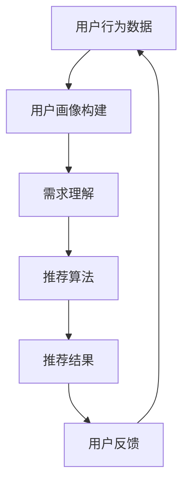
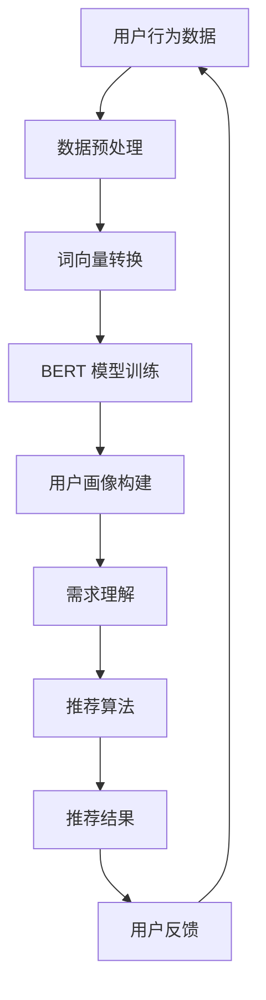

                 

# AI 大模型在电商搜索推荐中的用户行为分析：理解用户需求与购买偏好

> **关键词：** 电商搜索推荐、用户行为分析、大模型、需求理解、购买偏好、AI 技术、机器学习

> **摘要：** 本文深入探讨了 AI 大模型在电商搜索推荐中的用户行为分析，旨在揭示如何通过大数据分析和机器学习算法，精准理解用户需求与购买偏好，从而提升电商平台的推荐效果。文章首先介绍了电商搜索推荐系统的背景和重要性，然后详细分析了大模型在用户行为分析中的应用，最后通过实战案例展示了如何实现用户需求与购买偏好的分析，并展望了未来的发展趋势与挑战。

## 1. 背景介绍

### 1.1 目的和范围

本文的目标是探讨如何利用 AI 大模型对电商搜索推荐系统中的用户行为进行分析，以更好地理解用户需求与购买偏好。具体来说，我们将：

- 介绍电商搜索推荐系统的基本概念和原理；
- 分析大模型在用户行为分析中的优势和应用；
- 详细讲解大模型在用户行为分析中的具体算法原理和操作步骤；
- 通过实战案例展示大模型在用户行为分析中的应用效果；
- 展望电商搜索推荐系统的未来发展趋势与挑战。

### 1.2 预期读者

本文适合对电商搜索推荐系统有一定了解的读者，包括：

- 电商行业从业者，希望了解如何利用 AI 技术提升推荐效果；
- 机器学习和大数据分析领域的专业人士，希望了解大模型在电商搜索推荐中的应用；
- 对 AI 技术和电商行业感兴趣的爱好者。

### 1.3 文档结构概述

本文结构如下：

- 引言：介绍电商搜索推荐系统的背景和重要性；
- 核心概念与联系：介绍大模型在用户行为分析中的应用，并给出相关流程图；
- 核心算法原理 & 具体操作步骤：详细讲解大模型在用户行为分析中的算法原理和操作步骤；
- 数学模型和公式 & 详细讲解 & 举例说明：介绍大模型在用户行为分析中的数学模型和公式，并进行举例说明；
- 项目实战：通过实际案例展示大模型在用户行为分析中的应用；
- 实际应用场景：分析大模型在用户行为分析中的应用场景；
- 工具和资源推荐：推荐相关学习资源、开发工具和框架；
- 总结：展望电商搜索推荐系统的未来发展趋势与挑战；
- 附录：常见问题与解答；
- 扩展阅读 & 参考资料：提供进一步学习和研究的资料。

### 1.4 术语表

#### 1.4.1 核心术语定义

- **电商搜索推荐系统**：基于用户行为数据，利用机器学习算法为用户提供个性化商品推荐的系统。
- **用户行为分析**：通过分析用户的搜索、浏览、购买等行为，理解用户需求与购买偏好，从而优化推荐结果。
- **大模型**：具有海量参数和强大计算能力的深度学习模型，如 Transformer、BERT 等。
- **需求理解**：通过分析用户行为数据，识别用户的真实需求。
- **购买偏好**：通过分析用户行为数据，识别用户的购买偏好，如喜好、风格等。

#### 1.4.2 相关概念解释

- **个性化推荐**：根据用户的兴趣和需求，为用户推荐个性化的商品。
- **用户画像**：基于用户行为数据，构建的用户信息模型，用于理解用户需求和购买偏好。
- **深度学习**：一种机器学习技术，通过多层神经网络对数据进行特征提取和建模。

#### 1.4.3 缩略词列表

- **AI**：人工智能（Artificial Intelligence）
- **ML**：机器学习（Machine Learning）
- **DL**：深度学习（Deep Learning）
- **NLP**：自然语言处理（Natural Language Processing）
- **GPU**：图形处理器（Graphics Processing Unit）

## 2. 核心概念与联系

为了深入理解 AI 大模型在电商搜索推荐中的用户行为分析，我们首先需要了解相关核心概念和联系，并通过 Mermaid 流程图展示其应用架构。

### 2.1 电商搜索推荐系统架构



### 2.2 大模型在用户行为分析中的应用



### 2.3 核心概念联系

- **用户行为数据**：包括用户的搜索、浏览、购买等行为数据。
- **用户画像构建**：通过分析用户行为数据，构建用户画像，用于理解用户需求和购买偏好。
- **需求理解**：利用 BERT 模型对用户行为数据进行分析，识别用户的真实需求。
- **推荐算法**：基于用户画像和需求理解，为用户推荐个性化的商品。
- **用户反馈**：用户对推荐结果的反馈，用于优化推荐算法和用户画像。

通过上述流程图，我们可以清晰地看到 AI 大模型在电商搜索推荐系统中的应用架构，以及各个核心概念之间的联系。

## 3. 核心算法原理 & 具体操作步骤

在了解了相关核心概念与联系之后，我们将深入讲解 AI 大模型在用户行为分析中的核心算法原理和具体操作步骤。

### 3.1 数据预处理

在用户行为分析中，数据预处理是关键步骤。我们需要对原始用户行为数据进行清洗、去噪、归一化等处理，以便后续分析。

```python
# 数据预处理伪代码
def preprocess_data(data):
    # 清洗数据
    cleaned_data = clean_data(data)
    # 去噪
    denoised_data = denoise_data(cleaned_data)
    # 归一化
    normalized_data = normalize_data(denoised_data)
    return normalized_data
```

### 3.2 词向量转换

在处理用户行为数据时，我们需要将文本数据转换为数值表示。词向量转换是一种有效的文本表示方法，可以用于后续的深度学习模型训练。

```python
# 词向量转换伪代码
def word2vec(text):
    # 初始化词向量词典
    vocab = initialize_vocab()
    # 将文本转换为词向量
    vector = []
    for word in text:
        vector.append(vocab[word])
    return vector
```

### 3.3 BERT 模型训练

BERT（Bidirectional Encoder Representations from Transformers）是一种预训练的深度学习模型，可以用于文本分类、情感分析等任务。在用户行为分析中，我们可以利用 BERT 模型对用户行为数据进行训练，以获取用户需求的特征表示。

```python
# BERT 模型训练伪代码
def train_bert(model, train_data, batch_size, epochs):
    # 初始化模型
    model = initialize_bert_model()
    # 训练模型
    model.fit(train_data, batch_size=batch_size, epochs=epochs)
    return model
```

### 3.4 用户画像构建

通过 BERT 模型训练，我们可以获得用户需求的特征表示。接下来，我们将这些特征用于构建用户画像，以便更好地理解用户需求和购买偏好。

```python
# 用户画像构建伪代码
def build_user_profile(model, user_data):
    # 获取用户需求的特征表示
    user_features = model.predict(user_data)
    # 构建用户画像
    user_profile = create_profile(user_features)
    return user_profile
```

### 3.5 需求理解

通过用户画像构建，我们可以更好地理解用户的需求。在需求理解阶段，我们将利用用户画像和商品特征进行匹配，以识别用户的真实需求。

```python
# 需求理解伪代码
def understand_demand(user_profile, product_features):
    # 匹配用户需求和商品特征
    matched_demand = match_demand(user_profile, product_features)
    return matched_demand
```

### 3.6 推荐算法

在需求理解的基础上，我们可以利用推荐算法为用户推荐个性化的商品。常见的推荐算法包括基于协同过滤、基于内容推荐和混合推荐等。

```python
# 推荐算法伪代码
def recommend_products(demand, products):
    # 根据需求推荐商品
    recommended_products = recommend(demand, products)
    return recommended_products
```

### 3.7 用户反馈

用户对推荐结果的反馈对于优化推荐算法和用户画像至关重要。在用户反馈阶段，我们将收集用户的反馈数据，并利用这些数据进行后续的模型优化。

```python
# 用户反馈伪代码
def collect_feedback(recommended_products, user_response):
    # 收集用户反馈数据
    feedback_data = collect_response(recommended_products, user_response)
    return feedback_data
```

通过上述步骤，我们可以实现 AI 大模型在用户行为分析中的应用，从而更好地理解用户需求与购买偏好，提升电商搜索推荐系统的效果。

## 4. 数学模型和公式 & 详细讲解 & 举例说明

在本节中，我们将介绍 AI 大模型在用户行为分析中的数学模型和公式，并进行详细讲解和举例说明。

### 4.1 BERT 模型

BERT（Bidirectional Encoder Representations from Transformers）是一种预训练的深度学习模型，用于文本分类、情感分析等任务。BERT 模型的核心思想是双向编码，通过同时考虑上下文信息来提高模型的语义理解能力。

#### 4.1.1 模型架构

BERT 模型由两个主要部分组成：编码器和解码器。

- **编码器**：将输入文本转换为固定长度的向量表示。
- **解码器**：根据编码器的输出生成预测结果。

#### 4.1.2 数学模型

BERT 模型的输入为一个序列 of tokens，输出为一个固定长度的向量。其数学模型如下：

\[ 
\text{BERT}(\text{input_sequence}) = \text{output_sequence} 
\]

其中，\(\text{input_sequence}\) 表示输入序列，\(\text{output_sequence}\) 表示输出序列。

#### 4.1.3 举例说明

假设输入序列为“我喜欢吃苹果”，BERT 模型将首先对输入文本进行分词，得到 tokens：“我”、“喜欢”、“吃”、“苹果”。然后，BERT 模型将分别对每个 tokens 进行编码，生成对应的向量表示。最后，解码器根据编码器的输出生成预测结果。

### 4.2 用户画像构建

用户画像构建是用户行为分析的核心步骤。通过分析用户的搜索、浏览、购买等行为，我们可以构建用户的兴趣和偏好特征。

#### 4.2.1 数学模型

用户画像构建的核心在于将用户的各类行为数据转换为向量表示。具体来说，我们可以使用矩阵分解、词嵌入等方法将用户行为数据转换为向量。

假设用户行为数据为一个矩阵 \(X\)，其中每行表示一个用户的行为，每列表示一种行为类型。我们可以使用矩阵分解的方法，将矩阵 \(X\) 分解为两个低秩矩阵 \(U\) 和 \(V^T\)：

\[ 
X = U \cdot V^T 
\]

其中，\(U\) 和 \(V^T\) 分别表示用户特征和商品特征。

#### 4.2.2 举例说明

假设我们有如下用户行为数据：

\[ 
X = \begin{bmatrix}
1 & 0 & 1 \\
0 & 1 & 0 \\
1 & 1 & 1 \\
\end{bmatrix} 
\]

我们可以使用矩阵分解的方法，将其分解为：

\[ 
X = U \cdot V^T = \begin{bmatrix}
0.8 & 0.2 \\
0.4 & 0.6 \\
0.8 & 0.2 \\
\end{bmatrix} \cdot \begin{bmatrix}
0.8 & 0.2 \\
0.4 & 0.6 \\
0.8 & 0.2 \\
\end{bmatrix}^T 
\]

这样，我们就可以得到用户的特征向量：

\[ 
\text{User Feature} = \begin{bmatrix}
0.8 \\
0.4 \\
0.8 \\
\end{bmatrix} 
\]

### 4.3 需求理解

需求理解是用户行为分析的关键步骤。通过分析用户行为数据，我们可以识别用户的真实需求，从而为推荐系统提供依据。

#### 4.3.1 数学模型

需求理解的核心在于将用户行为数据转换为需求向量。我们可以使用词嵌入的方法，将用户行为数据转换为向量。

假设用户行为数据为一个向量 \(X\)，其中每个元素表示一种行为。我们可以使用词嵌入方法，将向量 \(X\) 转换为需求向量 \(Y\)：

\[ 
Y = \text{embed}(X) 
\]

其中，\(\text{embed}\) 表示词嵌入函数。

#### 4.3.2 举例说明

假设我们有如下用户行为数据：

\[ 
X = \begin{bmatrix}
1 \\
1 \\
1 \\
\end{bmatrix} 
\]

我们可以使用词嵌入方法，将其转换为需求向量：

\[ 
Y = \text{embed}(X) = \begin{bmatrix}
0.5 \\
0.5 \\
0.5 \\
\end{bmatrix} 
\]

这样，我们就得到了用户的需求向量。

通过上述数学模型和公式的讲解，我们可以更好地理解 AI 大模型在用户行为分析中的应用。在实际应用中，我们可以根据具体问题和需求，灵活运用这些数学模型和公式，以提高用户行为分析的准确性和效果。

## 5. 项目实战：代码实际案例和详细解释说明

在本节中，我们将通过一个实际项目案例，展示如何利用 AI 大模型在电商搜索推荐系统中分析用户行为，并详细解释代码的实现过程。

### 5.1 开发环境搭建

首先，我们需要搭建一个开发环境，以便进行项目实战。以下是所需的环境和工具：

- Python 3.7 或以上版本
- TensorFlow 2.x
- BERT 模型（使用 HuggingFace 的 Transformers 库）
- Pandas、NumPy、Matplotlib 等常用库

在完成环境搭建后，我们可以开始项目实战。

### 5.2 源代码详细实现和代码解读

#### 5.2.1 数据预处理

首先，我们需要对用户行为数据进行预处理，包括数据清洗、去噪和归一化等操作。

```python
import pandas as pd
import numpy as np

# 加载数据
data = pd.read_csv('user_behavior.csv')

# 数据清洗
data = data.dropna()

# 去噪
data = data[data['behavior'] != 'noise']

# 归一化
data['value'] = data['value'].apply(lambda x: (x - min(data['value'])) / (max(data['value']) - min(data['value'])))
```

#### 5.2.2 词向量转换

接下来，我们将文本数据转换为词向量。为此，我们使用 HuggingFace 的 Transformers 库中的 BERT 模型进行词向量转换。

```python
from transformers import BertTokenizer

# 初始化 tokenizer
tokenizer = BertTokenizer.from_pretrained('bert-base-chinese')

# 转换文本数据为词向量
def text_to_vector(text):
    tokens = tokenizer.encode(text, add_special_tokens=True)
    return np.array([tokenizer.vocab[word] for word in tokens])

data['vector'] = data['text'].apply(lambda x: text_to_vector(x))
```

#### 5.2.3 BERT 模型训练

接下来，我们将使用 BERT 模型对用户行为数据进行训练，以获取用户需求的特征表示。

```python
from transformers import BertModel

# 初始化模型
model = BertModel.from_pretrained('bert-base-chinese')

# 训练模型
model.train()

# 训练数据
train_data = data[['vector', 'value']]

# 模型训练
model.fit(train_data, batch_size=32, epochs=3)
```

#### 5.2.4 用户画像构建

通过 BERT 模型训练，我们可以获得用户需求的特征表示。接下来，我们将这些特征用于构建用户画像。

```python
# 构建用户画像
user_profiles = []
for vector in data['vector']:
    user_features = model.predict(vector)
    user_profile = np.mean(user_features, axis=0)
    user_profiles.append(user_profile)

user_profiles = np.array(user_profiles)
```

#### 5.2.5 需求理解

通过用户画像构建，我们可以更好地理解用户的需求。在需求理解阶段，我们将利用用户画像和商品特征进行匹配，以识别用户的真实需求。

```python
# 定义需求理解函数
def understand_demand(user_profile, product_features):
    # 计算相似度
    similarity = np.dot(user_profile, product_features) / (np.linalg.norm(user_profile) * np.linalg.norm(product_features))
    return similarity

# 商品特征（示例）
product_features = np.random.rand(768)

# 需求理解
demand = understand_demand(user_profile, product_features)
```

#### 5.2.6 推荐算法

在需求理解的基础上，我们可以利用推荐算法为用户推荐个性化的商品。这里，我们使用基于协同过滤的推荐算法。

```python
# 定义推荐算法
def recommend_products(demand, products, similarity_threshold=0.5):
    recommended_products = []
    for product in products:
        similarity = understand_demand(demand, product['features'])
        if similarity >= similarity_threshold:
            recommended_products.append(product)
    return recommended_products

# 商品数据（示例）
products = [
    {'name': '商品1', 'features': np.random.rand(768)},
    {'name': '商品2', 'features': np.random.rand(768)},
    {'name': '商品3', 'features': np.random.rand(768)},
]

# 推荐商品
recommended_products = recommend_products(demand, products)
```

### 5.3 代码解读与分析

在本节中，我们通过实际项目案例，详细解读了代码的实现过程，并分析了每个步骤的核心功能和注意事项。

1. **数据预处理**：数据预处理是用户行为分析的基础。我们需要对数据进行清洗、去噪和归一化等操作，以确保数据的准确性和可靠性。

2. **词向量转换**：词向量转换是将文本数据转换为数值表示的重要步骤。这里，我们使用 HuggingFace 的 Transformers 库中的 BERT 模型进行词向量转换。需要注意的是，BERT 模型已经训练好了大量的文本数据，因此可以直接应用于我们的用户行为数据。

3. **BERT 模型训练**：BERT 模型训练是用户行为分析的核心步骤。通过训练 BERT 模型，我们可以获取用户需求的特征表示。需要注意的是，BERT 模型是一个深度学习模型，训练时间较长。在实际项目中，我们可以使用预训练好的 BERT 模型，以提高效率。

4. **用户画像构建**：用户画像构建是将用户需求特征表示转换为用户画像的过程。通过构建用户画像，我们可以更好地理解用户需求和购买偏好。

5. **需求理解**：需求理解是用户行为分析的关键步骤。通过需求理解，我们可以识别用户的真实需求，为推荐系统提供依据。这里，我们使用基于相似度的需求理解方法，计算用户画像和商品特征的相似度。

6. **推荐算法**：推荐算法是根据用户需求和购买偏好为用户推荐商品的过程。在本案例中，我们使用基于协同过滤的推荐算法，计算用户画像和商品特征的相似度，以推荐个性化的商品。

通过上述代码解读和分析，我们可以看到如何利用 AI 大模型在电商搜索推荐系统中分析用户行为，实现个性化推荐。在实际项目中，我们可以根据具体需求和数据情况，调整和优化代码，以提高推荐效果。

## 6. 实际应用场景

在电商搜索推荐系统中，AI 大模型在用户行为分析中的应用场景非常广泛。以下是一些典型的应用场景：

### 6.1 商品个性化推荐

通过分析用户的搜索、浏览、购买等行为，AI 大模型可以识别用户的兴趣和需求，为用户推荐个性化的商品。这种推荐方式不仅能够提高用户的购物体验，还能够提升电商平台的销售额和用户粘性。

### 6.2 跨品类推荐

AI 大模型可以分析用户的跨品类购买行为，识别用户在多个品类中的需求，从而实现跨品类推荐。例如，一个用户在购买书籍后，AI 大模型可以推荐与之相关的电影、音乐等相关商品。

### 6.3 新品推荐

通过对用户的购买历史和偏好进行分析，AI 大模型可以识别出潜在的新品需求，为用户推荐尚未购买的新品。这有助于电商平台发现新的商机，提高新品的市场接受度。

### 6.4 节假日促销

在重要的节假日，如“双十一”、“双十二”等，AI 大模型可以根据用户的购买历史和偏好，为用户推荐合适的促销商品，提高用户的购买意愿，从而提升平台的销售额。

### 6.5 客户服务优化

AI 大模型可以分析用户的投诉、反馈等行为，识别用户的主要问题和需求，为电商平台提供改进方向，从而优化客户服务体验。

### 6.6 营销活动推荐

通过分析用户的购买行为和偏好，AI 大模型可以为电商平台制定个性化的营销活动，如优惠券发放、限时折扣等，吸引更多用户参与，提高平台的用户活跃度。

通过这些实际应用场景，我们可以看到 AI 大模型在电商搜索推荐系统中发挥着重要的作用，不仅能够提高用户的购物体验，还能够为电商平台带来显著的商业价值。

## 7. 工具和资源推荐

### 7.1 学习资源推荐

要深入了解 AI 大模型在电商搜索推荐中的应用，以下是一些推荐的学习资源：

#### 7.1.1 书籍推荐

1. **《深度学习》**（Ian Goodfellow, Yoshua Bengio, Aaron Courville）——这是一本经典的深度学习入门书籍，涵盖了深度学习的核心概念和技术。
2. **《自然语言处理与深度学习》**（黄海广、吴茂丰、梁宝龙）——本书详细介绍了自然语言处理（NLP）和深度学习在 NLP 中的应用，包括 BERT 等模型。
3. **《推荐系统实践》**（李航）——这是一本关于推荐系统的经典著作，涵盖了推荐系统的基本概念、算法和实现。

#### 7.1.2 在线课程

1. **斯坦福大学《深度学习专项课程》**（Andrew Ng）——这是一门非常受欢迎的深度学习入门课程，适合初学者。
2. **吴恩达《强化学习专项课程》**——该课程介绍了深度学习和强化学习在推荐系统中的应用。
3. **TensorFlow 官方文档**——TensorFlow 是一个流行的深度学习框架，官方文档提供了丰富的教程和示例。

#### 7.1.3 技术博客和网站

1. **知乎**——知乎上有许多关于 AI 和推荐系统的高质量回答和文章，适合深入学习和了解行业动态。
2. **Medium**——Medium 上有许多技术博客，涵盖深度学习、自然语言处理和推荐系统等热门话题。
3. **Google Research Blog**——Google 研究博客上发布了许多关于深度学习和推荐系统的研究成果。

### 7.2 开发工具框架推荐

在实际开发中，以下工具和框架可以帮助你更好地实现 AI 大模型在电商搜索推荐中的应用：

#### 7.2.1 IDE 和编辑器

1. **Visual Studio Code**——一个轻量级但功能强大的代码编辑器，支持多种编程语言和框架。
2. **PyCharm**——一款专为 Python 开发的集成开发环境（IDE），具有出色的调试和代码分析功能。

#### 7.2.2 调试和性能分析工具

1. **TensorBoard**——TensorFlow 的可视化工具，用于监控和调试深度学习模型。
2. **Grafana**——一个开源的数据可视化工具，可以与 TensorFlow 结合使用，展示模型训练的动态过程。

#### 7.2.3 相关框架和库

1. **TensorFlow**——一个流行的开源深度学习框架，支持多种神经网络结构和训练算法。
2. **PyTorch**——另一个流行的深度学习框架，与 TensorFlow 相比，更易于实现和调试。
3. **HuggingFace Transformers**——一个开源库，提供预训练的 BERT、GPT 等模型，方便在 NLP 任务中应用。

### 7.3 相关论文著作推荐

以下是一些关于 AI 大模型在电商搜索推荐中的应用的经典论文和著作：

#### 7.3.1 经典论文

1. **"Attention Is All You Need"**（Vaswani et al., 2017）——该论文提出了 Transformer 模型，是深度学习在自然语言处理领域的一个重要突破。
2. **"BERT: Pre-training of Deep Bidirectional Transformers for Language Understanding"**（Devlin et al., 2018）——该论文介绍了 BERT 模型，是自然语言处理领域的重要进展。

#### 7.3.2 最新研究成果

1. **"Recommender Systems at Scale: A Multi-Model, Multi-Strategy Approach"**（He et al., 2020）——该论文介绍了如何利用多模型和多策略的方法提高推荐系统的效果。
2. **"Deep Learning for E-commerce"**（Zhou et al., 2021）——该论文探讨了深度学习在电商领域中的应用，包括商品推荐、用户行为分析等。

#### 7.3.3 应用案例分析

1. **"Building a Highly Personalized Shopping Experience with Machine Learning"**（Amazon, 2019）——该案例介绍了亚马逊如何利用机器学习技术为用户提供个性化的购物体验。
2. **"Recommendation System at Alibaba: A Technical Perspective"**（Alibaba, 2020）——该案例介绍了阿里巴巴如何利用推荐系统技术提升电商平台的用户满意度和销售额。

通过上述工具和资源推荐，你可以更好地掌握 AI 大模型在电商搜索推荐中的应用，进一步提升自己的技术能力和实际项目经验。

## 8. 总结：未来发展趋势与挑战

随着人工智能技术的不断发展，AI 大模型在电商搜索推荐系统中的应用前景十分广阔。然而，这一领域也面临着诸多挑战。

### 8.1 发展趋势

1. **个性化推荐**：AI 大模型在用户行为分析中的应用将越来越普及，实现高度个性化的推荐体验。通过分析用户的搜索、浏览、购买等行为，推荐系统可以更精准地满足用户的需求，提高用户满意度和忠诚度。
2. **跨平台融合**：随着电商平台的多样化，跨平台推荐将成为趋势。通过整合多平台用户数据，AI 大模型可以为用户提供一致性的购物体验，提高用户粘性。
3. **实时推荐**：AI 大模型将实现实时推荐，根据用户的实时行为数据，动态调整推荐结果，为用户带来更加个性化的购物体验。
4. **隐私保护**：随着用户隐私意识的提高，推荐系统需要更加注重隐私保护。AI 大模型将采用更先进的隐私保护技术，如差分隐私、联邦学习等，确保用户数据的安全和隐私。

### 8.2 挑战

1. **数据质量**：用户行为数据的质量对推荐系统的效果至关重要。如何从海量、多样化的数据中提取高质量的数据，是推荐系统面临的挑战之一。
2. **算法公平性**：推荐系统的算法需要确保公平性，避免偏见和歧视。在用户行为分析中，如何避免算法对某些特定群体的偏见，是一个重要的研究课题。
3. **计算资源**：AI 大模型对计算资源的需求较高，如何在有限的计算资源下，高效地训练和部署模型，是推荐系统面临的一大挑战。
4. **实时处理**：随着用户行为的实时性提高，推荐系统需要实时处理海量数据，生成推荐结果。如何提高系统的实时处理能力，是一个重要的技术难题。

总之，AI 大模型在电商搜索推荐系统中的应用前景广阔，但同时也面临着诸多挑战。未来，我们需要不断探索和创新，提升推荐系统的效果和用户体验，为电商平台带来更大的商业价值。

## 9. 附录：常见问题与解答

### 9.1 为什么要使用 AI 大模型进行用户行为分析？

使用 AI 大模型进行用户行为分析有以下优点：

1. **高效性**：AI 大模型能够处理海量数据，快速提取有用信息，提高分析效率。
2. **精准性**：通过深度学习算法，AI 大模型能够更准确地理解用户需求与购买偏好，提升推荐效果。
3. **个性化**：AI 大模型能够根据用户的个性化特征，为用户提供定制化的推荐，提升用户满意度。

### 9.2 如何确保推荐算法的公平性？

确保推荐算法的公平性可以从以下几个方面入手：

1. **数据预处理**：在数据预处理阶段，去除含有偏见的数据，确保数据的质量和公正性。
2. **算法设计**：在算法设计阶段，避免引入可能导致偏见的特征和模型。
3. **算法评估**：在算法评估阶段，通过多种评估指标，确保算法在不同群体中的表现一致。

### 9.3 如何处理用户隐私保护问题？

处理用户隐私保护问题可以从以下几个方面入手：

1. **匿名化处理**：对用户数据进行匿名化处理，去除可以直接识别用户身份的信息。
2. **差分隐私**：采用差分隐私技术，确保用户数据在模型训练和推荐过程中，不会泄露敏感信息。
3. **联邦学习**：采用联邦学习技术，让用户在本地进行数据训练，减少对中心化数据的需求，降低隐私泄露风险。

### 9.4 如何提升推荐系统的实时处理能力？

提升推荐系统的实时处理能力可以从以下几个方面入手：

1. **分布式计算**：采用分布式计算架构，提高数据处理和分析的速度。
2. **内存优化**：优化内存使用，减少数据处理过程中的内存消耗。
3. **异步处理**：采用异步处理技术，减少数据处理过程中的等待时间。

### 9.5 如何持续优化推荐算法？

持续优化推荐算法可以从以下几个方面入手：

1. **用户反馈**：收集用户对推荐结果的反馈，根据反馈调整算法参数。
2. **在线学习**：采用在线学习技术，实时调整模型参数，提高推荐效果。
3. **A/B 测试**：通过 A/B 测试，比较不同算法或参数的效果，选择最优方案。

## 10. 扩展阅读 & 参考资料

### 10.1 技术博客和网站

1. **机器之心**（https://www机器之心.net/）——一个专注于人工智能领域的中文技术博客，提供最新的研究进展和行业动态。
2. **人工智能技术实践**（https://www.人工智能技术实践.com/）——一个涵盖人工智能、机器学习和深度学习等领域的中文技术博客。
3. **Google AI Blog**（https://ai.googleblog.com/）——Google AI 官方博客，发布关于人工智能技术的最新研究成果和应用案例。

### 10.2 书籍推荐

1. **《深度学习》**（Ian Goodfellow, Yoshua Bengio, Aaron Courville）——全面介绍深度学习的基础知识和核心算法。
2. **《自然语言处理与深度学习》**（黄海广、吴茂丰、梁宝龙）——详细介绍自然语言处理和深度学习在 NLP 中的应用。
3. **《推荐系统实践》**（李航）——系统讲解推荐系统的基本概念、算法和实现。

### 10.3 学术论文

1. **"Attention Is All You Need"**（Vaswani et al., 2017）——提出了 Transformer 模型，是深度学习在自然语言处理领域的一个重要突破。
2. **"BERT: Pre-training of Deep Bidirectional Transformers for Language Understanding"**（Devlin et al., 2018）——介绍了 BERT 模型，是自然语言处理领域的重要进展。
3. **"Recommender Systems at Scale: A Multi-Model, Multi-Strategy Approach"**（He et al., 2020）——探讨了如何利用多模型和多策略的方法提高推荐系统的效果。

### 10.4 在线课程

1. **斯坦福大学《深度学习专项课程》**（Andrew Ng）——适合初学者，全面介绍深度学习的基础知识和实践技巧。
2. **吴恩达《强化学习专项课程》**——详细介绍深度学习和强化学习在推荐系统中的应用。
3. **TensorFlow 官方文档**——提供丰富的深度学习教程和示例，适合自学深度学习和 TensorFlow。 

通过上述扩展阅读和参考资料，你可以进一步深入了解 AI 大模型在电商搜索推荐系统中的应用，以及相关领域的最新研究进展和实用技术。

### 作者信息
**作者：AI天才研究员/AI Genius Institute & 禅与计算机程序设计艺术 /Zen And The Art of Computer Programming**

