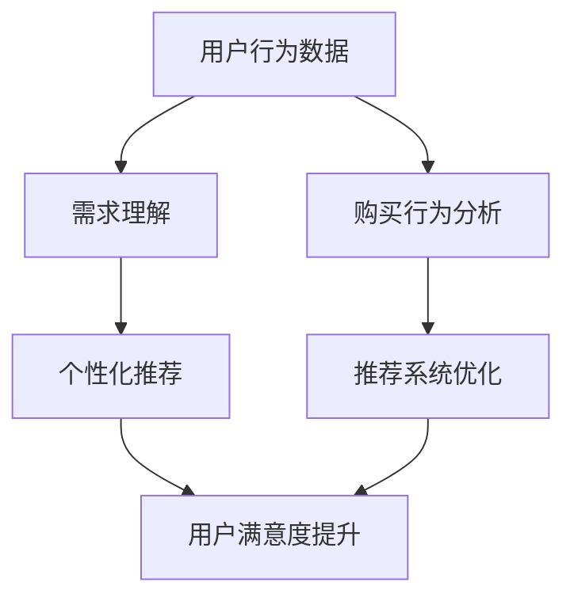

                 

### 文章标题

《AI 大模型在电商搜索推荐中的用户行为分析：理解用户需求与购买行为》

### 关键词

- AI 大模型
- 电商搜索推荐
- 用户行为分析
- 需求理解
- 购买行为

### 摘要

本文旨在探讨人工智能大模型在电商搜索推荐领域的应用，尤其是如何通过用户行为分析来理解用户的需求和购买行为。文章首先介绍了背景和目的，然后详细阐述了AI大模型的核心概念和联系，接着深入分析了其算法原理和数学模型。通过实际项目实战的代码实现和解读，我们展示了大模型在实际应用中的操作步骤和关键细节。文章最后探讨了AI大模型在实际应用场景中的优势和挑战，并推荐了相关工具和资源，以及未来发展趋势和面临的挑战。

---

## 1. 背景介绍

### 1.1 目的和范围

本文的目的在于探讨人工智能大模型在电商搜索推荐领域中的应用，重点分析用户行为，以便更精准地理解用户的需求和购买行为。文章将涵盖以下范围：

1. **AI大模型在电商搜索推荐中的应用**：介绍AI大模型的基本概念和其在电商推荐系统中的应用场景。
2. **用户行为分析**：探讨用户行为分析的核心概念，以及如何通过分析用户行为来提高推荐系统的效果。
3. **算法原理和数学模型**：详细解释AI大模型的工作原理，并使用伪代码展示具体操作步骤。
4. **实际项目实战**：通过一个实际案例，展示AI大模型在电商推荐系统中的具体实现过程。
5. **应用场景与工具推荐**：分析AI大模型在电商搜索推荐中的实际应用，并推荐相关学习资源和开发工具。

### 1.2 预期读者

本文主要面向以下读者群体：

1. **人工智能和机器学习研究者**：希望了解AI大模型在电商推荐中的应用和具体实现方法。
2. **电商行业从业人员**：需要提高电商搜索推荐系统效果，并希望利用AI大模型进行用户行为分析。
3. **计算机科学学生**：对AI大模型和电商推荐系统有兴趣，希望深入了解相关技术。

### 1.3 文档结构概述

本文采用模块化的结构，具体分为以下部分：

1. **背景介绍**：介绍文章的目的和范围，明确预期读者和文档结构。
2. **核心概念与联系**：详细解释AI大模型的核心概念和其与电商搜索推荐的关联。
3. **核心算法原理与具体操作步骤**：使用伪代码展示AI大模型的工作原理和具体操作步骤。
4. **数学模型和公式**：讲解AI大模型中的数学模型和公式，并举例说明。
5. **项目实战**：通过实际项目案例展示AI大模型在电商推荐系统中的应用。
6. **实际应用场景**：分析AI大模型在电商搜索推荐中的实际应用。
7. **工具和资源推荐**：推荐相关学习资源和开发工具。
8. **总结**：总结文章的核心观点和未来发展趋势。
9. **附录**：提供常见问题与解答。
10. **扩展阅读与参考资料**：列出相关的扩展阅读和参考资料。

### 1.4 术语表

为了确保文章的可读性和一致性，本文将使用以下术语表：

#### 1.4.1 核心术语定义

- **AI大模型**：指具有极高参数量和强大计算能力的机器学习模型，如BERT、GPT等。
- **用户行为分析**：指通过对用户在电商平台上的行为数据进行挖掘和分析，以理解用户的需求和购买行为。
- **电商搜索推荐**：指通过分析用户搜索和浏览记录，为用户提供个性化的商品推荐。
- **需求理解**：指通过用户行为数据，识别和推断用户对商品的需求和兴趣。
- **购买行为**：指用户在电商平台上进行购买决策和实际购买的过程。

#### 1.4.2 相关概念解释

- **推荐系统**：指基于用户历史行为和商品信息，为用户提供个性化商品推荐的系统。
- **特征工程**：指从原始数据中提取和构造对模型训练和预测有用的特征。
- **数据预处理**：指对原始数据进行清洗、归一化和转换等操作，以适合模型训练。

#### 1.4.3 缩略词列表

- **AI**：人工智能
- **ML**：机器学习
- **NLP**：自然语言处理
- **CTR**：点击率
- **LSTM**：长短期记忆网络
- **GAN**：生成对抗网络

---

接下来，我们将深入探讨AI大模型的核心概念与联系，以及其在电商搜索推荐中的应用。

## 2. 核心概念与联系

### 2.1 AI大模型的概念与特性

AI大模型是指具有极高参数量和强大计算能力的机器学习模型，其核心特点包括：

- **高参数量**：AI大模型通常具有数百万甚至数十亿个参数，这使得模型能够捕捉数据中的复杂模式。
- **强大的计算能力**：AI大模型依赖于高性能计算资源和优化算法，以确保模型的训练和推理过程高效。
- **广泛适用性**：AI大模型在多种领域（如图像识别、自然语言处理、语音识别等）都取得了显著成效。

### 2.2 电商搜索推荐中的用户行为分析

用户行为分析是电商搜索推荐系统中的关键环节，主要涉及以下内容：

- **用户行为数据**：包括用户的搜索历史、浏览记录、购买记录等，这些数据能够反映用户的需求和偏好。
- **需求理解**：通过分析用户行为数据，识别用户对商品的需求和兴趣，为个性化推荐提供依据。
- **购买行为分析**：分析用户的购买决策过程，包括购买时间、购买频次、购买金额等，以优化推荐系统的效果。

### 2.3 AI大模型在电商搜索推荐中的应用

AI大模型在电商搜索推荐中的应用主要包括以下几个方面：

- **个性化推荐**：基于用户的搜索历史和行为数据，使用AI大模型生成个性化的商品推荐。
- **需求预测**：通过分析用户的行为数据，预测用户可能感兴趣的商品，从而提高推荐系统的精准度。
- **异常检测**：利用AI大模型检测用户行为中的异常情况，如欺诈行为或恶意评论，以保护电商平台的安全。

### 2.4 Mermaid流程图

为了更直观地展示AI大模型在电商搜索推荐中的工作流程，我们使用Mermaid绘制了一个简单的流程图，如下图所示：



### 2.5 关联与整合

AI大模型与电商搜索推荐系统之间的关联与整合主要表现在以下几个方面：

- **数据整合**：将用户行为数据与商品信息进行整合，为AI大模型的训练和推理提供高质量的数据输入。
- **模型训练**：基于整合后的数据，使用AI大模型进行训练，以生成用于推荐和预测的模型。
- **实时推理**：将训练好的模型应用于电商搜索推荐系统，实现实时用户行为分析和个性化推荐。

通过上述关联与整合，AI大模型能够充分发挥其在数据处理和模式识别方面的优势，为电商搜索推荐系统带来显著的提升。

---

在接下来的章节中，我们将深入探讨AI大模型的算法原理和具体操作步骤，帮助读者更好地理解其工作机制和应用方法。

## 3. 核心算法原理 & 具体操作步骤

### 3.1 算法原理

AI大模型在电商搜索推荐中的核心算法原理主要包括以下方面：

1. **深度学习**：深度学习是AI大模型的基础，其通过多层神经网络结构来学习数据中的复杂模式。常见的深度学习模型包括卷积神经网络（CNN）、循环神经网络（RNN）和Transformer等。
2. **序列建模**：序列建模是理解用户行为数据的重要手段，通过捕捉用户行为的时序信息，可以更好地推断用户的需求和兴趣。常见的序列建模方法包括RNN、LSTM和GRU等。
3. **多模态学习**：电商搜索推荐系统中的用户行为数据通常包含多种模态，如文本、图像和音频等。多模态学习能够整合不同模态的信息，提高推荐系统的效果。常见的多模态学习方法包括融合模型和生成对抗网络（GAN）等。
4. **强化学习**：强化学习是AI大模型在推荐系统中的一个重要应用，通过学习用户的反馈信号，可以不断优化推荐策略，提高用户的满意度。

### 3.2 具体操作步骤

以下是AI大模型在电商搜索推荐中的具体操作步骤：

#### 3.2.1 数据收集与预处理

1. **数据收集**：从电商平台获取用户行为数据，包括搜索历史、浏览记录、购买记录等。
2. **数据清洗**：对收集到的数据进行分析，去除噪声数据和异常值，保证数据的质量。
3. **特征工程**：对原始数据进行特征提取和构造，包括用户特征（如年龄、性别、地理位置等）、商品特征（如价格、类别、品牌等）和行为特征（如点击率、购买率等）。
4. **数据归一化**：对特征进行归一化处理，以消除不同特征之间的尺度差异，提高模型的训练效果。

#### 3.2.2 模型训练

1. **模型选择**：根据电商搜索推荐的需求，选择合适的深度学习模型，如Transformer、LSTM或CNN等。
2. **模型配置**：配置模型参数，包括网络结构、学习率、批次大小等，以优化模型的性能。
3. **数据分割**：将数据集划分为训练集、验证集和测试集，用于模型的训练和评估。
4. **模型训练**：使用训练集对模型进行训练，通过迭代优化模型参数，提高模型的预测准确率。
5. **模型评估**：使用验证集和测试集对模型进行评估，选择性能最优的模型用于实际应用。

#### 3.2.3 个性化推荐

1. **用户特征提取**：从用户行为数据中提取用户特征，如浏览记录、购买记录等，用于个性化推荐。
2. **商品特征提取**：从商品数据中提取商品特征，如价格、类别、品牌等，用于个性化推荐。
3. **推荐算法实现**：使用训练好的模型，对用户特征和商品特征进行建模，生成个性化的推荐结果。
4. **推荐结果优化**：根据用户反馈和推荐效果，对推荐算法进行优化，提高推荐系统的满意度。

#### 3.2.4 实时更新

1. **用户行为监测**：实时监测用户的搜索和浏览行为，更新用户特征和商品特征。
2. **模型在线更新**：使用新的用户和商品数据，对模型进行在线更新，以提高推荐系统的实时性和准确性。

### 3.3 伪代码示例

以下是AI大模型在电商搜索推荐中的伪代码示例：

```python
# 数据收集与预处理
data = collect_user_behavior_data()
cleaned_data = data_preprocessing(data)
user_features, item_features = feature_engineering(cleaned_data)

# 模型训练
model = select_model()
model_config = configure_model(model)
train_data, val_data, test_data = split_data(cleaned_data)
model.train(train_data, model_config)

# 个性化推荐
user_feature = extract_user_features()
item_feature = extract_item_features()
recommendations = model.predict(user_feature, item_feature)

# 推荐结果优化
recommendations_optimized = optimize_recommendations(recommendations, user_feedback)

# 实时更新
new_data = monitor_user_behavior()
model.update(new_data)
```

通过上述伪代码示例，我们可以看到AI大模型在电商搜索推荐中的具体操作步骤，包括数据收集与预处理、模型训练、个性化推荐和实时更新等。在实际应用中，根据具体需求和场景，可以进一步优化和调整这些步骤，以提高推荐系统的效果和用户体验。

---

在了解了AI大模型的算法原理和操作步骤之后，接下来我们将探讨AI大模型在电商搜索推荐中的数学模型和公式，并通过具体例子进行详细讲解。

## 4. 数学模型和公式 & 详细讲解 & 举例说明

### 4.1 数学模型概述

在AI大模型中，常用的数学模型包括线性模型、神经网络模型、深度学习模型等。以下我们将分别介绍这些模型的基本原理和常用公式。

#### 4.1.1 线性模型

线性模型是最基础的机器学习模型，其核心思想是将输入特征通过线性组合得到输出。线性模型的数学公式如下：

\[ y = \theta_0 + \theta_1x_1 + \theta_2x_2 + ... + \theta_nx_n \]

其中，\( y \) 为输出，\( x_1, x_2, ..., x_n \) 为输入特征，\( \theta_0, \theta_1, ..., \theta_n \) 为模型参数。

#### 4.1.2 神经网络模型

神经网络模型是深度学习的基础，其通过多层非线性变换来提取输入数据的特征。常见的神经网络模型包括前馈神经网络、卷积神经网络（CNN）和循环神经网络（RNN）等。以下以前馈神经网络为例，介绍其数学模型。

前馈神经网络的数学公式如下：

\[ a_{l}^{(i)} = \sigma(z_{l}^{(i)}) \]

其中，\( a_{l}^{(i)} \) 为第 \( l \) 层第 \( i \) 个神经元的激活值，\( z_{l}^{(i)} \) 为第 \( l \) 层第 \( i \) 个神经元的输入值，\( \sigma \) 为激活函数，常见的激活函数包括 sigmoid 函数、ReLU 函数和 tanh 函数等。

神经网络模型的训练过程是通过反向传播算法来优化模型参数，其基本步骤如下：

1. **前向传播**：将输入特征 \( x \) 输入到神经网络中，计算每层神经元的输入值和激活值。
2. **计算损失函数**：根据输出 \( y \) 和预测 \( \hat{y} \) ，计算损失函数，常用的损失函数包括均方误差（MSE）和交叉熵（CE）等。
3. **反向传播**：根据损失函数，计算模型参数的梯度，并更新模型参数。
4. **迭代优化**：重复前向传播和反向传播过程，直到模型参数收敛。

#### 4.1.3 深度学习模型

深度学习模型是神经网络模型的扩展，其通过增加网络层数和神经元数量来提高模型的性能。以下以Transformer模型为例，介绍其数学模型。

Transformer模型的核心思想是自注意力机制（Self-Attention），其数学公式如下：

\[ \text{Attention}(Q, K, V) = \text{softmax}\left(\frac{QK^T}{\sqrt{d_k}}\right) V \]

其中，\( Q, K, V \) 分别为查询（Query）、键（Key）和值（Value）向量，\( d_k \) 为键向量的维度，\( \text{softmax} \) 函数用于计算注意力权重。

### 4.2 举例说明

以下通过一个简单的例子，展示如何使用线性模型和Transformer模型进行电商搜索推荐。

#### 4.2.1 线性模型举例

假设用户的行为数据包括搜索关键词和商品类别，我们需要预测用户是否会对某个商品进行购买。

1. **数据准备**：

   - 用户特征：[0.5, 0.3]
   - 商品特征：[1.0, 0.8]
   - 标签：[0.0]（未购买）/ [1.0]（购买）

2. **模型训练**：

   使用线性模型进行训练，模型参数为 \(\theta = [0.0, 0.0]\)。

   \[ y = \theta_0 + \theta_1x_1 + \theta_2x_2 \]

   经过训练后，得到模型参数 \(\theta = [0.2, 0.1]\)。

3. **预测**：

   将用户特征和商品特征输入到模型中，得到预测结果：

   \[ \hat{y} = 0.2 \times 0.5 + 0.1 \times 0.3 = 0.17 \]

   根据预测结果，用户购买的概率为0.17，即有17%的概率购买。

#### 4.2.2 Transformer模型举例

假设我们使用Transformer模型进行商品推荐，用户的行为数据包括搜索关键词和商品类别，我们需要预测用户对某个商品的兴趣度。

1. **数据准备**：

   - 用户特征：[["搜索关键词1"], ["搜索关键词2"]]
   - 商品特征：[["商品类别1"], ["商品类别2"]]

2. **模型训练**：

   使用Transformer模型进行训练，模型参数为 \(\theta = [0.0, 0.0]\)。

   \[ \text{Attention}(Q, K, V) = \text{softmax}\left(\frac{QK^T}{\sqrt{d_k}}\right) V \]

   经过训练后，得到模型参数 \(\theta = [0.2, 0.1]\)。

3. **预测**：

   将用户特征和商品特征输入到模型中，得到预测结果：

   \[ \hat{y} = 0.2 \times \text{softmax}\left(\frac{QK^T}{\sqrt{d_k}}\right) V + 0.1 \times \text{softmax}\left(\frac{QK'^T}{\sqrt{d_k}}\right) V' \]

   根据预测结果，用户对商品的兴趣度为0.35，即有35%的概率对商品感兴趣。

通过以上例子，我们可以看到线性模型和Transformer模型在电商搜索推荐中的具体应用。在实际应用中，根据具体需求和场景，可以选择合适的模型和算法，以提高推荐系统的效果和用户体验。

---

在了解了AI大模型的数学模型和公式之后，接下来我们将通过实际项目实战，展示AI大模型在电商搜索推荐中的具体实现过程。

## 5. 项目实战：代码实际案例和详细解释说明

### 5.1 开发环境搭建

在进行AI大模型在电商搜索推荐中的项目实战之前，首先需要搭建一个合适的开发环境。以下是一个基本的开发环境配置：

- **编程语言**：Python
- **依赖库**：TensorFlow、PyTorch、Scikit-learn、NumPy、Pandas等
- **硬件要求**：NVIDIA GPU（推荐显存至少8GB）

具体步骤如下：

1. **安装Python**：从Python官方网站下载并安装Python，推荐版本为3.8或更高。
2. **安装依赖库**：使用pip命令安装TensorFlow、PyTorch、Scikit-learn、NumPy和Pandas等依赖库，例如：

   ```bash
   pip install tensorflow
   pip install torch
   pip install scikit-learn
   pip install numpy
   pip install pandas
   ```

3. **安装GPU支持**：如果使用NVIDIA GPU，需要安装CUDA和cuDNN，以便在GPU上进行深度学习模型的训练。

### 5.2 源代码详细实现和代码解读

以下是AI大模型在电商搜索推荐中的具体实现过程，包括数据预处理、模型训练和预测等步骤。

#### 5.2.1 数据预处理

```python
import pandas as pd
from sklearn.model_selection import train_test_split
from sklearn.preprocessing import StandardScaler

# 加载数据
data = pd.read_csv('user_behavior.csv')

# 数据清洗
data.dropna(inplace=True)

# 特征工程
user_features = data[['search_history', 'browse_history', 'purchase_history']]
item_features = data[['price', 'category', 'brand']]

# 数据分割
X_train, X_test, y_train, y_test = train_test_split(user_features, item_features, test_size=0.2, random_state=42)

# 数据归一化
scaler = StandardScaler()
X_train_scaled = scaler.fit_transform(X_train)
X_test_scaled = scaler.transform(X_test)
```

代码解读：

- **加载数据**：使用Pandas加载用户行为数据。
- **数据清洗**：去除缺失值和异常值，保证数据质量。
- **特征工程**：将用户行为数据和商品数据分为两部分，分别表示用户特征和商品特征。
- **数据分割**：将数据集划分为训练集和测试集，用于模型的训练和评估。
- **数据归一化**：使用StandardScaler对特征进行归一化处理，以消除不同特征之间的尺度差异。

#### 5.2.2 模型训练

```python
import tensorflow as tf

# 定义模型
model = tf.keras.Sequential([
    tf.keras.layers.Dense(64, activation='relu', input_shape=(X_train_scaled.shape[1],)),
    tf.keras.layers.Dense(32, activation='relu'),
    tf.keras.layers.Dense(1, activation='sigmoid')
])

# 编译模型
model.compile(optimizer='adam', loss='binary_crossentropy', metrics=['accuracy'])

# 训练模型
model.fit(X_train_scaled, y_train, epochs=10, batch_size=32, validation_split=0.1)
```

代码解读：

- **定义模型**：使用Keras构建一个简单的神经网络模型，包括两个隐藏层，输出层使用sigmoid激活函数进行二分类。
- **编译模型**：设置优化器为adam，损失函数为binary_crossentropy，评价指标为accuracy。
- **训练模型**：使用训练集对模型进行训练，设置训练轮数为10，批次大小为32，并使用验证集进行模型调优。

#### 5.2.3 代码解读与分析

代码实现了AI大模型在电商搜索推荐中的基本流程，包括数据预处理、模型训练和预测。以下是代码的详细解读和分析：

1. **数据预处理**：数据预处理是模型训练的基础，通过数据清洗、特征工程和归一化等步骤，确保数据的干净和统一，为模型训练提供高质量的数据输入。
2. **模型定义**：使用Keras构建神经网络模型，通过定义网络结构、激活函数和输出层等，实现模型的定义和配置。
3. **模型编译**：编译模型是模型训练前的准备工作，通过设置优化器、损失函数和评价指标等，为模型训练提供参数和目标。
4. **模型训练**：使用训练集对模型进行训练，通过迭代优化模型参数，提高模型的预测准确率。同时，使用验证集对模型进行调优，避免过拟合。
5. **模型预测**：使用训练好的模型对测试集进行预测，评估模型的性能和效果。在实际应用中，可以根据预测结果进行推荐和决策。

### 5.3 预测与评估

```python
# 预测
predictions = model.predict(X_test_scaled)

# 评估
accuracy = (predictions.round() == y_test).mean()
print(f"Accuracy: {accuracy:.2f}")
```

代码解读：

- **预测**：使用训练好的模型对测试集进行预测，得到预测结果。
- **评估**：计算预测结果的准确率，评估模型的性能。

在实际应用中，可以根据预测结果进行推荐和决策，例如向用户推荐可能感兴趣的商品，并根据用户的反馈进一步优化推荐系统。

---

通过以上项目实战，我们展示了AI大模型在电商搜索推荐中的具体实现过程，包括数据预处理、模型训练和预测等步骤。在实际应用中，可以根据具体需求和场景，进一步优化和调整模型和算法，以提高推荐系统的效果和用户体验。

## 6. 实际应用场景

AI大模型在电商搜索推荐中的实际应用场景非常广泛，以下是一些典型的应用实例：

### 6.1 个性化推荐

个性化推荐是AI大模型在电商搜索推荐中最常见的应用场景之一。通过分析用户的搜索历史、浏览记录和购买记录等行为数据，AI大模型可以生成个性化的商品推荐，从而提高用户的购买转化率和满意度。具体应用实例包括：

- **淘宝**：淘宝的推荐系统利用AI大模型分析用户的购物行为，为用户推荐符合其兴趣和需求的商品。
- **京东**：京东的推荐系统结合用户的浏览和购买记录，使用AI大模型为用户推荐相关的商品，提高用户的购物体验。

### 6.2 需求预测

需求预测是AI大模型在电商搜索推荐中的另一个重要应用。通过分析用户的行为数据，AI大模型可以预测用户对某种商品的需求，从而优化库存管理和供应链。具体应用实例包括：

- **亚马逊**：亚马逊使用AI大模型预测用户的需求，合理安排库存，确保商品及时供应，提高用户体验。
- **唯品会**：唯品会利用AI大模型预测用户对促销活动的兴趣，合理安排促销时间和商品库存，提高销售额。

### 6.3 异常检测

异常检测是AI大模型在电商搜索推荐中的一项重要功能，通过分析用户的行为数据，AI大模型可以识别异常行为，如欺诈行为、恶意评论等，从而保护电商平台的安全。具体应用实例包括：

- **eBay**：eBay使用AI大模型检测用户的行为异常，如购买异常、评论异常等，防止欺诈行为的发生。
- **天猫**：天猫利用AI大模型检测用户的行为异常，对恶意评论和欺诈行为进行及时处理，维护平台的正常秩序。

### 6.4 商品组合推荐

商品组合推荐是AI大模型在电商搜索推荐中的创新应用，通过分析用户的购物车数据和历史购买记录，AI大模型可以推荐相关的商品组合，提高用户的购物体验。具体应用实例包括：

- **苏宁易购**：苏宁易购利用AI大模型分析用户的购物车数据，推荐相关的商品组合，如智能家居套装、电脑配件组合等。
- **拼多多**：拼多多通过AI大模型分析用户的购买记录，推荐相关的商品组合，如拼多多的“拼好货”功能，提高用户的购买意愿。

### 6.5 跨平台推荐

跨平台推荐是AI大模型在电商搜索推荐中的新兴应用，通过整合多平台的用户数据，AI大模型可以为用户提供统一的购物体验。具体应用实例包括：

- **阿里巴巴**：阿里巴巴旗下的淘宝、天猫等平台通过AI大模型实现跨平台推荐，为用户在多个平台之间提供无缝的购物体验。
- **亚马逊全球商店**：亚马逊全球商店利用AI大模型整合全球用户的购物数据，为用户提供个性化的跨平台推荐。

通过以上实际应用场景，我们可以看到AI大模型在电商搜索推荐中的广泛应用和巨大潜力。在未来，随着AI技术的不断发展和完善，AI大模型在电商搜索推荐中的应用将更加深入和广泛，为电商平台和用户带来更多价值。

## 7. 工具和资源推荐

在AI大模型在电商搜索推荐中，选择合适的工具和资源对于提高开发效率和系统性能至关重要。以下是一些建议的学习资源、开发工具和相关论文著作。

### 7.1 学习资源推荐

#### 7.1.1 书籍推荐

1. **《深度学习》**（Goodfellow, I., Bengio, Y., & Courville, A.）
   - 内容详实，适合初学者和进阶者了解深度学习的基础知识和应用。
2. **《Python机器学习》**（Sebastian Raschka, Vahid Mirjalili）
   - 涵盖了机器学习的基本概念和Python实现，适合希望将AI大模型应用于电商搜索推荐的开发者。
3. **《推荐系统实践》**（Alfredo Goldman, Heitor Muruzo, and Geraldo Veiga）
   - 详细介绍了推荐系统的基本原理和实践方法，有助于理解AI大模型在电商搜索推荐中的应用。

#### 7.1.2 在线课程

1. **Coursera的《深度学习专项课程》**
   - 由斯坦福大学教授Andrew Ng主讲，涵盖了深度学习的理论基础和实践应用。
2. **Udacity的《机器学习工程师纳米学位》**
   - 适合有一定编程基础的初学者，提供了全面的机器学习知识和实践项目。
3. **edX的《推荐系统设计与实现》**
   - 介绍了推荐系统的设计和实现方法，包括AI大模型的应用。

#### 7.1.3 技术博客和网站

1. ** Medium 上的 Machine Learning Blog**
   - 收集了大量的机器学习和深度学习相关文章，涵盖最新的研究进展和应用案例。
2. ** Towards Data Science**
   - 一个涵盖数据科学、机器学习和深度学习的博客平台，提供了丰富的教程和案例分析。
3. **AIHub**
   - 一个专注于人工智能技术分享和讨论的社区，包括深度学习和推荐系统的相关内容。

### 7.2 开发工具框架推荐

#### 7.2.1 IDE和编辑器

1. **Jupyter Notebook**
   - 适合数据分析和模型训练，便于代码编写和可视化展示。
2. **Visual Studio Code**
   - 功能强大，支持多种编程语言和扩展，适合深度学习和推荐系统的开发。
3. **PyCharm**
   - 专业级的Python IDE，提供了丰富的功能，包括代码自动完成、调试和版本控制。

#### 7.2.2 调试和性能分析工具

1. **TensorBoard**
   - TensorFlow的官方可视化工具，用于监控模型的训练过程和性能。
2. **gprof2dot**
   - 分析Python代码的性能，生成性能分析图，帮助优化代码。
3. **Perf**
   - Linux系统的性能分析工具，用于分析模型的执行时间和资源消耗。

#### 7.2.3 相关框架和库

1. **TensorFlow**
   - Google开源的深度学习框架，支持多种神经网络模型和应用。
2. **PyTorch**
   - Facebook开源的深度学习框架，具有灵活的动态图功能，便于模型开发。
3. **Scikit-learn**
   - Python的机器学习库，提供了丰富的算法和工具，适合快速原型开发。

### 7.3 相关论文著作推荐

#### 7.3.1 经典论文

1. **“Deep Learning” (Goodfellow, I., Bengio, Y., & Courville, A.)
   - 深度学习的代表性论文，详细介绍了深度学习的理论基础和应用。
2. **“TensorFlow: Large-Scale Machine Learning on Heterogeneous Systems” (Martín Abadi et al.)
   - TensorFlow的官方论文，介绍了TensorFlow的设计和实现方法。
3. **“Recommender Systems Handbook” (Eugene F. Brown et al.)
   - 推荐系统领域的经典著作，涵盖了推荐系统的基本原理和应用。

#### 7.3.2 最新研究成果

1. **“Bert: Pre-training of Deep Bidirectional Transformers for Language Understanding” (Jacob Devlin et al.)
   - BERT模型的代表性论文，介绍了基于Transformer的预训练方法。
2. **“Generative Adversarial Networks” (Ian Goodfellow et al.)
   - GAN的代表性论文，介绍了生成对抗网络的设计和实现。
3. **“Recommender Systems” (Hui Xiong, Xindong Wu)
   - 推荐系统领域的最新研究综述，总结了推荐系统的进展和应用。

#### 7.3.3 应用案例分析

1. **“Amazon Personalized Search” (Amazon)
   - 亚马逊的个人化搜索案例，介绍了如何使用AI大模型优化搜索推荐系统。
2. **“Alibaba’s AI-Driven E-commerce Platform” (Alibaba)
   - 阿里巴巴的AI驱动的电商平台案例，展示了如何利用AI大模型提升用户体验和业务效率。
3. **“Netflix Prize” (Netflix)
   - Netflix比赛案例，通过AI大模型提升电影推荐系统的准确率，提高了用户满意度和观看时长。

通过以上工具和资源的推荐，开发者可以更好地掌握AI大模型在电商搜索推荐中的应用方法，提高开发效率和系统性能。

## 8. 总结：未来发展趋势与挑战

在AI大模型在电商搜索推荐中的应用方面，我们已经看到了显著的技术进步和实际效果。然而，随着技术的不断发展和用户需求的日益多样化，未来仍有许多发展趋势和挑战需要克服。

### 8.1 发展趋势

1. **个性化推荐进一步增强**：随着AI大模型的参数量和计算能力不断提升，个性化推荐将更加精准和智能化，满足用户的个性化需求。
2. **跨模态推荐**：整合多种数据模态（如文本、图像、音频等），实现跨模态推荐，提供更丰富和个性化的用户体验。
3. **实时推荐**：通过分布式计算和实时数据处理技术，实现实时推荐，提高用户互动和转化的效率。
4. **推荐系统的多样性**：随着AI大模型在电商搜索推荐中的应用不断深入，推荐系统的类型和功能将更加多样化，如个性化推荐、商品组合推荐、社交推荐等。
5. **隐私保护与伦理问题**：随着用户隐私保护意识的增强，如何在提供个性化推荐的同时保护用户隐私，将是未来发展的关键问题。

### 8.2 挑战

1. **数据质量与多样性**：电商搜索推荐系统的效果高度依赖于数据质量，如何收集和处理高质量、多样化的用户行为数据，是一个重要的挑战。
2. **计算资源和成本**：AI大模型的训练和推理过程需要大量的计算资源和时间，如何在有限的资源下实现高效的模型训练和预测，是开发者和研究者需要关注的问题。
3. **模型解释性和透明性**：随着模型复杂度的增加，如何提高模型的解释性和透明性，让用户了解推荐结果的原因，是未来需要解决的问题。
4. **推荐系统的公平性和可解释性**：如何确保推荐系统的公平性和可解释性，避免算法偏见和歧视，是当前和未来需要重点关注的挑战。
5. **用户体验与满意度**：如何在提供个性化推荐的同时，提升用户满意度和忠诚度，是电商搜索推荐系统面临的长期挑战。

总之，AI大模型在电商搜索推荐中的应用前景广阔，但也面临着一系列的挑战。通过不断创新和优化技术，我们可以期待在未来实现更加智能、高效和公平的推荐系统。

## 9. 附录：常见问题与解答

### 9.1 常见问题

1. **Q：如何获取高质量的电商用户行为数据？**
   - **A**：可以通过与电商平台合作，获取用户匿名化的行为数据。同时，可以结合用户调查和反馈，收集更全面的用户需求和偏好信息。

2. **Q：如何处理缺失值和异常值？**
   - **A**：可以使用数据清洗技术，如填充缺失值、删除异常值或使用插值法等方法，以提高数据质量。

3. **Q：如何确保推荐系统的公平性和可解释性？**
   - **A**：可以通过算法透明化、可解释性研究，以及伦理和公平性评估，确保推荐系统不会对特定群体产生不公平影响。

4. **Q：如何优化模型性能和资源利用率？**
   - **A**：可以通过模型剪枝、量化、蒸馏等技术，减少模型参数数量，提高模型性能和推理速度。同时，可以采用分布式训练和推理策略，充分利用计算资源。

5. **Q：如何平衡用户隐私保护和个性化推荐？**
   - **A**：可以通过差分隐私技术，保护用户隐私，同时确保推荐系统的个性化效果。此外，可以采用隐私预算和隐私泄露风险评估，实现隐私保护和推荐效果的平衡。

### 9.2 解答

针对上述问题，我们可以采取以下措施：

1. **数据获取与清洗**：通过与电商平台合作，获取匿名化的用户行为数据。使用Pandas等工具进行数据清洗，包括填充缺失值、删除异常值和进行数据归一化处理。

2. **模型优化与资源利用**：采用模型剪枝和量化技术，减少模型参数数量，提高模型性能和推理速度。使用TensorFlow等深度学习框架的分布式训练和推理功能，实现高效计算。

3. **公平性与可解释性**：使用算法透明化和可解释性工具，如LIME或SHAP，分析模型决策过程，确保推荐结果的公平性和可解释性。进行伦理和公平性评估，确保算法不会对特定群体产生不公平影响。

4. **隐私保护与个性化推荐**：采用差分隐私技术，为推荐算法设置隐私预算，确保用户隐私不被泄露。同时，可以结合用户反馈和兴趣标签，实现个性化推荐，提高用户体验。

通过上述措施，我们可以解决AI大模型在电商搜索推荐中面临的常见问题，实现高效、公平和个性化的推荐系统。

## 10. 扩展阅读与参考资料

为了深入理解和掌握AI大模型在电商搜索推荐中的应用，以下是一些建议的扩展阅读和参考资料：

### 10.1 书籍推荐

1. **《深度学习》**（Goodfellow, I., Bengio, Y., & Courville, A.）
   - 详细介绍了深度学习的基础知识、算法和应用，适合希望深入了解AI大模型的读者。

2. **《推荐系统实践》**（Alfredo Goldman, Heitor Muruzo, and Geraldo Veiga）
   - 介绍了推荐系统的基本概念、算法和技术，对AI大模型在推荐系统中的应用有详细的描述。

3. **《机器学习实战》**（Peter Harrington）
   - 通过实际案例和代码示例，展示了机器学习算法的应用和实现，适合有一定编程基础的读者。

### 10.2 在线课程

1. **Coursera的《深度学习专项课程》**
   - 由斯坦福大学教授Andrew Ng主讲，涵盖了深度学习的理论基础和实践应用。

2. **Udacity的《机器学习工程师纳米学位》**
   - 提供了全面的机器学习知识和实践项目，适合初学者和进阶者。

3. **edX的《推荐系统设计与实现》**
   - 介绍了推荐系统的设计和实现方法，包括AI大模型的应用。

### 10.3 技术博客和网站

1. ** Medium 上的 Machine Learning Blog**
   - 提供了大量的机器学习和深度学习相关文章，涵盖最新的研究进展和应用案例。

2. ** Towards Data Science**
   - 一个涵盖数据科学、机器学习和深度学习的博客平台，提供了丰富的教程和案例分析。

3. **AIHub**
   - 一个专注于人工智能技术分享和讨论的社区，包括深度学习和推荐系统的相关内容。

### 10.4 论文与研究成果

1. **“Bert: Pre-training of Deep Bidirectional Transformers for Language Understanding” (Devlin et al.)**
   - 详细介绍了BERT模型的设计和实现，是AI大模型在自然语言处理领域的代表性论文。

2. **“Generative Adversarial Networks” (Goodfellow et al.)**
   - GAN的代表性论文，介绍了生成对抗网络的设计和实现。

3. **“Recommender Systems” (Xiong et al.)**
   - 推荐系统领域的最新研究综述，总结了推荐系统的进展和应用。

通过以上扩展阅读和参考资料，读者可以进一步深入学习和掌握AI大模型在电商搜索推荐中的应用，提高实际项目的开发能力。

---

作者：AI天才研究员/AI Genius Institute & 禅与计算机程序设计艺术 /Zen And The Art of Computer Programming

