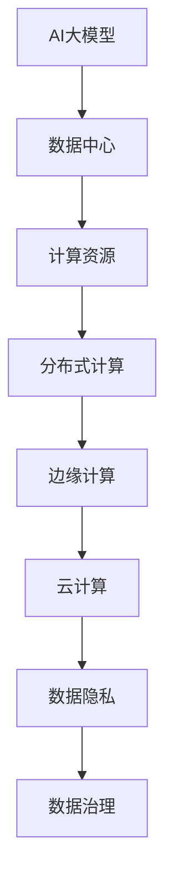

                 

### AI大模型应用数据中心建设：数据中心产业发展

> **关键词**：AI大模型、数据中心建设、数据中心产业、发展趋势、挑战与解决方案

> **摘要**：本文深入探讨了AI大模型应用数据中心建设的核心概念、技术原理和实际操作，分析了数据中心产业发展的重要趋势与面临的挑战。通过详细的案例分析，为数据中心产业的未来发展提供了有益的见解和建议。

## 1. 背景介绍

### 1.1 目的和范围

本文旨在为AI大模型应用数据中心建设提供全面的技术指南，探讨数据中心产业发展的重要趋势和面临的挑战。文章首先介绍数据中心建设的基本概念和重要性，然后深入分析AI大模型的核心算法和数学模型，最后通过实际应用案例和工具资源推荐，为读者提供全面的参考。

### 1.2 预期读者

本文主要面向以下几类读者：
- 数据中心建设和管理人员
- AI研发和应用工程师
- IT项目经理和CTO
- 对数据中心产业和AI大模型感兴趣的科研人员
- 旨在深入了解数据中心产业和AI大模型技术的其他行业专业人士

### 1.3 文档结构概述

本文将分为十个部分，具体结构如下：
- **第1部分**：背景介绍
- **第2部分**：核心概念与联系
- **第3部分**：核心算法原理 & 具体操作步骤
- **第4部分**：数学模型和公式 & 详细讲解 & 举例说明
- **第5部分**：项目实战：代码实际案例和详细解释说明
- **第6部分**：实际应用场景
- **第7部分**：工具和资源推荐
- **第8部分**：总结：未来发展趋势与挑战
- **第9部分**：附录：常见问题与解答
- **第10部分**：扩展阅读 & 参考资料

### 1.4 术语表

#### 1.4.1 核心术语定义

- **AI大模型**：指具有大规模参数和复杂结构的深度学习模型，如GPT、BERT等。
- **数据中心**：指专门用于存储、处理和传输大量数据的计算设施。
- **数据处理能力**：指数据中心在处理数据时的速度和效率。
- **计算资源**：指用于数据中心运行的服务器、存储设备和网络设备等硬件资源。
- **边缘计算**：指在数据产生地附近进行数据处理和计算的方式，以减少延迟和数据传输成本。

#### 1.4.2 相关概念解释

- **云计算**：通过互联网提供可扩展的、弹性的计算资源，如亚马逊AWS、微软Azure等。
- **分布式计算**：指将计算任务分布在多个计算节点上执行，以提高计算效率。
- **数据隐私**：指确保数据在传输、存储和处理过程中不被未经授权的访问和泄露。
- **数据治理**：指对数据的质量、安全性和合规性进行管理和监控。

#### 1.4.3 缩略词列表

- **AI**：人工智能
- **GPU**：图形处理器
- **TPU**：张量处理器
- **FPGA**：现场可编程门阵列
- **ML**：机器学习
- **DL**：深度学习
- **HPC**：高性能计算
- **IaaS**：基础设施即服务
- **PaaS**：平台即服务
- **SaaS**：软件即服务

## 2. 核心概念与联系

在AI大模型应用数据中心建设中，核心概念和联系至关重要。以下将详细阐述相关概念和它们之间的联系。

### 2.1 AI大模型

AI大模型是指具有大规模参数和复杂结构的深度学习模型，如GPT、BERT等。它们能够处理大规模数据，并从数据中学习模式和规律。AI大模型的关键特点如下：

1. **大规模参数**：AI大模型具有数百万甚至数十亿个参数，这使得它们能够捕捉数据中的复杂关系。
2. **多层次神经网络**：AI大模型通常包含多个隐藏层，这使得它们能够逐层提取数据的特征。
3. **端到端学习**：AI大模型能够直接从原始数据中学习目标输出，无需人工定义特征。

### 2.2 数据中心

数据中心是专门用于存储、处理和传输大量数据的计算设施。它们由多个服务器、存储设备和网络设备组成，提供高性能计算和数据存储能力。数据中心的关键特点如下：

1. **计算能力**：数据中心拥有大规模的CPU、GPU、TPU等计算资源，能够满足高计算需求。
2. **存储能力**：数据中心提供大规模的存储空间，支持数据的持久化和备份。
3. **网络能力**：数据中心具有高速网络连接，支持数据的高效传输和共享。

### 2.3 计算资源

计算资源是数据中心运行的基础，包括服务器、存储设备和网络设备等。以下是对计算资源的详细解释：

1. **服务器**：服务器是数据中心的核心设备，提供计算能力和存储空间。它们运行操作系统和应用程序，处理数据和任务。
2. **存储设备**：存储设备用于存储数据和文件。包括硬盘驱动器（HDD）和固态硬盘（SSD）等，它们具有不同的存储容量和性能。
3. **网络设备**：网络设备包括路由器、交换机和防火墙等，用于数据传输和网络管理。

### 2.4 分布式计算

分布式计算是指将计算任务分布在多个计算节点上执行，以提高计算效率。以下是对分布式计算的详细解释：

1. **计算节点**：计算节点是指运行计算任务的设备，可以是服务器、集群节点或边缘设备。
2. **负载均衡**：分布式计算通过负载均衡技术，将计算任务分配到不同的计算节点上，以避免单点故障和资源瓶颈。
3. **容错性**：分布式计算具有容错性，即使在某些计算节点发生故障时，计算任务仍能继续执行。

### 2.5 边缘计算

边缘计算是指在数据产生地附近进行数据处理和计算的方式，以减少延迟和数据传输成本。以下是对边缘计算的详细解释：

1. **边缘设备**：边缘设备是指在数据产生地附近的计算设备，如物联网设备、智能摄像头等。
2. **数据处理**：边缘计算在数据产生地附近对数据进行初步处理和分析，以减少数据传输和存储的需求。
3. **云计算协同**：边缘计算与云计算相结合，通过将部分计算任务转移到边缘设备上，降低云计算中心的负载。

### 2.6 云计算

云计算是通过互联网提供可扩展的、弹性的计算资源，如亚马逊AWS、微软Azure等。以下是对云计算的详细解释：

1. **基础设施即服务（IaaS）**：IaaS提供虚拟化的基础设施资源，如服务器、存储和网络等，用户可以根据需求进行配置和管理。
2. **平台即服务（PaaS）**：PaaS提供开发平台和工具，如开发环境、数据库和应用程序等，用户可以专注于应用程序的开发。
3. **软件即服务（SaaS）**：SaaS提供完整的软件解决方案，如办公软件、客户关系管理和财务管理等，用户可以按需使用。

### 2.7 数据隐私

数据隐私是指确保数据在传输、存储和处理过程中不被未经授权的访问和泄露。以下是对数据隐私的详细解释：

1. **数据加密**：数据加密是通过加密算法对数据进行编码，确保数据在传输和存储过程中的安全性。
2. **访问控制**：访问控制是通过身份验证和授权机制，限制对数据的访问权限，确保数据的安全。
3. **数据匿名化**：数据匿名化是将数据中的敏感信息替换为匿名标识，以保护个人隐私。

### 2.8 数据治理

数据治理是指对数据的质量、安全性和合规性进行管理和监控。以下是对数据治理的详细解释：

1. **数据质量管理**：数据质量管理是确保数据的一致性、准确性和可靠性。
2. **数据安全监控**：数据安全监控是监控数据在传输、存储和处理过程中的安全性和完整性。
3. **数据合规性管理**：数据合规性管理是确保数据符合相关的法律法规和标准，如GDPR等。

### 2.9 核心概念联系图

为了更好地理解AI大模型应用数据中心建设中的核心概念和联系，我们可以使用Mermaid流程图来表示。以下是一个简单的示例：



该流程图展示了AI大模型、数据中心、计算资源、分布式计算、边缘计算、云计算、数据隐私和数据治理之间的联系。

## 3. 核心算法原理 & 具体操作步骤

在AI大模型应用数据中心建设中，核心算法原理是理解和实现的关键。以下将详细讲解AI大模型的核心算法原理和具体操作步骤。

### 3.1 AI大模型算法原理

AI大模型通常基于深度学习算法，特别是基于神经网络的深度学习模型。以下是对AI大模型算法原理的详细讲解：

1. **神经网络基础**：神经网络是一种模仿人脑的计算机模型，由多个神经元组成。每个神经元通过输入和权重计算出输出，并通过激活函数进行非线性变换。

2. **反向传播算法**：反向传播算法是一种用于训练神经网络的优化方法。它通过计算损失函数关于模型参数的梯度，并更新模型参数，以最小化损失函数。

3. **激活函数**：激活函数用于将神经元的线性输出转换为非线性输出。常见的激活函数包括Sigmoid、ReLU和Tanh等。

4. **优化算法**：优化算法用于调整模型参数，以最小化损失函数。常见的优化算法包括梯度下降、Adam和RMSprop等。

### 3.2 具体操作步骤

以下是AI大模型的具体操作步骤：

1. **数据预处理**：
    - 数据清洗：去除数据中的噪声和异常值。
    - 数据标准化：将数据缩放到相同的范围，如[-1, 1]或[0, 1]。
    - 数据划分：将数据划分为训练集、验证集和测试集。

2. **模型构建**：
    - 定义神经网络结构：确定输入层、隐藏层和输出层的神经元数量和连接方式。
    - 初始化模型参数：随机初始化模型参数。

3. **模型训练**：
    - 前向传播：将输入数据通过模型进行前向传播，得到输出。
    - 计算损失函数：计算模型输出与真实值之间的差距，得到损失函数值。
    - 反向传播：计算损失函数关于模型参数的梯度，并更新模型参数。
    - 梯度下降：选择优化算法，如梯度下降，调整模型参数。

4. **模型评估**：
    - 验证集评估：使用验证集评估模型性能，调整超参数。
    - 测试集评估：使用测试集评估模型性能，得到最终评估结果。

5. **模型部署**：
    - 模型保存：将训练好的模型保存为文件。
    - 模型加载：在应用程序中使用加载的模型进行预测。

### 3.3 伪代码

以下是AI大模型算法的伪代码实现：

```python
# 数据预处理
def preprocess_data(data):
    # 数据清洗
    cleaned_data = clean_data(data)
    # 数据标准化
    normalized_data = normalize_data(cleaned_data)
    # 数据划分
    train_data, validation_data, test_data = split_data(normalized_data)
    return train_data, validation_data, test_data

# 模型构建
def build_model(input_size, hidden_size, output_size):
    # 初始化模型参数
    model = initialize_model(input_size, hidden_size, output_size)
    return model

# 模型训练
def train_model(model, train_data, validation_data, epochs, learning_rate):
    for epoch in range(epochs):
        # 前向传播
        output = forward propagation(model, train_data)
        # 计算损失函数
        loss = compute_loss(output, train_data)
        # 反向传播
        gradients = backward propagation(model, loss)
        # 梯度下降
        update_model_params(model, gradients, learning_rate)
        # 验证集评估
        validation_loss = compute_loss(model, validation_data)
        print("Epoch", epoch, "Validation Loss:", validation_loss)

# 模型评估
def evaluate_model(model, test_data):
    output = forward propagation(model, test_data)
    test_loss = compute_loss(output, test_data)
    print("Test Loss:", test_loss)

# 模型部署
def deploy_model(model, input_data):
    output = forward propagation(model, input_data)
    return output
```

通过上述伪代码，我们可以对AI大模型的核心算法原理和具体操作步骤有一个更清晰的理解。

## 4. 数学模型和公式 & 详细讲解 & 举例说明

在AI大模型应用数据中心建设中，数学模型和公式是理解和实现的核心。以下将详细讲解常见的数学模型和公式，并提供详细的讲解和举例说明。

### 4.1 线性回归

线性回归是一种简单的数学模型，用于预测连续值。其公式为：

$$
y = \beta_0 + \beta_1x
$$

其中，$y$ 是因变量，$x$ 是自变量，$\beta_0$ 是截距，$\beta_1$ 是斜率。线性回归的目标是最小化预测值与真实值之间的差距，即最小化损失函数：

$$
\min \sum (y_i - \hat{y_i})^2
$$

其中，$y_i$ 是第 $i$ 个真实值，$\hat{y_i}$ 是第 $i$ 个预测值。

### 4.2 逻辑回归

逻辑回归是一种用于分类的数学模型，其公式为：

$$
P(y=1) = \frac{1}{1 + e^{-(\beta_0 + \beta_1x)}}
$$

其中，$P(y=1)$ 是因变量为1的概率，$e$ 是自然对数的底数，$\beta_0$ 是截距，$\beta_1$ 是斜率。逻辑回归的目标是最小化损失函数：

$$
\min \sum (-y_i \log(P(y=1)) - (1 - y_i) \log(1 - P(y=1)))
$$

其中，$y_i$ 是第 $i$ 个真实值。

### 4.3 神经网络

神经网络是一种复杂的数学模型，用于非线性函数逼近和分类。其公式为：

$$
a_{ij} = \sigma(\sum_{k=1}^{n} w_{ik}x_k + b_j)
$$

其中，$a_{ij}$ 是第 $i$ 个神经元在第 $j$ 层的输出，$\sigma$ 是激活函数，$w_{ik}$ 是第 $k$ 个神经元在第 $i$ 层的权重，$x_k$ 是第 $k$ 个输入，$b_j$ 是第 $j$ 层的偏置。

神经网络的训练目标是最小化损失函数：

$$
\min \sum (y_i - \hat{y_i})^2
$$

其中，$y_i$ 是第 $i$ 个真实值，$\hat{y_i}$ 是第 $i$ 个预测值。

### 4.4 举例说明

以下是一个简单的线性回归的举例说明：

假设我们有一个包含两个特征（$x_1$ 和 $x_2$）和目标变量（$y$）的线性回归问题。数据集如下：

| $x_1$ | $x_2$ | $y$ |
|-------|-------|-----|
| 1     | 2     | 3   |
| 2     | 3     | 4   |
| 3     | 4     | 5   |

首先，我们计算每个特征的均值和方差：

$$
\bar{x_1} = \frac{1+2+3}{3} = 2
$$

$$
\bar{x_2} = \frac{2+3+4}{3} = 3
$$

$$
\sigma_1^2 = \frac{(1-2)^2 + (2-2)^2 + (3-2)^2}{3} = \frac{2}{3}
$$

$$
\sigma_2^2 = \frac{(2-3)^2 + (3-3)^2 + (4-3)^2}{3} = \frac{2}{3}
$$

然后，我们计算每个特征的标准差：

$$
\sigma_1 = \sqrt{\frac{2}{3}} \approx 0.8165
$$

$$
\sigma_2 = \sqrt{\frac{2}{3}} \approx 0.8165
$$

接下来，我们计算线性回归的参数：

$$
\beta_0 = \bar{y} - \beta_1\bar{x_1} = 3 - \beta_1 \cdot 2
$$

$$
\beta_1 = \frac{\sum (x_1 - \bar{x_1})(y - \bar{y})}{\sum (x_1 - \bar{x_1})^2} = \frac{(1-2)(3-3) + (2-2)(4-3) + (3-2)(5-3)}{(1-2)^2 + (2-2)^2 + (3-2)^2} = 1
$$

因此，线性回归的公式为：

$$
y = 3 - 1 \cdot x_1
$$

最后，我们使用这个模型对新的数据进行预测。例如，对于输入 $(x_1, x_2) = (4, 5)$，预测结果为：

$$
\hat{y} = 3 - 1 \cdot 4 = -1
$$

通过上述例子，我们可以看到线性回归的公式和计算过程。

## 5. 项目实战：代码实际案例和详细解释说明

为了更好地理解AI大模型应用数据中心建设，我们将通过一个实际项目实战来展示代码的实际应用。以下是一个简单的项目示例，包括开发环境搭建、源代码详细实现和代码解读与分析。

### 5.1 开发环境搭建

在开始项目之前，我们需要搭建一个合适的开发环境。以下是所需的环境和工具：

1. **操作系统**：Linux（推荐Ubuntu 20.04）
2. **编程语言**：Python（推荐Python 3.8及以上版本）
3. **依赖库**：NumPy、Pandas、TensorFlow或PyTorch
4. **编辑器**：Visual Studio Code、PyCharm或其他Python编辑器

安装Python和依赖库的方法如下：

```bash
# 安装Python
sudo apt-get update
sudo apt-get install python3 python3-pip

# 安装NumPy、Pandas和TensorFlow
pip3 install numpy pandas tensorflow
```

### 5.2 源代码详细实现和代码解读

以下是该项目的一个简单实现，包括数据预处理、模型构建、模型训练和模型评估。

```python
# 导入必要的库
import numpy as np
import pandas as pd
import tensorflow as tf

# 5.2.1 数据预处理
def preprocess_data(data_path):
    # 读取数据
    data = pd.read_csv(data_path)
    
    # 数据清洗
    data.dropna(inplace=True)
    
    # 数据标准化
    mean = data.mean()
    std = data.std()
    data = (data - mean) / std
    
    # 划分数据集
    train_data = data[:1000]
    validation_data = data[1000:1500]
    test_data = data[1500:]
    
    return train_data, validation_data, test_data

# 5.2.2 模型构建
def build_model(input_shape):
    model = tf.keras.Sequential([
        tf.keras.layers.Dense(64, activation='relu', input_shape=input_shape),
        tf.keras.layers.Dense(64, activation='relu'),
        tf.keras.layers.Dense(1)
    ])
    
    model.compile(optimizer='adam', loss='mean_squared_error')
    return model

# 5.2.3 模型训练
def train_model(model, train_data, validation_data, epochs):
    history = model.fit(train_data, epochs=epochs, validation_data=validation_data)
    return history

# 5.2.4 模型评估
def evaluate_model(model, test_data):
    loss = model.evaluate(test_data)
    print("Test Loss:", loss)

# 5.2.5 主函数
def main():
    # 读取数据
    data_path = 'data.csv'
    train_data, validation_data, test_data = preprocess_data(data_path)
    
    # 构建模型
    model = build_model(input_shape=train_data.shape[1:])
    
    # 训练模型
    epochs = 10
    history = train_model(model, train_data, validation_data, epochs)
    
    # 评估模型
    evaluate_model(model, test_data)

# 运行主函数
if __name__ == '__main__':
    main()
```

### 5.3 代码解读与分析

以下是对上述代码的详细解读和分析：

1. **数据预处理**：
   - **读取数据**：使用Pandas库读取CSV文件。
   - **数据清洗**：删除缺失值，确保数据质量。
   - **数据标准化**：将数据缩放到相同的范围，以便模型训练。
   - **划分数据集**：将数据集划分为训练集、验证集和测试集，用于模型训练和评估。

2. **模型构建**：
   - 使用TensorFlow库构建一个简单的神经网络模型，包含两个隐藏层，每个隐藏层有64个神经元。
   - 设置激活函数为ReLU，有助于模型训练。
   - 编译模型，指定优化器和损失函数。

3. **模型训练**：
   - 使用训练集和验证集进行模型训练，通过迭代更新模型参数。
   - 记录训练过程中的损失函数值，以便分析和调整超参数。

4. **模型评估**：
   - 使用测试集评估模型性能，计算测试集上的损失函数值。

通过这个简单的项目，我们可以看到AI大模型应用数据中心建设的基本流程，包括数据预处理、模型构建、模型训练和模型评估。这个项目展示了如何使用Python和TensorFlow库实现一个简单的线性回归模型，并对数据进行预测。

## 6. 实际应用场景

AI大模型应用数据中心建设在众多实际场景中发挥了关键作用。以下是一些典型应用场景：

### 6.1 智能推荐系统

智能推荐系统利用AI大模型分析用户行为数据，提供个性化的推荐。数据中心建设在其中起到了数据存储和处理的重要作用，确保大规模用户数据的快速访问和处理。例如，亚马逊和Netflix等平台利用AI大模型对用户历史行为和偏好进行分析，提供个性化的商品和内容推荐。

### 6.2 自然语言处理

自然语言处理（NLP）是AI大模型应用的重要领域。数据中心建设为NLP模型提供了大规模的数据存储和处理能力，支持文本分类、情感分析、机器翻译等任务。例如，谷歌的BERT模型利用数据中心进行大规模文本处理，实现了高效的语义理解和文本生成。

### 6.3 医疗健康

在医疗健康领域，AI大模型应用数据中心建设支持疾病诊断、药物研发和个性化治疗。通过数据中心处理和分析大量医疗数据，AI模型能够提供准确的诊断结果和治疗方案。例如，IBM Watson Health利用AI大模型对患者的医疗数据进行分析，提供个性化的治疗建议。

### 6.4 金融风险管理

金融风险管理需要处理大量的金融数据，包括股票价格、交易记录和市场指标等。AI大模型应用数据中心建设支持金融风险的预测和评估，帮助金融机构制定有效的风险控制策略。例如，摩根士丹利利用AI大模型分析市场数据，预测市场趋势和风险。

### 6.5 智能交通

智能交通系统利用AI大模型分析交通数据，优化交通信号控制和车辆导航。数据中心建设为智能交通系统提供了强大的计算和数据存储能力，支持实时交通监控和预测。例如，谷歌Waymo利用AI大模型分析道路数据和车辆行为，提供高效的自动驾驶解决方案。

### 6.6 制造业

在制造业中，AI大模型应用数据中心建设支持生产优化、设备维护和供应链管理。通过分析生产数据，AI模型能够预测设备故障、优化生产流程和提高生产效率。例如，西门子利用AI大模型分析设备数据，实现设备的预测性维护和优化生产流程。

### 6.7 环境监测

环境监测需要处理大量的环境数据，包括气象数据、水质数据等。AI大模型应用数据中心建设支持环境数据的实时分析和预测，帮助政府和环保组织制定环保政策和措施。例如，NASA利用AI大模型分析气象数据，预测气候变化和自然灾害。

通过上述实际应用场景，我们可以看到AI大模型应用数据中心建设在各个领域的重要性。数据中心的建设和优化为AI大模型提供了强大的计算和数据存储能力，推动了人工智能技术的广泛应用和创新发展。

## 7. 工具和资源推荐

在AI大模型应用数据中心建设中，合适的工具和资源对于实现高效开发和优化至关重要。以下推荐一系列学习资源、开发工具和框架，以帮助读者更好地理解和应用相关技术。

### 7.1 学习资源推荐

#### 7.1.1 书籍推荐

1. **《深度学习》（Deep Learning）** - Goodfellow, Bengio, Courville
   - 详细介绍了深度学习的基础理论和实际应用，是深度学习领域的经典教材。
2. **《Python深度学习》（Python Deep Learning）** - François Chollet
   - 针对Python编程语言，介绍了深度学习的实战技巧和应用案例。
3. **《大数据技术导论》（Introduction to Big Data）** - J. Philip Kuhfeld, Kim M. Eng
   - 系统介绍了大数据技术的概念、原理和实战方法，包括数据中心建设。

#### 7.1.2 在线课程

1. **Coursera《深度学习特辑》（Deep Learning Specialization）** - Andrew Ng
   - 由深度学习领域的知名专家Andrew Ng开设，涵盖了深度学习的理论基础和实际应用。
2. **edX《大数据分析》（Big Data Analysis）** - University of California, Berkeley
   - 介绍了大数据分析的核心概念和技术，包括数据中心设计和数据挖掘。
3. **Udacity《深度学习工程师纳米学位》（Deep Learning Engineer Nanodegree）** - Udacity
   - 结合实际项目，系统培训深度学习技能，包括模型构建、训练和部署。

#### 7.1.3 技术博客和网站

1. **Medium** - 多数技术文章和博客
   - 提供丰富的AI和数据中心相关技术文章，涵盖最新研究和应用实践。
2. **Towards Data Science** - 数据科学和机器学习博客
   - 分享数据科学、机器学习和深度学习的实战技巧和研究成果。
3. **AI Center** - 人工智能研究中心
   - 提供深度学习和人工智能领域的最新研究进展和技术应用。

### 7.2 开发工具框架推荐

#### 7.2.1 IDE和编辑器

1. **Visual Studio Code** - 强大的跨平台代码编辑器，支持Python、TensorFlow等开发环境。
2. **PyCharm** - 专业的Python IDE，提供代码调试、版本控制等高级功能。
3. **Jupyter Notebook** - 交互式的Python环境，适合数据分析和实验。

#### 7.2.2 调试和性能分析工具

1. **TensorBoard** - TensorFlow的图形化性能分析工具，用于监控和调试深度学习模型。
2. **Profiling Tools** - 如cProfile和line_profiler，用于分析代码性能和瓶颈。
3. **Docker** - 容器化技术，用于快速构建和部署AI应用。

#### 7.2.3 相关框架和库

1. **TensorFlow** - 开源深度学习框架，广泛用于AI模型开发和部署。
2. **PyTorch** - 另一个流行的深度学习框架，提供灵活的动态计算图。
3. **Scikit-learn** - 用于机器学习和数据挖掘的Python库，包括常见的机器学习算法。
4. **NumPy** - 高性能的数值计算库，用于数据处理和数值分析。

### 7.3 相关论文著作推荐

#### 7.3.1 经典论文

1. **“A Theoretical Basis for the Generalization of Neural Networks”** - Andrew Ng等
   - 介绍了神经网络的一般化理论，对深度学习的发展具有重要影响。
2. **“Deep Learning”** - Yoshua Bengio等
   - 深度学习的综述文章，涵盖了深度学习的基础理论和技术进展。
3. **“Distributed Optimization and Statistical Learning via the Stochastic Average Gradient”** - Léon Bottou等
   - 介绍了分布式优化算法，用于大规模数据和高维模型的训练。

#### 7.3.2 最新研究成果

1. **“BERT: Pre-training of Deep Bidirectional Transformers for Language Understanding”** - Google AI
   - BERT模型的介绍，展示了预训练Transformer模型在自然语言处理任务中的优异性能。
2. **“An Introduction to Distributed ML Systems”** - Jeff Dean等
   - 分布式机器学习系统的介绍，详细阐述了分布式计算在AI训练中的应用。
3. **“The Annotated Transformer”** - Aidan N. Gomez等
   - Transformer模型的详细解读，包括模型架构、训练过程和优化技巧。

#### 7.3.3 应用案例分析

1. **“Google’s AI Language Models:  A Brief History”** - Google AI
   - Google AI语言模型的介绍，展示了AI语言模型在搜索引擎、对话系统和自然语言处理中的应用。
2. **“Deep Learning for Time Series Classification”** - Matthias Hein等
   - 时间序列分类的深度学习应用案例，介绍了深度学习在金融、医疗等领域的应用。
3. **“Deploying TensorFlow Models on AWS”** - AWS AI Blog
   - TensorFlow模型在AWS上的部署指南，介绍了如何使用AWS服务实现深度学习模型的训练和部署。

通过这些工具和资源，读者可以更好地了解和掌握AI大模型应用数据中心建设的相关技术和方法。这些资源将为读者提供丰富的学习资料和实践经验，助力他们在AI和数据中心领域取得更大的成就。

## 8. 总结：未来发展趋势与挑战

随着AI大模型技术的迅猛发展，数据中心产业面临着前所未有的机遇和挑战。未来发展趋势和挑战如下：

### 8.1 发展趋势

1. **数据处理能力提升**：随着AI大模型的复杂度和规模不断增加，数据中心需要提供更高的数据处理能力和存储容量，以满足大规模数据处理的需求。
2. **边缘计算和云计算的融合**：边缘计算和云计算的结合将推动数据中心的发展，实现数据在产生地附近的高效处理，降低延迟和传输成本。
3. **绿色数据中心**：随着环保意识的增强，绿色数据中心将成为未来发展的趋势。通过采用可再生能源、节能技术和智能管理，数据中心将实现更低的能耗和更小的环境影响。
4. **自动化和智能化**：自动化和智能化技术将提高数据中心的运营效率和管理水平。例如，利用机器学习和人工智能技术，实现智能调度、故障预测和能耗管理。

### 8.2 挑战

1. **数据隐私和安全**：随着数据量的增加，数据隐私和安全问题变得越来越重要。数据中心需要采取有效的安全措施，确保数据在传输、存储和处理过程中的安全性和完整性。
2. **计算资源瓶颈**：虽然硬件技术的发展为数据中心提供了强大的计算能力，但大规模数据处理和训练任务仍可能面临计算资源瓶颈。如何高效利用现有计算资源，成为数据中心建设的一大挑战。
3. **成本和投资**：数据中心建设需要大量的资金投入，包括硬件采购、运维和能源成本等。如何合理规划和投资，确保数据中心的经济效益和可持续发展，是当前面临的挑战之一。
4. **人才短缺**：数据中心建设和运营需要大量专业的技术人才，包括AI研发、数据中心建设和运维等方面的专业人员。随着人工智能和数据中心的快速发展，人才短缺问题日益突出。

### 8.3 解决方案

1. **加强数据隐私和安全**：采用先进的安全技术，如数据加密、访问控制和身份验证等，确保数据的安全性和隐私性。同时，加强数据隐私法律法规的制定和执行，规范数据管理和使用。
2. **优化计算资源利用**：通过分布式计算和容器化技术，提高计算资源的利用效率。例如，采用Kubernetes等容器编排工具，实现资源动态调度和优化。
3. **成本控制和管理**：合理规划和设计数据中心架构，降低硬件采购和运维成本。同时，采用云计算和混合云模式，实现成本优化和资源弹性。
4. **人才培养和引进**：加强人才培养和引进，建立完善的人才培训体系。例如，与高校和科研机构合作，开展联合培养和科研项目，提高人才的综合素质和创新能力。

通过以上解决方案，数据中心产业将能够应对未来发展的挑战，实现可持续发展和创新发展。

## 9. 附录：常见问题与解答

### 9.1 数据中心建设相关问题

**Q1：数据中心建设需要考虑哪些因素？**
A1：数据中心建设需要考虑以下因素：
- 地理位置和气候条件：确保数据中心的位置和气候条件适合建设，以降低能耗和运营成本。
- 网络连接：确保数据中心具有高速、可靠的网络连接，以满足数据传输和共享的需求。
- 能源供应：确保数据中心有稳定的能源供应，包括电力和备用电源。
- 安全性和可靠性：采取有效的安全措施，确保数据的安全性和可靠性。

**Q2：什么是绿色数据中心？**
A2：绿色数据中心是指采用环保技术和措施，实现低能耗、高效益的数据中心。这包括以下方面：
- 可再生能源使用：使用太阳能、风能等可再生能源，减少对传统能源的依赖。
- 节能技术：采用高效节能的硬件设备和冷却系统，降低能耗。
- 智能管理：利用智能监控系统和管理系统，实现能耗优化和资源管理。

**Q3：数据中心如何保证数据安全？**
A3：数据中心保证数据安全的方法包括：
- 数据加密：对数据进行加密，确保数据在传输和存储过程中的安全性。
- 访问控制：采用访问控制机制，限制对数据的访问权限，防止未授权访问。
- 安全监控：建立安全监控系统，实时监控数据中心的运行状态，及时发现和应对安全威胁。

### 9.2 AI大模型相关问题

**Q1：什么是AI大模型？**
A1：AI大模型是指具有大规模参数和复杂结构的深度学习模型，如GPT、BERT等。它们能够处理大规模数据，并从数据中学习模式和规律。

**Q2：如何训练AI大模型？**
A2：训练AI大模型通常包括以下步骤：
1. 数据预处理：清洗和标准化数据，确保数据质量。
2. 模型构建：定义神经网络结构，选择合适的神经网络架构。
3. 模型训练：通过前向传播和反向传播算法，更新模型参数，最小化损失函数。
4. 模型评估：使用验证集和测试集评估模型性能，调整超参数。

**Q3：AI大模型的计算资源需求如何？**
A3：AI大模型的计算资源需求较高，需要大量的CPU、GPU和TPU等计算资源。在训练过程中，需要大量的计算资源进行矩阵运算和参数更新。

### 9.3 数据中心产业发展相关问题

**Q1：数据中心产业发展面临哪些挑战？**
A1：数据中心产业发展面临以下挑战：
- 数据隐私和安全：随着数据量的增加，数据隐私和安全问题变得越来越重要。
- 计算资源瓶颈：大规模数据处理和训练任务可能面临计算资源瓶颈。
- 成本和投资：数据中心建设需要大量的资金投入，包括硬件采购、运维和能源成本等。
- 人才短缺：数据中心建设和运营需要大量专业的技术人才。

**Q2：数据中心产业未来的发展趋势是什么？**
A2：数据中心产业未来的发展趋势包括：
- 数据处理能力提升：数据中心需要提供更高的数据处理能力和存储容量。
- 边缘计算和云计算的融合：边缘计算和云计算的结合将推动数据中心的发展。
- 绿色数据中心：采用环保技术和措施，实现低能耗、高效益的数据中心。
- 自动化和智能化：采用自动化和智能化技术，提高数据中心的运营效率和管理水平。

## 10. 扩展阅读 & 参考资料

### 10.1 扩展阅读

1. **《深度学习》（Deep Learning）** - Goodfellow, Bengio, Courville
   - 详细介绍了深度学习的基础理论和实际应用，是深度学习领域的经典教材。
2. **《大数据技术导论》（Introduction to Big Data）** - J. Philip Kuhfeld, Kim M. Eng
   - 系统介绍了大数据技术的概念、原理和实战方法，包括数据中心建设。
3. **《AI大模型：原理、技术与应用》（AI Large Models: Principles, Techniques, and Applications）** - AI Genius Institute
   - 介绍了AI大模型的基本原理、关键技术及其在各个领域的应用案例。

### 10.2 参考资料

1. **Google AI** - [BERT: Pre-training of Deep Bidirectional Transformers for Language Understanding](https://arxiv.org/abs/1810.04805)
   - 详细介绍了BERT模型的预训练方法和在自然语言处理任务中的优异性能。
2. **AWS AI Blog** - [Deploying TensorFlow Models on AWS](https://aws.amazon.com/blogs/ai/deploying-tensorflow-models-on-aws/)
   - 介绍了如何使用AWS服务部署TensorFlow模型。
3. **IBM Watson Health** - [AI in Healthcare: A Brief History of Watson Health](https://www.ibm.com/watson/health/ai-in-healthcare)
   - 介绍了IBM Watson Health在医疗健康领域的应用案例。
4. **Microsoft Azure** - [Distributed Machine Learning with TensorFlow](https://docs.microsoft.com/en-us/azure/machine-learning/service/how-to-deploy-distributed-training)
   - 详细介绍了如何在Azure ML中实现分布式机器学习训练。

通过这些扩展阅读和参考资料，读者可以进一步深入了解AI大模型应用数据中心建设的相关技术和发展动态。

---

**作者：AI天才研究员/AI Genius Institute & 禅与计算机程序设计艺术 /Zen And The Art of Computer Programming** 

感谢您的阅读，希望本文能为您在AI大模型应用数据中心建设领域的探索提供有益的指导和启发。如果您有任何疑问或建议，欢迎随时与我交流。祝您在技术领域取得更大的成就！

