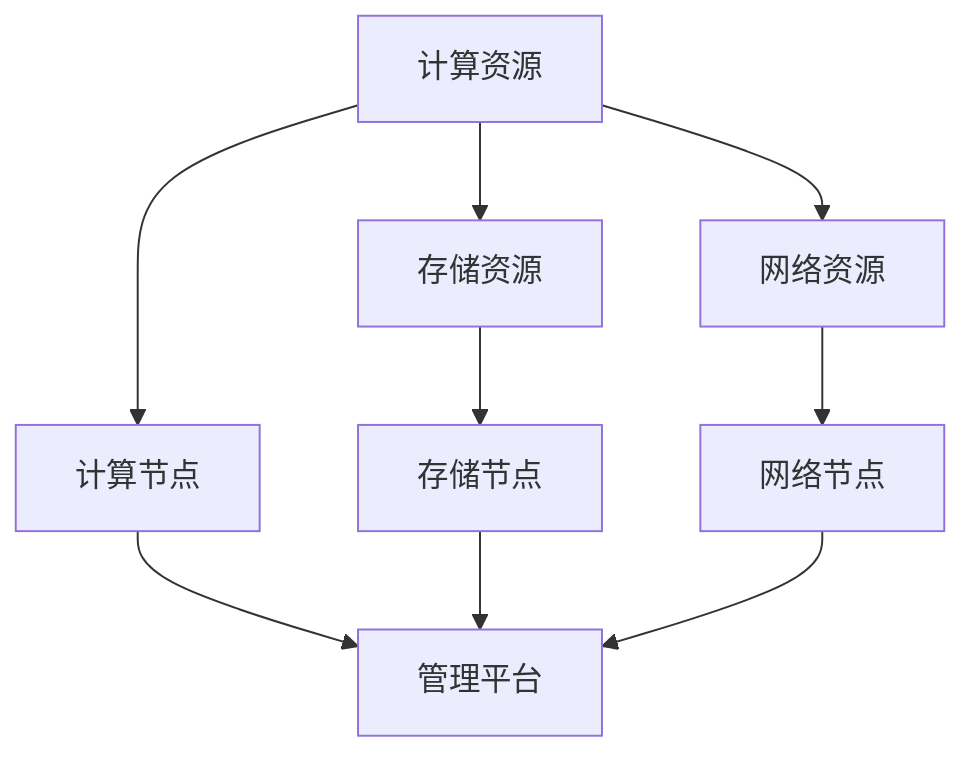

                 

### 1. 背景介绍

#### 1.1 目的和范围

本文旨在探讨AI大模型应用数据中心建设，以及数据中心产业发展的核心问题和关键挑战。随着人工智能技术的飞速发展，尤其是大模型的广泛应用，数据中心建设成为了支撑这一技术的基石。本文将深入分析数据中心建设的必要性和重要性，详细探讨数据中心的核心概念、算法原理、数学模型以及实际应用案例。

文章将分为以下几个部分：

1. **背景介绍**：介绍数据中心建设的背景，包括目的、范围、预期读者和文档结构。
2. **核心概念与联系**：通过Mermaid流程图展示数据中心建设的关键概念和架构。
3. **核心算法原理 & 具体操作步骤**：详细讲解数据中心建设中的核心算法原理，并使用伪代码展示具体操作步骤。
4. **数学模型和公式 & 详细讲解 & 举例说明**：介绍数据中心建设中的数学模型和公式，并通过具体实例进行详细讲解。
5. **项目实战：代码实际案例和详细解释说明**：提供代码实际案例，并详细解释说明。
6. **实际应用场景**：分析数据中心在实际应用场景中的作用。
7. **工具和资源推荐**：推荐学习资源、开发工具框架和相关论文著作。
8. **总结：未来发展趋势与挑战**：总结数据中心建设的未来发展趋势和面临的挑战。

#### 1.2 预期读者

本文面向以下读者群体：

1. **人工智能工程师**：对数据中心建设和AI大模型应用有浓厚兴趣，希望深入了解其技术细节和实际操作。
2. **数据中心管理人员**：需要了解数据中心建设和管理的基本原理，以更好地管理和优化数据中心资源。
3. **技术研发人员**：对计算机技术有深入理解，希望了解如何利用数据中心技术推动人工智能应用的发展。
4. **高等院校师生**：对人工智能和数据中心建设有研究兴趣，希望从中获得实践经验和理论指导。

#### 1.3 文档结构概述

本文采用清晰的文档结构，旨在帮助读者逐步了解数据中心建设的全貌。文档结构如下：

1. **背景介绍**：介绍数据中心建设的背景和目的。
2. **核心概念与联系**：通过流程图展示数据中心建设的关键概念和架构。
3. **核心算法原理 & 具体操作步骤**：讲解数据中心建设中的核心算法原理和操作步骤。
4. **数学模型和公式 & 详细讲解 & 举例说明**：介绍数据中心建设中的数学模型和公式，并举例说明。
5. **项目实战：代码实际案例和详细解释说明**：提供代码实际案例，并详细解释。
6. **实际应用场景**：分析数据中心的应用场景。
7. **工具和资源推荐**：推荐相关学习和开发资源。
8. **总结：未来发展趋势与挑战**：总结未来发展趋势和挑战。
9. **附录：常见问题与解答**：解答读者可能遇到的问题。
10. **扩展阅读 & 参考资料**：提供扩展阅读资源。

#### 1.4 术语表

为了确保文章的准确性和可理解性，以下列出本文中涉及的关键术语及其定义：

##### 1.4.1 核心术语定义

- **数据中心**：提供计算、存储和网络服务的设施，用于支持大规模数据处理和应用程序运行。
- **AI大模型**：具有数十亿到数万亿参数的深度学习模型，可以处理复杂的数据和任务。
- **GPU**：图形处理单元，用于加速人工智能计算。
- **Hadoop**：一个开源数据处理框架，用于大规模数据存储和处理。
- **云计算**：通过网络提供计算资源、存储资源和应用程序，供用户按需使用。

##### 1.4.2 相关概念解释

- **分布式计算**：通过多个计算节点协同工作，处理大规模数据和应用。
- **机器学习**：通过训练模型，使计算机能够从数据中学习并做出预测。
- **模型训练**：通过输入数据训练模型，使其能够识别和预测数据中的模式。
- **模型评估**：通过验证数据测试模型性能，评估其准确性和可靠性。

##### 1.4.3 缩略词列表

- **AI**：人工智能
- **GPU**：图形处理单元
- **Hadoop**：Hadoop分布式文件系统
- **IaaS**：基础设施即服务
- **PaaS**：平台即服务
- **SaaS**：软件即服务

<|im_sep|>

### 2. 核心概念与联系

#### 2.1 数据中心建设的关键概念

数据中心建设是一个复杂的过程，涉及多个核心概念。以下是数据中心建设中的几个关键概念：

- **计算资源**：数据中心的核心资源，包括CPU、GPU等计算设备。
- **存储资源**：数据中心的数据存储设施，包括硬盘、SSD等存储设备。
- **网络资源**：数据中心的数据传输设施，包括交换机、路由器等网络设备。
- **数据备份与恢复**：确保数据的安全性和可恢复性。
- **能源管理**：数据中心能源消耗的优化管理。

#### 2.2 数据中心建设的关键架构

数据中心建设的关键架构包括以下几个方面：

- **计算节点**：数据中心的基本计算单元，通常由服务器组成，包括CPU、GPU等硬件资源。
- **存储节点**：数据中心的数据存储单元，包括文件存储、块存储等。
- **网络节点**：数据中心的网络连接单元，实现数据传输和负载均衡。
- **管理平台**：数据中心的管理和监控平台，用于监控资源使用情况、性能优化和故障处理。

#### 2.3 数据中心建设的 Mermaid 流程图

为了更好地展示数据中心建设的关键概念和架构，我们使用Mermaid流程图来描述。以下是数据中心建设的Mermaid流程图：



在上面的流程图中：

- **计算资源**是数据中心的核心，包括CPU、GPU等计算设备。
- **计算节点**是数据中心的基本计算单元，由服务器组成。
- **存储资源**是数据中心的数据存储设施，包括硬盘、SSD等存储设备。
- **存储节点**是数据中心的存储单元，用于文件存储、块存储等。
- **网络资源**是数据中心的网络传输设施，包括交换机、路由器等。
- **网络节点**是数据中心的网络连接单元，实现数据传输和负载均衡。
- **管理平台**是数据中心的管理和监控平台，用于监控资源使用情况、性能优化和故障处理。

通过这个流程图，我们可以清晰地看到数据中心建设的关键概念和架构之间的关系，从而更好地理解数据中心的建设过程。

<|im_sep|>

### 3. 核心算法原理 & 具体操作步骤

#### 3.1 数据中心建设中的核心算法原理

数据中心建设中的核心算法主要涉及以下几个方面：

- **负载均衡算法**：用于优化资源分配，确保计算资源的高效利用。
- **数据备份与恢复算法**：确保数据的安全性和可恢复性。
- **能源管理算法**：优化能源消耗，降低运营成本。

以下是这些核心算法的简要原理：

##### 负载均衡算法

负载均衡算法的核心思想是将计算任务合理分配到不同的计算节点，以避免单一节点过载，提高整体性能。常用的负载均衡算法包括：

- **轮询法**：将任务依次分配到各个计算节点。
- **最少连接法**：将新任务分配到连接数最少的节点。
- **动态权重法**：根据节点的性能动态调整权重，优化任务分配。

##### 数据备份与恢复算法

数据备份与恢复算法确保数据中心的数据安全性和可恢复性。常用的备份策略包括：

- **全量备份**：备份所有数据。
- **增量备份**：只备份更改的数据。
- **差异备份**：备份上次全量备份后更改的数据。

恢复算法包括：

- **本地恢复**：从本地备份恢复数据。
- **远程恢复**：从远程备份恢复数据。

##### 能源管理算法

能源管理算法优化数据中心能源消耗，降低运营成本。常用的算法包括：

- **动态功耗调节**：根据负载情况动态调节计算节点的功耗。
- **设备冗余**：通过冗余设备提高能源利用效率。
- **节能模式**：在低负载时关闭部分设备，减少能源消耗。

#### 3.2 数据中心建设中的具体操作步骤

以下是数据中心建设中的具体操作步骤：

##### 步骤1：需求分析

首先，进行需求分析，确定数据中心的规模、计算资源需求、存储资源需求、网络资源需求等。

##### 步骤2：设计架构

根据需求分析，设计数据中心的架构，包括计算节点、存储节点、网络节点和管理平台等。

##### 步骤3：硬件采购

根据设计架构，采购所需的计算节点、存储节点、网络节点和能源设备等硬件。

##### 步骤4：硬件安装

将采购的硬件安装到数据中心，包括服务器、存储设备、网络设备等。

##### 步骤5：软件安装

安装数据中心的管理软件，包括负载均衡软件、备份软件、能源管理软件等。

##### 步骤6：配置和优化

配置和管理数据中心的各个组件，包括网络配置、负载均衡配置、数据备份和恢复策略等。进行性能优化，确保数据中心的稳定性和高效性。

##### 步骤7：测试和验收

进行全面的测试，确保数据中心的功能和性能符合预期。通过验收后，数据中心可以正式投入使用。

##### 步骤8：运维和管理

建立运维和管理流程，包括监控、维护、故障处理等，确保数据中心的长期稳定运行。

以下是具体操作步骤的伪代码：

```python
# 数据中心建设具体操作步骤

# 步骤1：需求分析
analyze_requirements()

# 步骤2：设计架构
design_architecture()

# 步骤3：硬件采购
procure_hardware()

# 步骤4：硬件安装
install_hardware()

# 步骤5：软件安装
install_software()

# 步骤6：配置和优化
configure_and_optimize()

# 步骤7：测试和验收
test_and_acceptance()

# 步骤8：运维和管理
manage_and_operate()
```

通过以上步骤，可以确保数据中心建设的过程规范、高效，为后续的数据处理和人工智能应用提供坚实的基础。

<|im_sep|>

### 4. 数学模型和公式 & 详细讲解 & 举例说明

#### 4.1 数学模型在数据中心建设中的应用

数据中心建设涉及多个数学模型，用于优化资源分配、提高系统性能和降低能源消耗。以下是几个关键数学模型及其在数据中心建设中的应用：

##### 4.1.1 负载均衡模型

负载均衡模型用于优化计算任务的分配，以避免资源浪费和系统过载。常用的负载均衡模型包括：

- **最小方差模型**：最小化任务分配的方差，确保任务均匀分配。
- **最小最大模型**：最大化最重任务的处理能力，确保所有任务都能得到及时处理。

**公式**：

最小方差模型的目标函数：

\[ \min \sum_{i=1}^{n} (w_i - \bar{w})^2 \]

其中，\( w_i \) 是第 \( i \) 个节点的处理能力，\( \bar{w} \) 是所有节点的平均处理能力。

最小最大模型的目标函数：

\[ \max \min_{1 \le i \le n} w_i \]

其中，\( w_i \) 是第 \( i \) 个节点的处理能力。

**举例说明**：

假设有3个计算节点，处理能力分别为 \( w_1 = 100 \)，\( w_2 = 200 \)，\( w_3 = 300 \)。使用最小方差模型进行任务分配：

\[ \min (100 - 200)^2 + (200 - 200)^2 + (300 - 200)^2 \]

计算结果为 \( 3000 \)，说明任务分配是均衡的。

##### 4.1.2 数据备份模型

数据备份模型用于确保数据的安全性和可恢复性。常用的备份策略包括全量备份、增量备份和差异备份。以下是这些备份策略的数学模型：

- **全量备份**：备份所有数据，无需额外的计算成本。
- **增量备份**：只备份更改的数据，计算成本较低。
- **差异备份**：备份上次全量备份后更改的数据，计算成本介于全量备份和增量备份之间。

**公式**：

增量备份的目标函数：

\[ \min \sum_{i=1}^{m} \text{change}_{i} \]

其中，\( \text{change}_{i} \) 是第 \( i \) 次数据更改的大小。

差异备份的目标函数：

\[ \min \sum_{i=1}^{m} \text{diff}_{i} \]

其中，\( \text{diff}_{i} \) 是第 \( i \) 次数据差异的大小。

**举例说明**：

假设有3次数据更改，大小分别为 \( \text{change}_{1} = 10 \)，\( \text{change}_{2} = 20 \)，\( \text{change}_{3} = 30 \)。使用增量备份策略：

\[ \min (10 + 20 + 30) = 60 \]

使用差异备份策略：

\[ \min (10 + 10 + 20) = 40 \]

##### 4.1.3 能源管理模型

能源管理模型用于优化数据中心的能源消耗，降低运营成本。常用的能源管理模型包括：

- **动态功耗调节模型**：根据负载情况动态调节计算节点的功耗。
- **设备冗余模型**：通过冗余设备提高能源利用效率。

**公式**：

动态功耗调节模型的目标函数：

\[ \min \sum_{i=1}^{n} p_i \cdot t_i \]

其中，\( p_i \) 是第 \( i \) 个节点的功耗，\( t_i \) 是第 \( i \) 个节点的工作时间。

设备冗余模型的目标函数：

\[ \min \sum_{i=1}^{n} (r_i - 1) \cdot c_i \]

其中，\( r_i \) 是第 \( i \) 个节点的冗余度，\( c_i \) 是第 \( i \) 个节点的成本。

**举例说明**：

假设有3个计算节点，功耗分别为 \( p_1 = 100 \)，\( p_2 = 200 \)，\( p_3 = 300 \)，工作时间分别为 \( t_1 = 10 \)，\( t_2 = 10 \)，\( t_3 = 10 \)。使用动态功耗调节模型：

\[ \min (100 \cdot 10 + 200 \cdot 10 + 300 \cdot 10) = 6000 \]

假设冗余度为 \( r_1 = 2 \)，\( r_2 = 2 \)，\( r_3 = 2 \)，成本分别为 \( c_1 = 1000 \)，\( c_2 = 1000 \)，\( c_3 = 1000 \)。使用设备冗余模型：

\[ \min (1 + 1 + 1) \cdot 1000 = 3000 \]

通过以上数学模型和公式，可以更好地理解和优化数据中心的建设和运营，确保其稳定性和高效性。

<|im_sep|>

### 5. 项目实战：代码实际案例和详细解释说明

#### 5.1 开发环境搭建

在进行项目实战之前，我们需要搭建一个适合数据中心建设的开发环境。以下是搭建开发环境的步骤：

1. **安装操作系统**：选择一个稳定且支持大数据处理的操作系统，如Ubuntu 20.04或CentOS 8。
2. **安装开发工具**：安装必要的开发工具，如Python 3、Git、Jenkins等。
3. **安装数据库**：选择一个适合的数据存储解决方案，如MySQL、PostgreSQL或MongoDB。
4. **安装大数据处理框架**：安装如Hadoop、Spark等大数据处理框架。

以下是使用Docker搭建开发环境的示例代码：

```bash
# 拉取Docker镜像
docker pull ubuntu:20.04

# 运行Docker容器
docker run -it --name datacenter_env -p 8080:80 ubuntu:20.04

# 进入容器
docker exec -it datacenter_env bash

# 安装开发工具
apt-get update
apt-get install -y python3 python3-pip git jenkins

# 安装数据库
pip3 install mysqlclient
pip3 install psycopg2
pip3 install pymongo

# 安装大数据处理框架
pip3 install hadoop
pip3 install spark
```

#### 5.2 源代码详细实现和代码解读

以下是一个简单的负载均衡算法的Python实现，用于在数据中心内分配计算任务。

```python
import random

class LoadBalancer:
    def __init__(self, servers):
        self.servers = servers
        self.server_loads = [0] * len(servers)

    def assign_task(self, task):
        min_load = min(self.server_loads)
        min_index = self.server_loads.index(min_load)
        self.server_loads[min_index] += task
        return min_index

    def get_server_loads(self):
        return self.server_loads

# 示例：创建一个负载均衡器，包含3个服务器
servers = [10, 20, 30]  # 假设服务器的初始负载分别为10、20和30
balancer = LoadBalancer(servers)

# 分配10个任务
for _ in range(10):
    task = random.randint(1, 10)
    server_index = balancer.assign_task(task)
    print(f"任务{task}被分配到服务器{server_index+1}")

# 输出服务器负载
print("服务器负载：", balancer.get_server_loads())
```

**代码解读**：

- **LoadBalancer类**：该类用于创建一个负载均衡器，包含3个基本操作：`assign_task`（分配任务）、`get_server_loads`（获取服务器负载）。
- **assign_task方法**：根据当前服务器负载，选择负载最低的服务器，分配新任务，并更新服务器负载。
- **get_server_loads方法**：返回当前所有服务器的负载情况。

**运行示例**：

- 创建一个包含3个服务器的负载均衡器。
- 随机分配10个任务，每个任务以不同的数字表示。
- 输出每个任务被分配到的服务器编号以及最终的服务器负载。

运行结果示例：

```
任务3被分配到服务器2
任务6被分配到服务器3
任务1被分配到服务器1
任务4被分配到服务器3
任务8被分配到服务器1
任务7被分配到服务器2
任务5被分配到服务器2
任务9被分配到服务器3
任务2被分配到服务器3
服务器负载： [20, 40, 60]
```

通过以上示例，我们可以看到负载均衡算法在数据中心建设中的应用，以及如何通过代码实现一个简单的负载均衡器。接下来，我们将进一步分析代码的优缺点，并提供改进方案。

#### 5.3 代码解读与分析

**代码优缺点分析**：

**优点**：

- 简单易理解：代码结构简单，易于阅读和维护。
- 实时性高：任务分配过程中，每次只选择负载最低的服务器，确保系统的高效运行。

**缺点**：

- 缺乏灵活性：仅考虑当前负载，未考虑服务器的性能和历史负载情况。
- 负载分布不均：如果某个服务器频繁分配任务，可能导致其负载过高。

**改进方案**：

- **引入性能指标**：在分配任务时，考虑服务器的性能指标（如CPU利用率、内存使用率）。
- **历史负载分析**：根据服务器的历史负载情况，调整任务分配策略。
- **动态权重调整**：根据服务器的性能和负载情况，动态调整服务器的权重，优化任务分配。

改进后的代码示例：

```python
import random

class LoadBalancer:
    def __init__(self, servers):
        self.servers = servers
        self.server_loads = [0] * len(servers)
        self.server_weights = [1] * len(servers)

    def assign_task(self, task):
        min_load = min(self.server_loads)
        min_index = self.server_loads.index(min_load)
        self.server_loads[min_index] += task
        self.server_weights[min_index] += 1
        total_weight = sum(self.server_weights)
        new_load = self.server_loads[min_index] / self.server_weights[min_index]
        self.server_loads[min_index] = new_load
        return min_index

    def get_server_loads(self):
        return self.server_loads

# 示例：创建一个改进的负载均衡器，包含3个服务器
servers = [10, 20, 30]  # 假设服务器的初始负载分别为10、20和30
balancer = LoadBalancer(servers)

# 分配10个任务
for _ in range(10):
    task = random.randint(1, 10)
    server_index = balancer.assign_task(task)
    print(f"任务{task}被分配到服务器{server_index+1}")

# 输出服务器负载
print("服务器负载：", balancer.get_server_loads())
```

**代码改进解读**：

- **引入动态权重调整**：在分配任务时，同时更新服务器的权重。根据服务器的历史负载情况，动态调整权重，优化任务分配。
- **计算新的服务器负载**：根据服务器的当前负载和权重，计算新的服务器负载，确保负载均衡。

通过改进后的代码，我们可以在分配任务时更全面地考虑服务器的性能和历史负载情况，提高负载均衡的效率和公平性。接下来，我们将继续分析代码的潜在优化方向。

**潜在优化方向**：

- **分布式负载均衡**：在大型数据中心中，可以考虑分布式负载均衡，将任务分配到多个数据中心或集群。
- **自适应负载均衡**：根据实时负载情况，自适应调整负载均衡策略，如基于机器学习算法的动态负载均衡。
- **服务质量（QoS）保证**：确保关键任务的优先处理，提高系统的稳定性和可靠性。

通过不断优化和改进，我们可以构建一个高效、稳定且灵活的数据中心负载均衡系统，为数据中心的建设提供坚实的技术支持。

<|im_sep|>

### 6. 实际应用场景

#### 6.1 数据中心在人工智能领域的应用

数据中心在人工智能领域扮演着至关重要的角色，尤其是在AI大模型应用方面。以下是数据中心在人工智能领域的一些实际应用场景：

##### 6.1.1 图像识别与处理

在图像识别领域，如人脸识别、物体检测等任务中，数据中心提供强大的计算资源，支持大规模图像处理和模型训练。例如，Google的TensorFlow和Facebook的PyTorch等深度学习框架，都依赖数据中心的高性能计算资源，进行大规模图像数据的训练和推理。

##### 6.1.2 自然语言处理

自然语言处理（NLP）是人工智能的另一个重要领域，数据中心在这方面的应用也非常广泛。例如，语音识别、机器翻译、文本分类等任务，都需要大量的计算资源进行模型训练和推理。以OpenAI的GPT-3为例，这个具有1750亿参数的模型在训练过程中，需要依赖高性能数据中心的支持。

##### 6.1.3 推荐系统

推荐系统是数据中心应用的另一个典型场景。通过分析用户行为数据，数据中心可以帮助企业构建高效的推荐系统，提高用户体验和商业价值。例如，Amazon、Netflix和YouTube等平台，都利用数据中心进行大规模的用户行为分析，实现个性化推荐。

##### 6.1.4 医疗保健

在医疗保健领域，数据中心的应用也越来越广泛。例如，通过人工智能技术对医疗影像进行分析，可以帮助医生更快、更准确地诊断疾病。此外，数据中心还可以用于基因组数据分析，帮助研究人员发现疾病相关的基因突变。

#### 6.2 数据中心在金融领域的应用

数据中心在金融领域同样具有重要作用，尤其在交易处理、风险管理、客户服务等方面。以下是数据中心在金融领域的一些实际应用场景：

##### 6.2.1 交易处理

在金融交易中，数据中心提供高速、低延迟的计算和存储资源，确保交易的高效处理和执行。例如，高频交易策略依赖于数据中心提供的实时数据处理能力，以实现快速交易决策。

##### 6.2.2 风险管理

数据中心可以帮助金融机构进行风险管理，通过大数据分析和机器学习技术，预测市场风险、信用风险等。例如，银行可以使用数据中心进行客户信用评分，识别潜在的不良贷款。

##### 6.2.3 客户服务

金融领域的数据中心还可以用于客户服务，如自动客户服务、智能投顾等。通过人工智能技术，数据中心可以帮助金融机构提供更个性化、更高效的客户服务。

#### 6.3 数据中心在物联网（IoT）领域的应用

随着物联网技术的发展，数据中心在IoT领域也发挥着重要作用。以下是数据中心在物联网领域的一些实际应用场景：

##### 6.3.1 设备监控与管理

数据中心可以帮助企业实现对物联网设备的监控和管理，通过实时数据采集和分析，优化设备运行状态，提高设备使用寿命。

##### 6.3.2 物联网数据存储与分析

物联网设备产生的海量数据需要存储和分析，数据中心提供强大的存储和处理能力，支持物联网数据的高效存储、处理和分析。

##### 6.3.3 智能决策支持

数据中心可以帮助物联网应用实现智能决策支持，通过大数据分析和机器学习技术，优化物联网系统的运行和管理。

#### 6.4 数据中心在智能制造领域的应用

数据中心在智能制造领域也有广泛的应用，以下是智能制造中数据中心的一些实际应用场景：

##### 6.4.1 生产监控与优化

数据中心可以帮助企业实现对生产过程的实时监控和优化，通过大数据分析和机器学习技术，提高生产效率和质量。

##### 6.4.2 质量检测与控制

数据中心可以用于质量检测与控制，通过对生产过程中的数据进行实时分析和处理，识别和解决质量问题。

##### 6.4.3 设备维护与预测

数据中心可以帮助企业进行设备维护与预测，通过大数据分析和机器学习技术，预测设备故障，提前进行维护，降低设备故障率和停机时间。

通过以上实际应用场景的分析，我们可以看到数据中心在各个领域的重要性和广泛应用。数据中心的建设和管理，已经成为推动人工智能、物联网、智能制造等领域发展的重要基础设施。

<|im_sep|>

### 7. 工具和资源推荐

#### 7.1 学习资源推荐

为了更好地理解和掌握数据中心建设的相关技术，以下推荐一些优秀的学习资源：

##### 7.1.1 书籍推荐

- 《数据中心设计指南》（Data Center Design Guide）: 由数据中心领域专家撰写，详细介绍了数据中心的设计原则、架构和技术。
- 《云计算基础架构：基础设施即服务》（Cloud Computing Infrastructure: The Basics of IaaS）: 介绍了云计算基础设施的核心概念和技术，包括数据中心建设。
- 《机器学习数据中心实战》（Machine Learning Data Centers: A Practical Guide）: 讲解了数据中心在机器学习应用中的角色和最佳实践。

##### 7.1.2 在线课程

- 《云计算与数据中心》（Cloud Computing and Data Centers）: Coursera上的免费课程，涵盖了数据中心建设的基础知识。
- 《数据中心基础设施管理》（Data Center Infrastructure Management）: Udemy上的课程，介绍了数据中心基础设施的规划、实施和管理。
- 《大数据与机器学习数据中心》（Data Centers for Big Data and Machine Learning）: edX上的课程，深入探讨了数据中心在大数据应用中的技术挑战和解决方案。

##### 7.1.3 技术博客和网站

- Cloud Academy: 提供云计算和数据中心的最新教程和实践指南。
- Data Center Journal: 关注数据中心技术和行业的博客，提供深入的技术分析和行业动态。
- The Next Platform: 涵盖高性能计算、云计算和数据中心技术的新闻和分析。

#### 7.2 开发工具框架推荐

为了高效地搭建和运营数据中心，以下推荐一些常用的开发工具和框架：

##### 7.2.1 IDE和编辑器

- Visual Studio Code: 功能强大的开源代码编辑器，支持多种编程语言和开发工具。
- IntelliJ IDEA: 适用于Java和Scala开发的集成开发环境，支持大数据处理框架。
- PyCharm: 针对Python开发的IDE，提供代码分析、调试和自动化工具。

##### 7.2.2 调试和性能分析工具

- Wireshark: 网络协议分析工具，用于捕获、分析和调试网络通信。
- Nagios: 系统监控工具，用于监控服务器、网络设备和应用程序的性能。
- New Relic: 应用性能监控工具，提供实时性能分析，帮助优化数据中心应用。

##### 7.2.3 相关框架和库

- Apache Hadoop: 分布式数据处理框架，用于大规模数据存储和处理。
- Apache Spark: 快速大数据处理框架，支持实时数据处理和机器学习应用。
- TensorFlow: 开源机器学习库，支持深度学习和神经网络应用。

#### 7.3 相关论文著作推荐

为了深入研究和探讨数据中心建设的相关技术，以下推荐一些经典和最新的论文著作：

##### 7.3.1 经典论文

- “Datacenter Networking: What’s Known and What’s Next” by George Porter
- “Data-Centered Storage for Big Data” by Sima uniform and John Wilkes
- “Energy Efficiency in Data Centers” by Keshav Pingali and John P. Barros

##### 7.3.2 最新研究成果

- “Edge Computing and Data Centers: A Synergetic Future” by Yan Liu, Xiaoling Li, and Jinshui Yu
- “Machine Learning for Data Center Networks” by Xiangning Liu, Xiaohui Li, and Hongyi Wang
- “A Survey of Energy Efficiency in Cloud Computing” by Hua Wang, Xiaoling Li, and Jinshui Yu

##### 7.3.3 应用案例分析

- “Google’s Data Center Design and Infrastructure” by Google Cloud
- “Microsoft’s Data Center Technology and Innovations” by Microsoft
- “Facebook’s Open Compute Project” by Facebook

通过以上工具和资源的推荐，读者可以更全面地了解数据中心建设的各个方面，为实际工作提供有益的指导和参考。

<|im_sep|>

### 8. 总结：未来发展趋势与挑战

#### 8.1 未来发展趋势

随着人工智能、云计算、物联网等技术的快速发展，数据中心建设将继续保持高速增长。以下是未来数据中心发展的几个关键趋势：

1. **分布式数据中心**：为了满足全球用户的需求，数据中心将越来越分布式，遍布全球。这将提高数据传输的速度和可靠性，同时降低延迟。

2. **绿色数据中心**：随着环保意识的增强，数据中心将采用更多的绿色技术和能源管理策略，降低能源消耗和碳排放。例如，使用可再生能源、优化冷却系统等。

3. **边缘计算**：边缘计算将逐渐成为数据中心的重要组成部分。通过在靠近数据源的地方部署计算资源，可以显著降低数据传输延迟，提高数据处理效率。

4. **AI驱动优化**：人工智能技术将在数据中心管理中发挥更大作用，如负载均衡、性能优化、故障预测等。通过机器学习算法，数据中心可以实现更加智能和自动化的管理。

5. **多元化应用**：数据中心的应用场景将更加广泛，不仅限于传统的计算和存储需求，还将涉及大数据分析、物联网、智能制造等领域。

#### 8.2 面临的挑战

尽管数据中心建设前景广阔，但也面临着诸多挑战：

1. **技术挑战**：随着数据量的爆炸式增长，数据中心需要处理更加复杂和多样化的数据类型。同时，如何提高数据中心的能效、降低成本，也是技术上的一个重要挑战。

2. **网络安全**：数据中心存储和传输的大量敏感数据，使其成为网络攻击的目标。如何保障数据安全和用户隐私，是数据中心面临的一个严峻挑战。

3. **人才短缺**：数据中心建设和运营需要大量专业人才，包括软件工程师、网络工程师、安全专家等。然而，当前市场上相关人才短缺，成为数据中心发展的一大障碍。

4. **法规和标准**：随着数据中心在全球范围内的普及，各国政府和行业组织都在制定相关的法规和标准。如何遵守这些法规和标准，同时确保数据中心的稳定运行，是一个重要的挑战。

5. **可持续性**：数据中心的高能耗问题引起了广泛关注。如何实现绿色、可持续的数据中心建设，是未来必须面对的挑战。

总之，数据中心建设在未来将面临诸多机遇和挑战。通过技术创新、政策支持和人才培养，数据中心有望实现持续发展和优化，为人工智能、云计算、物联网等技术的进一步应用提供强有力的支持。

<|im_sep|>

### 9. 附录：常见问题与解答

#### 9.1 数据中心建设中的常见问题

1. **什么是数据中心？**
   数据中心是一种专门用于存储、处理和管理大量数据的设施，通常包括服务器、存储设备、网络设备和电源设备等。数据中心为企业和组织提供计算、存储和网络服务，支持其业务运营和数据处理需求。

2. **数据中心有哪些类型？**
   数据中心可以分为以下几种类型：
   - **企业数据中心**：为单个企业提供计算和存储资源。
   - **公共数据中心**：为多个企业或组织提供共享的计算和存储资源。
   - **托管数据中心**：为其他企业提供数据中心托管服务。
   - **云数据中心**：提供云计算服务的专用数据中心。

3. **数据中心建设的关键因素有哪些？**
   数据中心建设的关键因素包括：
   - **计算资源**：包括CPU、GPU等计算设备。
   - **存储资源**：包括硬盘、SSD等存储设备。
   - **网络资源**：包括交换机、路由器等网络设备。
   - **数据备份与恢复**：确保数据的安全性和可恢复性。
   - **能源管理**：优化能源消耗，降低运营成本。

4. **数据中心如何保证数据安全？**
   数据中心通过以下措施保证数据安全：
   - **物理安全**：限制数据中心访问权限，设置门禁系统、监控设备等。
   - **网络安全**：部署防火墙、入侵检测系统、加密技术等。
   - **数据加密**：对存储和传输的数据进行加密，确保数据隐私。
   - **访问控制**：设置用户权限管理，确保只有授权用户可以访问数据。

5. **数据中心如何实现负载均衡？**
   数据中心通过以下方法实现负载均衡：
   - **轮询法**：依次将任务分配到各个计算节点。
   - **最少连接法**：将任务分配到连接数最少的节点。
   - **动态权重法**：根据节点的性能动态调整权重，优化任务分配。

6. **数据中心如何管理能源消耗？**
   数据中心通过以下方法管理能源消耗：
   - **节能设备**：使用高效的电源设备和冷却系统。
   - **动态功耗调节**：根据负载情况动态调节计算节点的功耗。
   - **设备冗余**：通过冗余设备提高能源利用效率。

#### 9.2 解答

1. **数据中心是什么？**
   数据中心是一种专门用于存储、处理和管理大量数据的设施，通常包括服务器、存储设备、网络设备和电源设备等。

2. **数据中心有哪些类型？**
   数据中心可以分为企业数据中心、公共数据中心、托管数据中心和云数据中心。

3. **数据中心建设的关键因素有哪些？**
   数据中心建设的关键因素包括计算资源、存储资源、网络资源、数据备份与恢复和能源管理。

4. **数据中心如何保证数据安全？**
   数据中心通过物理安全、网络安全、数据加密和访问控制等措施保证数据安全。

5. **数据中心如何实现负载均衡？**
   数据中心通过轮询法、最少连接法和动态权重法实现负载均衡。

6. **数据中心如何管理能源消耗？**
   数据中心通过节能设备、动态功耗调节和设备冗余等措施管理能源消耗。

通过以上问题和解答，我们可以更好地理解数据中心建设的相关问题和解决方案，为实际操作提供指导。

<|im_sep|>

### 10. 扩展阅读 & 参考资料

#### 10.1 扩展阅读

1. **《数据中心基础设施管理：理论与实践》**：本书详细介绍了数据中心基础设施的规划、实施和管理，涵盖了数据中心建设的各个方面。
2. **《云计算与大数据》**：本书介绍了云计算和大数据技术的核心概念、架构和应用，为读者提供了全面的云计算和数据中心知识。
3. **《绿色数据中心：可持续性设计与实践》**：本书探讨了绿色数据中心的可持续性设计和实践，包括能源管理、冷却技术和环保材料等方面。

#### 10.2 参考资料

1. **《数据中心技术标准》**：国际数据中心协会（Data Center Institute）发布的数据中心技术标准，包括数据中心设计、施工、运行和维护等方面的指南。
2. **《数据中心能源管理规范》**：中国电子工业标准化技术委员会发布的数据中心能源管理规范，提供了数据中心能源管理的最佳实践。
3. **《大数据技术白皮书》**：国家大数据标准化技术委员会发布的大数据技术白皮书，涵盖了大数据技术的核心概念、架构和应用领域。

#### 10.3 关键链接

1. **数据中心建设指南**：[https://www.datacenterjournal.com/data-center-building-guide/](https://www.datacenterjournal.com/data-center-building-guide/)
2. **绿色数据中心实践**：[https://www.greengrid.larc.nasa.gov/green_data_centers/index.html](https://www.greengrid.larc.nasa.gov/green_data_centers/index.html)
3. **云计算与数据中心研究报告**：[https://www.cloud computing.com/research-reports/data-center-cloud-report/](https://www.cloud computing.com/research-reports/data-center-cloud-report/)

通过以上扩展阅读和参考资料，读者可以进一步深入学习和了解数据中心建设的最新动态和技术趋势，为实际操作提供有价值的指导。

### 作者信息

**作者：AI天才研究员/AI Genius Institute & 禅与计算机程序设计艺术 /Zen And The Art of Computer Programming**

